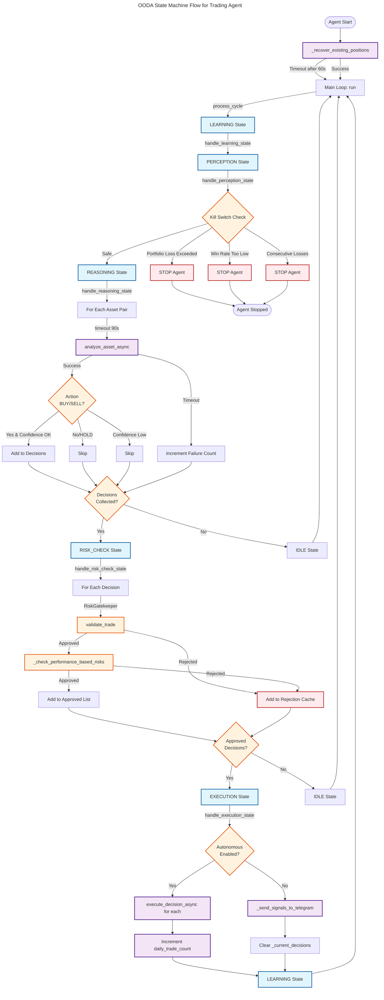
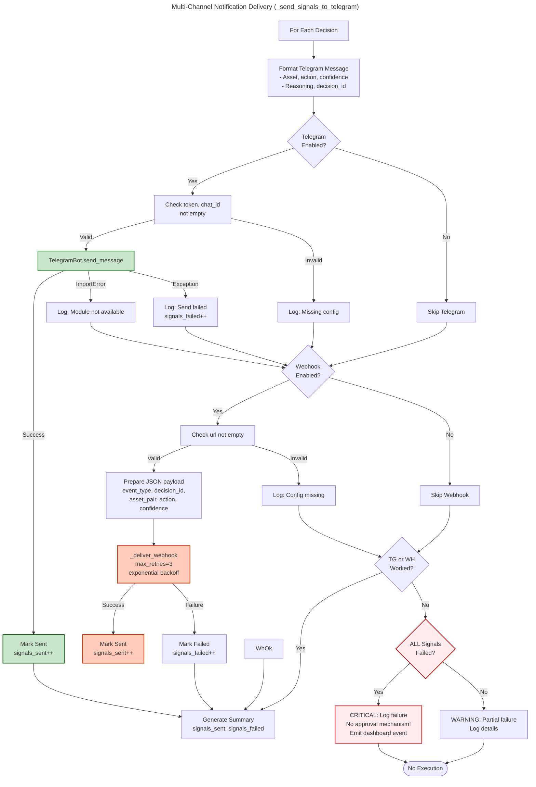

# C4 Code Level: Agent

## Overview
- **Name**: Autonomous Trading Agent with State-Machine OODA Loop
- **Description**: Core agent module implementing the Observe-Orient-Decide-Act (OODA) loop for autonomous and signal-only trading. Manages trading loop execution, configuration, state transitions, risk validation, performance tracking, and notification delivery.
- **Location**: `finance_feedback_engine/agent/`
- **Language**: Python 3.11+
- **Purpose**: Provides the main orchestration engine for automated trading decisions, including configuration management, state machine execution, risk gatekeeper integration, performance metrics tracking, and multi-channel notification delivery (Telegram, webhooks)

## Architecture Overview

This module follows a procedural/functional architecture with:
- **Configuration Layer**: `TradingAgentConfig` and `AutonomousAgentConfig` using Pydantic for validation
- **State Machine Core**: `TradingLoopAgent` implementing OODA cycle via 6 state handlers
- **Async Event Loop**: Built on Python asyncio for non-blocking execution and event handling
- **Integration Points**: Connections to DecisionEngine, RiskGatekeeper, TradeMonitor, PortfolioMemoryEngine, and TradingPlatform

## Code Elements

### Classes

#### `AutonomousAgentConfig`
**Location**: `finance_feedback_engine/agent/config.py:1-3`

**Purpose**: Configuration model for autonomous trading execution parameters.

**Description**: Pydantic BaseModel that defines autonomous execution behavior settings. Used as a nested configuration within `TradingAgentConfig`.

**Attributes**:
- `enabled: bool` (default: False) - Enable/disable autonomous trade execution
- `profit_target: float` (default: 0.05) - Profit target as decimal fraction (5%)
- `stop_loss: float` (default: 0.02) - Stop loss as decimal fraction (2%)

**Dependencies**:
- `pydantic.BaseModel`

---

#### `TradingAgentConfig`
**Location**: `finance_feedback_engine/agent/config.py:6-170`

**Purpose**: Master configuration model for the trading agent system with comprehensive risk, execution, and operational controls.

**Description**: Pydantic BaseModel that defines all trading agent behavior parameters. Features percentage field auto-normalization (values >1 treated as percentages and divided by 100) and comprehensive validation with field bounds.

**Key Configuration Categories**:

**Execution Controls**:
- `autonomous_execution: bool` (default: False) - Legacy autonomous mode flag
- `approval_policy: Literal["always", "never", "on_new_asset"]` (default: "on_new_asset") - Decision approval policy
- `max_daily_trades: int` (default: 5) - Maximum trades per day
- `kill_switch_gain_pct: float` (default: 0.05) - Portfolio gain threshold to stop trading
- `kill_switch_loss_pct: float` (default: 0.02) - Portfolio loss threshold to stop trading
- `autonomous: AutonomousAgentConfig` - Nested autonomous execution config

**Strategic Goals**:
- `strategic_goal: Literal["growth", "capital_preservation", "balanced"]` (default: "balanced")
- `risk_appetite: Literal["low", "medium", "high"]` (default: "medium")
- `max_drawdown_percent: float` (default: 0.15, auto-normalized) - Maximum portfolio drawdown

**Risk Management**:
- `risk_percentage: float` (default: 0.01) - Account risk per trade
- `sizing_stop_loss_percentage: float` (default: 0.02) - Stop loss for position sizing
- `correlation_threshold: float` (default: 0.7, bounds: [0.0, 1.0]) - Asset correlation threshold
- `max_correlated_assets: int` (default: 2, >0) - Max correlated positions
- `max_var_pct: float` (default: 0.05, bounds: [0.0, 1.0]) - Max portfolio VaR percentage
- `var_confidence: float` (default: 0.95, bounds: (0.0, 1.0)) - VaR confidence level

**Data & Analysis Controls**:
- `asset_pairs: List[str]` (default: ["BTCUSD", "ETHUSD"]) - Asset pairs to trade
- `analysis_frequency_seconds: int` (default: 300) - Analysis cycle frequency
- `monitoring_frequency_seconds: int` (default: 60) - Trade monitoring frequency
- `min_confidence_threshold: float` (default: 70.0, auto-normalized to 0.70) - Minimum confidence to execute
- `watchlist: List[str]` (default: ["BTCUSD", "ETHUSD", "EURUSD"]) - Assets to monitor

**Timing Controls**:
- `reasoning_retry_delay_seconds: int` (default: 60) - Retry delay for analysis failures
- `reasoning_failure_decay_seconds: int` (default: 3600) - Time-based failure reset
- `main_loop_error_backoff_seconds: int` (default: 300) - Error backoff time

**Field Validators**:
- `normalize_percentage_fields(v)` - Normalizes percentage-like fields (>1 becomes decimal)
- `normalize_default_percentages(self)` - Normalizes defaults via model validator
- `normalize_min_confidence(cls, v)` - Specific normalization for min_confidence_threshold

**Model Config**:
- `validate_default=True` - Ensures field validators run on default values

**Dependencies**:
- `pydantic.BaseModel`
- `pydantic.Field`
- `pydantic.field_validator`
- `pydantic.model_validator`
- `typing.List, Literal`

---

#### `AgentState`
**Location**: `finance_feedback_engine/agent/trading_loop_agent.py:18-32`

**Purpose**: Enum representing the 6 states of the OODA state machine.

**Description**: Enum using `auto()` for automatic value assignment. Defines the agent's operational states.

**States**:
1. `IDLE` - Marks end of OODA cycle, awaiting next interval
2. `PERCEPTION` - Fetching market data and performing safety checks
3. `REASONING` - Running DecisionEngine for analysis (with retry logic)
4. `RISK_CHECK` - Running RiskGatekeeper validation
5. `EXECUTION` - Sending orders or signals to Telegram
6. `LEARNING` - Processing closed trades for feedback

**Dependencies**:
- `enum.Enum`
- `enum.auto`

---

#### `TradingLoopAgent`
**Location**: `finance_feedback_engine/agent/trading_loop_agent.py:33-1791`

**Purpose**: Core autonomous agent implementing OODA loop state machine for trading decision execution.

**Description**: Main orchestration class that runs a continuous trading loop based on state transitions. Manages:
- OODA cycle execution with 6 state handlers
- Risk validation via RiskGatekeeper
- Performance tracking and batch reviews (every 20 trades)
- Multi-channel notification (Telegram, webhooks)
- Position recovery on startup
- Kill-switch mechanisms (portfolio P&L, consecutive losses, win rate)

**Constructor**:
```python
def __init__(
    self,
    config: TradingAgentConfig,
    engine,  # FinanceFeedbackEngine instance
    trade_monitor: TradeMonitor,
    portfolio_memory: PortfolioMemoryEngine,
    trading_platform: BaseTradingPlatform,
) -> None
```

**Location**: `trading_loop_agent.py:38-145`

**Initializes**:
- Risk gatekeeper with percentage normalization
- Performance metrics dictionary (P&L, win rate, streaks, Sharpe ratio)
- Startup recovery tracking and position cache
- Rejection cache for cooldown management
- Dashboard event queue (100 max size)
- State machine handler map
- Notification config validation

---

### Public Methods

#### `supports_signal_only_mode() -> bool`
**Location**: `trading_loop_agent.py:147-170`

**Purpose**: Verify if agent can operate in signal-only mode (decisions sent to Telegram for approval).

**Returns**: `bool` - True if agent has required signal-only infrastructure

**Logic**:
1. Checks for `_send_signals_to_telegram()` method existence
2. Checks for `handle_execution_state()` method existence
3. Verifies execution handler respects autonomous flag

**Dependencies**:
- Self introspection (hasattr checks)

---

#### `async run()`
**Location**: `trading_loop_agent.py:565-613`

**Purpose**: Main trading loop orchestrator with initialization and continuous cycle execution.

**Behavior**:
1. Starts OpenTelemetry span for "agent.ooda.run"
2. Logs startup message and sets `is_running = True`
3. Records start time for uptime tracking
4. Calls `_recover_existing_positions()` with 60-second timeout
5. Enters infinite loop:
   - Calls `process_cycle()` for one OODA iteration
   - If cycle fails: back off for `main_loop_error_backoff_seconds`
   - If cycle succeeds: increment cycle counter, sleep for `analysis_frequency_seconds`
   - Catches `asyncio.CancelledError` for graceful shutdown

**Location**: `trading_loop_agent.py:565-613`

**Returns**: None (runs indefinitely)

**Error Handling**:
- Catches `asyncio.CancelledError` for graceful shutdown
- Catches general exceptions for error backoff

**Dependencies**:
- `asyncio.sleep()`
- `asyncio.wait_for()` (60s timeout on recovery)
- `process_cycle()` method
- `_recover_existing_positions()` method
- OpenTelemetry tracing

---

#### `async process_cycle() -> bool`
**Location**: `trading_loop_agent.py:1725-1785`

**Purpose**: Execute one complete OODA cycle (LEARNING -> PERCEPTION -> REASONING -> RISK_CHECK -> EXECUTION -> IDLE).

**Behavior**:
1. Returns False if agent not running
2. Starts OpenTelemetry span "agent.ooda.cycle"
3. Sets initial state to LEARNING
4. Executes state machine loop (max 10 iterations):
   - Gets state handler from `state_handlers` map
   - Calls async handler
   - Records telemetry events
5. Returns True on successful completion, False on error

**Returns**: `bool` - True if cycle completed successfully, False if agent should stop

**State Loop**:
- LEARNING -> PERCEPTION -> REASONING -> RISK_CHECK -> EXECUTION -> IDLE
- Each transition logged and emitted to dashboard

**Error Handling**:
- Catches `asyncio.CancelledError` for cancellation
- Catches general exceptions and logs full traceback

**Dependencies**:
- `state_handlers` dictionary
- OpenTelemetry tracing

---

#### `get_performance_summary() -> dict[str, any]`
**Location**: `trading_loop_agent.py:1542-1568`

**Purpose**: Get agent's performance metrics summary for dashboards and reporting.

**Returns**: Dictionary with:
- `total_pnl: float` - Total realized P&L
- `total_trades: int` - Number of completed trades
- `winning_trades: int` - Number of profitable trades
- `losing_trades: int` - Number of unprofitable trades
- `win_rate: float` - Win rate percentage (0-100)
- `avg_win: float` - Average winning trade P&L
- `avg_loss: float` - Average losing trade P&L
- `current_streak: int` - Current win/loss streak (positive for wins, negative for losses)
- `best_streak: int` - Best consecutive wins
- `worst_streak: int` - Worst consecutive losses
- `pnl_ratio: float` - Ratio of avg_win to avg_loss

**Dependencies**:
- `_performance_metrics` dictionary

---

#### `stop()`
**Location**: `trading_loop_agent.py:1787-1791`

**Purpose**: Stop the trading loop gracefully.

**Behavior**:
1. Logs stop message
2. Sets `is_running = False`
3. Sets `stop_requested = True`

**Dependencies**: None

---

### Private Methods - OODA State Handlers

#### `async handle_idle_state()`
**Location**: `trading_loop_agent.py:673-685`

**Purpose**: Final state of OODA cycle, marking completion and preparing for next cycle.

**Behavior**:
1. Starts OpenTelemetry span "agent.ooda.idle"
2. Logs completion message
3. Transitions to LEARNING state (beginning of next cycle)

**Transitions To**: `AgentState.LEARNING`

**Dependencies**:
- `_transition_to()` method
- OpenTelemetry tracing

---

#### `async handle_perception_state()`
**Location**: `trading_loop_agent.py:687-780`

**Purpose**: Gather market data and validate portfolio safety constraints (kill switches).

**Behavior**:
1. **Portfolio Kill Switch Check**: If portfolio loss <= -`kill_switch_loss_pct`, stop agent
2. **Performance Kill Switches**:
   - If current_streak < -5 (6+ losses): stop
   - If win_rate < 25% after 20+ trades: stop
   - If total_pnl < -15% of reference balance after 50+ trades: stop
3. **Daily Counter Reset**: If new day detected, reset `daily_trade_count` and failure tracking
4. Transitions to REASONING

**Transitions To**: `AgentState.REASONING` (or stops agent)

**Error Handling**: Catches exceptions from portfolio context retrieval, logs warning, continues

**Dependencies**:
- `trade_monitor.monitoring_context_provider.get_monitoring_context()`
- `_performance_metrics`
- `_transition_to()` method
- `stop()` method

---

#### `async handle_reasoning_state()`
**Location**: `trading_loop_agent.py:782-903`

**Purpose**: Run DecisionEngine for each asset pair with retry logic and time-based failure decay.

**Behavior**:
1. **Cleanup**: Calls `_cleanup_rejected_cache()` to remove expired rejections
2. **Failure Decay**: Resets failures older than `reasoning_failure_decay_seconds`
3. **Asset Analysis Loop** (for each in `config.asset_pairs`):
   - Skip if recently rejected (within cooldown period)
   - Skip if exceeded MAX_RETRIES (5) for this asset
   - Call `engine.analyze_asset()` or `engine.analyze_asset_async()` with 90-second timeout
   - If action is BUY/SELL and passes `_should_execute()` check: add to `_current_decisions`
   - Reset failure count on success
   - On timeout/error: increment failure count and timestamp
4. **Transition Decision**:
   - If `_current_decisions` not empty: transition to RISK_CHECK
   - Else: transition to IDLE

**Transitions To**: `AgentState.RISK_CHECK` (if decisions) or `AgentState.IDLE`

**Timeout**: 90 seconds per asset analysis

**Error Handling**:
- Catches `asyncio.TimeoutError` and logs warning
- Catches general exceptions and logs error with traceback
- Accumulates failure counts for failure-based skipping

**Dependencies**:
- `engine.analyze_asset()` or `engine.analyze_asset_async()`
- `_should_execute()` method
- `_cleanup_rejected_cache()` method
- `_transition_to()` method
- `_current_decisions` list

---

#### `async handle_risk_check_state()`
**Location**: `trading_loop_agent.py:905-1007`

**Purpose**: Validate all collected decisions through RiskGatekeeper and performance-based checks.

**Behavior**:
1. **Early Exit**: If no decisions, transition to IDLE
2. **Per-Decision Validation**:
   - Get monitoring context for asset pair
   - Enrich context with safety thresholds from config
   - Run `risk_gatekeeper.validate_trade()` - returns (approved, reason)
   - If approved, run `_check_performance_based_risks()` for additional checks
   - If approved: add to `approved_decisions`, emit "decision_approved" event
   - If rejected: add to rejection cache, emit "decision_rejected" event
3. **Update**: Replace `_current_decisions` with approved_decisions only
4. **Transition**:
   - If approved decisions exist: transition to EXECUTION
   - Else: transition to IDLE

**Transitions To**: `AgentState.EXECUTION` (if approved) or `AgentState.IDLE`

**Error Handling**:
- Catches exceptions from monitoring context retrieval
- Falls back to default safety config values

**Dashboard Events**:
- `decision_approved`: asset, action, confidence, reasoning (first 200 chars), timestamp
- `decision_rejected`: asset, action, reason, timestamp

**Dependencies**:
- `trade_monitor.monitoring_context_provider.get_monitoring_context()`
- `risk_gatekeeper.validate_trade()`
- `_check_performance_based_risks()` method
- `_transition_to()` method
- `_emit_dashboard_event()` method
- `_current_decisions` list

---

#### `async handle_execution_state()`
**Location**: `trading_loop_agent.py:1084-1148`

**Purpose**: Execute approved trades or send signals to Telegram based on mode.

**Behavior**:
1. **Early Exit**: If no decisions, transition to IDLE
2. **Mode Check**: Determine autonomous_enabled (prioritize `config.autonomous.enabled` over legacy flag)
3. **Autonomous Mode** (if enabled):
   - For each decision: call `engine.execute_decision_async(decision_id)`
   - On success: increment `daily_trade_count`, associate with trade_monitor
   - On failure: log error
4. **Signal-Only Mode** (if disabled):
   - Call `_send_signals_to_telegram()` to deliver decisions to Telegram
5. **Cleanup**: Clear `_current_decisions` list
6. **Transition**: Always transitions to LEARNING

**Transitions To**: `AgentState.LEARNING`

**Dependencies**:
- `engine.execute_decision_async()`
- `_send_signals_to_telegram()` method
- `trade_monitor.associate_decision_to_trade()`
- `_transition_to()` method
- `_current_decisions` list

---

#### `async handle_learning_state()`
**Location**: `trading_loop_agent.py:1327-1348`

**Purpose**: Process closed trades and update performance metrics.

**Behavior**:
1. Gets closed trades from `trade_monitor.get_closed_trades()`
2. For each closed trade:
   - Calls `engine.record_trade_outcome()` for learning feedback
   - Calls `_update_performance_metrics()` to update metrics
3. Transitions to PERCEPTION for next cycle

**Transitions To**: `AgentState.PERCEPTION`

**Error Handling**: Catches exceptions for each trade, logs error, continues with next trade

**Dependencies**:
- `trade_monitor.get_closed_trades()`
- `engine.record_trade_outcome()`
- `_update_performance_metrics()` method
- `_transition_to()` method

---

### Private Methods - Supporting Functions

#### `async _recover_existing_positions()`
**Location**: `trading_loop_agent.py:213-563`

**Purpose**: Recover existing open positions from trading platform on startup with exponential backoff retry.

**Behavior**:
1. **Retry Loop** (max 3 attempts with exponential backoff):
   - Query `engine.get_portfolio_breakdown_async()` for platform portfolio state
   - Extract positions from `platform_breakdowns`:
     - Coinbase futures positions: extract contracts, units, P&L
     - OANDA forex positions: extract units, price info
   - For each position:
     - Standardize asset pair name
     - Generate synthetic decision ID (format: RECOVERED_{asset}_{timestamp}_{hash})
     - Build synthetic decision record with HOLD action
     - Save to `engine.decision_store`
     - Create TradeOutcome for portfolio memory
     - Associate with trade_monitor
   - Log recovery summary with total P&L
2. **On Success**: Set `_startup_complete` event
3. **On Failure**: Retry with exponential backoff (base_delay * 2^attempt)
   - If max retries exceeded: log error and mark complete anyway

**Sets**: `_startup_complete` asyncio.Event

**Error Handling**:
- Exponential backoff retry (max 3 attempts)
- Per-position error catching with continuation
- Graceful degradation on portfolio fetch failure

**Dependencies**:
- `engine.get_portfolio_breakdown_async()`
- `engine.decision_store.save_decision()`
- `portfolio_memory.trade_outcomes` list
- `trade_monitor.associate_decision_to_trade()`
- `hashlib.sha256()` for decision ID generation
- `asyncio.sleep()` for backoff

---

#### `def _validate_notification_config() -> tuple[bool, list[str]]`
**Location**: `trading_loop_agent.py:172-211`

**Purpose**: Validate notification delivery configuration on startup.

**Returns**: Tuple of (is_valid: bool, errors: list[str])

**Validation Logic**:
1. **Autonomous Check**: If `config.autonomous.enabled` is True, return success (no notifications needed)
2. **Telegram Check**:
   - Verify `config.telegram` exists
   - Check `telegram.enabled` is True
   - Check `telegram.bot_token` is not empty
   - Check `telegram.chat_id` is not empty
3. Collects all errors and returns (False, [errors]) if any validation fails

**Dependencies**:
- `config.autonomous`
- `config.telegram`

---

#### `def _check_performance_based_risks(decision: dict) -> tuple[bool, str]`
**Location**: `trading_loop_agent.py:1009-1082`

**Purpose**: Check additional performance-based risk conditions before trade execution.

**Returns**: Tuple of (is_approved: bool, reason: str)

**Checks**:
1. **Consecutive Loss Check**: If current_streak < -3 (4+ losses), reject
2. **Win Rate Check**: If total_trades >= 10 and win_rate < 30%:
   - Only reject if decision confidence < 70%
3. **Loss/Win Ratio Check**: If avg_loss > 2.0 * avg_win:
   - Only reject if decision confidence < 75%
4. **Position Risk Check**: If position would risk > 50% of recent profits, reject
5. **Pass Condition**: Return (True, "Performance-based risk checks passed")

**Dependencies**:
- `_performance_metrics` dictionary

---

#### `def _update_performance_metrics(trade_outcome: dict) -> None`
**Location**: `trading_loop_agent.py:1350-1416`

**Purpose**: Update performance metrics from a completed trade outcome.

**Behavior**:
1. Extract `realized_pnl` and `was_profitable` from trade_outcome
2. Update metrics:
   - Increment `total_trades`
   - Add to `total_pnl`
3. **If Profitable**:
   - Increment `winning_trades`
   - Update `avg_win` (running average)
   - Update streak (positive or max(1, current_streak + 1))
   - Update `best_streak`
4. **If Loss**:
   - Increment `losing_trades`
   - Update `avg_loss` (running average)
   - Update streak (negative or min(-1, current_streak - 1))
   - Update `worst_streak`
5. Recalculate `win_rate` percentage
6. **Batch Review Trigger** (every 20 trades):
   - Increment `_batch_review_counter`
   - If counter % 20 == 0: call `_perform_batch_review()`

**Error Handling**: Catches exceptions and logs error, continues with other metrics

**Dependencies**:
- `_performance_metrics` dictionary
- `_perform_batch_review()` method

---

#### `def _perform_batch_review() -> None`
**Location**: `trading_loop_agent.py:1418-1540`

**Purpose**: Perform comprehensive batch review every 20 trades for Kelly criterion activation and performance analysis.

**Behavior**:
1. **Recalculate Rolling Cost Averages** (20-trade window):
   - Calls `portfolio_memory.calculate_rolling_cost_averages()`
   - Logs: transaction costs, slippage, fees, spread, sample size
2. **Kelly Criterion Status** (if total_trades >= 50):
   - Calls `portfolio_memory.check_kelly_activation_criteria(window=50)`
   - Evaluates Profit Factor (target >= 1.20) and stability (std dev < 0.15)
   - Sets `_kelly_activated` flag
   - Logs recommendations (Quarter Kelly vs Half Kelly)
3. **Performance Trend Analysis**:
   - Calculates profit factor from win_rate and avg_win/loss
   - Logs comprehensive summary: trades, win rate, P&L, streaks
4. **Timestamp Recording**: Sets `_last_batch_review_time`

**Output**: Detailed logging to console/logs (no return value)

**Dependencies**:
- `portfolio_memory.calculate_rolling_cost_averages()`
- `portfolio_memory.check_kelly_activation_criteria()`
- `_performance_metrics` dictionary

---

#### `async _send_signals_to_telegram()`
**Location**: `trading_loop_agent.py:1150-1325`

**Purpose**: Send trading signals to Telegram for human approval in signal-only mode.

**Behavior**:
1. **For Each Decision**:
   - Format message with asset, action, confidence, reasoning, decision ID
   - Try Telegram delivery first:
     - Check Telegram config enabled, token, chat_id
     - Import and instantiate TelegramBot
     - Send formatted message
   - If Telegram fails, try webhook delivery:
     - Check webhook config enabled and URL
     - Prepare webhook payload with decision details
     - Call `_deliver_webhook()` with retry logic
2. **Error Handling**:
   - Log delivery failures with reasons
   - Track sent/failed counts
3. **Safety Check** (Critical):
   - If ALL signals failed to deliver: log critical error
   - Prevents silent execution without approval

**Dashboard Events**:
- `signal_delivery_failure`: failed_count, failure_reasons, timestamp (only if all failed)

**Dependencies**:
- `config.telegram` configuration
- `TelegramBot` class (from integrations)
- `_deliver_webhook()` method
- Telegram/webhook configurations

---

#### `async _deliver_webhook(webhook_url: str, payload: dict, max_retries: int = 3) -> bool`
**Location**: `trading_loop_agent.py:1570-1649`

**Purpose**: Deliver webhook payload with exponential backoff retry logic.

**Returns**: `bool` - True if delivered successfully, False otherwise

**Behavior**:
1. **Retry Logic** (tenacity library with exponential backoff):
   - Base delay: 2 seconds
   - Multiplier: 1
   - Max delay: 10 seconds
   - Retryable errors: Network errors, timeout, 5xx server errors
   - Non-retryable: 4xx client errors
2. **Delivery**:
   - Sets content-type, user-agent, X-FFE-Event headers
   - POSTs JSON payload to webhook URL
   - Uses httpx.AsyncClient with configurable timeout (default 10s)
3. **Success**: Returns True, logs success with sanitized URL
4. **Failure**: Returns False, logs error with status code

**Error Handling**:
- Distinguishes between retryable (5xx, network) and non-retryable (4xx) errors
- Sanitizes URLs in logs to prevent credential exposure

**Dependencies**:
- `httpx.AsyncClient` - async HTTP client
- `tenacity.retry` - retry decorator
- `tenacity.stop_after_attempt`
- `tenacity.wait_exponential`

---

#### `def _cleanup_rejected_cache()`
**Location**: `trading_loop_agent.py:631-651`

**Purpose**: Remove expired entries from rejection cache to free up memory.

**Behavior**:
1. Iterates through `_rejected_decisions_cache`
2. Finds entries older than `_rejection_cooldown_seconds` (300 seconds = 5 minutes)
3. Removes expired entries
4. Logs each removal

**Dependencies**:
- `_rejected_decisions_cache` dictionary
- `datetime` module

---

#### `async _transition_to(new_state: AgentState)`
**Location**: `trading_loop_agent.py:615-629`

**Purpose**: Handle state transitions with logging and dashboard events.

**Behavior**:
1. Records old state
2. Updates `self.state` to new_state
3. Logs transition message
4. Emits dashboard event with transition details

**Dashboard Event**:
- Type: "state_transition"
- Fields: from, to, timestamp

**Dependencies**:
- `state` variable
- `_emit_dashboard_event()` method

---

#### `def _emit_dashboard_event(event: dict) -> None`
**Location**: `trading_loop_agent.py:653-671`

**Purpose**: Emit events to dashboard queue for real-time UI updates (non-blocking).

**Behavior**:
1. Attempts to put event in `_dashboard_event_queue` (non-blocking)
2. On queue full: logs warning with size, drops event
3. On other exception: logs warning

**Error Handling**:
- Catches `queue.Full` - logs queue size and continues
- Catches general exceptions - logs warning

**Dependencies**:
- `_dashboard_event_queue` (queue.Queue)

---

#### `async _should_execute(decision) -> bool`
**Location**: `trading_loop_agent.py:1651-1723`

**Purpose**: Determine if a decision should proceed to execution state.

**Returns**: `bool` - True if decision should be executed or sent to Telegram

**Checks**:
1. **Confidence Check**:
   - Normalize confidence from 0-100 to 0-1
   - Reject if < `min_confidence_threshold`
2. **Daily Limit Check**:
   - If `max_daily_trades > 0` and `daily_trade_count >= max_daily_trades`: reject
3. **Execution Path Check**:
   - If autonomous_enabled: return True (allow execution)
   - If autonomous disabled: validate notification config
   - If Telegram enabled: allow (will send signal)
   - If Telegram disabled and approval_policy != "never": log warning, reject
   - If approval_policy == "never": return False

**Dependencies**:
- `config.min_confidence_threshold`
- `config.max_daily_trades`
- `config.autonomous` or `config.autonomous_execution`
- `config.telegram`
- `config.approval_policy`
- `_validate_notification_config()` method

---

## Dependencies

### Internal Dependencies

**Direct Internal Code Dependencies**:
- `finance_feedback_engine.agent.config` - TradingAgentConfig, AutonomousAgentConfig
- `finance_feedback_engine.memory.portfolio_memory` - PortfolioMemoryEngine, TradeOutcome
- `finance_feedback_engine.monitoring.trade_monitor` - TradeMonitor
- `finance_feedback_engine.risk.gatekeeper` - RiskGatekeeper
- `finance_feedback_engine.trading_platforms.base_platform` - BaseTradingPlatform
- `finance_feedback_engine.utils.validation` - standardize_asset_pair()
- `finance_feedback_engine.integrations.telegram_bot` - TelegramBot (optional, imported dynamically)
- `finance_feedback_engine.decision_engine` - Via engine parameter (analyze_asset, execute_decision_async, record_trade_outcome)

**Dependency Interfaces**:

| Component | Type | Purpose | Key Methods/Attributes |
|-----------|------|---------|--------------------------|
| `FinanceFeedbackEngine` | Injected | Main decision and execution orchestrator | `analyze_asset()`, `analyze_asset_async()`, `execute_decision_async()`, `record_trade_outcome()`, `get_portfolio_breakdown_async()`, `decision_store` |
| `TradeMonitor` | Injected | Monitors open trades and closed trades | `get_closed_trades()`, `associate_decision_to_trade()`, `monitoring_context_provider.get_monitoring_context()` |
| `PortfolioMemoryEngine` | Injected | Tracks trade history and cost analytics | `trade_outcomes`, `calculate_rolling_cost_averages()`, `check_kelly_activation_criteria()` |
| `RiskGatekeeper` | Injected | Validates trades for risk constraints | `validate_trade(decision, monitoring_context)` |
| `BaseTradingPlatform` | Injected | Platform-specific order execution | (minimal interface used in this module) |

### External Dependencies

**Python Standard Library**:
- `asyncio` - Async event loop, sleep, wait_for, CancelledError, TimeoutError
- `datetime` - date, datetime classes for time-based logic
- `logging` - logger setup (module-level logger)
- `queue` - Queue class for dashboard events
- `time` - time.time() for timestamps
- `enum` - Enum, auto() for AgentState
- `hashlib` - sha256() for decision ID generation
- `inspect` - isawaitable() for async detection
- `urllib.parse` - urlparse() for webhook URL sanitization

**Third-Party Libraries**:
- `pydantic` - BaseModel, ConfigDict, Field, field_validator, model_validator
- `opentelemetry` - metrics.get_meter(), trace.get_tracer() for distributed tracing
- `httpx` - AsyncClient for async HTTP requests
- `tenacity` - retry decorator, stop_after_attempt, wait_exponential for webhook retries

**Conditional/Dynamic Imports**:
- `finance_feedback_engine.integrations.telegram_bot.TelegramBot` - Imported in _send_signals_to_telegram() if Telegram enabled

## Relationships

### Code Structure Diagram (OODA State Machine)



### Configuration & Dependency Injection Diagram

```mermaid
---
title: Dependency Injection for TradingLoopAgent
---
classDiagram
    namespace Configuration {
        class AutonomousAgentConfig {
            <<pydantic>>
            +enabled: bool
            +profit_target: float
            +stop_loss: float
        }
        class TradingAgentConfig {
            <<pydantic>>
            +autonomous_execution: bool
            +approval_policy: str
            +max_daily_trades: int
            +autonomous: AutonomousAgentConfig
            +min_confidence_threshold: float
            +asset_pairs: List~str~
            +kill_switch_gain_pct: float
            +kill_switch_loss_pct: float
            +normalize_percentage_fields()
        }
    }

    namespace Core {
        class TradingLoopAgent {
            <<main orchestrator>>
            +config: TradingAgentConfig
            +engine: FinanceFeedbackEngine
            +trade_monitor: TradeMonitor
            +portfolio_memory: PortfolioMemoryEngine
            +trading_platform: BaseTradingPlatform
            +risk_gatekeeper: RiskGatekeeper
            +state_handlers: Dict
            -_current_decisions: List
            -_performance_metrics: Dict
            +async run()
            +async process_cycle()
            -async handle_perception_state()
            -async handle_reasoning_state()
        }

        class AgentState {
            <<enum>>
            IDLE
            PERCEPTION
            REASONING
            RISK_CHECK
            EXECUTION
            LEARNING
        }
    }

    namespace Dependencies {
        class FinanceFeedbackEngine {
            <<external>>
            +analyze_asset()
            +execute_decision_async()
            +record_trade_outcome()
            +decision_store
        }
        class TradeMonitor {
            <<external>>
            +get_closed_trades()
            +associate_decision_to_trade()
            +monitoring_context_provider
        }
        class PortfolioMemoryEngine {
            <<external>>
            +trade_outcomes: List
            +calculate_rolling_cost_averages()
            +check_kelly_activation_criteria()
        }
        class RiskGatekeeper {
            <<external>>
            +validate_trade()
        }
        class BaseTradingPlatform {
            <<external>>
            (minimal use)
        }
    }

    TradingLoopAgent --|> TradingAgentConfig : uses
    TradingLoopAgent --|> AgentState : uses
    TradingLoopAgent --> FinanceFeedbackEngine : depends on
    TradingLoopAgent --> TradeMonitor : depends on
    TradingLoopAgent --> PortfolioMemoryEngine : depends on
    TradingLoopAgent --> RiskGatekeeper : depends on
    TradingLoopAgent --> BaseTradingPlatform : depends on
    TradingAgentConfig --> AutonomousAgentConfig : contains

    classDef config fill:#c8e6c9,stroke:#1b5e20,stroke-width:2px
    classDef core fill:#bbdefb,stroke:#0d47a1,stroke-width:2px
    classDef external fill:#ffe0b2,stroke:#e65100,stroke-width:2px

    class AutonomousAgentConfig,TradingAgentConfig config
    class TradingLoopAgent,AgentState core
    class FinanceFeedbackEngine,TradeMonitor,PortfolioMemoryEngine,RiskGatekeeper,BaseTradingPlatform external
```

### Performance Metrics & Batch Review Cycle

```mermaid
---
title: Performance Metrics Tracking and Batch Review (Every 20 Trades)
---
flowchart LR
    subgraph Execution Phase
        Trade[Trade Closed]
        UpdatePerf[_update_performance_metrics]
        ExtractPNL["Extract realized_pnl<br/>and was_profitable"]
        CalcMetrics["Update metrics:<br/>total_pnl, total_trades,<br/>win/loss counts"]
        StreamStreak["Update streaks:<br/>current, best, worst"]
        UpdateWinRate["Recalculate win_rate"]
        IncrBatch["Increment<br/>_batch_review_counter"]
    end

    subgraph Batch Review 10 Every 20 Trades
        CheckBatch{Counter % 20<br/>== 0?}
        Batch[_perform_batch_review]
        RollCost["Calculate rolling<br/>cost averages"]
        KellyCheck{Total Trades<br/>>= 50?}
        CheckKelly["check_kelly_activation_criteria<br/>- Profit Factor >= 1.20<br/>- Stability < 0.15"]
        PerfSummary["Log performance summary<br/>- Total trades, P&L<br/>- Win rate, streaks"]
    end

    Trade --> UpdatePerf
    UpdatePerf --> ExtractPNL
    ExtractPNL --> CalcMetrics
    CalcMetrics --> StreamStreak
    StreamStreak --> UpdateWinRate
    UpdateWinRate --> IncrBatch
    IncrBatch --> CheckBatch
    CheckBatch -->|No| Done1[Continue]
    CheckBatch -->|Yes| Batch
    Batch --> RollCost
    RollCost --> KellyCheck
    KellyCheck -->|Yes| CheckKelly
    KellyCheck -->|No| BootstrapMsg[Log bootstrap period]
    CheckKelly --> PerfSummary
    BootstrapMsg --> PerfSummary
    PerfSummary --> Done2[Next cycle]

    classDef metric fill:#e3f2fd,stroke:#1565c0,stroke-width:2px
    classDef batch fill:#f1f8e9,stroke:#558b2f,stroke-width:2px

    class UpdatePerf,ExtractPNL,CalcMetrics,StreamStreak,UpdateWinRate,IncrBatch metric
    class Batch,RollCost,KellyCheck,CheckKelly,PerfSummary batch
```



### Notification Delivery Flow (Signal-Only Mode)



## Design Patterns & Principles

### 1. State Machine Pattern (OODA Cycle)
The agent uses a formal state machine with 6 distinct states (LEARNING, PERCEPTION, REASONING, RISK_CHECK, EXECUTION, IDLE) and structured transitions. Each state has a dedicated async handler method that performs specific logic and explicitly transitions to the next state.

**Benefits**:
- Clear, testable execution flow
- Easy to debug (can see which state agent is in)
- Supports both continuous loops and single-cycle execution (for backtesting)
- Telemetry integration for observability

### 2. Async/Await Pattern
All blocking operations use async functions with `asyncio.wait_for()` timeouts to prevent deadlocks. Main loop can be cancelled gracefully with `asyncio.CancelledError`.

### 3. Dependency Injection
Core dependencies (engine, trade_monitor, risk_gatekeeper, etc.) are injected via constructor, making the class testable and decoupled from specific implementations.

### 4. Configuration as Data
All behavior parameters are centralized in `TradingAgentConfig` with validation, normalization, and documentation. Config is injected at runtime, not hardcoded.

### 5. Kill-Switch Mechanisms
Multiple independent kill-switches at portfolio and performance levels:
- Portfolio-level: Stop if loss breaches threshold
- Performance-level: Stop on consecutive losses, low win rate, or high drawdown

This provides safety boundaries and prevents catastrophic losses.

### 6. Failure Resilience
Multiple resilience patterns:
- **Retry with Exponential Backoff**: Position recovery and webhook delivery
- **Failure Tracking**: Per-asset analysis failures with time-based decay
- **Graceful Degradation**: Single position failure doesn't stop recovery
- **Cache Cleanup**: Automatic removal of stale rejection cache entries

### 7. Multi-Channel Notification
Signal-only mode supports multiple delivery channels (Telegram primary, webhook fallback) with critical safety checks to prevent silent failures.

### 8. Performance Tracking & Batch Reviews
Continuous performance metrics collection (P&L, win rate, streaks) with periodic batch reviews every 20 trades for trend analysis, cost averaging, and Kelly criterion activation.

## Testing & Usage Notes

### Unit Testing
The `test_config.py` file contains tests for configuration validation:
- Default initialization with normalized values
- Percentage field normalization (>1 becomes decimal)
- Bounded field validation (correlation_threshold, max_var_pct ranges)

### Integration Testing Points
1. **Position Recovery**: Verify `_recover_existing_positions()` correctly handles platform-specific formats
2. **State Transitions**: Verify OODA cycle executes all states in correct order
3. **Risk Validation**: Verify RiskGatekeeper integration blocks risky trades
4. **Performance Metrics**: Verify calculations for win rate, streaks, P&L
5. **Notification Delivery**: Verify Telegram/webhook delivery with mock clients

### Configuration Examples

**Aggressive Growth Mode**:
```python
config = TradingAgentConfig(
    autonomous_execution=True,
    strategic_goal="growth",
    risk_appetite="high",
    max_daily_trades=10,
    kill_switch_loss_pct=0.05,  # 5% loss threshold
    min_confidence_threshold=60,  # Lower threshold for more trades
)
```

**Conservative Signal-Only Mode**:
```python
config = TradingAgentConfig(
    autonomous_execution=False,
    approval_policy="always",
    risk_appetite="low",
    max_daily_trades=2,
    kill_switch_loss_pct=0.01,  # 1% loss threshold
    min_confidence_threshold=80,  # High confidence requirement
    telegram={
        "enabled": True,
        "bot_token": "...",
        "chat_id": "..."
    }
)
```

### Performance Considerations

1. **Memory**: Dashboard event queue bounded at 100 events max (prevents memory leak)
2. **CPU**: 90-second timeout per asset analysis prevents CPU stalls
3. **I/O**: Async operations prevent blocking the main loop
4. **Database**: Portfolio memory and decision store accessed asynchronously
5. **Network**: Webhook retries with exponential backoff prevent overwhelming external services

## Files

- `/home/cmp6510/finance_feedback_engine-2.0/finance_feedback_engine/agent/__init__.py` - Package initialization (empty)
- `/home/cmp6510/finance_feedback_engine-2.0/finance_feedback_engine/agent/config.py` - Configuration models (168 lines)
- `/home/cmp6510/finance_feedback_engine-2.0/finance_feedback_engine/agent/trading_loop_agent.py` - Main agent class (1791 lines)
- `/home/cmp6510/finance_feedback_engine-2.0/finance_feedback_engine/agent/test_config.py` - Configuration tests (73 lines)

## Summary

The **Agent module** is the orchestration heart of the finance feedback engine. It implements a formal OODA loop state machine with six phases, integrating risk management, performance tracking, and multi-channel notifications. The module emphasizes:

- **Reliability**: Kill switches, failure tracking, retry logic, graceful degradation
- **Flexibility**: Supports both autonomous and signal-only modes
- **Observability**: OpenTelemetry integration, detailed logging, dashboard events
- **Testability**: Dependency injection, configuration as data, single-cycle execution mode
- **Safety**: Multi-phase risk validation, performance-based checks, notification delivery verification

All behavior is controlled through `TradingAgentConfig`, making the agent highly configurable for different trading strategies and risk profiles.
