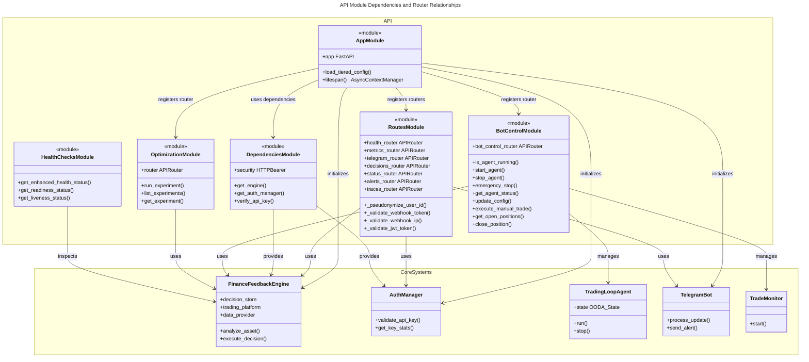
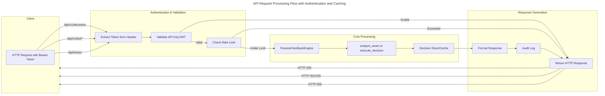
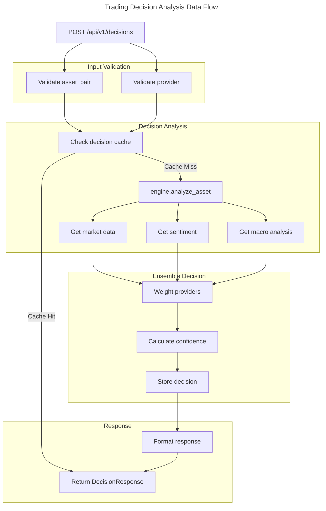
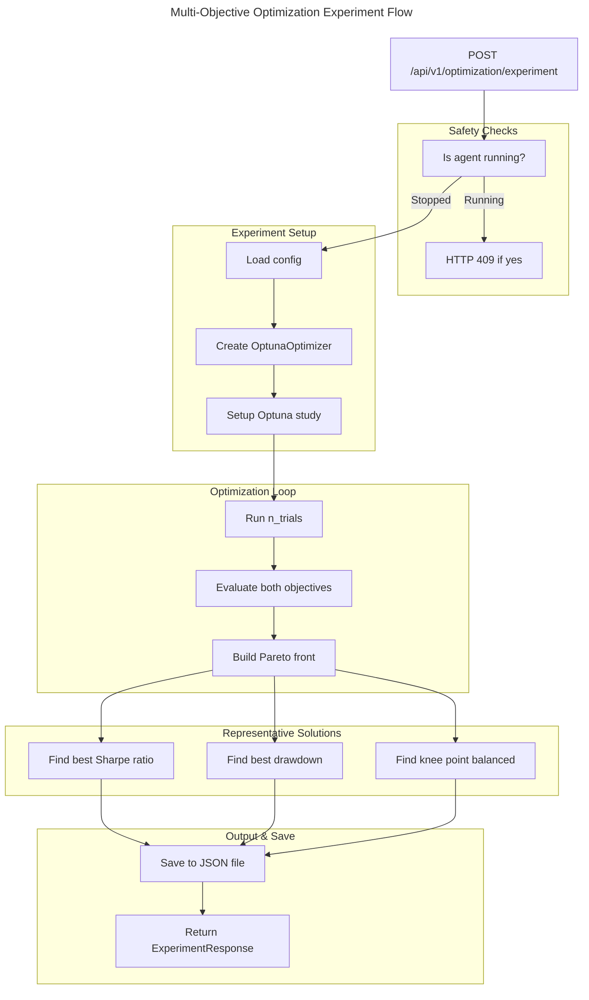

# C4 Code Level: Finance Feedback Engine API

## Overview
- **Name**: Finance Feedback Engine REST API
- **Description**: FastAPI-based REST API providing endpoints for trading decisions, health monitoring, bot control, optimization experiments, and alert management
- **Location**: `/finance_feedback_engine/api`
- **Language**: Python 3.11+ with FastAPI framework
- **Purpose**: Exposes the FinanceFeedbackEngine trading decision system through REST endpoints with authentication, rate limiting, and comprehensive monitoring capabilities

## Code Elements

### Module: `__init__.py`
- **Location**: `finance_feedback_engine/api/__init__.py`
- **Description**: Package marker file for the API module
- **Type**: Module initialization (empty)

### Module: `app.py` - FastAPI Application Setup
- **Location**: `finance_feedback_engine/api/app.py`
- **Description**: Core FastAPI application with lifespan management, middleware configuration, and router registration

#### Functions

**`load_tiered_config() -> dict`**
- **Location**: `app.py:16-64`
- **Description**: Loads configuration with tiered fallback mechanism (local → base config). Matches CLI's config loading behavior
- **Parameters**: None
- **Returns**: `dict` - Merged configuration from local and base config files
- **Raises**:
  - `RuntimeError` - If file loading fails (OSError, IOError, yaml.YAMLError)
  - `ValueError` - If no valid configuration loaded
- **Dependencies**:
  - `pathlib.Path`
  - `yaml`
  - `load_config` from `..utils.config_loader`

**`lifespan(app: FastAPI) -> asynccontextmanager`**
- **Location**: `app.py:67-180`
- **Description**: Async context manager for application lifespan (startup and shutdown). Initializes FinanceFeedbackEngine, AuthManager, Telegram bot, and OpenTelemetry tracing
- **Parameters**:
  - `app: FastAPI` - The FastAPI application instance
- **Returns**: `AsyncGenerator` - Async context manager yielding during app runtime
- **Dependencies**:
  - `FinanceFeedbackEngine` from `..core`
  - `AuthManager` from `..auth`
  - `init_tracer`, `init_metrics_from_config` from `..observability`
  - `OTelContextFilter` from `..observability.context`
  - `init_telegram_bot` from `..integrations.telegram_bot`
- **Side Effects**:
  - Initializes global `app_state` dictionary with engine, auth_manager, telegram_bot
  - Configures OpenTelemetry tracing and metrics
  - Adds OTel context filter to root logger
  - Logs startup/shutdown events

#### FastAPI Application
**`app: FastAPI`**
- **Location**: `app.py:183-217`
- **Description**: Main FastAPI application instance with configured lifespan, CORS middleware, and registered routers
- **Configuration**:
  - Title: "Finance Feedback Engine API"
  - Description: "AI-powered trading decision engine with autonomous agent capabilities"
  - Version: "1.0.0"
  - Lifespan: `lifespan` async context manager
- **CORS Configuration**:
  - Production mode: Strict whitelist from `ALLOWED_ORIGINS` environment variable
  - Development mode: Explicit localhost ports (3000, 3001, 5173, 8080)
  - Allowed methods: GET, POST, PUT, DELETE, OPTIONS (explicit, not wildcard)
  - Allowed headers: Content-Type, Authorization, X-Requested-With, X-User-Agent
  - Max age: 600 seconds
- **Registered Routers**:
  - `health_router` (path: `/`, tags: health)
  - `metrics_router` (path: `/`, tags: metrics)
  - `telegram_router` (path: `/webhook`, tags: telegram)
  - `decisions_router` (path: `/api/v1`, tags: decisions)
  - `status_router` (path: `/api/v1`, tags: status)
  - `bot_control_router` (tags: bot-control)
  - `optimization_router` (tags: optimization)

#### Endpoints

**`GET /` - Root Endpoint**
- **Location**: `app.py:213-217`
- **Description**: Returns API metadata including documentation links
- **Response**:
  ```json
  {
    "name": "Finance Feedback Engine API",
    "version": "1.0.0",
    "docs": "/docs",
    "health": "/health",
    "metrics": "/metrics"
  }
  ```

#### Global State
**`app_state: Dict[str, Any]`**
- **Location**: `app.py:13`
- **Description**: Thread-safe dictionary storing shared application state
- **Keys**:
  - `"engine"`: `FinanceFeedbackEngine` instance
  - `"auth_manager"`: `AuthManager` instance
  - `"telegram_bot"`: `TelegramBot` instance (optional)

---

### Module: `routes.py` - API Routes and Handlers
- **Location**: `finance_feedback_engine/api/routes.py`
- **Description**: RESTful API endpoints for trading decisions, health checks, metrics, alerts, and trace submission

#### Utility Functions

**`_pseudonymize_user_id(user_id: str) -> str`**
- **Location**: `routes.py:19-59`
- **Description**: Creates non-reversible pseudonymous identifier from user_id using HMAC-SHA256 for GDPR/privacy compliance
- **Parameters**:
  - `user_id: str` - Original user identifier (email, username, etc.)
- **Returns**: `str` - Hex-encoded HMAC-SHA256 hash (64 characters)
- **Security Notes**:
  - Secret read from `TRACE_USER_SECRET` environment variable
  - Pseudonymized IDs logged in trace spans and rate limit tracking
  - Trace retention: 1 hour in-memory cache
- **Dependencies**: `hmac`, `hashlib`, `os`

**`_validate_webhook_token(request: Request) -> bool`**
- **Location**: `routes.py:62-110`
- **Description**: Validates webhook authentication token using constant-time comparison to prevent timing attacks
- **Parameters**:
  - `request: Request` - FastAPI Request object
- **Returns**: `bool` - True if token valid, False otherwise
- **Accepts Tokens From**:
  - `X-Webhook-Token` header (preferred)
  - `Authorization: Bearer <token>` header (fallback)
- **Constant-Time Comparison**: Uses `secrets.compare_digest()` to prevent timing attacks
- **Configuration**: `ALERT_WEBHOOK_SECRET` environment variable (required)
- **Dependencies**: `os`, `logging`, `secrets`

**`_validate_webhook_ip(request: Request) -> bool`**
- **Location**: `routes.py:113-147`
- **Description**: Validates webhook source IP against optional allowlist
- **Parameters**:
  - `request: Request` - FastAPI Request object
- **Returns**: `bool` - True if IP valid or allowlist not configured, False if blocked
- **Configuration**: `ALERT_WEBHOOK_ALLOWED_IPS` environment variable (comma-separated list, optional)
- **Dependencies**: `os`

**`_validate_jwt_token(token: str) -> str`**
- **Location**: `routes.py:150-250`
- **Description**: Comprehensive JWT token validation with signature, expiry, issuer, and audience checks
- **Parameters**:
  - `token: str` - JWT token string from Authorization header
- **Returns**: `str` - user_id extracted from token's 'sub' claim
- **Raises**:
  - `HTTPException(401)` - If token invalid, expired, or missing claims
  - `HTTPException(500)` - If python-jose not installed
- **Validation Steps**:
  1. Signature verification using configured secret/public key
  2. Expiry check (exp claim)
  3. Issuer validation (iss claim)
  4. Audience validation (aud claim)
  5. Algorithm validation (prevents algorithm confusion attacks)
- **Configuration** (environment variables):
  - `JWT_SECRET_KEY` - Secret key for HS256/HS512
  - `JWT_PUBLIC_KEY` - Public key for RS256/ES256 (optional)
  - `JWT_ALGORITHM` - Algorithm to use (default: HS256)
  - `JWT_ISSUER` - Expected issuer claim (iss)
  - `JWT_AUDIENCE` - Expected audience claim (aud)
- **Allowed Algorithms**: HS256, HS512, RS256, RS512, ES256, ES512
- **Dependencies**: `python-jose.jwt`, `os`, `logging`

#### Request/Response Models

**`AnalysisRequest`** (Pydantic BaseModel)
- **Location**: `routes.py:253-262`
- **Fields**:
  - `asset_pair: str` - Trading pair symbol
  - `provider: str` - Data provider to use (default: "ensemble")
  - `include_sentiment: bool` - Include sentiment analysis (default: True)
  - `include_macro: bool` - Include macro analysis (default: True)

**`DecisionResponse`** (Pydantic BaseModel)
- **Location**: `routes.py:265-274`
- **Fields**:
  - `decision_id: str` - Unique decision identifier
  - `asset_pair: str` - Trading pair symbol
  - `action: str` - Trade action (BUY/SELL)
  - `confidence: int` - Confidence percentage
  - `reasoning: str` - Explanation of decision

**`AlertField`** (Pydantic BaseModel)
- **Location**: `routes.py:625-632`
- **Fields**:
  - `status: str` - Alert status
  - `labels: Dict[str, Any]` - Prometheus alert labels
  - `annotations: Dict[str, str]` - Alert annotations

**`AlertmanagerWebhook`** (Pydantic BaseModel)
- **Location**: `routes.py:635-643`
- **Fields**:
  - `alerts: List[AlertField]` - List of alerts
  - `groupLabels: Dict[str, str]` - Group labels
  - `commonLabels: Dict[str, str]` - Common labels
  - `commonAnnotations: Dict[str, str]` - Common annotations

**`TraceAttribute`** (Pydantic BaseModel)
- **Location**: `routes.py:738-742`
- **Fields**:
  - `key: str` - Attribute name
  - `value: Any` - Attribute value

**`TraceSpan`** (Pydantic BaseModel)
- **Location**: `routes.py:745-757`
- **Fields**:
  - `trace_id: str` - OpenTelemetry trace ID
  - `span_id: str` - OpenTelemetry span ID
  - `parent_span_id: Optional[str]` - Parent span ID
  - `name: str` - Span name
  - `start_time: int` - Start time (milliseconds)
  - `end_time: int` - End time (milliseconds)
  - `attributes: Optional[List[TraceAttribute]]` - Span attributes
  - `status: str` - Span status (default: "UNSET")

#### Routers and Endpoints

**Router: `health_router`**
- **Location**: `routes.py:281-282`
- **Description**: Application health and readiness checks

**`GET /health` - Health Check Endpoint**
- **Location**: `routes.py:289-298`
- **Description**: Returns comprehensive application health status
- **Dependencies**: `get_engine`, `get_enhanced_health_status` from `health_checks.py`
- **Response**: Detailed health report with circuit breaker states

**`GET /ready` - Readiness Probe (Kubernetes)**
- **Location**: `routes.py:301-317`
- **Description**: Kubernetes readiness probe checking if app is ready to serve requests
- **Dependencies**: `get_engine`, `get_readiness_status` from `health_checks.py`
- **Response**: `{"ready": bool, "reason": str, "uptime_seconds": float}`
- **Status Code**: 503 if not ready

**`GET /live` - Liveness Probe (Kubernetes)**
- **Location**: `routes.py:320-330`
- **Description**: Kubernetes liveness probe checking if app is alive
- **Dependencies**: `get_liveness_status` from `health_checks.py`
- **Response**: `{"alive": bool, "timestamp": str, "uptime_seconds": float}`

**Router: `metrics_router`**
- **Location**: `routes.py:333-334`
- **Description**: Prometheus metrics endpoint

**`GET /metrics` - Prometheus Metrics**
- **Location**: `routes.py:337-351`
- **Description**: Prometheus metrics in text exposition format
- **Dependencies**: `generate_metrics` from `..monitoring.prometheus`
- **Response**: Prometheus text format (Content-Type: text/plain; version=0.0.4)

**Router: `telegram_router`**
- **Location**: `routes.py:354-355`
- **Description**: Telegram webhook for approval bot integration

**`POST /webhook/telegram` - Telegram Webhook**
- **Location**: `routes.py:358-390`
- **Description**: Receives Telegram Bot API updates and processes approval requests
- **Dependencies**:
  - `get_engine`
  - `telegram_bot` from `..integrations.telegram_bot`
- **Request**: JSON from Telegram Bot API
- **Response**: `{"status": "ok"}`
- **Raises**:
  - `HTTPException(503)` - If Telegram bot not initialized
  - `HTTPException(500)` - If webhook processing fails

**Router: `decisions_router`**
- **Location**: `routes.py:393-394`
- **Description**: Trading decision analysis endpoints

**`POST /api/v1/decisions` - Create Decision Analysis**
- **Location**: `routes.py:421-465`
- **Description**: Triggers new trading decision analysis
- **Request Model**: `AnalysisRequest`
- **Response Model**: `DecisionResponse`
- **Parameters**:
  - `asset_pair: str` - Asset pair to analyze
  - `provider: str` - Data provider ("ensemble", specific provider name)
  - `include_sentiment: bool` - Include sentiment analysis
  - `include_macro: bool` - Include macro analysis
- **Dependencies**: `get_engine`
- **Required Response Keys**: decision_id, asset_pair, action, confidence
- **Error Handling**: Logs error reference ID (UUID) and returns generic HTTP 500

**`GET /api/v1/decisions` - List Recent Decisions**
- **Location**: `routes.py:468-485`
- **Description**: Returns list of recent trading decisions
- **Query Parameters**:
  - `limit: int` - Maximum decisions to return (default: 10)
- **Dependencies**: `get_engine`
- **Response**: `{"decisions": List[Dict], "count": int}`

**Router: `status_router`**
- **Location**: `routes.py:488-489`
- **Description**: Portfolio status endpoint

**`GET /api/v1/status` - Portfolio Status**
- **Location**: `routes.py:492-553`
- **Description**: Returns portfolio status summary with balance, positions, and platform info
- **Dependencies**: `get_engine`
- **Response Keys**:
  - `balance: Dict` - Total balance, available funds, currency
  - `active_positions: int` - Number of open positions
  - `max_concurrent_trades: int` - Maximum concurrent trades allowed
  - `platform: str` - Trading platform name
- **Error Handling**: Returns default status dict if platform unavailable

**Router: `alerts_router`**
- **Location**: `routes.py:556-557`
- **Description**: Prometheus Alertmanager webhook integration

**`POST /api/alerts/webhook` - Handle Alert Webhook**
- **Location**: `routes.py:576-695`
- **Description**: Processes Prometheus Alertmanager webhook notifications and sends via Telegram
- **Request Model**: `AlertmanagerWebhook`
- **Parameters**:
  - `payload: AlertmanagerWebhook` - Alertmanager webhook payload
  - `request: Request` - FastAPI request for authentication
- **Security Checks**:
  1. IP allowlist validation (if configured)
  2. Webhook token validation (required)
- **Response**: `{"status": str, "alerts_processed": int, "alerts_sent": int}`
- **Alert Processing**:
  - Formats alert with emoji, severity, component, and description
  - Sends to Telegram bot if available
  - Falls back to logging if Telegram unavailable
- **Dependencies**:
  - `_validate_webhook_ip`
  - `_validate_webhook_token`
  - `telegram_bot` from `..integrations.telegram_bot`

**Router: `traces_router`**
- **Location**: `routes.py:698-699`
- **Description**: Frontend OpenTelemetry trace submission

**Async Function: `_cleanup_expired_traces()`**
- **Location**: `routes.py:762-782`
- **Description**: Removes traces older than TTL and enforces max cache size
- **Side Effects**:
  - Removes traces older than 1 hour (`_TRACE_TTL_SECONDS`)
  - Removes oldest entries (FIFO) if cache exceeds 1000 entries
  - Thread-safe using `_trace_cache_lock`

**`POST /api/traces` - Submit Frontend Trace**
- **Location**: `routes.py:785-920`
- **Description**: Submits OpenTelemetry trace spans from frontend with JWT authentication and rate limiting
- **Request Model**: `TraceSpan`
- **Security**:
  - Requires valid JWT in Authorization header (Bearer token)
  - Rate limited: 10 requests/minute per user (pseudonymized)
- **Parameters**:
  - `span: TraceSpan` - Trace span data
  - `request: Request` - FastAPI request (for auth header)
  - `engine: FinanceFeedbackEngine` - From dependency injection
- **Response**: `{"status": "accepted", "trace_id": str, "span_id": str}`
- **Validation Steps**:
  1. Extract and validate JWT from Authorization header
  2. Extract user_id from JWT 'sub' claim
  3. Pseudonymize user_id for privacy (GDPR compliance)
  4. Check rate limit (10 spans/minute per user)
  5. Cleanup expired traces
  6. Validate span timestamps and calculate duration
  7. Store in in-memory cache with TTL
- **Error Handling**:
  - `HTTPException(401)` - Missing/invalid JWT or malformed Authorization header
  - `HTTPException(429)` - Rate limit exceeded
  - `HTTPException(400)` - Invalid span data or timestamps
- **Privacy Features**:
  - User ID pseudonymized before storage/logging
  - Malformed timestamps logged with metadata
  - Cache TTL: 1 hour per trace
  - Max cache size: 1000 entries (oldest removed if exceeded)

#### Global Variables

**`telegram_bot`** - Optional[TelegramBot]
- **Location**: `routes.py:396`
- **Description**: Shared Telegram bot reference for test patching
- **Default**: None

**Trace Cache Variables** (lines 704-710)
- **`_trace_cache: Dict[str, List[Dict[str, Any]]]`** - In-memory trace cache
- **`_trace_cache_ttl: Dict[str, int]`** - TTL timestamps for cached traces
- **`_trace_cache_lock: asyncio.Lock`** - Thread-safe cache access
- **`_TRACE_TTL_SECONDS: int`** - Trace TTL (3600 seconds / 1 hour)
- **`_MAX_CACHE_ENTRIES: int`** - Max cache size (1000 entries)

---

### Module: `dependencies.py` - Dependency Injection
- **Location**: `finance_feedback_engine/api/dependencies.py`
- **Description**: FastAPI dependency injection functions for authenticated access to shared resources

#### Functions

**`get_engine() -> FinanceFeedbackEngine`**
- **Location**: `dependencies.py:13-26`
- **Description**: Dependency to get shared FinanceFeedbackEngine instance
- **Returns**: `FinanceFeedbackEngine` - The engine instance from app_state
- **Raises**: `HTTPException(503)` - If engine not initialized
- **Dependencies**: `app_state` from `app.py`

**`get_auth_manager() -> AuthManager`**
- **Location**: `dependencies.py:32-50`
- **Description**: Dependency to get shared AuthManager instance
- **Returns**: `AuthManager` - The authentication manager instance
- **Raises**: `HTTPException(503)` - If auth manager not initialized
- **Dependencies**: `app_state` from `app.py`

**`verify_api_key(credentials: HTTPAuthorizationCredentials, request: Request, auth_manager: AuthManager) -> str`**
- **Location**: `dependencies.py:53-118`
- **Description**: Verifies API key from Authorization header with secure validation
- **Parameters**:
  - `credentials: HTTPAuthorizationCredentials` - Bearer token from Authorization header
  - `request: Request` - FastAPI request for IP/user-agent extraction
  - `auth_manager: AuthManager` - From dependency injection
- **Returns**: `str` - The API key name if valid
- **Raises**:
  - `HTTPException(401)` - If API key missing or invalid
  - `HTTPException(429)` - If rate limited
- **Security Features**:
  - Validates against secure API key database
  - Rate limiting per API key
  - Audit logging of attempts (success/failure)
  - Constant-time comparison to prevent timing attacks
  - Client IP tracking (X-Forwarded-For → fallback to direct client)
  - User-Agent logging
- **Returned Metadata**: remaining_requests count for rate limiting info

#### Security Components

**`security: HTTPBearer`**
- **Location**: `dependencies.py:30`
- **Description**: HTTPBearer instance for Bearer token extraction from Authorization header

---

### Module: `health_checks.py` - Enhanced Health Monitoring
- **Location**: `finance_feedback_engine/api/health_checks.py`
- **Description**: Comprehensive health checks and readiness probes for all components

#### Utility Functions

**`_safe_json(value: Any) -> Any`**
- **Location**: `health_checks.py:17-28`
- **Description**: Converts objects to JSON-serializable primitives to avoid recursion with mock objects
- **Parameters**:
  - `value: Any` - Any Python object
- **Returns**: `Any` - JSON-serializable version of input
- **Handles**: dict, list, tuple, set, str, int, float, bool, None
- **Fallback**: Converts unknown types to string to prevent recursion

#### Functions

**`get_enhanced_health_status(engine: FinanceFeedbackEngine) -> Dict[str, Any]`**
- **Location**: `health_checks.py:31-149`
- **Description**: Comprehensive health status for all components with circuit breaker states
- **Parameters**:
  - `engine: FinanceFeedbackEngine` - Engine instance to check
- **Returns**: Dictionary with keys:
  - `status: str` - Health status ("healthy", "degraded", "unhealthy")
  - `timestamp: str` - ISO 8601 timestamp
  - `uptime_seconds: float` - Seconds since startup
  - `portfolio_balance: Any` - Current balance from platform
  - `circuit_breakers: Dict` - Circuit breaker states (alpha_vantage, platform_execute)
  - `components: Dict` - Component health details
    - `platform` - Trading platform connectivity and balance
    - `data_provider` - Data provider (Alpha Vantage) configuration
    - `decision_store` - Decision history storage
- **Circuit Breaker Information**:
  - `state: str` - Breaker state (CLOSED, OPEN, HALF_OPEN)
  - `failure_count: int` - Number of consecutive failures
- **Error Handling**: Returns "degraded" status on non-fatal errors, "unhealthy" on fatal failures

**`get_readiness_status(engine: FinanceFeedbackEngine) -> Dict[str, Any]`**
- **Location**: `health_checks.py:152-180`
- **Description**: Kubernetes readiness probe checking if app is ready to serve requests
- **Parameters**:
  - `engine: FinanceFeedbackEngine` - Engine instance to check
- **Returns**: Dictionary with keys:
  - `ready: bool` - True if ready, False otherwise
  - `reason: str` - Explanation if not ready
  - `uptime_seconds: float` - Current uptime
  - `timestamp: str` - ISO 8601 timestamp (only when ready)
- **Checks**:
  - Minimum startup time: 10 seconds
  - Platform accessibility (can get balance)
- **Status Code Handling**: Returns `{"ready": False}` when not ready (HTTP 503 handled in routes.py)

**`get_liveness_status() -> Dict[str, Any]`**
- **Location**: `health_checks.py:183-200`
- **Description**: Kubernetes liveness probe checking if app is alive
- **Parameters**: None
- **Returns**: Dictionary with keys:
  - `alive: bool` - Always True (if function runs, app is alive)
  - `timestamp: str` - ISO 8601 timestamp
  - `uptime_seconds: float` - Seconds since startup

#### Global State

**`_startup_time: datetime`**
- **Location**: `health_checks.py:14`
- **Description**: Module-level startup time for calculating uptime

---

### Module: `optimization.py` - Optuna Optimization API
- **Location**: `finance_feedback_engine/api/optimization.py`
- **Description**: API endpoints for running Optuna optimization experiments on trading parameters

#### Request/Response Models

**`ExperimentRequest`** (Pydantic BaseModel)
- **Location**: `optimization.py:27-70`
- **Fields**:
  - `asset_pairs: List[str]` - Asset pairs to optimize (min 1)
  - `start_date: str` - Start date (YYYY-MM-DD format)
  - `end_date: str` - End date (YYYY-MM-DD format)
  - `n_trials: int` - Number of optimization trials (1-1000, default: 50)
  - `seed: Optional[int]` - Random seed for reproducibility
  - `optimize_weights: bool` - Whether to optimize ensemble weights (default: False)
  - `multi_objective: bool` - Use multi-objective optimization (default: False)
- **Validators**:
  - `validate_date_format` - Ensures YYYY-MM-DD format for dates
  - `validate_date_range` - Ensures end_date >= start_date

**`ParetoSolution`** (Pydantic BaseModel)
- **Location**: `optimization.py:73-80`
- **Fields**:
  - `sharpe_ratio: float` - Sharpe ratio metric
  - `drawdown_pct: float` - Maximum drawdown percentage
  - `params: Dict[str, Any]` - Optimization parameters
  - `trial_number: int` - Trial number in study

**`ExperimentResult`** (Pydantic BaseModel)
- **Location**: `optimization.py:83-102`
- **Fields**:
  - `asset_pair: str` - Asset pair for this result
  - `best_sharpe_ratio: Optional[float]` - Best Sharpe ratio (single-objective)
  - `best_drawdown_pct: Optional[float]` - Best drawdown (single-objective)
  - `best_params: Dict[str, Any]` - Best parameters found
  - `n_trials: int` - Number of trials run
  - `pareto_front: Optional[List[ParetoSolution]]` - Pareto front (multi-objective)
  - `pareto_front_size: Optional[int]` - Number of solutions on front
  - `representative_solutions: Optional[Dict[str, ParetoSolution]]` - Selected solutions (best_sharpe, best_drawdown, balanced)

**`ExperimentResponse`** (Pydantic BaseModel)
- **Location**: `optimization.py:105-121`
- **Fields**:
  - `experiment_id: str` - Unique experiment identifier
  - `created_at: str` - ISO 8601 timestamp
  - `start_date: str` - Backtest start date
  - `end_date: str` - Backtest end date
  - `n_trials_per_asset: int` - Trials per asset pair
  - `seed: Optional[int]` - Random seed used
  - `optimize_weights: bool` - Whether weights were optimized
  - `multi_objective: bool` - Whether multi-objective was used
  - `asset_pairs: List[str]` - Asset pairs tested
  - `results: List[ExperimentResult]` - Results for each asset pair

#### Router

**Router: `router`**
- **Location**: `optimization.py:124`
- **Configuration**:
  - Prefix: `/api/v1/optimization`
  - Tags: ["optimization"]

#### Endpoints

**`POST /api/v1/optimization/experiment` - Run Optimization Experiment**
- **Location**: `optimization.py:127-262`
- **Description**: Runs Optuna optimization experiment across multiple asset pairs
- **Request Model**: `ExperimentRequest`
- **Response Model**: `ExperimentResponse`
- **Parameters**:
  - `request: ExperimentRequest` - Experiment parameters
  - `engine: FinanceFeedbackEngine` - From dependency injection
- **Safety Checks**:
  - Prevents running while trading agent is active (HTTP 409)
- **Single-Objective Workflow** (multi_objective=False):
  1. Calls `OptunaOptimizer.optimize()` with n_trials
  2. Returns best value as `best_sharpe_ratio`
  3. Returns best params as `best_params`
- **Multi-Objective Workflow** (multi_objective=True):
  1. Calls `OptunaOptimizer.optimize()` with multi-objective settings
  2. Extracts Pareto front from study.best_trials
  3. Identifies representative solutions:
     - **best_sharpe**: Maximum Sharpe ratio
     - **best_drawdown**: Minimum drawdown percentage
     - **balanced**: Closest to "knee point" using L2 norm distance
  4. Uses balanced solution as default best for backward compatibility
- **Output**:
  - Saves experiment as JSON to `data/optimization/{experiment_id}.json`
  - Returns `ExperimentResponse` with all results
- **Error Handling**: Returns HTTP 500 with error detail
- **Dependencies**:
  - `OptunaOptimizer` from `..optimization.optuna_optimizer`
  - `standardize_asset_pair` from `..utils.validation`
  - `is_agent_running` from `bot_control.py`

**`GET /api/v1/optimization/experiments` - List Experiments**
- **Location**: `optimization.py:265-293`
- **Description**: Returns list of past experiments (last 20, newest first)
- **Returns**: List of experiment summaries:
  - `experiment_id: str`
  - `created_at: str`
  - `asset_pairs: List[str]`
  - `n_trials: int`
  - `results_count: int`
- **Error Handling**: Returns HTTP 500 on error

**`GET /api/v1/optimization/experiments/{experiment_id}` - Get Experiment**
- **Location**: `optimization.py:296-336`
- **Description**: Retrieves details of a specific experiment
- **Parameters**:
  - `experiment_id: str` - Experiment identifier (validated format)
- **Response Model**: `ExperimentResponse` - Full experiment details
- **Security**:
  - Validates experiment_id format (alphanumeric, underscore, hyphen only)
  - Prevents directory traversal using path.relative_to()
- **Error Handling**:
  - HTTP 400 - Invalid experiment_id format
  - HTTP 404 - Experiment not found
  - HTTP 500 - File read error

---

### Module: `bot_control.py` - Trading Agent Control
- **Location**: `finance_feedback_engine/api/bot_control.py`
- **Description**: Comprehensive API for controlling the autonomous trading agent with status monitoring and manual trade execution

#### Enums

**`BotState`** (str, Enum)
- **Location**: `bot_control.py:35-42`
- **Values**:
  - `STOPPED = "stopped"` - Agent not running
  - `STARTING = "starting"` - Agent initializing
  - `RUNNING = "running"` - Agent actively trading
  - `STOPPING = "stopping"` - Agent shutting down
  - `ERROR = "error"` - Agent encountered error

#### Request/Response Models

**`AgentControlRequest`** (Pydantic BaseModel)
- **Location**: `bot_control.py:45-61`
- **Fields**:
  - `asset_pairs: Optional[List[str]]` - Asset pairs to trade (overrides config)
  - `autonomous: bool` - Run in autonomous mode (default: True)
  - `take_profit: Optional[float]` - Take profit percentage (0.001-1.0)
  - `stop_loss: Optional[float]` - Stop loss percentage (0.001-1.0)
  - `max_concurrent_trades: Optional[int]` - Max concurrent trades (1-10)

**`AgentStatusResponse`** (Pydantic BaseModel)
- **Location**: `bot_control.py:64-82`
- **Fields**:
  - `state: BotState` - Current agent state
  - `agent_ooda_state: Optional[str]` - OODA loop state (Observe/Orient/Decide/Act)
  - `uptime_seconds: Optional[float]` - Time since agent started
  - `total_trades: int` - Total trades executed (default: 0)
  - `active_positions: int` - Current open positions (default: 0)
  - `portfolio_value: Optional[float]` - Current portfolio value
  - `daily_pnl: Optional[float]` - Daily profit/loss
  - `current_asset_pair: Optional[str]` - Currently trading asset
  - `last_decision_time: Optional[datetime]` - Timestamp of last decision
  - `error_message: Optional[str]` - Error description if error state
  - `config: Dict[str, Any]` - Current configuration

**`ManualTradeRequest`** (Pydantic BaseModel)
- **Location**: `bot_control.py:85-109`
- **Fields**:
  - `asset_pair: str` - Asset pair to trade (required)
  - `action: str` - Trade action (BUY, SELL, LONG, SHORT)
  - `size: Optional[float]` - Position size
  - `price: Optional[float]` - Limit price (market if not specified)
  - `stop_loss: Optional[float]` - Stop loss price
  - `take_profit: Optional[float]` - Take profit price
- **Validator**: `validate_action` - Ensures action is BUY/SELL/LONG/SHORT

**`ConfigUpdateRequest`** (Pydantic BaseModel)
- **Location**: `bot_control.py:112-131`
- **Fields**:
  - `stop_loss_pct: Optional[float]` - Stop loss percentage (0.001-0.1)
  - `position_size_pct: Optional[float]` - Position size percentage (0.001-0.05)
  - `confidence_threshold: Optional[float]` - Confidence threshold (0.5-1.0)
  - `max_concurrent_trades: Optional[int]` - Max concurrent trades (1-10)
  - `provider_weights: Optional[Dict[str, float]]` - Provider weights (must sum to 1.0)

#### Router

**Router: `bot_control_router`**
- **Location**: `bot_control.py:139-145`
- **Configuration**:
  - Prefix: `/api/v1/bot`
  - Tags: ["bot-control"]
  - **Security**: All endpoints require `verify_api_key` dependency
  - Required header: `Authorization: Bearer <api_key>`

#### Global State Management

**Module-level Variables** (lines 129-132)
- **`_agent_instance: Optional[TradingLoopAgent]`** - Current agent instance
- **`_agent_task: Optional[asyncio.Task]`** - Background task running agent
- **`_agent_lock: asyncio.Lock`** - Thread-safe access to agent state

**`is_agent_running() -> bool`**
- **Location**: `bot_control.py:135-141`
- **Description**: Returns True if agent currently running
- **Returns**: `bool` - True if _agent_instance and _agent_task exist and task not done

#### Endpoints

**`POST /api/v1/bot/start` - Start Agent**
- **Location**: `bot_control.py:153-228`
- **Description**: Initializes and starts autonomous trading loop
- **Request Model**: `AgentControlRequest`
- **Response Model**: `AgentStatusResponse`
- **Parameters**:
  - `request: AgentControlRequest` - Agent parameters
  - `background_tasks: BackgroundTasks` - For background execution
  - `engine: FinanceFeedbackEngine` - From dependency injection
- **Initialization Steps**:
  1. Validates agent not already running (HTTP 409 if running)
  2. Creates TradingAgentConfig from engine config + request overrides
  3. Updates asset pairs, max trades, autonomous mode from request
  4. Initializes/reuses PortfolioMemoryEngine
  5. Creates/reuses TradeMonitor with take_profit/stop_loss settings
  6. Creates TradingLoopAgent instance
  7. Starts agent in background task
- **Response**: AgentStatusResponse with RUNNING state
- **Error Handling**: HTTP 500 with error detail

**`POST /api/v1/bot/stop` - Stop Agent**
- **Location**: `bot_control.py:231-272`
- **Description**: Gracefully shuts down trading agent
- **Parameters**: None
- **Response**: `{"status": "stopped", "message": "Agent stopped successfully"}`
- **Shutdown Process**:
  1. Validates agent is running (HTTP 404 if not)
  2. Calls _agent_instance.stop() if available
  3. Cancels _agent_task
  4. Waits up to 10 seconds for graceful shutdown
  5. Clears global references
- **Error Handling**: Logs timeout if graceful shutdown fails; HTTP 500 on error

**`POST /api/v1/bot/emergency-stop` - Emergency Stop**
- **Location**: `bot_control.py:275-344`
- **Description**: CRITICAL - Immediately halts all trading and optionally closes positions
- **Query Parameters**:
  - `close_positions: bool` - Close all positions at market price (default: True)
- **Parameters**:
  - `engine: FinanceFeedbackEngine` - From dependency injection
- **Response**:
  ```json
  {
    "status": "emergency_stopped",
    "message": "Emergency stop executed",
    "closed_positions": int,
    "timestamp": "ISO8601"
  }
  ```
- **Emergency Actions**:
  1. Forces agent task cancellation (no graceful shutdown)
  2. Closes all open positions if close_positions=True
  3. Logs critical event
- **Error Handling**: HTTP 500 with error detail

**`GET /api/v1/bot/status` - Get Agent Status**
- **Location**: `bot_control.py:347-414`
- **Description**: Returns current agent status and performance metrics
- **Response Model**: `AgentStatusResponse`
- **Response Data**:
  - Agent state and OODA state
  - Uptime in seconds
  - Portfolio balance and active positions (with 3 second timeout)
  - Current asset pair
  - Configuration
- **Error Handling**: Returns STOPPED status if agent not running; returns ERROR status on exceptions

**`PATCH /api/v1/bot/config` - Update Configuration**
- **Location**: `bot_control.py:417-530`
- **Description**: Updates agent configuration in real-time
- **Request Model**: `ConfigUpdateRequest`
- **Response**:
  ```json
  {
    "status": "updated",
    "updates": {"field": value, ...},
    "timestamp": "ISO8601"
  }
  ```
- **Updated Fields** (when provided):
  - `stop_loss_pct` → agent config `sizing_stop_loss_percentage`
  - `position_size_pct` → agent config `sizing_risk_percentage`
  - `confidence_threshold` → agent config `min_confidence_threshold`
  - `max_concurrent_trades` → agent config `max_concurrent_trades`
  - `provider_weights` → ensemble config `provider_weights`
- **Atomicity**: Creates snapshot, applies updates, replaces engine.config entirely
- **Error Handling**: HTTP 400 for validation errors; HTTP 500 for config errors

**`POST /api/v1/bot/manual-trade` - Execute Manual Trade**
- **Location**: `bot_control.py:533-584`
- **Description**: Executes single trade, bypassing autonomous agent
- **Request Model**: `ManualTradeRequest`
- **Response**:
  ```json
  {
    "status": "executed",
    "trade": {...},
    "timestamp": "ISO8601"
  }
  ```
- **Trade Parameters**:
  - Order type: MARKET (if no price) or LIMIT (if price specified)
  - Size, price, stop_loss, take_profit from request
- **Error Handling**: HTTP 503 if platform unavailable; HTTP 500 on execution error

**`GET /api/v1/bot/positions` - Get Open Positions**
- **Location**: `bot_control.py:587-747`
- **Description**: Returns all currently open positions with detailed metrics
- **Response**:
  ```json
  {
    "positions": [
      {
        "id": "string",
        "asset_pair": "string",
        "side": "LONG|SHORT",
        "size": float,
        "entry_price": float,
        "current_price": float,
        "unrealized_pnl": float,
        "unrealized_pnl_pct": float
      },
      ...
    ],
    "count": int,
    "total_value": float,
    "timestamp": "ISO8601"
  }
  ```
- **Platform Support**:
  - Coinbase Futures: contracts, number_of_contracts
  - OANDA Forex: units
  - Normalized to common position schema
- **P&L Calculation**:
  - Notional value = contracts/units × entry_price
  - P&L % = (unrealized_pnl / notional_value) × 100
- **Error Handling**: Returns empty positions array if platform doesn't support tracking

**`POST /api/v1/bot/positions/{position_id}/close` - Close Position**
- **Location**: `bot_control.py:750-814`
- **Description**: Closes specific open position at market price
- **Parameters**:
  - `position_id: str` - Position identifier
  - `engine: FinanceFeedbackEngine` - From dependency injection
- **Response**:
  ```json
  {
    "status": "closed",
    "position_id": "string",
    "result": {...},
    "timestamp": "ISO8601"
  }
  ```
- **Close Process**:
  1. Fetches portfolio breakdown to find position
  2. Validates position exists and has valid size
  3. Executes market order (opposite of current side)
- **Error Handling**:
  - HTTP 404 - Position not found
  - HTTP 400 - Invalid position size
  - HTTP 503 - Platform unavailable
  - HTTP 500 - Execution error

---

### Module: `health.py` - Legacy Health Check (Deprecated)
- **Location**: `finance_feedback_engine/api/health.py`
- **Description**: Legacy health check implementation; superseded by `health_checks.py`

#### Functions

**`get_health_status(engine: FinanceFeedbackEngine) -> Dict[str, Any]`**
- **Location**: `health.py:13-119`
- **Description**: Comprehensive health status (legacy implementation)
- **Parameters**:
  - `engine: FinanceFeedbackEngine` - Engine instance
- **Returns**: Dictionary with health information
- **Status Values**: "healthy", "degraded", "unhealthy"
- **Deprecation Note**: Use `get_enhanced_health_status` from `health_checks.py` instead

---

## Dependencies

### Internal Dependencies
- **`finance_feedback_engine.core`** - FinanceFeedbackEngine main class
- **`finance_feedback_engine.auth`** - AuthManager for authentication
- **`finance_feedback_engine.agent.config`** - TradingAgentConfig
- **`finance_feedback_engine.agent.trading_loop_agent`** - TradingLoopAgent
- **`finance_feedback_engine.integrations.telegram_bot`** - TelegramBot, init_telegram_bot
- **`finance_feedback_engine.memory.portfolio_memory`** - PortfolioMemoryEngine
- **`finance_feedback_engine.monitoring.trade_monitor`** - TradeMonitor
- **`finance_feedback_engine.monitoring.prometheus`** - generate_metrics
- **`finance_feedback_engine.observability`** - init_tracer, init_metrics_from_config
- **`finance_feedback_engine.observability.context`** - OTelContextFilter
- **`finance_feedback_engine.optimization.optuna_optimizer`** - OptunaOptimizer
- **`finance_feedback_engine.utils.config_loader`** - load_config
- **`finance_feedback_engine.utils.validation`** - standardize_asset_pair

### External Dependencies
- **FastAPI** - Web framework (`fastapi.FastAPI`, `APIRouter`, `Depends`, `HTTPException`, etc.)
- **Pydantic** - Data validation (`BaseModel`, `Field`, field validators)
- **Python-JOSE** - JWT validation (`jose.jwt`, `jose.JWTError`)
- **PyYAML** - Config file parsing (`yaml`)
- **Python Standard Library**:
  - `asyncio` - Async/await utilities
  - `os` - Environment variable access
  - `logging` - Application logging
  - `pathlib.Path` - File path handling
  - `datetime` - Timestamp utilities
  - `hashlib`, `hmac`, `secrets` - Cryptographic functions
  - `time` - Timing utilities
  - `json` - JSON serialization
  - `re` - Regular expressions
  - `contextlib` - Context managers
  - `typing` - Type hints
  - `enum` - Enumeration support
  - `copy` - Object copying

---

## Relationships

The API module acts as the presentation layer for the Finance Feedback Engine, exposing core functionality through REST endpoints with comprehensive security, authentication, monitoring, and control capabilities.

### Dependency Graph



### Request Flow Diagram



### Data Flow: Decision Analysis


### Multi-Objective Optimization Flow


## Notes

### Security Considerations
1. **Authentication**: All bot control endpoints require valid API key via Bearer token authentication
2. **JWT Validation**: Trace submission endpoints require valid JWT with proper claim validation
3. **Rate Limiting**: API keys and users are rate-limited to prevent abuse
4. **Privacy**: User IDs are pseudonymized using HMAC-SHA256 before storage/logging (GDPR compliance)
5. **Webhook Security**:
   - Token validation using constant-time comparison (prevents timing attacks)
   - Optional IP allowlist for additional protection
6. **CORS**: Strict configuration with explicit origins (no wildcards in production)
7. **Secret Management**: All secrets loaded from environment variables, not hardcoded

### Performance Considerations
1. **Async Operations**: All I/O operations (platform calls, trades) are async-compatible
2. **Caching**: In-memory trace cache with 1-hour TTL and max 1000 entries
3. **Timeout Protection**: 3-second timeouts on platform API calls to prevent hanging
4. **Background Tasks**: Agent runs in background task with proper lifecycle management
5. **Health Checks**: Safe JSON serialization prevents recursion with mock objects

### Observability Features
1. **Health Probes**: Kubernetes-compatible liveness and readiness probes
2. **Circuit Breakers**: Monitoring of data provider and platform circuit breaker states
3. **Metrics**: Prometheus text format endpoint for metric scraping
4. **Tracing**: OpenTelemetry integration with frontend trace submission
5. **Audit Logging**: All authentication attempts logged with IP and user-agent

### API Versioning
- Current version: 1.0.0
- Main endpoints prefixed with `/api/v1/` for future versioning
- Health, metrics, and webhook endpoints unversioned (always available)

### Database/Storage
- **Decision Store**: Persisted in FinanceFeedbackEngine (backend-specific)
- **Optimization Results**: JSON files saved to `data/optimization/` directory
- **Traces**: In-memory cache with 1-hour TTL (not persisted by default)
- **Configuration**: YAML files (config.yaml, config.local.yaml)
