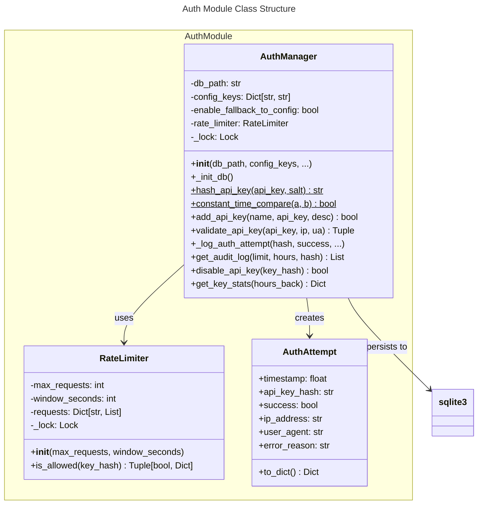

# C4 Code Level: Authentication Module

## Overview

- **Name**: Authentication Module (auth)
- **Description**: Secure authentication manager for API key validation with rate limiting, audit logging, and database persistence
- **Location**: `finance_feedback_engine/auth`
- **Language**: Python 3.8+
- **Purpose**: Provides centralized API key management with security features including constant-time comparison to prevent timing attacks, rate limiting per API key, comprehensive audit logging, and fallback to config-based keys for flexibility

---

## Code Elements

### Classes

#### AuthAttempt
- **Description**: Data class representing a record of an authentication attempt
- **Location**: `finance_feedback_engine/auth/auth_manager.py:17-30`
- **Fields**:
  - `timestamp: float` - Unix timestamp of the attempt
  - `api_key_hash: str` - Hash of the API key used
  - `success: bool` - Whether authentication succeeded
  - `ip_address: Optional[str]` - Client IP address (optional)
  - `user_agent: Optional[str]` - Client user agent (optional)
  - `error_reason: Optional[str]` - Error description if failed (optional)

- **Methods**:
  - `to_dict() -> Dict`: Convert auth attempt to dictionary format for serialization

---

#### RateLimiter
- **Description**: Implements sliding window rate limiting for API keys to prevent abuse
- **Location**: `finance_feedback_engine/auth/auth_manager.py:33-80`
- **Purpose**: Enforces per-key request limits using a sliding window algorithm with thread-safe operations

- **Methods**:

  - `__init__(max_requests: int = 100, window_seconds: int = 60) -> None`
    - **Location**: `auth_manager.py:38-43`
    - **Description**: Initialize rate limiter with configurable limits and time window
    - **Parameters**:
      - `max_requests`: Maximum requests allowed in the time window (default: 100)
      - `window_seconds`: Time window size in seconds (default: 60)
    - **Dependencies**: `threading.Lock`

  - `is_allowed(key_hash: str) -> Tuple[bool, Dict]`
    - **Location**: `auth_manager.py:45-80`
    - **Description**: Check if a request from the given API key hash is allowed under rate limit
    - **Parameters**:
      - `key_hash`: Hash of the API key
    - **Returns**: Tuple of:
      - `bool`: True if request is allowed, False if rate limit exceeded
      - `Dict`: Metadata containing:
        - `remaining_requests`: Number of requests remaining in window
        - `reset_time`: Unix timestamp when limit resets
        - `window_seconds`: Window size
    - **Security**: Thread-safe using `Lock`, prevents race conditions

---

#### AuthManager
- **Description**: Central authentication manager providing secure API key validation with comprehensive security features
- **Location**: `finance_feedback_engine/auth/auth_manager.py:83-464`
- **Purpose**: Manages API keys with database persistence, rate limiting, audit logging, and constant-time comparison

- **Constructor**:
  - `__init__(db_path: Optional[str] = None, config_keys: Optional[Dict[str, str]] = None, rate_limit_max: int = 100, rate_limit_window: int = 60, enable_fallback_to_config: bool = True) -> None`
    - **Location**: `auth_manager.py:95-125`
    - **Parameters**:
      - `db_path`: Path to SQLite database (default: `data/auth.db`)
      - `config_keys`: Dictionary of key names to key values for fallback validation
      - `rate_limit_max`: Maximum requests per rate limit window (default: 100)
      - `rate_limit_window`: Window size in seconds (default: 60)
      - `enable_fallback_to_config`: If True, fall back to config keys when database unavailable
    - **Dependencies**: `sqlite3`, `Path`, `Lock`, `RateLimiter`

- **Methods**:

  - `_init_db() -> None`
    - **Location**: `auth_manager.py:127-165`
    - **Description**: Initialize SQLite database schema with tables and indices
    - **Creates Tables**:
      - `api_keys`: Stores API key hashes with metadata
      - `auth_audit_log`: Records all authentication attempts
    - **Creates Indices**:
      - `idx_auth_timestamp`: On auth_audit_log timestamp for log retrieval
      - `idx_auth_key_hash`: On auth_audit_log api_key_hash for filtering
    - **Dependencies**: `sqlite3.connect`, `Path.mkdir`
    - **Error Handling**: Logs and raises `sqlite3.Error` on failure

  - `hash_api_key(api_key: str, salt: str = "") -> str` (static)
    - **Location**: `auth_manager.py:167-181`
    - **Description**: Hash API key using SHA-256 with optional salt for additional security
    - **Parameters**:
      - `api_key`: The API key to hash
      - `salt`: Optional salt for enhanced security
    - **Returns**: Hex-encoded SHA-256 hash
    - **Dependencies**: `hashlib.sha256`
    - **Security**: Uses standard SHA-256, supports salt for salted hashing

  - `constant_time_compare(a: str, b: str) -> bool` (static)
    - **Location**: `auth_manager.py:183-197`
    - **Description**: Compare two strings in constant time to prevent timing attacks
    - **Parameters**:
      - `a`: First string (stored hash)
      - `b`: Second string (input hash)
    - **Returns**: True if equal, False otherwise
    - **Dependencies**: `hmac.compare_digest`
    - **Security**: Prevents timing attacks by comparing in constant time

  - `add_api_key(name: str, api_key: str, description: str = "") -> bool`
    - **Location**: `auth_manager.py:199-229`
    - **Description**: Add a new API key to the database
    - **Parameters**:
      - `name`: Unique identifier/name for the key
      - `api_key`: The actual API key value
      - `description`: Optional human-readable description
    - **Returns**: True if added successfully, False if key already exists
    - **Constraints**:
      - `name` must be unique
      - `api_key` hash must be unique
    - **Dependencies**: `sqlite3`, `hash_api_key`
    - **Error Handling**: Returns False on `IntegrityError`, raises `sqlite3.Error` on other DB errors

  - `validate_api_key(api_key: str, ip_address: Optional[str] = None, user_agent: Optional[str] = None) -> Tuple[bool, Optional[str], Dict]`
    - **Location**: `auth_manager.py:231-305`
    - **Description**: Validate an API key with comprehensive security checks including rate limiting, database lookup, and config fallback
    - **Parameters**:
      - `api_key`: The API key to validate
      - `ip_address`: Optional client IP address for audit logging
      - `user_agent`: Optional client user agent for audit logging
    - **Returns**: Tuple of:
      - `bool`: True if valid and allowed, False otherwise
      - `Optional[str]`: Key name if valid, None otherwise
      - `Dict`: Metadata containing rate limit info
    - **Process**:
      1. Hash the API key
      2. Check rate limit (raises `ValueError` if exceeded)
      3. Look up in database
      4. Fall back to config keys if database lookup fails and fallback enabled
      5. Log authentication attempt
    - **Raises**: `ValueError` if rate limit exceeded
    - **Dependencies**: `hash_api_key`, `rate_limiter.is_allowed`, `constant_time_compare`, `_log_auth_attempt`

  - `_log_auth_attempt(api_key_hash: str, success: bool, ip_address: Optional[str] = None, user_agent: Optional[str] = None, error_reason: Optional[str] = None) -> None`
    - **Location**: `auth_manager.py:307-331`
    - **Description**: Log authentication attempt to database for audit trail
    - **Parameters**:
      - `api_key_hash`: Hash of the API key
      - `success`: Whether authentication succeeded
      - `ip_address`: Client IP address (optional)
      - `user_agent`: Client user agent (optional)
      - `error_reason`: Error description if failed (optional)
    - **Dependencies**: `sqlite3`
    - **Error Handling**: Logs but doesn't raise errors

  - `get_audit_log(limit: int = 100, hours_back: int = 24, key_hash: Optional[str] = None) -> List[Dict]`
    - **Location**: `auth_manager.py:333-373`
    - **Description**: Retrieve authentication audit log entries with filtering and time windowing
    - **Parameters**:
      - `limit`: Maximum entries to return (default: 100)
      - `hours_back`: Look back this many hours (default: 24)
      - `key_hash`: Optional filter by specific API key hash
    - **Returns**: List of audit log dictionaries
    - **Dependencies**: `sqlite3`, `datetime.timedelta`
    - **Error Handling**: Returns empty list on DB error

  - `disable_api_key(key_hash: str) -> bool`
    - **Location**: `auth_manager.py:375-391`
    - **Description**: Deactivate an API key (mark as inactive in database)
    - **Parameters**:
      - `key_hash`: Hash of the API key to disable
    - **Returns**: True if successful, False if key not found
    - **Dependencies**: `sqlite3`
    - **Error Handling**: Logs and raises `sqlite3.Error` on failure

  - `get_key_stats(hours_back: int = 24) -> Dict`
    - **Location**: `auth_manager.py:393-420`
    - **Description**: Get authentication statistics for the given time window
    - **Parameters**:
      - `hours_back`: Look back this many hours (default: 24)
    - **Returns**: Dictionary containing:
      - `total`: Total authentication attempts
      - `successful`: Count of successful authentications
      - `failed`: Count of failed authentications
      - `hours_back`: The window size
    - **Dependencies**: `sqlite3`, `datetime.timedelta`
    - **Error Handling**: Returns error dict on DB failure

---

### Module Exports

The module exports the following public API via `__init__.py`:

- `AuthManager` - Main authentication manager class
- `AuthAttempt` - Authentication attempt record dataclass
- `RateLimiter` - Rate limiting utility

---

## Database Schema

### api_keys Table
```sql
CREATE TABLE api_keys (
    id INTEGER PRIMARY KEY,
    name TEXT UNIQUE NOT NULL,
    key_hash TEXT UNIQUE NOT NULL,
    created_at TIMESTAMP DEFAULT CURRENT_TIMESTAMP,
    last_used TIMESTAMP,
    is_active BOOLEAN DEFAULT 1,
    description TEXT
)
```

### auth_audit_log Table
```sql
CREATE TABLE auth_audit_log (
    id INTEGER PRIMARY KEY,
    timestamp TIMESTAMP DEFAULT CURRENT_TIMESTAMP,
    api_key_hash TEXT NOT NULL,
    success BOOLEAN NOT NULL,
    ip_address TEXT,
    user_agent TEXT,
    error_reason TEXT,
    FOREIGN KEY (api_key_hash) REFERENCES api_keys(key_hash)
)
```

---

## Dependencies

### Internal Dependencies
- **Module Imports**:
  - `finance_feedback_engine.core.FinanceFeedbackEngine` - Referenced in routes.py for JWT and webhook validation
  - `finance_feedback_engine.api.routes` - Uses auth features indirectly via validation functions

### External Dependencies

#### Standard Library
- `hashlib` - SHA-256 hashing for API key storage
- `hmac` - Constant-time string comparison for security
- `logging` - Audit and error logging
- `sqlite3` - Database persistence for API keys and audit logs
- `time` - Unix timestamps for rate limiting
- `dataclasses` - `asdict`, `dataclass` decorators
- `datetime` - `datetime`, `timedelta` for time-based queries
- `pathlib` - `Path` for file path handling
- `threading` - `Lock` for thread-safe operations
- `typing` - Type hints (`Dict`, `List`, `Optional`, `Tuple`)

#### Third-party Libraries
- None explicitly required by this module

---

## Security Features

### 1. Constant-Time Comparison
- Uses `hmac.compare_digest()` to prevent timing attacks
- Compares API key hashes in constant time regardless of mismatch position

### 2. SHA-256 Hashing
- API keys are hashed before storage in database
- Uses SHA-256 with optional salt support
- Keys are never stored in plaintext

### 3. Rate Limiting
- Per-API key sliding window rate limiting
- Default: 100 requests per 60 seconds
- Thread-safe implementation with `Lock`
- Prevents brute-force attacks

### 4. Audit Logging
- All authentication attempts logged to database
- Records: timestamp, key hash, success/failure, IP address, user agent, error reason
- Supports querying by time window and key hash
- Enables security monitoring and forensics

### 5. Database Persistence
- SQLite database with schema validation
- Unique constraints on key names and hashes
- Indexed audit logs for performance
- Fallback to config-based keys if database unavailable

### 6. Configuration Fallback
- Supports fallback to environment/config-provided API keys
- Useful during database outages
- Can be disabled via `enable_fallback_to_config` parameter

---

## Integration Points

### Used By
- `finance_feedback_engine/api/routes.py`:
  - Referenced in JWT validation (`_validate_jwt_token`)
  - Referenced in webhook validation (`_validate_webhook_token`)
  - Authentication patterns similar to `AuthManager` design

- `finance_feedback_engine/__init__.py`:
  - Not directly imported but complementary to overall API authentication

### Configuration
- `db_path`: Defaults to `data/auth.db` relative to project root
- `config_keys`: Can be passed from external configuration
- `rate_limit_max`: Configurable maximum requests
- `rate_limit_window`: Configurable time window

---

## Code Diagram



---

## Error Handling Strategy

### Authentication Validation
- **Rate Limit Exceeded**: Raises `ValueError` with message "Rate limit exceeded"
- **Invalid API Key**: Returns `(False, None, metadata)` tuple
- **Database Error During Validation**: Falls back to config keys if enabled, otherwise returns False

### API Key Management
- **Duplicate Key**: Returns False (does not raise)
- **Database Error on Add**: Raises `sqlite3.Error`
- **Database Error on Disable**: Raises `sqlite3.Error`

### Audit Logging
- **Log Failure**: Logged but not raised (fail-safe)
- **Graceful Degradation**: System continues even if audit fails

### Statistics
- **Query Error**: Returns dict with `error` key instead of raising

---

## Thread Safety

- `RateLimiter.is_allowed()`: Protected by `self._lock`
- `AuthManager.__init__()`: Creates thread-safe `RateLimiter`
- Database operations: `sqlite3.connect()` is thread-safe by default
- Audit logging: Non-blocking, errors don't propagate

---

## Performance Considerations

### Rate Limiting
- Sliding window maintains list of request timestamps per key
- Old entries cleaned on each request
- Memory grows with active API keys (negligible for < 10k keys)

### Database
- `api_keys` table indexed on `key_hash` for fast validation
- `auth_audit_log` indexed on timestamp and key_hash for query performance
- Default limit of 100 audit log entries per query

### Caching
- No caching of validation results (fresh lookup each time)
- Rate limit state maintained in memory only (per-process)

---

## Testing Recommendations

### Unit Tests
- `test_hash_api_key()`: Verify deterministic hashing
- `test_constant_time_compare()`: Verify timing attack prevention
- `test_rate_limiter_allows_valid()`: Within limit
- `test_rate_limiter_blocks_exceeded()`: Over limit
- `test_add_api_key_success()`: Add new key
- `test_add_api_key_duplicate()`: Duplicate key handling
- `test_validate_api_key_success()`: Valid key in DB
- `test_validate_api_key_invalid()`: Invalid key
- `test_validate_api_key_fallback()`: Config key fallback
- `test_get_audit_log_filtering()`: Filtering by time and key

### Integration Tests
- Database initialization and cleanup
- Concurrent validation requests
- Audit log persistence and retrieval
- Rate limit enforcement under load

### Security Tests
- Timing attack resistance (constant-time comparison)
- Plaintext key never logged
- Rate limit bypass attempts
- Database injection attempts

---

## Environment Variables

None required, but these related to API security in routes.py:
- `TRACE_USER_SECRET`: Used in JWT pseudonymization (not in auth module)
- `ALERT_WEBHOOK_SECRET`: Used in webhook validation (not in auth module)
- `JWT_SECRET_KEY`: Used in JWT validation (not in auth module)

---

## Change Log

### Version 0.9.9
- Initial implementation with core authentication features
- Rate limiting with sliding window
- Audit logging with database persistence
- Constant-time comparison for security
- Config fallback support

---

## Notes

- All API key hashes are stored securely; plaintext keys are never persisted
- Rate limiting is per-process; distributed systems need external rate limiting (Redis, etc.)
- Audit logs can grow large; consider archival strategy for production
- Database path defaults to `data/auth.db`; ensure directory has appropriate permissions
- The module is designed for use with the FastAPI routes in `finance_feedback_engine/api/routes.py`
- Compatible with Python 3.8+ due to use of standard library features
