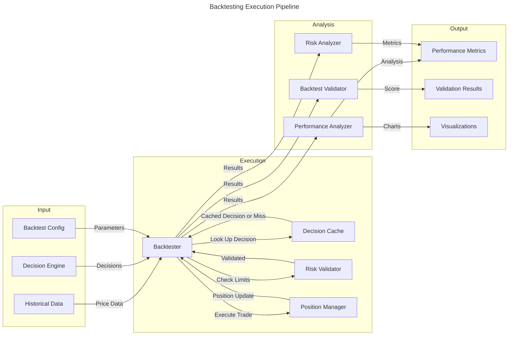
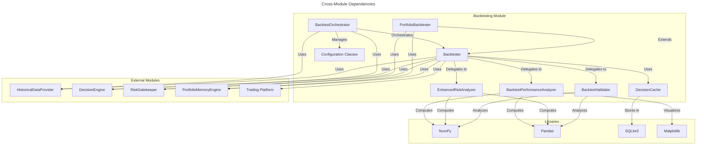

# C4 Code Level: Backtesting Module

## Overview

- **Name**: Backtesting Engine and Framework
- **Description**: A comprehensive backtesting framework for simulating trading strategies with realistic market conditions, performance analysis, risk validation, and multi-asset portfolio support
- **Location**: `finance_feedback_engine/backtesting/`
- **Language**: Python 3
- **Purpose**: Provides robust simulation environment for evaluating trading strategies and AI decision engines against historical market data with transaction fees, slippage, margin liquidation, position sizing, and comprehensive performance metrics

---

## Code Elements

### Core Backtesting Classes

#### `Backtester` (backtester.py)
**Type**: Class  
**Location**: `finance_feedback_engine/backtesting/backtester.py`

**Constructor Signature**:
```python
def __init__(
    self,
    historical_data_provider: HistoricalDataProvider,
    platform: Optional[Any] = None,
    initial_balance: float = 10000.0,
    fee_percentage: float = 0.001,
    slippage_percentage: float = 0.0001,
    slippage_impact_factor: float = 0.01,
    commission_per_trade: float = 0.0,
    stop_loss_percentage: float = 0.02,
    take_profit_percentage: float = 0.05,
    override_leverage: Optional[float] = None,
    override_maintenance_margin: Optional[float] = None,
    enable_risk_gatekeeper: bool = True,
    timeframe_aggregator: Optional[Any] = None,
    enable_decision_cache: bool = True,
    enable_portfolio_memory: bool = True,
    memory_isolation_mode: bool = False,
    force_local_providers: bool = True,
    max_concurrent_positions: int = 5,
    timeframe: str = "1h",
    risk_free_rate: float = 0.02,
    position_sizing_strategy: str = "fixed_fraction",
    risk_per_trade: float = 0.02,
    config: Optional[Dict[str, Any]] = None,
) -> None
```

**Description**: Core backtesting engine that simulates trading strategies with realistic conditions. Integrates decision cache, portfolio memory, risk management, and comprehensive performance metrics.

**Public Methods**:
- `run_backtest(asset_pair: str, start_date: str, end_date: str, decision_engine: DecisionEngine) -> Dict[str, Any]`
  - Executes single-asset backtest with AI decision engine

- `run_agent_compatible_backtest(asset_pair: str, start_date: str, end_date: str, decision_engine: DecisionEngine) -> Dict[str, Any]`
  - Runs backtest with agent-specific constraints and risk validations

- `save_results(results: Dict[str, Any], filename: str) -> str`
  - Persists backtest results to JSON file

**Private Methods**:
- `_is_enhanced_slippage_enabled() -> bool`
  - Checks if volume-impact slippage modeling is active

- `_calculate_realistic_slippage(trade_volume: float, asset_price: float) -> float`
  - Computes slippage based on trade volume and market impact

- `_calculate_fees(units: float, price: float) -> float`
  - Calculates transaction fees and commissions

- `_execute_trade(trade_decision: Dict[str, Any], timestamp: datetime) -> None`
  - Processes trade execution with position tracking

- `_calculate_liquidation_price(units: float, entry_price: float, leverage: float) -> float`
  - Computes margin liquidation trigger price

- `_check_margin_liquidation(position: Position, current_price: float) -> bool`
  - Validates margin position safety

- `_calculate_position_size(balance: float, risk: float, entry_price: float, stop_loss: float) -> float`
  - Determines position size based on risk parameters

- `_get_periods_per_year(timeframe: str) -> int`
  - Returns annualization factor for given timeframe

- `_calculate_performance_metrics(results: Dict[str, Any]) -> Dict[str, Any]`
  - Computes Sharpe, Sortino, max drawdown, and other metrics

- `_calculate_agent_compatible_metrics(results: Dict[str, Any]) -> Dict[str, Any]`
  - Calculates agent-specific performance metrics

- `_apply_agent_risk_validations(results: Dict[str, Any]) -> Dict[str, Any]`
  - Applies agent-specific risk constraints and validations

**Dependencies**:
- Internal: `BacktestValidator`, `EnhancedRiskAnalyzer`, `BacktestPerformanceAnalyzer`, `DecisionCache`, `PortfolioMemoryEngine`
- External: `HistoricalDataProvider`, `DecisionEngine`, `RiskGatekeeper`, `TimeframeAggregator`
- Libraries: `numpy`, `pandas`, `logging`, `datetime`, `json`, `dataclasses`

---

#### `Position` (backtester.py)
**Type**: Data Class  
**Location**: `finance_feedback_engine/backtesting/backtester.py` (Lines 22-30)

**Definition**:
```python
@dataclass
class Position:
    asset_pair: str
    units: float  # Positive for LONG, negative for SHORT
    entry_price: float
    entry_timestamp: datetime
    side: str = "LONG"  # "LONG" or "SHORT"
    stop_loss_price: Optional[float] = None
    take_profit_price: Optional[float] = None
    liquidation_price: Optional[float] = None
```

**Description**: Represents an open trading position with entry price, size, side, and risk parameters.

---

#### `PortfolioBacktester` (portfolio_backtester.py)
**Type**: Class  
**Location**: `finance_feedback_engine/backtesting/portfolio_backtester.py`

**Constructor Signature**:
```python
def __init__(
    self,
    asset_pairs: List[str],
    initial_balance: float,
    config: Dict[str, Any],
    decision_engine: Optional[DecisionEngine] = None,
    data_provider: Optional[HistoricalDataProvider] = None,
    risk_gatekeeper: Optional[RiskGatekeeper] = None,
    memory_engine: Optional[PortfolioMemoryEngine] = None,
) -> None
```

**Description**: Multi-asset portfolio backtester with correlation-aware position sizing, portfolio-level risk management, and cross-asset learning capabilities.

**Public Methods**:
- `run_backtest(start_date: str, end_date: str) -> Dict[str, Any]`
  - Executes multi-asset portfolio backtest

- `_load_historical_data(asset_pairs: List[str], start_date: str, end_date: str) -> Dict[str, pd.DataFrame]`
  - Loads price data for portfolio assets

- `_get_trading_dates(data: Dict[str, pd.DataFrame]) -> List[datetime]`
  - Extracts trading dates from historical data

- `_validate_trading_dates(data: Dict[str, pd.DataFrame]) -> bool`
  - Verifies data consistency across assets

- `_get_current_prices(data: Dict[str, pd.DataFrame], date: datetime) -> Dict[str, float]`
  - Retrieves prices at specific timestamp

- `_update_correlation_matrix(returns: Dict[str, pd.Series], window: int = 20) -> pd.DataFrame`
  - Computes rolling correlation between assets

- `_generate_portfolio_decisions(context: Dict[str, Any]) -> Dict[str, Any]`
  - Generates decisions for portfolio assets

- `_build_portfolio_context(prices: Dict[str, float], positions: Dict[str, PortfolioPosition]) -> Dict[str, Any]`
  - Constructs decision context with portfolio state

- `_execute_portfolio_trades(decisions: Dict[str, Any], prices: Dict[str, float]) -> List[Dict[str, Any]]`
  - Processes trade decisions across portfolio

- `_calculate_position_size(balance: float, correlation: float, volatility: float) -> float`
  - Sizes positions considering portfolio correlation

- `_get_correlation_adjustment(correlation: float) -> float`
  - Adjusts position size for correlation risk

- `_execute_buy(asset: str, quantity: float, price: float) -> Dict[str, Any]`
  - Executes long position entry

- `_execute_short(asset: str, quantity: float, price: float) -> Dict[str, Any]`
  - Executes short position entry

- `_close_position(asset: str, current_price: float) -> Dict[str, Any]`
  - Closes specific asset position

- `_close_all_positions(prices: Dict[str, float]) -> List[Dict[str, Any]]`
  - Closes all open positions

- `_check_portfolio_stop_loss(positions: Dict[str, PortfolioPosition], prices: Dict[str, float]) -> List[str]`
  - Validates portfolio-level stop-loss triggers

- `_calculate_portfolio_metrics(results: Dict[str, Any]) -> Dict[str, Any]`
  - Computes portfolio performance metrics

- `_calculate_asset_attribution(results: Dict[str, Any]) -> Dict[str, float]`
  - Breaks down returns by asset contribution

**Dependencies**:
- Internal: `PortfolioMemoryEngine`, `RiskGatekeeper`
- External: `HistoricalDataProvider`, `DecisionEngine`
- Libraries: `numpy`, `pandas`, `logging`, `datetime`, `dataclasses`

---

#### `PortfolioPosition` (portfolio_backtester.py)
**Type**: Data Class  
**Location**: `finance_feedback_engine/backtesting/portfolio_backtester.py` (Lines 18-42)

**Definition**:
```python
@dataclass
class PortfolioPosition:
    asset_pair: str
    entry_price: float
    units: float
    entry_time: datetime
    stop_loss: Optional[float] = None
    take_profit: Optional[float] = None
    unrealized_pnl: float = 0.0
    side: str = "LONG"
```

**Methods**:
- `update_pnl(current_price: float) -> float`
  - Recalculates unrealized profit/loss at current price

**Description**: Represents a position in a multi-asset portfolio with pricing and P&L tracking.

---

#### `PortfolioState` (portfolio_backtester.py)
**Type**: Data Class  
**Location**: `finance_feedback_engine/backtesting/portfolio_backtester.py` (Lines 44-68)

**Definition**:
```python
@dataclass
class PortfolioState:
    cash: float
    positions: Dict[str, PortfolioPosition] = field(default_factory=dict)
    equity_curve: List[Tuple[datetime, float]] = field(default_factory=list)
    trade_history: List[Dict[str, Any]] = field(default_factory=list)
    correlation_matrix: Optional[pd.DataFrame] = None
```

**Methods**:
- `total_value(current_prices: Dict[str, float]) -> float`
  - Calculates total portfolio value including cash and positions

- `position_weights(current_prices: Dict[str, float]) -> Dict[str, float]`
  - Computes current weight allocation across positions

**Description**: Maintains current state of multi-asset portfolio including positions, cash, history, and correlations.

---

### Validation and Analysis Classes

#### `BacktestValidator` (backtest_validator.py)
**Type**: Class  
**Location**: `finance_feedback_engine/backtesting/backtest_validator.py`

**Constructor Signature**:
```python
def __init__(self) -> None
```

**Public Methods**:
- `validate_backtest_results(backtest_results: Dict[str, Any], data_start_date: str, data_end_date: str, **kwargs) -> ValidationResult`
  - Performs comprehensive validation on backtest results

- `generate_validation_report(validation_result: ValidationResult) -> str`
  - Generates human-readable validation report

**Private Methods**:
- `_check_overfitting_indicators(metrics: Dict[str, Any], trades: List[Dict[str, Any]]) -> Tuple[List[str], List[str]]`
  - Detects overfitting patterns in results

- `_check_statistical_significance(metrics: Dict[str, Any], trades: List[Dict[str, Any]]) -> Tuple[List[str], List[str]]`
  - Validates statistical significance of results

- `_perform_walk_forward_analysis(backtest_results: Dict[str, Any], start_date: str, end_date: str) -> float`
  - Conducts walk-forward validation

- `_perform_sensitivity_analysis(backtest_results: Dict[str, Any]) -> float`
  - Tests result stability to parameter changes

- `_calculate_validation_score(metrics: Dict[str, Any], trades: List[Dict[str, Any]], wfa_score: float, sensitivity_score: float) -> float`
  - Aggregates validation checks into single score

**Description**: Validates backtest results for reliability and overfitting using walk-forward analysis, sensitivity analysis, and statistical tests.

**Dependencies**:
- Libraries: `numpy`, `logging`, `datetime`, `dataclasses`

---

#### `ValidationResult` (backtest_validator.py)
**Type**: Data Class  
**Location**: `finance_feedback_engine/backtesting/backtest_validator.py` (Lines 10-16)

**Definition**:
```python
@dataclass
class ValidationResult:
    is_valid: bool
    score: float
    issues: List[str]
    recommendations: List[str]
    metrics: Dict[str, Any]
```

**Description**: Encapsulates validation results with score, issues, and recommendations.

---

#### `BacktestPerformanceAnalyzer` (performance_analyzer.py)
**Type**: Class  
**Location**: `finance_feedback_engine/backtesting/performance_analyzer.py`

**Constructor Signature**:
```python
def __init__(self) -> None
```

**Public Methods**:
- `analyze_strategy_performance(backtest_results: Dict[str, Any]) -> Dict[str, Any]`
  - Performs comprehensive performance analysis

- `generate_performance_report(backtest_results: Dict[str, Any]) -> str`
  - Generates performance analysis report

- `create_visualization(backtest_results: Dict[str, Any]) -> Dict[str, str]`
  - Creates performance visualization charts

**Private Methods**:
- `_analyze_consistency(metrics: Dict[str, Any], trades: List[Dict[str, Any]], equity_curve: List[float]) -> Dict[str, Any]`
  - Analyzes performance consistency over time

- `_analyze_risk_return_profile(metrics: Dict[str, Any]) -> Dict[str, Any]`
  - Evaluates risk-return characteristics

- `_analyze_trades(trades: List[Dict[str, Any]]) -> Dict[str, Any]`
  - Analyzes individual trade statistics

- `_analyze_market_conditions(trades: List[Dict[str, Any]]) -> Dict[str, Any]`
  - Analyzes performance across market conditions

- `_analyze_drawdowns(equity_curve: List[float]) -> Dict[str, Any]`
  - Analyzes drawdown patterns and severity

- `_calculate_drawdown_duration(drawdown_series: List[float]) -> Dict[str, Any]`
  - Calculates drawdown recovery metrics

- `_rate_ratio_quality(ratio: float) -> str`
  - Qualitative assessment of risk-adjusted ratios

- `_rate_drawdown_risk(max_dd: float) -> str`
  - Qualitative assessment of drawdown risk

- `_rate_return_quality(returns: List[float]) -> str`
  - Qualitative assessment of return quality

- `_plot_equity_curve(equity_curve: List[float]) -> str`
  - Generates equity curve visualization

- `_plot_pnl_distribution(trades: List[Dict[str, Any]]) -> str`
  - Generates P&L distribution chart

- `_plot_monthly_returns(equity_curve: List[float]) -> str`
  - Generates monthly returns heatmap

**Description**: Analyzes backtest performance with comprehensive metrics, consistency analysis, and visualization generation.

**Dependencies**:
- Libraries: `matplotlib`, `numpy`, `pandas`, `seaborn`, `logging`, `io`, `base64`

---

#### `EnhancedRiskAnalyzer` (enhanced_risk_analyzer.py)
**Type**: Class  
**Location**: `finance_feedback_engine/backtesting/enhanced_risk_analyzer.py`

**Constructor Signature**:
```python
def __init__(self, risk_free_rate: float = 0.02) -> None
```

**Public Methods**:
- `calculate_advanced_metrics(equity_curve: List[float], trades: List[Dict[str, Any]]) -> Dict[str, Any]`
  - Calculates comprehensive risk-adjusted metrics

- `validate_risk_parameters(config: Dict[str, Any]) -> List[str]`
  - Validates risk management configuration

**Private Methods**:
- `_calculate_basic_metrics(equity_curve: List[float], returns: pd.Series) -> Dict[str, Any]`
  - Computes basic return and win-rate metrics

- `_calculate_volatility_metrics(returns: pd.Series) -> Dict[str, Any]`
  - Calculates volatility, ATR-based measures

- `_calculate_atr_volatility(high_low_range: List[float]) -> float`
  - Computes Average True Range volatility

- `_calculate_tail_risk_metrics(returns: pd.Series) -> Dict[str, Any]`
  - Computes Value at Risk, Expected Shortfall

- `_calculate_drawdown_metrics(equity_curve: List[float]) -> Dict[str, Any]`
  - Analyzes maximum drawdown and duration

- `_calculate_drawdown_duration(drawdown_series: List[float]) -> Dict[str, Any]`
  - Calculates average and longest drawdown recovery

- `_calculate_ulcer_index(equity_curve: List[float]) -> float`
  - Computes Ulcer Index for downside volatility

- `_calculate_risk_adjusted_returns(returns: pd.Series) -> Dict[str, Any]`
  - Calculates Sharpe, Sortino, Calmar ratios

- `_calculate_trade_correlation_metrics(trades: List[Dict[str, Any]]) -> Dict[str, Any]`
  - Analyzes correlation between trades

- `_calculate_concentration_risk(trades: List[Dict[str, Any]]) -> Dict[str, Any]`
  - Measures concentration in winners/losers

**Description**: Provides advanced risk analysis including tail risk metrics, volatility measures, drawdown analysis, and risk-adjusted performance ratios.

**Dependencies**:
- Libraries: `numpy`, `pandas`, `logging`

---

### Caching and Orchestration Classes

#### `DecisionCache` (decision_cache.py)
**Type**: Class  
**Location**: `finance_feedback_engine/backtesting/decision_cache.py`

**Constructor Signature**:
```python
def __init__(
    self,
    db_path: str = "data/cache/backtest_decisions.db",
    max_connections: int = 5,
) -> None
```

**Public Methods**:
- `get(cache_key: str) -> Optional[Dict[str, Any]]`
  - Retrieves cached decision

- `put(cache_key: str, decision: Dict[str, Any]) -> None`
  - Stores decision in cache

- `generate_cache_key(asset_pair: str, timestamp: datetime, market_hash: str) -> str`
  - Generates unique cache key from market state

- `build_cache_key(asset_pair: str, timestamp: datetime, market_data: Dict[str, Any]) -> str`
  - Creates cache key with market data hashing

- `build_market_hash(market_data: Dict[str, Any]) -> str`
  - Creates deterministic hash of market conditions

- `clear_old(max_age_days: int = 7) -> int`
  - Removes cached entries older than threshold

- `stats() -> Dict[str, Any]`
  - Returns cache hit/miss statistics

- `clear_all() -> None`
  - Clears entire cache

**Private Methods**:
- `_create_connection() -> sqlite3.Connection`
  - Creates new database connection with settings

- `_validate_connection(conn: sqlite3.Connection) -> bool`
  - Verifies connection health

- `_get_db_connection(timeout: float = 30.0) -> ContextManager[sqlite3.Connection]`
  - Context manager for connection pooling

- `_cleanup_connections() -> None`
  - Closes all pooled connections

- `_init_db() -> None`
  - Initializes database schema

- `_hash_market_data(market_data: Dict[str, Any]) -> str`
  - Creates market data fingerprint

**Description**: SQLite-backed caching system for trading decisions with connection pooling and thread-safety for backtesting efficiency.

**Dependencies**:
- Libraries: `sqlite3`, `hashlib`, `json`, `threading`, `queue`, `logging`, `datetime`, `pathlib`

---

#### `BacktestConfiguration` (config_manager.py)
**Type**: Data Class  
**Location**: `finance_feedback_engine/backtesting/config_manager.py` (Lines 10-85)

**Key Attributes**:
- `asset_pair: str`
- `start_date: str`, `end_date: str`
- `initial_balance: float = 10000.0`
- `fee_percentage: float = 0.001`
- `slippage_percentage: float = 0.0005`
- `stop_loss_percentage: float = 0.02`
- `take_profit_percentage: float = 0.05`
- `max_position_size: float = 0.1`
- `max_daily_trades: int = 10`
- `max_drawdown_percentage: float = 0.15`
- `timeframe: str = "1h"`
- `position_sizing_strategy: str = "fixed_fraction"`
- `risk_per_trade: float = 0.02`
- `validation_enabled: bool = True`
- `walk_forward_enabled: bool = True`

**Methods**:
- `validate() -> List[str]`
  - Validates all configuration parameters

**Description**: Configuration container for advanced backtesting scenarios with comprehensive parameter definitions.

---

#### `BacktestScenario` (config_manager.py)
**Type**: Class  
**Location**: `finance_feedback_engine/backtesting/config_manager.py`

**Public Methods**:
- `add_variation(parameter: str, value: Any) -> None`
  - Adds parameter variation to scenario

- `get_all_configurations() -> List[BacktestConfiguration]`
  - Returns all scenario configurations

- `_config_to_dict(config: BacktestConfiguration) -> Dict[str, Any]`
  - Converts configuration to dictionary

**Description**: Manages scenario variations for scenario comparison testing.

---

#### `BacktestResultComparison` (config_manager.py)
**Type**: Class  
**Location**: `finance_feedback_engine/backtesting/config_manager.py`

**Public Methods**:
- `add_result(scenario_name: str, results: Dict[str, Any]) -> None`
  - Records scenario results

- `compare_performance(metric: str) -> Dict[str, Any]`
  - Compares scenarios on specific metric

**Description**: Compares results across multiple backtest scenarios.

---

#### `BacktestConfigurationManager` (config_manager.py)
**Type**: Class  
**Location**: `finance_feedback_engine/backtesting/config_manager.py`

**Constructor Signature**:
```python
def __init__(self) -> None
```

**Public Methods**:
- `create_scenario(name: str, base_config: BacktestConfiguration) -> BacktestScenario`
  - Creates named scenario with base configuration

- `run_scenario_comparison(scenario_name: str) -> Dict[str, Any]`
  - Executes comparison across scenario variations

**Description**: Manages scenario creation and multi-scenario comparison testing.

**Dependencies**:
- Internal: `BacktestConfiguration`, `BacktestScenario`, `BacktestResultComparison`
- Libraries: `logging`, `dataclasses`, `datetime`, `typing`

---

#### `BacktestOrchestrator` (orchestrator.py)
**Type**: Class  
**Location**: `finance_feedback_engine/backtesting/orchestrator.py`

**Constructor Signature**:
```python
def __init__(
    self,
    historical_data_provider: HistoricalDataProvider,
    decision_engine: DecisionEngine,
    config: Optional[Dict[str, Any]] = None,
) -> None
```

**Public Methods**:
- `run_single_backtest(configuration: BacktestConfiguration) -> Dict[str, Any]`
  - Executes single backtest with validated configuration

- `run_scenario_comparison(scenario_name: str) -> Dict[str, Any]`
  - Runs multiple scenario configurations and compares

- `optimize_strategy() -> Dict[str, Any]`
  - Performs parameter optimization (scaffold)

- `run_walk_forward_analysis(start_date: str, end_date: str, train_window: int, test_window: int) -> Dict[str, Any]`
  - Conducts walk-forward validation analysis

**Private Methods**:
- `_config_to_dict(config: BacktestConfiguration) -> Dict[str, Any]`
  - Converts configuration to dictionary

**Description**: Orchestrates advanced backtesting with configuration management, scenario comparison, and validation integration. Uses ThreadPoolExecutor for parallel backtest execution.

**Dependencies**:
- Internal: `Backtester`, `BacktestConfiguration`, `BacktestConfigurationManager`
- External: `HistoricalDataProvider`, `DecisionEngine`
- Libraries: `logging`, `concurrent.futures.ThreadPoolExecutor`, `datetime`, `typing`

---

### Simulation and Analysis Classes

#### `MonteCarloSimulator` (monte_carlo.py)
**Type**: Class  
**Location**: `finance_feedback_engine/backtesting/monte_carlo.py`

**Constructor Signature**:
```python
def __init__(self) -> None
```

**Public Methods**:
- `run_monte_carlo(backtester: Backtester, asset_pair: str, start_date: str, end_date: str, decision_engine: DecisionEngine, num_simulations: int = 1000, price_noise_std: float = 0.001) -> Dict[str, Any]`
  - Runs Monte Carlo simulations with price perturbations

**Description**: Monte Carlo simulator for generating confidence intervals and Value at Risk estimates through repeated simulations with price noise.

---

#### `WalkForwardAnalyzer` (walk_forward.py)
**Type**: Class  
**Location**: `finance_feedback_engine/backtesting/walk_forward.py`

**Constructor Signature**:
```python
def __init__(self) -> None
```

**Public Methods**:
- `run_walk_forward(backtester: Backtester, asset_pair: str, start_date: str, end_date: str, decision_engine: DecisionEngine, train_window_days: int = 90, test_window_days: int = 30, step_days: int = 15) -> Dict[str, Any]`
  - Executes walk-forward analysis with rolling windows

**Private Methods**:
- `_generate_windows(start_date: str, end_date: str, train_window_days: int, test_window_days: int, step_days: int) -> List[Tuple[str, str, str, str]]`
  - Generates rolling train/test date windows

- `_get_overfitting_recommendation(in_sample_metrics: Dict[str, Any], out_sample_metrics: Dict[str, Any]) -> str`
  - Assesses overfitting based on performance degradation

**Description**: Implements walk-forward testing to validate strategy robustness and detect overfitting by training on historical periods and testing on future periods.

**Module-level Functions**:
- `generate_learning_validation_metrics(trades: List[Dict[str, Any]]) -> Dict[str, Any]`
  - Computes learning and meta-learning validation metrics

- `_calculate_sample_efficiency(results: Dict[str, Any]) -> float`
  - Measures learning efficiency relative to sample size

- `_calculate_cumulative_regret(trade_results: List[float]) -> float`
  - Computes cumulative regret metric from RL literature

- `_calculate_concept_drift(metrics_over_time: List[Dict[str, Any]]) -> float`
  - Detects performance degradation from market regime changes

- `_calculate_thompson_sampling_metrics(decisions: List[Dict[str, Any]]) -> Dict[str, Any]`
  - Evaluates exploration/exploitation balance

- `_calculate_learning_curve(results_windows: List[Dict[str, Any]]) -> Dict[str, Any]`
  - Measures improvement trajectory over time

**Dependencies**:
- Libraries: `logging`, `datetime`, `typing`

---

#### `AgentModeBacktester` (agent_backtester.py)
**Type**: Class (Extends `Backtester`)  
**Location**: `finance_feedback_engine/backtesting/agent_backtester.py`

**Constructor Signature**:
```python
def __init__(
    self,
    *args,
    strategic_goal: str = "Maximize risk-adjusted returns through systematic learning",
    risk_appetite: str = "moderate",
    max_daily_trades: int = 20,
    analysis_frequency_seconds: int = 300,
    kill_switch_gain_pct: float = 0.15,
    kill_switch_loss_pct: float = 0.10,
    max_drawdown_pct: float = 0.15,
    data_fetch_failure_rate: float = 0.1,
    **kwargs,
) -> None
```

**Public Methods**:
- `run_backtest(asset_pair: str, start_date: str, end_date: str, decision_engine: DecisionEngine) -> Dict[str, Any]`
  - Executes backtest with agent-specific OODA loop simulation

**Private Methods**:
- `_simulate_data_fetch(candle_data: Dict[str, Any], attempt: int = 0) -> Dict[str, Any]`
  - Simulates data fetch with potential failures and exponential backoff

- `_check_kill_switch(portfolio_metrics: Dict[str, Any]) -> bool`
  - Evaluates kill-switch conditions (gain/loss/drawdown)

**Exception Classes**:
- `SimulatedDataFetchError`
  - Exception for simulated network failures

**Description**: Specializes Backtester to simulate TradingAgentOrchestrator behavior including OODA loop throttling, kill-switch monitoring, daily trade limits, and retry logic with exponential backoff.

**Dependencies**:
- Internal: `Backtester` (parent class)
- Libraries: `logging`, `random`, `typing`

---

## Dependencies

### Internal Dependencies

**Backtesting Module Imports**:
- `finance_feedback_engine.backtesting.backtester.Backtester`
- `finance_feedback_engine.backtesting.backtest_validator.BacktestValidator`
- `finance_feedback_engine.backtesting.backtest_validator.ValidationResult`
- `finance_feedback_engine.backtesting.enhanced_risk_analyzer.EnhancedRiskAnalyzer`
- `finance_feedback_engine.backtesting.performance_analyzer.BacktestPerformanceAnalyzer`
- `finance_feedback_engine.backtesting.decision_cache.DecisionCache`
- `finance_feedback_engine.backtesting.monte_carlo.MonteCarloSimulator`
- `finance_feedback_engine.backtesting.walk_forward.WalkForwardAnalyzer`
- `finance_feedback_engine.backtesting.agent_backtester.AgentModeBacktester`
- `finance_feedback_engine.backtesting.config_manager.BacktestConfiguration`
- `finance_feedback_engine.backtesting.config_manager.BacktestConfigurationManager`
- `finance_feedback_engine.backtesting.orchestrator.BacktestOrchestrator`

**Cross-module Dependencies**:
- `finance_feedback_engine.data_providers.historical_data_provider.HistoricalDataProvider`
- `finance_feedback_engine.decision_engine.engine.DecisionEngine`
- `finance_feedback_engine.risk.gatekeeper.RiskGatekeeper`
- `finance_feedback_engine.memory.portfolio_memory.PortfolioMemoryEngine`
- `finance_feedback_engine.trading_platforms.unified_platform` (for margin/leverage)
- `finance_feedback_engine.time_aggregators.timeframe_aggregator.TimeframeAggregator`

---

### External Dependencies

**Data Processing & Computing**:
- `numpy` (v1.21+): Numerical array operations, statistics
- `pandas` (v1.3+): Time series data, DataFrame operations

**Database & Persistence**:
- `sqlite3` (standard library): Decision cache database backend

**Visualization**:
- `matplotlib` (v3.4+): Chart and plot generation
- `seaborn` (v0.11+): Statistical data visualization

**Standard Library**:
- `logging`: Application logging
- `datetime`: Timestamp and date operations
- `json`: Results serialization
- `dataclasses`: Data class definitions
- `typing`: Type hints
- `hashlib`: Hash computation for cache keys
- `threading`: Thread-safe connection pooling
- `queue`: Thread-safe queue operations
- `pathlib`: Path operations
- `concurrent.futures`: Thread pool execution
- `contextlib`: Context manager utilities
- `random`: Randomization for simulations
- `collections`: Defaultdict for aggregation
- `base64`: Image encoding for visualizations
- `io`: In-memory file operations

---

## Relationships

### Code Structure Diagram

```mermaid
---
title: Backtesting Module Code Architecture
---
classDiagram
    namespace BacktestCore {
        class Backtester {
            +run_backtest() Dict
            +run_agent_compatible_backtest() Dict
            +save_results() str
            -_execute_trade()
            -_calculate_performance_metrics()
        }

        class AgentModeBacktester {
            +run_backtest() Dict
            -_simulate_data_fetch()
            -_check_kill_switch()
        }

        class PortfolioBacktester {
            +run_backtest() Dict
            -_execute_portfolio_trades()
            -_calculate_portfolio_metrics()
        }
    }

    namespace DataModels {
        class Position {
            asset_pair: str
            units: float
            entry_price: float
            side: str
        }

        class PortfolioPosition {
            asset_pair: str
            entry_price: float
            units: float
            +update_pnl() float
        }

        class PortfolioState {
            cash: float
            positions: Dict
            +total_value() float
            +position_weights() Dict
        }

        class BacktestConfiguration {
            asset_pair: str
            start_date: str
            initial_balance: float
            +validate() List
        }

        class ValidationResult {
            is_valid: bool
            score: float
            issues: List
            metrics: Dict
        }
    }

    namespace Analysis {
        class BacktestValidator {
            +validate_backtest_results() ValidationResult
            -_check_overfitting_indicators()
            -_perform_walk_forward_analysis()
        }

        class BacktestPerformanceAnalyzer {
            +analyze_strategy_performance() Dict
            +create_visualization() Dict
            -_analyze_consistency()
            -_analyze_trades()
        }

        class EnhancedRiskAnalyzer {
            +calculate_advanced_metrics() Dict
            -_calculate_volatility_metrics()
            -_calculate_tail_risk_metrics()
        }
    }

    namespace Caching {
        class DecisionCache {
            +get() Optional~Dict~
            +put() None
            +build_market_hash() str
            -_get_db_connection()
        }
    }

    namespace Simulation {
        class MonteCarloSimulator {
            +run_monte_carlo() Dict
        }

        class WalkForwardAnalyzer {
            +run_walk_forward() Dict
            -_generate_windows() List
        }
    }

    namespace Configuration {
        class BacktestScenario {
            +add_variation()
            +get_all_configurations() List
        }

        class BacktestConfigurationManager {
            +create_scenario() BacktestScenario
            +run_scenario_comparison() Dict
        }

        class BacktestOrchestrator {
            +run_single_backtest() Dict
            +run_scenario_comparison() Dict
            +run_walk_forward_analysis() Dict
        }
    }

    Backtester --> BacktestValidator
    Backtester --> EnhancedRiskAnalyzer
    Backtester --> BacktestPerformanceAnalyzer
    Backtester --> DecisionCache
    Backtester --> Position

    AgentModeBacktester --|> Backtester
    PortfolioBacktester --> PortfolioPosition
    PortfolioBacktester --> PortfolioState

    BacktestOrchestrator --> Backtester
    BacktestOrchestrator --> BacktestConfiguration
    BacktestOrchestrator --> BacktestConfigurationManager

    BacktestConfigurationManager --> BacktestScenario
    BacktestScenario --> BacktestConfiguration

    MonteCarloSimulator --> Backtester
    WalkForwardAnalyzer --> Backtester
```



### Data Flow Diagram



### Class Hierarchy Diagram

```mermaid
---
title: Backtesting Class Hierarchy
---
classDiagram
    class Backtester {
        historical_data_provider
        initial_balance
        fee_percentage
        enable_risk_gatekeeper
        enable_decision_cache
        decision_cache
        memory_engine
        run_backtest()
        save_results()
    }

    class AgentModeBacktester {
        strategic_goal
        risk_appetite
        max_daily_trades
        analysis_frequency_seconds
        kill_switch_gain_pct
        data_fetch_failure_rate
        _simulate_data_fetch()
    }

    class PortfolioBacktester {
        asset_pairs
        correlation_matrix
        portfolio_state
        run_backtest()
        _calculate_portfolio_metrics()
    }

    Backtester <|-- AgentModeBacktester
    Backtester : -decision_cache: DecisionCache
    Backtester : -memory_engine: PortfolioMemoryEngine

    class Position {
        asset_pair
        units
        entry_price
        entry_timestamp
        side
        stop_loss_price
        liquidation_price
    }

    class PortfolioPosition {
        asset_pair
        entry_price
        units
        entry_time
        side
        unrealized_pnl
        update_pnl()
    }

    class PortfolioState {
        cash
        positions
        equity_curve
        trade_history
        correlation_matrix
        total_value()
        position_weights()
    }

    Backtester --> Position
    PortfolioBacktester --> PortfolioPosition
    PortfolioBacktester --> PortfolioState
```

### Module Dependency Graph



---

## Module Statistics

| Metric | Value |
|--------|-------|
| Total Files | 11 |
| Core Classes | 12 |
| Data Classes | 5 |
| Total Methods | 85+ |
| Public Methods | 35+ |
| Private Methods | 50+ |
| Lines of Code | ~5,000+ |
| Primary Language | Python 3 |
| Test Coverage Focus | Integration, validation, performance |

---

## Key Features Summary

### Backtesting Engine
- **Single & Multi-Asset Support**: Individual asset or portfolio-wide backtesting
- **Realistic Market Simulation**: Transaction fees, slippage, margin liquidation
- **Position Management**: Long/short positions, stop-loss, take-profit, liquidation
- **Memory Integration**: Persistent portfolio learning across backtests
- **Decision Caching**: SQLite-backed cache for repeated market conditions

### Risk Management
- **Advanced Metrics**: Sharpe ratio, Sortino ratio, Calmar ratio, Ulcer Index
- **Tail Risk Analysis**: Value at Risk (VaR), Expected Shortfall, skewness/kurtosis
- **Drawdown Metrics**: Maximum drawdown, duration, recovery time
- **Concentration Risk**: Trade correlation, winner/loser concentration
- **Position Sizing**: Fixed fraction, Kelly criterion, risk-adjusted sizing

### Validation & Analysis
- **Walk-Forward Testing**: Rolling train/test windows to detect overfitting
- **Monte Carlo Simulation**: Confidence intervals via price perturbations
- **Statistical Validation**: Significance testing, overfitting detection
- **Performance Analytics**: Consistency analysis, market condition assessment
- **Scenario Comparison**: Multi-configuration testing and comparison

### Agent-Specific Features
- **OODA Loop Simulation**: Analysis frequency throttling
- **Kill-Switch Monitoring**: Gain/loss/drawdown thresholds
- **Retry Logic**: Simulated data fetch failures with exponential backoff
- **Strategic Context**: Goal and risk appetite injection into decisions
- **Daily Trade Limits**: Maximum trades per trading day

---

## Integration Points

1. **Decision Engine**: Receives market context and returns trading decisions
2. **Historical Data Provider**: Sources OHLCV data for backtesting period
3. **Risk Gatekeeper**: Validates trades against risk constraints
4. **Portfolio Memory**: Persists and retrieves learning across backtests
5. **Trading Platform**: Provides margin/leverage configuration
6. **Timeframe Aggregator**: Performs multi-timeframe technical analysis

---

## Notes

- Backtesting module emphasizes reproducibility with comprehensive logging
- All numeric calculations use NumPy/Pandas for efficiency
- Connection pooling in DecisionCache prevents database bottlenecks
- Walk-forward analysis prevents lookahead bias through memory isolation
- Agent-specific features simulate production constraints for realistic testing
- Module preserves backward compatibility between single and portfolio backtests
