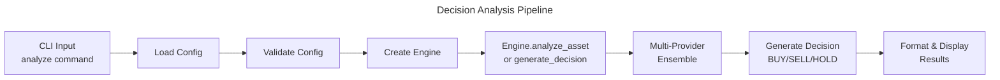

# C4 Code Level: CLI Commands Module

## Overview

- **Name**: Finance Feedback Engine CLI Commands Module
- **Description**: Command-line interface commands for trading, analysis, backtesting, optimization, monitoring, and system management
- **Location**: `/finance_feedback_engine/cli/commands/`
- **Language**: Python 3.8+
- **Purpose**: Provides modular CLI command handlers organized by domain (agent, analysis, backtest, trading, memory, optimization, experiment, demo, frontend) to enable users to execute trading workflows, analyze assets, backtest strategies, optimize parameters, and manage the trading engine

## Code Elements

### Module: `__init__.py`
- **Description**: Module initialization file declaring the module as a CLI command package
- **Location**: `/finance_feedback_engine/cli/commands/__init__.py`
- **Content**: Documentation docstring only
- **Dependencies**: None

---

### Module: `agent.py` - Agent and Trading Loop Commands

**Description**: Commands for running autonomous trading agents and live trade monitoring

**Location**: `/finance_feedback_engine/cli/commands/agent.py`

#### Helper Functions

##### `_initialize_agent(config, engine, take_profit, stop_loss, autonomous, asset_pairs_override=None) -> TradingLoopAgent`
- **Description**: Initializes the trading agent with portfolio monitor, configuration, and decision engine
- **Parameters**:
  - `config` (dict): Configuration dictionary
  - `engine` (FinanceFeedbackEngine): Engine instance with trading platform and decision engine
  - `take_profit` (float): Portfolio-level take-profit percentage (decimal)
  - `stop_loss` (float): Portfolio-level stop-loss percentage (decimal)
  - `autonomous` (bool): Force autonomous execution without approval prompts
  - `asset_pairs_override` (list, optional): Override asset pairs from config
- **Return Type**: TradingLoopAgent
- **Location**: Lines 32-200
- **Dependencies**:
  - `TradingAgentConfig` (agent.config)
  - `TradingLoopAgent` (agent.trading_loop_agent)
  - `TradeMonitor` (monitoring.trade_monitor)
  - Click console interaction
- **Key Logic**:
  - Validates and applies asset pairs override
  - Configures autonomous mode or signal-only mode (requires Telegram/webhook)
  - Validates notification channels (Telegram/webhook) for signal-only mode
  - Initializes and starts TradeMonitor
  - Validates agent signal-only mode support

##### `async _run_live_dashboard(engine, agent) -> None`
- **Description**: Runs comprehensive live dashboard with multi-tier refresh rates
- **Parameters**:
  - `engine` (FinanceFeedbackEngine): Engine with trade monitor and memory engine
  - `agent` (TradingLoopAgent): Trading agent instance
- **Return Type**: None (async coroutine)
- **Location**: Lines 203-298
- **Dependencies**:
  - `DashboardDataAggregator` (cli.dashboard_aggregator)
  - `LiveDashboard` (cli.live_dashboard)
  - Rich Live display
  - asyncio for sleep
- **Key Logic**:
  - Implements tiered refresh rates: fast (10s), medium (30s), slow (60s), lazy (120s)
  - Updates agent status, active trades, portfolio, recent decisions, market pulse, performance stats
  - Uses Rich's Live context for continuous rendering
  - Handles errors gracefully with debug logging

##### `_display_agent_configuration_summary(config, take_profit, stop_loss, asset_pairs_override=None) -> None`
- **Description**: Displays comprehensive agent configuration before startup
- **Parameters**:
  - `config` (dict): Configuration dictionary
  - `take_profit` (float): Portfolio take-profit percentage
  - `stop_loss` (float): Portfolio stop-loss percentage
  - `asset_pairs_override` (list, optional): Override asset pairs
- **Return Type**: None
- **Location**: Lines 301-407
- **Dependencies**: Rich Console, Table widgets
- **Key Logic**:
  - Displays execution mode (autonomous vs signal-only)
  - Shows notification channel configuration status
  - Displays trading parameters table
  - Validates configuration completeness
  - Provides platform information

##### `_confirm_agent_startup(config, take_profit, stop_loss, asset_pairs_override=None, skip_confirmation=False) -> bool`
- **Description**: Displays configuration summary and prompts user confirmation before agent startup
- **Parameters**:
  - `config` (dict): Configuration dictionary
  - `take_profit` (float): Portfolio take-profit percentage
  - `stop_loss` (float): Portfolio stop-loss percentage
  - `asset_pairs_override` (list, optional): Override asset pairs
  - `skip_confirmation` (bool): Skip prompt if --yes flag set
- **Return Type**: bool - True if user confirms, False otherwise
- **Location**: Lines 410-448
- **Dependencies**: Click confirmation dialog
- **Key Logic**:
  - Calls `_display_agent_configuration_summary` for display
  - Skips prompt if `skip_confirmation=True`
  - Handles KeyboardInterrupt and Click.Abort gracefully

#### Click Commands

##### `run_agent(ctx, take_profit, stop_loss, setup, autonomous, max_drawdown, asset_pairs, yes) -> None`
- **Decorator**: `@click.command(name="run-agent")`
- **Description**: Starts the autonomous trading agent with optional configuration setup
- **Parameters**:
  - `ctx` (click.Context): Click context
  - `take_profit` (float, default=0.05): Portfolio take-profit percentage
  - `stop_loss` (float, default=0.02): Portfolio stop-loss percentage
  - `setup` (bool, flag): Run interactive config setup before startup
  - `autonomous` (bool, flag): Force autonomous execution
  - `max_drawdown` (float, optional): Legacy option (ignored)
  - `asset_pairs` (str, optional): Comma-separated asset pairs override
  - `yes` (bool, flag): Skip confirmation prompt
- **Return Type**: None
- **Location**: Lines 451-597
- **Options**:
  - `--max-drawdown`: Legacy option for test compatibility (ignored)
  - `--take-profit, -tp` (float, default=0.05): Portfolio-level take-profit percentage
  - `--stop-loss, -sl` (float, default=0.02): Portfolio-level stop-loss percentage
  - `--setup` (flag): Run interactive config setup
  - `--autonomous` (flag): Override approval policy
  - `--asset-pairs` (str): Comma-separated list (e.g., "BTCUSD,ETHUSD")
  - `--yes, -y` (flag): Skip confirmation
- **Dependencies**:
  - `FinanceFeedbackEngine` (core)
  - `config_editor`, `load_tiered_config`, `_validate_config_on_startup` (cli.main)
  - `standardize_asset_pair` (utils.validation)
  - asyncio for concurrent task execution
- **Key Logic**:
  - Converts legacy percentage format (1-100) to decimal (0.01-1.0)
  - Validates percentage ranges
  - Optionally runs config setup via `ctx.invoke(config_editor)`
  - Parses and validates asset pairs override
  - Calls `_confirm_agent_startup` for user confirmation
  - Validates configuration on startup
  - Initializes FinanceFeedbackEngine and agent
  - Runs agent and optional live dashboard concurrently with asyncio.gather
  - Handles KeyboardInterrupt for graceful shutdown

##### `monitor(ctx) -> None`
- **Decorator**: `@click.group()`
- **Description**: Live trade monitoring command group (parent command)
- **Parameters**: `ctx` (click.Context)
- **Return Type**: None
- **Location**: Lines 600-610
- **Dependencies**: Click group decorator
- **Key Logic**: Checks if manual CLI control is enabled; displays deprecation notice if disabled

##### `monitor.start(ctx) -> None`
- **Decorator**: `@monitor.command()`, `@click.pass_context`
- **Description**: Start live trade monitoring (deprecated - monitor auto-starts)
- **Parameters**: `ctx` (click.Context)
- **Return Type**: None
- **Location**: Lines 613-626
- **Key Logic**: Shows deprecation message; monitor now auto-starts via configuration

##### `monitor.status(ctx) -> None`
- **Decorator**: `@monitor.command(name="status")`, `@click.pass_context`
- **Description**: Show live trade monitoring status (deprecated)
- **Parameters**: `ctx` (click.Context)
- **Return Type**: None
- **Location**: Lines 629-643
- **Key Logic**: Shows deprecation message; suggests using dashboard or decision context

##### `monitor.metrics(ctx) -> None`
- **Decorator**: `@monitor.command()`, `@click.pass_context`
- **Description**: Show trade performance metrics with aggregate stats
- **Parameters**: `ctx` (click.Context)
- **Return Type**: None
- **Location**: Lines 646-748
- **Dependencies**: JSON file I/O, Rich Table
- **Key Logic**:
  - Shows deprecation warning
  - Loads trade metrics from `data/trade_metrics/trade_*.json`
  - Calculates aggregate statistics (win rate, total/average P&L)
  - Displays metrics table with recent 10 trades
  - Color-codes P&L (green for positive, red for negative)

#### Module Exports
- **`commands`** (list): `[run_agent, monitor]` - Exported for registration in main.py

---

### Module: `analysis.py` - Asset Analysis Commands

**Description**: Commands for analyzing assets and viewing decision history

**Location**: `/finance_feedback_engine/cli/commands/analysis.py`

#### Helper Functions

##### `_handle_engine_init_error(ctx, config, e) -> FinanceFeedbackEngine`
- **Description**: Handles engine initialization errors with interactive fallback to mock platform
- **Parameters**:
  - `ctx` (click.Context): Click context
  - `config` (dict): Configuration dictionary
  - `e` (Exception): Original exception
- **Return Type**: FinanceFeedbackEngine
- **Location**: Lines 411-440
- **Dependencies**: FinanceFeedbackEngine (core)
- **Key Logic**:
  - Re-raises exception if not in interactive mode
  - Prompts user to switch to mock platform
  - Falls back to mock platform on user acceptance
  - Handles secondary mock initialization errors

#### Click Commands

##### `analyze(ctx, asset_pair, provider, show_pulse) -> None`
- **Decorator**: `@click.command()`, `@click.argument()`, `@click.option()`, `@click.pass_context`
- **Description**: Analyze an asset pair and generate trading decision with multi-provider ensemble
- **Parameters**:
  - `ctx` (click.Context): Click context
  - `asset_pair` (str): Asset pair identifier (e.g., "BTCUSD")
  - `provider` (str, optional): AI provider override (local/cli/codex/qwen/gemini/ensemble)
  - `show_pulse` (bool, flag): Display multi-timeframe technical analysis pulse data
- **Return Type**: None
- **Location**: Lines 23-345
- **Options**:
  - `asset_pair` (argument): Asset pair to analyze
  - `--provider, -p` (choice): AI provider selection
  - `--show-pulse` (flag): Display technical pulse
- **Dependencies**:
  - `FinanceFeedbackEngine` (core)
  - `standardize_asset_pair` (utils.validation)
  - `_validate_config_on_startup` (cli.main)
  - `display_pulse_data` (cli.formatters.pulse_formatter)
  - JSON file operations for failure logging
  - fcntl for file locking (Unix-like systems)
- **Key Logic**:
  - Standardizes asset pair format
  - Validates configuration on startup
  - Overrides AI provider if specified
  - Initializes FinanceFeedbackEngine with proper error handling
  - Calls `engine.generate_decision()` or `engine.analyze_asset()`
  - Handles NO_DECISION (quorum failure) with failure logging
  - Logs failures to `data/failures/{date}.json` with file locking (fcntl) or JSONL append
  - Displays decision details: action, confidence, position sizing, market data
  - Shows technical analysis (trend, RSI, volatility, price range)
  - Displays multi-timeframe pulse if requested
  - Shows sentiment analysis and macro indicators if available
  - Displays ensemble metadata (provider votes, agreement score, weights)

##### `history(ctx, asset, limit) -> None`
- **Decorator**: `@click.command()`, `@click.option()`, `@click.pass_context`
- **Description**: Show decision history with optional asset filtering
- **Parameters**:
  - `ctx` (click.Context): Click context
  - `asset` (str, optional): Filter by asset pair
  - `limit` (int, default=10): Number of decisions to show
- **Return Type**: None
- **Location**: Lines 348-404
- **Options**:
  - `--asset, -a` (str, optional): Filter by asset
  - `--limit, -l` (int, default=10): Number of decisions
- **Dependencies**:
  - `FinanceFeedbackEngine` (core)
  - `DecisionStore` (persistence.decision_store)
  - Rich Table
- **Key Logic**:
  - Retrieves decision history from engine
  - Falls back to DecisionStore if engine method unavailable
  - Displays decisions in table with columns: ID, Timestamp, Asset, Action, Confidence, Executed
  - Formats timestamps (HH:MM:SS)
  - Shows checkmark for executed decisions

#### Module Exports
- **`commands`** (list): `[analyze, history]` - Exported for registration in main.py

---

### Module: `backtest.py` - Backtesting and Strategy Validation Commands

**Description**: Commands for running backtests, portfolio backtests, walk-forward analysis, and Monte Carlo simulations

**Location**: `/finance_feedback_engine/cli/commands/backtest.py`

#### Click Commands

##### `backtest(ctx, asset_pair, start, end, initial_balance, fee_percentage, slippage_percentage, commission_per_trade, stop_loss_percentage, take_profit_percentage, timeframe, output_file) -> None`
- **Decorator**: `@click.command()`, `@click.argument()`, `@click.option()`, `@click.pass_context`
- **Description**: Run AI-driven backtest for single asset with customizable parameters
- **Parameters**:
  - `ctx` (click.Context): Click context
  - `asset_pair` (str): Asset pair to backtest
  - `start` (str): Start date (YYYY-MM-DD format)
  - `end` (str): End date (YYYY-MM-DD format)
  - `initial_balance` (float, optional): Starting balance override
  - `fee_percentage` (float, optional): Fee percentage override
  - `slippage_percentage` (float, optional): Slippage percentage override
  - `commission_per_trade` (float, optional): Fixed commission per trade
  - `stop_loss_percentage` (float, optional): Stop-loss percentage override
  - `take_profit_percentage` (float, optional): Take-profit percentage override
  - `timeframe` (str, default="1h"): Candle timeframe (1m/5m/15m/30m/1h/1d)
  - `output_file` (str, optional): Path to save trade history JSON
- **Return Type**: None
- **Location**: Lines 27-235
- **Options**: Multiple `@click.option()` decorators for parameters
- **Dependencies**:
  - `FinanceFeedbackEngine` (core)
  - `Backtester` (backtesting.backtester)
  - `standardize_asset_pair` (utils.validation)
  - `_validate_config_on_startup` (cli.main)
  - `format_single_asset_backtest` (cli.backtest_formatter)
- **Key Logic**:
  - Validates date format (YYYY-MM-DD)
  - Validates date range (start < end)
  - Standardizes asset pair
  - Marks config as backtest mode (`config["is_backtest"] = True`)
  - Merges CLI overrides with config defaults
  - Initializes Backtester with parameters
  - Handles both `backtester.run()` and `backtester.run_backtest()` methods
  - Saves trade history to JSON if requested
  - Formats and displays backtest results
  - Reports gatekeeper rejection count

##### `portfolio_backtest(ctx, asset_pairs, start, end, initial_balance, correlation_threshold, max_positions) -> None`
- **Decorator**: `@click.command(name="portfolio-backtest")`, `@click.argument()`, `@click.option()`, `@click.pass_context`
- **Description**: Run multi-asset portfolio backtest with correlation-aware position sizing
- **Parameters**:
  - `ctx` (click.Context): Click context
  - `asset_pairs` (tuple): Multiple asset pairs (minimum 2 required)
  - `start` (str): Start date (YYYY-MM-DD)
  - `end` (str): End date (YYYY-MM-DD)
  - `initial_balance` (float, default=10000): Starting balance
  - `correlation_threshold` (float, default=0.7): Correlation threshold for position sizing
  - `max_positions` (int, optional): Maximum concurrent positions
- **Return Type**: None
- **Location**: Lines 238-333
- **Dependencies**:
  - `PortfolioBacktester` (backtesting.portfolio_backtester)
  - `standardize_asset_pair` (utils.validation)
  - `format_full_results` (cli.backtest_formatter)
- **Key Logic**:
  - Validates minimum 2 assets required
  - Standardizes all asset pairs
  - Validates date range
  - Initializes PortfolioBacktester
  - Overrides correlation threshold and max positions
  - Runs portfolio backtest
  - Formats and displays results

##### `walk_forward(ctx, asset_pair, start_date, end_date, train_ratio, provider) -> None`
- **Decorator**: `@click.command(name="walk-forward")`, `@click.argument()`, `@click.option()`, `@click.pass_context`
- **Description**: Run walk-forward analysis with overfitting detection across rolling windows
- **Parameters**:
  - `ctx` (click.Context): Click context
  - `asset_pair` (str): Asset pair to analyze
  - `start_date` (str): Start date (YYYY-MM-DD)
  - `end_date` (str): End date (YYYY-MM-DD)
  - `train_ratio` (float, default=0.7): Training window ratio
  - `provider` (str, default="ensemble"): AI provider to use
- **Return Type**: None
- **Location**: Lines 336-485
- **Dependencies**:
  - `FinanceFeedbackEngine` (core)
  - `Backtester` (backtesting.backtester)
  - `WalkForwardAnalyzer` (backtesting.walk_forward)
- **Key Logic**:
  - Validates date range
  - Calculates rolling window sizes based on train_ratio
  - Creates shallow copies of config to avoid mutation
  - Initializes Backtester and WalkForwardAnalyzer
  - Runs walk-forward analysis with multiple train/test windows
  - Reports overfitting severity (NONE/LOW/MEDIUM/HIGH)
  - Displays average test performance metrics
  - Provides overfitting recommendations

##### `monte_carlo(ctx, asset_pair, start_date, end_date, simulations, noise_std, provider) -> None`
- **Decorator**: `@click.command(name="monte-carlo")`, `@click.argument()`, `@click.option()`, `@click.pass_context`
- **Description**: Run Monte Carlo simulation with price perturbations and risk analysis
- **Parameters**:
  - `ctx` (click.Context): Click context
  - `asset_pair` (str): Asset pair to simulate
  - `start_date` (str): Start date (YYYY-MM-DD)
  - `end_date` (str): End date (YYYY-MM-DD)
  - `simulations` (int, default=1000): Number of simulations
  - `noise_std` (float, default=0.001): Price noise standard deviation
  - `provider` (str, default="ensemble"): AI provider to use
- **Return Type**: None
- **Location**: Lines 488-596
- **Dependencies**:
  - `FinanceFeedbackEngine` (core)
  - `Backtester` (backtesting.backtester)
  - `MonteCarloSimulator` (backtesting.monte_carlo)
- **Key Logic**:
  - Validates configuration on startup
  - Creates config shallow copy to avoid mutation
  - Initializes Backtester and MonteCarloSimulator
  - Runs Monte Carlo simulation with price perturbations
  - Calculates confidence intervals (5th, 25th, 50th, 75th, 95th percentiles)
  - Calculates Value at Risk (VaR 95%)
  - Displays statistics: expected return, worst/best case, standard deviation

#### Module Exports
- **`commands`** (list): `[backtest, portfolio_backtest, walk_forward, monte_carlo]`

---

### Module: `experiment.py` - Optuna Experiment Runner

**Description**: Runs Optuna optimization experiments across multiple asset pairs with MLflow tracking

**Location**: `/finance_feedback_engine/cli/commands/experiment.py`

#### Helper Functions

##### `_write_csv(path, rows) -> None`
- **Description**: Writes optimization results to CSV file
- **Parameters**:
  - `path` (Path): Output file path
  - `rows` (list): List of result dictionaries
- **Return Type**: None
- **Location**: Lines 37-54
- **Key Logic**:
  - Defines fieldnames for CSV headers
  - Writes CSV with DictWriter
  - Handles missing fields gracefully

#### Click Commands

##### `experiment(ctx, asset_pairs, start_date, end_date, n_trials, seed, optimize_weights, multi_objective, no_mlflow) -> None`
- **Decorator**: `@click.command(name="experiment")`, `@click.argument()`, `@click.option()`, `@click.pass_context`
- **Description**: Run Optuna optimization experiments across multiple asset pairs with MLflow tracking
- **Parameters**:
  - `ctx` (click.Context): Click context
  - `asset_pairs` (list): Multiple asset pairs to optimize
  - `start_date` (str): Start date (YYYY-MM-DD)
  - `end_date` (str): End date (YYYY-MM-DD)
  - `n_trials` (int, default=50): Optuna trials per asset pair
  - `seed` (int, optional): Random seed for reproducibility
  - `optimize_weights` (bool, flag): Optimize ensemble provider weights
  - `multi_objective` (bool, flag): Multi-objective optimization (Sharpe + drawdown)
  - `no_mlflow` (bool, flag): Disable MLflow tracking
- **Return Type**: None
- **Location**: Lines 57-284
- **Dependencies**:
  - `OptunaOptimizer` (optimization.optuna_optimizer)
  - `standardize_asset_pair` (utils.validation)
  - `mlflow` (optional)
  - JSON and CSV file I/O
- **Key Logic**:
  - Validates config availability
  - Standardizes asset pairs
  - Creates output directory `data/optimization/`
  - Initializes MLflow experiment if available and not disabled
  - Iterates through asset pairs:
    - Creates OptunaOptimizer for each asset
    - Runs optimization study
    - Extracts best parameters and metrics
    - Logs results to MLflow (if enabled)
    - Displays progress
  - Writes summary JSON and CSV to `data/optimization/`
  - Handles MLflow errors gracefully

#### Module Exports
- **`commands`** (list): `[experiment]`

---

### Module: `memory.py` - Portfolio Memory and Learning Commands

**Description**: Commands for generating learning validation reports and pruning portfolio memory

**Location**: `/finance_feedback_engine/cli/commands/memory.py`

#### Click Commands

##### `learning_report(ctx, asset_pair) -> None`
- **Decorator**: `@click.command(name="learning-report")`, `@click.option()`, `@click.pass_context`
- **Description**: Generate comprehensive learning validation report with RL/meta-learning metrics
- **Parameters**:
  - `ctx` (click.Context): Click context
  - `asset_pair` (str, optional): Filter by asset pair
- **Return Type**: None
- **Location**: Lines 20-157
- **Options**:
  - `--asset-pair` (str, optional): Filter by asset pair
- **Dependencies**:
  - `FinanceFeedbackEngine` (core)
  - Rich Console and Table
- **Key Logic**:
  - Initializes engine and memory_engine
  - Calls `memory.generate_learning_validation_metrics()`
  - Displays metrics:
    - **Sample Efficiency**: DQN/Rainbow metrics, win rate achievement
    - **Cumulative Regret**: Multi-armed bandit theory, optimal provider analysis
    - **Concept Drift**: Drift severity (LOW/MEDIUM/HIGH), window win rates
    - **Thompson Sampling**: Exploration rate, exploitation convergence, provider distribution
    - **Learning Curve**: First/last 100 trades comparison, improvement percentages
  - Shows research methods and papers
  - Handles memory not initialized gracefully

##### `prune_memory(ctx, keep_recent, confirm) -> None`
- **Decorator**: `@click.command(name="prune-memory")`, `@click.option()`, `@click.pass_context`
- **Description**: Prune old trade outcomes from portfolio memory
- **Parameters**:
  - `ctx` (click.Context): Click context
  - `keep_recent` (int, default=1000): Keep N most recent trades
  - `confirm` (bool, flag): Require confirmation before pruning
- **Return Type**: None
- **Location**: Lines 160-232
- **Options**:
  - `--keep-recent` (int, default=1000): Number of recent trades to keep
  - `--confirm/--no-confirm` (flag, default=True): Require confirmation
- **Dependencies**:
  - `FinanceFeedbackEngine` (core)
  - Rich Prompt
- **Key Logic**:
  - Initializes engine and memory_engine
  - Gets current trade outcome count
  - Checks if pruning is needed
  - Prompts user for confirmation (if enabled)
  - Keeps last N trades
  - Persists changes if memory has `save()` method

#### Module Exports
- **`commands`** (list): `[learning_report, prune_memory]`

---

### Module: `optimize.py` - Hyperparameter Optimization Commands

**Description**: Commands for running Optuna-based hyperparameter optimization with MLflow tracking

**Location**: `/finance_feedback_engine/cli/commands/optimize.py`

#### Helper Functions

##### `_display_optimization_results(study, multi_objective) -> None`
- **Description**: Displays optimization results in formatted tables
- **Parameters**:
  - `study` (optuna.Study): Optuna study object
  - `multi_objective` (bool): Whether multi-objective optimization was used
- **Return Type**: None
- **Location**: Lines 266-330
- **Key Logic**:
  - Displays Pareto-optimal solutions for multi-objective
  - Displays best parameters for single-objective
  - Shows trial statistics (complete, pruned, failed)

#### Click Commands

##### `optimize(ctx, asset_pair, start_date, end_date, n_trials, timeout, multi_objective, optimize_weights, study_name, output_dir, mlflow_experiment, no_mlflow, show_progress) -> None`
- **Decorator**: `@click.command()`, `@click.argument()`, `@click.option()`, `@click.pass_context`
- **Description**: Run hyperparameter optimization using Optuna with MLflow tracking
- **Parameters**:
  - `ctx` (click.Context): Click context
  - `asset_pair` (str): Asset pair to optimize
  - `start_date` (str): Start date (YYYY-MM-DD)
  - `end_date` (str): End date (YYYY-MM-DD)
  - `n_trials` (int, default=50): Number of Optuna trials
  - `timeout` (int, optional): Timeout in seconds
  - `multi_objective` (bool, flag): Multi-objective optimization
  - `optimize_weights` (bool, flag): Optimize ensemble weights
  - `study_name` (str, optional): Study name for resuming
  - `output_dir` (str, default="data/optimization"): Output directory
  - `mlflow_experiment` (str, optional): MLflow experiment name
  - `no_mlflow` (bool, flag): Disable MLflow tracking
  - `show_progress` (bool, flag, default=True): Show progress bar
- **Return Type**: None
- **Location**: Lines 33-263
- **Dependencies**:
  - `OptunaOptimizer` (optimization.optuna_optimizer)
  - `load_config` (utils.config_loader)
  - `standardize_asset_pair` (utils.validation)
  - `mlflow` (optional)
  - JSON and YAML file I/O
- **Key Logic**:
  - Standardizes asset pair
  - Loads configuration
  - Initializes MLflow experiment (if available)
  - Creates output directory
  - Initializes OptunaOptimizer
  - Runs optimization with or without MLflow context
  - Logs parameters and results to MLflow
  - Saves optimization report (JSON) and best config (YAML)
  - Displays optimization results via `_display_optimization_results`
  - Provides next steps guidance

#### Module Exports
- **`commands`** (list): `[optimize]`

---

### Module: `trading.py` - Trading Execution Commands

**Description**: Commands for executing trades and checking account balances

**Location**: `/finance_feedback_engine/cli/commands/trading.py`

#### Click Commands

##### `balance(ctx) -> None`
- **Decorator**: `@click.command()`, `@click.pass_context`
- **Description**: Show current account balances across all assets
- **Parameters**: `ctx` (click.Context)
- **Return Type**: None
- **Location**: Lines 16-46
- **Dependencies**:
  - `FinanceFeedbackEngine` (core)
  - `_validate_config_on_startup` (cli.main)
  - Rich Table
- **Key Logic**:
  - Validates configuration on startup
  - Calls `engine.get_balance()`
  - Displays balances in table with formatted currency

##### `execute(ctx, decision_id) -> None`
- **Decorator**: `@click.command()`, `@click.argument()`, `@click.pass_context`
- **Description**: Execute a trading decision (with interactive selection if no ID provided)
- **Parameters**:
  - `ctx` (click.Context): Click context
  - `decision_id` (str, optional): Decision ID to execute
- **Return Type**: None
- **Location**: Lines 49-170
- **Options**:
  - `decision_id` (argument, optional): ID of decision to execute
- **Dependencies**:
  - `FinanceFeedbackEngine` (core)
  - `_validate_config_on_startup` (cli.main)
  - `DecisionStore` (persistence.decision_store)
  - Rich Table and Console input
- **Key Logic**:
  - If no decision_id provided, fetches recent decisions and displays interactive table
  - Filters out HOLD decisions (non-executable)
  - Prompts user to select decision by number
  - Validates user input (1-N range)
  - Calls `engine.execute_decision(decision_id)`
  - Displays execution result (success/failure, platform, message)

#### Module Exports
- **`commands`** (list): `[balance, execute]`

---

### Module: `demo.py` - Interactive Demo Commands

**Description**: Provides interactive demonstrations of key workflows with demo data

**Location**: `/finance_feedback_engine/cli/commands/demo.py`

#### Helper Functions

##### `_demo_quick(engine, asset) -> None`
- **Description**: Quick demo: Single asset analysis
- **Parameters**:
  - `engine` (FinanceFeedbackEngine): Engine instance
  - `asset` (str): Asset pair to analyze
- **Return Type**: None
- **Location**: Lines 57-74
- **Key Logic**:
  - Calls `engine.analyze_asset()` asynchronously
  - Displays action, confidence, position size
  - Shows decision output location

##### `_demo_full(engine, asset) -> None`
- **Description**: Full demo: Multiple features showcase
- **Parameters**:
  - `engine` (FinanceFeedbackEngine): Engine instance
  - `asset` (str): Asset pair to analyze
- **Return Type**: None
- **Location**: Lines 77-110
- **Key Logic**:
  - Demonstrates analysis workflow
  - Shows portfolio balance
  - Displays monitoring capabilities preview

##### `_demo_live_monitoring(engine, asset) -> None`
- **Description**: Demo live monitoring system
- **Parameters**:
  - `engine` (FinanceFeedbackEngine): Engine instance
  - `asset` (str): Asset pair (not used in demo)
- **Return Type**: None
- **Location**: Lines 113-133
- **Key Logic**:
  - Displays monitoring capabilities overview
  - Shows CLI commands for monitoring workflows

#### Click Commands

##### `demo(mode, asset) -> None`
- **Decorator**: `@click.command(name="demo")`, `@click.option()`
- **Description**: Run interactive demo of Finance Feedback Engine
- **Parameters**:
  - `mode` (str, default="quick"): Demo mode (quick/full/live-monitoring)
  - `asset` (str, default="BTCUSD"): Asset pair to analyze
- **Return Type**: None
- **Location**: Lines 18-54
- **Options**:
  - `--mode` (choice: quick/full/live-monitoring, default="quick")
  - `--asset` (str, default="BTCUSD"): Asset pair to analyze
- **Dependencies**:
  - `FinanceFeedbackEngine` (core)
  - `load_config` (utils.config_loader)
  - asyncio
- **Key Logic**:
  - Retrieves config from Click context or loads from file
  - Routes to appropriate demo function
  - Handles errors and logging

#### Module Exports
- **`commands`** (implicit, registered in main.py)**

---

### Module: `frontend.py` - Frontend Lifecycle Management

**Description**: Manages the React frontend: development server, production build, and serving

**Location**: `/finance_feedback_engine/cli/commands/frontend.py`

#### Click Command Group

##### `frontend() -> None`
- **Decorator**: `@click.group()`
- **Description**: Frontend management command group (parent)
- **Return Type**: None
- **Location**: Lines 15-18

#### Subcommands

##### `frontend.dev(port) -> None`
- **Decorator**: `@frontend.command()`, `@click.option()`
- **Description**: Start frontend development server with hot reload
- **Parameters**: `port` (int, default=5173)
- **Return Type**: None
- **Location**: Lines 21-66
- **Key Logic**:
  - Locates frontend directory
  - Auto-installs dependencies if needed
  - Runs `npm run dev` with port configuration
  - Handles Ctrl+C gracefully

##### `frontend.build(output_dir) -> None`
- **Decorator**: `@frontend.command()`, `@click.option()`
- **Description**: Build frontend for production
- **Parameters**: `output_dir` (str, default="dist")
- **Return Type**: None
- **Location**: Lines 69-120
- **Key Logic**:
  - Auto-installs dependencies if needed
  - Runs `npm run build`
  - Sets VITE_OUTPUT_DIR environment variable
  - Verifies dist directory exists

##### `frontend.serve(port, dist_dir) -> None`
- **Decorator**: `@frontend.command()`, `@click.option()`
- **Description**: Serve built frontend (production mode)
- **Parameters**:
  - `port` (int, default=8080): Server port
  - `dist_dir` (str, default="dist"): Distribution directory
- **Return Type**: None
- **Location**: Lines 123-161
- **Key Logic**:
  - Verifies dist directory exists
  - Uses Python's http.server for serving
  - Handles Ctrl+C gracefully

##### `frontend.install() -> None`
- **Decorator**: `@frontend.command()`
- **Description**: Install frontend dependencies (npm install)
- **Return Type**: None
- **Location**: Lines 164-182
- **Key Logic**:
  - Runs `npm install` in frontend directory
  - Validates frontend directory exists

##### `frontend.status() -> None`
- **Decorator**: `@frontend.command()`
- **Description**: Check frontend build status and dependencies
- **Return Type**: None
- **Location**: Lines 185-224
- **Key Logic**:
  - Checks for node_modules directory
  - Checks for dist directory
  - Reads package.json and displays version info
  - Shows framework information

#### Module Exports
- **Implicit - registered as command group in main.py**

---

## Dependencies

### Internal Dependencies

#### Direct Imports
- **`finance_feedback_engine.agent.config`**: TradingAgentConfig
- **`finance_feedback_engine.agent.trading_loop_agent`**: TradingLoopAgent
- **`finance_feedback_engine.core`**: FinanceFeedbackEngine (primary integration point)
- **`finance_feedback_engine.monitoring.trade_monitor`**: TradeMonitor
- **`finance_feedback_engine.backtesting.backtester`**: Backtester
- **`finance_feedback_engine.backtesting.portfolio_backtester`**: PortfolioBacktester
- **`finance_feedback_engine.backtesting.walk_forward`**: WalkForwardAnalyzer
- **`finance_feedback_engine.backtesting.monte_carlo`**: MonteCarloSimulator
- **`finance_feedback_engine.optimization.optuna_optimizer`**: OptunaOptimizer
- **`finance_feedback_engine.persistence.decision_store`**: DecisionStore
- **`finance_feedback_engine.cli.main`**: config_editor, load_tiered_config, _validate_config_on_startup
- **`finance_feedback_engine.cli.dashboard_aggregator`**: DashboardDataAggregator
- **`finance_feedback_engine.cli.live_dashboard`**: LiveDashboard
- **`finance_feedback_engine.cli.backtest_formatter`**: format_single_asset_backtest, format_full_results
- **`finance_feedback_engine.cli.formatters.pulse_formatter`**: display_pulse_data
- **`finance_feedback_engine.utils.config_loader`**: load_config
- **`finance_feedback_engine.utils.environment`**: get_environment_name
- **`finance_feedback_engine.utils.validation`**: standardize_asset_pair

### External Dependencies

- **`click`**: Command-line interface framework (version 8.x+)
  - Decorators: `@click.command()`, `@click.group()`, `@click.argument()`, `@click.option()`, `@click.pass_context`
  - Functions: `click.confirm()`, `click.Abort()`, `click.BadParameter()`, `click.ClickException()`
  - Context: `click.get_current_context()`

- **`rich`**: Terminal formatting library
  - `Console`: Rich console for styled output
  - `Table`: Formatted table display
  - `Panel`: Decorative panels
  - `Live`: Real-time screen updates
  - `Prompt`: User input prompts

- **`asyncio`**: Asynchronous I/O library
  - Functions: `asyncio.run()`, `asyncio.sleep()`, `asyncio.gather()`

- **`json`**: JSON serialization/deserialization

- **`csv`**: CSV file reading/writing

- **`logging`**: Standard Python logging module

- **`pathlib.Path`**: File path operations

- **`datetime`**: Date/time handling

- **`os`**: Operating system operations

- **`subprocess`**: Process execution (frontend commands)

- **`sys`**: System operations

- **`fcntl`** (optional, Unix-like systems): File locking for concurrent writes
  - Used in `analysis.py` for safe concurrent access to failure log files

- **`mlflow`** (optional): Experiment tracking and MLflow integration
  - Used in `experiment.py` and `optimize.py`
  - Graceful fallback if not installed

- **`optuna`**: Hyperparameter optimization framework (implicit via OptunaOptimizer)

---

## Relationships

### Code Structure Diagram

```mermaid
---
title: CLI Commands Module Architecture
---
classDiagram
    namespace Commands {
        class agent_cmd["agent.py Commands"] {
            <<module>>
            +run_agent() void
            +monitor() group
            +_initialize_agent() TradingLoopAgent
            +_run_live_dashboard() async void
            +_confirm_agent_startup() bool
        }
        class analysis_cmd["analysis.py Commands"] {
            <<module>>
            +analyze() void
            +history() void
            +_handle_engine_init_error() FinanceFeedbackEngine
        }
        class backtest_cmd["backtest.py Commands"] {
            <<module>>
            +backtest() void
            +portfolio_backtest() void
            +walk_forward() void
            +monte_carlo() void
        }
        class experiment_cmd["experiment.py Commands"] {
            <<module>>
            +experiment() void
            +_write_csv() void
        }
        class memory_cmd["memory.py Commands"] {
            <<module>>
            +learning_report() void
            +prune_memory() void
        }
        class optimize_cmd["optimize.py Commands"] {
            <<module>>
            +optimize() void
            +_display_optimization_results() void
        }
        class trading_cmd["trading.py Commands"] {
            <<module>>
            +balance() void
            +execute() void
        }
        class demo_cmd["demo.py Commands"] {
            <<module>>
            +demo() void
            +_demo_quick() void
            +_demo_full() void
            +_demo_live_monitoring() void
        }
        class frontend_cmd["frontend.py Commands"] {
            <<module>>
            +frontend() group
            +dev() void
            +build() void
            +serve() void
            +install() void
            +status() void
        }
    }

    namespace Integration {
        class FinanceFeedbackEngine {
            <<external>>
            +generate_decision() dict
            +analyze_asset() dict
            +get_decision_history() list
            +execute_decision() dict
            +get_balance() dict
        }
        class TradingLoopAgent {
            <<external>>
            +run() async void
            +stop() void
        }
        class TradeMonitor {
            <<external>>
            +start() void
            +stop() void
        }
        class Backtester {
            <<external>>
            +run() dict
        }
        class OptunaOptimizer {
            <<external>>
            +optimize() Study
            +generate_report() dict
        }
    }

    namespace Support {
        class ClickFramework {
            <<external>>
            Provides command routing
        }
        class RichLibrary {
            <<external>>
            Provides terminal formatting
        }
    }

    agent_cmd --> FinanceFeedbackEngine
    agent_cmd --> TradingLoopAgent
    agent_cmd --> TradeMonitor
    analysis_cmd --> FinanceFeedbackEngine
    backtest_cmd --> FinanceFeedbackEngine
    backtest_cmd --> Backtester
    experiment_cmd --> OptunaOptimizer
    optimize_cmd --> OptunaOptimizer
    memory_cmd --> FinanceFeedbackEngine
    trading_cmd --> FinanceFeedbackEngine
    demo_cmd --> FinanceFeedbackEngine
```



### Command Dependency Flow

```mermaid
---
title: Command Execution Flow
---
flowchart TB
    subgraph User["User Input (Click)"]
        RUN["run_agent"]
        ANALYZE["analyze"]
        BACKTEST["backtest"]
        OPTIMIZE["optimize"]
        EXPERIMENT["experiment"]
        MEMORY["learning-report<br/>prune-memory"]
        TRADING["balance<br/>execute"]
        DEMO["demo"]
        FRONTEND["frontend<br/>dev/build/serve"]
    end

    subgraph Engine["FinanceFeedbackEngine"]
        INIT["Initialization"]
        DECISION["Decision Engine"]
        MONITOR["Trade Monitor"]
        MEMORY_ENG["Memory Engine"]
    end

    subgraph Backtesting["Backtesting Module"]
        BT["Backtester"]
        PB["PortfolioBacktester"]
        WF["WalkForwardAnalyzer"]
        MC["MonteCarloSimulator"]
    end

    subgraph Optimization["Optimization Module"]
        OPTUNA["OptunaOptimizer"]
    end

    RUN --> INIT
    RUN --> MONITOR
    ANALYZE --> DECISION
    BACKTEST --> BT
    BACKTEST --> DECISION
    OPTIMIZE --> OPTUNA
    EXPERIMENT --> OPTUNA
    MEMORY --> MEMORY_ENG
    TRADING --> INIT
    DEMO --> INIT
    FRONTEND --> "Subprocess<br/>npm commands"
```

### Data Flow: Command → Engine → Decision



---

## Notes

### Key Architectural Patterns

1. **Command Modularity**: Each command file focuses on a specific domain (agent, analysis, backtest, etc.), enabling independent testing and maintenance

2. **Configuration Validation**: All commands validate configuration on startup via `_validate_config_on_startup()` to catch issues early

3. **Interactive Error Handling**: Commands like `analyze()` implement graceful fallbacks (mock platform) for initialization errors

4. **Async Support**: Agent and demo commands use asyncio for concurrent execution (agent + dashboard)

5. **File Locking**: `analyze.py` uses fcntl-based locking for safe concurrent writes to failure logs

6. **Tiered Refresh Rates**: Live dashboard implements adaptive refresh rates (fast/medium/slow/lazy) to optimize performance

7. **MLflow Integration**: Optimization and experiment commands optionally track results in MLflow for reproducibility

8. **Flexible Overrides**: Commands like `backtest` allow CLI parameters to override configuration file defaults

### Critical Implementation Details

- **Signal-Only Mode**: Agent initialization validates that notification channels (Telegram/webhook) are configured when autonomous mode is disabled
- **Failure Logging**: Analysis failures are logged to JSONL format (one JSON per line) with atomic append semantics
- **Config Mutation Prevention**: Walk-forward and Monte Carlo commands create shallow config copies to avoid mutating shared context
- **Asset Pair Standardization**: All commands standardize asset pair format using `standardize_asset_pair()` utility
- **Frontend Independence**: Frontend commands use subprocess to manage npm operations, allowing independent deployment

### Usage Patterns

- **Agent Execution**: `python main.py run-agent [--autonomous] [--asset-pairs BTCUSD,ETHUSD]`
- **Analysis**: `python main.py analyze BTCUSD [--provider ensemble] [--show-pulse]`
- **Backtesting**: `python main.py backtest BTCUSD --start 2024-01-01 --end 2024-03-01`
- **Optimization**: `python main.py optimize BTCUSD --start 2024-01-01 --end 2024-03-01 --n-trials 100`
- **Memory Management**: `python main.py learning-report [--asset-pair BTCUSD]`
- **Trading**: `python main.py balance` or `python main.py execute [DECISION_ID]`
