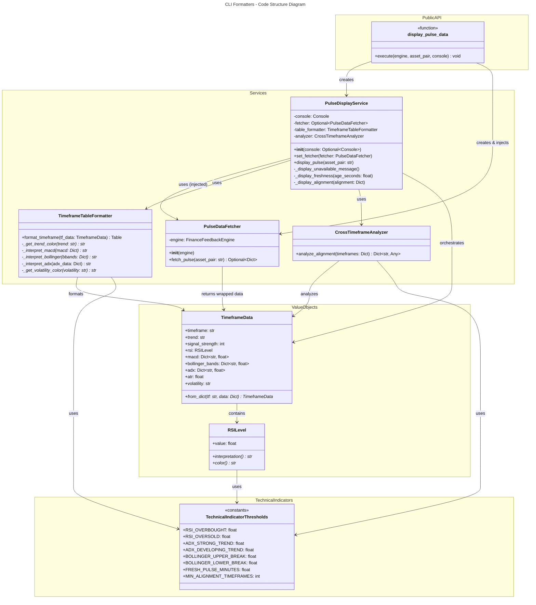
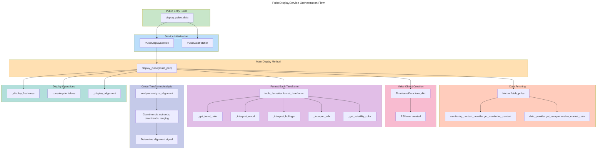

# C4 Code Level: CLI Formatters

## Overview

- **Name**: CLI Pulse Data Display Formatters
- **Description**: A modular, SOLID-compliant formatting system for displaying multi-timeframe technical analysis pulse data in the CLI. Implements presentation logic with clean separation of concerns between data fetching, formatting, analysis, and display orchestration.
- **Location**: `/home/cmp6510/finance_feedback_engine-2.0/finance_feedback_engine/cli/formatters/`
- **Language**: Python (3.8+)
- **Purpose**: Provide richly formatted, interpretable display of multi-timeframe technical indicators (RSI, MACD, Bollinger Bands, ADX, volatility) and cross-timeframe trend alignment analysis. Refactored from monolithic CLI code to follow SOLID principles with proper value objects and single responsibilities.

## Code Elements

### Constants & Configuration

#### TechnicalIndicatorThresholds
- **Type**: Class (Constants)
- **Location**: `/home/cmp6510/finance_feedback_engine-2.0/finance_feedback_engine/cli/formatters/pulse_formatter.py:19-32`
- **Purpose**: Centralized configuration for technical indicator thresholds, eliminating magic numbers
- **Attributes**:
  - `RSI_OVERBOUGHT: float = 70.0` - RSI threshold for overbought condition
  - `RSI_OVERSOLD: float = 30.0` - RSI threshold for oversold condition
  - `ADX_STRONG_TREND: float = 25.0` - ADX threshold for strong trend signal
  - `ADX_DEVELOPING_TREND: float = 20.0` - ADX threshold for developing trend
  - `BOLLINGER_UPPER_BREAK: float = 1.0` - Bollinger %B threshold for upper band breakout
  - `BOLLINGER_LOWER_BREAK: float = 0.0` - Bollinger %B threshold for lower band breakout
  - `FRESH_PULSE_MINUTES: float = 10.0` - Threshold for "fresh" pulse data age
  - `MIN_ALIGNMENT_TIMEFRAMES: int = 3` - Minimum timeframes required for strong alignment signal
- **Dependencies**: None (pure constants)

### Value Objects

#### RSILevel
- **Type**: Frozen Dataclass (Value Object)
- **Location**: `/home/cmp6510/finance_feedback_engine-2.0/finance_feedback_engine/cli/formatters/pulse_formatter.py:35-57`
- **Purpose**: Encapsulates RSI value with interpretation and color display logic (eliminates primitive obsession)
- **Attributes**:
  - `value: float` - The RSI indicator value (0-100)
- **Methods**:
  - `interpretation(self) -> str` (property)
    - **Purpose**: Returns text interpretation of RSI level
    - **Returns**: "OVERBOUGHT" if value > 70.0, "OVERSOLD" if value < 30.0, "NEUTRAL" otherwise
    - **Dependencies**: `TechnicalIndicatorThresholds.RSI_OVERBOUGHT`, `TechnicalIndicatorThresholds.RSI_OVERSOLD`
  - `color(self) -> str` (property)
    - **Purpose**: Returns Rich console color code for RSI display
    - **Returns**: "red" for overbought, "green" for oversold, "yellow" for neutral
    - **Dependencies**: `TechnicalIndicatorThresholds.RSI_OVERBOUGHT`, `TechnicalIndicatorThresholds.RSI_OVERSOLD`
- **Dependencies**: `TechnicalIndicatorThresholds`

#### TimeframeData
- **Type**: Frozen Dataclass (Value Object)
- **Location**: `/home/cmp6510/finance_feedback_engine-2.0/finance_feedback_engine/cli/formatters/pulse_formatter.py:60-87`
- **Purpose**: Encapsulates all technical data for a single timeframe; serves as immutable data transfer object from API to presentation layer
- **Attributes**:
  - `timeframe: str` - Timeframe identifier (e.g., "1h", "4h", "1d")
  - `trend: str` - Current trend ("UPTREND", "DOWNTREND", "RANGING")
  - `signal_strength: int` - Signal strength 0-100
  - `rsi: RSILevel` - RSI value object with interpretation
  - `macd: Dict[str, float]` - MACD data (macd, signal, histogram values)
  - `bollinger_bands: Dict[str, float]` - Bollinger Band data (upper, lower, middle, percent_b)
  - `adx: Dict[str, float]` - ADX data (adx, plus_di, minus_di values)
  - `atr: float` - Average True Range value
  - `volatility: str` - Volatility level ("low", "medium", "high")
- **Methods**:
  - `from_dict(cls, tf: str, data: Dict[str, Any]) -> TimeframeData` (classmethod)
    - **Purpose**: Factory method for creating TimeframeData from API response dictionary
    - **Parameters**:
      - `tf: str` - Timeframe identifier
      - `data: Dict[str, Any]` - Raw pulse data from API
    - **Returns**: Fully initialized `TimeframeData` instance with safe defaults
    - **Location**: Lines 74-87
    - **Dependencies**: None (internal construction)
- **Dependencies**: `RSILevel`, `typing.Dict`, `typing.Any`

### Service Classes

#### PulseDataFetcher
- **Type**: Class (Service)
- **Location**: `/home/cmp6510/finance_feedback_engine-2.0/finance_feedback_engine/cli/formatters/pulse_formatter.py:90-141`
- **Purpose**: Handles all data retrieval logic with clean separation from presentation (Single Responsibility Principle)
- **Attributes**:
  - `engine: FinanceFeedbackEngine` - Reference to the main engine instance
- **Methods**:
  - `__init__(self, engine: FinanceFeedbackEngine) -> None`
    - **Purpose**: Initialize fetcher with engine reference
    - **Location**: Lines 97-99
    - **Dependencies**: `FinanceFeedbackEngine` from core module
  - `fetch_pulse(self, asset_pair: str) -> Optional[Dict[str, Any]]`
    - **Purpose**: Fetch multi-timeframe pulse data with fallback strategy (monitoring context → data provider)
    - **Parameters**: `asset_pair: str` - Asset pair to fetch pulse data for
    - **Returns**: Dictionary with "timeframes" key containing timeframe data, or None if unavailable
    - **Behavior**:
      1. Attempts to fetch from `engine.monitoring_context_provider.get_monitoring_context()`
      2. Falls back to `engine.data_provider.get_comprehensive_market_data()`
      3. Normalizes pulse data structure for consistency
      4. Returns None on all failures after logging
    - **Location**: Lines 101-141
    - **Dependencies**:
      - `engine.monitoring_context_provider` (optional)
      - `engine.data_provider` (fallback)
      - `logging` module
      - `Optional`, `Dict`, `Any` from typing

#### TimeframeTableFormatter
- **Type**: Class (Service)
- **Location**: `/home/cmp6510/finance_feedback_engine-2.0/finance_feedback_engine/cli/formatters/pulse_formatter.py:144-251`
- **Purpose**: Formats single timeframe data into Rich Table for terminal display (Presentation Logic Only)
- **Methods**:
  - `format_timeframe(self, tf_data: TimeframeData) -> Table`
    - **Purpose**: Create a formatted Rich table for a single timeframe
    - **Parameters**: `tf_data: TimeframeData` - Timeframe data to format
    - **Returns**: `rich.table.Table` with indicators and interpretations
    - **Displays**: Trend, RSI, MACD, Bollinger Bands (%B), ADX, ATR/Volatility
    - **Location**: Lines 151-194
    - **Dependencies**: `TimeframeData`, `Table` from rich.table, `TechnicalIndicatorThresholds`
  - `_get_trend_color(trend: str) -> str` (staticmethod)
    - **Purpose**: Map trend type to display color
    - **Parameters**: `trend: str` - Trend value ("UPTREND", "DOWNTREND", "RANGING")
    - **Returns**: Rich color string ("green", "red", "yellow", "white")
    - **Location**: Lines 196-201
    - **Dependencies**: None
  - `_interpret_macd(macd: Dict[str, float]) -> str` (staticmethod)
    - **Purpose**: Generate human-readable MACD interpretation with color codes
    - **Parameters**: `macd: Dict[str, float]` - MACD data with histogram
    - **Returns**: Rich-formatted string with MACD interpretation
    - **Logic**: Bullish if histogram > 0, Bearish if < 0, Neutral if = 0
    - **Location**: Lines 203-211
    - **Dependencies**: `Dict` from typing
  - `_interpret_bollinger(bbands: Dict[str, float]) -> str` (staticmethod)
    - **Purpose**: Interpret Bollinger Band position relative to bands
    - **Parameters**: `bbands: Dict[str, float]` - Bollinger Band data with percent_b
    - **Returns**: Rich-formatted interpretation string
    - **Location**: Lines 213-221
    - **Dependencies**: `TechnicalIndicatorThresholds`, `Dict` from typing
  - `_interpret_adx(self, adx_data: Dict[str, float]) -> str`
    - **Purpose**: Comprehensive ADX interpretation combining strength and direction
    - **Parameters**: `adx_data: Dict[str, float]` - ADX data with adx, plus_di, minus_di
    - **Returns**: Rich-formatted string with strength and direction analysis
    - **Location**: Lines 223-244
    - **Dependencies**: `TechnicalIndicatorThresholds`, `Dict` from typing
  - `_get_volatility_color(volatility: str) -> str` (staticmethod)
    - **Purpose**: Map volatility level to display color
    - **Parameters**: `volatility: str` - Volatility level ("low", "medium", "high")
    - **Returns**: Rich color string ("green", "yellow", "red", "white")
    - **Location**: Lines 246-251
    - **Dependencies**: None
- **Dependencies**: `Table`, `Console` from rich, `TimeframeData`, `TechnicalIndicatorThresholds`

#### CrossTimeframeAnalyzer
- **Type**: Class (Service)
- **Location**: `/home/cmp6510/finance_feedback_engine-2.0/finance_feedback_engine/cli/formatters/pulse_formatter.py:254-293`
- **Purpose**: Analyzes trend alignment across multiple timeframes (Multi-timeframe Analysis Only)
- **Methods**:
  - `analyze_alignment(self, timeframes: Dict[str, TimeframeData]) -> Dict[str, Any]`
    - **Purpose**: Determine cross-timeframe trend alignment and signal strength
    - **Parameters**: `timeframes: Dict[str, TimeframeData]` - All timeframe data to analyze
    - **Returns**: Dictionary with keys:
      - `alignment: str` - "BULLISH ALIGNMENT", "BEARISH ALIGNMENT", or "MIXED SIGNALS"
      - `color: str` - "bold green", "bold red", or "yellow" for display
      - `uptrends: int` - Count of UPTREND timeframes
      - `downtrends: int` - Count of DOWNTREND timeframes
      - `ranging: int` - Count of RANGING timeframes
    - **Logic**:
      1. Counts trend occurrences across timeframes
      2. If uptrends >= MIN_ALIGNMENT_TIMEFRAMES and > downtrends → BULLISH
      3. If downtrends >= MIN_ALIGNMENT_TIMEFRAMES and > uptrends → BEARISH
      4. Otherwise → MIXED SIGNALS
    - **Location**: Lines 261-293
    - **Dependencies**: `TimeframeData`, `TechnicalIndicatorThresholds`, `Dict`, `Any` from typing
- **Dependencies**: `Dict`, `Any` from typing

#### PulseDisplayService
- **Type**: Class (Facade/Orchestrator)
- **Location**: `/home/cmp6510/finance_feedback_engine-2.0/finance_feedback_engine/cli/formatters/pulse_formatter.py:296-389`
- **Purpose**: Coordinates all components (Facade pattern) - orchestrates data fetching, formatting, analysis, and display
- **Attributes**:
  - `console: Console` - Rich console instance for output
  - `fetcher: Optional[PulseDataFetcher]` - Injected data fetcher
  - `table_formatter: TimeframeTableFormatter` - Formatter instance
  - `analyzer: CrossTimeframeAnalyzer` - Analyzer instance
- **Methods**:
  - `__init__(self, console: Optional[Console] = None) -> None`
    - **Purpose**: Initialize display service with optional console
    - **Parameters**: `console: Optional[Console]` - Rich console (creates new if None)
    - **Location**: Lines 303-308
    - **Dependencies**: `Console` from rich.console, `Optional` from typing
  - `set_fetcher(self, fetcher: PulseDataFetcher) -> None`
    - **Purpose**: Dependency injection for data fetcher (required before calling display_pulse)
    - **Parameters**: `fetcher: PulseDataFetcher` - Data fetcher instance to use
    - **Location**: Lines 310-312
    - **Dependencies**: `PulseDataFetcher`
  - `display_pulse(self, asset_pair: str) -> None`
    - **Purpose**: Main orchestration method - displays complete pulse analysis with all components
    - **Parameters**: `asset_pair: str` - Asset pair to analyze
    - **Raises**: `ValueError` if fetcher not injected
    - **Behavior**:
      1. Fetches pulse data via fetcher
      2. Displays freshness status
      3. Converts raw data to TimeframeData value objects
      4. Formats and displays each timeframe table
      5. Performs cross-timeframe alignment analysis
      6. Displays alignment summary
    - **Location**: Lines 314-358
    - **Dependencies**: `PulseDataFetcher`, `TimeframeData`, `logging`
  - `_display_unavailable_message(self) -> None`
    - **Purpose**: Display user-friendly message when pulse data is unavailable
    - **Location**: Lines 360-366
    - **Dependencies**: `Console`
  - `_display_freshness(self, age_seconds: float) -> None`
    - **Purpose**: Display and interpret pulse data age/freshness
    - **Parameters**: `age_seconds: float` - Age of pulse data in seconds
    - **Location**: Lines 368-378
    - **Dependencies**: `TechnicalIndicatorThresholds`, `Console`
  - `_display_alignment(self, alignment: Dict[str, Any]) -> None`
    - **Purpose**: Display cross-timeframe alignment analysis results
    - **Parameters**: `alignment: Dict[str, Any]` - Alignment analysis output from analyzer
    - **Location**: Lines 380-389
    - **Dependencies**: `Console`, `Dict`, `Any` from typing
- **Dependencies**: `Console` from rich.console, `PulseDataFetcher`, `TimeframeTableFormatter`, `CrossTimeframeAnalyzer`, `TimeframeData`, `logging`, `Optional`, `Dict`, `Any` from typing

### Public API

#### display_pulse_data
- **Type**: Function (Public API)
- **Location**: `/home/cmp6510/finance_feedback_engine-2.0/finance_feedback_engine/cli/formatters/pulse_formatter.py:392-411`
- **Signature**: `display_pulse_data(engine: FinanceFeedbackEngine, asset_pair: str, console: Optional[Console] = None) -> None`
- **Purpose**: Public entry point for CLI commands - displays multi-timeframe pulse data for asset pair
- **Parameters**:
  - `engine: FinanceFeedbackEngine` - FinanceFeedbackEngine instance for data access
  - `asset_pair: str` - Asset pair to analyze
  - `console: Optional[Console]` - Optional Rich console (creates new if None)
- **Returns**: None (outputs directly to console)
- **Behavior**:
  1. Creates PulseDisplayService instance
  2. Creates PulseDataFetcher and injects it
  3. Calls service.display_pulse() for orchestrated display
- **Example Usage**:
  ```python
  from finance_feedback_engine.cli.formatters.pulse_formatter import display_pulse_data
  display_pulse_data(engine, "BTCUSD")
  ```
- **Dependencies**: `PulseDisplayService`, `PulseDataFetcher`, `FinanceFeedbackEngine`, `Optional`, `Console` from rich.console
- **Location**: Lines 392-411

## Dependencies

### Internal Dependencies

1. **finance_feedback_engine.core.FinanceFeedbackEngine**
   - Purpose: Main engine interface for accessing data providers and monitoring context
   - Used by: `PulseDataFetcher.__init__`, `display_pulse_data`
   - Access pattern: `engine.monitoring_context_provider`, `engine.data_provider`

2. **finance_feedback_engine.cli.commands.analysis**
   - Purpose: CLI command that imports and uses `display_pulse_data`
   - Used by: Imports `display_pulse_data` for `analyze` command

### External Dependencies

1. **rich (3.x+)**
   - Module: `rich.console.Console`
     - Purpose: Terminal output with color/formatting support
     - Used by: `PulseDisplayService`, console parameter in public API
   - Module: `rich.table.Table`
     - Purpose: Rich table formatting for indicators display
     - Used by: `TimeframeTableFormatter.format_timeframe`

2. **logging (stdlib)**
   - Purpose: Structured logging for debug/warning messages
   - Used by: `PulseDataFetcher.fetch_pulse` (debug/warning logs)

3. **dataclasses (stdlib)**
   - Purpose: `@dataclass` decorator for value objects
   - Used by: `RSILevel`, `TimeframeData`

4. **typing (stdlib)**
   - Imports: `Any`, `Dict`, `Optional`
   - Purpose: Type hints for function signatures and type checking
   - Used throughout: Method signatures, parameters, return types

## Relationships

### Architecture Pattern: SOLID Principles

This module implements clean architecture following SOLID principles:

1. **Single Responsibility Principle**:
   - `PulseDataFetcher`: Data retrieval only
   - `TimeframeTableFormatter`: Presentation logic only
   - `CrossTimeframeAnalyzer`: Multi-timeframe analysis only
   - `PulseDisplayService`: Orchestration/coordination

2. **Dependency Inversion Principle**:
   - `PulseDisplayService` accepts dependencies via constructor injection (`set_fetcher`)
   - Services depend on abstractions (Console interface) not concrete implementations

3. **Value Objects Pattern**:
   - `RSILevel`, `TimeframeData` encapsulate related data with behavior
   - Eliminates primitive obsession (e.g., RSI values with interpretation)

4. **Facade Pattern**:
   - `PulseDisplayService` provides simplified interface to complex subsystem
   - Coordinates `PulseDataFetcher`, `TimeframeTableFormatter`, `CrossTimeframeAnalyzer`

### Class Diagram: Code Structure



### Data Flow Diagram: Pulse Display Pipeline

```mermaid
---
title: Pulse Display Data Pipeline
---
flowchart LR
    subgraph Input["Input & Fetching"]
        A["asset_pair: str"]
        B["engine: FinanceFeedbackEngine"]
        C["display_pulse_data"]
    end

    subgraph DataRetrieval["Data Retrieval Layer"]
        D["PulseDataFetcher"]
        E["monitoring_context_provider"]
        F["data_provider"]
    end

    subgraph Normalization["Data Normalization"]
        G["fetch_pulse returns Dict"]
        H["TimeframeData.from_dict factory"]
        I["Value Objects created"]
    end

    subgraph Formatting["Presentation Layer"]
        J["TimeframeTableFormatter"]
        K["format_timeframe"]
        L["Rich Table objects"]
    end

    subgraph Analysis["Analysis Layer"]
        M["CrossTimeframeAnalyzer"]
        N["analyze_alignment"]
        O["Alignment Results"]
    end

    subgraph Output["Output & Display"]
        P["PulseDisplayService"]
        Q["console.print"]
        R["Terminal Output"]
    end

    A --> C
    B --> C
    C --> D
    D --> E
    D --> F
    E --> G
    F --> G
    G --> H
    H --> I
    I --> J
    J --> K
    K --> L
    I --> M
    M --> N
    N --> O
    L --> P
    O --> P
    P --> Q
    Q --> R

    style Input fill:#e1f5ff
    style DataRetrieval fill:#fff3e0
    style Normalization fill:#f3e5f5
    style Formatting fill:#e8f5e9
    style Analysis fill:#fce4ec
    style Output fill:#f1f8e9
```



### Function Call Graph: Service Orchestration



## Technical Implementation Notes

### Design Patterns Used

1. **Value Object Pattern** (RSILevel, TimeframeData)
   - Immutable frozen dataclasses
   - Encapsulate related data with behavior
   - Prevent primitive obsession

2. **Factory Method Pattern** (TimeframeData.from_dict)
   - Safe construction from external data
   - Provides sensible defaults
   - Centralizes data validation/normalization

3. **Facade Pattern** (PulseDisplayService)
   - Simplifies complex subsystem
   - Coordinates multiple services
   - Single entry point for display operations

4. **Dependency Injection** (PulseDisplayService.set_fetcher)
   - Loose coupling between components
   - Enables easy testing and composition
   - Explicit dependency declaration

### Data Structure: Pulse API Contract

The `fetch_pulse` method expects data with this structure:

```python
{
    "timeframes": {
        "1h": {
            "trend": "UPTREND" | "DOWNTREND" | "RANGING",
            "signal_strength": 0-100,  # int
            "rsi": float,              # 0-100
            "macd": {
                "macd": float,
                "signal": float,
                "histogram": float
            },
            "bollinger_bands": {
                "upper": float,
                "middle": float,
                "lower": float,
                "percent_b": float     # 0-1 typically, >1 above upper, <0 below lower
            },
            "adx": {
                "adx": float,          # 0-100
                "plus_di": float,      # Directional Indicator
                "minus_di": float
            },
            "atr": float,              # Average True Range
            "volatility": "low" | "medium" | "high"
        },
        "4h": {...},
        "1d": {...}
    },
    "age_seconds": float  # Optional, pulse data age
}
```

### Error Handling

- **PulseDataFetcher.fetch_pulse**: Silently returns None on any exception, with appropriate logging
- **PulseDisplayService.display_pulse**: Catches all exceptions, logs them, displays error message to console
- **TimeframeData.from_dict**: Uses `.get()` with sensible defaults to handle missing fields safely

### Rich Console Formatting

Color codes used:
- **Trends**: UPTREND=green, DOWNTREND=red, RANGING=yellow
- **RSI**: Overbought=red, Oversold=green, Neutral=yellow
- **MACD**: Bullish=green, Bearish=red, Neutral=default
- **Volatility**: High=red, Medium=yellow, Low=green
- **ADX**: Strong trend=green text, Weak trend=yellow text

## Integration Points

### How It's Used in the CLI

1. **CLI Command Integration** (`cli/commands/analysis.py`):
   ```python
   from finance_feedback_engine.cli.formatters.pulse_formatter import display_pulse_data

   # In analyze command with --show-pulse flag
   display_pulse_data(engine, asset_pair, console)
   ```

2. **Data Source Requirements**:
   - Engine must have either:
     - `monitoring_context_provider` (preferred for real-time data), OR
     - `data_provider` with `get_comprehensive_market_data` method (fallback)

3. **Console Output**:
   - Writes directly to Rich console
   - Handles all formatting internally
   - Compatible with Rich's console capture and recording

## Testing Considerations

### Unit Testing Strategy
- **PulseDataFetcher**: Mock engine with `monitoring_context_provider` and `data_provider`
- **TimeframeTableFormatter**: Test with fixed `TimeframeData` instances
- **CrossTimeframeAnalyzer**: Test with various trend combinations
- **PulseDisplayService**: Mock all dependencies, capture console output
- **Value Objects**: Test factory methods and property calculations

### Mock Data Example
```python
mock_pulse = {
    "timeframes": {
        "1h": {
            "trend": "UPTREND",
            "signal_strength": 75,
            "rsi": 65.5,
            "macd": {"macd": 0.05, "signal": 0.03, "histogram": 0.02},
            "bollinger_bands": {"percent_b": 0.65, "upper": 100.5, "lower": 99.5},
            "adx": {"adx": 28.5, "plus_di": 25.0, "minus_di": 15.0},
            "atr": 0.8,
            "volatility": "medium"
        }
    },
    "age_seconds": 30
}
```

## Performance Characteristics

- **Memory**: O(n) where n is number of timeframes (typically 3-5, negligible)
- **Time Complexity**:
  - Fetch operation: O(1) API calls
  - Formatting: O(n*m) where n=timeframes, m=indicators per frame (~8 fixed)
  - Alignment analysis: O(n) single pass through trends
  - Display: O(n*m) table rendering
- **No external I/O** beyond initial data fetch (all subsequent ops are in-memory)

## Notes

- **Refactored Code**: Original implementation in `cli/main.py::_display_pulse_data` (149 lines) - this module represents clean refactoring following SOLID principles
- **Python Version**: Requires Python 3.8+ for dataclass syntax and type hints
- **No External Business Logic**: This module is purely presentation/display layer - contains no trading or decision logic
- **Immutable Value Objects**: All value objects are frozen dataclasses preventing accidental mutations
- **Dependency Clarity**: All dependencies explicitly declared and injected, making composition clear
