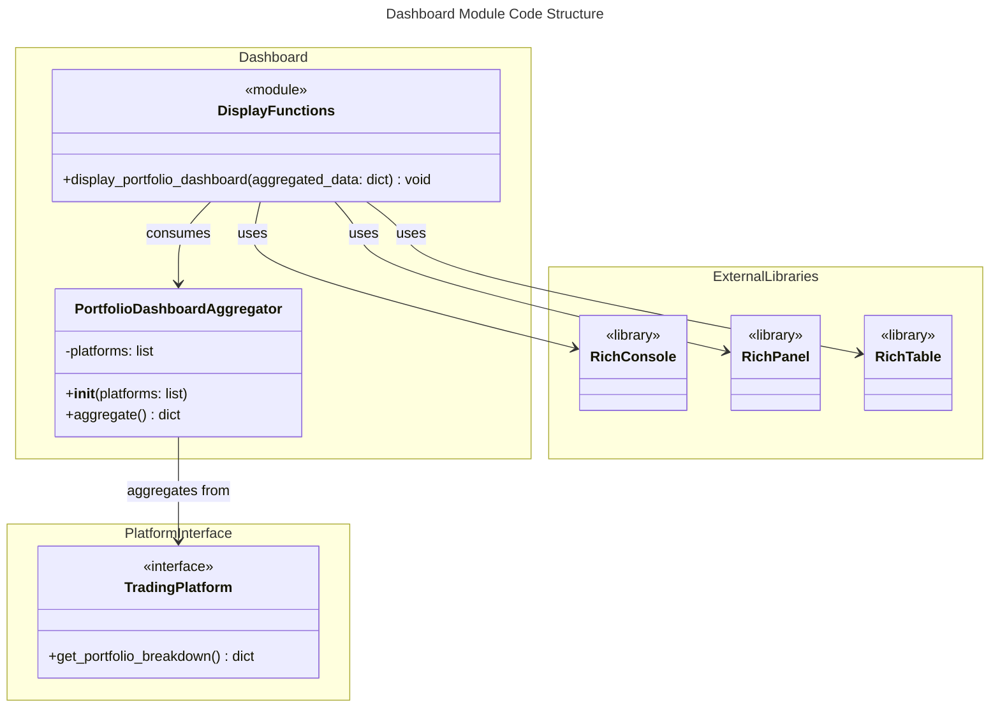
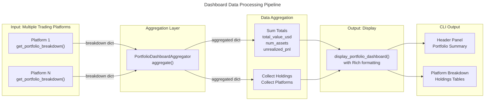

# C4 Code Level: finance_feedback_engine/dashboard

## Overview

- **Name**: Portfolio Dashboard Module
- **Description**: Multi-platform portfolio metrics aggregation and CLI display system
- **Location**: `finance_feedback_engine/dashboard`
- **Language**: Python 3.8+
- **Purpose**: Aggregates portfolio data from multiple trading platform integrations and displays a unified dashboard view in the CLI with Rich formatting

## Code Elements

### Classes

#### PortfolioDashboardAggregator

- **Location**: `finance_feedback_engine/dashboard/portfolio_dashboard.py` (lines 8-51)
- **Description**: Aggregates portfolio metrics from multiple trading platforms into a unified data structure. Handles graceful failures when individual platforms fail to retrieve data.
- **Responsibilities**:
  - Store references to multiple trading platform instances
  - Fetch portfolio breakdowns from each platform
  - Aggregate metrics across all platforms
  - Handle exceptions and log warnings for platform failures
- **Methods**:
  - `__init__(platforms: list) -> None`
    - **Description**: Initialize the aggregator with a list of platform instances
    - **Parameters**:
      - `platforms` (list): List of trading platform objects that implement `get_portfolio_breakdown()` method
    - **Return Type**: None
    - **Location**: Line 13-14
    - **Dependencies**: Platform instances must have `get_portfolio_breakdown()` method

  - `aggregate() -> dict`
    - **Description**: Aggregates portfolio data from all platforms. Iterates through each platform, calls `get_portfolio_breakdown()`, and combines results into unified metrics. Suppresses exceptions and logs warnings for failing platforms.
    - **Parameters**: None (uses `self.platforms`)
    - **Return Type**: `dict` with keys:
      - `total_value_usd` (float): Sum of portfolio values across all platforms
      - `num_assets` (int): Total count of assets across all platforms
      - `holdings` (list): Combined list of all holdings from all platforms
      - `platforms` (list): List of dicts with platform-specific breakdowns
      - `unrealized_pnl` (float): Sum of unrealized profit/loss across all platforms
    - **Location**: Lines 16-47
    - **Dependencies**:
      - `console` (Rich Console object)
      - Platform instances' `get_portfolio_breakdown()` method
    - **Future Notes**: Code comments indicate planned deduplication of assets and normalization of allocation percentages

### Functions

#### display_portfolio_dashboard

- **Location**: `finance_feedback_engine/dashboard/portfolio_dashboard.py` (lines 50-109)
- **Description**: Renders an aggregated portfolio dashboard to the CLI using Rich formatting. Displays header panel with totals, per-platform breakdowns, holdings tables, and a summary footer.
- **Parameters**:
  - `aggregated_data` (dict): Dictionary of aggregated portfolio metrics, typically from `PortfolioDashboardAggregator.aggregate()`
- **Return Type**: None (prints to console via Rich)
- **Location**: Lines 50-109
- **Dependencies**:
  - `console` (Rich Console instance)
  - `Panel` (Rich panel formatting)
  - `Table` (Rich table formatting)
  - Rich text styling syntax (cyan, green, red, bold, yellow)
- **Input Structure Expected**:
  ```python
  {
    "total_value_usd": float,
    "num_assets": int,
    "platforms": [
      {
        "name": str,
        "breakdown": {
          "total_value_usd": float,
          "unrealized_pnl": float,
          "num_assets": int,
          "holdings": [
            {
              "asset": str,
              "amount": float,
              "value_usd": float,
              "allocation_pct": float
            }
          ]
        }
      }
    ],
    "unrealized_pnl": float
  }
  ```
- **Display Behavior**:
  1. Renders header panel showing total portfolio value, unrealized P&L (with color coding), and asset count
  2. For each platform, displays platform name, value, asset count, and unrealized P&L
  3. Renders holdings table with columns: Asset, Amount, Value (USD), Allocation %
  4. Shows "No holdings" message if platform has no holdings
  5. Displays footer message if no platforms have portfolio data available
  6. Uses Rich color styling: cyan for labels, green for positive values, red for negative P&L

### Module Exports

#### `__init__.py`

- **Location**: `finance_feedback_engine/dashboard/__init__.py` (lines 1-7)
- **Exports**:
  - `PortfolioDashboardAggregator`: Class for aggregating multi-platform portfolio metrics
  - `display_portfolio_dashboard`: Function for displaying aggregated portfolio data
- **Module Docstring**: "Dashboard module for aggregating multi-platform portfolio metrics."

## Dependencies

### Internal Dependencies

- **Trading Platforms**: Depends on platform instances from `finance_feedback_engine/trading_platforms/` module that implement the `get_portfolio_breakdown()` interface
  - Expected method signature: `get_portfolio_breakdown() -> dict`
  - Expected return structure: Dictionary with keys `total_value_usd`, `num_assets`, `unrealized_pnl`, and `holdings` (list of dicts)

### External Dependencies

| Dependency | Version | Purpose | Import |
|-----------|---------|---------|--------|
| `rich` | Latest | CLI formatting and table rendering | `from rich.console import Console` |
| `rich` | Latest | Panel formatting for dashboard header | `from rich.panel import Panel` |
| `rich` | Latest | Table formatting for holdings display | `from rich.table import Table` |

## Data Structures

### Aggregated Portfolio Data

```python
{
    "total_value_usd": float,      # Sum of portfolio values across all platforms
    "num_assets": int,              # Total count of assets
    "unrealized_pnl": float,        # Sum of unrealized profit/loss
    "holdings": [                   # Combined holdings from all platforms
        {
            "asset": str,           # Asset symbol/identifier
            "amount": float,        # Quantity held
            "value_usd": float,     # Current value in USD
            "allocation_pct": float # Percentage of total portfolio
        }
    ],
    "platforms": [                  # Per-platform breakdowns
        {
            "name": str,            # Platform class name
            "breakdown": {          # Platform-specific portfolio breakdown
                "total_value_usd": float,
                "unrealized_pnl": float,
                "num_assets": int,
                "holdings": [...]   # Same structure as above
            }
        }
    ]
}
```

## Relationships

### Code Structure Diagram



### Data Flow Diagram



## Key Features

1. **Multi-Platform Aggregation**: Seamlessly combines portfolio data from multiple independent trading platform integrations
2. **Error Resilience**: Graceful failure handling - if one platform fails, others are still aggregated and displayed
3. **Rich CLI Display**: Professional-looking dashboard with formatted tables, colored text, and panel layouts
4. **Extensible Design**: New platforms can be added by implementing the `get_portfolio_breakdown()` interface
5. **Unified Metrics**: Provides unified view of total portfolio value, asset count, and unrealized P&L across all platforms

## Notes

- The dashboard currently does not deduplicate assets that may exist on multiple platforms (e.g., Bitcoin holdings on both Coinbase and Kraken)
- Allocation percentages are displayed per-platform, not aggregated globally across all platforms
- Error handling at the platform level prevents cascade failures - if one platform fetch fails, others continue
- The display uses Rich library for enhanced CLI formatting with color coding and tables
- Console warnings are displayed for any platforms that fail to retrieve data, maintaining visibility into data collection issues
