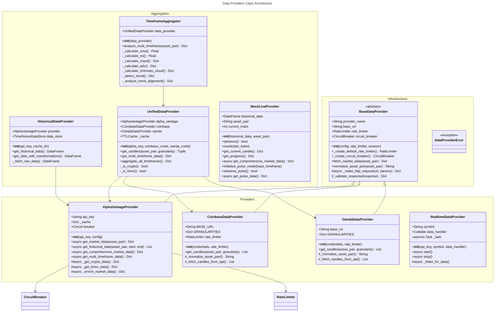

# C4 Code Level: Data Providers Module

## Overview

- **Name**: Finance Feedback Engine - Data Providers Module
- **Description**: Unified data acquisition system for multiple financial asset types with intelligent provider selection, rate limiting, circuit breaking, and multi-timeframe data aggregation.
- **Location**: `finance_feedback_engine/data_providers/`
- **Language**: Python 3.11+
- **Purpose**: Abstracts market data access across multiple APIs (Alpha Vantage, Coinbase, Oanda) with resilience patterns, caching, and comprehensive technical analysis capabilities.

## Module Structure

The data_providers module consists of core infrastructure classes, provider implementations, and aggregation/analysis layers:

1. **Core Infrastructure** (Base classes and utilities)
   - `BaseDataProvider` - Abstract base with shared infrastructure
   - Error classes - Custom exceptions for provider failures

2. **Provider Implementations** (Concrete data sources)
   - `AlphaVantageProvider` - Cryptocurrency and forex data with technical indicators, sentiment, and macro data
   - `CoinbaseDataProvider` - Cryptocurrency trading pairs with public candle data
   - `OandaDataProvider` - Forex pairs with v20 REST API integration
   - `RealtimeDataProvider` - Real-time data streaming with async polling

3. **Data Aggregation & Analysis** (Multi-source composition)
   - `UnifiedDataProvider` - Cascading fallback provider with intelligent asset routing
   - `TimeframeAggregator` - Multi-timeframe technical analysis with 10+ indicators
   - `HistoricalDataProvider` - Batch historical data with caching and validation
   - `MockLiveProvider` - Backtesting provider that streams historical data

4. **Module Interface**
   - `__init__.py` - Public exports: `AlphaVantageProvider`, `MockLiveProvider`

---

## Code Elements

### Core Infrastructure Classes

#### `BaseDataProvider` (Abstract Base Class)
**File**: `base_provider.py`
**Location**: Lines 1-350+

**Purpose**: Template method pattern base class providing shared infrastructure for all data providers including rate limiting, circuit breaking, HTTP client management, and timeout configuration.

**Key Methods**:

- `__init__(config, rate_limiter, session)`
  - **Parameters**:
    - `config: Optional[Dict[str, Any]]` - Configuration dictionary
    - `rate_limiter: Optional[RateLimiter]` - Shared rate limiter (creates default if None)
    - `session: Optional[aiohttp.ClientSession]` - Shared aiohttp session (creates if None)
  - **Returns**: None
  - **Purpose**: Initialize provider with shared infrastructure (rate limiter, circuit breaker, timeouts)
  - **Location**: Lines 72-112
  - **Dependencies**: RateLimiter, CircuitBreaker, aiohttp

- `_create_default_rate_limiter() -> RateLimiter`
  - **Parameters**: None
  - **Returns**: RateLimiter instance with conservative defaults
  - **Purpose**: Create default rate limiter (configurable via config['rate_limiter'])
  - **Location**: Lines 114-131
  - **Dependencies**: RateLimiter

- `_create_circuit_breaker() -> CircuitBreaker`
  - **Parameters**: None
  - **Returns**: CircuitBreaker instance
  - **Purpose**: Create circuit breaker for fault tolerance
  - **Location**: Lines 133-149
  - **Dependencies**: CircuitBreaker

- `_configure_timeouts()`
  - **Parameters**: None
  - **Returns**: None
  - **Purpose**: Configure API timeout values from config
  - **Location**: Lines 151-167

- `async _ensure_session()`
  - **Parameters**: None
  - **Returns**: None
  - **Purpose**: Lazy initialization of aiohttp.ClientSession (only when needed)
  - **Location**: Lines 169-177
  - **Dependencies**: aiohttp

- `async close()`
  - **Parameters**: None
  - **Returns**: None
  - **Purpose**: Close aiohttp session if owned by this provider
  - **Location**: Lines 179-186

- `async __aenter__() -> BaseDataProvider`
  - **Parameters**: None
  - **Returns**: Self (for async context manager)
  - **Purpose**: Async context manager entry with nested context support
  - **Location**: Lines 188-199

- `async __aexit__(exc_type, exc_val, exc_tb) -> bool`
  - **Parameters**:
    - `exc_type` - Exception type
    - `exc_val` - Exception value
    - `exc_tb` - Exception traceback
  - **Returns**: False (propagates exceptions)
  - **Purpose**: Async context manager exit with proper session lifecycle
  - **Location**: Lines 201-214

- `async fetch_market_data(asset_pair: str) -> Dict[str, Any]`
  - **Parameters**: `asset_pair: str` - Asset pair (e.g., 'BTCUSD')
  - **Returns**: Dict with market data
  - **Purpose**: Abstract method - subclasses must implement
  - **Location**: Lines 216-232
  - **Raises**: NotImplementedError in base class

- `normalize_asset_pair(asset_pair: str) -> str`
  - **Parameters**: `asset_pair: str` - Standardized asset pair
  - **Returns**: Provider-specific format (e.g., 'BTC-USD' for Coinbase, 'EUR_USD' for Oanda)
  - **Purpose**: Abstract method - normalize asset pairs to provider format
  - **Location**: Lines 234-254
  - **Note**: Different providers use different separators and formats

- `async _make_http_request(url, params, headers, timeout, method) -> Dict[str, Any]`
  - **Parameters**:
    - `url: str` - Full request URL
    - `params: Optional[Dict[str, Any]]` - Query parameters
    - `headers: Optional[Dict[str, str]]` - HTTP headers
    - `timeout: Optional[float]` - Request timeout in seconds
    - `method: str` - HTTP method (default: 'GET')
  - **Returns**: JSON response as dictionary
  - **Purpose**: Shared HTTP request handler with rate limiting, circuit breaking, and retries
  - **Location**: Lines 256-324
  - **Features**:
    - Rate limiting (prevents API throttling)
    - Circuit breaking (fault tolerance)
    - Exponential backoff retries (automatic)
    - Timeout management
  - **Raises**: aiohttp.ClientError, CircuitBreakerOpenError

- `_validate_response(response: Dict[str, Any]) -> Dict[str, Any]`
  - **Parameters**: `response: Dict[str, Any]` - Raw API response
  - **Returns**: Validated response
  - **Purpose**: Validate API response structure
  - **Location**: Lines 326-341
  - **Raises**: ValueError if response is invalid

**Properties**:
- `provider_name: str` (abstract property) - Name of data provider
- `base_url: str` (abstract property) - Base URL for API requests

---

#### Exception Classes
**File**: `base_provider.py`
**Location**: Lines 343-365

- `DataProviderError(Exception)` - Base exception for all provider errors
- `RateLimitExceededError(DataProviderError)` - API rate limit exceeded
- `InvalidAssetPairError(DataProviderError)` - Invalid asset pair format
- `DataUnavailableError(DataProviderError)` - Requested data not available

---

### Provider Implementations

#### `AlphaVantageProvider`
**File**: `alpha_vantage_provider.py`
**Location**: Lines 1-2000+

**Purpose**: Premium data provider with comprehensive market data including cryptocurrencies, forex, technical indicators, news sentiment, and macroeconomic data. Includes intelligent caching and market schedule awareness.

**Key Methods**:

- `__init__(api_key, config, session, rate_limiter, is_backtest)`
  - **Parameters**:
    - `api_key: Optional[str]` - Alpha Vantage API key (required)
    - `config: Optional[Dict[str, Any]]` - Configuration with timeout settings
    - `session: Optional[aiohttp.ClientSession]` - Optional shared session
    - `rate_limiter: Optional[Any]` - Optional rate limiter
    - `is_backtest: bool` - If True, allows mock data fallback (default: False)
  - **Returns**: None
  - **Location**: Lines 82-129
  - **Raises**: ValueError if api_key is missing
  - **Features**: Circuit breaker, metrics, caching, timeout configuration

- `_get_from_cache(key: str, ttl_seconds: int) -> Optional[Dict[str, Any]]`
  - **Parameters**:
    - `key: str` - Cache key
    - `ttl_seconds: int` - Time-to-live in seconds
  - **Returns**: Cached data if valid, None if expired or missing
  - **Purpose**: Retrieve data from in-memory cache
  - **Location**: Lines 168-182

- `_set_cache(key: str, value: Dict[str, Any])`
  - **Parameters**:
    - `key: str` - Cache key
    - `value: Dict[str, Any]` - Data to cache
  - **Returns**: None
  - **Purpose**: Store data in cache with timestamp
  - **Location**: Lines 184-192

- `async close()`
  - **Parameters**: None
  - **Returns**: None
  - **Purpose**: Close aiohttp session if owned
  - **Location**: Lines 194-197

- `async __aenter__() -> AlphaVantageProvider`
  - **Parameters**: None
  - **Returns**: Self
  - **Purpose**: Async context manager entry
  - **Location**: Lines 199-209

- `async __aexit__(exc_type, exc_val, exc_tb) -> bool`
  - **Parameters**: Exception info
  - **Returns**: False
  - **Purpose**: Async context manager exit
  - **Location**: Lines 211-217

- `async _async_request(params: Dict[str, Any], timeout: int) -> Dict[str, Any]`
  - **Parameters**:
    - `params: Dict[str, Any]` - Request parameters
    - `timeout: int` - Request timeout
  - **Returns**: JSON response
  - **Purpose**: Make async HTTP request with rate limiting and retries
  - **Location**: Lines 229-290
  - **Features**:
    - Rate limiting integration
    - Exponential backoff retries
    - Correlation ID tracing
    - Latency metrics recording

- `async _do_async_request(params: Dict[str, Any], timeout: int) -> Dict[str, Any]`
  - **Parameters**: Same as `_async_request`
  - **Returns**: JSON response
  - **Purpose**: Helper for async request within rate-limited context
  - **Location**: Lines 292-309

- `async _ensure_session()`
  - **Parameters**: None
  - **Returns**: None
  - **Purpose**: Lazy initialization of aiohttp session with lock
  - **Location**: Lines 311-322

- `async get_market_data(asset_pair: str, force_refresh: bool) -> Dict[str, Any]`
  - **Parameters**:
    - `asset_pair: str` - Asset pair (e.g., 'BTCUSD', 'EURUSD')
    - `force_refresh: bool` - Bypass cache (default: False)
  - **Returns**: Comprehensive market data dictionary
  - **Purpose**: Fetch market data with automatic asset type detection
  - **Location**: Lines 324-372
  - **Features**:
    - Automatic crypto/forex detection
    - Data validation with warnings
    - Market data enrichment
    - Circuit breaker protection
  - **Raises**: CircuitBreakerOpenError, ValueError

- `async get_historical_data(asset_pair: str, start: str, end: str, timeframe: str) -> list`
  - **Parameters**:
    - `asset_pair: str` - Asset pair
    - `start: str` - Start date (YYYY-MM-DD)
    - `end: str` - End date (YYYY-MM-DD)
    - `timeframe: str` - Timeframe ('1m', '5m', '15m', '30m', '1h', '1d')
  - **Returns**: List of OHLC candle dictionaries
  - **Purpose**: Fetch historical batch data across date ranges
  - **Location**: Lines 381-602
  - **Features**:
    - Supports both daily and intraday timeframes
    - Automatic mock data fallback for failed requests
    - Field name flexibility (handles API response variations)
    - Comprehensive error handling
  - **Returns**: List[Dict] with keys: date, open, high, low, close

- `_generate_mock_series(start_dt, end_dt, timeframe: str) -> list`
  - **Parameters**:
    - `start_dt` - Start date
    - `end_dt` - End date
    - `timeframe: str` - Timeframe
  - **Returns**: List of synthetic OHLC candles
  - **Purpose**: Generate mock data fallback with linear drift and intraday volatility
  - **Location**: Lines 604-686
  - **Features**: Supports both daily and intraday generation

- `async _enrich_market_data(market_data: Dict[str, Any], asset_pair: str) -> Dict[str, Any]`
  - **Parameters**:
    - `market_data: Dict[str, Any]` - Base market data
    - `asset_pair: str` - Asset pair for logging
  - **Returns**: Enriched market data
  - **Purpose**: Add technical indicators and candlestick analysis
  - **Location**: Lines 688-747
  - **Features**:
    - Calculates price range and percentage
    - Candlestick body/wick analysis
    - Trend detection (bullish/bearish/neutral)
    - Position in range calculation
    - Technical indicators (RSI, MACD, Bollinger Bands)

- `async _get_technical_indicators(asset_pair: str) -> Dict[str, Any]`
  - **Parameters**: `asset_pair: str` - Asset pair
  - **Returns**: Dict with RSI, MACD, Bollinger Bands
  - **Purpose**: Fetch technical indicators from API
  - **Location**: Lines 749-843
  - **Features**:
    - RSI (Relative Strength Index)
    - MACD (Moving Average Convergence Divergence)
    - Bollinger Bands
    - Automatic crypto/forex handling

- `async get_market_regime(asset_pair: str, force_refresh: bool) -> Dict[str, Any]`
  - **Parameters**:
    - `asset_pair: str` - Asset pair
    - `force_refresh: bool` - Bypass 5-min cache
  - **Returns**: Market regime data (trend, volatility, momentum)
  - **Purpose**: Get market regime with 5-minute caching
  - **Location**: Lines 845-918
  - **Returns**: Dict with keys: trend, volatility, momentum, confidence

- `async get_technical_indicators_cached(asset_pair: str, indicators: List[str], force_refresh: bool) -> Dict[str, Any]`
  - **Parameters**:
    - `asset_pair: str` - Asset pair
    - `indicators: List[str]` - Indicator names
    - `force_refresh: bool` - Bypass cache
  - **Returns**: Technical indicator values
  - **Purpose**: Get indicators with smart caching (60s for fast, 300s for slow)
  - **Location**: Lines 920-954

- `async get_news_sentiment(asset_pair: str, limit: int, force_refresh: bool) -> Dict[str, Any]`
  - **Parameters**:
    - `asset_pair: str` - Asset pair
    - `limit: int` - Max news items (default: 5)
    - `force_refresh: bool` - Bypass 15-min cache
  - **Returns**: News sentiment analysis
  - **Purpose**: Fetch news sentiment with 15-minute caching
  - **Location**: Lines 956-1051
  - **Returns**: Dict with keys: available, overall_sentiment, sentiment_score, top_topics

- `async get_macro_indicators(indicators: Optional[list]) -> Dict[str, Any]`
  - **Parameters**: `indicators: Optional[list]` - Macro indicators to fetch
  - **Returns**: Macroeconomic data
  - **Purpose**: Fetch macro indicators (GDP, inflation, unemployment, etc.)
  - **Location**: Lines 1053-1087

- `async get_comprehensive_market_data(asset_pair: str, include_sentiment: bool, include_macro: bool) -> Dict[str, Any]`
  - **Parameters**:
    - `asset_pair: str` - Asset pair
    - `include_sentiment: bool` - Include news sentiment (default: True)
    - `include_macro: bool` - Include macro indicators (default: False)
  - **Returns**: Comprehensive market data with all enrichments
  - **Purpose**: One-stop method for all market data
  - **Location**: Lines 1089-1115

- `async get_multi_timeframe_data(asset_pair: str, timeframes: Optional[List[str]], force_refresh: bool) -> Dict[str, Any]`
  - **Parameters**:
    - `asset_pair: str` - Asset pair
    - `timeframes: Optional[List[str]]` - Timeframes (default: ['1h', '4h', 'daily'])
    - `force_refresh: bool` - Bypass cache
  - **Returns**: Results per timeframe with status, data, age, freshness info
  - **Purpose**: Fetch multi-timeframe data with independent validation per timeframe
  - **Location**: Lines 1117-1320
  - **Features**:
    - Independent validation per timeframe
    - Stale data detection with market-aware thresholds
    - Partial result support (one stale timeframe doesn't block others)
    - Comprehensive metadata (age_seconds, age_hours, freshness_message)

- `async _get_crypto_data(asset_pair: str, force_refresh: bool) -> Dict[str, Any]`
  - **Parameters**:
    - `asset_pair: str` - Crypto pair
    - `force_refresh: bool` - Bypass 5-min cache
  - **Returns**: Crypto market data with staleness flags
  - **Purpose**: Fetch cryptocurrency data with market schedule awareness
  - **Location**: Lines 1322-1491
  - **Features**:
    - DIGITAL_CURRENCY_DAILY endpoint
    - Market-aware freshness validation
    - Stale data flagging (doesn't raise, returns warning)
    - Field name flexibility (handles '1a. open (USD)' vs '1. open')
    - Mock data fallback in backtest mode

- `async _get_forex_data(asset_pair: str, force_refresh: bool) -> Dict[str, Any]`
  - **Parameters**:
    - `asset_pair: str` - Forex pair
    - `force_refresh: bool` - Bypass 5-min cache
  - **Returns**: Forex market data with staleness flags
  - **Purpose**: Fetch forex data with market schedule awareness
  - **Location**: Lines 1493-1662
  - **Features**: Same as crypto but uses FX_DAILY endpoint

- `_create_mock_data(asset_pair: str, asset_type: str) -> Dict[str, Any]`
  - **Parameters**:
    - `asset_pair: str` - Asset pair
    - `asset_type: str` - 'crypto' or 'forex'
  - **Returns**: Mock market data dictionary
  - **Purpose**: Generate mock data for testing (backtest mode only)
  - **Location**: Lines 1664-1706
  - **Safety**: Raises ValueError if called in live trading mode (is_backtest=False)

- `validate_market_data(data: Dict[str, Any], asset_pair: str) -> Tuple[bool, List[str]]`
  - **Parameters**:
    - `data: Dict[str, Any]` - Market data to validate
    - `asset_pair: str` - Asset pair for context
  - **Returns**: (is_valid: bool, issues: List[str])
  - **Purpose**: Validate market data quality and completeness
  - **Location**: Lines 1708-1790
  - **Validates**:
    - Required OHLC fields
    - Data freshness (24h threshold for daily)
    - OHLC logical consistency (high >= low, close in range)
    - Non-zero/non-negative prices

- `_create_default_rate_limiter() -> RateLimiter`
  - **Parameters**: None
  - **Returns**: RateLimiter with conservative defaults
  - **Purpose**: Create default rate limiter for Alpha Vantage
  - **Location**: Lines 1792-1816
  - **Settings**: 0.0833 tokens/sec (~5/min), max 5 tokens burst

- `async warm_cache(asset_pairs: List[str])`
  - **Parameters**: `asset_pairs: List[str]` - Asset pairs to warm cache
  - **Returns**: None
  - **Purpose**: Pre-populate cache on startup (Phase 2 optimization)
  - **Location**: Lines 1818-1849
  - **Caches**: Market data, market regime, technical indicators

- `get_circuit_breaker_stats() -> Dict[str, Any]`
  - **Parameters**: None
  - **Returns**: Circuit breaker statistics
  - **Purpose**: Get monitoring metrics for circuit breaker
  - **Location**: Lines 1851-1852

---

#### `CoinbaseDataProvider`
**File**: `coinbase_data.py`
**Location**: Lines 1-300+

**Purpose**: Cryptocurrency data provider using Coinbase Advanced Trade API's public candles endpoint.

**Key Methods**:

- `__init__(credentials, rate_limiter)`
  - **Parameters**:
    - `credentials: Optional[Dict[str, Any]]` - Optional credentials (not needed for public data)
    - `rate_limiter: Optional[RateLimiter]` - Shared rate limiter
  - **Returns**: None
  - **Location**: Lines 25-47
  - **Features**: Integrated circuit breaker, conservative rate limits

- `_normalize_asset_pair(asset_pair: str) -> str`
  - **Parameters**: `asset_pair: str` - Input pair (e.g., 'BTCUSD', 'BTC-USD')
  - **Returns**: Coinbase product ID (e.g., 'BTC-USD')
  - **Purpose**: Normalize asset pair to Coinbase format
  - **Location**: Lines 49-77
  - **Handles**: BTC, ETH, SOL, DOGE, ADA; fallback to dash-separated format

- `get_candles(asset_pair: str, granularity: str, limit: int) -> List[Dict[str, Any]]`
  - **Parameters**:
    - `asset_pair: str` - Asset pair
    - `granularity: str` - Timeframe ('1m', '5m', '15m', '1h', '4h', '1d')
    - `limit: int` - Number of candles (default: 300)
  - **Returns**: List of candle dictionaries
  - **Purpose**: Fetch historical candle data from Coinbase
  - **Location**: Lines 79-120
  - **Returns**: List[Dict] with keys: timestamp, open, high, low, close, volume
  - **Raises**: CircuitBreakerOpenError, ValueError

- `_fetch_candles_from_api(product_id: str, start: int, end: int, granularity: int) -> List[Dict[str, Any]]`
  - **Parameters**:
    - `product_id: str` - Coinbase product ID (e.g., 'BTC-USD')
    - `start: int` - Start timestamp (Unix seconds)
    - `end: int` - End timestamp (Unix seconds)
    - `granularity: int` - Granularity in seconds
  - **Returns**: Normalized candle list
  - **Purpose**: Internal method - fetch from API with requests library
  - **Location**: Lines 122-160
  - **API**: Coinbase Advanced Trade API v3 brokerage/products/{product_id}/candles

- `get_latest_price(asset_pair: str) -> float`
  - **Parameters**: `asset_pair: str` - Asset pair
  - **Returns**: Latest close price
  - **Purpose**: Get most recent price
  - **Location**: Lines 162-171

---

#### `OandaDataProvider`
**File**: `oanda_data.py`
**Location**: Lines 1-280+

**Purpose**: Forex data provider using Oanda v20 REST API.

**Key Methods**:

- `__init__(credentials, rate_limiter)`
  - **Parameters**:
    - `credentials: Dict[str, Any]` - API token, account ID, environment
    - `rate_limiter: Optional[RateLimiter]` - Shared rate limiter
  - **Returns**: None
  - **Location**: Lines 31-66
  - **Credentials keys**: access_token, account_id, environment ('practice'/'live'), base_url

- `_normalize_asset_pair(asset_pair: str) -> str`
  - **Parameters**: `asset_pair: str` - Input pair (e.g., 'EURUSD', 'EUR_USD')
  - **Returns**: Oanda instrument (e.g., 'EUR_USD')
  - **Purpose**: Normalize to Oanda format with underscore
  - **Location**: Lines 68-103
  - **Handles**: Common forex pairs (EUR, GBP, USD, JPY, etc.)

- `get_candles(asset_pair: str, granularity: str, limit: int) -> List[Dict[str, Any]]`
  - **Parameters**:
    - `asset_pair: str` - Asset pair
    - `granularity: str` - Timeframe ('1m', '5m', '15m', '1h', '4h', '1d')
    - `limit: int` - Number of candles (max 5000)
  - **Returns**: List of candle dictionaries
  - **Purpose**: Fetch historical candle data
  - **Location**: Lines 105-156
  - **Returns**: List[Dict] with keys: timestamp, open, high, low, close, volume
  - **Raises**: CircuitBreakerOpenError, ValueError

- `_fetch_candles_from_api(instrument: str, granularity: str, count: int) -> List[Dict[str, Any]]`
  - **Parameters**:
    - `instrument: str` - Oanda instrument (e.g., 'EUR_USD')
    - `granularity: str` - Oanda granularity (M1, M5, M15, H1, H4, D)
    - `count: int` - Number of candles
  - **Returns**: Normalized candle list
  - **Purpose**: Internal API fetch with Oanda v20 endpoint
  - **Location**: Lines 158-209

- `get_latest_price(asset_pair: str) -> float`
  - **Parameters**: `asset_pair: str` - Asset pair
  - **Returns**: Latest close price
  - **Purpose**: Get most recent price
  - **Location**: Lines 211-220

---

#### `RealtimeDataProvider`
**File**: `realtime_data_provider.py`
**Location**: Lines 1-150+

**Purpose**: Real-time data ingestion via Alpha Vantage with asynchronous polling.

**Key Methods**:

- `__init__(api_key, symbol, data_handler, interval)`
  - **Parameters**:
    - `api_key: str` - Alpha Vantage API key
    - `symbol: str` - Trading symbol
    - `data_handler: Callable[[Dict[str, Any]], None]` - Callback for new data
    - `interval: int` - Polling interval in seconds (default: 60)
  - **Returns**: None
  - **Location**: Lines 32-50

- `async _listen_for_data()`
  - **Parameters**: None
  - **Returns**: None
  - **Purpose**: Async polling loop for real-time data
  - **Location**: Lines 52-85
  - **Features**:
    - Polls Alpha Vantage 1-minute intraday
    - Validates data before handling
    - Persists to data store

- `async start()`
  - **Parameters**: None
  - **Returns**: None
  - **Purpose**: Start real-time data ingestion
  - **Location**: Lines 87-91

- `async stop()`
  - **Parameters**: None
  - **Returns**: None
  - **Purpose**: Stop real-time data ingestion
  - **Location**: Lines 93-98

- `async close()`
  - **Parameters**: None
  - **Returns**: None
  - **Purpose**: Close aiohttp session
  - **Location**: Lines 100-102

---

### Data Aggregation Classes

#### `UnifiedDataProvider`
**File**: `unified_data_provider.py`
**Location**: Lines 1-650+

**Purpose**: Intelligent cascading provider with automatic asset type detection and provider selection.

**Key Methods**:

- `__init__(alpha_vantage_api_key, coinbase_credentials, oanda_credentials, config)`
  - **Parameters**:
    - `alpha_vantage_api_key: Optional[str]` - API key for Alpha Vantage
    - `coinbase_credentials: Optional[Dict[str, Any]]` - Coinbase credentials
    - `oanda_credentials: Optional[Dict[str, Any]]` - Oanda credentials
    - `config: Optional[Dict[str, Any]]` - Configuration
  - **Returns**: None
  - **Location**: Lines 32-81
  - **Features**: Shared rate limiter across all providers, TTL cache (5 min)

- `_is_crypto(asset_pair: str) -> bool`
  - **Parameters**: `asset_pair: str` - Asset pair
  - **Returns**: True if cryptocurrency
  - **Purpose**: Detect if asset is crypto
  - **Location**: Lines 83-87
  - **Heuristic**: Checks for BTC, ETH, SOL, DOGE, ADA, DOT, LINK

- `_is_forex(asset_pair: str) -> bool`
  - **Parameters**: `asset_pair: str` - Asset pair
  - **Returns**: True if forex (fiat currency pair)
  - **Purpose**: Detect if asset is forex
  - **Location**: Lines 89-116
  - **Heuristic**: Checks for fiat currency codes (USD, EUR, GBP, etc.)

- `_get_cached_candles(asset_pair: str, granularity: str) -> Optional[Tuple[List[Dict], str]]`
  - **Parameters**:
    - `asset_pair: str` - Asset pair
    - `granularity: str` - Timeframe
  - **Returns**: (candles, provider_name) or None if expired
  - **Purpose**: Check in-memory cache
  - **Location**: Lines 118-129

- `_cache_candles(asset_pair: str, granularity: str, candles: List[Dict], provider_name: str)`
  - **Parameters**:
    - `asset_pair: str` - Asset pair
    - `granularity: str` - Timeframe
    - `candles: List[Dict]` - Candle data
    - `provider_name: str` - Provider that created data
  - **Returns**: None
  - **Purpose**: Store candles in cache with provider metadata
  - **Location**: Lines 131-144

- `get_candles(asset_pair: str, granularity: str, limit: int, force_provider: Optional[str]) -> Tuple[List[Dict], str]`
  - **Parameters**:
    - `asset_pair: str` - Asset pair (e.g., 'BTCUSD', 'EURUSD')
    - `granularity: str` - Timeframe (default: '1d')
    - `limit: int` - Number of candles (default: 300)
    - `force_provider: Optional[str]` - Force specific provider
  - **Returns**: (candles list, provider_name used)
  - **Purpose**: Fetch candles with cascading fallback
  - **Location**: Lines 146-227
  - **Provider Priority**:
    - Crypto: Alpha Vantage → Coinbase
    - Forex: Alpha Vantage → Oanda
    - Unknown: Alpha Vantage → Coinbase → Oanda
  - **Raises**: ValueError if all providers fail

- `get_multi_timeframe_data(asset_pair: str, timeframes: Optional[List[str]]) -> Dict[str, Tuple[List[Dict], str]]`
  - **Parameters**:
    - `asset_pair: str` - Asset pair
    - `timeframes: Optional[List[str]]` - Timeframes (default: ['1m', '5m', '15m', '1h', '4h', '1d'])
  - **Returns**: Dict mapping timeframe to (candles, provider_name)
  - **Purpose**: Fetch data across multiple timeframes
  - **Location**: Lines 229-252

- `aggregate_all_timeframes(asset_pair: str, timeframes: Optional[List[str]]) -> Dict[str, Any]`
  - **Parameters**:
    - `asset_pair: str` - Asset pair
    - `timeframes: Optional[List[str]]` - Timeframes
  - **Returns**: Comprehensive multi-timeframe response with metadata
  - **Purpose**: Fetch and synchronize multi-timeframe data
  - **Location**: Lines 254-320
  - **Returns**: Dict with keys:
    - asset_pair, timestamp, timeframes (dict of tf data), metadata
    - Per-timeframe: candles, source_provider, last_updated, is_cached, candles_count
    - Metadata: requested_timeframes, available_timeframes, missing_timeframes, cache_hit_rate

---

#### `TimeframeAggregator`
**File**: `timeframe_aggregator.py`
**Location**: Lines 1-1000+

**Purpose**: Multi-timeframe technical analysis with 10+ indicators and trend confluence detection.

**Key Methods**:

- `__init__(data_provider: UnifiedDataProvider)`
  - **Parameters**: `data_provider: UnifiedDataProvider` - Data provider instance
  - **Returns**: None
  - **Location**: Lines 37-44

- `_calculate_sma(candles: List[Dict], period: int) -> Optional[float]`
  - **Parameters**:
    - `candles: List[Dict]` - OHLCV data
    - `period: int` - Period (default: 20, 50)
  - **Returns**: Simple Moving Average or None
  - **Purpose**: Calculate SMA
  - **Location**: Lines 46-51

- `_calculate_rsi(candles: List[Dict], period: int) -> Optional[float]`
  - **Parameters**:
    - `candles: List[Dict]` - OHLCV data
    - `period: int` - Period (default: 14)
  - **Returns**: RSI(14) value (0-100) or None
  - **Purpose**: Calculate Relative Strength Index
  - **Location**: Lines 53-75

- `_calculate_macd(candles: List[Dict], fast_period, slow_period, signal_period) -> Optional[Dict]`
  - **Parameters**:
    - `candles: List[Dict]` - OHLCV data
    - `fast_period: int` - Fast EMA (default: 12)
    - `slow_period: int` - Slow EMA (default: 26)
    - `signal_period: int` - Signal EMA (default: 9)
  - **Returns**: Dict with 'macd', 'signal', 'histogram' or None
  - **Purpose**: Calculate MACD
  - **Location**: Lines 77-110
  - **Dependencies**: pandas_ta

- `_calculate_stochastic_oscillator(candles: List[Dict], k_period, d_period) -> Optional[Dict]`
  - **Parameters**:
    - `candles: List[Dict]` - OHLCV data
    - `k_period: int` - %K period (default: 14)
    - `d_period: int` - %D period (default: 3)
  - **Returns**: Dict with 'k', 'd' or None
  - **Purpose**: Calculate Stochastic Oscillator
  - **Location**: Lines 112-145

- `_calculate_cci(candles: List[Dict], period: int) -> Optional[float]`
  - **Parameters**:
    - `candles: List[Dict]` - OHLCV data
    - `period: int` - Period (default: 20)
  - **Returns**: CCI value or None
  - **Purpose**: Calculate Commodity Channel Index
  - **Location**: Lines 147-162

- `_calculate_williams_r(candles: List[Dict], period: int) -> Optional[float]`
  - **Parameters**:
    - `candles: List[Dict]` - OHLCV data
    - `period: int` - Period (default: 14)
  - **Returns**: Williams %R value (-100 to 0) or None
  - **Purpose**: Calculate Williams Percent Range
  - **Location**: Lines 164-186

- `_calculate_ichimoku_cloud(candles: List[Dict]) -> Optional[Dict]`
  - **Parameters**: `candles: List[Dict]` - OHLCV data (need 52+ candles)
  - **Returns**: Dict with Ichimoku components or None
  - **Purpose**: Calculate Ichimoku Cloud
  - **Location**: Lines 188-246
  - **Components**: tenkan_sen, kijun_sen, senkou_a, senkou_b, chikou_span, is_price_above_cloud

- `_calculate_bollinger_bands(candles: List[Dict], period, std_dev) -> Optional[Dict]`
  - **Parameters**:
    - `candles: List[Dict]` - OHLCV data
    - `period: int` - SMA period (default: 20)
    - `std_dev: float` - Std dev multiplier (default: 2.0)
  - **Returns**: Dict with 'upper', 'middle', 'lower', 'percent_b' or None
  - **Purpose**: Calculate Bollinger Bands
  - **Location**: Lines 248-277

- `_calculate_adx(candles: List[Dict], period: int) -> Optional[Dict]`
  - **Parameters**:
    - `candles: List[Dict]` - OHLCV data
    - `period: int` - ADX period (default: 14)
  - **Returns**: Dict with 'adx', 'plus_di', 'minus_di' or None
  - **Purpose**: Calculate ADX trend strength
  - **Location**: Lines 279-301

- `_calculate_atr(candles: List[Dict], period: int) -> Optional[float]`
  - **Parameters**:
    - `candles: List[Dict]` - OHLCV data
    - `period: int` - Period (default: 14)
  - **Returns**: ATR value or None
  - **Purpose**: Calculate Average True Range
  - **Location**: Lines 303-319

- `_classify_volatility(atr: float, current_price: float) -> str`
  - **Parameters**:
    - `atr: float` - Average True Range
    - `current_price: float` - Current price
  - **Returns**: 'low', 'medium', 'high', or 'unknown'
  - **Purpose**: Classify volatility from ATR/price ratio
  - **Location**: Lines 321-332

- `_calculate_signal_strength(indicators: Dict[str, Any]) -> int`
  - **Parameters**: `indicators: Dict` - Multiple indicator values
  - **Returns**: Signal strength score (0-100)
  - **Purpose**: Aggregate multiple indicators into single strength metric
  - **Location**: Lines 334-383
  - **Weights**: RSI (overbought/oversold), MACD (histogram), ADX (trend), Bollinger Bands (%B)

- `_detect_trend(candles: List[Dict], timeframe: str) -> Dict[str, Any]`
  - **Parameters**:
    - `candles: List[Dict]` - OHLCV data
    - `timeframe: str` - Timeframe identifier
  - **Returns**: Comprehensive trend analysis dict
  - **Purpose**: Advanced trend detection with 10+ indicators
  - **Location**: Lines 385-490
  - **Returns**: Dict with keys:
    - direction: 'uptrend', 'downtrend', 'ranging', 'unknown'
    - strength: 0-100 (confidence)
    - sma_20, sma_50, rsi, macd, bbands, adx, atr
    - stochastic, cci, williams_r, ichimoku
    - volatility, signal_strength, price, data_quality

- `analyze_multi_timeframe(asset_pair: str, timeframes: Optional[List[str]]) -> Dict[str, Any]`
  - **Parameters**:
    - `asset_pair: str` - Asset pair
    - `timeframes: Optional[List[str]]` - Timeframes (default: ['1m', '5m', '15m', '1h', '4h', '1d'])
  - **Returns**: Multi-timeframe analysis with confluence
  - **Purpose**: Analyze asset across multiple timeframes
  - **Location**: Lines 492-556
  - **Returns**: Dict with:
    - timeframe_analysis: Per-timeframe trend data
    - trend_alignment: Overall consensus
    - entry_signals: Buy/sell recommendations
    - data_sources: Provider per timeframe

- `_analyze_trend_alignment(timeframe_analysis: Dict) -> Dict[str, Any]`
  - **Parameters**: `timeframe_analysis: Dict` - Per-timeframe analysis
  - **Returns**: Trend consensus with confluence strength
  - **Purpose**: Detect trend alignment across timeframes
  - **Location**: Lines 558-611
  - **Weighting**: 1d(40%), 4h(25%), 1h(15%), 15m(10%), 5m(5%), 1m(5%)
  - **Returns**: Dict with: direction, confluence_strength, uptrend_pct, downtrend_pct, conflicts

- `_generate_entry_signals(timeframe_analysis: Dict) -> Dict[str, Any]`
  - **Parameters**: `timeframe_analysis: Dict` - Per-timeframe analysis
  - **Returns**: Entry and exit signal recommendations
  - **Purpose**: Generate trading signals from short-term timeframes
  - **Location**: Lines 613-657

- `get_summary_text(analysis: Dict[str, Any]) -> str`
  - **Parameters**: `analysis: Dict` - Result from analyze_multi_timeframe()
  - **Returns**: Human-readable summary text
  - **Purpose**: Format analysis as text report
  - **Location**: Lines 659-703

---

#### `HistoricalDataProvider`
**File**: `historical_data_provider.py`
**Location**: Lines 1-500+

**Purpose**: Batch historical data fetching with persistence and validation.

**Key Methods**:

- `__init__(api_key, cache_dir)`
  - **Parameters**:
    - `api_key: str` - Alpha Vantage API key
    - `cache_dir: Optional[Union[str, Path]]` - Cache directory (default: data/historical_cache)
  - **Returns**: None
  - **Location**: Lines 36-62
  - **Features**: Integrates FinancialDataValidator and TimeSeriesDataStore

- `_fetch_raw_data(asset_pair, start_date, end_date, timeframe) -> pd.DataFrame`
  - **Parameters**:
    - `asset_pair: str` - Asset pair
    - `start_date: datetime` - Start date
    - `end_date: datetime` - End date
    - `timeframe: str` - Timeframe (default: '1h')
  - **Returns**: DataFrame with OHLCV data
  - **Purpose**: Fetch raw historical data with file caching
  - **Location**: Lines 64-140
  - **Features**: Parquet cache, Alpha Vantage integration

- `get_historical_data(asset_pair, start_date, end_date, timeframe) -> pd.DataFrame`
  - **Parameters**:
    - `asset_pair: str` - Asset pair
    - `start_date: Union[str, datetime]` - Start date
    - `end_date: Union[str, datetime]` - End date
    - `timeframe: str` - Timeframe (default: '1h')
  - **Returns**: Historical DataFrame with columns: open, high, low, close, volume
  - **Purpose**: Get historical data with caching and validation
  - **Location**: Lines 142-220
  - **Features**:
    - Data store caching
    - Financial data validation
    - Timezone handling (UTC)
    - Standard column naming

- `add_returns(df: pd.DataFrame, column: str) -> pd.DataFrame`
  - **Parameters**:
    - `df: pd.DataFrame` - Input DataFrame
    - `column: str` - Column for returns (default: 'close')
  - **Returns**: DataFrame with 'returns' column added
  - **Purpose**: Calculate percentage returns
  - **Location**: Lines 222-229

- `resample_data(df: pd.DataFrame, new_frequency: str) -> pd.DataFrame`
  - **Parameters**:
    - `df: pd.DataFrame` - Input DataFrame
    - `new_frequency: str` - New frequency (e.g., '1H', '4H', '1D')
  - **Returns**: Resampled DataFrame
  - **Purpose**: Resample to different frequency
  - **Location**: Lines 231-251
  - **Aggregation**: OHLCV rules (open=first, high=max, low=min, close=last, volume=sum)

- `calculate_technical_indicators(df: pd.DataFrame) -> pd.DataFrame`
  - **Parameters**: `df: pd.DataFrame` - Input DataFrame
  - **Returns**: DataFrame with indicators added
  - **Purpose**: Calculate common technical indicators
  - **Location**: Lines 253-265
  - **Indicators**: sma_10, sma_20, high_low_pct, price_change

- `get_data_with_transformations(asset_pair, start_date, end_date, timeframe, transformations) -> pd.DataFrame`
  - **Parameters**:
    - `asset_pair: str` - Asset pair
    - `start_date: Union[str, datetime]` - Start date
    - `end_date: Union[str, datetime]` - End date
    - `timeframe: str` - Timeframe
    - `transformations: list` - List of transformations to apply
  - **Returns**: Transformed DataFrame
  - **Purpose**: Get data with optional transformations
  - **Location**: Lines 267-301
  - **Transformations**: 'returns', 'indicators', 'resample_[freq]'

---

#### `MockLiveProvider`
**File**: `mock_live_provider.py`
**Location**: Lines 1-1000+

**Purpose**: Backtesting provider that streams historical data as live candles.

**Key Methods**:

- `__init__(historical_data, asset_pair, start_index)`
  - **Parameters**:
    - `historical_data: pd.DataFrame` - Historical OHLCV data
    - `asset_pair: str` - Asset pair (default: 'BTCUSD')
    - `start_index: int` - Starting position (default: 0)
  - **Returns**: None
  - **Location**: Lines 18-45
  - **Validation**: Checks for required columns (open, high, low, close)

- `advance() -> bool`
  - **Parameters**: None
  - **Returns**: True if advanced, False if at end
  - **Purpose**: Move to next candle
  - **Location**: Lines 47-56

- `reset(start_index: int)`
  - **Parameters**: `start_index: int` - Index to reset to
  - **Returns**: None
  - **Purpose**: Reset to specific index
  - **Location**: Lines 58-65

- `has_more_data() -> bool`
  - **Parameters**: None
  - **Returns**: True if more candles available
  - **Purpose**: Check if more data exists
  - **Location**: Lines 67-72

- `get_current_index() -> int`
  - **Parameters**: None
  - **Returns**: Current index position
  - **Purpose**: Get current position
  - **Location**: Lines 74-76

- `get_progress() -> Dict[str, Any]`
  - **Parameters**: None
  - **Returns**: Progress dict (current_index, total_candles, progress_pct, has_more)
  - **Purpose**: Get progress information
  - **Location**: Lines 78-92

- `get_current_price(asset_pair: Optional[str]) -> float`
  - **Parameters**: `asset_pair: Optional[str]` - Asset pair (ignored)
  - **Returns**: Close price at current index
  - **Purpose**: Get current close price
  - **Location**: Lines 94-104

- `get_current_candle() -> Dict[str, Any]`
  - **Parameters**: None
  - **Returns**: OHLCV dict at current index
  - **Purpose**: Get current OHLCV data
  - **Location**: Lines 106-139
  - **Returns**: Dict with: open, high, low, close, volume, date/timestamp, market_cap (if present)

- `async get_comprehensive_market_data(asset_pair, include_sentiment, include_macro) -> Dict[str, Any]`
  - **Parameters**:
    - `asset_pair: str` - Asset pair
    - `include_sentiment: bool` - Include sentiment (default: True)
    - `include_macro: bool` - Include macro (default: False)
  - **Returns**: Enriched market data matching AlphaVantageProvider format
  - **Purpose**: Get current candle with enrichments
  - **Location**: Lines 141-235
  - **Features**:
    - Calculates price range, body size, trend
    - Dummy RSI, MACD, Bollinger Bands
    - Dummy sentiment and macro data

- `get_market_data(asset_pair: Optional[str]) -> Dict[str, Any]`
  - **Parameters**: `asset_pair: Optional[str]` - Asset pair
  - **Returns**: Basic market data dict
  - **Purpose**: Synchronous market data fetch
  - **Location**: Lines 237-259

- `peek_ahead(steps: int) -> Optional[Dict[str, Any]]`
  - **Parameters**: `steps: int` - Steps ahead (default: 1)
  - **Returns**: Future candle or None
  - **Purpose**: Peek ahead without advancing
  - **Location**: Lines 261-277

- `get_historical_window(window_size: int, include_current: bool) -> pd.DataFrame`
  - **Parameters**:
    - `window_size: int` - Window size (default: 10)
    - `include_current: bool` - Include current (default: True)
  - **Returns**: Historical DataFrame
  - **Purpose**: Get window of data before current
  - **Location**: Lines 279-293

- `__repr__() -> str`
  - **Parameters**: None
  - **Returns**: String representation
  - **Purpose**: String representation
  - **Location**: Lines 295-302

- `__len__() -> int`
  - **Parameters**: None
  - **Returns**: Total number of candles
  - **Purpose**: Get total candle count
  - **Location**: Lines 304-306

- `initialize_pulse_mode(base_timeframe: str)`
  - **Parameters**: `base_timeframe: str` - Minimum timeframe (default: '1m')
  - **Returns**: None
  - **Purpose**: Initialize pulse mode for multi-timeframe simulation
  - **Location**: Lines 312-336
  - **Pulse**: 5-minute intervals with multi-timeframe data

- `_get_pulse_step(base_timeframe: str) -> int`
  - **Parameters**: `base_timeframe: str` - Base timeframe
  - **Returns**: Candles to advance per pulse
  - **Purpose**: Calculate pulse step size
  - **Location**: Lines 338-358
  - **Supports**: '1m', '5m', '15m', '30m', '1h'

- `advance_pulse() -> bool`
  - **Parameters**: None
  - **Returns**: True if pulse data available, False if end
  - **Purpose**: Advance to next 5-minute pulse
  - **Location**: Lines 360-378

- `async get_pulse_data() -> Dict[str, Any]`
  - **Parameters**: None
  - **Returns**: Multi-timeframe pulse data
  - **Purpose**: Get pulse with 6 timeframes (1m, 5m, 15m, 1h, 4h, 1d)
  - **Location**: Lines 380-441
  - **Returns**: Dict matching UnifiedDataProvider.aggregate_all_timeframes() format

- `_generate_timeframe_candles(current_time, minutes_per_candle, max_history) -> List[Dict]`
  - **Parameters**:
    - `current_time: pd.Timestamp` - Virtual current time
    - `minutes_per_candle: int` - Timeframe duration
    - `max_history: int` - Max historical candles
  - **Returns**: Aggregated candles for timeframe
  - **Purpose**: Generate candles for specific timeframe by aggregating
  - **Location**: Lines 443-576

- `_simple_aggregation(df: pd.DataFrame, minutes_per_candle: int) -> Dict[str, Any]`
  - **Parameters**:
    - `df: pd.DataFrame` - Historical data
    - `minutes_per_candle: int` - Timeframe
  - **Returns**: Single aggregated candle
  - **Purpose**: Fallback simple aggregation
  - **Location**: Lines 578-603

---

#### `CoinbaseDataProviderRefactored` (in coinbase_data_refactored.py)
**File**: `coinbase_data_refactored.py`
**Location**: Lines 1-200+

**Purpose**: Refactored Coinbase provider inheriting from BaseDataProvider.

**Key Methods**:

- `provider_name` (property) -> str - Returns 'Coinbase'
- `base_url` (property) -> str - Returns 'https://api.coinbase.com'
- `__init__(api_key, config, rate_limiter, session)`
- `_create_default_rate_limiter() -> RateLimiter`
- `normalize_asset_pair(asset_pair: str) -> str`
- `fetch_market_data(asset_pair: str) -> Dict[str, Any]`
- `_parse_candles(response: Dict) -> List[Dict]`

---

## Dependencies

### Internal Dependencies

**From same project**:
- `finance_feedback_engine.utils.circuit_breaker` - CircuitBreaker, CircuitBreakerOpenError
- `finance_feedback_engine.utils.rate_limiter` - RateLimiter
- `finance_feedback_engine.observability.context` - get_trace_headers()
- `finance_feedback_engine.observability.metrics` - create_histograms, get_meter
- `finance_feedback_engine.persistence.timeseries_data_store` - TimeSeriesDataStore
- `finance_feedback_engine.utils.financial_data_validator` - FinancialDataValidator
- `finance_feedback_engine.utils.market_schedule` - MarketSchedule
- `finance_feedback_engine.utils.validation` - validate_data_freshness

---

### External Dependencies

**Network & Async**:
- `aiohttp` (v3.8+) - Async HTTP client for API requests
- `aiohttp_retry` - Automatic retry with exponential backoff
- `requests` - Synchronous HTTP for some provider endpoints
- `alpha_vantage` - Alpha Vantage API client library

**Data Processing**:
- `pandas` (v1.3+) - DataFrame operations, resampling, time series
- `numpy` (v1.21+) - Numerical operations
- `pandas_ta` (v0.3+) - Technical analysis indicators (MACD, RSI, Bollinger Bands, etc.)

**Utilities**:
- `cachetools` - TTLCache for in-memory caching

**Standard Library**:
- `asyncio` - Async/await support
- `logging` - Logging framework
- `datetime` - Date/time handling
- `typing` - Type hints
- `pathlib` - File path handling
- `abc` - Abstract base classes
- `statistics` - Statistical functions

---

## Relationships

### Architecture Pattern

The data_providers module uses several design patterns:

1. **Template Method Pattern** (BaseDataProvider)
   - Defines algorithm structure for all providers
   - Subclasses implement specific data fetch logic
   - Shared infrastructure (rate limiting, circuit breaking, HTTP)

2. **Strategy Pattern** (UnifiedDataProvider)
   - Encapsulates provider selection logic
   - Cascading fallback strategy based on asset type
   - Runtime provider switching

3. **Factory Pattern** (TimeframeAggregator)
   - Creates technical indicator calculators
   - Encapsulates complex indicator logic

4. **Adapter Pattern** (All Providers)
   - Normalizes different API formats to common structure
   - Converts various timeframe formats to standard names
   - Harmonizes response structures

5. **Observer Pattern** (RealtimeDataProvider)
   - Callback-based data handling
   - Decouples data ingestion from processing

### Dependency Graph

```
Client Code
    ↓
UnifiedDataProvider (Orchestrator)
    ├─→ AlphaVantageProvider (Primary)
    ├─→ CoinbaseDataProvider (Crypto Fallback)
    └─→ OandaDataProvider (Forex Fallback)

TimeframeAggregator
    ↓
UnifiedDataProvider
    ↓
Individual Providers

HistoricalDataProvider
    ↓
AlphaVantageProvider

MockLiveProvider (Backtesting)
    ↓
Historical DataFrame → Stream as Live

All Providers
    ├─→ BaseDataProvider (shared infrastructure)
    ├─→ RateLimiter (request throttling)
    ├─→ CircuitBreaker (fault tolerance)
    └─→ aiohttp (HTTP transport)
```

---

### Data Flow

1. **Real-Time Market Data**:
   ```
   Client → UnifiedDataProvider.get_candles()
      ↓
   Asset Type Detection (crypto/forex/unknown)
      ↓
   Provider Selection (cascading priority)
      ↓
   AlphaVantage/Coinbase/Oanda API
      ↓
   Rate Limiting + Circuit Breaker
      ↓
   Response Parsing + Normalization
      ↓
   Caching (5-min TTL)
      ↓
   Return (candles, provider_name)
   ```

2. **Multi-Timeframe Analysis**:
   ```
   Client → TimeframeAggregator.analyze_multi_timeframe()
      ↓
   Fetch all timeframes (1m, 5m, 15m, 1h, 4h, 1d)
      ↓
   Per timeframe: Calculate 10+ technical indicators
      ↓
   Trend detection (SMA, ADX, MACD, Bollinger Bands)
      ↓
   Trend alignment analysis (confluence detection)
      ↓
   Entry signal generation (RSI-based)
      ↓
   Return comprehensive analysis with per-timeframe metrics
   ```

3. **Backtesting with Mock Data**:
   ```
   Backtest Engine
      ↓
   MockLiveProvider (initialize with historical DataFrame)
      ↓
   advance() / advance_pulse() loop
      ↓
   Simulate real-time candle-by-candle progression
      ↓
   Trading decision logic
      ↓
   PnL calculation
   ```

---

### Mermaid Diagram - Class Relationships



---

## Notes

### Data Quality & Freshness

- **Crypto Data**: Daily frequency (updated daily), 24h threshold for staleness
- **Forex Data**: Daily frequency (updated weekdays), market-aware validation
- **Intraday Data**: Limited to last 100 candles from API, pagination may be needed
- **Staleness Detection**: Market-aware (considers market hours, weekends, holidays)

### Rate Limiting Strategy

- **Shared Rate Limiter**: All providers use same limiter to avoid API throttling
- **Conservative Defaults**:
  - Alpha Vantage: 0.0833 tokens/sec (~5/min)
  - Coinbase: 10 tokens/sec (conservative under 15/sec limit)
  - Oanda: 5 tokens/sec (conservative under 6/sec limit)
- **Token Burst**: max_tokens allows short burst of requests

### Circuit Breaker Protection

- **Purpose**: Prevent cascading failures across providers
- **Failure Threshold**: 5 failures before opening
- **Recovery Timeout**: 60 seconds before attempting again
- **Graceful Degradation**: Falls back to next provider on circuit open

### Caching Strategy

- **In-Memory Cache** (TTLCache):
  - 5-minute TTL for market data
  - Key format: (asset_pair, granularity)
  - Stores: (candles, provider_name)
- **Market Regime Cache**: 5-min TTL
- **Technical Indicators**: Fast (60s), Slow (300s)
- **News Sentiment**: 15-min TTL
- **File Cache** (HistoricalDataProvider): Parquet format, persistent

### Technical Indicator Library

Uses `pandas_ta` (pandas-ta) for comprehensive indicators:
- SMA (Simple Moving Average)
- RSI (Relative Strength Index)
- MACD (Moving Average Convergence Divergence)
- Bollinger Bands
- ADX (Average Directional Index)
- ATR (Average True Range)
- Stochastic Oscillator
- CCI (Commodity Channel Index)
- Williams %R
- Ichimoku Cloud

### Mock Data Safety

- **Backtest Mode**: is_backtest=True allows mock data generation
- **Live Mode**: is_backtest=False raises ValueError on mock data
- **Purpose**: Prevent accidental trading on synthetic data

### Multi-Timeframe Architecture

Supports 6 standard timeframes with hierarchy:
1. **1d** (Daily) - Primary trend (40% weight)
2. **4h** (4-hour) - Intermediate trend (25% weight)
3. **1h** (Hourly) - Short-term trend (15% weight)
4. **15m** (15-min) - Entry timing (10% weight)
5. **5m** (5-min) - Fine entry trigger (5% weight)
6. **1m** (1-min) - Execution timing (5% weight)

Confluence detection identifies trend alignment across timeframes for trade confirmation.

### Pulse Mode (Backtesting)

- **Purpose**: Simulate real-time multi-timeframe progression
- **Interval**: 5-minute pulses
- **Candles Per Pulse**: Depends on base_timeframe
  - 1m: 5 candles per pulse
  - 5m: 1 candle per pulse
- **Output**: Multi-timeframe snapshot matching live data format

### Performance Considerations

- **Async-First Design**: Non-blocking I/O throughout
- **Connection Pooling**: Shared aiohttp session
- **Automatic Retries**: Exponential backoff built-in
- **Request Correlation**: Distributed tracing headers for debugging
- **Metrics**: Prometheus-compatible latency recording
