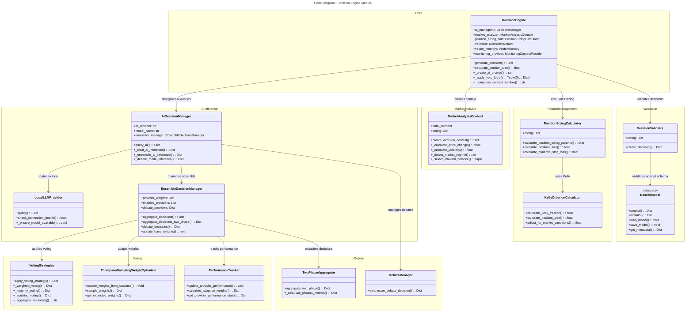

# C4 Code Level: Finance Feedback Engine - Decision Engine

## Overview

- **Name**: Decision Engine Module
- **Description**: Comprehensive AI-powered trading decision generation system that synthesizes market analysis, AI provider models, ensemble voting strategies, and risk management calculations to produce structured trading recommendations
- **Location**: `/finance_feedback_engine/decision_engine/`
- **Language**: Python 3.8+
- **Purpose**: Generate validated trading decisions (BUY/SELL/HOLD) based on market data, AI inference, ensemble voting, and position sizing calculations with comprehensive risk management

## Code Elements

### Core Classes

#### DecisionEngine
- **File**: `engine.py`
- **Description**: Main decision generation orchestrator that combines market analysis, AI inference, validation, and position sizing
- **Key Responsibilities**:
  - Initialize specialized managers (AIDecisionManager, MarketAnalysisContext, DecisionValidator, PositionSizingCalculator)
  - Generate trading decisions via `generate_decision()` async method
  - Manage decision context creation including semantic memory and portfolio context
  - Apply veto logic based on sentiment signals
  - Compress prompts to fit token limits
  - Handle local models configuration and market regime detection

**Methods**:
- `__init__(config: Dict[str, Any], data_provider=None, backtest_mode: bool = False)` - Initialize decision engine with config normalization
- `generate_decision(asset_pair: str, market_data: Dict[str, Any], balance: Dict[str, float], portfolio: Optional[Dict], memory_context: Optional[Dict], monitoring_context: Optional[Dict]) -> Dict[str, Any]` - Main async method to generate trading decision
- `calculate_position_size(account_balance: float, risk_percentage: float, entry_price: float, stop_loss_percentage: float) -> float` - Calculate position size via Kelly Criterion or risk-based sizing
- `calculate_dynamic_stop_loss(current_price: float, context: Dict[str, Any], default_percentage: float, atr_multiplier: float, min_percentage: float, max_percentage: float) -> float` - Calculate dynamic stop loss using ATR
- `set_monitoring_context(monitoring_provider)` - Attach live trading monitoring context
- `_create_decision_context(asset_pair, market_data, balance, portfolio, memory_context, monitoring_context) -> Dict` - Create comprehensive decision context
- `_create_ai_prompt(context: Dict[str, Any]) -> str` - Generate detailed AI prompt with market data, technical indicators, sentiment, and macro context
- `_apply_veto_logic(ai_response: Dict, context: Dict) -> Tuple[Dict, Optional[Dict]]` - Apply optional sentiment-based veto
- `_compress_context_window(prompt: str, max_tokens: int) -> str` - Compress prompt using tiktoken or word-based estimation
- `_format_memory_context(context: Dict) -> str` - Format portfolio historical performance context
- `_format_cost_context(cost_context: Dict) -> str` - Format transaction cost analysis
- `_format_semantic_memory(semantic_memory: list) -> str` - Format similar historical patterns
- `_should_include_semantic_memory() -> bool` - Determine semantic memory inclusion
- `_determine_position_type(action: str) -> Optional[str]` - Convert action to position type (LONG/SHORT)
- `_select_relevant_balance(balance: Dict, asset_pair: str, asset_type: str) -> tuple` - Select platform-specific balance
- `_has_existing_position(asset_pair: str, portfolio: Optional[Dict], monitoring_context: Optional[Dict]) -> bool` - Check for existing positions
- `_calculate_position_sizing_params(context: Dict, current_price: float, action: str, has_existing_position: bool, relevant_balance: Dict, balance_source: str, signal_only_default: bool) -> Dict` - Calculate complete position sizing parameters
- `_create_decision(asset_pair: str, context: Dict, ai_response: Dict) -> Dict` - Create structured decision object
- `_query_ai(prompt: str, asset_pair: Optional[str], market_data: Optional[Dict]) -> Dict` - Query AI manager asynchronously
- `_detect_market_regime(asset_pair: str) -> str` - Detect market regime (TRENDING/RANGING/VOLATILE)
- `_calculate_price_change(market_data: Dict) -> float` - Delegate to market analyzer
- `_calculate_volatility(market_data: Dict) -> float` - Delegate to market analyzer
- `_mock_ai_inference(prompt: str) -> Dict` - Simulate AI inference for backtesting
- `_debate_mode_inference(prompt: str) -> Dict` - Execute structured debate with bull/bear/judge providers
- `_query_single_provider(provider_name: str, prompt: str) -> Dict` - Query specific AI provider
- `_ensemble_ai_inference(prompt: str, asset_pair: Optional[str], market_data: Optional[Dict]) -> Dict` - Centralized ensemble logic
- `_simple_parallel_ensemble(prompt: str) -> Dict` - Simple parallel provider queries
- `_local_ai_inference(prompt: str, model_name: Optional[str]) -> Dict` - Local Ollama inference
- `_cli_ai_inference(prompt: str) -> Dict` - CLI-based AI inference placeholder
- `_codex_ai_inference(prompt: str) -> Dict` - Codex API inference placeholder
- `_gemini_ai_inference(prompt: str) -> Dict` - Gemini API inference placeholder
- `_is_valid_provider_response(decision: Dict, provider: str) -> bool` - Validate provider response structure

**Properties**:
- `ai_provider: str` - Get AI provider from AI manager
- `decision_threshold: float` - Get decision confidence threshold from config
- `ensemble_manager: EnsembleDecisionManager` - Get/set ensemble manager

#### AIDecisionManager
- **File**: `ai_decision_manager.py`
- **Description**: Manages AI provider routing and inference with support for single providers, ensembles, and debate modes
- **Key Responsibilities**:
  - Route prompts to appropriate AI provider (local, CLI, ensemble, mock)
  - Handle ensemble inference with parallel provider queries
  - Execute debate mode with bull/bear/judge synthesis
  - Manage ensemble manager lifecycle
  - Track provider responses and failures
  - Implement two-phase escalation (basic confidence-based routing)

**Methods**:
- `__init__(config: Dict[str, Any], backtest_mode: bool = False)` - Initialize AI manager
- `query_ai(prompt: str, asset_pair: Optional[str], market_data: Optional[Dict]) -> Dict` - Async query main entry point
- `_mock_ai_inference(prompt: str) -> Dict` - Mock inference for backtesting
- `_debate_mode_inference(prompt: str) -> Dict` - Execute debate with multiple providers
- `_query_single_provider(provider_name: str, prompt: str) -> Dict` - Query single provider
- `_ensemble_ai_inference(prompt: str, asset_pair: Optional[str], market_data: Optional[Dict]) -> Dict` - Ensemble inference
- `_simple_parallel_ensemble(prompt: str) -> Dict` - Parallel provider aggregation
- `_local_ai_inference(prompt: str, model_name: Optional[str]) -> Dict` - Local Ollama inference
- `_cli_ai_inference(prompt: str) -> Dict` - CLI inference placeholder
- `_codex_ai_inference(prompt: str) -> Dict` - Codex inference placeholder
- `_gemini_ai_inference(prompt: str) -> Dict` - Gemini inference placeholder
- `_is_valid_provider_response(decision: Dict, provider: str) -> bool` - Validate response

**Properties**:
- `ai_provider: str` - Configured AI provider
- `model_name: str` - Configured model name
- `ensemble_manager: Optional[EnsembleDecisionManager]` - Ensemble manager instance

#### EnsembleDecisionManager
- **File**: `ensemble_manager.py`
- **Description**: Advanced ensemble voting and aggregation system with dynamic weighting, debate synthesis, and two-phase escalation
- **Key Responsibilities**:
  - Aggregate decisions from multiple providers using multiple voting strategies
  - Calculate dynamic provider weights based on performance history
  - Execute debate synthesis with bull/bear/judge roles
  - Support two-phase escalation to premium providers
  - Generate metadata about ensemble decisions
  - Track provider statistics and adjust weights adaptively

**Methods**:
- `__init__(config: Dict[str, Any])` - Initialize ensemble manager
- `aggregate_decisions(provider_decisions: Dict, failed_providers: List) -> Dict` - Standard decision aggregation
- `aggregate_decisions_two_phase(prompt: str, asset_pair: Optional[str], market_data: Optional[Dict], query_func) -> Dict` - Two-phase aggregation with escalation
- `debate_decisions(bull_case: Dict, bear_case: Dict, judge_decision: Dict, failed_debate_providers: List) -> Dict` - Synthesize debate decisions
- `update_base_weights(outcomes: Dict)` - Update provider weights from trade outcomes
- `get_provider_stats() -> Dict` - Get provider performance statistics
- `_weighted_voting(decisions_dict: Dict, weights: Dict) -> Dict` - Weighted average voting
- `_majority_voting(decisions_dict: Dict) -> Dict` - Majority consensus voting
- `_stacking_ensemble(decisions_dict: Dict) -> Dict` - Meta-learner stacking
- `_generate_enhanced_meta_features(decisions: List, base_features: Dict) -> Dict` - Generate meta features for stacking
- `_generate_meta_features(decisions: List) -> Dict` - Generate basic meta features
- `_aggregate_reasoning(reasoning_list: List) -> str` - Combine provider reasoning
- `_calculate_agreement_score(decisions: List) -> float` - Measure provider consensus
- `_adjust_weights_for_active_providers(weights: Dict, active_providers: List) -> Dict` - Normalize active provider weights
- `_apply_voting_with_fallback(decisions: Dict, failed_providers: List) -> Dict` - Apply voting with fallback
- `_validate_decision(decision: Dict) -> bool` - Validate decision structure
- `_is_valid_provider_response(decision: Dict, provider: str) -> bool` - Check response validity
- `_adjust_confidence_for_failures(confidence: float, failed_count: int, total_count: int) -> float` - Adjust confidence by failure rate
- `_recalculate_weights()` - Recalculate weights from performance
- `_load_performance_history()` - Load provider performance stats
- `_save_performance_history()` - Save provider performance stats
- `_add_phase_metadata(response: Dict, phase: str)` - Add phase information

**Properties**:
- `provider_weights: Dict` - Current provider weights
- `enabled_providers: List` - List of active providers
- `debate_mode: bool` - Whether debate mode is enabled
- `debate_providers: Dict` - Bull/bear/judge provider configuration

#### MarketAnalysisContext
- **File**: `market_analysis.py`
- **Description**: Market analysis utilities for calculating technical indicators, detecting regimes, and building decision context
- **Key Responsibilities**:
  - Calculate price changes and volatility from market data
  - Detect market regimes (TRENDING, RANGING, VOLATILE)
  - Select platform-specific balances (crypto vs forex)
  - Check for existing positions in portfolio
  - Format memory context for AI prompts
  - Create comprehensive decision context with all market factors

**Methods**:
- `__init__(config: Dict[str, Any], data_provider)` - Initialize market analyzer
- `create_decision_context(asset_pair: str, market_data: Dict, balance: Dict, portfolio: Optional[Dict], memory_context: Optional[Dict], monitoring_context: Optional[Dict]) -> Dict` - Create complete decision context
- `_calculate_price_change(market_data: Dict) -> float` - Calculate percentage price change
- `_calculate_volatility(market_data: Dict) -> float` - Calculate intraday volatility
- `_detect_market_regime(asset_pair: str) -> str` - Detect market regime type
- `_select_relevant_balance(balance: Dict, asset_pair: str, asset_type: str) -> tuple` - Select appropriate balance
- `_has_existing_position(asset_pair: str, portfolio: Optional[Dict], monitoring_context: Optional[Dict]) -> bool` - Check existing positions
- `_format_memory_context(context: Dict) -> str` - Format historical performance
- `_should_include_semantic_memory() -> bool` - Check semantic memory inclusion
- `_format_semantic_memory(semantic_memory: list) -> str` - Format similar patterns

#### PositionSizingCalculator
- **File**: `position_sizing.py`
- **Description**: Position sizing calculations using Kelly Criterion and risk-based methods
- **Key Responsibilities**:
  - Calculate position sizes using Kelly Criterion or risk percentage
  - Calculate dynamic stop loss based on ATR or defaults
  - Generate complete position sizing parameters
  - Support risk-aware position management
  - Provide signal-only mode for testing

**Methods**:
- `__init__(config: Dict[str, Any])` - Initialize calculator
- `calculate_position_sizing_params(context: Dict, current_price: float, action: str, has_existing_position: bool, relevant_balance: Dict, balance_source: str, signal_only_default: bool) -> Dict` - Calculate all sizing parameters
- `calculate_position_size(account_balance: float, risk_percentage: float, entry_price: float, stop_loss_percentage: float) -> float` - Kelly or risk-based sizing
- `calculate_dynamic_stop_loss(current_price: float, context: Dict, default_percentage: float, atr_multiplier: float, min_percentage: float, max_percentage: float) -> float` - Dynamic stop loss
- `_get_kelly_parameters(context: Dict, action: str) -> Dict` - Extract Kelly parameters from memory
- `_get_default_kelly_parameters() -> Dict` - Provide default Kelly parameters
- `_determine_position_type(action: str) -> str` - Convert action to position type

#### DecisionValidator
- **File**: `decision_validator.py`
- **Description**: Structured decision creation and validation
- **Key Responsibilities**:
  - Create validated decision dictionaries
  - Enforce position type mapping
  - Prepare decision for execution

**Methods**:
- `__init__(config: Dict[str, Any], backtest_mode: bool = False)` - Initialize validator
- `create_decision(asset_pair: str, context: Dict, ai_response: Dict, position_sizing_result: Dict, relevant_balance: Dict, balance_source: str, has_existing_position: bool, is_crypto: bool, is_forex: bool) -> Dict` - Create validated decision
- `_determine_position_type(action: str) -> Optional[str]` - Map action to position type

#### LocalLLMProvider
- **File**: `local_llm_provider.py`
- **Description**: Integration with Ollama local LLM service
- **Key Responsibilities**:
  - Query local Ollama models
  - Manage model availability and downloads
  - Parse LLM responses into decision structures
  - Monitor connection health
  - Support automatic model installation

**Methods**:
- `__init__(config: Dict[str, Any])` - Initialize provider
- `query(prompt: str) -> Dict[str, Any]` - Synchronous query to Ollama
- `check_connection_health() -> bool` - Check Ollama service status
- `ensure_connection()` - Establish Ollama connection
- `_check_ollama_installed() -> bool` - Verify Ollama installation
- `_install_ollama()` - Attempt automatic Ollama installation
- `_ensure_model_available(model_name: str)` - Download model if needed
- `_download_model(model_name: str)` - Download specific model
- `_delete_model(model_name: str)` - Remove model
- `_unload_model(model_name: str)` - Unload model from memory
- `_is_model_available(model_name: str) -> bool` - Check model status
- `_parse_text_response(response_text: str) -> Dict` - Parse LLM text to decision
- `get_model_info() -> Dict` - Get model information
- `get_connection_stats() -> Dict` - Get connection statistics

#### BaseAIModel
- **File**: `base_ai_model.py`
- **Description**: Abstract base class for all AI models used in decision making
- **Key Responsibilities**:
  - Define standard interface for all AI models
  - Handle model metadata and versioning
  - Support prediction, explanation, and model persistence

**Methods**:
- `__init__(config: Dict[str, Any])` - Initialize model
- `predict(features: pd.DataFrame) -> Dict[str, Any]` - Abstract prediction method
- `explain(features: pd.DataFrame, decision: Dict) -> Dict[str, Any]` - Abstract explanation method
- `load_model(model_path: str)` - Abstract model loading
- `save_model(model_path: str)` - Abstract model saving
- `get_metadata() -> Dict[str, Any]` - Return model metadata
- `_load_version_from_config(config: Dict) -> str` - Load version from config or VERSION file

#### DummyAIModel
- **File**: `base_ai_model.py`
- **Description**: Test implementation of BaseAIModel for development and backtesting
- **Key Responsibilities**:
  - Provide basic technical analysis signal aggregation
  - Support model persistence for testing
  - Generate explanations for test decisions

**Methods**:
- `__init__(config: Dict[str, Any])` - Initialize dummy model
- `predict(features: pd.DataFrame) -> Dict[str, Any]` - Generate decision from features
- `explain(features: pd.DataFrame, decision: Dict) -> Dict[str, Any]` - Explain decision
- `load_model(model_path: str)` - Mock model loading
- `save_model(model_path: str)` - Mock model saving

#### KellyCriterionCalculator
- **File**: `kelly_criterion.py`
- **Description**: Kelly Criterion position sizing calculations for risk-optimal portfolios
- **Key Responsibilities**:
  - Calculate Kelly fraction from win/loss statistics
  - Adjust Kelly for market conditions
  - Generate detailed position sizing recommendations

**Methods**:
- `__init__(config: Dict[str, Any])` - Initialize calculator
- `calculate_kelly_fraction(win_rate: float, avg_win: float, avg_loss: float) -> float` - Calculate Kelly percentage
- `calculate_position_size(account_balance: float, kelly_fraction: float, current_price: float) -> float` - Calculate position size
- `calculate_dynamic_kelly_fraction(historical_trades: List, volatility: float, win_rate: float) -> float` - Adjust Kelly dynamically
- `adjust_for_market_conditions(kelly_fraction: float, volatility: float, market_regime: str) -> float` - Market-aware adjustment

#### PerformanceTracker
- **File**: `performance_tracker.py`
- **Description**: Track and analyze provider performance for adaptive weighting
- **Key Responsibilities**:
  - Record provider outcomes (wins/losses)
  - Calculate adaptive weights from performance
  - Persist performance history
  - Generate performance statistics

**Methods**:
- `__init__(config: Dict[str, Any])` - Initialize tracker
- `update_provider_performance(provider: str, outcome: Dict)` - Record trade outcome
- `calculate_adaptive_weights(provider_list: List) -> Dict` - Generate weights from performance
- `get_provider_performance_stats(provider: str) -> Dict` - Get stats for provider
- `_load_performance_history()` - Load saved performance data
- `_save_performance_history()` - Save performance data

#### VotingStrategies
- **File**: `voting_strategies.py`
- **Description**: Multiple voting strategies for ensemble decision aggregation
- **Key Responsibilities**:
  - Implement weighted voting with provider weights
  - Implement majority consensus voting
  - Implement meta-learner stacking voting
  - Generate meta features from ensemble decisions
  - Aggregate provider reasoning

**Methods**:
- `__init__(config: Dict[str, Any])` - Initialize voting strategies
- `apply_voting_strategy(decisions: Dict, strategy: str, weights: Dict) -> Dict` - Apply selected strategy
- `_weighted_voting(decisions: Dict, weights: Dict) -> Dict` - Weighted average
- `_majority_voting(decisions: Dict) -> Dict` - Majority consensus
- `_stacking_voting(decisions: Dict) -> Dict` - Meta-learner stacking
- `_enhanced_stacking_voting(decisions: Dict) -> Dict` - Enhanced stacking
- `_generate_meta_features(decisions: List) -> Dict` - Basic meta features
- `_generate_enhanced_meta_features(decisions: List, base_features: Dict) -> Dict` - Enhanced meta features
- `summarize_actions_confidences(decisions: Dict) -> Dict` - Summary statistics
- `_aggregate_reasoning(reasoning_list: List) -> str` - Combine reasoning
- `_initialize_meta_learner()` - Load/initialize meta-learner model

#### DebateManager
- **File**: `debate_manager.py`
- **Description**: Synthesize decisions from structured debate between opposing views
- **Key Responsibilities**:
  - Combine bull and bear cases with judge decision
  - Synthesize debate outcomes
  - Weight opinions based on debate quality

**Methods**:
- `__init__(config: Dict[str, Any])` - Initialize manager
- `synthesize_debate_decision(bull_case: Dict, bear_case: Dict, judge_decision: Dict) -> Dict` - Synthesize debate

#### ThompsonSamplingWeightOptimizer
- **File**: `thompson_sampling.py`
- **Description**: Bayesian weight optimization using Thompson Sampling
- **Key Responsibilities**:
  - Update provider weights from trade outcomes
  - Sample weights from posterior distribution
  - Manage provider win/loss statistics
  - Persist sampling statistics

**Methods**:
- `__init__(config: Dict[str, Any])` - Initialize optimizer
- `update_weights_from_outcome(provider: str, won: bool)` - Update from trade outcome
- `sample_weights(enabled_providers: List) -> Dict` - Sample from posterior
- `get_expected_weights(enabled_providers: List) -> Dict` - Get expected weights
- `get_provider_win_rates(enabled_providers: List) -> Dict` - Get win rates
- `reset_provider(provider: str)` - Reset provider stats
- `reset_all()` - Reset all stats
- `get_summary() -> Dict` - Get summary statistics
- `_save_stats()` - Persist statistics
- `_load_stats()` - Load statistics

#### TwoPhaseAggregator
- **File**: `two_phase_aggregator.py`
- **Description**: Two-phase ensemble decision aggregation with escalation to premium providers
- **Key Responsibilities**:
  - Execute phase 1 with standard providers
  - Escalate to premium providers based on confidence
  - Calculate escalation metrics
  - Combine phase results

**Methods**:
- `__init__(config: Dict[str, Any])` - Initialize aggregator
- `aggregate_two_phase(prompt: str, asset_pair: str, market_data: Dict, query_func) -> Dict` - Execute two-phase aggregation
- `_calculate_phase1_metrics(decisions: Dict) -> Dict` - Calculate escalation metrics
- `_is_valid_provider_response(response: Dict) -> bool` - Validate response
- `_extract_position_value(decision: Dict) -> float` - Extract confidence/position value

### Utility Functions

#### decision_validation.py
- `is_valid_decision(decision: Dict) -> bool` - Quick validation check
- `validate_decision_comprehensive(decision: Dict) -> Tuple[bool, List[str]]` - Detailed validation with error messages
- `try_parse_decision_json(payload: str) -> Optional[Dict]` - Parse and validate JSON payload
- `build_fallback_decision(reasoning: str, fallback_confidence: int) -> Dict` - Build standard fallback decision

#### provider_tiers.py
- `get_free_providers() -> List[str]` - Get free tier provider names
- `get_premium_providers() -> List[str]` - Get premium tier provider names
- `get_ollama_models() -> List[str]` - Get Ollama model names
- `get_premium_provider_for_asset(asset_pair: str) -> str` - Get premium provider for asset
- `get_fallback_provider() -> str` - Get fallback provider
- `get_tier(provider: str) -> str` - Get provider tier (FREE/PREMIUM)
- `is_ollama_model(provider_name: str) -> bool` - Check if model is Ollama
- `get_total_vram_required(models: List[str]) -> int` - Calculate total VRAM
- `get_total_download_size(models: List[str]) -> int` - Calculate total download size

## Dependencies

### Internal Dependencies

- **finance_feedback_engine.utils.config_loader**
  - `normalize_decision_config(config: Dict)` - Normalize config structure

- **finance_feedback_engine.memory.vector_store**
  - `VectorMemory` - Semantic memory for similar trade patterns

- **finance_feedback_engine.monitoring.trade_monitor**
  - `MonitoringContextProvider` - Live trade monitoring context

- **finance_feedback_engine.monitoring.prometheus**
  - `increment_provider_request(provider: str, status: str)` - Metrics tracking

### External Dependencies

- **asyncio** - Asynchronous execution and concurrency
- **logging** - Application logging
- **pandas** - Data structures (DataFrame for features)
- **pytz** - Timezone handling
- **opentelemetry.trace** - Distributed tracing (optional)
- **tiktoken** - Token counting for prompt compression (optional)
- **json** - JSON parsing and serialization
- **abc** - Abstract base classes
- **datetime** - Temporal operations
- **requests** - HTTP calls to Ollama and APIs
- **numpy** - Numerical operations
- **scipy** - Statistical calculations (Beta distribution for Thompson Sampling)

## Relationships

### Architecture Pattern

The decision_engine follows a **Stratified Architecture** with clear separation of concerns:

```
┌─────────────────────────────────────────────────────────────────┐
│                     DecisionEngine (Orchestrator)               │
│  - Manages lifecycle and context creation                        │
│  - Coordinates specialized managers                              │
│  - Implements decision generation pipeline                       │
└────────┬──────────────────────────────────────────────────┬─────┘
         │                                                  │
    ┌────▼────────────────────────────────────────────────▼────┐
    │      AIDecisionManager (AI Provider Routing)              │
    │  - Routes to appropriate provider(s)                      │
    │  - Handles single/ensemble/debate modes                  │
    │  - Implements provider-specific inference                │
    └────┬────────────────┬─────────────────────────┬──────────┘
         │                │                         │
    ┌────▼──────┐  ┌──────▼──────────┐  ┌──────────▼──────┐
    │LocalLLM   │  │EnsembleDecision │  │OtherProviders   │
    │Provider   │  │Manager          │  │(CLI/Codex/      │
    │(Ollama)   │  │(Voting/         │  │Gemini)          │
    │           │  │Aggregation)     │  │                 │
    └───────────┘  └────────┬────────┘  └─────────────────┘
                            │
                   ┌────────┴─────────┐
                   │                  │
            ┌──────▼────┐  ┌──────────▼────────┐
            │Voting     │  │ThompsonSampling   │
            │Strategies │  │WeightOptimizer    │
            │(Multiple) │  │(Adaptive Weights) │
            └───────────┘  └───────────────────┘

    ┌─────────────────────────────────────────────────────────┐
    │         MarketAnalysisContext (Context Builder)         │
    │  - Calculate technicals (price change, volatility)      │
    │  - Detect market regimes                                │
    │  - Build decision context with all factors              │
    └─────────────────────────────────────────────────────────┘

    ┌──────────────────────────────────────────────────────────┐
    │     PositionSizingCalculator (Risk Management)           │
    │  - Kelly Criterion calculations                          │
    │  - Dynamic stop loss                                     │
    │  - Risk-aware position sizing                            │
    └──────────────────────────────────────────────────────────┘

    ┌──────────────────────────────────────────────────────────┐
    │     DecisionValidator (Validation & Structuring)         │
    │  - Validate decisions comprehensively                    │
    │  - Create structured decision objects                    │
    └──────────────────────────────────────────────────────────┘
```

### Data Flow

```
Market Data ──────────────────────────────┐
Portfolio Context ────────────────────────┼──> DecisionEngine
Balance Info ─────────────────────────────┼──> generate_decision()
Historical Memory ────────────────────────┤
                                          │
                              ┌───────────▼─────────────┐
                              │ Create Decision Context │
                              │ (MarketAnalysisContext) │
                              └───────────┬─────────────┘
                                          │
                              ┌───────────▼─────────────┐
                              │ Generate AI Prompt      │
                              │ (Include all factors)   │
                              └───────────┬─────────────┘
                                          │
                              ┌───────────▼─────────────┐
                              │ Query AI Provider(s)    │
                              │ (via AIDecisionManager) │
                              └───────────┬─────────────┘
                                          │
                  ┌───────────────────────┼───────────────────────┐
                  │                       │                       │
         Single Provider       Ensemble Providers       Debate Mode
         ┌──────────┐       ┌────────────┐      ┌─────────────┐
         │Local LLM │       │Parallel    │      │Bull/Bear/   │
         │          │       │Aggregation │      │Judge Debate │
         │Query ────┼──────>│with Voting │      │Synthesis    │
         └──────────┘       │Strategies  │      └──────┬──────┘
                            │& Weighting │             │
                            └────────┬───┘             │
                                     └────────┬────────┘
                                             │
                              ┌──────────────▼──────────────┐
                              │ Apply Veto Logic (Optional) │
                              │ (Sentiment-based veto)      │
                              └──────────────┬──────────────┘
                                             │
                              ┌──────────────▼──────────────┐
                              │ Calculate Position Sizing   │
                              │ (Kelly/Risk-based)          │
                              └──────────────┬──────────────┘
                                             │
                              ┌──────────────▼──────────────┐
                              │ Validate Decision           │
                              │ (DecisionValidator)         │
                              └──────────────┬──────────────┘
                                             │
                              ┌──────────────▼──────────────┐
                              │ Return Decision             │
                              │ (BUY/SELL/HOLD + metadata)  │
                              └─────────────────────────────┘
```

### Key Relationships



### Provider Integration Pattern

The decision engine supports a modular provider architecture:

```
AIDecisionManager (Router)
    │
    ├─> Provider: "local" ──> LocalLLMProvider (Ollama)
    │
    ├─> Provider: "cli" ────> CLI Provider (Placeholder)
    │
    ├─> Provider: "ensemble" ──> EnsembleDecisionManager
    │                              ├─> Free Tier Providers (weighted)
    │                              ├─> Premium Tier Providers (escalation)
    │                              └─> Debate Mode (bull/bear/judge)
    │
    ├─> Provider: "codex" ───> Codex API (Placeholder)
    │
    ├─> Provider: "gemini" ──> Gemini API (Placeholder)
    │
    └─> Provider: "mock" ────> Mock Inference (Testing)
```

## Workflow: Decision Generation Pipeline

1. **Input**: Asset pair, market data, balances, portfolio context
2. **Decision Context Creation** (MarketAnalysisContext):
   - Calculate price change and volatility
   - Detect market regime
   - Select relevant balance for asset type
   - Check for existing positions
3. **AI Prompt Generation** (DecisionEngine):
   - Format market data with price action, technical indicators
   - Include portfolio holdings and constraints
   - Add temporal context (market hours, data freshness)
   - Append historical memory context if available
   - Include transaction cost analysis
   - Append live monitoring context
   - Add semantic similar patterns
4. **Prompt Compression** (optional):
   - Use tiktoken to count tokens
   - Truncate non-essential sections if needed
   - Maintain critical sections (task, asset, decision framework)
5. **AI Inference** (AIDecisionManager):
   - Route to appropriate provider based on config
   - **Single Provider**: Query directly
   - **Ensemble**: Query multiple providers in parallel, aggregate with voting
   - **Debate Mode**: Execute bull/bear/judge debate, synthesize with debate manager
   - **Two-Phase**: Phase 1 with standard providers, escalate to premium if confidence low
6. **Veto Logic** (optional):
   - Check sentiment veto score if feature enabled
   - Apply threshold-based or boolean veto
   - Override to HOLD if veto applied
7. **Position Sizing** (PositionSizingCalculator):
   - Determine position type (LONG/SHORT)
   - Calculate dynamic stop loss (ATR-based or percentage-based)
   - Calculate position size using Kelly Criterion or risk percentage
8. **Decision Validation** (DecisionValidator):
   - Validate action (BUY/SELL/HOLD)
   - Verify confidence in range [0, 100]
   - Check stop loss and risk parameters
   - Build structured decision object
9. **Output**: Validated decision with confidence, reasoning, position sizing, and metadata

## Configuration

### Key Configuration Parameters

```python
decision_engine:
  ai_provider: "ensemble"  # local, cli, ensemble, mock, codex, gemini
  model_name: "mistral"
  decision_threshold: 0.6  # Confidence threshold

  # Local models configuration
  local_models: ["mistral", "neural-chat"]
  local_priority: False  # soft for soft priority

  # Portfolio risk parameters
  portfolio_stop_loss_percentage: 0.02  # 2% portfolio stop loss
  portfolio_take_profit_percentage: 0.05  # 5% portfolio take profit

  # Position sizing
  signal_only_default: False  # True = signal only (no position size)

  # Ensemble configuration
  ensemble:
    strategy: "weighted_voting"  # weighted, majority, stacking
    two_phase:
      enabled: True
      phase1_providers: ["local"]
      phase2_providers: ["premium"]
      escalation_threshold: 0.65  # Escalate if confidence < this
    debate:
      enabled: False
      bull_provider: "local"
      bear_provider: "local"
      judge_provider: "local"

  # Provider weights
  provider_weights:
    local: 0.5
    claude: 0.3
    gpt4: 0.2

  # Features
  features:
    sentiment_veto: True  # Enable sentiment-based veto

  # Memory configuration
  memory:
    vector_store_path: "data/memory/vectors.pkl"
    vector_memory_path: "data/memory/vectors.pkl"
```

## Notes

- **Async Architecture**: All AI inference is asynchronous to support concurrent provider queries
- **Fault Tolerance**: Provider failures handled gracefully with fallback decisions
- **Ensemble Intelligence**: Multiple voting strategies with adaptive weight learning
- **Risk Management**: Kelly Criterion for optimal position sizing, dynamic stop losses
- **Semantic Memory**: Vector-based retrieval of similar historical trades
- **Two-Phase Escalation**: Premium providers queried only if basic confidence insufficient
- **Debate Mode**: Structured debate between bullish and bearish perspectives
- **Context Window Optimization**: Intelligent compression using tiktoken to fit LLM limits
- **Temporal Awareness**: Includes market hours, session schedules, data freshness in prompts
- **Comprehensive Validation**: Decision validation at multiple stages with detailed error reporting
