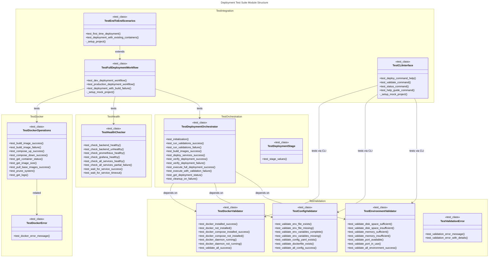

# C4 Code Level: Finance Feedback Engine - Deployment Tests

## Overview

- **Name**: Deployment Test Suite
- **Description**: Comprehensive test suite for the Finance Feedback Engine deployment orchestration system, covering Docker operations, health checks, environment validation, and end-to-end deployment workflows.
- **Location**: `finance_feedback_engine/deployment/tests/`
- **Language**: Python 3.12
- **Purpose**: This test suite validates all aspects of the deployment system including Docker container management, health verification, configuration validation, and complete deployment workflows. Uses test-driven development (TDD) approach with unit tests, integration tests, and end-to-end scenario tests.

---

## Code Elements

### Test Classes and Methods

#### TestDockerOperations
**File**: `test_docker.py` (Lines 14-124)

**Purpose**: Test Docker operations for building images, managing containers, and executing docker-compose commands.

**Test Methods**:

1. `test_build_image_success(self): -> None`
   - **Description**: Verifies successful Docker image build with mocked subprocess
   - **Location**: `test_docker.py:17-30`
   - **Dependencies**: `DockerOperations`, `subprocess.run` (mocked)
   - **Assertions**: Confirms build command is called with correct arguments

2. `test_build_image_failure(self): -> None`
   - **Description**: Validates that DockerError is raised on build failure
   - **Location**: `test_docker.py:32-41`
   - **Dependencies**: `DockerOperations`, `DockerError`
   - **Assertions**: Confirms appropriate error message in exception

3. `test_compose_up_success(self): -> None`
   - **Description**: Tests successful docker-compose up operation
   - **Location**: `test_docker.py:43-52`
   - **Dependencies**: `DockerOperations`, `subprocess.run` (mocked)
   - **Assertions**: Confirms command executed with 'up' argument

4. `test_compose_down_success(self): -> None`
   - **Description**: Tests successful docker-compose down operation
   - **Location**: `test_docker.py:54-63`
   - **Dependencies**: `DockerOperations`, `subprocess.run` (mocked)
   - **Assertions**: Confirms command executed with 'down' argument

5. `test_get_container_status(self): -> None`
   - **Description**: Retrieves container status information
   - **Location**: `test_docker.py:65-76`
   - **Dependencies**: `DockerOperations`, `subprocess.run` (mocked)
   - **Assertions**: Returns dict with container statuses

6. `test_get_image_size(self): -> None`
   - **Description**: Retrieves Docker image size information
   - **Location**: `test_docker.py:78-86`
   - **Dependencies**: `DockerOperations`, `subprocess.run` (mocked)
   - **Assertions**: Returns image size as string

7. `test_pull_base_images_success(self): -> None`
   - **Description**: Tests pulling of base Docker images (Python, Node.js, etc.)
   - **Location**: `test_docker.py:88-97`
   - **Dependencies**: `DockerOperations`, `subprocess.run` (mocked)
   - **Assertions**: Multiple docker pull commands executed

8. `test_prune_system(self): -> None`
   - **Description**: Tests Docker system pruning to reclaim space
   - **Location**: `test_docker.py:99-110`
   - **Dependencies**: `DockerOperations`, `subprocess.run` (mocked)
   - **Assertions**: Prune command executed successfully

9. `test_get_logs(self): -> None`
   - **Description**: Retrieves container logs with tail limit
   - **Location**: `test_docker.py:112-123`
   - **Dependencies**: `DockerOperations`, `subprocess.run` (mocked)
   - **Assertions**: Returns log string with specified tail

#### TestDockerError
**File**: `test_docker.py` (Lines 126-134)

**Purpose**: Test custom DockerError exception handling.

**Test Methods**:

1. `test_docker_error_message(self): -> None`
   - **Description**: Validates DockerError message storage and exception type
   - **Location**: `test_docker.py:129-134`
   - **Dependencies**: `DockerError`
   - **Assertions**: Exception message matches input, instance of Exception

---

#### TestHealthChecker
**File**: `test_health.py` (Lines 14-113)

**Purpose**: Test health check functionality for backend, Prometheus, Grafana, and frontend services.

**Test Methods**:

1. `test_check_backend_healthy(self): -> None`
   - **Description**: Tests successful backend health check with HTTP 200 response
   - **Location**: `test_health.py:17-28`
   - **Dependencies**: `HealthChecker`, `requests.get` (mocked)
   - **Assertions**: Returns True on healthy status

2. `test_check_backend_unhealthy(self): -> None`
   - **Description**: Tests HealthCheckError raised on unhealthy backend (HTTP 503)
   - **Location**: `test_health.py:30-37`
   - **Dependencies**: `HealthChecker`, `HealthCheckError`
   - **Assertions**: Exception raised on service unavailable

3. `test_check_prometheus_healthy(self): -> None`
   - **Description**: Tests successful Prometheus health check
   - **Location**: `test_health.py:39-47`
   - **Dependencies**: `HealthChecker`, `requests.get` (mocked)
   - **Assertions**: Returns True on HTTP 200

4. `test_check_grafana_healthy(self): -> None`
   - **Description**: Tests successful Grafana health check
   - **Location**: `test_health.py:49-57`
   - **Dependencies**: `HealthChecker`, `requests.get` (mocked)
   - **Assertions**: Returns True on HTTP 200

5. `test_check_all_services_healthy(self): -> None`
   - **Description**: Tests comprehensive health check across all services when all are healthy
   - **Location**: `test_health.py:59-75`
   - **Dependencies**: `HealthChecker`, `patch.object` (mocked methods)
   - **Assertions**: All service flags and overall flag are True

6. `test_check_all_services_partial_failure(self): -> None`
   - **Description**: Tests health check result aggregation with partial failures
   - **Location**: `test_health.py:77-93`
   - **Dependencies**: `HealthChecker`, `HealthCheckError` (mocked)
   - **Assertions**: Failed service flag is False, overall flag is False

7. `test_wait_for_service_success(self): -> None`
   - **Description**: Tests waiting for service to become healthy with polling
   - **Location**: `test_health.py:95-102`
   - **Dependencies**: `HealthChecker`, `patch.object` (mocked)
   - **Assertions**: Returns True when service becomes healthy

8. `test_wait_for_service_timeout(self): -> None`
   - **Description**: Tests timeout when service fails to become healthy
   - **Location**: `test_health.py:104-113`
   - **Dependencies**: `HealthChecker`, `HealthCheckError` (mocked)
   - **Assertions**: Returns False on timeout

---

#### TestDeploymentOrchestrator
**File**: `test_orchestrator.py` (Lines 14-149)

**Purpose**: Test deployment orchestration logic and stage transitions.

**Test Methods**:

1. `test_initialization(self): -> None`
   - **Description**: Validates orchestrator initialization with environment and IDs
   - **Location**: `test_orchestrator.py:17-23`
   - **Dependencies**: `DeploymentOrchestrator`
   - **Assertions**: Environment set correctly, IDs generated

2. `test_run_validations_success(self): -> None`
   - **Description**: Tests successful execution of all validation phases
   - **Location**: `test_orchestrator.py:25-37`
   - **Dependencies**: `DeploymentOrchestrator`, `patch.object` (mocked validators)
   - **Assertions**: Returns True when all validators pass

3. `test_run_validations_failure(self): -> None`
   - **Description**: Tests DeploymentError raised when validation fails
   - **Location**: `test_orchestrator.py:39-50`
   - **Dependencies**: `DeploymentOrchestrator`, `DeploymentError`
   - **Assertions**: Exception raised with validation error

4. `test_build_images_success(self): -> None`
   - **Description**: Tests successful building of Docker images (backend + frontend)
   - **Location**: `test_orchestrator.py:52-61`
   - **Dependencies**: `DeploymentOrchestrator`, `DockerOperations` (mocked)
   - **Assertions**: build_image called twice for both images

5. `test_deploy_services_success(self): -> None`
   - **Description**: Tests successful deployment of services via docker-compose
   - **Location**: `test_orchestrator.py:63-72`
   - **Dependencies**: `DeploymentOrchestrator`, `DockerOperations` (mocked)
   - **Assertions**: compose_up called once

6. `test_verify_deployment_success(self): -> None`
   - **Description**: Tests successful deployment verification through health checks
   - **Location**: `test_orchestrator.py:74-82`
   - **Dependencies**: `DeploymentOrchestrator`, `HealthChecker` (mocked)
   - **Assertions**: Returns True on successful verification

7. `test_verify_deployment_failure(self): -> None`
   - **Description**: Tests DeploymentError on verification failure
   - **Location**: `test_orchestrator.py:84-91`
   - **Dependencies**: `DeploymentOrchestrator`, `DeploymentError`
   - **Assertions**: Exception raised when health checks fail

8. `test_execute_full_deployment_success(self): -> None`
   - **Description**: Tests complete deployment execution through all stages
   - **Location**: `test_orchestrator.py:93-109`
   - **Dependencies**: `DeploymentOrchestrator`, `DeploymentStage` (mocked methods)
   - **Assertions**: Final stage is COMPLETE, execution returns True

9. `test_execute_with_validation_failure(self): -> None`
   - **Description**: Tests deployment stops on validation failure
   - **Location**: `test_orchestrator.py:111-122`
   - **Dependencies**: `DeploymentOrchestrator`, `DeploymentError`
   - **Assertions**: Stage set to FAILED on validation error

10. `test_get_deployment_status(self): -> None`
    - **Description**: Retrieves deployment status information
    - **Location**: `test_orchestrator.py:124-133`
    - **Dependencies**: `DeploymentOrchestrator`, `DeploymentStage`
    - **Assertions**: Status dict contains stage, environment, deployment_id

11. `test_cleanup_on_failure(self): -> None`
    - **Description**: Tests cleanup method is called on deployment failure
    - **Location**: `test_orchestrator.py:135-148`
    - **Dependencies**: `DeploymentOrchestrator`, `patch.object` (mocked cleanup)
    - **Assertions**: cleanup method called once on error

#### TestDeploymentStage
**File**: `test_orchestrator.py` (Lines 151-162)

**Purpose**: Test DeploymentStage enumeration values.

**Test Methods**:

1. `test_stage_values(self): -> None`
   - **Description**: Validates all DeploymentStage enum values
   - **Location**: `test_orchestrator.py:154-161`
   - **Dependencies**: `DeploymentStage`
   - **Assertions**: All stage values match expected strings

---

#### TestDockerValidator
**File**: `test_validators.py` (Lines 20-107)

**Purpose**: Test Docker installation and configuration validation.

**Test Methods**:

1. `test_docker_installed_success(self): -> None`
   - **Description**: Tests successful Docker installation detection
   - **Location**: `test_validators.py:23-32`
   - **Dependencies**: `DockerValidator`, `subprocess.run` (mocked)
   - **Assertions**: Returns True when Docker version command succeeds

2. `test_docker_not_installed(self): -> None`
   - **Description**: Tests ValidationError when Docker not found
   - **Location**: `test_validators.py:34-43`
   - **Dependencies**: `DockerValidator`, `ValidationError`
   - **Assertions**: Raises ValidationError with appropriate message

3. `test_docker_compose_installed_success(self): -> None`
   - **Description**: Tests successful Docker Compose detection
   - **Location**: `test_validators.py:45-55`
   - **Dependencies**: `DockerValidator`, `subprocess.run` (mocked)
   - **Assertions**: Returns True when Docker Compose version succeeds

4. `test_docker_compose_not_installed(self): -> None`
   - **Description**: Tests ValidationError when Docker Compose not found
   - **Location**: `test_validators.py:57-71`
   - **Dependencies**: `DockerValidator`, `ValidationError`, `subprocess.CalledProcessError`
   - **Assertions**: Raises ValidationError with appropriate message

5. `test_docker_daemon_running(self): -> None`
   - **Description**: Tests successful Docker daemon status check
   - **Location**: `test_validators.py:73-81`
   - **Dependencies**: `DockerValidator`, `subprocess.run` (mocked)
   - **Assertions**: Returns True when docker info succeeds

6. `test_docker_daemon_not_running(self): -> None`
   - **Description**: Tests ValidationError when Docker daemon not running
   - **Location**: `test_validators.py:83-92`
   - **Dependencies**: `DockerValidator`, `ValidationError`
   - **Assertions**: Raises ValidationError on non-zero return code

7. `test_validate_all_success(self): -> None`
   - **Description**: Tests aggregated Docker validation success
   - **Location**: `test_validators.py:94-107`
   - **Dependencies**: `DockerValidator`, `patch.object` (mocked methods)
   - **Assertions**: Returns True when all Docker checks pass

#### TestConfigValidator
**File**: `test_validators.py` (Lines 110-203)

**Purpose**: Test configuration file and environment variable validation.

**Test Methods**:

1. `test_validate_env_file_exists(self, tmp_path): -> None`
   - **Description**: Tests existence check for .env files
   - **Location**: `test_validators.py:113-121`
   - **Dependencies**: `ConfigValidator`, `tmp_path` (pytest fixture)
   - **Assertions**: Returns True when env file exists

2. `test_validate_env_file_missing(self, tmp_path): -> None`
   - **Description**: Tests ValidationError when env file missing
   - **Location**: `test_validators.py:123-130`
   - **Dependencies**: `ConfigValidator`, `ValidationError`, `tmp_path`
   - **Assertions**: Raises ValidationError with appropriate message

3. `test_validate_env_variables_complete(self, tmp_path): -> None`
   - **Description**: Tests validation of all required environment variables
   - **Location**: `test_validators.py:132-148`
   - **Dependencies**: `ConfigValidator`, `tmp_path`
   - **Assertions**: Returns True when all required variables present

4. `test_validate_env_variables_missing(self, tmp_path): -> None`
   - **Description**: Tests ValidationError when required variables missing
   - **Location**: `test_validators.py:150-160`
   - **Dependencies**: `ConfigValidator`, `ValidationError`, `tmp_path`
   - **Assertions**: Raises ValidationError with "Missing required" message

5. `test_validate_config_yaml_exists(self, tmp_path): -> None`
   - **Description**: Tests existence of config.yaml file
   - **Location**: `test_validators.py:162-171`
   - **Dependencies**: `ConfigValidator`, `tmp_path`
   - **Assertions**: Returns True when config.yaml exists

6. `test_validate_dockerfile_exists(self, tmp_path): -> None`
   - **Description**: Tests existence of Dockerfile
   - **Location**: `test_validators.py:173-180`
   - **Dependencies**: `ConfigValidator`, `tmp_path`
   - **Assertions**: Returns True when Dockerfile exists

7. `test_validate_all_config_success(self, tmp_path): -> None`
   - **Description**: Tests aggregated config validation with all files present
   - **Location**: `test_validators.py:182-203`
   - **Dependencies**: `ConfigValidator`, `tmp_path`
   - **Assertions**: Returns True when all config checks pass

#### TestEnvironmentValidator
**File**: `test_validators.py` (Lines 206-287)

**Purpose**: Test system resource and environment validation.

**Test Methods**:

1. `test_validate_disk_space_sufficient(self): -> None`
   - **Description**: Tests disk space validation with sufficient space
   - **Location**: `test_validators.py:209-217`
   - **Dependencies**: `EnvironmentValidator`, `shutil.disk_usage` (mocked)
   - **Assertions**: Returns True with 30GB available (min 20GB)

2. `test_validate_disk_space_insufficient(self): -> None`
   - **Description**: Tests ValidationError on insufficient disk space
   - **Location**: `test_validators.py:219-228`
   - **Dependencies**: `EnvironmentValidator`, `ValidationError`
   - **Assertions**: Raises ValidationError with appropriate message

3. `test_validate_memory_sufficient(self): -> None`
   - **Description**: Tests memory validation with sufficient RAM
   - **Location**: `test_validators.py:230-238`
   - **Dependencies**: `EnvironmentValidator`, `psutil.virtual_memory` (mocked)
   - **Assertions**: Returns True with 8GB available (min 4GB)

4. `test_validate_memory_insufficient(self): -> None`
   - **Description**: Tests ValidationError on insufficient memory
   - **Location**: `test_validators.py:240-249`
   - **Dependencies**: `EnvironmentValidator`, `ValidationError`
   - **Assertions**: Raises ValidationError with appropriate message

5. `test_validate_port_available(self): -> None`
   - **Description**: Tests port availability check
   - **Location**: `test_validators.py:251-261`
   - **Dependencies**: `EnvironmentValidator`, `socket.socket` (mocked)
   - **Assertions**: Returns True when port available (connect_ex returns 1)

6. `test_validate_port_in_use(self): -> None`
   - **Description**: Tests ValidationError when port already in use
   - **Location**: `test_validators.py:263-274`
   - **Dependencies**: `EnvironmentValidator`, `ValidationError`
   - **Assertions**: Raises ValidationError with port number in message

7. `test_validate_all_environment_success(self): -> None`
   - **Description**: Tests aggregated environment validation success
   - **Location**: `test_validators.py:276-287`
   - **Dependencies**: `EnvironmentValidator`, `patch.object` (mocked methods)
   - **Assertions**: Returns True when all environment checks pass

#### TestValidationError
**File**: `test_validators.py` (Lines 290-308)

**Purpose**: Test custom ValidationError exception handling.

**Test Methods**:

1. `test_validation_error_message(self): -> None`
   - **Description**: Tests ValidationError message storage
   - **Location**: `test_validators.py:293-298`
   - **Dependencies**: `ValidationError`
   - **Assertions**: Message matches input, instance of Exception

2. `test_validation_error_with_details(self): -> None`
   - **Description**: Tests ValidationError with additional details dict
   - **Location**: `test_validators.py:300-308`
   - **Dependencies**: `ValidationError`
   - **Assertions**: Details dict stored and accessible

---

#### TestFullDeploymentWorkflow
**File**: `test_integration.py` (Lines 17-269)

**Purpose**: Integration tests for complete deployment workflows.

**Test Methods**:

1. `test_dev_deployment_workflow(self, tmp_path): -> None`
   - **Description**: Tests full development environment deployment
   - **Location**: `test_integration.py:20-46`
   - **Dependencies**: `DeploymentOrchestrator`, `DeploymentStage`, `tmp_path`
   - **Mocked**: `subprocess.run`, `requests.get`, `psutil.virtual_memory`, `shutil.disk_usage`
   - **Assertions**: Returns True, stage is COMPLETE

2. `test_production_deployment_workflow(self, tmp_path): -> None`
   - **Description**: Tests full production environment deployment
   - **Location**: `test_integration.py:48-78`
   - **Dependencies**: `DeploymentOrchestrator`, `DeploymentStage`, `tmp_path`, `socket.socket`
   - **Mocked**: `subprocess.run`, `requests.get`, `psutil.virtual_memory`, `shutil.disk_usage`, `socket.socket`
   - **Assertions**: Returns True, stage is COMPLETE

3. `test_deployment_with_build_failure(self, tmp_path): -> None`
   - **Description**: Tests deployment failure handling with build error
   - **Location**: `test_integration.py:80-109`
   - **Dependencies**: `DeploymentOrchestrator`, `DeploymentStage`, `tmp_path`
   - **Mocked**: `subprocess.run`, `psutil.virtual_memory`, `shutil.disk_usage`
   - **Assertions**: Raises exception, stage is FAILED

4. `_setup_mock_project(self, tmp_path: Path, environment: str): -> None`
   - **Description**: Helper method to create mock project directory structure
   - **Location**: `test_integration.py:111-125`
   - **Dependencies**: `pathlib.Path`
   - **Creates**: config/, data/, logs/ directories, config files, .env file

#### TestCLIInterface
**File**: `test_integration.py` (Lines 128-189)

**Purpose**: Test command-line interface for deployment commands.

**Test Methods**:

1. `test_deploy_command_help(self): -> None`
   - **Description**: Tests deploy command help output
   - **Location**: `test_integration.py:131-137`
   - **Dependencies**: `cli`, `CliRunner`
   - **Assertions**: Exit code 0, help text in output

2. `test_validate_command(self, tmp_path): -> None`
   - **Description**: Tests validate command execution
   - **Location**: `test_integration.py:139-159`
   - **Dependencies**: `cli`, `CliRunner`, `tmp_path`
   - **Mocked**: `subprocess.run`, `psutil.virtual_memory`, `shutil.disk_usage`
   - **Assertions**: Exit code 0

3. `test_status_command(self, tmp_path): -> None`
   - **Description**: Tests status command execution
   - **Location**: `test_integration.py:161-172`
   - **Dependencies**: `cli`, `CliRunner`, `tmp_path`
   - **Mocked**: `subprocess.run`, `requests.get`
   - **Assertions**: Exit code 0

4. `test_help_guide_command(self): -> None`
   - **Description**: Tests help-guide command output
   - **Location**: `test_integration.py:174-180`
   - **Dependencies**: `cli`, `CliRunner`
   - **Assertions**: Exit code 0, deployment guide text in output

5. `_setup_mock_project(self, tmp_path: Path): -> None`
   - **Description**: Helper method to create minimal mock project structure
   - **Location**: `test_integration.py:182-188`
   - **Dependencies**: `pathlib.Path`
   - **Creates**: config/, config files, .env file

#### TestEndToEndScenarios
**File**: `test_integration.py` (Lines 191-269)

**Purpose**: Test realistic end-to-end deployment scenarios.

**Test Methods**:

1. `test_first_time_deployment(self, tmp_path): -> None`
   - **Description**: Tests deploying to a completely fresh environment
   - **Location**: `test_integration.py:194-229`
   - **Dependencies**: `DeploymentOrchestrator`, `tmp_path`
   - **Mocked**: `subprocess.run`, `requests.get`, `psutil.virtual_memory`, `shutil.disk_usage`
   - **Assertions**: Returns True, required directories/files created

2. `test_deployment_with_existing_containers(self, tmp_path): -> None`
   - **Description**: Tests deployment when containers already exist
   - **Location**: `test_integration.py:231-257`
   - **Dependencies**: `DeploymentOrchestrator`, `tmp_path`
   - **Mocked**: `subprocess.run`, `requests.get`, `psutil.virtual_memory`, `shutil.disk_usage`
   - **Assertions**: Returns True, gracefully handles existing containers

3. `_setup_project(self, tmp_path: Path): -> None`
   - **Description**: Helper method to create complete project structure
   - **Location**: `test_integration.py:259-268`
   - **Dependencies**: `pathlib.Path`
   - **Creates**: All required project directories and configuration files

---

## Dependencies

### Internal Dependencies
(Code elements tested, imported from parent deployment module)

- **`..docker.DockerOperations`**: Docker container and image operations
- **`..docker.DockerError`**: Custom exception for Docker operation failures
- **`..health.HealthChecker`**: Service health checking functionality
- **`..health.HealthCheckError`**: Custom exception for health check failures
- **`..orchestrator.DeploymentOrchestrator`**: Main orchestration logic for deployments
- **`..orchestrator.DeploymentStage`**: Enumeration of deployment stages (VALIDATING, BUILDING, DEPLOYING, VERIFYING, COMPLETE, FAILED)
- **`..orchestrator.DeploymentError`**: Custom exception for deployment failures
- **`..validators.DockerValidator`**: Docker installation/configuration validation
- **`..validators.ConfigValidator`**: Configuration file validation
- **`..validators.EnvironmentValidator`**: System environment validation
- **`..validators.ValidationError`**: Custom exception for validation failures
- **`..cli.cli`**: Command-line interface function

### External Dependencies

#### Testing Framework
- **`pytest`**: Testing framework for writing and running tests
- **`pytest.fixture`** (tmp_path): Temporary directory fixture for file system testing
- **`pytest.raises`**: Context manager for exception testing

#### Mocking/Patching
- **`unittest.mock.Mock`**: Simple mock object creation
- **`unittest.mock.MagicMock`**: Advanced mock object with automatic attribute creation
- **`unittest.mock.patch`**: Decorator/context manager for mocking functions/classes
- **`unittest.mock.patch.object`**: Patch specific object methods

#### Standard Library Modules (Mocked in tests)
- **`subprocess.run`**: Execute shell commands (mocked)
- **`requests.get`**: HTTP GET requests (mocked)
- **`psutil.virtual_memory`**: System memory information (mocked)
- **`shutil.disk_usage`**: Disk usage information (mocked)
- **`socket.socket`**: Network socket operations (mocked)

#### CLI Framework
- **`click.testing.CliRunner`**: Test runner for Click CLI commands

#### Standard Library (Direct Use)
- **`pathlib.Path`**: Object-oriented file path handling
- **`subprocess`**: Process execution (subprocess.CalledProcessError)

---

## Relationships

The deployment tests module has a hierarchical structure organized by functional domain:

### Test Coverage by Deployment Module

**test_docker.py** → tests `deployment.docker` module
- Docker image building
- Container management
- Docker Compose operations
- Image inspection (size, logs)
- System pruning operations

**test_health.py** → tests `deployment.health` module
- Individual service health checks (backend, Prometheus, Grafana, frontend)
- Aggregated health check with failure handling
- Service polling with timeout mechanism

**test_orchestrator.py** → tests `deployment.orchestrator` module
- Orchestrator initialization and state management
- Validation phase execution
- Image building coordination
- Service deployment coordination
- Deployment verification through health checks
- Full deployment execution workflow
- Stage transitions and error handling
- Cleanup on failure

**test_validators.py** → tests `deployment.validators` module
- Docker installation validation (CLI tools)
- Docker daemon status checking
- Configuration file existence validation
- Environment variable requirements checking
- System resource validation (disk space, memory)
- Port availability checking

**test_integration.py** → Integration tests
- End-to-end deployment workflows (dev, production)
- Deployment failure scenarios
- CLI command execution
- First-time deployment to fresh environment
- Deployment with existing containers
- Complete project setup and configuration

### Mocking Strategy

The test suite uses comprehensive mocking to isolate units under test:

1. **Subprocess Mocking**: All external command execution mocked to simulate success/failure scenarios
2. **HTTP Request Mocking**: `requests.get` mocked for health checks without actual network calls
3. **System Resource Mocking**: File system, disk, and memory operations mocked for environment validation
4. **Network Socket Mocking**: Port availability checks mocked for environment validation
5. **Method Mocking**: Individual orchestrator and validator methods mocked for unit tests, left intact for integration tests

---

## Test Organization Notes

### Test-Driven Development Approach
- Tests written first to define expected behavior
- Test file docstrings explain test domain
- Each test method documents single behavior (Arrange-Act-Assert pattern)

### File Organization
- **test_docker.py**: 135 lines, 11 test methods
- **test_health.py**: 114 lines, 8 test methods
- **test_orchestrator.py**: 162 lines, 12 test methods
- **test_validators.py**: 309 lines, 19 test methods
- **test_integration.py**: 269 lines, 8 test methods, 1 integration test class set

**Total**: 989 lines of test code across 5 test modules

### Test Scope Coverage
- **Unit Tests**: Individual validator, Docker operations, health checks, orchestrator methods
- **Integration Tests**: Complete deployment workflows across dev/production environments
- **Scenario Tests**: First-time deployments, existing containers, build failures, CLI interactions
- **Error Handling**: Exception raising and error messages for all failure modes

### Key Testing Patterns
1. **Context managers with patch**: Modern Python testing with `patch` as context managers
2. **Method patching**: `patch.object()` for specific method mocking
3. **Fixture usage**: `tmp_path` for temporary file system testing
4. **Return value configuration**: Mock configuration for realistic responses
5. **Call assertion**: Verifying correct function calls and arguments
6. **Exception assertion**: Using `pytest.raises()` for exception testing

---

## Summary

The deployment tests module provides comprehensive validation of the Finance Feedback Engine's deployment infrastructure. With 989 lines of test code organized across 5 test files, it covers:

- **Docker Operations**: 11 tests for container/image management
- **Health Checking**: 8 tests for service monitoring
- **Orchestration**: 12 tests for deployment workflow coordination
- **Validation**: 19 tests for environmental/configuration checks
- **Integration**: 8 tests for end-to-end workflows

The test suite uses a test-driven development approach with thorough mocking strategies to ensure fast, isolated, and reliable test execution across unit, integration, and scenario test levels.
