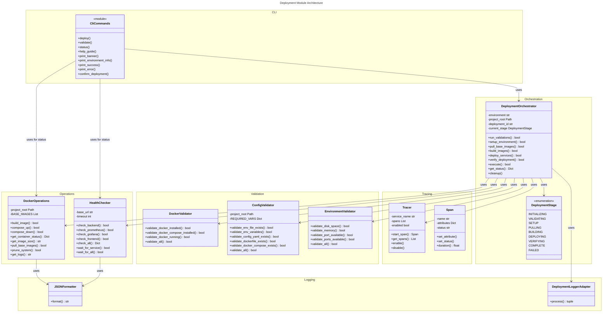
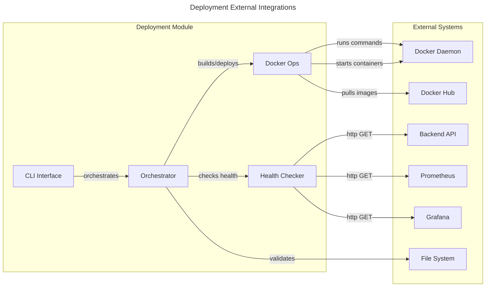

# C4 Code Level: Finance Feedback Engine Deployment Module

## Overview

- **Name**: Deployment Orchestration System
- **Description**: Production-ready automated deployment tool with comprehensive test-driven design, distributed tracing, structured logging, and health checking capabilities
- **Location**: `finance_feedback_engine/deployment`
- **Language**: Python 3.12+
- **Purpose**: Automate the complete deployment lifecycle for the Finance Feedback Engine across multiple environments (dev, staging, production) with validation, Docker orchestration, and health verification

## Code Elements

### Module: `__init__.py`
- **Location**: `finance_feedback_engine/deployment/__init__.py`
- **Purpose**: Package initialization and public API exports
- **Exports**:
  - `DeploymentOrchestrator` - Main orchestration class
  - `cli` - Click CLI interface
- **Version**: 1.0.0
- **Author**: Three Rivers Tech

### Module: `__main__.py`
- **Location**: `finance_feedback_engine/deployment/__main__.py`
- **Purpose**: Entry point for module execution via `python -m finance_feedback_engine.deployment`
- **Dependencies**: `cli` from `cli.py`

### Module: `cli.py`
- **Location**: `finance_feedback_engine/deployment/cli.py`
- **Language**: Python with Click CLI framework and Rich terminal UI
- **Purpose**: Beautiful command-line interface for deployment orchestration

#### Functions

##### `print_banner() -> None`
- **Signature**: `print_banner() -> None`
- **Location**: `finance_feedback_engine/deployment/cli.py:25`
- **Purpose**: Print styled deployment banner to console
- **Dependencies**: `rich.console.Console`

##### `print_environment_info(environment: str) -> None`
- **Signature**: `print_environment_info(environment: str) -> None`
- **Location**: `finance_feedback_engine/deployment/cli.py:39`
- **Parameters**:
  - `environment: str` - Environment name (production, staging, dev)
- **Purpose**: Display environment configuration in a formatted table
- **Dependencies**: `rich.table.Table`, `rich.box`

##### `print_success(message: str, details: dict = None) -> None`
- **Signature**: `print_success(message: str, details: dict = None) -> None`
- **Location**: `finance_feedback_engine/deployment/cli.py:57`
- **Parameters**:
  - `message: str` - Success message to display
  - `details: dict` - Optional details dictionary to display
- **Purpose**: Print formatted success message with optional details
- **Dependencies**: `rich.console.Console`, `rich.table.Table`

##### `print_error(message: str, error: Exception = None) -> None`
- **Signature**: `print_error(message: str, error: Exception = None) -> None`
- **Location**: `finance_feedback_engine/deployment/cli.py:68`
- **Parameters**:
  - `message: str` - Error message to display
  - `error: Exception` - Optional exception to display
- **Purpose**: Print formatted error message with optional exception details
- **Dependencies**: `rich.console.Console`

##### `print_warning(message: str) -> None`
- **Signature**: `print_warning(message: str) -> None`
- **Location**: `finance_feedback_engine/deployment/cli.py:76`
- **Parameters**:
  - `message: str` - Warning message to display
- **Purpose**: Print formatted warning message
- **Dependencies**: `rich.console.Console`

##### `confirm_deployment(environment: str) -> bool`
- **Signature**: `confirm_deployment(environment: str) -> bool`
- **Location**: `finance_feedback_engine/deployment/cli.py:81`
- **Parameters**:
  - `environment: str` - Environment name
- **Returns**: `bool` - User confirmation
- **Purpose**: Confirm deployment with user, special warning for production
- **Dependencies**: `click.confirm`, `rich.console.Console`

#### CLI Commands

##### `cli()` (Click Group)
- **Signature**: `@click.group() @click.version_option(version="1.0.0") def cli() -> None`
- **Location**: `finance_feedback_engine/deployment/cli.py:95`
- **Purpose**: Main CLI entry point
- **Decorators**: Click group with version option

##### `deploy()` (Click Command)
- **Signature**: `@cli.command() @click.argument("environment", ...) @click.option(...) def deploy(environment: str, no_cache: bool, skip_tests: bool, project_root: str, yes: bool) -> None`
- **Location**: `finance_feedback_engine/deployment/cli.py:118`
- **Parameters**:
  - `environment: str` - Target environment (production, staging, dev)
  - `no_cache: bool` - Build without Docker cache
  - `skip_tests: bool` - Skip test execution
  - `project_root: str` - Project root directory
  - `yes: bool` - Skip confirmation prompts
- **Purpose**: Deploy Finance Feedback Engine to specified environment
- **Dependencies**: `DeploymentOrchestrator`, progress tracking, Rich console
- **Process**:
  1. Display banner and environment info
  2. Confirm deployment (unless --yes flag)
  3. Initialize DeploymentOrchestrator
  4. Execute deployment stages with progress tracking
  5. Display service URLs and logs location

##### `validate()` (Click Command)
- **Signature**: `@cli.command() @click.argument("environment", ...) @click.option(...) def validate(environment: str, project_root: str) -> None`
- **Location**: `finance_feedback_engine/deployment/cli.py:187`
- **Parameters**:
  - `environment: str` - Environment to validate
  - `project_root: str` - Project root directory
- **Purpose**: Validate environment without deploying
- **Dependencies**: `DeploymentOrchestrator`, progress tracking

##### `status()` (Click Command)
- **Signature**: `@cli.command() @click.option(...) def status(project_root: str) -> None`
- **Location**: `finance_feedback_engine/deployment/cli.py:213`
- **Parameters**:
  - `project_root: str` - Project root directory
- **Purpose**: Check deployment status and health
- **Dependencies**: `DockerOperations`, `HealthChecker`
- **Displays**:
  - Container status table
  - Service health status table

##### `help_guide()` (Click Command)
- **Signature**: `@cli.command() def help_guide() -> None`
- **Location**: `finance_feedback_engine/deployment/cli.py:256`
- **Purpose**: Show comprehensive deployment guide
- **Dependencies**: `rich.console.Console`, `rich.panel.Panel`

### Module: `docker.py`
- **Location**: `finance_feedback_engine/deployment/docker.py`
- **Purpose**: Handle Docker image building, container management, and docker-compose operations

#### Exception Classes

##### `DockerError(Exception)`
- **Location**: `finance_feedback_engine/deployment/docker.py:16`
- **Purpose**: Custom exception for Docker operation failures

#### Class: `DockerOperations`
- **Location**: `finance_feedback_engine/deployment/docker.py:21`
- **Purpose**: Manages Docker operations for deployment
- **Class Variables**:
  - `BASE_IMAGES: List[str]` - Base Docker images to pull
    - `python:3.12-slim`
    - `node:20-alpine`
    - `nginx:1.25-alpine`
    - `prom/prometheus:latest`
    - `grafana/grafana:latest`

##### Method: `__init__(self, project_root: str = ".") -> None`
- **Signature**: `__init__(self, project_root: str = ".") -> None`
- **Location**: `finance_feedback_engine/deployment/docker.py:33`
- **Parameters**:
  - `project_root: str` - Project root directory path
- **Purpose**: Initialize Docker operations with project root

##### Method: `build_image(self, service: str, dockerfile: str, tag: str, no_cache: bool = False) -> bool`
- **Signature**: `build_image(self, service: str, dockerfile: str, tag: str, no_cache: bool = False) -> bool`
- **Location**: `finance_feedback_engine/deployment/docker.py:38`
- **Parameters**:
  - `service: str` - Service name (backend, frontend)
  - `dockerfile: str` - Path to Dockerfile
  - `tag: str` - Image tag/version
  - `no_cache: bool` - Build without cache
- **Returns**: `bool` - Success status
- **Purpose**: Build Docker image for a service
- **Raises**: `DockerError` - If build fails
- **Dependencies**: `subprocess`, `logger`

##### Method: `compose_up(self, environment: str, detached: bool = True) -> bool`
- **Signature**: `compose_up(self, environment: str, detached: bool = True) -> bool`
- **Location**: `finance_feedback_engine/deployment/docker.py:66`
- **Parameters**:
  - `environment: str` - Environment name (dev, staging, production)
  - `detached: bool` - Run in detached mode
- **Returns**: `bool` - Success status
- **Purpose**: Start services with docker-compose
- **Raises**: `DockerError` - If compose up fails
- **Implementation Details**: Falls back to `docker compose` plugin if `docker-compose` fails
- **Dependencies**: `subprocess`, `logger`

##### Method: `compose_down(self, environment: str) -> bool`
- **Signature**: `compose_down(self, environment: str) -> bool`
- **Location**: `finance_feedback_engine/deployment/docker.py:100`
- **Parameters**:
  - `environment: str` - Environment name
- **Returns**: `bool` - Success status
- **Purpose**: Stop services with docker-compose
- **Raises**: `DockerError` - If compose down fails
- **Implementation Details**: Falls back to `docker compose` plugin if `docker-compose` fails
- **Dependencies**: `subprocess`, `logger`

##### Method: `get_container_status(self) -> Dict[str, str]`
- **Signature**: `get_container_status(self) -> Dict[str, str]`
- **Location**: `finance_feedback_engine/deployment/docker.py:134`
- **Returns**: `Dict[str, str]` - Container names mapped to status
- **Purpose**: Get status of all containers
- **Dependencies**: `subprocess`, `logger`

##### Method: `get_image_size(self, image: str) -> str`
- **Signature**: `get_image_size(self, image: str) -> str`
- **Location**: `finance_feedback_engine/deployment/docker.py:162`
- **Parameters**:
  - `image: str` - Docker image name
- **Returns**: `str` - Image size formatted string
- **Purpose**: Get size of a Docker image
- **Dependencies**: `subprocess`

##### Method: `pull_base_images(self) -> bool`
- **Signature**: `pull_base_images(self) -> bool`
- **Location**: `finance_feedback_engine/deployment/docker.py:176`
- **Returns**: `bool` - Success status
- **Purpose**: Pull base Docker images
- **Dependencies**: `subprocess`, `logger`

##### Method: `prune_system(self, force: bool = True) -> bool`
- **Signature**: `prune_system(self, force: bool = True) -> bool`
- **Location**: `finance_feedback_engine/deployment/docker.py:193`
- **Parameters**:
  - `force: bool` - Force without confirmation
- **Returns**: `bool` - Success status
- **Purpose**: Prune Docker system to free space
- **Raises**: `DockerError` - If prune fails
- **Dependencies**: `subprocess`, `logger`

##### Method: `get_logs(self, service: str, tail: int = 50) -> str`
- **Signature**: `get_logs(self, service: str, tail: int = 50) -> str`
- **Location**: `finance_feedback_engine/deployment/docker.py:214`
- **Parameters**:
  - `service: str` - Service name
  - `tail: int` - Number of lines to retrieve
- **Returns**: `str` - Log output
- **Purpose**: Get logs from a service
- **Dependencies**: `subprocess`, `logger`

### Module: `health.py`
- **Location**: `finance_feedback_engine/deployment/health.py`
- **Purpose**: Perform health checks on deployed services

#### Exception Classes

##### `HealthCheckError(Exception)`
- **Location**: `finance_feedback_engine/deployment/health.py:13`
- **Purpose**: Custom exception for health check failures

#### Class: `HealthChecker`
- **Location**: `finance_feedback_engine/deployment/health.py:18`
- **Purpose**: Performs health checks on services
- **Instance Variables**:
  - `base_url: str` - Base URL for health checks (default: "http://localhost")
  - `timeout: int` - Request timeout in seconds (default: 10)

##### Method: `__init__(self, base_url: str = "http://localhost") -> None`
- **Signature**: `__init__(self, base_url: str = "http://localhost") -> None`
- **Location**: `finance_feedback_engine/deployment/health.py:23`
- **Parameters**:
  - `base_url: str` - Base URL for health check endpoints
- **Purpose**: Initialize health checker

##### Method: `check_backend(self, port: int = 8000) -> bool`
- **Signature**: `check_backend(self, port: int = 8000) -> bool`
- **Location**: `finance_feedback_engine/deployment/health.py:28`
- **Parameters**:
  - `port: int` - Backend port
- **Returns**: `bool` - Health status
- **Purpose**: Check backend API health at `/health` endpoint
- **Raises**: `HealthCheckError` - If check fails
- **Dependencies**: `requests`, `logger`

##### Method: `check_prometheus(self, port: int = 9090) -> bool`
- **Signature**: `check_prometheus(self, port: int = 9090) -> bool`
- **Location**: `finance_feedback_engine/deployment/health.py:43`
- **Parameters**:
  - `port: int` - Prometheus port
- **Returns**: `bool` - Health status
- **Purpose**: Check Prometheus health at `/-/healthy` endpoint
- **Raises**: `HealthCheckError` - If check fails
- **Dependencies**: `requests`, `logger`

##### Method: `check_grafana(self, port: int = 3001) -> bool`
- **Signature**: `check_grafana(self, port: int = 3001) -> bool`
- **Location**: `finance_feedback_engine/deployment/health.py:58`
- **Parameters**:
  - `port: int` - Grafana port
- **Returns**: `bool` - Health status
- **Purpose**: Check Grafana health at `/api/health` endpoint
- **Raises**: `HealthCheckError` - If check fails
- **Dependencies**: `requests`, `logger`

##### Method: `check_frontend(self, port: int = 80) -> bool`
- **Signature**: `check_frontend(self, port: int = 80) -> bool`
- **Location**: `finance_feedback_engine/deployment/health.py:73`
- **Parameters**:
  - `port: int` - Frontend port
- **Returns**: `bool` - Health status
- **Purpose**: Check frontend health at `/` endpoint
- **Raises**: `HealthCheckError` - If check fails
- **Dependencies**: `requests`, `logger`

##### Method: `check_all(self, skip_optional: bool = False) -> Dict[str, bool]`
- **Signature**: `check_all(self, skip_optional: bool = False) -> Dict[str, bool]`
- **Location**: `finance_feedback_engine/deployment/health.py:88`
- **Parameters**:
  - `skip_optional: bool` - Skip optional services in dev
- **Returns**: `Dict[str, bool]` - Service names mapped to health status, includes "overall" key
- **Purpose**: Check all services and return aggregated health status
- **Dependencies**: `logger`

##### Method: `wait_for_service(self, service: str, timeout: int = 60, interval: int = 2) -> bool`
- **Signature**: `wait_for_service(self, service: str, timeout: int = 60, interval: int = 2) -> bool`
- **Location**: `finance_feedback_engine/deployment/health.py:123`
- **Parameters**:
  - `service: str` - Service name to wait for
  - `timeout: int` - Maximum wait time in seconds
  - `interval: int` - Check interval in seconds
- **Returns**: `bool` - True if service became healthy
- **Purpose**: Wait for a service to become healthy
- **Dependencies**: `time`, `logger`

##### Method: `wait_for_all(self, services: list = None, timeout: int = 120, interval: int = 3) -> bool`
- **Signature**: `wait_for_all(self, services: list = None, timeout: int = 120, interval: int = 3) -> bool`
- **Location**: `finance_feedback_engine/deployment/health.py:148`
- **Parameters**:
  - `services: list` - List of service names (default: backend, prometheus, grafana)
  - `timeout: int` - Maximum wait time in seconds
  - `interval: int` - Check interval in seconds
- **Returns**: `bool` - True if all services became healthy
- **Purpose**: Wait for multiple services to become healthy
- **Dependencies**: `logger`

### Module: `logger.py`
- **Location**: `finance_feedback_engine/deployment/logger.py`
- **Purpose**: Structured JSON logging with correlation IDs and deployment context

#### Class: `JSONFormatter(logging.Formatter)`
- **Location**: `finance_feedback_engine/deployment/logger.py:7`
- **Purpose**: Custom JSON formatter for structured logging
- **Parent**: `logging.Formatter`

##### Method: `format(self, record: logging.LogRecord) -> str`
- **Signature**: `format(self, record: logging.LogRecord) -> str`
- **Location**: `finance_feedback_engine/deployment/logger.py:11`
- **Parameters**:
  - `record: logging.LogRecord` - Log record to format
- **Returns**: `str` - JSON-formatted log string
- **Purpose**: Format log record as JSON with structured fields
- **Structured Fields**:
  - `timestamp` - UTC ISO format timestamp
  - `level` - Log level name
  - `logger` - Logger name
  - `message` - Log message
  - `module` - Module name
  - `function` - Function name
  - `line` - Line number
  - `exception` - Exception traceback (if present)
  - `correlation_id` - Correlation ID (if present)
  - `deployment_id` - Deployment ID (if present)

#### Function: `setup_logging(level: str = "INFO", json_format: bool = False, log_file: str = None) -> None`
- **Signature**: `setup_logging(level: str = "INFO", json_format: bool = False, log_file: str = None) -> None`
- **Location**: `finance_feedback_engine/deployment/logger.py:37`
- **Parameters**:
  - `level: str` - Log level (INFO, DEBUG, ERROR, etc.)
  - `json_format: bool` - Use JSON format for logging
  - `log_file: str` - Optional log file path
- **Purpose**: Setup logging configuration with console and optional file handlers
- **Dependencies**: `logging`, `pathlib.Path`

#### Function: `get_logger(name: str) -> logging.Logger`
- **Signature**: `get_logger(name: str) -> logging.Logger`
- **Location**: `finance_feedback_engine/deployment/logger.py:63`
- **Parameters**:
  - `name: str` - Logger name
- **Returns**: `logging.Logger` - Logger instance
- **Purpose**: Get a logger instance

#### Class: `DeploymentLoggerAdapter(logging.LoggerAdapter)`
- **Location**: `finance_feedback_engine/deployment/logger.py:68`
- **Purpose**: Logger adapter that adds deployment context to log records
- **Parent**: `logging.LoggerAdapter`

##### Method: `process(self, msg, kwargs)`
- **Signature**: `process(self, msg, kwargs)`
- **Location**: `finance_feedback_engine/deployment/logger.py:71`
- **Purpose**: Add deployment context to log records

#### Function: `get_deployment_logger(name: str, deployment_id: str, correlation_id: str = None) -> DeploymentLoggerAdapter`
- **Signature**: `get_deployment_logger(name: str, deployment_id: str, correlation_id: str = None) -> DeploymentLoggerAdapter`
- **Location**: `finance_feedback_engine/deployment/logger.py:82`
- **Parameters**:
  - `name: str` - Logger name
  - `deployment_id: str` - Deployment ID for context
  - `correlation_id: str` - Optional correlation ID
- **Returns**: `DeploymentLoggerAdapter` - Logger with deployment context
- **Purpose**: Get a logger with deployment context

### Module: `orchestrator.py`
- **Location**: `finance_feedback_engine/deployment/orchestrator.py`
- **Purpose**: Main orchestration logic that coordinates the entire deployment process

#### Enum: `DeploymentStage`
- **Location**: `finance_feedback_engine/deployment/orchestrator.py:22`
- **Purpose**: Enumeration of deployment stages
- **Values**:
  - `INITIALIZING` - Initial setup
  - `VALIDATING` - Pre-deployment validation
  - `SETUP` - Environment setup
  - `PULLING` - Pull base images
  - `BUILDING` - Build Docker images
  - `DEPLOYING` - Deploy services
  - `VERIFYING` - Verify deployment health
  - `COMPLETE` - Deployment complete
  - `FAILED` - Deployment failed

#### Exception Classes

##### `DeploymentError(Exception)`
- **Location**: `finance_feedback_engine/deployment/orchestrator.py:36`
- **Purpose**: Custom exception for deployment failures

#### Class: `DeploymentOrchestrator`
- **Location**: `finance_feedback_engine/deployment/orchestrator.py:41`
- **Purpose**: Orchestrates the complete deployment process
- **Implements**: TDD-based orchestration with validation, building, deployment, and verification
- **Instance Variables**:
  - `environment: str` - Target environment
  - `project_root: Path` - Project root directory
  - `deployment_id: str` - Unique deployment ID
  - `no_cache: bool` - Docker build without cache
  - `skip_tests: bool` - Skip test execution
  - `logger` - Deployment logger with context
  - `tracer` - OpenTelemetry tracer
  - `docker_validator: DockerValidator` - Docker validation
  - `config_validator: ConfigValidator` - Configuration validation
  - `env_validator: EnvironmentValidator` - Environment validation
  - `docker_ops: DockerOperations` - Docker operations
  - `health_checker: HealthChecker` - Health checks
  - `current_stage: DeploymentStage` - Current deployment stage
  - `start_time: datetime` - Deployment start time
  - `end_time: datetime` - Deployment end time
  - `errors: List[str]` - Accumulated errors

##### Method: `__init__(self, environment: str, project_root: str = ".", deployment_id: str = None, no_cache: bool = False, skip_tests: bool = False) -> None`
- **Signature**: `__init__(self, environment: str, project_root: str = ".", deployment_id: str = None, no_cache: bool = False, skip_tests: bool = False) -> None`
- **Location**: `finance_feedback_engine/deployment/orchestrator.py:62`
- **Parameters**:
  - `environment: str` - Environment (dev, staging, production)
  - `project_root: str` - Project root directory
  - `deployment_id: str` - Optional custom deployment ID
  - `no_cache: bool` - Build Docker images without cache
  - `skip_tests: bool` - Skip test execution
- **Purpose**: Initialize deployment orchestrator with all validators and operands
- **Dependencies**: Setup logging, tracing, validators, docker operations, health checker

##### Method: `_generate_deployment_id(self) -> str`
- **Signature**: `_generate_deployment_id(self) -> str`
- **Location**: `finance_feedback_engine/deployment/orchestrator.py:101`
- **Returns**: `str` - Unique deployment ID (format: deploy-YYYYMMDDHHmmss-xxxxx)
- **Purpose**: Generate unique deployment ID with timestamp and UUID

##### Method: `run_validations(self) -> bool` (Decorated with @trace)
- **Signature**: `run_validations(self) -> bool`
- **Location**: `finance_feedback_engine/deployment/orchestrator.py:108`
- **Returns**: `bool` - True if all validations pass
- **Purpose**: Run all pre-deployment validations
- **Validation Steps**:
  1. Docker installation validation
  2. Configuration files validation
  3. System environment validation (disk, memory, ports)
- **Raises**: `DeploymentError` - If any validation fails
- **Dependencies**: `docker_validator`, `config_validator`, `env_validator`, `logger`

##### Method: `setup_environment(self) -> bool` (Decorated with @trace)
- **Signature**: `setup_environment(self) -> bool`
- **Location**: `finance_feedback_engine/deployment/orchestrator.py:134`
- **Returns**: `bool` - True if setup succeeds
- **Purpose**: Setup deployment environment
- **Setup Actions**:
  - Create required directories (data/decisions, data/logs, data/cache, logs, backups)
  - Initialize database files
- **Raises**: `DeploymentError` - If setup fails
- **Dependencies**: `logger`

##### Method: `pull_base_images(self) -> bool` (Decorated with @trace)
- **Signature**: `pull_base_images(self) -> bool`
- **Location**: `finance_feedback_engine/deployment/orchestrator.py:156`
- **Returns**: `bool` - True if images pulled
- **Purpose**: Pull base Docker images
- **Dependencies**: `docker_ops`, `logger`

##### Method: `build_images(self) -> bool` (Decorated with @trace)
- **Signature**: `build_images(self) -> bool`
- **Location**: `finance_feedback_engine/deployment/orchestrator.py:170`
- **Returns**: `bool` - True if build succeeds
- **Purpose**: Build Docker images for backend and frontend
- **Build Actions**:
  1. Build backend image with environment tag
  2. Build frontend image with environment tag
  3. Log image sizes
- **Raises**: `DockerError` - If build fails
- **Dependencies**: `docker_ops`, `logger`

##### Method: `deploy_services(self) -> bool` (Decorated with @trace)
- **Signature**: `deploy_services(self) -> bool`
- **Location**: `finance_feedback_engine/deployment/orchestrator.py:207`
- **Returns**: `bool` - True if deployment succeeds
- **Purpose**: Deploy services with docker-compose
- **Raises**: `DockerError` - If deployment fails
- **Dependencies**: `docker_ops`, `logger`

##### Method: `verify_deployment(self) -> bool` (Decorated with @trace)
- **Signature**: `verify_deployment(self) -> bool`
- **Location**: `finance_feedback_engine/deployment/orchestrator.py:227`
- **Returns**: `bool` - True if all services healthy
- **Purpose**: Verify deployment health
- **Verification Steps**:
  1. Wait for services to become healthy
  2. Check all service health statuses
- **Raises**: `DeploymentError` - If health checks fail
- **Dependencies**: `health_checker`, `logger`

##### Method: `cleanup(self) -> None`
- **Signature**: `cleanup(self) -> None`
- **Location**: `finance_feedback_engine/deployment/orchestrator.py:260`
- **Purpose**: Cleanup on failure - collect logs from unhealthy containers
- **Dependencies**: `docker_ops`, `logger`

##### Method: `execute(self) -> bool` (Decorated with @trace)
- **Signature**: `execute(self) -> bool`
- **Location**: `finance_feedback_engine/deployment/orchestrator.py:283`
- **Returns**: `bool` - True if deployment succeeds
- **Purpose**: Execute full deployment process orchestrating all stages
- **Deployment Pipeline**:
  1. Validation (run_validations)
  2. Setup (setup_environment)
  3. Pull (pull_base_images)
  4. Build (build_images)
  5. Deploy (deploy_services)
  6. Verify (verify_deployment)
- **Raises**: `DeploymentError` - If any stage fails
- **Dependencies**: All validator and operation methods

##### Method: `get_status(self) -> Dict[str, Any]`
- **Signature**: `get_status(self) -> Dict[str, Any]`
- **Location**: `finance_feedback_engine/deployment/orchestrator.py:342`
- **Returns**: `Dict[str, Any]` - Deployment status dictionary with keys:
  - `deployment_id` - Unique deployment ID
  - `environment` - Target environment
  - `stage` - Current deployment stage
  - `start_time` - ISO format start time
  - `end_time` - ISO format end time (if complete)
  - `duration_seconds` - Elapsed time
  - `errors` - List of error messages
- **Purpose**: Get current deployment status

### Module: `tracer.py`
- **Location**: `finance_feedback_engine/deployment/tracer.py`
- **Purpose**: Distributed tracing for deployment operations (simplified OpenTelemetry implementation)

#### Class: `Tracer`
- **Location**: `finance_feedback_engine/deployment/tracer.py:6`
- **Purpose**: Simple tracer for deployment operations
- **Instance Variables**:
  - `service_name: str` - Service name for tracing
  - `spans: List[Span]` - Recorded spans
  - `enabled: bool` - Tracing enabled flag

##### Method: `__init__(self, service_name: str = "deployment-orchestrator") -> None`
- **Signature**: `__init__(self, service_name: str = "deployment-orchestrator") -> None`
- **Location**: `finance_feedback_engine/deployment/tracer.py:12`
- **Parameters**:
  - `service_name: str` - Service name for traces
- **Purpose**: Initialize tracer

##### Method: `start_span(self, name: str, attributes: dict = None) -> Span`
- **Signature**: `start_span(self, name: str, attributes: dict = None) -> Span`
- **Location**: `finance_feedback_engine/deployment/tracer.py:18`
- **Parameters**:
  - `name: str` - Span name/operation name
  - `attributes: dict` - Span attributes
- **Returns**: `Span` - New span object (or NoOpSpan if disabled)
- **Purpose**: Start a new trace span

##### Method: `get_spans(self) -> List[Span]`
- **Signature**: `get_spans(self) -> List[Span]`
- **Location**: `finance_feedback_engine/deployment/tracer.py:26`
- **Returns**: `List[Span]` - All recorded spans
- **Purpose**: Get all recorded spans

##### Method: `disable(self) -> None`
- **Signature**: `disable(self) -> None`
- **Location**: `finance_feedback_engine/deployment/tracer.py:30`
- **Purpose**: Disable tracing

##### Method: `enable(self) -> None`
- **Signature**: `enable(self) -> None`
- **Location**: `finance_feedback_engine/deployment/tracer.py:33`
- **Purpose**: Enable tracing

#### Class: `Span`
- **Location**: `finance_feedback_engine/deployment/tracer.py:37`
- **Purpose**: Represents a single trace span
- **Instance Variables**:
  - `name: str` - Span name
  - `attributes: dict` - Span attributes
  - `start_time: float` - Start timestamp
  - `end_time: float` - End timestamp
  - `status: str` - Span status (ok/error)
  - `error: str` - Error message if status is error

##### Method: `__init__(self, name: str, attributes: dict) -> None`
- **Signature**: `__init__(self, name: str, attributes: dict) -> None`
- **Location**: `finance_feedback_engine/deployment/tracer.py:45`
- **Parameters**:
  - `name: str` - Span name
  - `attributes: dict` - Span attributes
- **Purpose**: Initialize span

##### Method: `__enter__(self)` and `__exit__(self, exc_type, exc_val, exc_tb)`
- **Signature**: Context manager methods
- **Location**: `finance_feedback_engine/deployment/tracer.py:55`
- **Purpose**: Context manager support for automatic timing and error capture

##### Method: `set_attribute(self, key: str, value: Any) -> None`
- **Signature**: `set_attribute(self, key: str, value: Any) -> None`
- **Location**: `finance_feedback_engine/deployment/tracer.py:66`
- **Parameters**:
  - `key: str` - Attribute key
  - `value: Any` - Attribute value
- **Purpose**: Set an attribute on the span

##### Method: `set_status(self, status: str) -> None`
- **Signature**: `set_status(self, status: str) -> None`
- **Location**: `finance_feedback_engine/deployment/tracer.py:70`
- **Parameters**:
  - `status: str` - Status value (ok/error)
- **Purpose**: Set the span status

##### Method: `duration(self) -> float`
- **Signature**: `duration(self) -> float`
- **Location**: `finance_feedback_engine/deployment/tracer.py:73`
- **Returns**: `float` - Duration in seconds
- **Purpose**: Get span duration

#### Class: `NoOpSpan`
- **Location**: `finance_feedback_engine/deployment/tracer.py:80`
- **Purpose**: No-op span for when tracing is disabled
- **Methods**: `__enter__`, `__exit__`, `set_attribute`, `set_status`

#### Function: `trace(operation_name: str) -> Callable`
- **Signature**: `trace(operation_name: str) -> Callable`
- **Location**: `finance_feedback_engine/deployment/tracer.py:92`
- **Parameters**:
  - `operation_name: str` - Operation/span name
- **Returns**: `Callable` - Decorator function
- **Purpose**: Decorator to trace a function with automatic span handling
- **Usage**: Applied to orchestrator methods to trace their execution

#### Function: `get_tracer() -> Tracer`
- **Signature**: `get_tracer() -> Tracer`
- **Location**: `finance_feedback_engine/deployment/tracer.py:130`
- **Returns**: `Tracer` - Global tracer instance
- **Purpose**: Get the global tracer instance

### Module: `validators.py`
- **Location**: `finance_feedback_engine/deployment/validators.py`
- **Purpose**: Validation classes for Docker, configuration, and system requirements

#### Exception Classes

##### `ValidationError(Exception)`
- **Location**: `finance_feedback_engine/deployment/validators.py:15`
- **Purpose**: Custom exception for validation failures
- **Attributes**:
  - `message: str` - Error message
  - `details: Dict[str, Any]` - Additional validation details

#### Dataclass: `ValidationResult`
- **Location**: `finance_feedback_engine/deployment/validators.py:25`
- **Purpose**: Result of a validation check
- **Fields**:
  - `passed: bool` - Validation passed
  - `message: str` - Result message
  - `details: Dict[str, Any]` - Additional details

#### Class: `DockerValidator`
- **Location**: `finance_feedback_engine/deployment/validators.py:34`
- **Purpose**: Validates Docker installation and configuration

##### Method: `validate_docker_installed(self) -> bool`
- **Signature**: `validate_docker_installed(self) -> bool`
- **Location**: `finance_feedback_engine/deployment/validators.py:37`
- **Returns**: `bool` - True if Docker is installed
- **Purpose**: Check if Docker is installed
- **Raises**: `ValidationError` - If Docker not found
- **Dependencies**: `subprocess`

##### Method: `validate_docker_compose_installed(self) -> bool`
- **Signature**: `validate_docker_compose_installed(self) -> bool`
- **Location**: `finance_feedback_engine/deployment/validators.py:47`
- **Returns**: `bool` - True if Docker Compose installed
- **Purpose**: Check if Docker Compose is installed (supports both old and new versions)
- **Raises**: `ValidationError` - If Docker Compose not found
- **Dependencies**: `subprocess`

##### Method: `validate_docker_running(self) -> bool`
- **Signature**: `validate_docker_running(self) -> bool`
- **Location**: `finance_feedback_engine/deployment/validators.py:68`
- **Returns**: `bool` - True if Docker daemon running
- **Purpose**: Check if Docker daemon is running
- **Raises**: `ValidationError` - If Docker not running
- **Dependencies**: `subprocess`

##### Method: `validate_all(self) -> bool`
- **Signature**: `validate_all(self) -> bool`
- **Location**: `finance_feedback_engine/deployment/validators.py:81`
- **Returns**: `bool` - True if all Docker checks pass
- **Purpose**: Run all Docker validations

#### Class: `ConfigValidator`
- **Location**: `finance_feedback_engine/deployment/validators.py:90`
- **Purpose**: Validates configuration files and environment variables
- **Class Variables**:
  - `REQUIRED_VARS: Dict[str, List[str]]` - Required environment variables per environment
- **Instance Variables**:
  - `project_root: Path` - Project root directory

##### Method: `__init__(self, project_root: str = ".") -> None`
- **Signature**: `__init__(self, project_root: str = ".") -> None`
- **Location**: `finance_feedback_engine/deployment/validators.py:111`
- **Parameters**:
  - `project_root: str` - Project root directory
- **Purpose**: Initialize config validator

##### Method: `validate_env_file_exists(self, environment: str) -> bool`
- **Signature**: `validate_env_file_exists(self, environment: str) -> bool`
- **Location**: `finance_feedback_engine/deployment/validators.py:115`
- **Parameters**:
  - `environment: str` - Environment name
- **Returns**: `bool` - True if .env file exists
- **Purpose**: Check if .env file exists for environment
- **Raises**: `ValidationError` - If .env file not found

##### Method: `validate_env_variables(self, environment: str) -> bool`
- **Signature**: `validate_env_variables(self, environment: str) -> bool`
- **Location**: `finance_feedback_engine/deployment/validators.py:126`
- **Parameters**:
  - `environment: str` - Environment name
- **Returns**: `bool` - True if all required variables present
- **Purpose**: Check if all required environment variables are set
- **Raises**: `ValidationError` - If required variables missing

##### Method: `validate_config_yaml_exists(self) -> bool`
- **Signature**: `validate_config_yaml_exists(self) -> bool`
- **Location**: `finance_feedback_engine/deployment/validators.py:152`
- **Returns**: `bool` - True if config.yaml exists
- **Purpose**: Check if config.yaml exists
- **Raises**: `ValidationError` - If file not found

##### Method: `validate_dockerfile_exists(self) -> bool`
- **Signature**: `validate_dockerfile_exists(self) -> bool`
- **Location**: `finance_feedback_engine/deployment/validators.py:161`
- **Returns**: `bool` - True if Dockerfile exists
- **Purpose**: Check if Dockerfile exists
- **Raises**: `ValidationError` - If file not found

##### Method: `validate_docker_compose_exists(self) -> bool`
- **Signature**: `validate_docker_compose_exists(self) -> bool`
- **Location**: `finance_feedback_engine/deployment/validators.py:169`
- **Returns**: `bool` - True if docker-compose.yml exists
- **Purpose**: Check if docker-compose.yml exists
- **Raises**: `ValidationError` - If file not found

##### Method: `validate_all(self, environment: str) -> bool`
- **Signature**: `validate_all(self, environment: str) -> bool`
- **Location**: `finance_feedback_engine/deployment/validators.py:177`
- **Parameters**:
  - `environment: str` - Environment name
- **Returns**: `bool` - True if all config validations pass
- **Purpose**: Run all configuration validations

#### Class: `EnvironmentValidator`
- **Location**: `finance_feedback_engine/deployment/validators.py:188`
- **Purpose**: Validates system environment and resources

##### Method: `validate_disk_space(self, min_gb: int = 20) -> bool`
- **Signature**: `validate_disk_space(self, min_gb: int = 20) -> bool`
- **Location**: `finance_feedback_engine/deployment/validators.py:191`
- **Parameters**:
  - `min_gb: int` - Minimum required disk space in GB
- **Returns**: `bool` - True if sufficient space available
- **Purpose**: Check if sufficient disk space available
- **Raises**: `ValidationError` - If insufficient space
- **Dependencies**: `shutil`

##### Method: `validate_memory(self, min_gb: int = 4) -> bool`
- **Signature**: `validate_memory(self, min_gb: int = 4) -> bool`
- **Location**: `finance_feedback_engine/deployment/validators.py:206`
- **Parameters**:
  - `min_gb: int` - Minimum required RAM in GB
- **Returns**: `bool` - True if sufficient memory available
- **Purpose**: Check if sufficient RAM available
- **Raises**: `ValidationError` - If insufficient memory
- **Dependencies**: `psutil`

##### Method: `validate_port_available(self, port: int) -> bool`
- **Signature**: `validate_port_available(self, port: int) -> bool`
- **Location**: `finance_feedback_engine/deployment/validators.py:221`
- **Parameters**:
  - `port: int` - Port number to check
- **Returns**: `bool` - True if port available
- **Purpose**: Check if a port is available
- **Raises**: `ValidationError` - If port in use
- **Dependencies**: `socket`

##### Method: `validate_ports_available(self, ports: List[int]) -> bool`
- **Signature**: `validate_ports_available(self, ports: List[int]) -> bool`
- **Location**: `finance_feedback_engine/deployment/validators.py:237`
- **Parameters**:
  - `ports: List[int]` - List of ports to check
- **Returns**: `bool` - True if all ports available
- **Purpose**: Check if multiple ports are available
- **Dependencies**: `validate_port_available`

##### Method: `validate_all(self, min_disk_gb: int = 20, min_mem_gb: int = 4, required_ports: List[int] = None) -> bool`
- **Signature**: `validate_all(self, min_disk_gb: int = 20, min_mem_gb: int = 4, required_ports: List[int] = None) -> bool`
- **Location**: `finance_feedback_engine/deployment/validators.py:246`
- **Parameters**:
  - `min_disk_gb: int` - Minimum disk space required
  - `min_mem_gb: int` - Minimum memory required
  - `required_ports: List[int]` - Ports that must be available
- **Returns**: `bool` - True if all environment validations pass
- **Purpose**: Run all environment validations

## Dependencies

### Internal Dependencies

#### Within Deployment Module
- `cli` imports from `orchestrator`, `docker`, `health`, `logger`
- `orchestrator` imports from `docker`, `health`, `logger`, `tracer`, `validators`
- `docker` imports from `logger`
- `health` imports from `logger`
- `logger` (standalone, no internal dependencies)
- `tracer` (standalone, no internal dependencies)
- `validators` (standalone, no internal dependencies)

#### External Dependencies (Standard Library)
- `subprocess` - Running Docker commands
- `pathlib.Path` - File path operations
- `typing` - Type hints
- `uuid` - Deployment ID generation
- `datetime` - Timestamps
- `enum.Enum` - DeploymentStage enumeration
- `functools` - Decorators (trace)
- `time` - Timing and sleep operations
- `json` - JSON formatting
- `logging` - Logging infrastructure
- `sys` - System operations (exit, stdout)
- `shutil` - Disk space checking
- `socket` - Port availability checking
- `dataclasses` - ValidationResult dataclass

#### External Dependencies (Third-Party)
- `click` - CLI framework (commands, options, arguments, confirmation)
- `rich` - Terminal UI (Console, Table, Panel, Progress, colors/styling)
- `requests` - HTTP requests for health checks
- `psutil` - System resource information (memory)

#### Dependencies from Parent Project
- None directly - deployment is self-contained but works with Docker containers running other components

### External Services/Platforms
- **Docker Daemon** - Container runtime (must be running)
- **Docker Hub** - Base image repository (pulls images)
- **Docker Compose** - Service orchestration (v1 or v2 plugin)
- **Health Check Endpoints** - Backend, Prometheus, Grafana APIs

## Relationships

### Code Dependency Flow

The deployment module follows a clear layered architecture:

1. **Presentation Layer** (`cli.py`)
   - Accepts user input
   - Displays progress and results
   - Calls orchestrator

2. **Orchestration Layer** (`orchestrator.py`)
   - Coordinates all deployment stages
   - Uses validators and operations
   - Manages state and logging

3. **Validation Layer** (`validators.py`)
   - Docker validation
   - Configuration validation
   - System requirements validation

4. **Operations Layer** (`docker.py`, `health.py`)
   - Docker image building and deployment
   - Health checking
   - Container status

5. **Cross-Cutting Concerns** (`logger.py`, `tracer.py`)
   - Structured JSON logging
   - Distributed tracing
   - Context propagation

### External Integration Points

## Notes

### Design Patterns Used
1. **Orchestrator Pattern** - `DeploymentOrchestrator` coordinates complex deployment workflow
2. **Strategy Pattern** - Different validators for different validation concerns
3. **Decorator Pattern** - `@trace` decorator for automatic span management
4. **Adapter Pattern** - `DeploymentLoggerAdapter` adds context to logs
5. **Context Manager Pattern** - `Span` uses `__enter__/__exit__` for automatic timing
6. **Singleton Pattern** - Global tracer instance via `get_tracer()`

### Testing Strategy (TDD)
- Module designed with TDD approach
- Comprehensive test coverage in `tests/` subdirectory
- Test modules: `test_docker.py`, `test_health.py`, `test_orchestrator.py`, `test_validators.py`, `test_integration.py`
- Mocking of external dependencies (subprocess, requests) for unit testing

### Environment-Specific Behavior
- **Dev Environment**:
  - Uses `docker-compose.dev.yml`
  - Skips optional services (Prometheus, Grafana)
  - Allows hot reload configuration
  - Lower resource requirements
- **Staging Environment**:
  - Uses production compose file
  - Includes Prometheus and Grafana
  - Sandbox API configurations
- **Production Environment**:
  - Requires explicit user confirmation
  - Full monitoring stack
  - Strict validation requirements

### Error Handling Strategy
1. **Custom Exceptions** - `DeploymentError`, `DockerError`, `HealthCheckError`, `ValidationError`
2. **Error Accumulation** - Errors stored in `DeploymentOrchestrator.errors` list
3. **Graceful Degradation** - Non-critical failures (e.g., base image pull) don't stop deployment
4. **Cleanup on Failure** - `cleanup()` method collects logs from failed containers
5. **Detailed Error Context** - `ValidationError` includes details dictionary with specific issues

### Observability Features
1. **Structured Logging** - JSON formatted logs with context
2. **Distributed Tracing** - Spans for each operation with timing
3. **Deployment IDs** - Unique ID per deployment for log correlation
4. **Correlation IDs** - Optional correlation across related operations
5. **Health Checks** - Automated verification of deployed services
6. **Container Status** - Real-time container state monitoring

### Key Configuration
- **Default timeout for health checks**: 10 seconds per service
- **Default wait timeout**: 120 seconds for all services
- **Disk space requirement**: 20 GB
- **Memory requirement**: 4 GB RAM
- **Required ports** (production): 8000 (backend), 9090 (prometheus), 3001 (grafana)
- **Log format**: JSON with UTC timestamps
- **Deployment ID format**: `deploy-YYYYMMDDHHmmss-xxxxxxxx`
