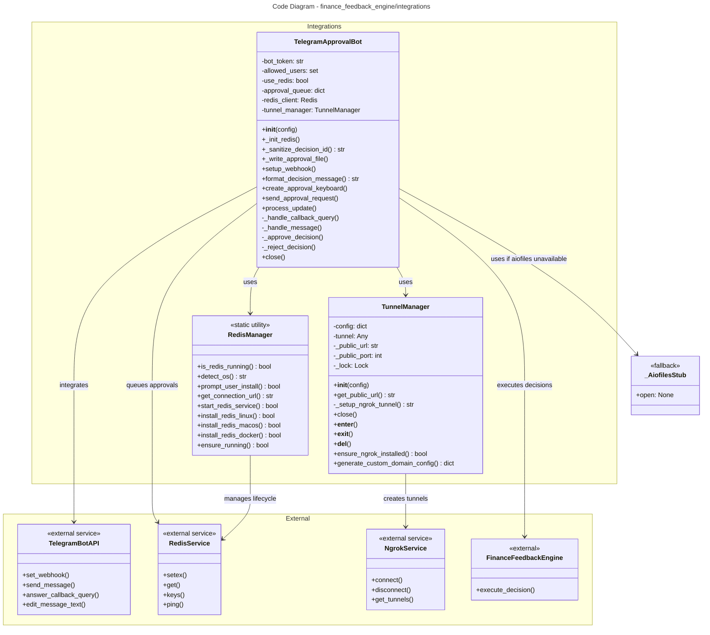

# C4 Code Level: finance_feedback_engine/integrations

## Overview

- **Name**: Integrations Module
- **Description**: External service integrations for trading approvals, webhook tunneling, and distributed caching
- **Location**: `/finance_feedback_engine/integrations/`
- **Language**: Python 3.7+
- **Purpose**: Provides infrastructure for Telegram-based trading decision approval workflows, Redis-backed approval queues, and ngrok tunnel management for webhook exposure in development environments

## Directory Structure

```
finance_feedback_engine/integrations/
├── __init__.py              # Module initialization (exports)
├── redis_manager.py         # Redis installation and lifecycle management
├── telegram_bot.py          # Telegram bot for interactive decision approvals
└── tunnel_manager.py        # ngrok tunnel manager for webhook exposure
```

## Code Elements

### Classes

#### RedisManager
- **Location**: `finance_feedback_engine/integrations/redis_manager.py`
- **Description**: Manages Redis installation, startup, and health checks across multiple operating systems. Provides automated Redis setup with user prompts and intelligent fallback options (Docker, package managers).
- **Scope**: Static utility class for Redis lifecycle management
- **Key Features**:
  - Cross-platform detection (Linux, macOS, Windows)
  - Automated installation via OS-specific package managers (apt-get, Homebrew)
  - Docker fallback for unsupported platforms
  - Health checks and service verification
  - Interactive user prompts with Rich formatting

**Methods**:

- `is_redis_running(password: str = None) -> bool`
  - **Location**: Line 15
  - **Description**: Check if Redis is currently running and accessible
  - **Parameters**:
    - `password` (str, optional): Redis authentication password
  - **Returns**: `bool` - True if Redis is accessible, False otherwise
  - **Dependencies**: `redis` library
  - **Side Effects**: Attempts network connection to Redis

- `detect_os() -> str`
  - **Location**: Line 30
  - **Description**: Detect the operating system type
  - **Parameters**: None
  - **Returns**: `str` - OS name: 'linux', 'darwin' (macOS), 'windows', or 'unknown'
  - **Dependencies**: `platform` standard library

- `prompt_user_install() -> bool`
  - **Location**: Line 44
  - **Description**: Prompt user to install Redis with Rich formatting, fallback to basic input
  - **Parameters**: None
  - **Returns**: `bool` - True if user approves installation, False otherwise
  - **Dependencies**: `rich.prompt.Confirm` (optional), fallback to stdin
  - **User Interaction**: Interactive console prompt

- `get_connection_url(password: str = None) -> str`
  - **Location**: Line 62
  - **Description**: Generate Redis connection URL for use by clients
  - **Parameters**:
    - `password` (str, optional): Redis authentication password
  - **Returns**: `str` - Redis connection URL (redis://localhost:6379 or redis://:password@localhost:6379)
  - **Dependencies**: None
  - **Note**: Test stub method

- `start_redis_service() -> bool`
  - **Location**: Line 70
  - **Description**: Start Redis service using OS-appropriate service management
  - **Parameters**: None
  - **Returns**: `bool` - True if service started successfully, False otherwise
  - **Dependencies**: `subprocess`, OS service manager (systemctl, brew services, etc.)
  - **Side Effects**: Executes system commands via subprocess
  - **Note**: Test stub method

- `install_redis_linux() -> bool`
  - **Location**: Line 85
  - **Description**: Install Redis on Linux using apt-get with comprehensive error handling
  - **Parameters**: None
  - **Returns**: `bool` - True if installation succeeded, False otherwise
  - **Dependencies**:
    - `subprocess` standard library
    - `apt-get` system package manager
    - `systemctl` or `service` command (OS-dependent)
  - **Side Effects**:
    - Executes system commands requiring sudo
    - Modifies system state (installs packages)
    - May prompt for sudo password
  - **Error Handling**: Comprehensive with fallback to alternative service managers
  - **Complexity**: High - handles multiple service manager types, timeout management, logging

- `install_redis_macos() -> bool`
  - **Location**: Line 214
  - **Description**: Install Redis on macOS using Homebrew
  - **Parameters**: None
  - **Returns**: `bool` - True if installation succeeded, False otherwise
  - **Dependencies**:
    - `subprocess` standard library
    - `brew` package manager
  - **Side Effects**:
    - Executes system commands
    - Modifies system state (installs packages, starts service)
  - **Error Handling**: Checks for Homebrew availability before installation

- `install_redis_docker() -> bool`
  - **Location**: Line 247
  - **Description**: Install and start Redis using Docker container (cross-platform fallback)
  - **Parameters**: None
  - **Returns**: `bool` - True if Docker container started successfully, False otherwise
  - **Dependencies**:
    - `subprocess` standard library
    - `docker` command-line tool
    - `redis:alpine` Docker image
  - **Side Effects**:
    - Executes Docker commands
    - Stops and removes existing `ffe-redis` container if present
    - Starts new Redis container with auto-restart policy
  - **Error Handling**: Checks for Docker availability

- `ensure_running(auto_install: bool = True) -> bool` (classmethod)
  - **Location**: Line 295
  - **Description**: Main entry point for ensuring Redis is running with automated installation workflow
  - **Parameters**:
    - `auto_install` (bool, default=True): Whether to prompt for auto-install
  - **Returns**: `bool` - True if Redis is running after this call, False otherwise
  - **Dependencies**: All instance methods above
  - **Workflow**:
    1. Check if Redis already running
    2. If not and auto_install enabled, prompt user
    3. Try OS-specific installation
    4. Fallback to Docker if package manager fails
    5. Verify connection with timeout retries (10 seconds max)
  - **Side Effects**: May trigger system modifications based on user approval
  - **Complexity**: High - orchestrates multiple installation paths

---

#### TelegramApprovalBot
- **Location**: `finance_feedback_engine/integrations/telegram_bot.py`
- **Description**: Telegram bot for interactive trading decision approvals. Manages webhook registration, message formatting, inline keyboards, and approval queue persistence (Redis or in-memory).
- **Scope**: Core component for Telegram integration
- **Key Features**:
  - Webhook-based update handling from Telegram Bot API
  - Inline keyboard UI for Approve/Reject/Modify actions
  - Approval queue persistence (Redis-backed or in-memory fallback)
  - User whitelist authorization
  - Async/await support for long-running operations
  - File-based approval persistence

**Methods**:

- `__init__(config: dict)`
  - **Location**: Line 31
  - **Description**: Initialize Telegram approval bot with configuration
  - **Parameters**:
    - `config` (dict): Telegram configuration containing:
      - `bot_token` (str): Telegram Bot API token
      - `allowed_user_ids` (list): User IDs authorized to approve decisions
      - `use_redis` (bool): Enable Redis approval queue
      - `redis_host` (str, default='localhost'): Redis host
      - `redis_port` (int, default=6379): Redis port
      - `webhook_url` (str, optional): Production webhook URL
      - `ngrok_auth_token` (str, optional): ngrok authentication token
  - **Returns**: None
  - **Side Effects**:
    - Creates Telegram Bot instance
    - Initializes Redis client if enabled
    - Creates TunnelManager instance
  - **Raises**: May raise on invalid configuration

- `_init_redis()`
  - **Location**: Line 64
  - **Description**: Initialize Redis connection for approval queue with fallback to in-memory
  - **Parameters**: None
  - **Returns**: None
  - **Side Effects**:
    - Calls `RedisManager.ensure_running()` with user prompts
    - Creates Redis client connection
    - Modifies `self.use_redis` flag on failure
  - **Error Handling**: Gracefully degrades to in-memory queue on Redis failure

- `_sanitize_decision_id(decision_id: str) -> str` (staticmethod)
  - **Location**: Line 85
  - **Description**: Sanitize decision_id to safe alphanumeric characters for filename use
  - **Parameters**:
    - `decision_id` (str): Raw decision ID (may contain special characters)
  - **Returns**: `str` - Sanitized decision ID safe for filenames
  - **Dependencies**: `re` regular expression module
  - **Security**: Prevents path traversal attacks (../../ sequences)
  - **Edge Cases**:
    - Long underscore runs from path traversal patterns
    - Trailing special characters

- `_write_approval_file(decision_id: str, approval_data: dict, status: str)` (async)
  - **Location**: Line 107
  - **Description**: Write approval/rejection file asynchronously with sanitized filename
  - **Parameters**:
    - `decision_id` (str): Raw decision ID
    - `approval_data` (dict): Approval data to persist (contains decision_id, approved flag, timestamp, source)
    - `status` (str): 'approved' or 'rejected'
  - **Returns**: None (async)
  - **Dependencies**: `aiofiles` for async file I/O
  - **Side Effects**:
    - Creates `data/approvals/` directory if not exists
    - Writes JSON file with format: `{safe_id}_{status}.json`
  - **Raises**: RuntimeError if aiofiles not installed
  - **Persistence**: Files stored at `data/approvals/{decision_id}_approved.json` or `data/approvals/{decision_id}_rejected.json`

- `setup_webhook(public_url: str)` (async)
  - **Location**: Line 127
  - **Description**: Register webhook URL with Telegram Bot API
  - **Parameters**:
    - `public_url` (str): Public HTTPS URL for webhook (e.g., from TunnelManager)
  - **Returns**: None (async)
  - **Side Effects**:
    - Calls Telegram Bot API to set webhook
    - Webhook endpoint: `{public_url}/webhook/telegram`
  - **Raises**: RuntimeError if bot not initialized, other exceptions from Telegram API
  - **Security**: Requires HTTPS URL

- `format_decision_message(decision: Dict[str, Any]) -> str`
  - **Location**: Line 143
  - **Description**: Format trading decision as readable Telegram message with markdown
  - **Parameters**:
    - `decision` (dict): Decision dictionary containing:
      - `asset_pair` (str): Trading pair
      - `action` (str): BUY/SELL/HOLD
      - `confidence` (int): Confidence percentage
      - `position_size` (str/float): Position size
      - `stop_loss` (float): Stop loss percentage
      - `take_profit` (float): Take profit percentage
      - `market_regime` (str): Market condition
      - `sentiment` (dict): Contains `overall_sentiment` field
      - `reasoning` (str): Decision rationale
      - `decision_id` (str): Unique decision identifier
  - **Returns**: `str` - Formatted message with markdown for Telegram
  - **Format**: Multi-line message with emojis and structured fields

- `create_approval_keyboard(decision_id: str)`
  - **Location**: Line 165
  - **Description**: Create inline keyboard with Approve/Reject/Modify buttons
  - **Parameters**:
    - `decision_id` (str): Decision ID for callback data
  - **Returns**: `InlineKeyboardMarkup` object or None if bot not initialized
  - **Dependencies**: `telegram.InlineKeyboardButton`, `telegram.InlineKeyboardMarkup`
  - **Callback Format**:
    - Approve: `approve:{decision_id}`
    - Reject: `reject:{decision_id}`
    - Modify: `modify:{decision_id}`

- `send_approval_request(decision: Dict[str, Any], user_id: int)` (async)
  - **Location**: Line 184
  - **Description**: Send approval request message to Telegram user with inline keyboard
  - **Parameters**:
    - `decision` (dict): Trading decision to request approval for
    - `user_id` (int): Telegram user ID to send message to
  - **Returns**: None (async)
  - **Side Effects**:
    - Sends Telegram message via Bot API
    - Stores decision in approval queue (Redis or in-memory)
  - **Raises**: RuntimeError if bot not initialized, ValueError if decision_id missing
  - **Queue Storage**: Decision stored with 1-hour TTL in Redis or in-memory dict
  - **Error Handling**: Comprehensive error logging

- `process_update(update_data: Dict[str, Any], engine)` (async)
  - **Location**: Line 211
  - **Description**: Process incoming Telegram update from webhook
  - **Parameters**:
    - `update_data` (dict): Raw update data from Telegram Bot API
    - `engine`: FinanceFeedbackEngine instance for decision execution
  - **Returns**: None (async)
  - **Side Effects**:
    - Parses Telegram update
    - Routes to callback query or message handler
  - **Raises**: RuntimeError if bot not initialized
  - **Update Types Handled**:
    - Callback queries (inline button presses)
    - Text messages (commands)

- `_handle_callback_query(query, engine)` (async)
  - **Location**: Line 234
  - **Description**: Handle inline keyboard button presses (approve/reject/modify)
  - **Parameters**:
    - `query`: Telegram CallbackQuery object
    - `engine`: FinanceFeedbackEngine instance
  - **Returns**: None (async)
  - **Authorization**:
    - Checks user_id against whitelist (`self.allowed_users`)
    - Returns "Unauthorized" alert if not in whitelist
  - **Actions**:
    - `approve:{decision_id}`: Calls `_approve_decision()`, executes decision via engine
    - `reject:{decision_id}`: Calls `_reject_decision()`
    - `modify:{decision_id}`: Returns "not implemented" message (future feature)
  - **Side Effects**:
    - Edits original message with approval status
    - Sends alert popups to user
  - **Error Handling**: Catches and logs exceptions, prevents crashes on invalid decisions

- `_handle_message(message)` (async)
  - **Location**: Line 294
  - **Description**: Handle text message commands from users
  - **Parameters**:
    - `message`: Telegram Message object
  - **Returns**: None (async)
  - **Authorization**: Checks user_id against whitelist
  - **Commands**:
    - `/start`: Welcome message
    - `/status`: Returns count of pending approvals (queries Redis or in-memory)
    - Other: Returns "Unknown command" response
  - **Side Effects**: Sends Telegram replies

- `_approve_decision(decision_id: str, engine)` (async)
  - **Location**: Line 320
  - **Description**: Approve and execute a trading decision
  - **Parameters**:
    - `decision_id` (str): Decision ID to approve
    - `engine`: FinanceFeedbackEngine instance
  - **Returns**: None (async)
  - **Side Effects**:
    - Writes approval file via `_write_approval_file()`
    - Calls `engine.execute_decision(decision_id)` to execute trade
    - Logs approval and execution results
  - **Error Handling**: Catches execution errors and logs them
  - **Approval Data**: Includes decision_id, approved flag, timestamp, source='telegram'

- `_reject_decision(decision_id: str)` (async)
  - **Location**: Line 339
  - **Description**: Reject a trading decision without execution
  - **Parameters**:
    - `decision_id` (str): Decision ID to reject
  - **Returns**: None (async)
  - **Side Effects**:
    - Writes rejection file via `_write_approval_file()`
    - Logs rejection
  - **Rejection Data**: Includes decision_id, approved=False, timestamp, source='telegram'

- `close()`
  - **Location**: Line 354
  - **Description**: Cleanup resources and close connections
  - **Parameters**: None
  - **Returns**: None
  - **Side Effects**:
    - Closes TunnelManager (disconnects ngrok tunnel)
    - Closes Redis client connection
  - **Safety**: Safe to call multiple times

---

#### TunnelManager
- **Location**: `finance_feedback_engine/integrations/tunnel_manager.py`
- **Description**: Manages ngrok tunnel for webhook endpoints with custom domain scaffolding. Provides automatic ngrok tunnel setup for development with easy replacement for production domains.
- **Scope**: Infrastructure for webhook URL management
- **Key Features**:
  - Custom domain support (production)
  - Automatic ngrok tunnel setup (development)
  - Idempotent tunnel creation (reuses existing tunnels)
  - Thread-safe operations
  - Context manager support for deterministic cleanup
  - Port tracking for tunnel recreation

**Methods**:

- `__init__(config: dict)`
  - **Location**: Line 24
  - **Description**: Initialize tunnel manager with configuration
  - **Parameters**:
    - `config` (dict): Configuration containing:
      - `webhook_url` (str, optional): Production webhook URL (takes precedence)
      - `ngrok_auth_token` (str, optional): ngrok authentication token
  - **Returns**: None
  - **Side Effects**: Initializes instance variables and threading lock

- `get_public_url(port: int = 8000) -> str`
  - **Location**: Line 38
  - **Description**: Get public URL for webhook, using custom domain or auto-starting ngrok
  - **Parameters**:
    - `port` (int, default=8000): Local port to expose
  - **Returns**: `str` - Public HTTPS URL for webhook registration
  - **Workflow**:
    1. Check for custom `webhook_url` in config (production)
    2. If not configured, call `_setup_ngrok_tunnel(port)` for auto-setup
  - **Side Effects**: May start ngrok tunnel on first call
  - **Thread Safety**: Safe for concurrent calls (uses lock in `_setup_ngrok_tunnel`)

- `_setup_ngrok_tunnel(port: int) -> str`
  - **Location**: Line 59
  - **Description**: Auto-setup ngrok tunnel for local development with idempotent behavior
  - **Parameters**:
    - `port` (int): Local port to tunnel
  - **Returns**: `str` - Public ngrok URL (https://...)
  - **Workflow**:
    1. Acquire thread lock for thread-safety
    2. Check for existing active tunnel:
       - Port mismatch: Disconnect old, create new
       - Port match: Verify tunnel still active, reuse if valid
       - Stale tunnel: Clean up and create new
    3. Initialize pyngrok with auth token if provided
    4. Create ngrok tunnel via `ngrok.connect(port, 'http')`
    5. Cache public URL and port for reuse
  - **Idempotency**: Returns existing tunnel URL if port matches and tunnel active
  - **Error Handling**:
    - ImportError if pyngrok not installed
    - RuntimeError for ngrok setup failures
  - **Side Effects**:
    - Imports pyngrok (may fail if not installed)
    - Creates new ngrok tunnel process
    - Logs warnings about free tier limitations
  - **Port Tracking**: Validates cached tunnel matches requested port
  - **Thread Safety**: Uses `self._lock` to ensure only one tunnel creation at a time

- `close()`
  - **Location**: Line 146
  - **Description**: Close ngrok tunnel if active
  - **Parameters**: None
  - **Returns**: None
  - **Side Effects**:
    - Disconnects ngrok tunnel via `ngrok.disconnect()`
    - Clears cached URL and port
  - **Safety**: Safe to call multiple times, idempotent
  - **Error Handling**: Logs errors but doesn't raise

- `__enter__()`
  - **Location**: Line 157
  - **Description**: Context manager entry
  - **Parameters**: None
  - **Returns**: `self` (TunnelManager instance)
  - **Usage**: `with TunnelManager(config) as tunnel: ...`

- `__exit__(exc_type, exc_val, exc_tb)`
  - **Location**: Line 161
  - **Description**: Context manager exit - ensures cleanup
  - **Parameters**:
    - `exc_type`: Exception type if one occurred in with block
    - `exc_val`: Exception value
    - `exc_tb`: Exception traceback
  - **Returns**: `False` (exceptions not suppressed)
  - **Side Effects**: Calls `close()` to cleanup tunnel
  - **Error Handling**: Catches exceptions during cleanup to avoid masking original exceptions

- `__del__()`
  - **Location**: Line 172
  - **Description**: Fallback cleanup on object deletion
  - **Parameters**: None
  - **Returns**: None
  - **Side Effects**: Calls `close()` when object is garbage collected
  - **Note**: Context manager preferred over relying on this
  - **Error Handling**: Suppresses exceptions to avoid failures during interpreter shutdown

- `get_tunnel_url(port: int = 8000) -> str`
  - **Location**: Line 189
  - **Description**: Alias for `get_public_url()` for test compatibility
  - **Parameters**: Same as `get_public_url`
  - **Returns**: Same as `get_public_url`

- `start_ngrok_tunnel(port: int = 8000) -> str`
  - **Location**: Line 194
  - **Description**: Alias for `_setup_ngrok_tunnel()` for test compatibility
  - **Parameters**: Same as `_setup_ngrok_tunnel`
  - **Returns**: Same as `_setup_ngrok_tunnel`

- `stop_tunnel()`
  - **Location**: Line 199
  - **Description**: Alias for `close()` for test compatibility
  - **Parameters**: None
  - **Returns**: None

- `ensure_ngrok_installed() -> bool`
  - **Location**: Line 203
  - **Description**: Check if pyngrok is installed
  - **Parameters**: None
  - **Returns**: `bool` - True if pyngrok importable, False otherwise
  - **Dependencies**: `pyngrok` package
  - **Note**: Test stub method

- `generate_custom_domain_config() -> dict`
  - **Location**: Line 211
  - **Description**: Generate scaffold configuration for custom domain setup
  - **Parameters**: None
  - **Returns**: `dict` - Example configuration with comments
  - **Output Format**:
    ```python
    {
        'webhook_url': 'https://example.com',
        'ngrok_auth_token': None,
        'note': 'Replace with your actual domain'
    }
    ```
  - **Note**: Test stub method, used for generating configuration templates

---

### Module-Level Functions

#### init_telegram_bot()
- **Location**: `finance_feedback_engine/integrations/telegram_bot.py`, Line 364
- **Signature**: `init_telegram_bot(config: dict) -> Optional[TelegramApprovalBot]`
- **Description**: Initialize global Telegram bot instance with configuration validation
- **Parameters**:
  - `config` (dict): Telegram configuration containing `enabled`, `bot_token`, etc.
- **Returns**:
  - `TelegramApprovalBot` instance if successfully initialized
  - `None` if bot disabled or initialization failed
- **Workflow**:
  1. Check if `config.get('enabled')` is True
  2. Validate `bot_token` is configured
  3. Create and store TelegramApprovalBot instance globally
  4. Return instance or None
- **Side Effects**:
  - Creates global `telegram_bot` variable
  - May start Redis if enabled
  - May start ngrok tunnel
- **Error Handling**: Logs warnings/errors but returns None on failures

---

### Module-Level Variables

- **logger**: Python logging.Logger instance for module-level logging
- **telegram_bot**: Global `Optional[TelegramApprovalBot]` instance (initialized by `init_telegram_bot()`)
- **_AiofilesStub**: Fallback class used if `aiofiles` library not installed (only has `open = None` attribute)

---

## Dependencies

### Internal Dependencies

- **Other Finance Feedback Engine Modules**:
  - `finance_feedback_engine.core`: FinanceFeedbackEngine for decision execution (used in TelegramApprovalBot)
  - Implicitly referenced but imported dynamically as needed

### External Dependencies

#### Required Dependencies
- **python-telegram-bot** (`telegram`): Telegram Bot API client library
  - Used for: Bot instance creation, message sending, webhook setup, update parsing
  - Version: Typically 13.x or later
  - Import: Dynamic check in `TelegramApprovalBot.__init__()` and method calls

#### Optional Dependencies
- **redis** (`redis`): Redis client library
  - Used for: Approval queue persistence in RedisManager and TelegramApprovalBot
  - Purpose: Distributed approval queue with TTL support
  - Import: Dynamic check in `_init_redis()`
  - Fallback: In-memory dictionary if unavailable

- **aiofiles** (`aiofiles`): Async file I/O library
  - Used for: Asynchronous file writes in `_write_approval_file()`
  - Purpose: Non-blocking file operations
  - Import: Try/except at module level with stub fallback
  - Fallback: Raises RuntimeError if used without installation

- **pyngrok** (`pyngrok`): Python wrapper for ngrok
  - Used for: Creating ngrok tunnels in TunnelManager
  - Purpose: Exposing local webhooks via public HTTPS URLs
  - Import: Dynamic check in `_setup_ngrok_tunnel()`
  - Fallback: Raises RuntimeError if used without installation

#### Standard Library Dependencies
- **logging**: Module-level logging
- **platform**: OS detection in RedisManager
- **subprocess**: System command execution for Redis installation and ngrok management
- **time**: Sleep delays for Redis startup verification
- **os**: Environment variable reading (ngrok auth token)
- **threading**: Lock-based thread safety in TunnelManager
- **datetime**: Timestamp generation in approval records
- **pathlib**: Path manipulation for approval file directory
- **typing**: Type hints (Any, Dict, Optional)
- **re**: Regular expression sanitization

### System Dependencies
- **Linux**: apt-get package manager, systemd/systemctl or service command
- **macOS**: Homebrew (brew) package manager
- **All Platforms**: Docker (optional fallback for Redis)

### Environment Variables
- **NGROK_AUTHTOKEN**: ngrok authentication token (checked if `ngrok_auth_token` not in config)

### Configuration Requirements

The integrations module requires configuration dictionary with:

```python
{
    # Telegram Bot Configuration
    'telegram': {
        'enabled': bool,
        'bot_token': str,  # Telegram Bot API token
        'allowed_user_ids': List[int],  # Authorized users
        'use_redis': bool,  # Enable Redis approval queue
        'redis_host': str,  # Default: 'localhost'
        'redis_port': int,  # Default: 6379
        'webhook_url': str,  # Production URL (optional, uses ngrok if not set)
        'ngrok_auth_token': str,  # ngrok auth token (optional)
    }
}
```

---

## Code Relationships

### Class Relationships

```
TelegramApprovalBot
├── depends on: RedisManager (for approval queue)
├── depends on: TunnelManager (for webhook URL)
└── integrates with: Telegram Bot API

RedisManager
└── provides Redis lifecycle management (standalone utility)

TunnelManager
├── provides ngrok tunnel management (standalone utility)
└── integrates with: ngrok service

FinanceFeedbackEngine (external)
└── called by: TelegramApprovalBot._approve_decision()
```

### Data Flow

```
Telegram User
    |
    v
Telegram Bot API
    |
    v
TelegramApprovalBot.process_update()
    |
    +---> _handle_callback_query() (button presses)
    |         |
    |         v
    |     _approve_decision() / _reject_decision()
    |         |
    |         +---> _write_approval_file()
    |         |
    |         +---> engine.execute_decision() [if approved]
    |
    +---> _handle_message() (commands)
              |
              +---> /start, /status, etc.
```

### Configuration Flow

```
Config Dict
    |
    +---> TelegramApprovalBot.__init__()
    |         |
    |         +---> TunnelManager.__init__()
    |         |
    |         +---> _init_redis()
    |                   |
    |                   +---> RedisManager.ensure_running()
    |
    +---> init_telegram_bot()
              |
              +---> TelegramApprovalBot instance
```

---

## Workflow Examples

### Approval Queue Setup

1. **Initialization**:
   ```
   init_telegram_bot(config)
   -> TelegramApprovalBot.__init__(config)
      -> _init_redis()
         -> RedisManager.ensure_running()
            -> [OS-specific installation if needed]
            -> Redis client connection established
   ```

2. **Webhook Registration**:
   ```
   setup_webhook(public_url)
   -> TunnelManager.get_public_url()
      -> [Check custom URL or start ngrok]
   -> bot.set_webhook(url)
   ```

3. **Receiving Approval Request**:
   ```
   send_approval_request(decision, user_id)
   -> format_decision_message(decision)
   -> create_approval_keyboard(decision_id)
   -> bot.send_message() [Telegram API]
   -> Store decision in approval_queue [Redis or in-memory]
   ```

4. **User Approves/Rejects**:
   ```
   Telegram user clicks button
   -> Telegram API sends callback_query
   -> TelegramApprovalBot.process_update()
      -> _handle_callback_query()
         -> Authorization check (whitelist)
         -> _approve_decision() / _reject_decision()
            -> _write_approval_file()
            -> [if approved] engine.execute_decision()
   ```

---

## Error Handling Patterns

### Redis Setup
- **Missing**: User prompted for installation
- **Installation fails**: Graceful fallback to in-memory queue
- **Connection fails**: Falls back to in-memory dictionary
- **Query fails**: Silently handles, returns empty list

### Telegram Bot
- **Bot token missing**: Initialization returns None, bot disabled
- **python-telegram-bot not installed**: Error logged, bot operations fail gracefully
- **API errors**: Logged and raised to caller
- **Unauthorized user**: Returns alert, logs warning, prevents action

### ngrok Tunnel
- **pyngrok not installed**: Raises RuntimeError with installation instructions
- **Docker fallback available**: Falls back to Docker if available
- **Auth token missing**: Warns about free tier limitations
- **Connection fails**: Raises RuntimeError

### Redis Installation
- **Package manager not found**: Tries alternative managers, falls back to Docker
- **Service management varies**: Handles both systemd and SysVinit
- **Timeout during installation**: Caught and logged, doesn't block

---

## Security Considerations

### Authentication & Authorization
- **User Whitelist**: `TelegramApprovalBot.allowed_users` restricts who can approve decisions
- **Callback Query Validation**: User ID checked before any action
- **Telegram Bot Token**: Kept in configuration, not hardcoded

### Data Safety
- **Decision ID Sanitization**: Prevents path traversal attacks (../../ patterns)
- **File Permissions**: Approval files stored in dedicated directory
- **Approval File Format**: JSON with timestamp for audit trail

### Network Security
- **Webhook HTTPS**: Telegram requires HTTPS for webhooks (enforced by telegram-bot-api)
- **Custom Domains**: Supports production domain setup with proper certificates
- **ngrok**: Free tier warnings logged, token-based auth supported

### System Security
- **Subprocess Isolation**: System commands executed with proper error handling
- **Sudo Prompts**: Requests made transparently for package installation
- **Service Management**: Uses standard OS mechanisms (systemd, brew services)
- **Docker Fallback**: Uses official redis:alpine image

---

## Testing Considerations

### Stub Methods for Testing
- `RedisManager.get_connection_url()`: Test stub
- `RedisManager.start_redis_service()`: Test stub
- `TunnelManager.get_tunnel_url()`: Alias for testing
- `TunnelManager.start_ngrok_tunnel()`: Alias for testing
- `TunnelManager.stop_tunnel()`: Alias for testing
- `TunnelManager.ensure_ngrok_installed()`: Check method
- `TunnelManager.generate_custom_domain_config()`: Config generation for tests

### Mock Points for Unit Tests
- Telegram Bot API calls (send_message, set_webhook, etc.)
- Redis client connections (ping, setex, keys)
- Subprocess calls (apt-get, brew, docker, systemctl)
- ngrok tunnel connections (ngrok.connect, ngrok.disconnect)
- File I/O operations (aiofiles.open)
- Environment variables (NGROK_AUTHTOKEN)

### Integration Test Scenarios
1. End-to-end Telegram approval workflow (with mocked Telegram API)
2. Redis fallback from in-memory queue
3. OS-specific Redis installation (Linux, macOS, Docker)
4. ngrok tunnel setup with port changes
5. Decision approval and rejection persistence
6. Webhook setup and registration
7. User authorization and whitelist enforcement

---

## Performance & Scalability

### Concurrency
- **Thread-Safe**: TunnelManager uses locks for concurrent access
- **Async Support**: TelegramApprovalBot methods are async/await compatible
- **Approval Queue**: Redis backed for distributed systems, in-memory fallback for single-process

### Resource Management
- **Redis TTL**: Approval decisions expire after 1 hour (3600 seconds)
- **ngrok Connection Pooling**: Single tunnel reused across requests
- **Subprocess Timeouts**: All system commands have 5-300 second timeouts

### Scalability Limitations
- **In-Memory Queue**: Single process only, loses data on restart
- **File-Based Persistence**: Each approval creates a separate file
- **ngrok Free Tier**: 40 req/min, 20 concurrent connections limit

---

## Module Initialization

The integrations module is typically initialized via:

```python
# In main application
from finance_feedback_engine.integrations import init_telegram_bot

config = load_config()
telegram_bot = init_telegram_bot(config.get('telegram', {}))

if telegram_bot:
    # Setup webhook and register routes
    public_url = telegram_bot.tunnel_manager.get_public_url(port=8000)
    await telegram_bot.setup_webhook(public_url)
```

---

## Notes & Best Practices

1. **Redis Installation**: Automatic installation requires sudo password entry or Docker availability
2. **Telegram Token Security**: Store `bot_token` securely, never commit to version control
3. **Webhook URL Stability**: Custom domain recommended for production (ngrok URLs change on restart)
4. **Authorization**: Always verify `allowed_user_ids` are set correctly before enabling approvals
5. **Error Recovery**: Telegram bot gracefully continues without Redis if setup fails
6. **Port Conflicts**: ngrok tunnel automatically recreates if requested port changes
7. **File Cleanup**: Approval files in `data/approvals/` should be archived/cleaned periodically
8. **Async Patterns**: All Telegram API calls are async; use `await` or event loop appropriately

---

## File Organization

```
finance_feedback_engine/integrations/
├── __init__.py                  # Module initialization
│   └── exports: [TelegramApprovalBot, RedisManager, TunnelManager, init_telegram_bot]
│
├── redis_manager.py             # Redis lifecycle management (380 lines)
│   ├── RedisManager class       # Static utility for Redis setup
│   │   ├── is_redis_running()
│   │   ├── detect_os()
│   │   ├── prompt_user_install()
│   │   ├── get_connection_url()
│   │   ├── start_redis_service()
│   │   ├── install_redis_linux()      # Comprehensive systemd/SysVinit support
│   │   ├── install_redis_macos()      # Homebrew integration
│   │   ├── install_redis_docker()     # Docker fallback
│   │   └── ensure_running()           # Main orchestration method
│
├── telegram_bot.py              # Telegram bot for approvals (450 lines)
│   ├── _AiofilesStub class      # Fallback for missing aiofiles
│   ├── TelegramApprovalBot class # Main bot implementation
│   │   ├── __init__()
│   │   ├── _init_redis()
│   │   ├── _sanitize_decision_id()
│   │   ├── _write_approval_file()
│   │   ├── setup_webhook()
│   │   ├── format_decision_message()
│   │   ├── create_approval_keyboard()
│   │   ├── send_approval_request()
│   │   ├── process_update()
│   │   ├── _handle_callback_query()
│   │   ├── _handle_message()
│   │   ├── _approve_decision()
│   │   ├── _reject_decision()
│   │   └── close()
│   └── init_telegram_bot()      # Module initialization function
│
└── tunnel_manager.py            # ngrok tunnel management (220 lines)
    └── TunnelManager class      # Webhook URL management
        ├── __init__()
        ├── get_public_url()
        ├── _setup_ngrok_tunnel()
        ├── close()
        ├── __enter__() / __exit__() # Context manager
        ├── __del__()
        ├── get_tunnel_url()         # Test alias
        ├── start_ngrok_tunnel()     # Test alias
        ├── stop_tunnel()            # Test alias
        ├── ensure_ngrok_installed() # Test stub
        └── generate_custom_domain_config() # Config template
```

Total Lines of Code: ~1,050 lines across 3 modules + __init__.py

---

## Key Design Patterns

### 1. Graceful Degradation
- Redis optional: Falls back to in-memory queue
- Custom domain optional: Falls back to ngrok
- aiofiles optional: Raises RuntimeError when needed
- Installation prompts: Can be disabled with `auto_install=False`

### 2. Lazy Initialization
- Dependencies imported dynamically (`import redis`, `from telegram import Bot`, etc.)
- Allows partial functionality if dependencies unavailable
- Enables testing without all optional dependencies

### 3. Idempotent Operations
- `TunnelManager.get_public_url()`: Reuses existing tunnel if port matches
- `RedisManager.ensure_running()`: No-op if Redis already running
- `TunnelManager._setup_ngrok_tunnel()`: Validates existing tunnel before creating new

### 4. Context Manager Pattern
- `TunnelManager.__enter__()` / `__exit__()`: Deterministic resource cleanup
- Recommended over manual `close()` calls
- Fallback `__del__()` for safety

### 5. Async/Await Support
- All Telegram API calls are async
- Telegram update processing is async
- File writes are async via aiofiles
- Caller responsible for proper event loop

### 6. Configuration Validation
- Config dictionaries with defaults
- Missing required fields logged as warnings
- Initialization returns None on validation failure

---

## Mermaid Relationship Diagram



---
