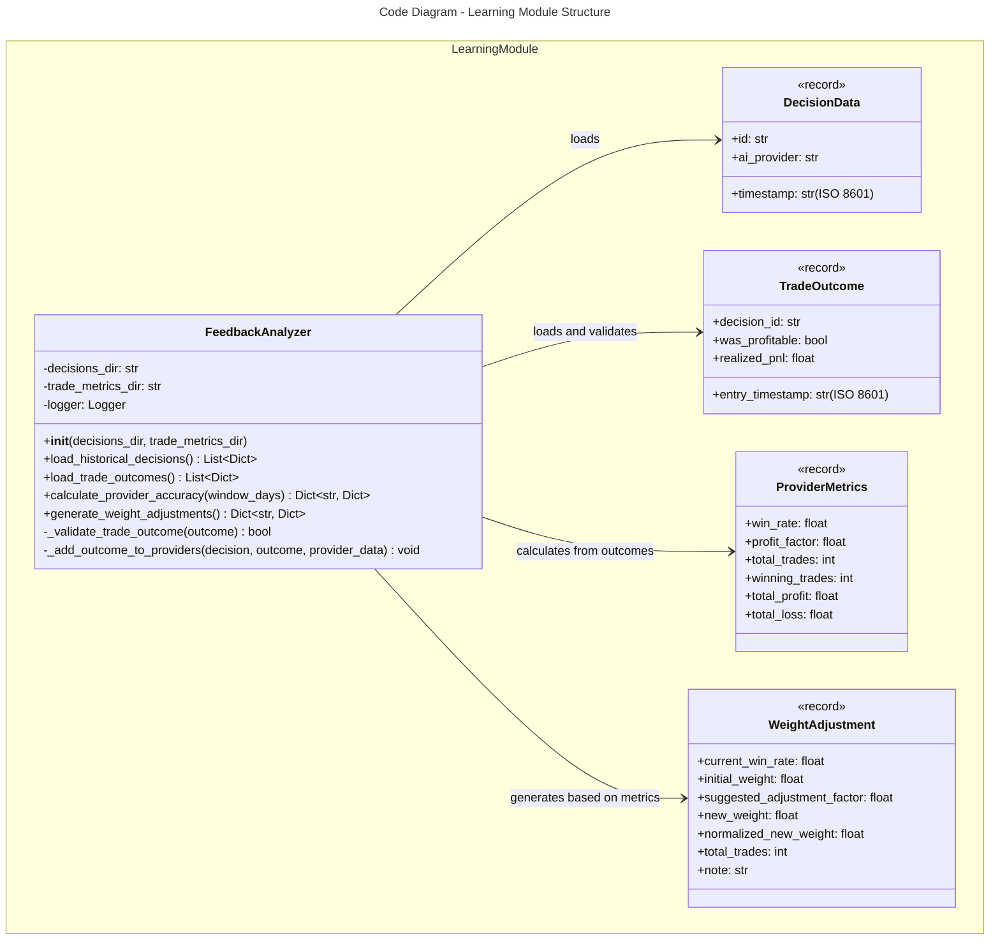
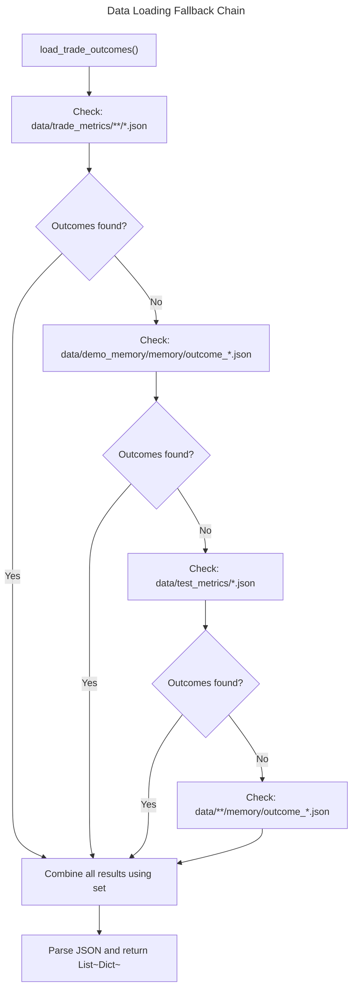

# C4 Code Level: Learning Module

## Overview

- **Name**: Learning Module - Feedback Analyzer
- **Description**: Analyzes historical trading decisions and outcomes to provide feedback for the agentic learning loop. Calculates provider accuracy metrics and generates weight adjustments for AI providers.
- **Location**: `finance_feedback_engine/learning/`
- **Language**: Python 3.x
- **Purpose**: Enable the finance feedback engine to learn from historical trade performance by analyzing decision-outcome pairs, calculating provider accuracy metrics (win rates and profit factors), and generating dynamic weight adjustments for AI providers used in the ensemble model.

## Code Elements

### Module: `__init__.py`

**Location**: `finance_feedback_engine/learning/__init__.py` (lines 1-5)

**Description**: Module initialization that exports the learning module documentation.

**Content**:
```python
"""
Learning module for the finance feedback engine.
Contains classes for analyzing historical performance and providing feedback.
"""
```

### Class: `FeedbackAnalyzer`

**Location**: `finance_feedback_engine/learning/feedback_analyzer.py` (lines 10-333)

**Description**: Main class that analyzes historical trading decisions and outcomes to provide feedback for the agentic loop. Calculates provider accuracy metrics and suggests weight adjustments for different AI providers (gemini, llama3.2, qwen, ensemble).

**Attributes**:
- `decisions_dir: str` - Directory path containing historical decision files (default: "data/decisions/")
- `trade_metrics_dir: str` - Directory path containing trade outcome files (default: "data/trade_metrics/")
- `logger: logging.Logger` - Logger instance for tracking analysis operations

#### Method: `__init__`

**Signature**: `__init__(self, decisions_dir: str = "data/decisions/", trade_metrics_dir: str = "data/trade_metrics/") -> None`

**Location**: `finance_feedback_engine/learning/feedback_analyzer.py` (lines 17-41)

**Description**: Initialize the FeedbackAnalyzer with paths to decision and trade metric data directories. Sets up logging with a StreamHandler configured with ISO format timestamps.

**Parameters**:
- `decisions_dir: str` - Directory containing historical decision JSON files (default: "data/decisions/")
- `trade_metrics_dir: str` - Directory containing trade outcome JSON files (default: "data/trade_metrics/")

**Returns**: None

**Dependencies**:
- `logging` module
- `logging.StreamHandler`
- `logging.Formatter`

#### Method: `load_historical_decisions`

**Signature**: `load_historical_decisions(self) -> List[Dict]`

**Location**: `finance_feedback_engine/learning/feedback_analyzer.py` (lines 43-63)

**Description**: Load historical trading decisions from the decisions directory. Uses glob pattern matching to find all JSON files recursively and parses them into a list of decision dictionaries.

**Parameters**: None (instance method, uses `self.decisions_dir`)

**Returns**: `List[Dict]` - List of decision dictionaries parsed from JSON files

**Dependencies**:
- `glob` module - for file pattern matching
- `json` module - for JSON parsing
- `os` module - for path operations

**Error Handling**: Logs warnings for individual files that fail to load but continues processing other files.

#### Method: `load_trade_outcomes`

**Signature**: `load_trade_outcomes(self) -> List[Dict]`

**Location**: `finance_feedback_engine/learning/feedback_analyzer.py` (lines 65-105)

**Description**: Load trade outcomes from multiple possible locations within the data directory structure. Implements a fallback search strategy checking multiple directories (trade_metrics, demo_memory, test_metrics, and any memory subdirectories). Combines results from all locations using a set to avoid duplicates.

**Parameters**: None (instance method)

**Returns**: `List[Dict]` - List of trade outcome dictionaries parsed from JSON files

**Search Locations** (in priority order):
1. `data/trade_metrics/**/*.json` (from `trade_metrics_dir`)
2. `data/demo_memory/memory/outcome_*.json`
3. `data/test_metrics/*.json`
4. `data/**/memory/outcome_*.json` (recursive search in all memory subdirectories)

**Dependencies**:
- `glob` module - for file pattern matching with recursive search
- `json` module - for JSON parsing
- `os` module - for path operations

**Error Handling**: Logs warnings for individual files that fail to load but continues processing other files.

#### Method: `calculate_provider_accuracy`

**Signature**: `calculate_provider_accuracy(self, window_days: int = 30) -> Dict[str, Dict]`

**Location**: `finance_feedback_engine/learning/feedback_analyzer.py` (lines 107-232)

**Description**: Calculate performance metrics (Win Rate and Profit Factor) for each AI provider based on historical trades within a specified time window. Matches decisions to outcomes using decision IDs, filters by timestamp, and computes aggregated performance statistics.

**Parameters**:
- `window_days: int` - Number of days to look back for analysis (default: 30)

**Returns**: `Dict[str, Dict]` - Dictionary with provider names as keys and performance metrics as values

**Return Value Structure**:
```python
{
    "provider_name": {
        "win_rate": float,              # Proportion of profitable trades (0.0-1.0)
        "profit_factor": float,         # Ratio of total profit to total loss
        "total_trades": int,            # Total number of trades analyzed
        "winning_trades": int,          # Count of profitable trades
        "total_profit": float,          # Sum of all gains
        "total_loss": float,            # Sum of all losses (absolute value)
    }
}
```

**Processing Logic**:
1. Loads historical decisions and trade outcomes
2. Creates outcome map using decision_id for quick matching
3. Groups outcomes by provider (gemini, llama3.2, qwen, ensemble)
4. Filters decisions by timestamp (window_days lookback from now)
5. Validates trade outcomes have required fields
6. Calculates win rates and profit factors for each provider

**Supported Providers**: "gemini", "llama3.2", "qwen", "ensemble"

**Dependencies**:
- `self.load_historical_decisions()` - loads decision data
- `self.load_trade_outcomes()` - loads outcome data
- `self._validate_trade_outcome()` - validates outcome structure
- `self._add_outcome_to_providers()` - populates provider data
- `datetime` module - for timestamp handling and filtering
- `timedelta` class - for calculating cutoff dates
- `defaultdict` from `collections` - for grouping outcomes by provider

**Error Handling**:
- Logs warnings for invalid outcomes and skips them
- Handles timestamp parsing failures by attempting fallback parsing from outcome data
- Returns empty dictionary if no providers found

#### Method: `generate_weight_adjustments`

**Signature**: `generate_weight_adjustments(self) -> Dict[str, Dict]`

**Location**: `finance_feedback_engine/learning/feedback_analyzer.py` (lines 261-332)

**Description**: Generate dynamic weight adjustments for AI providers based on their calculated performance metrics. Uses a tiered adjustment strategy based on win rate thresholds and normalizes weights to sum to 1.0.

**Parameters**: None (instance method)

**Returns**: `Dict[str, Dict]` - Dictionary containing weight adjustment information for each provider

**Return Value Structure**:
```python
{
    "provider_name": {
        "current_win_rate": float,              # Current win rate (0.0-1.0)
        "initial_weight": float,                # Starting weight (1/n for n providers)
        "suggested_adjustment_factor": float,   # Multiplier (0.5, 1.0, or 1.5)
        "new_weight": float,                    # Unadjusted new weight
        "normalized_new_weight": float,         # Normalized weight (sums to 1.0)
        "total_trades": int,                    # Trade count for this provider
        "note": str,                            # Human-readable performance description
    }
}
```

**Weight Adjustment Strategy**:
- **High Performer** (win_rate > 60%): `adjustment_factor = 1.5` (increase by 50%)
- **Average Performer** (45% ≤ win_rate ≤ 60%): `adjustment_factor = 1.0` (maintain)
- **Low Performer** (win_rate < 45%): `adjustment_factor = 0.5` (decrease by 50%)

**Processing Steps**:
1. Calls `calculate_provider_accuracy(window_days=30)` to get performance metrics
2. Returns empty dict if no providers found in metrics
3. Creates initial equal weights (1/n for n providers)
4. For each provider, calculates adjustment factor based on win rate
5. Applies adjustment factor to initial weight
6. Normalizes all weights so they sum to 1.0
7. Includes explanatory notes for human interpretation

**Dependencies**:
- `self.calculate_provider_accuracy()` - retrieves performance metrics
- No external library dependencies beyond logging

#### Method: `_validate_trade_outcome` (Private)

**Signature**: `_validate_trade_outcome(self, outcome: Dict) -> bool`

**Location**: `finance_feedback_engine/learning/feedback_analyzer.py` (lines 234-248)

**Description**: Validate that a trade outcome dictionary has all required fields for analysis. Checks for the presence of critical keys needed to calculate performance metrics.

**Parameters**:
- `outcome: Dict` - Trade outcome dictionary to validate

**Returns**: `bool` - True if outcome has all required fields, False otherwise

**Required Fields**:
- `"decision_id"` - Identifier linking outcome to decision
- `"was_profitable"` - Boolean indicating if trade was profitable
- `"realized_pnl"` - Float representing realized profit/loss amount

**Dependencies**: None

#### Method: `_add_outcome_to_providers` (Private)

**Signature**: `_add_outcome_to_providers(self, decision: Dict, outcome: Dict, provider_data: Dict) -> None`

**Location**: `finance_feedback_engine/learning/feedback_analyzer.py` (lines 250-259)

**Description**: Extract the AI provider name from a decision and add the corresponding outcome to the provider's data accumulator. Acts as a dispatcher routing outcomes to their respective provider buckets.

**Parameters**:
- `decision: Dict` - Trading decision dictionary containing `"ai_provider"` field
- `outcome: Dict` - Trade outcome to be assigned to provider
- `provider_data: Dict` - Mutable dictionary mapping provider names to outcome lists (modified in place)

**Returns**: None (modifies `provider_data` in place)

**Provider Handling**:
- Recognized providers: "gemini", "llama3.2", "qwen", "ensemble"
- Unknown providers: silently ignored
- Uses direct key access with defaultdict to accumulate outcomes per provider

**Dependencies**: None

## Dependencies

### Internal Dependencies

These are dependencies within the `finance_feedback_engine` codebase:

- **Data files** (external to this module but referenced):
  - Historical decision files in JSON format (from `data/decisions/` directory)
  - Trade outcome files in JSON format (from `data/trade_metrics/`, `data/demo_memory/memory/`, `data/test_metrics/`, or `data/**/memory/` directories)

### External Dependencies

- **Python Standard Library**:
  - `glob` (v3.x) - File pattern matching with recursive search support
  - `json` (v3.x) - JSON file parsing and serialization
  - `logging` (v3.x) - Logging configuration and execution tracking
  - `os` (v3.x) - Operating system path operations
  - `collections.defaultdict` (v3.x) - Dictionary with default value factory
  - `datetime.datetime` (v3.x) - ISO 8601 timestamp parsing and filtering
  - `datetime.timedelta` (v3.x) - Time duration calculations

### No External Package Dependencies

This module uses only Python standard library packages. There are no third-party package dependencies (no pip/requirements.txt entries needed).

## Relationships

### Data Flow Architecture

The `FeedbackAnalyzer` class implements a feedback loop analysis system with the following data transformations:

```
Historical Decisions (JSON) --> load_historical_decisions() ----\
                                                                  |
Trade Outcomes (JSON) ---------> load_trade_outcomes() ---------> calculate_provider_accuracy()
                                                                  |
                                                                  v
                                                    Provider Performance Metrics
                                                                  |
                                                                  |
                                                                  v
                                                   generate_weight_adjustments()
                                                                  |
                                                                  v
                                                       Weight Adjustment Suggestions
```

### Code Diagram: FeedbackAnalyzer Module Structure



### Provider Analysis Pipeline

The module processes data through distinct analysis stages:

1. **Data Loading Stage**:
   - `load_historical_decisions()` reads decision files from configured directory
   - `load_trade_outcomes()` reads outcome files from multiple fallback locations

2. **Matching Stage**:
   - Creates decision-to-outcome mapping using `decision_id`
   - Filters by timestamp window (default 30 days)
   - Validates outcome structure with `_validate_trade_outcome()`

3. **Grouping Stage**:
   - Routes outcomes to providers via `_add_outcome_to_providers()`
   - Accumulates outcomes per provider (gemini, llama3.2, qwen, ensemble)

4. **Calculation Stage**:
   - Computes win rates for each provider
   - Computes profit factors for each provider
   - Returns aggregated metrics

5. **Adjustment Generation Stage**:
   - Applies tiered adjustment strategy based on win rate thresholds
   - Normalizes weights to sum to 1.0
   - Generates human-readable performance notes

### File and Directory Interactions



### Temporal Analysis Window

The `calculate_provider_accuracy()` method implements a rolling time window for analysis:

```
Now - 30 days                     Now
|                                 |
[====== Analysis Window ==========]
     ^                         ^
     |                         |
Cutoff Date              Current Time

Processing steps:
1. Calculate cutoff_date = now - timedelta(days=window_days)
2. For each decision:
   - Parse timestamp
   - Check: decision_time >= cutoff_date
   - Include only if within window
```

## Implementation Notes

### JSON Data Format Assumptions

**Decision File Structure** (expected format):
```json
{
  "id": "decision_uuid",
  "timestamp": "2024-12-29T10:30:45Z",
  "ai_provider": "gemini|llama3.2|qwen|ensemble",
  "...": "other decision fields"
}
```

**Trade Outcome File Structure** (expected format):
```json
{
  "decision_id": "decision_uuid",
  "entry_timestamp": "2024-12-29T10:30:45Z",
  "was_profitable": true|false,
  "realized_pnl": 150.75,
  "...": "other outcome fields"
}
```

### Performance Metric Calculations

**Win Rate**: `winning_trades / total_trades`
- Ratio of trades marked as profitable (was_profitable=true) to total trades
- Returns 0 if no trades recorded

**Profit Factor**: `total_profit / total_loss`
- Ratio of sum of gains to sum of losses
- Returns `inf` if profitable with no losses
- Returns 0 if no profitable trades

**Loss Calculation**: Uses absolute value of realized_pnl when negative

### Weight Normalization

Final weights are normalized using the formula:
```
normalized_weight = new_weight / sum(all_new_weights)
```

This ensures weights always sum to 1.0 (or exactly to the total of all weights before normalization).

### Logging Strategy

The class uses Python's standard logging module configured with:
- **Logger Name**: Module name (`__name__`)
- **Level**: INFO level and above
- **Handler**: StreamHandler outputting to console
- **Format**: ISO timestamp, logger name, log level, message

Logged operations:
- Calculation start (with window_days)
- Invalid outcome warnings
- Weight adjustment generation
- Provider discovery completion

### Error Resilience

The implementation prioritizes resilience through:
- **Non-fatal errors**: File loading failures log warnings but don't halt processing
- **Fallback locations**: Multiple directory paths checked for outcome files
- **Flexible timestamp parsing**: Attempts decision timestamp, then outcome timestamp
- **Lenient validation**: Skips invalid outcomes rather than raising exceptions

## Metrics Reference

### Win Rate Thresholds

Used in `generate_weight_adjustments()` for adjustment factor determination:

| Win Rate Range | Classification | Adjustment Factor | Change |
|---|---|---|---|
| > 60% | High Performer | 1.5 | +50% |
| 45% - 60% | Average Performer | 1.0 | Maintain |
| < 45% | Low Performer | 0.5 | -50% |

### Profit Factor Interpretation

- **> 1.0**: More profit than loss (profitable provider)
- **= 1.0**: Profit equals loss (break-even provider)
- **0 to 1.0**: More loss than profit (unprofitable provider)
- **0**: All unprofitable trades, no gains
- **inf**: All profitable trades, no losses

## Summary

The Learning Module provides the analytical foundation for the finance feedback engine's agentic loop. By systematically analyzing historical trading decisions paired with their outcomes, the `FeedbackAnalyzer` class enables:

1. **Provider Performance Evaluation**: Quantitative metrics (win rate, profit factor) for each AI provider
2. **Dynamic Weight Adjustment**: Automated suggestions for increasing/decreasing reliance on specific providers
3. **Historical Feedback**: Closure of the agentic loop by learning from past decisions
4. **Ensemble Optimization**: Data-driven approach to managing ensemble member weighting

The implementation is resilient to data format variations, handles missing data gracefully, and provides comprehensive logging for operational visibility.
