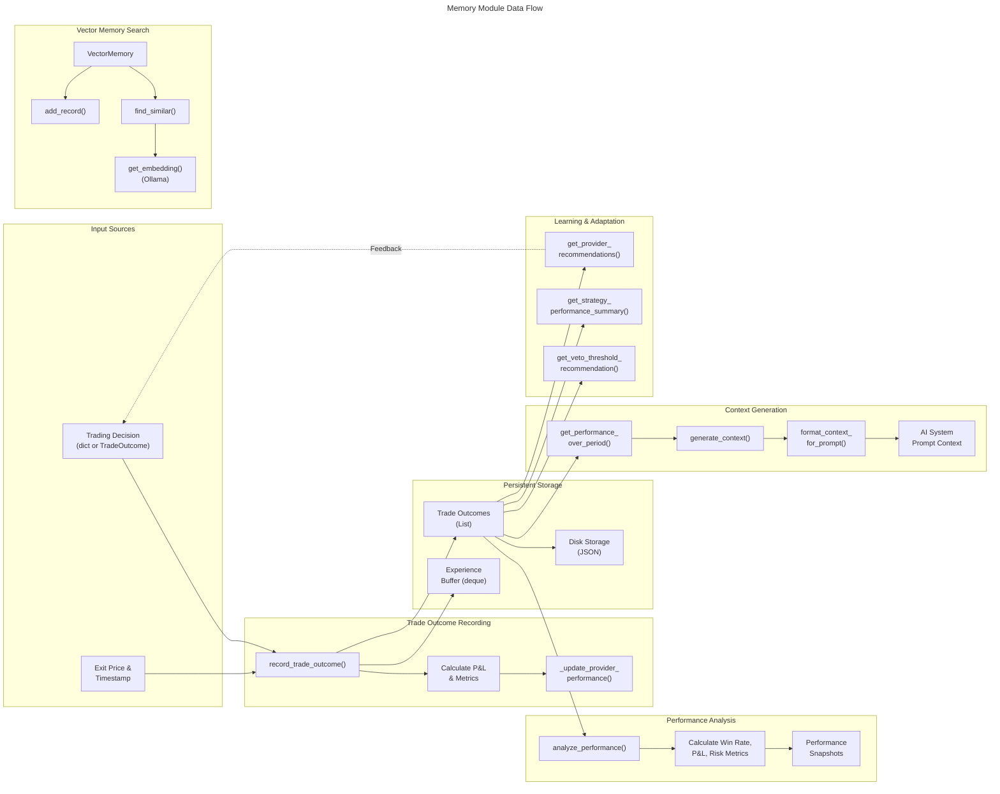
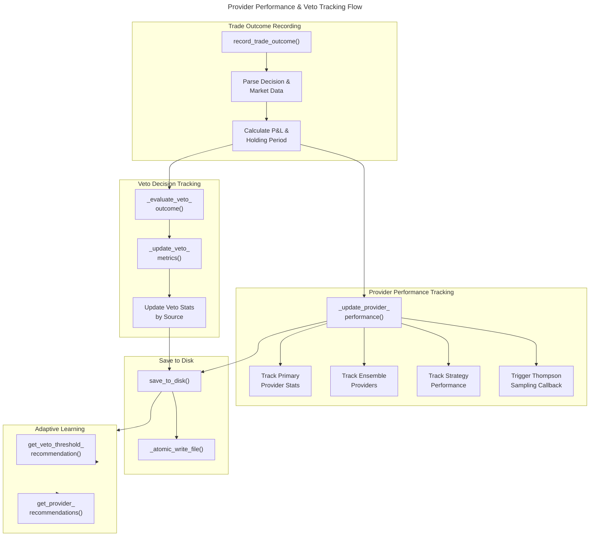
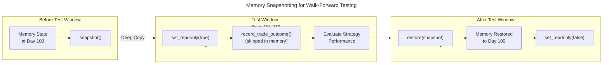

# C4 Code Level: Finance Feedback Engine - Memory Module

## Overview

- **Name**: Portfolio Memory and Vector Store System
- **Description**: Reinforcement learning-based memory system that tracks trade outcomes, analyzes performance attribution, stores learning experiences, and feeds performance context back into AI decision-making. Includes vector-based semantic search capabilities using Ollama embeddings.
- **Location**: `finance_feedback_engine/memory/`
- **Language**: Python 3.x
- **Purpose**: Implements an intelligent memory system that learns from trade outcomes to improve future trading decisions through experience replay, performance analysis, provider weight optimization, and semantic memory retrieval.

## Code Elements

### Data Classes

#### TradeOutcome
- **File**: `finance_feedback_engine/memory/portfolio_memory.py`
- **Type**: Dataclass
- **Description**: Record of a completed trade with comprehensive outcome information including entry/exit prices, P&L metrics, market context, and veto analysis.
- **Key Fields**:
  - `decision_id: str` - Unique identifier for the decision
  - `asset_pair: str` - Trading pair (e.g., 'EURUSD')
  - `action: str` - Trade action (BUY/SELL/HOLD)
  - `entry_timestamp: str` - Entry time in ISO format
  - `exit_timestamp: Optional[str]` - Exit time in ISO format
  - `entry_price: float` - Entry price
  - `exit_price: Optional[float]` - Exit price
  - `position_size: float` - Size of position
  - `realized_pnl: Optional[float]` - Actual profit/loss
  - `pnl_percentage: Optional[float]` - P&L as percentage
  - `holding_period_hours: Optional[float]` - Duration in hours
  - `ai_provider: Optional[str]` - AI provider used
  - `ensemble_providers: Optional[List[str]]` - Ensemble providers used
  - `decision_confidence: int` - Confidence level (0-100)
  - `market_sentiment: Optional[str]` - Market sentiment at entry
  - `volatility: Optional[float]` - Market volatility
  - `price_trend: Optional[str]` - Price trend classification
  - `was_profitable: Optional[bool]` - Outcome flag
  - `hit_stop_loss: bool` - Stop loss flag
  - `hit_take_profit: bool` - Take profit flag
  - `veto_applied: bool` - Whether veto was applied
  - `veto_score: Optional[float]` - Veto score
  - `veto_threshold: Optional[float]` - Veto threshold
  - `veto_source: Optional[str]` - Source of veto
  - `veto_reason: Optional[str]` - Veto reasoning
  - `veto_correct: Optional[bool]` - Whether veto decision was correct
  - `slippage_cost: Optional[float]` - Cost from slippage
  - `fee_cost: Optional[float]` - Exchange/platform fees
  - `spread_cost: Optional[float]` - Bid-ask spread cost
  - `total_transaction_cost: Optional[float]` - Sum of all transaction costs
  - `cost_as_pct_of_position: Optional[float]` - Transaction cost as percentage
- **Methods**:
  - `to_dict() -> Dict[str, Any]` - Convert to dictionary for serialization

#### PerformanceSnapshot
- **File**: `finance_feedback_engine/memory/portfolio_memory.py`
- **Type**: Dataclass
- **Description**: Aggregate performance metrics at a point in time, tracking win rates, P&L, risk metrics, and provider/regime-specific performance.
- **Key Fields**:
  - `timestamp: str` - When snapshot was created
  - `total_trades: int` - Number of trades
  - `winning_trades: int` - Number of profitable trades
  - `losing_trades: int` - Number of losing trades
  - `win_rate: float` - Win rate percentage
  - `total_pnl: float` - Total profit/loss
  - `avg_win: float` - Average win amount
  - `avg_loss: float` - Average loss amount
  - `profit_factor: float` - Gross profit / gross loss
  - `max_drawdown: float` - Maximum drawdown percentage
  - `sharpe_ratio: Optional[float]` - Risk-adjusted return
  - `sortino_ratio: Optional[float]` - Downside risk-adjusted return
  - `provider_stats: Dict[str, Dict[str, float]]` - Per-provider performance
  - `regime_performance: Dict[str, Dict[str, float]]` - Performance by market regime
- **Methods**:
  - `to_dict() -> Dict[str, Any]` - Convert to dictionary for serialization

### Main Classes

#### PortfolioMemoryEngine
- **File**: `finance_feedback_engine/memory/portfolio_memory.py`
- **Type**: Class
- **Description**: Central memory engine that learns from trade outcomes to improve future decisions. Implements experience replay, performance attribution, context generation, and adaptive learning.
- **Location**: Lines 87-1600+
- **Key Attributes**:
  - `config: Dict[str, Any]` - Configuration dictionary
  - `storage_path: Path` - Directory for persisting memory data
  - `max_memory_size: int` - Maximum experiences to retain (default: 1000)
  - `learning_rate: float` - Weight update rate (default: 0.1)
  - `context_window: int` - Recent trades for context (default: 20)
  - `experience_buffer: deque` - Experience replay buffer
  - `trade_outcomes: List[TradeOutcome]` - Trade history
  - `performance_snapshots: List[PerformanceSnapshot]` - Performance history
  - `provider_performance: Dict[str, Dict]` - Per-provider stats
  - `regime_performance: Dict[str, Dict]` - Market regime stats
  - `strategy_performance: Dict[str, Dict]` - Ensemble strategy stats
  - `veto_metrics: Dict[str, Any]` - Veto decision accuracy tracking
  - `_readonly: bool` - Read-only mode for walk-forward testing

#### Core Methods:

**Initialization & Configuration**:
- `__init__(config: Dict[str, Any]) -> None` (Lines ~130-195)
  - Initialize the portfolio memory engine with configuration
  - Parameters: config with keys: storage_path, max_memory_size, learning_rate, context_window
  - Loads existing memory from disk and sets up internal data structures

**Trade Outcome Recording**:
- `record_trade_outcome(decision: Union[Dict[str, Any], TradeOutcome], exit_price: Optional[float] = None, exit_timestamp: Optional[str] = None, hit_stop_loss: bool = False, hit_take_profit: bool = False) -> TradeOutcome` (Lines ~239-395)
  - Record the outcome of a completed trade with comprehensive P&L calculation
  - Handles both dict and TradeOutcome inputs
  - Updates provider performance, veto metrics, and triggers Thompson Sampling callbacks
  - Returns: TradeOutcome object with computed P&L
  
- `_update_provider_performance(outcome: TradeOutcome, decision: Dict[str, Any]) -> None` (Lines ~491-541)
  - Update performance stats for providers and strategies
  - Tracks individual provider performance within ensembles
  - Updates strategy voting performance metrics

- `_update_veto_metrics(veto_metadata: Dict[str, Any], veto_correct: Optional[bool]) -> None` (Lines ~619-648)
  - Update veto performance counters for adaptive tuning
  - Tracks veto accuracy by source
  - Updates by-source statistics

**Performance Analysis**:
- `analyze_performance(window_days: Optional[int] = None) -> PerformanceSnapshot` (Lines ~708-820)
  - Analyze portfolio performance over specified window
  - Calculates metrics: win rate, P&L, profit factor, max drawdown, Sharpe ratio, Sortino ratio
  - Filters by time window if specified
  - Returns: PerformanceSnapshot with aggregated metrics

- `_calculate_provider_stats() -> Dict[str, Dict[str, float]]` (Lines ~822-886)
  - Calculate per-provider performance statistics
  - Analyzes confidence calibration (high/medium/low confidence buckets)
  - Returns: Dict with win rates, P&L, and confidence metrics per provider

- `_calculate_max_drawdown(equity_curve: List[float]) -> float` (Lines ~916-932)
  - Calculate maximum drawdown from equity curve
  - Parameters: List of cumulative equity values
  - Returns: Max drawdown as percentage

- `_calculate_sharpe_ratio(returns: List[float], risk_free_rate: float = 0.0) -> Optional[float]` (Lines ~934-950)
  - Calculate Sharpe ratio from returns list
  - Annualizes for 252 trading days
  - Returns: Sharpe ratio or None if insufficient data

- `_calculate_sortino_ratio(returns: List[float], risk_free_rate: float = 0.0) -> Optional[float]` (Lines ~952-974)
  - Calculate Sortino ratio (downside deviation only)
  - Annualizes for 252 trading days
  - Returns: Sortino ratio or None if insufficient data

**Context Generation for AI**:
- `get_performance_over_period(days: int = 90, asset_pair: Optional[str] = None) -> Dict[str, Any]` (Lines ~981-1124)
  - Calculate portfolio performance metrics over specified period
  - Provides longer-term performance context for AI models
  - Includes ROI, Sharpe ratio, momentum analysis
  - Returns: Dict with comprehensive performance context

- `generate_context(asset_pair: Optional[str] = None, max_recent: Optional[int] = None, include_long_term: bool = True, long_term_days: int = 90) -> Dict[str, Any]` (Lines ~1126-1217)
  - Generate performance context to inform new trading decisions
  - Analyzes recent trades by action and provider
  - Tracks winning/losing streaks
  - Returns: Dict with performance context for AI prompting

- `format_context_for_prompt(context: Dict[str, Any]) -> str` (Lines ~1219-1268)
  - Format performance context into human-readable text for AI prompts
  - Returns: Formatted string suitable for AI system prompts

**Learning & Adaptation**:
- `get_provider_recommendations() -> Dict[str, Any]` (Lines ~1270-1323)
  - Analyze provider performance and recommend weight adjustments
  - Uses combined score: 60% win rate, 40% avg P&L
  - Determines confidence based on sample size
  - Returns: Dict with recommended weights and confidence levels

- `get_strategy_performance_summary() -> Dict[str, Dict[str, Any]]` (Lines ~1325-1341)
  - Calculate performance summary for each voting strategy
  - Returns: Dict with win rates and P&L per strategy

- `get_veto_threshold_recommendation(base_threshold: float = 0.6) -> float` (Lines ~897-914)
  - Return adaptive veto threshold based on historical accuracy
  - Adjusts threshold based on veto decision accuracy
  - Returns: Recommended threshold (0.1 - 0.9 range)

**Thompson Sampling Integration**:
- `register_thompson_sampling_callback(callback: callable) -> None` (Lines ~603-614)
  - Register callback for Thompson Sampling weight updates
  - Callback signature: (provider: str, won: bool, regime: str) -> None
  - Called after each trade outcome

- `_trigger_thompson_sampling_update(outcome: TradeOutcome, decision: Dict[str, Any]) -> None` (Lines ~543-601)
  - Trigger Thompson Sampling weight optimizer update if registered
  - Updates provider weights based on individual performance vs ensemble consensus
  - Includes market regime for regime-aware updates

**Transaction Cost Analysis**:
- `calculate_rolling_cost_averages(window: int = 20, exclude_outlier_pct: float = 0.10) -> Dict[str, Any]` (Lines ~1343-1454)
  - Calculate rolling average of transaction costs with outlier filtering
  - Uses percentile-based trimming to normalize cost data
  - Supports partial windows on first call
  - Returns: Dict with slippage, fee, spread costs and break-even requirements

**Kelly Criterion Activation**:
- `check_kelly_activation_criteria(window: int = 50) -> Dict[str, Any]` (Lines ~1456-1531)
  - Check if Kelly Criterion should be activated based on profit factor stability
  - Uses rolling window analysis: PF >= 1.2 and std < 0.15
  - Returns: Dict with activation status and detailed metrics

**Persistence & Storage**:
- `save_to_disk(filepath: str = "data/memory/portfolio_memory.json") -> None` (Lines ~399-447)
  - Save portfolio memory to disk with atomic writes
  - Uses temp file + rename for atomicity
  - Includes file locking on Unix systems
  - Parameters: filepath for storage location

- `load_from_disk(filepath: str = "data/memory/portfolio_memory.json") -> PortfolioMemoryEngine` (Lines ~449-505)
  - Load portfolio memory from disk
  - Class method that creates instance with loaded data
  - Backward compatible version checking
  - Returns: PortfolioMemoryEngine instance

- `save_memory() -> None` (Lines ~1565-1585)
  - Explicitly save all memory to disk
  - Saves provider and regime performance summaries

- `_save_outcome(outcome: TradeOutcome) -> None` (Lines ~1533-1542)
  - Save trade outcome to disk

- `_save_snapshot(snapshot: PerformanceSnapshot) -> None` (Lines ~1544-1553)
  - Save performance snapshot to disk

- `_load_memory() -> None` (Lines ~1555-1603)
  - Load historical outcomes and snapshots from disk

- `_atomic_write_file(filepath: Path, data: Any) -> None` (Lines ~1605-1641)
  - Write data to file atomically with file locking
  - Uses temp file + rename pattern
  - Includes Unix file locking support

**Walk-Forward Testing Support**:
- `snapshot() -> Dict[str, Any]` (Lines ~1670-1704)
  - Create deep copy snapshot of current memory state
  - Used for checkpoint before test windows
  - Returns: Dictionary containing full memory state

- `restore(snapshot: Dict[str, Any]) -> None` (Lines ~1706-1759)
  - Restore memory state from snapshot
  - Used to revert after test windows
  - Prevents lookahead bias in walk-forward tests

- `set_readonly(enabled: bool) -> None` (Lines ~1761-1775)
  - Enable or disable read-only mode
  - Prevents record_trade_outcome() from modifying state during test windows
  - Parameters: enabled flag

- `is_readonly() -> bool` (Lines ~1777-1779)
  - Check if memory is in read-only mode
  - Returns: Boolean status

**Utility Methods**:
- `_init_veto_metrics() -> Dict[str, Any]` (Lines ~200-211)
  - Create default veto metrics structure
  - Returns: Dict with veto tracking fields

- `_evaluate_veto_outcome(veto_applied: bool, was_profitable: Optional[bool]) -> Optional[bool]` (Lines ~616-625)
  - Determine whether a veto decision was correct
  - Returns: Boolean or None if indeterminate

- `_update_regime_performance(outcome: TradeOutcome) -> None` (Lines ~650-706)
  - Track performance in different market regimes

- `get_summary() -> Dict[str, Any]` (Lines ~1643-1655)
  - Get summary of memory engine state
  - Returns: Summary dict with counts and configuration

- `generate_learning_validation_metrics(asset_pair: Optional[str] = None) -> Dict[str, Any]` (Lines ~1781-1800)
  - Generate comprehensive learning validation metrics
  - Wrapper around backtesting module
  - Returns: Validation metrics dictionary

#### VectorMemory
- **File**: `finance_feedback_engine/memory/vector_store.py`
- **Type**: Class
- **Description**: Vector-based memory store using embeddings for semantic search. Uses Ollama embeddings and cosine similarity for intelligent memory retrieval.
- **Location**: Lines 23-290+
- **Key Attributes**:
  - `storage_path: Path` - Path to store vector index
  - `vectors: List[np.ndarray]` - Stored embedding vectors
  - `metadata: Dict[str, Dict[str, Any]]` - Metadata for each vector
  - `ids: List[str]` - Unique identifiers for vectors
  - `cold_start_mode: bool` - Flag for empty state

#### Core Methods:

- `__init__(storage_path: Optional[str] = None) -> None` (Lines ~38-77)
  - Initialize vector memory store
  - Loads existing index if available (supports dict, str, Path inputs)
  - Creates storage directory if needed
  - Sets cold_start_mode flag based on initial state

- `get_embedding(text: str) -> Optional[np.ndarray]` (Lines ~79-108)
  - Generate embedding for text using Ollama nomic-embed-text model
  - Uses ThreadPoolExecutor with configurable timeout (default: 30s)
  - Handles offline/unavailable Ollama gracefully
  - Returns: Numpy array embedding or None on failure
  - Timeout configured via EMBEDDING_TIMEOUT_SECS environment variable

- `add_record(id: str, text: str, metadata: Optional[Dict[str, Any]] = None) -> bool` (Lines ~110-139)
  - Add or update a record in the vector store
  - Generates embedding via get_embedding()
  - Updates existing record if ID already exists
  - Parameters: id (unique identifier), text (content to embed), metadata (optional)
  - Returns: True if successful, False on embedding failure

- `find_similar(text: str, top_k: int = 5) -> List[Tuple[str, float, Dict[str, Any]]]` (Lines ~141-182)
  - Find similar records using cosine similarity
  - Returns empty list during cold start (no vectors yet)
  - Validates top_k parameter (1 to vector count)
  - Checks for dimension consistency
  - Parameters: text (query), top_k (number of results, default: 5)
  - Returns: List of tuples (id, similarity_score, metadata)

- `save_index() -> bool` (Lines ~184-210)
  - Save the vector index to disk in JSON format
  - Converts numpy arrays to lists for JSON serialization
  - Saves as .json (with fallback from legacy .pkl format)
  - Parameters: None
  - Returns: True if successful, False on error

- `_load_index() -> None` (Lines ~212-290+)
  - Load vector index from disk (supports both .json and legacy .pkl formats)
  - Tries JSON format first (.json extension)
  - Falls back to pickle format (.pkl) with restricted unpickler for security
  - Logs warnings for deprecated pickle format
  - Resets to empty state on load failure
  - Uses RestrictedUnpickler class to prevent arbitrary code execution

### Module-Level Functions

#### __init__.py Exports
- **File**: `finance_feedback_engine/memory/__init__.py`
- **Exports**: PortfolioMemoryEngine, TradeOutcome, PerformanceSnapshot
- **Purpose**: Define public API for memory module

### Global Constants & Configuration

**EMBEDDING_TIMEOUT_SECS** (vector_store.py):
- Type: int
- Description: Timeout in seconds for Ollama embedding generation (default: 30)
- Configuration: Via environment variable EMBEDDING_TIMEOUT_SECS
- Validation: Must be positive integer, defaults to 30 if invalid

**timeout_val** (vector_store.py):
- Type: str
- Description: Raw timeout value from environment
- Source: os.getenv("EMBEDDING_TIMEOUT_SECS", "30")

## Dependencies

### Internal Dependencies

1. **finance_feedback_engine.backtesting.monte_carlo**
   - Function: `generate_learning_validation_metrics()`
   - Usage: Learning validation metrics generation in PortfolioMemoryEngine

### External Dependencies

1. **Standard Library**:
   - `json` - Serialization of trade outcomes and performance data
   - `logging` - Comprehensive logging throughout memory operations
   - `collections` - defaultdict and deque for efficient data structures
   - `dataclasses` - TradeOutcome and PerformanceSnapshot definitions
   - `datetime` - Timestamp handling and time window calculations
   - `pathlib` - Cross-platform path handling for storage
   - `typing` - Type hints for function signatures
   - `concurrent.futures` - ThreadPoolExecutor for timeout-based operations
   - `io` - BytesIO for pickle deserialization
   - `tempfile` - Atomic file writing with temp files
   - `os` - Environment variables, file operations, and file locking
   - `pickle` - Legacy format support with restricted unpickler

2. **Scientific/ML Libraries**:
   - `numpy` - Array operations, statistical calculations, percentile computation
   - `sklearn.metrics.pairwise.cosine_similarity` - Vector similarity calculations

3. **External Services**:
   - `ollama` - Embedding generation using nomic-embed-text model (optional, gracefully degraded)
   - `fcntl` - Unix file locking for atomic operations (optional, Windows-compatible)

## Relationships

### Data Flow Diagram



### Class Architecture Diagram

```mermaid
---
title: Memory Module Class Structure
---
classDiagram
    namespace DataModels {
        class TradeOutcome {
            <<dataclass>>
            +decision_id: str
            +asset_pair: str
            +action: str
            +entry_timestamp: str
            +exit_timestamp: Optional[str]
            +entry_price: float
            +exit_price: Optional[float]
            +position_size: float
            +realized_pnl: Optional[float]
            +pnl_percentage: Optional[float]
            +holding_period_hours: Optional[float]
            +ai_provider: Optional[str]
            +ensemble_providers: Optional[List[str]]
            +decision_confidence: int
            +market_sentiment: Optional[str]
            +volatility: Optional[float]
            +price_trend: Optional[str]
            +was_profitable: Optional[bool]
            +hit_stop_loss: bool
            +hit_take_profit: bool
            +veto_applied: bool
            +veto_score: Optional[float]
            +veto_threshold: Optional[float]
            +veto_source: Optional[str]
            +veto_reason: Optional[str]
            +veto_correct: Optional[bool]
            +slippage_cost: Optional[float]
            +fee_cost: Optional[float]
            +spread_cost: Optional[float]
            +total_transaction_cost: Optional[float]
            +cost_as_pct_of_position: Optional[float]
            +to_dict() Dict
        }
        
        class PerformanceSnapshot {
            <<dataclass>>
            +timestamp: str
            +total_trades: int
            +winning_trades: int
            +losing_trades: int
            +win_rate: float
            +total_pnl: float
            +avg_win: float
            +avg_loss: float
            +profit_factor: float
            +max_drawdown: float
            +sharpe_ratio: Optional[float]
            +sortino_ratio: Optional[float]
            +provider_stats: Dict
            +regime_performance: Dict
            +to_dict() Dict
        }
    }
    
    namespace MemoryEngine {
        class PortfolioMemoryEngine {
            -config: Dict
            -storage_path: Path
            -max_memory_size: int
            -learning_rate: float
            -context_window: int
            -experience_buffer: deque
            -trade_outcomes: List[TradeOutcome]
            -performance_snapshots: List[PerformanceSnapshot]
            -provider_performance: Dict
            -regime_performance: Dict
            -strategy_performance: Dict
            -veto_metrics: Dict
            -_readonly: bool
            +__init__(config)
            +record_trade_outcome(decision, ...) TradeOutcome
            +analyze_performance(window_days) PerformanceSnapshot
            +get_performance_over_period(days) Dict
            +generate_context(asset_pair, ...) Dict
            +format_context_for_prompt(context) str
            +get_provider_recommendations() Dict
            +get_strategy_performance_summary() Dict
            +get_veto_threshold_recommendation() float
            +calculate_rolling_cost_averages() Dict
            +check_kelly_activation_criteria() Dict
            +save_to_disk(filepath)
            +load_from_disk(filepath) PortfolioMemoryEngine
            +save_memory()
            +snapshot() Dict
            +restore(snapshot)
            +set_readonly(enabled)
            +is_readonly() bool
            +register_thompson_sampling_callback(callback)
            #_update_provider_performance(outcome, decision)
            #_update_veto_metrics(veto_metadata, correct)
            #_trigger_thompson_sampling_update(outcome, decision)
            #_calculate_provider_stats() Dict
            #_calculate_max_drawdown(curve) float
            #_calculate_sharpe_ratio(returns) Optional[float]
            #_calculate_sortino_ratio(returns) Optional[float]
            #_save_outcome(outcome)
            #_save_snapshot(snapshot)
            #_load_memory()
            #_atomic_write_file(filepath, data)
            #_init_veto_metrics() Dict
        }
    }
    
    namespace VectorStore {
        class VectorMemory {
            -storage_path: Path
            -vectors: List[ndarray]
            -metadata: Dict
            -ids: List[str]
            -cold_start_mode: bool
            +__init__(storage_path)
            +get_embedding(text) Optional[ndarray]
            +add_record(id, text, metadata) bool
            +find_similar(text, top_k) List[Tuple]
            +save_index() bool
            #_load_index()
        }
    }
    
    TradeOutcome <-- PortfolioMemoryEngine : uses
    PerformanceSnapshot <-- PortfolioMemoryEngine : creates
    PortfolioMemoryEngine --> VectorMemory : optional[uses]
```



### Provider & Veto Tracking



### Walk-Forward Testing Memory Management



## Key Design Patterns

### 1. Experience Replay
- Trade outcomes stored in bounded deque (max_memory_size)
- Enables pattern analysis and provider weight optimization
- Combined with Thompson Sampling for adaptive learning

### 2. Performance Attribution
- Tracks per-provider win rates and P&L
- Confidence calibration analysis (high/medium/low confidence buckets)
- Regime-aware performance (bullish/bearish/sideways markets)
- Ensemble provider contribution analysis

### 3. Context Generation
- Recent performance context fed to AI decision-makers
- Momentum analysis (improving/declining/stable)
- Action-specific performance metrics
- Asset-specific performance tracking

### 4. Atomic Persistence
- Uses temp file + rename pattern for atomic writes
- Optional Unix file locking for concurrent safety
- JSON format for human readability and debugging
- Legacy pickle support with restricted unpickler

### 5. Walk-Forward Testing Support
- Snapshot/restore for memory checkpoint operations
- Read-only mode prevents lookahead bias
- Enables proper out-of-sample testing

### 6. Veto Decision Tracking
- Records whether vetos prevented losses or prevented gains
- Calculates adaptive veto threshold recommendations
- Per-source veto accuracy tracking
- Confidence level adjustments based on historical accuracy

### 7. Thompson Sampling Integration
- Callback-based provider weight updates
- Regime-aware weight adjustment
- Handles ensemble consensus vs individual provider disagreement
- Supports dynamic provider ranking

### 8. Risk Metrics Calculation
- Sharpe ratio with 252-day annualization
- Sortino ratio (downside-only risk)
- Max drawdown from equity curve
- Profit factor (gross profit / gross loss)

### 9. Vector-Based Memory Search
- Ollama embeddings for semantic search
- Cold start handling (graceful degradation)
- JSON-based persistence (upgraded from pickle)
- Cosine similarity for memory retrieval

### 10. Transaction Cost Analysis
- Rolling window cost averaging (default 20 trades)
- Outlier filtering via percentile trimming
- Breakdown: slippage, fees, spread costs
- Break-even requirement calculation

## Configuration

### PortfolioMemoryEngine Configuration Keys:
```python
config = {
    "persistence": {
        "storage_path": "data"  # Base storage path
    },
    "portfolio_memory": {
        "max_memory_size": 1000,      # Max experiences to retain
        "learning_rate": 0.1,          # Weight update rate
        "context_window": 20           # Recent trades for context
    }
}
```

### VectorMemory Configuration:
- Storage path: Can accept string, Path, or dict
- Fallback keys in dict: vector_store_path, vector_memory_path, dir
- Default: "data/memory/vectors.pkl" (saved as .json format)

### Environment Variables:
- `EMBEDDING_TIMEOUT_SECS`: Timeout for Ollama embeddings (default: 30)

## Performance Characteristics

### Memory Efficiency
- Experience buffer: Bounded by max_memory_size (circular deque)
- Provider tracking: Linear in number of unique providers
- Veto metrics: Constant overhead per source

### Time Complexity
- Recording trade outcome: O(1) average (dict updates + list append)
- Performance analysis: O(n) where n = number of trades
- Provider recommendations: O(p) where p = number of providers
- Vector similarity search: O(v * d) where v = vectors, d = embedding dimension

### Persistence
- Save: O(n) where n = trades (JSON serialization)
- Load: O(n) where n = trades (JSON deserialization)
- Atomic writes: Kernel-level atomic rename operation

## Error Handling

### Graceful Degradation
- VectorMemory: Cold start mode if Ollama unavailable
- Embedding generation: Returns None on timeout/error
- Portfolio memory: Continues operation with partial data
- File I/O: Cleans up temp files on write failures

### Logging
- Comprehensive logging at INFO, DEBUG, and WARNING levels
- Key operations logged: memory load/save, Thompson Sampling registration
- Error conditions logged with full context for debugging

### Data Validation
- Dimension consistency checks in vector search
- Positive interval validation for Sharpe/Sortino calculations
- Percentile bounds checking for cost outlier filtering
- Type checking for input parameters

## Notes

- Thompson Sampling integration enables dynamic provider weight adjustment based on trade outcomes
- Kelly Criterion activation checks require profit factor >= 1.2 with low variance
- Veto metrics track both application frequency and accuracy for adaptive threshold tuning
- Walk-forward testing support prevents lookahead bias through snapshot/restore and read-only modes
- Vector memory provides semantic search for intelligent memory retrieval (optional feature)
- Transaction cost analysis helps identify hidden trading costs and profitability leakage
- Performance context is specifically designed for AI system prompting with relevant historical metrics
