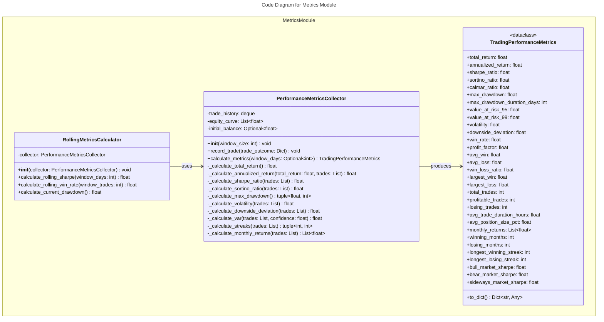
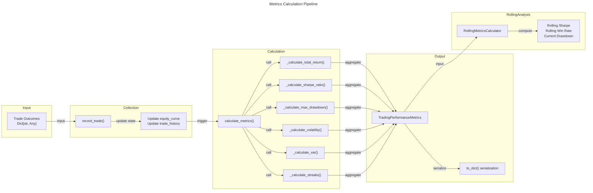
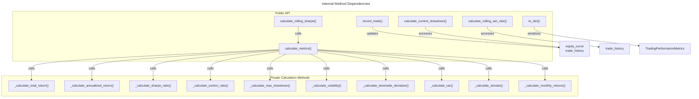

# C4 Code Level: Finance Feedback Engine - Metrics Module

## Overview

- **Name**: Trading Performance Metrics Calculation and Analysis
- **Description**: Comprehensive performance metrics collection, calculation, and analysis module for trading systems. Provides detailed performance measurement including returns, risk metrics, win/loss statistics, and rolling calculations.
- **Location**: `/finance_feedback_engine/metrics`
- **Language**: Python 3
- **Purpose**: Calculate and track comprehensive trading performance metrics including Sharpe ratio, Sortino ratio, maximum drawdown, Value at Risk (VaR), win rates, profit factors, and other key performance indicators (KPIs) essential for evaluating trading strategy effectiveness.

## Code Elements

### Data Classes

#### TradingPerformanceMetrics
- **Type**: `@dataclass`
- **Location**: `finance_feedback_engine/metrics/performance_metrics.py:11-64`
- **Description**: Comprehensive data structure storing all calculated trading performance metrics. Serves as the primary output format for performance calculations.
- **Purpose**: Encapsulate all trading performance measurements in a single standardized object with type safety and easy serialization.

**Attributes (Return Metrics)**:
- `total_return: float` - Total return percentage from initial balance
- `annualized_return: float` - Annualized return percentage
- `sharpe_ratio: float` - Sharpe ratio (risk-adjusted returns, assumes 0% risk-free rate)
- `sortino_ratio: float` - Sortino ratio (downside risk-adjusted returns)
- `calmar_ratio: float` - Calmar ratio (annualized return / max drawdown)

**Attributes (Risk Metrics)**:
- `max_drawdown: float` - Maximum peak-to-trough decline percentage
- `max_drawdown_duration_days: int` - Number of consecutive days in maximum drawdown
- `value_at_risk_95: float` - VaR at 95% confidence level
- `value_at_risk_99: float` - VaR at 99% confidence level
- `volatility: float` - Annualized volatility of returns
- `downside_deviation: float` - Annualized volatility of negative returns only

**Attributes (Win/Loss Metrics)**:
- `win_rate: float` - Percentage of profitable trades (0.0-1.0)
- `profit_factor: float` - Ratio of gross profit to gross loss
- `avg_win: float` - Average profit per winning trade
- `avg_loss: float` - Average loss per losing trade
- `win_loss_ratio: float` - Ratio of average win to average loss
- `largest_win: float` - Single largest trade profit
- `largest_loss: float` - Single largest trade loss (absolute value)

**Attributes (Trade Statistics)**:
- `total_trades: int` - Total number of trades analyzed
- `profitable_trades: int` - Count of winning trades
- `losing_trades: int` - Count of losing trades
- `avg_trade_duration_hours: float` - Average holding period in hours
- `avg_position_size_pct: float` - Average position size as percentage of account

**Attributes (Consistency Metrics)**:
- `monthly_returns: List[float]` - Monthly return percentages
- `winning_months: int` - Count of months with positive returns
- `losing_months: int` - Count of months with negative returns
- `longest_winning_streak: int` - Maximum consecutive profitable trades
- `longest_losing_streak: int` - Maximum consecutive losing trades

**Attributes (Market Regime Performance)**:
- `bull_market_sharpe: float` - Sharpe ratio during bull market conditions
- `bear_market_sharpe: float` - Sharpe ratio during bear market conditions
- `sideways_market_sharpe: float` - Sharpe ratio during sideways/range-bound market

**Method: `to_dict() -> Dict[str, Any]`**
- **Location**: `finance_feedback_engine/metrics/performance_metrics.py:65-90`
- **Description**: Serializes all metrics into a hierarchical dictionary structure organized by metric category
- **Returns**: Dictionary with keys: `return_metrics`, `risk_metrics`, `win_loss_metrics`, `trade_statistics`
- **Purpose**: Enable easy serialization to JSON, API responses, or storage systems

---

### PerformanceMetricsCollector

- **Type**: Class
- **Location**: `finance_feedback_engine/metrics/performance_metrics.py:93-521`
- **Description**: Core metrics calculation engine that collects trade data and computes comprehensive performance metrics.
- **Purpose**: Accept trade outcomes, maintain trade history and equity curves, and calculate all performance metrics on demand.

**Methods**:

#### `__init__(window_size: int = 10000) -> None`
- **Location**: `finance_feedback_engine/metrics/performance_metrics.py:96-103`
- **Description**: Initialize metrics collector with configurable history window
- **Parameters**:
  - `window_size: int` - Maximum number of recent trades to keep in memory (default: 10000)
- **Attributes Initialized**:
  - `trade_history: deque[Dict[str, Any]]` - FIFO queue of trades with max length
  - `equity_curve: List[float]` - List tracking account equity over time
  - `initial_balance: Optional[float]` - Starting account balance
- **Dependencies**: `deque` from collections module

#### `record_trade(trade_outcome: Dict[str, Any]) -> None`
- **Location**: `finance_feedback_engine/metrics/performance_metrics.py:105-130`
- **Description**: Records a completed trade and updates equity curve
- **Parameters**:
  - `trade_outcome: Dict[str, Any]` - Trade dictionary with keys:
    - `exit_timestamp` (datetime) - When trade was closed
    - `realized_pnl` (float) - Profit/loss in currency units
    - `pnl_percentage` (float) - Profit/loss as percentage
    - `was_profitable` (bool) - Whether trade was profitable
    - `holding_period_hours` (float) - Duration in hours
    - `position_size` (float) - Size of position
    - `entry_price` (float) - Entry price
    - `exit_price` (float) - Exit price
    - `asset_pair` (str) - Trading pair (e.g., "BTC/USD")
    - `initial_balance` (float) - Starting balance
- **Side Effects**:
  - Appends to `trade_history`
  - Updates `equity_curve`
  - Sets `initial_balance` if first trade
- **Dependencies**: `datetime.utcnow()`

#### `calculate_metrics(window_days: Optional[int] = None) -> TradingPerformanceMetrics`
- **Location**: `finance_feedback_engine/metrics/performance_metrics.py:132-222`
- **Description**: Master function computing all performance metrics, with optional time-window filtering
- **Parameters**:
  - `window_days: Optional[int]` - If specified, only calculate metrics for last N days (default: None = all-time)
- **Returns**: `TradingPerformanceMetrics` object populated with all calculations
- **Call Chain**:
  1. Filters trades by time window (if specified)
  2. Calls `_calculate_total_return()`
  3. Calls `_calculate_annualized_return()`
  4. Calls `_calculate_sharpe_ratio()`
  5. Calls `_calculate_sortino_ratio()`
  6. Calls `_calculate_max_drawdown()`
  7. Calls `_calculate_volatility()`
  8. Calls `_calculate_downside_deviation()`
  9. Calls `_calculate_var()` (95% and 99% confidence)
  10. Filters profitable and losing trades
  11. Calls `_calculate_streaks()`
  12. Calls `_calculate_monthly_returns()`
  13. Calculates Calmar ratio
  14. Returns populated TradingPerformanceMetrics
- **Dependencies**: `datetime.utcnow()`, `timedelta`, all helper methods

#### `_calculate_total_return() -> float`
- **Location**: `finance_feedback_engine/metrics/performance_metrics.py:224-232`
- **Description**: Calculates total return from start to current equity
- **Formula**: `((final_equity - initial_equity) / initial_equity) * 100`
- **Returns**: Total return percentage
- **Dependencies**: `equity_curve` attribute

#### `_calculate_annualized_return(total_return: float, trades: List[Dict]) -> float`
- **Location**: `finance_feedback_engine/metrics/performance_metrics.py:234-250`
- **Description**: Annualizes total return based on trading period duration
- **Parameters**:
  - `total_return: float` - Total return percentage from `_calculate_total_return()`
  - `trades: List[Dict]` - Trade history subset
- **Formula**: `((1 + total_return/100) ** (1/years) - 1) * 100`
- **Returns**: Annualized return percentage
- **Dependencies**: Trade timestamps

#### `_calculate_sharpe_ratio(trades: List[Dict]) -> float`
- **Location**: `finance_feedback_engine/metrics/performance_metrics.py:252-267`
- **Description**: Calculates Sharpe ratio (excess return per unit of volatility, assuming 0% risk-free rate)
- **Parameters**:
  - `trades: List[Dict]` - Trade history subset
- **Formula**: `(mean_return / std_return) * sqrt(250)` (250 trading days/year)
- **Returns**: Sharpe ratio value
- **Dependencies**: `numpy.mean()`, `numpy.std()`, `numpy.sqrt()`

#### `_calculate_sortino_ratio(trades: List[Dict]) -> float`
- **Location**: `finance_feedback_engine/metrics/performance_metrics.py:269-286`
- **Description**: Calculates Sortino ratio (excess return per unit of downside volatility only)
- **Parameters**:
  - `trades: List[Dict]` - Trade history subset
- **Formula**: `(mean_return / downside_std) * sqrt(250)` where downside_std is std of negative returns only
- **Returns**: Sortino ratio value
- **Dependencies**: `numpy.mean()`, `numpy.std()`, `numpy.sqrt()`

#### `_calculate_max_drawdown() -> tuple[float, int]`
- **Location**: `finance_feedback_engine/metrics/performance_metrics.py:288-315`
- **Description**: Calculates maximum peak-to-trough decline and duration
- **Returns**: Tuple of (max_drawdown_percent, duration_in_days)
- **Algorithm**:
  1. Computes running maximum of equity curve
  2. Calculates drawdown percentage at each point
  3. Finds maximum negative drawdown
  4. Tracks consecutive periods in drawdown > 1%
  5. Returns largest drawdown and longest drawdown duration
- **Dependencies**: `numpy.array()`, `numpy.maximum.accumulate()`

#### `_calculate_volatility(trades: List[Dict]) -> float`
- **Location**: `finance_feedback_engine/metrics/performance_metrics.py:317-327`
- **Description**: Calculates annualized volatility of returns
- **Parameters**:
  - `trades: List[Dict]` - Trade history subset
- **Formula**: `std(returns) * sqrt(250)`
- **Returns**: Annualized volatility percentage
- **Dependencies**: `numpy.std()`, `numpy.sqrt()`

#### `_calculate_downside_deviation(trades: List[Dict]) -> float`
- **Location**: `finance_feedback_engine/metrics/performance_metrics.py:329-343`
- **Description**: Calculates annualized volatility of only negative returns (downside risk)
- **Parameters**:
  - `trades: List[Dict]` - Trade history subset
- **Formula**: `std(negative_returns) * sqrt(250)`
- **Returns**: Annualized downside deviation percentage
- **Dependencies**: `numpy.std()`, `numpy.sqrt()`

#### `_calculate_var(trades: List[Dict], confidence: float = 0.95) -> float`
- **Location**: `finance_feedback_engine/metrics/performance_metrics.py:345-354`
- **Description**: Calculates Value at Risk (VaR) at specified confidence level
- **Parameters**:
  - `trades: List[Dict]` - Trade history subset
  - `confidence: float` - Confidence level (default: 0.95 for 95% VaR)
- **Formula**: `percentile(returns, (1-confidence)*100)` - absolute value
- **Returns**: VaR as positive number (maximum expected loss)
- **Dependencies**: `numpy.percentile()`

#### `_calculate_streaks(trades: List[Dict]) -> tuple[int, int]`
- **Location**: `finance_feedback_engine/metrics/performance_metrics.py:356-377`
- **Description**: Calculates longest consecutive winning and losing trade streaks
- **Parameters**:
  - `trades: List[Dict]` - Trade history subset
- **Returns**: Tuple of (longest_winning_streak, longest_losing_streak)
- **Algorithm**: Iterates through time-sorted trades, tracking consecutive wins/losses
- **Dependencies**: None

#### `_calculate_monthly_returns(trades: List[Dict]) -> List[float]`
- **Location**: `finance_feedback_engine/metrics/performance_metrics.py:379-404`
- **Description**: Calculates monthly return percentages from trade data
- **Parameters**:
  - `trades: List[Dict]` - Trade history subset
- **Returns**: List of monthly return percentages
- **Algorithm**:
  1. Groups trades by month
  2. Sums PnL for each month
  3. Calculates return percentage against running balance
  4. Updates balance and moves to next month
- **Dependencies**: `timestamp` attribute from trades

---

### RollingMetricsCalculator

- **Type**: Class
- **Location**: `finance_feedback_engine/metrics/performance_metrics.py:407-468`
- **Description**: Calculates rolling/windowed performance metrics for real-time monitoring and adaptive tracking
- **Purpose**: Provide windowed metric calculations for detecting recent performance changes, market regime shifts, and trading strategy degradation.

**Methods**:

#### `__init__(collector: PerformanceMetricsCollector) -> None`
- **Location**: `finance_feedback_engine/metrics/performance_metrics.py:409-416`
- **Description**: Initialize rolling metrics calculator with reference to metrics collector
- **Parameters**:
  - `collector: PerformanceMetricsCollector` - Collector instance to calculate metrics from
- **Attributes Initialized**:
  - `collector: PerformanceMetricsCollector` - Stored reference
- **Dependencies**: `PerformanceMetricsCollector`

#### `calculate_rolling_sharpe(window_days: int = 30) -> float`
- **Location**: `finance_feedback_engine/metrics/performance_metrics.py:418-421`
- **Description**: Calculates Sharpe ratio for specified recent time window
- **Parameters**:
  - `window_days: int` - Look-back period in days (default: 30)
- **Returns**: Sharpe ratio for the window period
- **Dependencies**: `collector.calculate_metrics()`

#### `calculate_rolling_win_rate(window_trades: int = 20) -> float`
- **Location**: `finance_feedback_engine/metrics/performance_metrics.py:423-433`
- **Description**: Calculates win rate for the most recent N trades
- **Parameters**:
  - `window_trades: int` - Number of recent trades to analyze (default: 20)
- **Returns**: Win rate as decimal (0.0-1.0)
- **Algorithm**: Takes last N trades from history, counts profitable ones, divides by total
- **Dependencies**: `collector.trade_history`

#### `calculate_current_drawdown() -> float`
- **Location**: `finance_feedback_engine/metrics/performance_metrics.py:435-445`
- **Description**: Calculates current drawdown from all-time peak equity
- **Returns**: Current drawdown percentage (positive value)
- **Algorithm**:
  1. Finds maximum equity reached (peak)
  2. Gets current equity (most recent)
  3. Calculates percentage decline
  4. Returns absolute value
- **Dependencies**: `collector.equity_curve`

---

## Dependencies

### Internal Dependencies

No internal dependencies. The metrics module is self-contained and only depends on Python standard library and NumPy.

**Modules that depend on this metrics module**:
- `finance_feedback_engine/cli/main.py` - CLI integration
- `finance_feedback_engine/monitoring/trade_monitor.py` - Trade monitoring
- `finance_feedback_engine/monitoring/context_provider.py` - Context for AI
- `finance_feedback_engine/agent/trading_loop_agent.py` - Agent integration
- `finance_feedback_engine/learning/feedback_analyzer.py` - Learning system
- `finance_feedback_engine/risk/gatekeeper.py` - Risk management
- `finance_feedback_engine/api/routes.py` - API endpoints
- `finance_feedback_engine/core.py` - Core trading engine
- `finance_feedback_engine/data_providers/alpha_vantage_provider.py` - Data provision
- `finance_feedback_engine/memory/vector_store.py` - Memory storage
- Tests: `tests/test_observability.py`, `tests/test_phase2_performance_benchmarks.py`
- Benchmarks: `experiments/benchmarking/benchmark_suite.py`

### External Dependencies

- **numpy** (`import numpy as np`)
  - Used for: Statistical calculations (mean, std, percentile), array operations
  - Functions: `np.mean()`, `np.std()`, `np.percentile()`, `np.sqrt()`, `np.array()`, `np.maximum.accumulate()`, `np.min()`, `np.max()`

- **Python Standard Library**:
  - `collections.deque` - Circular buffer for trade history
  - `dataclasses` - `@dataclass` decorator for TradingPerformanceMetrics
  - `dataclasses.field` - Default factory for mutable defaults
  - `datetime.datetime` - Trade timestamps
  - `datetime.timedelta` - Time window calculations
  - `typing` - Type hints: `Any`, `Dict`, `List`, `Optional`

---

## Relationships

### Class Diagram - Metrics Module Structure

### Data Flow Diagram - Metrics Calculation Pipeline

### Function Call Dependency Graph

---

## Key Metrics Explained

### Return Metrics
- **Total Return**: Overall profit/loss as percentage from start to current
- **Annualized Return**: Return extrapolated to annual basis for fair comparison across different time periods
- **Sharpe Ratio**: Return per unit of total risk (higher = better risk-adjusted returns); assumes 0% risk-free rate
- **Sortino Ratio**: Return per unit of downside risk only (penalizes only negative volatility)
- **Calmar Ratio**: Annualized return divided by maximum drawdown (higher = better)

### Risk Metrics
- **Max Drawdown**: Worst peak-to-trough decline (important for understanding worst-case scenarios)
- **Value at Risk (VaR)**: Expected maximum loss at specified confidence level (e.g., 95% VaR means 5% probability of loss exceeding this)
- **Volatility**: Standard deviation of returns annualized (measures consistency)
- **Downside Deviation**: Volatility of negative returns only (different from Sortino's calculation but complementary)

### Trade Statistics
- **Win Rate**: Percentage of profitable trades
- **Profit Factor**: Total wins divided by total losses (>1.0 is profitable)
- **Win/Loss Ratio**: Average winning trade size divided by average losing trade size
- **Streaks**: Consecutive wins/losses indicate consistency and psychological factors

### Consistency Metrics
- **Monthly Returns**: Track consistency across longer timeframes
- **Winning/Losing Months**: Percentage of profitable periods

---

## Notes

### Design Patterns
- **Dataclass Pattern**: `TradingPerformanceMetrics` uses Python dataclass for automatic `__init__`, `__repr__`, etc.
- **Composition Pattern**: `RollingMetricsCalculator` composes `PerformanceMetricsCollector` rather than inheriting
- **Lazy Calculation**: Metrics are calculated on-demand via `calculate_metrics()` rather than continuously updated
- **Circular Buffer Pattern**: `trade_history` uses `deque` with `maxlen` for memory-efficient windowing

### Performance Considerations
- **Memory Usage**: Trade history limited to `window_size` (default 10000 trades)
- **Computation**: `calculate_metrics()` performs full recalculation on each call; no caching
- **NumPy Usage**: Leverages NumPy for vectorized statistical operations on equity curves

### Statistical Assumptions
- **Sharpe Ratio**: Assumes 0% risk-free rate; 250 trading days per year
- **Sortino Ratio**: Same as Sharpe but uses downside deviation instead of total volatility
- **VaR Calculation**: Percentile-based (historical simulation) rather than parametric
- **Annualization**: Uses 250 trading days/year constant; varies by market

### Extensibility
The module is designed to be extended with additional metrics:
1. Add new attributes to `TradingPerformanceMetrics` dataclass
2. Implement `_calculate_*()` helper method in `PerformanceMetricsCollector`
3. Call helper method from `calculate_metrics()`
4. Add to `to_dict()` if serialization needed

### Integration Points
This metrics module serves as a critical feedback source for:
- **Risk Gatekeeper**: Uses metrics to determine if trading should be paused
- **Learning System**: Uses metrics to evaluate strategy effectiveness
- **API Routes**: Exposes metrics via REST endpoints
- **CLI**: Displays metrics in command-line interface
- **Trading Loop**: Uses metrics to monitor strategy performance in real-time
