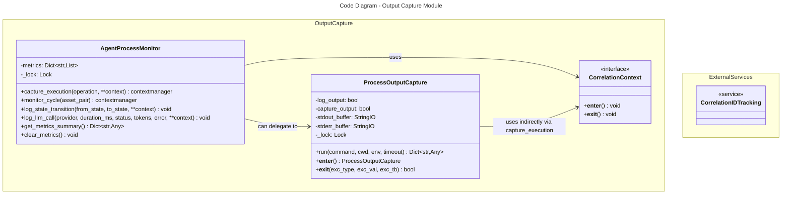

# C4 Code Level: Output Capture and Process Monitoring

## Overview

- **Name**: Output Capture and Process Monitoring Module
- **Description**: Provides utilities for capturing and monitoring subprocess outputs, tracking execution times, and monitoring agent state transitions with structured logging and correlation IDs
- **Location**: `finance_feedback_engine/monitoring/output_capture/`
- **Language**: Python 3
- **Purpose**: Implement comprehensive subprocess output capture and agent execution monitoring with real-time logging, execution time measurement, state transition tracking, and LLM API call metrics

## Code Elements

### Classes

#### ProcessOutputCapture

**Location**: `finance_feedback_engine/monitoring/output_capture/process_monitor.py` (lines 31-212)

**Description**: Capture and monitor subprocess outputs with real-time logging. Provides thread-safe capture of stdout and stderr from subprocesses with support for real-time streaming to log files, return code tracking, and execution time measurement.

**Methods**:

1. `__init__(self, log_output: bool = True, capture_output: bool = True) -> None`
   - **Description**: Initialize the process output capture with optional logging and output capture configuration
   - **Parameters**:
     - `log_output` (bool, default=True): If True, stream output to logger in real-time
     - `capture_output` (bool, default=True): If True, capture output in memory for return
   - **Returns**: None
   - **Location**: Lines 50-61
   - **Dependencies**: `StringIO` (io module), `threading`, `logging`

2. `run(self, command: List[str], cwd: Optional[str] = None, env: Optional[Dict[str, str]] = None, timeout: Optional[float] = None) -> Dict[str, Any]`
   - **Description**: Run a command and capture its output with thread-safe real-time capture using daemon threads for stdout and stderr reading
   - **Parameters**:
     - `command` (List[str]): Command and arguments as list
     - `cwd` (Optional[str], default=None): Working directory for the command
     - `env` (Optional[Dict[str, str]], default=None): Environment variables
     - `timeout` (Optional[float], default=None): Command timeout in seconds
   - **Returns**: Dict[str, Any] containing:
     - `return_code` (int): Process exit code
     - `stdout` (str): Captured stdout (if capture_output=True)
     - `stderr` (str): Captured stderr (if capture_output=True)
     - `duration_ms` (float): Execution time in milliseconds
     - `timed_out` (bool): Whether the command timed out
   - **Raises**: `subprocess.TimeoutExpired` if timeout is exceeded
   - **Location**: Lines 63-200
   - **Dependencies**: `subprocess.Popen`, `subprocess.TimeoutExpired`, `threading.Thread`, `time.time()`, `logging.Logger`

3. `__enter__(self) -> ProcessOutputCapture`
   - **Description**: Enter context manager interface
   - **Parameters**: None
   - **Returns**: self (ProcessOutputCapture instance)
   - **Location**: Lines 202-204
   - **Dependencies**: None

4. `__exit__(self, exc_type, exc_val, exc_tb) -> bool`
   - **Description**: Exit context manager and cleanup StringIO buffers
   - **Parameters**:
     - `exc_type`: Exception type (if any)
     - `exc_val`: Exception value (if any)
     - `exc_tb`: Exception traceback (if any)
   - **Returns**: False (does not suppress exceptions)
   - **Location**: Lines 206-212
   - **Dependencies**: None

#### AgentProcessMonitor

**Location**: `finance_feedback_engine/monitoring/output_capture/process_monitor.py` (lines 215-481)

**Description**: Monitor agent execution and state transitions with structured logging. Wraps agent operations to provide state transition tracking with correlation IDs, execution time monitoring, exception capture and logging, and metrics collection for performance analysis.

**Methods**:

1. `__init__(self) -> None`
   - **Description**: Initialize the agent process monitor with empty metrics dictionaries
   - **Parameters**: None
   - **Returns**: None
   - **Location**: Lines 235-243
   - **Dependencies**: `threading`, `Dict`, `List`

2. `capture_execution(self, operation: str, **context) -> contextmanager`
   - **Description**: Context manager that captures execution metrics for an operation with automatic start/completion logging and exception tracking
   - **Parameters**:
     - `operation` (str): Name of the operation being monitored
     - `**context`: Additional context fields to log and track
   - **Yields**: Dict that can be used to add additional metrics
   - **Location**: Lines 245-322
   - **Dependencies**: `contextmanager`, `time.time()`, `logging`, `get_correlation_id()`, `CorrelationContext`
   - **Behavior**:
     - Logs operation start with correlation_id
     - Tracks execution duration
     - On success: Sets status to "success", logs completion
     - On exception: Sets status to "error", captures error details, stores exception metrics, re-raises exception

3. `monitor_cycle(self, asset_pair: str) -> contextmanager`
   - **Description**: Context manager that monitors a complete agent cycle with correlation ID and automatic cycle metric storage
   - **Parameters**:
     - `asset_pair` (str): The asset pair being traded (e.g., "BTCUSD")
   - **Yields**: Dict for storing cycle metrics (includes asset_pair, correlation_id, start_time)
   - **Location**: Lines 324-356
   - **Dependencies**: `contextmanager`, `CorrelationContext`, `get_correlation_id()`, `datetime.utcnow()`, `capture_execution()`
   - **Behavior**:
     - Creates new CorrelationContext for cycle isolation
     - Wraps cycle in capture_execution context
     - Merges execution metrics into cycle metrics
     - Stores complete cycle metrics in self.metrics["cycles"]

4. `log_state_transition(self, from_state: str, to_state: str, **context) -> None`
   - **Description**: Log an agent state transition with correlation ID and optional context
   - **Parameters**:
     - `from_state` (str): Previous state
     - `to_state` (str): New state
     - `**context`: Additional context fields
   - **Returns**: None
   - **Location**: Lines 358-380
   - **Dependencies**: `get_correlation_id()`, `datetime.utcnow()`, `logging`, `threading.Lock`
   - **Behavior**:
     - Creates transition record with timestamp, states, and correlation_id
     - Logs transition at INFO level
     - Appends to self.metrics["state_transitions"] in thread-safe manner

5. `log_llm_call(self, provider: str, duration_ms: float, status: str, tokens: Optional[int] = None, error: Optional[str] = None, **context) -> None`
   - **Description**: Log an LLM API call with metrics including provider, duration, status, tokens, and optional error
   - **Parameters**:
     - `provider` (str): LLM provider name (e.g., 'local', 'gemini', 'cli')
     - `duration_ms` (float): Call duration in milliseconds
     - `status` (str): Call status ('success', 'failure', 'timeout')
     - `tokens` (Optional[int], default=None): Number of tokens used (if available)
     - `error` (Optional[str], default=None): Error message (if failed)
     - `**context`: Additional context fields
   - **Returns**: None
   - **Location**: Lines 382-431
   - **Dependencies**: `get_correlation_id()`, `datetime.utcnow()`, `logging`, `threading.Lock`
   - **Behavior**:
     - Creates LLM call record with timestamp, provider, metrics, and correlation_id
     - Logs at ERROR level if status is "failure", otherwise INFO level
     - Appends to self.metrics["llm_calls"] in thread-safe manner

6. `get_metrics_summary(self) -> Dict[str, Any]`
   - **Description**: Get a summary of collected metrics with aggregate statistics
   - **Parameters**: None
   - **Returns**: Dict[str, Any] containing:
     - `total_cycles` (int): Number of agent cycles
     - `total_state_transitions` (int): Number of state transitions
     - `total_llm_calls` (int): Number of LLM calls
     - `total_exceptions` (int): Number of exceptions
     - `avg_cycle_duration_ms` (float): Average cycle duration in milliseconds
     - `llm_success_rate` (float): LLM call success rate (0.0 to 1.0)
   - **Location**: Lines 433-470
   - **Dependencies**: `threading.Lock`
   - **Behavior**:
     - Thread-safe read of all metrics
     - Calculates average cycle duration from cycles with duration_ms field
     - Calculates success rate from llm_calls with status == "success"

7. `clear_metrics(self) -> None`
   - **Description**: Clear all collected metrics and reset storage
   - **Parameters**: None
   - **Returns**: None
   - **Location**: Lines 472-480
   - **Dependencies**: `threading.Lock`
   - **Behavior**:
     - Thread-safe reset of all metric categories to empty lists

### Module Level

**Location**: `finance_feedback_engine/monitoring/output_capture/__init__.py`

**Description**: Package initialization that exports public API

**Exports**:
- `ProcessOutputCapture` (class): Subprocess output capture utility
- `AgentProcessMonitor` (class): Agent execution monitor

## Dependencies

### Internal Dependencies

1. **finance_feedback_engine.monitoring.logging_config**
   - `CorrelationContext`: Context manager for correlation ID management (lines 339)
   - `get_correlation_id()`: Function to retrieve current correlation ID (lines 269, 318, 342, 370, 406)
   - Used for: Tracking related operations across multiple log entries

### External Dependencies

| Module | Usage | Purpose |
|--------|-------|---------|
| `logging` | Standard logging library (line 14) | Structured logging and logger retrieval |
| `subprocess` | Process management (lines 15, 103, 149, 151) | Launching and managing subprocesses with Popen and TimeoutExpired |
| `threading` | Thread management (lines 16, 142-145, 163-164, 243, 379, 430, 474) | Thread-safe concurrent stdout/stderr reading and lock-based metric synchronization |
| `time` | Timing utility (lines 17, 89, 167, 178, 261, 277, 292) | Measuring execution duration |
| `contextlib` | Context manager support (line 18, 245, 324) | Decorating generator-based context managers |
| `datetime` | Timestamp generation (line 19, 314, 343, 367, 402) | Creating ISO format timestamps for metrics |
| `io.StringIO` | String buffer (line 20, 59-60, 124, 127, 136, 139, 209-210) | In-memory capture of subprocess output |
| `typing` | Type hints (line 21) | Type annotations for parameters and return values |

## Relationships

### Internal Code Flow

The module implements a hierarchical monitoring structure:

1. **ProcessOutputCapture** handles low-level subprocess execution
   - Manages process lifecycle (Popen, wait, kill on timeout)
   - Implements thread-safe real-time output capture
   - Returns structured result with exit code, captured output, and timing

2. **AgentProcessMonitor** wraps higher-level agent operations
   - Uses `capture_execution()` context manager for generic operation tracking
   - Uses `monitor_cycle()` for complete agent trading cycles
   - Tracks state transitions via `log_state_transition()`
   - Records LLM API calls via `log_llm_call()`
   - Correlates all operations using CorrelationContext

3. **Metrics Collection**
   - `AgentProcessMonitor.metrics` stores 4 categories:
     - `cycles`: Complete trading cycles with asset_pair and duration
     - `state_transitions`: State changes with correlation ID
     - `llm_calls`: LLM API call metrics with provider and status
     - `exceptions`: Exception capture with error types and correlation IDs
   - All metrics storage is thread-safe using `threading.Lock`



### Threading Model

Both classes employ thread-safe designs:

**ProcessOutputCapture**:
- Uses `threading.Lock` (_lock) to synchronize access to capture buffers
- Spawns daemon threads for concurrent stdout/stderr reading
- Avoids blocking on either stream by reading them independently

**AgentProcessMonitor**:
- Uses `threading.Lock` (_lock) to synchronize access to metrics dictionaries
- Ensures thread-safe writes when appending metrics in all log_* methods
- Supports concurrent monitoring from multiple threads

### Correlation ID Integration

Both classes integrate with the logging infrastructure:
- `AgentProcessMonitor` explicitly calls `get_correlation_id()` in all logging operations
- Each metric record captures `correlation_id` for request tracing
- `monitor_cycle()` creates new `CorrelationContext()` for cycle isolation
- Enables distributed tracing across agent operations and LLM calls

## Usage Patterns

### ProcessOutputCapture Pattern

```python
# Simple capture with context manager
with ProcessOutputCapture() as capture:
    result = capture.run(['python', 'script.py'])
    print(f"Exit code: {result['return_code']}")
    print(f"Duration: {result['duration_ms']}ms")
    print(f"Output: {result['stdout']}")

# With timeout and working directory
result = capture.run(
    ['npm', 'test'],
    cwd='/path/to/project',
    timeout=30.0
)
```

### AgentProcessMonitor Pattern

```python
monitor = AgentProcessMonitor()

# Monitor a single operation
with monitor.capture_execution("analyze", asset_pair="BTCUSD") as metrics:
    result = perform_analysis()
    metrics['confidence'] = result.confidence

# Monitor a complete agent cycle
with monitor.monitor_cycle("BTCUSD"):
    agent.run()

# Log state transitions
monitor.log_state_transition("IDLE", "ANALYZING")

# Log LLM API calls
monitor.log_llm_call(
    provider="gemini",
    duration_ms=450.5,
    status="success",
    tokens=1024
)

# Get metrics summary
summary = monitor.get_metrics_summary()
print(f"Success rate: {summary['llm_success_rate']}")
print(f"Avg cycle duration: {summary['avg_cycle_duration_ms']}ms")
```

## Notes

### Architecture Reference
See `plans/LOGGING_MONITORING_ARCHITECTURE.md` Section 2.3 (Process Output Capture) for detailed architecture decisions and design rationale.

### Key Design Decisions

1. **Real-time Output Streaming**: Uses daemon threads to read stdout/stderr concurrently, avoiding deadlocks when subprocess produces large output

2. **Correlation IDs**: All metrics include correlation IDs for distributed tracing across agent operations

3. **Thread Safety**: Both classes use threading.Lock for safe concurrent access, supporting multi-threaded agent deployments

4. **Metrics Aggregation**: `AgentProcessMonitor` stores complete history enabling post-analysis and performance monitoring

5. **Context Manager Interface**: Both classes implement context managers for clean resource management

### Performance Considerations

- **ProcessOutputCapture**: Daemon threads ensure non-blocking output capture; line-buffered subprocess prevents output buffering delays
- **AgentProcessMonitor**: Metrics stored in memory; should be persisted or cleared for long-running agents
- **Lock Contention**: Threading locks may become a bottleneck with very high frequency logging; consider metrics batching for high-throughput scenarios
