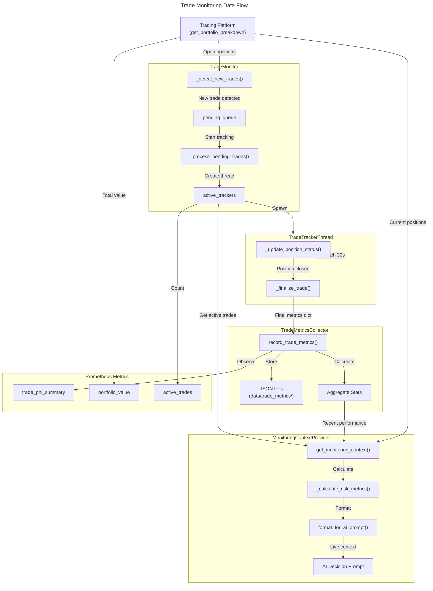

# C4 Code Level: Finance Feedback Engine Monitoring System

## Overview

- **Name**: Finance Feedback Engine Monitoring System
- **Description**: Comprehensive real-time trade monitoring, metrics collection, performance evaluation, and observability infrastructure for the Finance Feedback Engine trading system
- **Location**: `/finance_feedback_engine/monitoring`
- **Language**: Python 3.x
- **Purpose**: Provides production-grade monitoring capabilities for trade execution, AI model performance, logging with PII protection, error tracking, and Prometheus metrics exposition for real-time trading operations

## Code Elements

### Core Classes

#### TradeMonitor
- **Location**: `finance_feedback_engine/monitoring/trade_monitor.py:1-1280`
- **Description**: Main orchestrator for live trade monitoring and management
- **Responsibilities**:
  - Detects new trades from trading platform
  - Manages concurrent trade tracking threads (max 2)
  - Collects trade metrics for ML feedback loop
  - Integrates with PortfolioMemoryEngine for learning
  - Monitors portfolio P&L limits (stop-loss/take-profit)
  - Executes multi-timeframe market pulse analysis
  - Handles graceful shutdown and cleanup

**Key Methods**:
- `__init__(platform, metrics_collector=None, portfolio_memory=None, detection_interval=30, poll_interval=30, portfolio_initial_balance=0.0, portfolio_stop_loss_percentage=0.0, portfolio_take_profit_percentage=0.0, monitoring_context_provider=None, orchestrator=None, unified_data_provider=None, timeframe_aggregator=None, pulse_interval=300): None`
  - Initializes trade monitor with platform and configuration
  - Location: Line 28-155
  - Dependencies: TradeMetricsCollector, MonitoringContextProvider, ThreadPoolExecutor, Queue

- `start(): None`
  - Starts the trade monitoring system and main monitoring thread
  - Location: Line 157-175

- `stop(timeout: float = 10.0): bool`
  - Stops trade monitoring with timeout for clean shutdown
  - Location: Line 177-213
  - Returns: True if stopped cleanly, False if timeout

- `_monitoring_loop(): None`
  - Main monitoring loop that detects trades, manages trackers, and checks limits
  - Location: Line 215-264
  - Calls: _detect_new_trades, _cleanup_stale_expectations, _cleanup_completed_trackers, _process_pending_trades, _check_portfolio_pnl_limits, _maybe_execute_market_pulse, _log_status

- `_detect_new_trades(): None`
  - Queries platform for open positions and detects new trades
  - Location: Line 339-419
  - Updates: pending_queue with new trade info
  - Metrics: Updates Prometheus portfolio_value, active_trades

- `_process_pending_trades(): None`
  - Starts tracking pending trades if slots available
  - Location: Line 453-486
  - Creates: TradeTrackerThread instances
  - Updates: active_trackers, Prometheus active_trades gauge

- `_on_trade_completed(metrics: Dict[str, Any]): None`
  - Callback when trade tracking completes (part of feedback loop)
  - Location: Line 488-527
  - Records metrics and emits Prometheus observations

- `_check_portfolio_pnl_limits(): None`
  - Checks if portfolio P&L hit stop-loss or take-profit limits
  - Location: Line 266-337
  - Calls: _handle_portfolio_limit_hit on threshold breach

- `_handle_portfolio_limit_hit(limit_type: str, current_pnl_pct: float): None`
  - Handles portfolio limit breach by pausing trading
  - Location: Line 539-572
  - Signals: Orchestrator to pause/close positions

- `_maybe_execute_market_pulse(): None`
  - Runs multi-timeframe analysis pulse on interval
  - Location: Line 631-659
  - Updates: _multi_timeframe_cache with analysis results

- `get_latest_market_context(asset_pair: str): Optional[Dict[str, Any]]`
  - Retrieves cached multi-timeframe analysis for an asset
  - Location: Line 679-691
  - Returns: Analysis dict or None if stale

- `associate_decision_to_trade(decision_id: str, asset_pair: str): None`
  - Associates decision ID with expected trade for asset
  - Location: Line 529-537
  - Updates: expected_trades with decision mapping

- `get_active_trades(): List[Dict[str, Any]]`
  - Returns status of all actively tracked trades
  - Location: Line 707-724

- `get_monitoring_summary(): Dict[str, Any]`
  - Returns comprehensive monitoring summary
  - Location: Line 726-739
  - Returns: Running status, active trackers count, metrics

**Properties**:
- `is_running: bool` - Check if monitor is running (Line 693-695)

**State Variables**:
- `active_trackers: Dict[str, TradeTrackerThread]` - Map of trade_id to tracker threads
- `tracked_trade_ids: Set[str]` - Set of currently tracked trade IDs
- `pending_queue: Queue` - Queue of pending trades to be tracked
- `closed_trades_queue: Queue` - Queue of completed trades for agent consumption
- `expected_trades: Dict[str, tuple]` - Asset pair to (decision_id, timestamp) mapping
- `_multi_timeframe_cache: Dict[str, Tuple[Dict, float]]` - Cached market analysis
- `_monitoring_state: str` - State: "active", "paused", or "stopped"

**Dependencies**:
- Internal: TradeMetricsCollector, MonitoringContextProvider, TradeTrackerThread
- External: ThreadPoolExecutor, Queue, threading, time, logging, hashlib

---

#### TradeTrackerThread
- **Location**: `finance_feedback_engine/monitoring/trade_tracker.py:1-320`
- **Description**: Monitors a single trade from entry to exit
- **Responsibilities**:
  - Tracks position entry, exit, and intermediate states
  - Polls platform for price updates at regular intervals
  - Calculates peak P&L, drawdown, and other metrics
  - Detects position closure and triggers metrics callback
  - Manages thread lifecycle safely

**Key Methods**:
- `__init__(trade_id: str, position_data: Dict[str, Any], platform, metrics_callback: Callable, poll_interval: int = 30, decision_id: Optional[str] = None): None`
  - Initializes trade tracker for a specific trade
  - Location: Line 29-87
  - Stores: Initial position data, entry price, entry time

- `run(): None`
  - Main monitoring loop for the trade
  - Location: Line 89-113
  - Calls: _update_position_status in loop until position closed

- `_update_position_status(): bool`
  - Queries platform for current position status
  - Location: Line 115-193
  - Returns: True if position still open, False if closed
  - Updates: current_price, current_pnl, peak_pnl, max_drawdown, price_updates

- `_finalize_trade(forced_stop: bool = False): None`
  - Collects final metrics and triggers callback
  - Location: Line 195-275
  - Calls: metrics_callback with final trade metrics dict
  - Calculates: exit_reason based on P&L patterns

- `stop(timeout: float = 5.0): bool`
  - Requests thread to stop and waits for completion
  - Location: Line 277-291
  - Returns: True if stopped cleanly, False if timeout

- `get_current_status(): Dict[str, Any]`
  - Gets current trade status snapshot
  - Location: Line 302-320
  - Returns: Current metrics (price, PnL, holding time, etc.)

**Properties**:
- `is_running: bool` - Check if thread actively monitoring (Line 299-301)

**State Variables**:
- `trade_id: str` - Unique trade identifier
- `product_id: str` - Trading pair (e.g., "BTC-USD")
- `side: str` - "LONG" or "SHORT"
- `entry_time: datetime` - When trade was entered
- `entry_price: float` - Entry price
- `position_size: float` - Number of contracts
- `current_price: float` - Current market price
- `current_pnl: float` - Current unrealized P&L
- `peak_pnl: float` - Highest P&L reached
- `max_drawdown: float` - Maximum drawdown from peak
- `price_updates: List[Dict]` - Time series of price/PnL snapshots
- `decision_id: Optional[str]` - Associated decision ID if any

**Dependencies**:
- Internal: (none)
- External: threading, time, datetime, logging

---

#### TradeMetricsCollector
- **Location**: `finance_feedback_engine/monitoring/metrics_collector.py:1-380`
- **Description**: Captures and stores trade performance metrics for ML feedback loop
- **Responsibilities**:
  - Records completed trade metrics from TradeTrackerThread callbacks
  - Calculates aggregate statistics (win rate, avg P&L, etc.)
  - Persists metrics to JSON files for historical analysis
  - Exports training data for model retraining
  - Maintains in-memory active metrics list

**Key Methods**:
- `__init__(storage_dir: str = "data/trade_metrics"): None`
  - Initializes metrics collector
  - Location: Line 20-37
  - Creates: storage_dir if not exists
  - Initializes: active_metrics list, completed_count counter

- `record_trade_metrics(metrics: Dict[str, Any]): None`
  - Records completed trade metrics
  - Location: Line 39-80
  - Stores: metrics in active_metrics and JSON file
  - Calls: _update_aggregates with new metrics
  - Metrics: Logs trade completion with PnL

- `_update_aggregates(metrics: Dict[str, Any]): None`
  - Updates aggregate statistics for performance tracking
  - Location: Line 82-123
  - Calculates: win_rate, avg_pnl, avg_holding_hours
  - Logs: Summary statistics to logger

- `get_recent_metrics(limit: int = 10): List[Dict[str, Any]]`
  - Gets most recent trade metrics
  - Location: Line 125-138
  - Returns: Last N trades from active_metrics

- `get_aggregate_statistics(): Dict[str, Any]`
  - Gets aggregate performance statistics
  - Location: Line 140-188
  - Returns: Dict with total_trades, win_rate, avg_pnl, best_trade, worst_trade

- `export_for_model_training(output_file: Optional[str] = None): Dict[str, Any]`
  - Exports metrics in format suitable for model retraining
  - Location: Line 190-242
  - Extracts: Features relevant for ML (product_id, entry_price, exit_price, realized_pnl, exit_reason, etc.)
  - Writes: JSON export file if output_file specified
  - Returns: Training-ready dict

- `clear_metrics(): None`
  - Clears in-memory metrics (files remain on disk)
  - Location: Line 244-247

- `get_metrics_summary(): str`
  - Gets human-readable summary of collected metrics
  - Location: Line 249-280
  - Returns: Formatted string with trade statistics

**State Variables**:
- `active_metrics: List[Dict]` - In-memory list of trade metrics
- `completed_count: int` - Number of trades completed
- `storage_dir: Path` - Directory for JSON metric files

**Dependencies**:
- Internal: (none)
- External: json, logging, datetime, Path, typing

---

#### MonitoringContextProvider
- **Location**: `finance_feedback_engine/monitoring/context_provider.py:1-610`
- **Description**: Provides real-time monitoring context for AI decision making
- **Responsibilities**:
  - Aggregates active positions and trade performance
  - Calculates risk metrics and position concentration
  - Integrates live P&L exposure into decision context
  - Formats monitoring data for AI prompts
  - Formats multi-timeframe technical analysis for prompts

**Key Methods**:
- `__init__(platform, trade_monitor=None, metrics_collector=None, portfolio_initial_balance: float = 0.0): None`
  - Initializes monitoring context provider
  - Location: Line 18-33
  - Dependencies: Platform, TradeMonitor, TradeMetricsCollector

- `get_monitoring_context(asset_pair: Optional[str] = None, lookback_hours: int = 24): Dict[str, Any]`
  - Gets comprehensive monitoring context for AI decision making
  - Location: Line 56-135
  - Returns: Context dict with active_positions, risk_metrics, concentration, performance
  - Calls: _calculate_risk_metrics, _analyze_concentration, _get_recent_performance

- `get_monitoring_context_async(asset_pair: Optional[str] = None, lookback_hours: int = 24): Dict[str, Any]`
  - Async variant to avoid blocking event loop
  - Location: Line 35-54
  - Returns: Same structure as sync variant

- `_calculate_risk_metrics(futures_positions: List[Dict], portfolio: Dict) -> Dict[str, Any]`
  - Calculates risk metrics from active positions
  - Location: Line 137-175
  - Returns: total_exposure, unrealized_pnl, long/short_exposure, leverage_estimate

- `_analyze_concentration(portfolio: Dict) -> Dict[str, Any]`
  - Analyzes position concentration across assets
  - Location: Line 177-216
  - Returns: num_positions, largest_position_pct, top_3_concentration, diversification_score

- `_get_recent_performance(asset_pair: Optional[str], lookback_hours: int) -> Dict[str, Any]`
  - Gets recent trade performance metrics from JSON files
  - Location: Line 218-277
  - Returns: trades_count, win_rate, avg_pnl, total_pnl

- `get_portfolio_pnl_percentage(): float`
  - Calculates portfolio P&L as % of initial balance
  - Location: Line 279-296
  - Returns: Current P&L percentage
  - Formula: (current_value - initial_balance) / initial_balance

- `format_for_ai_prompt(context: Dict[str, Any]): str`
  - Formats monitoring context for inclusion in AI prompts
  - Location: Line 401-484
  - Returns: Formatted string with positions, risk, concentration, performance

- `_format_pulse_summary(pulse: Dict[str, Any]): str`
  - Formats multi-timeframe pulse data into LLM-friendly text
  - Location: Line 298-399
  - Returns: Formatted string with technical analysis by timeframe

**State Variables**:
- `platform` - Trading platform instance
- `trade_monitor: Optional[TradeMonitor]` - For active trades data
- `metrics_collector: Optional[TradeMetricsCollector]` - For historical metrics
- `portfolio_initial_balance: float` - Starting capital

**Dependencies**:
- Internal: TradeMonitor, TradeMetricsCollector
- External: json, logging, datetime, Path, typing

---

### Logging & Configuration Classes

#### StructuredJSONFormatter
- **Location**: `finance_feedback_engine/monitoring/logging_config.py:118-185`
- **Description**: Formats log records as JSON with structured metadata
- **Responsibilities**:
  - Converts log records to JSON format
  - Preserves correlation IDs
  - Captures exception and stack trace information
  - Collects extra context fields from log records

**Key Methods**:
- `format(record: logging.LogRecord): str`
  - Formats log record as JSON
  - Location: Line 159-185
  - Returns: JSON-formatted log string with timestamp, correlation_id, level, message, context

**Dependencies**:
- External: json, logging, datetime

---

#### CorrelationIDFilter
- **Location**: `finance_feedback_engine/monitoring/logging_config.py:36-68`
- **Description**: Injects correlation IDs into all log records
- **Responsibilities**:
  - Attaches correlation IDs from thread-local storage to logs
  - Enables request tracing across distributed logs

**Key Methods**:
- `filter(record: logging.LogRecord): bool`
  - Adds correlation_id to log record
  - Location: Line 52-68
  - Returns: True (always allows record through)

**Dependencies**:
- External: logging

---

#### PIIRedactionFilter
- **Location**: `finance_feedback_engine/monitoring/logging_config.py:71-176`
- **Description**: Redacts sensitive information from log messages
- **Responsibilities**:
  - Protects against accidental logging of API keys, tokens, passwords
  - Applies regex patterns for PII detection and redaction
  - Customizable redaction patterns

**Key Methods**:
- `__init__(custom_patterns: Optional[list] = None): None`
  - Initializes with default and custom PII patterns
  - Location: Line 110-140

- `redact(text: str): str`
  - Applies all redaction patterns to text
  - Location: Line 142-157
  - Returns: Redacted text

- `filter(record: logging.LogRecord): bool`
  - Redacts PII from log message and extra fields
  - Location: Line 159-176
  - Returns: True

**Dependencies**:
- External: logging, re

---

#### ErrorTracker
- **Location**: `finance_feedback_engine/monitoring/error_tracking.py:14-324`
- **Description**: Centralized error tracking with Sentry integration and logging fallback
- **Responsibilities**:
  - Captures exceptions with context
  - Integrates with Sentry for production error monitoring
  - Falls back to logging when Sentry unavailable
  - Redacts PII from error context before transmission

**Key Methods**:
- `__init__(config: Optional[Dict[str, Any]] = None): None`
  - Initializes error tracker with Sentry (if configured)
  - Location: Line 21-40
  - Calls: _init_sentry if backend is "sentry"

- `_init_sentry(): None`
  - Initializes Sentry SDK if available and configured
  - Location: Line 42-75
  - Handles: ImportError gracefully, falls back to logging

- `capture_exception(error: Exception, context: Optional[Dict] = None, level: str = "error"): None`
  - Captures exception with contextual information
  - Location: Line 77-122
  - Calls: _log_error, _send_to_sentry (if configured)

- `_log_error(error: Exception, context: Dict, level: str): None`
  - Logs error to local logging system
  - Location: Line 124-144
  - Calls: _sanitize_context

- `_sanitize_context(context: Dict) -> Dict`
  - Sanitizes context to remove PII before logging
  - Location: Line 146-236
  - Redacts: email, phone, tokens, API keys, account IDs, passwords
  - Returns: Sanitized copy of context

- `_send_to_sentry(error: Exception, context: Dict, level: str): None`
  - Sends error to Sentry with contextual tags
  - Location: Line 238-273
  - Tags: asset_pair, module, operation, platform

- `capture_message(message: str, context: Optional[Dict] = None, level: str = "info"): None`
  - Captures non-exception event with context
  - Location: Line 275-324
  - Calls: _sanitize_context, _send_to_sentry

- `flush(timeout: int = 2): None`
  - Flushes pending events to Sentry before shutdown
  - Location: Line 310-324
  - Parameter: timeout in seconds

**State Variables**:
- `enabled: bool` - Error tracking enabled flag
- `backend: str` - Backend in use ("sentry", "logging", or "file")
- `sentry_client` - Sentry SDK client (if available)
- `pii_redactor: Optional[PIIRedactionFilter]` - PII filter

**Dependencies**:
- External: logging, sentry_sdk (optional), copy

---

### Model Performance Monitoring

#### ModelPerformanceMonitor
- **Location**: `finance_feedback_engine/monitoring/model_performance_monitor.py:1-650`
- **Description**: Monitors live AI trading model performance and detects drift
- **Responsibilities**:
  - Records model predictions and actual outcomes
  - Evaluates model performance metrics
  - Detects data drift in input features
  - Detects concept drift in model effectiveness
  - Triggers alerts on significant drift

**Key Methods**:
- `__init__(model_id: str, evaluation_interval: timedelta = timedelta(hours=1), drift_detection_threshold: float = 0.7): None`
  - Initializes model performance monitor
  - Location: Line 72-93
  - Parameters: model_id, evaluation interval, drift threshold

- `record_prediction(features: pd.DataFrame, prediction: Dict, timestamp: datetime): None`
  - Records a model prediction with features
  - Location: Line 95-113
  - Stores: Features, prediction, timestamp for later evaluation

- `record_actual_outcome(prediction_id: str, actual_outcome: Any, timestamp: datetime): None`
  - Records actual outcome for a prediction
  - Location: Line 115-136
  - Validates: actual_outcome has 'success' and 'profit' keys

- `evaluate_performance(): Dict[str, Any]`
  - Evaluates model performance since last evaluation
  - Location: Line 138-182
  - Returns: accuracy, win_rate, total_pnl, num_predictions, num_outcomes
  - Stores: Results in historical_metrics

- `detect_data_drift(current_features: pd.DataFrame, baseline_features: pd.DataFrame): Dict[str, Any]`
  - Detects data drift using KS test and PSI
  - Location: Line 184-330
  - Implements: Kolmogorov-Smirnov test, Population Stability Index
  - Returns: has_drift, drift_score, drifting_features list
  - Calls: _trigger_alert on detected drift

- `detect_concept_drift(current_performance: Dict, baseline_performance: Dict): Dict[str, Any]`
  - Detects concept drift by comparing performance metrics
  - Location: Line 332-389
  - Compares: win_rate, accuracy, P&L between baseline and current
  - Returns: has_drift, drift_score, metrics_affected
  - Calls: _trigger_alert on detected drift

- `add_alert_callback(callback: callable): None`
  - Adds callback function to be triggered on alerts
  - Location: Line 391-400

- `_trigger_alert(alert_type: str, details: Dict): None`
  - Triggers alert callbacks when drift detected
  - Location: Line 402-420
  - Calls: All registered alert callbacks

- `start_monitoring_loop(): Coroutine`
  - Asynchronously runs continuous monitoring loop
  - Location: Line 422-452
  - Evaluates: Performance at evaluation_interval
  - Detects: Concept drift if enough historical data

- `get_historical_metrics(): List[Dict]`
  - Retrieves historical performance metrics
  - Location: Line 469-478

- `get_drift_history(): List[Dict]`
  - Retrieves historical drift detection results
  - Location: Line 480-489`

**State Variables**:
- `model_id: str` - Unique model identifier
- `predictions: List[Dict]` - Recorded predictions with features
- `outcomes: Dict[str, Dict]` - Actual outcomes keyed by prediction_id
- `historical_metrics: List[Dict]` - Performance metrics over time
- `historical_drift_scores: List[Dict]` - Drift detection results over time
- `alert_callbacks: List[callable]` - Functions to call on alerts
- `drift_detection_threshold: float` - Threshold for drift (0.0-1.0)

**Dependencies**:
- External: asyncio, logging, numpy, pandas, scipy.stats, datetime

---

### Metrics & Observability

#### Prometheus Metrics Functions
- **Location**: `finance_feedback_engine/monitoring/prometheus.py:1-330`
- **Description**: Prometheus metrics for Finance Feedback Engine observability

**Key Functions**:
- `generate_metrics(): str`
  - Generates Prometheus metrics exposition format
  - Location: Line 78-92
  - Returns: Metrics in Prometheus text format (or stub if prometheus_client unavailable)

- `record_decision_latency(provider: str, asset_pair: str, duration_seconds: float): None`
  - Records decision latency metric
  - Location: Line 95-101
  - Metrics: decision_latency_seconds histogram

- `increment_provider_request(provider: str, status: str): None`
  - Increments provider request counter
  - Location: Line 104-110
  - Metrics: provider_requests_total counter

- `update_trade_pnl_trade(asset_pair: str, trade_id: str, pnl_dollars: float): None`
  - Records per-trade P&L observation (trade_id not labeled to avoid cardinality)
  - Location: Line 113-129
  - Metrics: trade_pnl_dollars_summary (Summary metric, not per-trade Gauge)

- `update_circuit_breaker_state(service: str, state: int): None`
  - Updates circuit breaker state gauge
  - Location: Line 152-158
  - States: 0=closed, 1=open, 2=half-open

- `update_portfolio_value(platform: str, value_dollars: float): None`
  - Updates portfolio value gauge
  - Location: Line 161-167
  - Metrics: portfolio_value_dollars

- `update_active_trades(platform: str, count: int): None`
  - Updates active trades gauge
  - Location: Line 170-176
  - Metrics: active_trades_total

- `update_agent_state(state_value: int): None`
  - Updates agent OODA loop state
  - Location: Line 179-185
  - States: 0=IDLE, 1=LEARNING, 2=PERCEPTION, 3=REASONING, 4=RISK_CHECK, 5=EXECUTION

- `update_decision_confidence(asset_pair: str, action: str, confidence: float): None`
  - Updates decision confidence metric
  - Location: Line 188-194

**Prometheus Metrics Defined**:
- `decision_latency_seconds`: Histogram with labels [provider, asset_pair]
- `provider_requests_total`: Counter with labels [provider, status]
- `trade_pnl_dollars_summary`: Summary with label [asset_pair]
- `circuit_breaker_state`: Gauge with label [service]
- `portfolio_value_dollars`: Gauge with label [platform]
- `active_trades_total`: Gauge with label [platform]
- `agent_state`: Gauge (no labels)
- `decision_confidence`: Gauge with labels [asset_pair, action]

**Dependencies**:
- External: prometheus_client (optional, graceful degradation to no-op if unavailable)

---

#### Metrics Module (scaffolding)
- **Location**: `finance_feedback_engine/monitoring/metrics.py:1-165`
- **Description**: Prometheus metrics scaffolding with safe initialization

**Key Functions**:
- `init_metrics(): None`
  - Initializes Prometheus metrics registry and counters
  - Location: Line 8-54
  - Idempotent: Safe to call multiple times
  - Graceful degradation: No-ops if prometheus_client unavailable

- `inc(name: str, labels: Optional[dict] = None, amount: float = 1.0): None`
  - Increments a counter safely
  - Location: Line 57-74

- `set_gauge(name: str, value: float): None`
  - Sets a gauge value safely
  - Location: Line 77-85

- `observe_hist(name: str, value: float): None`
  - Records histogram observation safely
  - Location: Line 88-96

**Metrics Registry**:
- `decisions_created`: Counter - Total decisions created
- `decisions_executed`: Counter with [result] - Execution success/failure
- `approvals`: Counter with [status] - Approved/rejected/modified
- `agent_runs`: Counter - Autonomous agent initializations
- `trade_monitor_startups`: Counter - Trade monitor startups
- `execution_latency`: Histogram - Trade execution latency
- `open_decisions`: Gauge - Currently open decisions count

**Dependencies**:
- External: prometheus_client (optional)

---

### Process Output Capture

#### ProcessOutputCapture
- **Location**: `finance_feedback_engine/monitoring/output_capture/process_monitor.py:14-165`
- **Description**: Captures and monitors subprocess outputs with real-time logging
- **Responsibilities**:
  - Runs external commands with output capture
  - Streams stdout/stderr to logs in real-time
  - Tracks execution time and return codes
  - Handles timeouts gracefully

**Key Methods**:
- `__init__(log_output: bool = True, capture_output: bool = True): None`
  - Initializes process output capture
  - Location: Line 29-37
  - Parameters: log_output (stream to logger), capture_output (capture in memory)

- `run(command: List[str], cwd: Optional[str] = None, env: Optional[Dict] = None, timeout: Optional[float] = None): Dict[str, Any]`
  - Runs a command and captures its output
  - Location: Line 39-140
  - Returns: Dict with return_code, duration_ms, stdout, stderr, timed_out
  - Streams: Output lines in real-time to logger
  - Handles: Subprocess timeout by killing process

**Dependencies**:
- External: subprocess, threading, logging, time, StringIO

---

#### AgentProcessMonitor
- **Location**: `finance_feedback_engine/monitoring/output_capture/process_monitor.py:168-370`
- **Description**: Monitors agent execution and state transitions
- **Responsibilities**:
  - Wraps agent operations with metrics collection
  - Tracks state transitions with correlation IDs
  - Records LLM call metrics
  - Captures exceptions with context

**Key Methods**:
- `__init__(): None`
  - Initializes agent process monitor
  - Location: Line 175-186
  - Initializes: metrics dict with cycles, state_transitions, llm_calls, exceptions

- `capture_execution(operation: str, **context): ContextManager`
  - Captures execution metrics for an operation
  - Location: Line 188-243
  - Yields: metrics_dict for operation
  - Logs: Operation start/completion with correlation_id
  - Records: Exception if operation fails

- `monitor_cycle(asset_pair: str): ContextManager`
  - Monitors a complete agent cycle
  - Location: Line 245-273
  - Context: Creates new correlation ID for cycle
  - Yields: cycle_metrics dict
  - Stores: Cycle metrics in metrics["cycles"]

- `log_state_transition(from_state: str, to_state: str, **context): None`
  - Logs an agent state transition
  - Location: Line 275-298
  - Records: Transition with timestamp and correlation_id

- `log_llm_call(provider: str, duration_ms: float, status: str, tokens: Optional[int] = None, error: Optional[str] = None, **context): None`
  - Logs an LLM API call with metrics
  - Location: Line 300-338
  - Records: Provider, duration, status, tokens, error
  - Stores: In metrics["llm_calls"]

- `get_metrics_summary(): Dict[str, Any]`
  - Gets summary of collected metrics
  - Location: Line 340-365
  - Returns: Totals for cycles, transitions, llm_calls, exceptions, avg_cycle_duration, llm_success_rate

- `clear_metrics(): None`
  - Clears all collected metrics
  - Location: Line 367-375

**State Variables**:
- `metrics: Dict[str, List[Dict]]` - Collected metrics organized by type
  - cycles: Agent cycle executions
  - state_transitions: State changes
  - llm_calls: LLM API calls
  - exceptions: Caught exceptions

**Dependencies**:
- External: threading, time, datetime, logging, contextlib
- Internal: CorrelationContext, get_correlation_id

---

### Utility Functions

#### Correlation ID Management (logging_config.py)
- **Location**: `finance_feedback_engine/monitoring/logging_config.py:188-280`
- **Description**: Thread-local correlation ID management for distributed tracing

**Functions**:
- `get_correlation_id(): str`
  - Gets current thread's correlation ID
  - Location: Line 197-206
  - Returns: UUID4 string or generates new one if none exists

- `set_correlation_id(correlation_id: Optional[str] = None): None`
  - Sets correlation ID for current thread
  - Location: Line 209-216

- `clear_correlation_id(): None`
  - Clears correlation ID for current thread
  - Location: Line 219-223

- `CorrelationContext: ContextManager`
  - Context manager for scoped correlation IDs
  - Location: Line 226-280
  - Allows: Nested correlation contexts with automatic restoration

---

#### Logging Configuration
- **Location**: `finance_feedback_engine/monitoring/logging_config.py:283-512`
- **Function**: `setup_structured_logging(config: Optional[Dict] = None, verbose: bool = False): None`
  - Configures root logger with structured JSON logging, correlation IDs, PII redaction
  - Location: Line 283-512
  - Configures: Console handler, rotating file handlers, rotation policies, retention cleanup
  - Supports: Custom PII patterns, multiple handler levels, JSON/text formatting

---

### Module Exports

#### __init__.py
- **Location**: `finance_feedback_engine/monitoring/__init__.py:1-16`
- **Exports**:
  - `TradeMonitor`
  - `TradeTrackerThread`
  - `TradeMetricsCollector`
  - `MonitoringContextProvider`

---

## Dependencies

### Internal Dependencies

**Within monitoring package**:
- `trade_monitor.py` imports:
  - `TradeMetricsCollector` from metrics_collector
  - `TradeTrackerThread` from trade_tracker
  - `MonitoringContextProvider` from context_provider
  - Prometheus functions from prometheus.py

- `trade_tracker.py` imports:
  - threading, datetime utilities

- `context_provider.py` imports:
  - Path for file operations
  - datetime utilities

- `error_tracking.py` imports:
  - `PIIRedactionFilter` from logging_config (optional)

- `model_performance_monitor.py` imports:
  - (no internal monitoring dependencies)

- `output_capture/process_monitor.py` imports:
  - `CorrelationContext`, `get_correlation_id` from logging_config

**From other finance_feedback_engine modules**:
- `trade_monitor.py` imports from `utils.validation.standardize_asset_pair`
- References to external `PortfolioMemoryEngine` (injected)
- References to external `Orchestrator` (injected)
- References to external `UnifiedDataProvider`, `TimeframeAggregator` (optional, injected)

### External Dependencies

**Standard Library**:
- `threading` - Thread management, locks, events
- `logging` - Structured logging framework
- `json` - JSON serialization
- `time` - Timing utilities
- `datetime` - Date/time operations
- `pathlib.Path` - File path operations
- `queue.Queue` - Thread-safe queue
- `subprocess` - Process execution
- `asyncio` - Async/await support
- `uuid` - UUID generation
- `re` - Regular expressions for PII redaction
- `copy` - Deep copy for dict operations
- `contextlib` - Context managers

**Third-party Libraries**:
- `prometheus_client` (optional) - Metrics exposition format
  - Classes: Counter, Gauge, Histogram, Summary
  - Function: generate_latest
- `sentry_sdk` (optional) - Error tracking
  - Function: init, capture_exception, capture_message, flush
  - Context: push_scope
- `pandas` - Data manipulation (for ModelPerformanceMonitor)
  - Classes: DataFrame
- `numpy` - Numerical operations (for drift detection)
- `scipy.stats` - Statistical tests for drift detection
  - Functions: ks_2samp (Kolmogorov-Smirnov test)

---

## Relationships

### Code-Level Architecture Diagram

```mermaid
---
title: Finance Feedback Engine Monitoring System - Code Architecture
---
classDiagram
    namespace LiveTradeMonitoring {
        class TradeMonitor {
            -platform
            -metrics_collector: TradeMetricsCollector
            -portfolio_memory
            -active_trackers: Dict~TradeTrackerThread~
            -pending_queue: Queue
            -closed_trades_queue: Queue
            -executor: ThreadPoolExecutor
            -monitoring_context_provider: MonitoringContextProvider
            +start(): None
            +stop(): bool
            +_monitoring_loop(): None
            +_detect_new_trades(): None
            +_process_pending_trades(): None
            +_on_trade_completed(metrics): None
            +get_active_trades(): List
            +get_monitoring_summary(): Dict
            +associate_decision_to_trade(decision_id, asset_pair): None
            +get_latest_market_context(asset_pair): Optional~Dict~
        }

        class TradeTrackerThread {
            -trade_id: str
            -position_data: Dict
            -platform
            -metrics_callback: Callable
            -entry_price: float
            -current_price: float
            -peak_pnl: float
            -max_drawdown: float
            +run(): None
            +_update_position_status(): bool
            +_finalize_trade(): None
            +stop(): bool
            +get_current_status(): Dict
        }
    }

    namespace MetricsCollection {
        class TradeMetricsCollector {
            -storage_dir: Path
            -active_metrics: List~Dict~
            -completed_count: int
            +record_trade_metrics(metrics): None
            +get_recent_metrics(limit): List
            +get_aggregate_statistics(): Dict
            +export_for_model_training(output_file): Dict
            +get_metrics_summary(): str
        }

        class MonitoringContextProvider {
            -platform
            -trade_monitor: Optional~TradeMonitor~
            -metrics_collector: Optional~TradeMetricsCollector~
            -portfolio_initial_balance: float
            +get_monitoring_context(asset_pair, lookback_hours): Dict
            +_calculate_risk_metrics(positions, portfolio): Dict
            +_analyze_concentration(portfolio): Dict
            +_get_recent_performance(asset_pair, lookback_hours): Dict
            +get_portfolio_pnl_percentage(): float
            +format_for_ai_prompt(context): str
        }
    }

    namespace LoggingAndErrors {
        class StructuredJSONFormatter {
            -RESERVED_FIELDS: Set~str~
            +format(record): str
        }

        class CorrelationIDFilter {
            +filter(record): bool
        }

        class PIIRedactionFilter {
            -patterns: List~Tuple~
            -DEFAULT_PATTERNS: List~Tuple~
            +redact(text): str
            +filter(record): bool
        }

        class ErrorTracker {
            -enabled: bool
            -backend: str
            -sentry_client: Optional
            -pii_redactor: Optional~PIIRedactionFilter~
            +capture_exception(error, context, level): None
            +capture_message(message, context, level): None
            +_sanitize_context(context): Dict
            +_send_to_sentry(error, context, level): None
            +flush(timeout): None
        }
    }

    namespace ModelMonitoring {
        class ModelPerformanceMonitor {
            -model_id: str
            -predictions: List~Dict~
            -outcomes: Dict
            -historical_metrics: List~Dict~
            -historical_drift_scores: List~Dict~
            -alert_callbacks: List~Callable~
            +record_prediction(features, prediction, timestamp): None
            +record_actual_outcome(prediction_id, outcome, timestamp): None
            +evaluate_performance(): Dict
            +detect_data_drift(current, baseline): Dict
            +detect_concept_drift(current, baseline): Dict
            +add_alert_callback(callback): None
        }
    }

    namespace ProcessCapture {
        class ProcessOutputCapture {
            -log_output: bool
            -capture_output: bool
            -stdout_buffer: StringIO
            -stderr_buffer: StringIO
            +run(command, cwd, env, timeout): Dict
        }

        class AgentProcessMonitor {
            -metrics: Dict~str, List~Dict~~
            +capture_execution(operation, context): ContextManager
            +monitor_cycle(asset_pair): ContextManager
            +log_state_transition(from_state, to_state): None
            +log_llm_call(provider, duration_ms, status): None
            +get_metrics_summary(): Dict
        }
    }

    namespace PrometheusMetrics {
        class PrometheusMetricsModule {
            <<module>>
            +init_metrics(): None
            +inc(name, labels, amount): None
            +set_gauge(name, value): None
            +observe_hist(name, value): None
            +generate_metrics(): str
            +record_decision_latency(provider, asset_pair, duration): None
            +update_trade_pnl_trade(asset_pair, trade_id, pnl): None
            +update_portfolio_value(platform, value): None
            +update_active_trades(platform, count): None
            +update_agent_state(state): None
        }
    }

    %% Relationships
    TradeMonitor --> TradeTrackerThread : creates/manages
    TradeMonitor --> TradeMetricsCollector : uses
    TradeMonitor --> MonitoringContextProvider : uses
    TradeMonitor --> PrometheusMetricsModule : emits metrics

    TradeTrackerThread --> TradeMonitor : callback via metrics_collector

    MonitoringContextProvider --> TradeMonitor : reads active_trackers
    MonitoringContextProvider --> TradeMetricsCollector : queries metrics

    ErrorTracker --> PIIRedactionFilter : uses
    CorrelationIDFilter ..> ErrorTracker : optional integration

    AgentProcessMonitor --> CorrelationIDFilter : uses correlation IDs
    ProcessOutputCapture --> AgentProcessMonitor : called by

    ModelPerformanceMonitor --> PrometheusMetricsModule : optional integration

    %% External integrations (shown as relationships)
    TradeMonitor -.->|injects| TradeMetricsCollector : metrics_callback
    MonitoringContextProvider -.->|formats| StructuredJSONFormatter : for AI prompts
```

### Data Flow Diagram



### Integration Points

**With DecisionEngine**:
- `TradeMonitor.associate_decision_to_trade(decision_id, asset_pair)` - Links decisions to trades
- `MonitoringContextProvider.get_monitoring_context()` - Provides live state for decisions
- `MonitoringContextProvider.format_for_ai_prompt()` - Formats context for LLM

**With PortfolioMemoryEngine**:
- `TradeMonitor.portfolio_memory` - Reference for learning from completed trades
- `TradeMetricsCollector.export_for_model_training()` - Exports training data

**With Orchestrator**:
- `TradeMonitor.orchestrator` - Reference for control signals
- `TradeMonitor._handle_portfolio_limit_hit()` - Signals pause/close on limits

**With Trading Platforms**:
- `TradeMonitor.platform.get_portfolio_breakdown()` - Queries positions
- `TradeTrackerThread.platform.get_portfolio_breakdown()` - Polls position updates

**With Observability Stack**:
- Prometheus metrics for Grafana dashboards
- Structured JSON logs for centralized logging
- Sentry integration for error tracking

---

## Notes

### Key Design Patterns

1. **Thread-Safe Monitoring**: Uses ThreadPoolExecutor and thread-safe queues for concurrent trade tracking
2. **Graceful Degradation**: Prometheus, Sentry, and other observability tools degrade gracefully if unavailable
3. **PII Protection**: Comprehensive redaction of sensitive data in logs and error tracking
4. **Correlation Tracking**: Thread-local correlation IDs enable distributed tracing
5. **Context Injection**: MonitoringContextProvider bridges monitoring and AI decision-making
6. **Metrics-Driven Architecture**: Extensive Prometheus metrics for Grafana dashboards and alerting

### Current Limitations & TODOs

**ModelPerformanceMonitor**:
- Drift detection algorithms partially implemented (KS test, PSI)
- Needs root cause analysis tools
- Feature importance tracking not implemented
- Data preprocessing consistency needs verification

**Error Tracking**:
- Sentry integration available but optional
- Limited alerting mechanisms (only callbacks)
- No integration with notification services (email, Slack, etc.)

**Logging**:
- File rotation with retention policies implemented
- Needs correlation ID propagation across process boundaries
- Log aggregation not directly integrated

### Performance Considerations

- **Max Concurrent Trades**: Limited to 2 simultaneous TradeTrackerThread instances
- **Detection Interval**: Configurable (default 30s) for trade detection polling
- **Poll Interval**: Configurable (default 30s) for position status updates
- **Metrics Storage**: JSON files in data/trade_metrics/ directory
- **Prometheus**: Low-cardinality design using Summary instead of per-trade Gauges

### Security Notes

- All API keys, tokens, and passwords redacted from logs
- PII redaction filters applied to both file and Sentry logging
- Correlation IDs use UUID4 for security
- Sentry configured with send_default_pii=False
