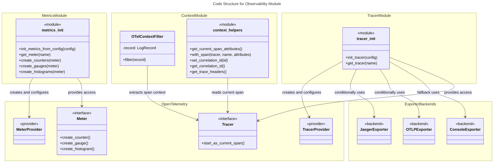
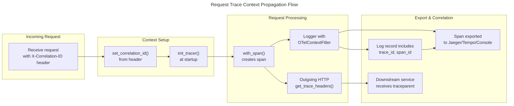
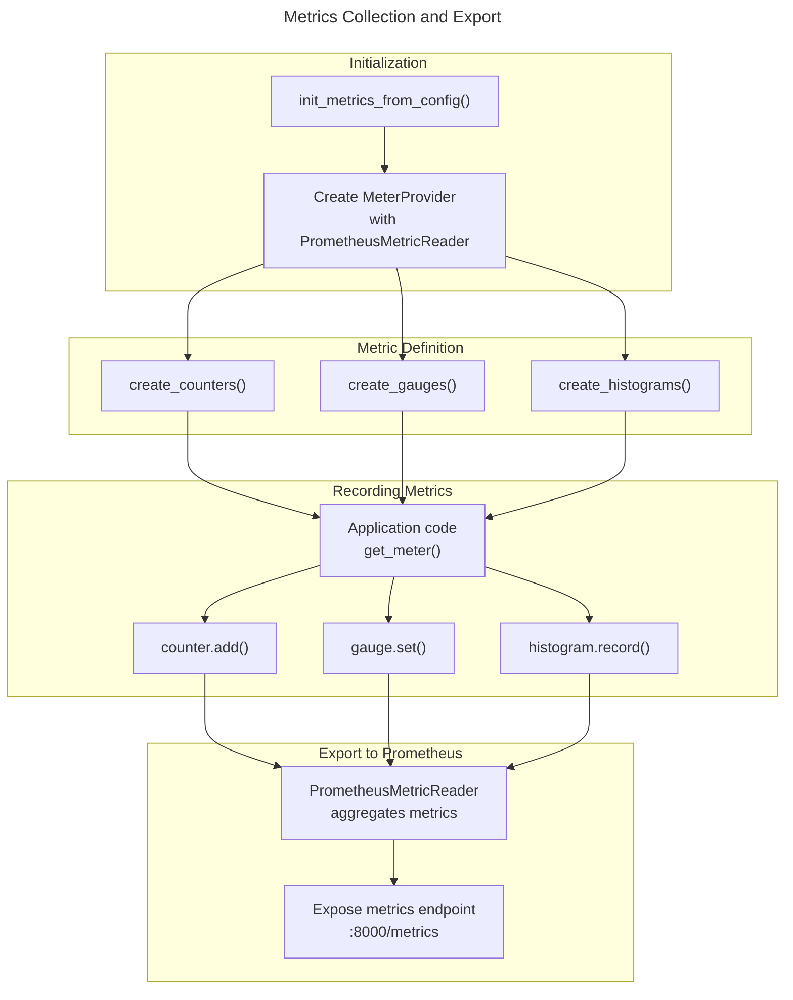
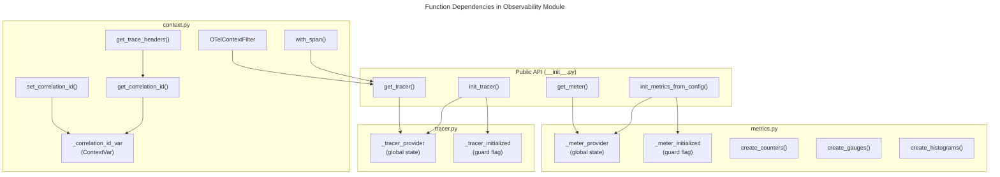

# C4 Code Level: Observability Module

## Overview

- **Name**: Observability Module
- **Description**: Comprehensive observability infrastructure for distributed tracing, metrics collection, and structured logging using OpenTelemetry standards
- **Location**: `finance_feedback_engine/observability/`
- **Language**: Python 3.9+
- **Purpose**: Provides centralized initialization and access to OpenTelemetry tracing (Jaeger/Tempo), Prometheus metrics, and trace context propagation for the finance feedback engine system. Enables request tracing across distributed components and comprehensive operational observability.

## Code Elements

### Module: __init__.py

**Location**: `finance_feedback_engine/observability/__init__.py`

Exports the public API for the observability module.

**Exported Functions**:
- `init_tracer(config: dict) -> None` - Initialize OpenTelemetry tracing
- `get_tracer(name: str, version: Optional[str] = None) -> trace.Tracer` - Get tracer instance
- `init_metrics_from_config(config: dict) -> None` - Initialize metrics collection
- `get_meter(name: str, version: Optional[str] = None) -> metrics.Meter` - Get meter instance

---

### Module: tracer.py

**Location**: `finance_feedback_engine/observability/tracer.py`

Handles OpenTelemetry tracing initialization with support for multiple backends (Jaeger, Tempo, Console).

#### Class: TracerProvider (Global State)

**Module-level Variables**:
- `_tracer_provider: Optional[TracerProvider] = None` - Global TracerProvider instance
- `_tracer_initialized: bool = False` - Initialization guard flag

#### Function: init_tracer

**Signature**:
```python
def init_tracer(config: dict) -> None
```

**Parameters**:
- `config: dict` - Configuration dictionary with keys:
  - `tracing.enabled: bool` (default: False) - Enable/disable tracing
  - `tracing.backend: str` (default: "console") - Backend type: "jaeger", "tempo", or "console"
  - `tracing.sample_rate: float` (default: 0.1) - Sampling rate (0.0-1.0)
  - `tracing.jaeger.agent_host: str` (default: "localhost") - Jaeger agent hostname
  - `tracing.jaeger.agent_port: int` (default: 6831) - Jaeger agent port
  - `tracing.otlp.endpoint: str` (default: "http://localhost:4317") - OTLP endpoint for Tempo
  - `service.name: str` (default: "finance_feedback_engine") - Service name
  - `service.version: str` (default: "0.9.9") - Service version
  - `environment: str` - Deployment environment

**Returns**: `None`

**Description**: 
Initializes global OpenTelemetry tracing infrastructure. Creates a TracerProvider with parent-based sampling (respects parent span decisions for child spans). Sets up span processors and exporters based on configured backend. Includes guard to prevent re-initialization.

**Backend Support**:
- **Jaeger**: Uses JaegerExporter with BatchSpanProcessor for async export
- **Tempo**: Uses OTLPSpanExporter via gRPC with BatchSpanProcessor for async export
- **Console**: Uses ConsoleSpanExporter with SimpleSpanProcessor for direct output (fallback if dependencies unavailable)

**Dependencies**:
- `opentelemetry.sdk.trace.TracerProvider` - Core tracer provider
- `opentelemetry.sdk.trace.sampling.ParentBasedTraceIdRatio` - Intelligent sampling strategy
- `opentelemetry.sdk.resources.Resource` - Service metadata
- `opentelemetry.exporter.jaeger.thrift.JaegerExporter` - Jaeger backend (conditional)
- `opentelemetry.exporter.otlp.proto.grpc.trace_exporter.OTLPSpanExporter` - Tempo backend (conditional)
- `opentelemetry.sdk.trace.export.ConsoleSpanExporter` - Console backend (fallback)
- `opentelemetry.sdk.trace.export.BatchSpanProcessor` - Async span export
- `opentelemetry.sdk.trace.export.SimpleSpanProcessor` - Synchronous span export

**Location**: Lines 10-95

---

#### Function: get_tracer

**Signature**:
```python
def get_tracer(name: str, version: Optional[str] = None) -> trace.Tracer
```

**Parameters**:
- `name: str` - Module name for instrumentation (typically `__name__`)
- `version: Optional[str]` (default: None) - Version string for instrumentation library

**Returns**: `trace.Tracer` - OpenTelemetry Tracer instance

**Description**: 
Retrieves a tracer instance for a given module. Handles version parameter compatibility across different OpenTelemetry versions by gracefully falling back if the version parameter is not accepted.

**Dependencies**:
- `opentelemetry.trace.get_tracer()` - Global tracer factory

**Location**: Lines 98-109

---

### Module: context.py

**Location**: `finance_feedback_engine/observability/context.py`

Provides OpenTelemetry context integration for logging, span management, and trace context propagation.

#### Class: OTelContextFilter

**Signature**: `class OTelContextFilter(logging.Filter)`

**Description**: 
Logging filter that injects OpenTelemetry trace context (trace_id and span_id) into Python log records for correlation.

**Methods**:

##### Method: filter

**Signature**:
```python
def filter(self, record: logging.LogRecord) -> bool
```

**Parameters**:
- `record: logging.LogRecord` - Log record to enhance

**Returns**: `bool` - Always returns True (allows record to be logged)

**Description**: 
Extracts current span context from OpenTelemetry and adds trace_id and span_id as hex-formatted fields to the log record. Enables log aggregation systems to correlate logs with traces.

**Location**: Lines 18-22

**Dependencies**:
- `opentelemetry.trace.get_current_span()` - Access current span context
- `logging.LogRecord` - Python logging module

---

#### Function: get_current_span_attributes

**Signature**:
```python
def get_current_span_attributes() -> Dict[str, Any]
```

**Parameters**: None

**Returns**: `Dict[str, Any]` - Dictionary with:
  - `trace_id: str` - Current trace ID in hex format (32 characters)
  - `span_id: str` - Current span ID in hex format (16 characters)

**Description**: 
Extracts and formats the current OpenTelemetry span context for use in application code. Useful for adding trace identifiers to request responses or structured log messages.

**Location**: Lines 26-36

**Dependencies**:
- `opentelemetry.trace.get_current_span()` - Access current span

---

#### Function: with_span

**Signature**:
```python
def with_span(
    tracer: Tracer,
    span_name: str,
    attributes: Optional[Dict[str, Any]] = None,
    **context_kwargs,
)
```

**Parameters**:
- `tracer: Tracer` - OpenTelemetry Tracer instance
- `span_name: str` - Name for the new span
- `attributes: Optional[Dict[str, Any]]` (default: None) - Dictionary of span attributes
- `**context_kwargs` - Additional attributes passed as keyword arguments (e.g., asset_pair="BTCUSD")

**Returns**: Context manager for span lifecycle

**Description**: 
Context manager that creates a new span with standard attributes. Merges provided attributes with context kwargs and starts the span. Useful for annotating specific code sections with operation names and metadata.

**Example Usage**:
```python
tracer = get_tracer(__name__)
with with_span(tracer, "core.analyze_asset", {"asset": "BTCUSD"}):
    # do work
    pass
```

**Location**: Lines 39-60

**Dependencies**:
- `opentelemetry.trace.Tracer` - Tracer type
- `opentelemetry.trace.Tracer.start_as_current_span()` - Span creation

---

#### Function: set_correlation_id

**Signature**:
```python
def set_correlation_id(correlation_id: str) -> None
```

**Parameters**:
- `correlation_id: str` - Unique correlation ID (typically from incoming request header)

**Returns**: `None`

**Description**: 
Sets the correlation ID for the current execution context. Uses Python's ContextVar for async-safe context isolation. Called when processing incoming requests to propagate the correlation ID through the request lifecycle.

**Location**: Lines 73-75

**Dependencies**:
- `contextvars.ContextVar.set()` - Context-aware variable storage

---

#### Function: clear_correlation_id

**Signature**:
```python
def clear_correlation_id() -> None
```

**Parameters**: None

**Returns**: `None`

**Description**: 
Clears the correlation ID from the current execution context. Useful for cleanup in request lifecycle management.

**Location**: Lines 78-80

**Dependencies**:
- `contextvars.ContextVar.set()` - Context-aware variable storage

---

#### Function: get_correlation_id

**Signature**:
```python
def get_correlation_id() -> str
```

**Parameters**: None

**Returns**: `str` - Correlation ID (UUID format if not already set)

**Description**: 
Retrieves the current correlation ID, generating a new UUID if none exists in the current context. Ensures every request/trace has a unique identifier for end-to-end tracing.

**Location**: Lines 83-93

**Dependencies**:
- `uuid.uuid4()` - Generate unique identifiers
- `contextvars.ContextVar.get()` - Retrieve context-aware variable

---

#### Function: get_trace_headers

**Signature**:
```python
def get_trace_headers() -> Dict[str, str]
```

**Parameters**: None

**Returns**: `Dict[str, str]` - HTTP headers for trace propagation:
  - `X-Correlation-ID: str` - Correlation ID (always present)
  - `traceparent: str` - W3C Trace Context format header (conditionally present)

**Description**: 
Generates HTTP headers for trace context propagation to external services. Includes correlation ID and W3C traceparent header (if a valid span context exists). Enables trace continuity when making requests to downstream services.

**W3C Trace Context Format**: 
```
traceparent: 00-{trace_id_hex}-{span_id_hex}-{sampled_flag}
```

**Location**: Lines 96-117

**Dependencies**:
- `opentelemetry.trace.get_current_span()` - Access current span context
- `opentelemetry.trace.TraceFlags.SAMPLED` - Check sampling flag

---

### Module: metrics.py

**Location**: `finance_feedback_engine/observability/metrics.py`

Handles OpenTelemetry metrics initialization with Prometheus exporter and creation of application-specific metrics.

#### Module-level Variables

- `_meter_provider: Optional[MeterProvider] = None` - Global MeterProvider instance
- `_meter_initialized: bool = False` - Initialization guard flag

---

#### Function: init_metrics_from_config

**Signature**:
```python
def init_metrics_from_config(config: dict) -> None
```

**Parameters**:
- `config: dict` - Configuration dictionary with keys:
  - `metrics.enabled: bool` (default: True) - Enable/disable metrics
  - `metrics.prometheus_port: int` (default: 8000) - Port for Prometheus metrics endpoint
  - `service.name: str` - Service name
  - `service.version: str` (default: "2.0.0") - Service version

**Returns**: `None`

**Description**: 
Initializes global OpenTelemetry metrics infrastructure with Prometheus exporter. Creates a MeterProvider with PrometheusMetricReader. Includes guard to prevent re-initialization and graceful fallback to noop provider if initialization fails.

**Dependencies**:
- `opentelemetry.sdk.metrics.MeterProvider` - Core metrics provider
- `opentelemetry.exporter.prometheus.PrometheusMetricReader` - Prometheus integration
- `opentelemetry.sdk.resources.Resource` - Service metadata

**Location**: Lines 13-50

---

#### Function: get_meter

**Signature**:
```python
def get_meter(name: str, version: Optional[str] = None) -> metrics.Meter
```

**Parameters**:
- `name: str` - Module name for instrumentation
- `version: Optional[str]` (default: None) - Version string for instrumentation library

**Returns**: `metrics.Meter` - OpenTelemetry Meter instance

**Description**: 
Retrieves a meter instance for a given module. Used to create counters, gauges, and histograms for application metrics.

**Location**: Lines 53-62

**Dependencies**:
- `opentelemetry.metrics.get_meter()` - Global meter factory

---

#### Function: create_counters

**Signature**:
```python
def create_counters(meter: metrics.Meter) -> dict
```

**Parameters**:
- `meter: metrics.Meter` - Meter instance for creating counters

**Returns**: `dict` - Dictionary mapping counter names to Counter objects

**Description**: 
Creates standard monotonically increasing counters for the finance feedback engine. Each counter tracks cumulative events (decisions created, executed, trades completed, etc.).

**Counters Created**:

| Counter | Name | Description |
|---------|------|-------------|
| `ffe_decisions_created_total` | Total decisions created | Count of decision generation events |
| `ffe_decisions_executed_total` | Total decisions executed | Count of decision execution events |
| `ffe_ensemble_provider_requests_total` | Total provider queries | Count of queries to ensemble decision providers |
| `ffe_ensemble_provider_failures_total` | Total provider failures | Count of failures when querying providers |
| `ffe_risk_blocks_total` | Total risk blocks | Count of trades blocked by risk gatekeeper |
| `ffe_circuit_breaker_opens_total` | Total circuit breaker openings | Count of circuit breaker state transitions to open |
| `ffe_trades_executed_total` | Total trades executed | Count of trades sent to execution |

**Location**: Lines 65-103

**Dependencies**:
- `metrics.Meter.create_counter()` - Counter creation

---

#### Function: create_gauges

**Signature**:
```python
def create_gauges(meter: metrics.Meter) -> dict
```

**Parameters**:
- `meter: metrics.Meter` - Meter instance for creating gauges

**Returns**: `dict` - Dictionary mapping gauge names to ObservableGauge objects

**Description**: 
Creates observable gauges for point-in-time measurements of system state. Gauges represent values that can increase or decrease (e.g., active positions, portfolio value).

**Gauges Created**:

| Gauge | Name | Description | Unit |
|-------|------|-------------|------|
| `ffe_agent_state` | Agent state | Current state code: 0=IDLE, 1=LEARNING, 2=PERCEPTION, 3=REASONING, 4=RISK_CHECK, 5=EXECUTION | dimensionless |
| `ffe_active_positions` | Active positions | Count of currently open trading positions | dimensionless |
| `ffe_portfolio_value_usd` | Portfolio value | Total portfolio market value | USD |
| `ffe_circuit_breaker_state` | Circuit breaker state | Current state: 0=closed (normal), 1=open (halted) | dimensionless |

**Location**: Lines 106-138

**Dependencies**:
- `metrics.Meter.create_observable_gauge()` - Observable gauge creation

---

#### Function: create_histograms

**Signature**:
```python
def create_histograms(meter: metrics.Meter) -> dict
```

**Parameters**:
- `meter: metrics.Meter` - Meter instance for creating histograms

**Returns**: `dict` - Dictionary mapping histogram names to Histogram objects

**Description**: 
Creates histograms for distribution analysis of latency and performance metrics. Histograms bucket values for percentile analysis and automatic aggregation.

**Histograms Created**:

| Histogram | Name | Description | Unit |
|-----------|------|-------------|------|
| `ffe_provider_query_latency_seconds` | Provider query latency | Response time for provider API calls | seconds |
| `ffe_execution_latency_seconds` | Trade execution latency | Time from decision to order submission | seconds |
| `ffe_pnl_percentage` | P&L percentage | Profit/loss percentage on closed trades | percentage |

**Location**: Lines 141-166

**Dependencies**:
- `metrics.Meter.create_histogram()` - Histogram creation

---

## Dependencies

### Internal Dependencies

- **No internal code dependencies** - The observability module has no dependencies on other finance_feedback_engine modules. It is designed as a foundational infrastructure layer.

### External Dependencies

#### OpenTelemetry Core
- `opentelemetry` - OpenTelemetry API and SDK
  - `opentelemetry.trace` - Tracing API (context, tracer factory)
  - `opentelemetry.metrics` - Metrics API (meter factory)
  - `opentelemetry.sdk.trace` - Tracing SDK (TracerProvider, span processors)
  - `opentelemetry.sdk.metrics` - Metrics SDK (MeterProvider)
  - `opentelemetry.sdk.resources` - Resource API (service metadata)
  - `opentelemetry.sdk.trace.sampling` - Trace sampling strategies

#### Exporters (Conditional)
- `opentelemetry.exporter.jaeger.thrift` - Jaeger exporter (optional, backend-specific)
- `opentelemetry.exporter.otlp.proto.grpc.trace_exporter` - OTLP/gRPC exporter for Tempo (optional, backend-specific)
- `opentelemetry.exporter.prometheus` - Prometheus metrics exporter

#### Python Standard Library
- `logging` - Python logging framework
- `typing` - Type hints (Optional, Dict, Any)
- `uuid` - UUID generation for correlation IDs
- `threading` - Thread-local storage (legacy, replaced by ContextVar)
- `contextvars` - Async-safe context variables for correlation ID propagation

### Dependency Injection Pattern

The observability module uses **initialization pattern** where:
1. Configuration-based setup called once at application startup (`init_tracer()`, `init_metrics_from_config()`)
2. Module-level global state manages singleton instances (`_tracer_provider`, `_meter_provider`)
3. Getter functions provide access to instances (`get_tracer()`, `get_meter()`)
4. Context managers and context functions manage request-scoped data (correlation IDs)

---

## Relationships

### High-Level Architecture



### Data Flow: Request Tracing



### Metrics Collection Flow



### Module Dependency Graph



---

## Configuration Integration

The observability module is configured through a dictionary-based configuration object (typically loaded from config files/environment variables). Key configuration sections:

### Tracing Configuration

```python
config = {
    "tracing": {
        "enabled": True,                    # Enable/disable tracing
        "backend": "jaeger",                # "jaeger", "tempo", or "console"
        "sample_rate": 0.1,                 # Sample 10% of traces
        "jaeger": {
            "agent_host": "localhost",      # Jaeger agent hostname
            "agent_port": 6831              # Jaeger agent port
        },
        "otlp": {
            "endpoint": "http://localhost:4317"  # Tempo OTLP endpoint
        }
    },
    "service": {
        "name": "finance_feedback_engine",
        "version": "2.0.0"
    },
    "environment": "production"
}
```

### Metrics Configuration

```python
config = {
    "metrics": {
        "enabled": True,                    # Enable/disable metrics
        "prometheus_port": 8000             # Port for metrics endpoint
    },
    "service": {
        "name": "finance_feedback_engine",
        "version": "2.0.0"
    }
}
```

---

## Usage Patterns

### Basic Setup at Application Startup

```python
from finance_feedback_engine.observability import init_tracer, init_metrics_from_config

# Load configuration
config = load_config()

# Initialize observability
init_tracer(config)
init_metrics_from_config(config)
```

### Creating Spans in Code

```python
from finance_feedback_engine.observability import get_tracer
from finance_feedback_engine.observability.context import with_span

tracer = get_tracer(__name__)

# Using context manager
with with_span(tracer, "analyze_asset", {"asset": "BTCUSD"}):
    result = analyze_asset("BTCUSD")
```

### Propagating Trace Context to External Services

```python
from finance_feedback_engine.observability.context import get_trace_headers
import requests

# When making external HTTP request
headers = get_trace_headers()
response = requests.post(
    "https://api.external-service.com/quote",
    headers=headers,
    json={"symbol": "BTCUSD"}
)
```

### Recording Metrics

```python
from finance_feedback_engine.observability import get_meter
from finance_feedback_engine.observability.metrics import create_counters

meter = get_meter(__name__)
counters = create_counters(meter)

# Record a decision creation event
counters["ffe_decisions_created_total"].add(1, {"decision_type": "ensemble"})
```

### Structured Logging with Trace Context

```python
import logging
from finance_feedback_engine.observability.context import OTelContextFilter

logger = logging.getLogger(__name__)
logger.addFilter(OTelContextFilter())

# Logs now include trace_id and span_id for correlation
logger.info("Processing trade signal", extra={"asset": "BTCUSD"})
```

---

## Technical Details

### Sampling Strategy

The module uses `ParentBasedTraceIdRatio` sampler, which implements intelligent trace sampling:
- **Parent span exists**: Respects parent's sampling decision (ensures child spans follow parent context)
- **Root span (no parent)**: Uses trace ID ratio-based deterministic sampling
- **Default rate**: 10% (0.1) of traces sampled by default
- **Benefit**: Reduces observability infrastructure load while maintaining trace coherence

### Span Context Propagation

Two mechanisms for cross-service trace propagation:

1. **HTTP Headers** (W3C Trace Context standard):
   - `traceparent`: W3C standard format for trace context
   - `X-Correlation-ID`: Custom correlation ID for legacy systems

2. **Context Variables** (async-safe):
   - Uses Python's `contextvars.ContextVar` for async context isolation
   - Enables propagation through async/await code without explicit passing

### Metrics Export

Prometheus exporter aggregates metrics and exposes them via HTTP endpoint. Typical setup:
- Prometheus server scrapes `/metrics` endpoint
- Grafana visualizes metrics from Prometheus
- Alerts configured based on metric thresholds

### Logging Integration

OTelContextFilter bridges Python logging and OpenTelemetry:
- Each log record augmented with span context
- Log aggregation systems (ELK, Datadog) can correlate logs and traces
- Enables unified observability across logs, traces, and metrics

---

## Notes

- **Thread-safe**: Uses `contextvars` for async-safe context management instead of thread-local storage
- **Graceful degradation**: Falls back to console exporter if backend-specific libraries unavailable
- **Initialization guard**: Prevents accidental re-initialization of global providers
- **No direct external calls**: Module is purely infrastructure, called only during startup and by application code
- **Vendor-neutral**: Uses OpenTelemetry standard API, independent of specific backend choice
- **Configuration-driven**: All behavior controlled via configuration dictionary, suitable for 12-factor app principles
