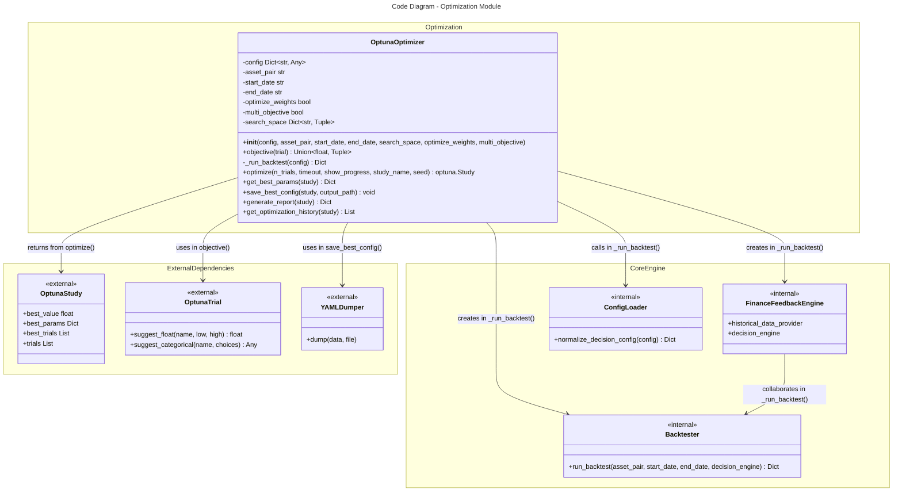
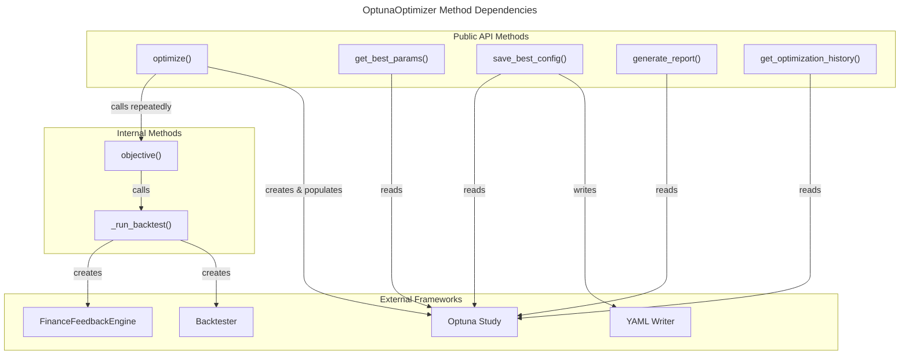

# C4 Code Level: Optimization Module

## Overview

- **Name**: Hyperparameter Optimization Engine
- **Description**: Optuna-based hyperparameter optimization module for trading strategy parameter tuning
- **Location**: `finance_feedback_engine/optimization/`
- **Language**: Python 3.10+
- **Purpose**: Provides automated hyperparameter optimization capabilities for trading strategies using Optuna's Bayesian optimization sampler. Optimizes critical trading parameters (risk per trade, stop loss percentages, ensemble voting strategies, and provider weights) to maximize trading performance metrics (Sharpe ratio, drawdown) across single and multi-objective optimization scenarios.

## Code Elements

### Classes

#### OptunaOptimizer

**Location**: `finance_feedback_engine/optimization/optuna_optimizer.py` (lines 13-412)

**Description**: Main optimizer class that orchestrates hyperparameter optimization for trading strategies using Optuna framework. Supports single-objective optimization (Sharpe ratio maximization) and multi-objective optimization (Sharpe + drawdown). Can optimize risk parameters, stop loss percentages, voting strategies, and ensemble provider weights.

**Constructor**:
```python
def __init__(
    self,
    config: Dict[str, Any],
    asset_pair: str,
    start_date: str,
    end_date: str,
    search_space: Optional[Dict[str, Tuple[float, float]]] = None,
    optimize_weights: bool = False,
    multi_objective: bool = False,
) -> None
```

**Parameters**:
- `config` (Dict[str, Any]): Base configuration dictionary for trading engine
- `asset_pair` (str): Asset pair identifier (e.g., 'BTCUSD', 'EURUSD')
- `start_date` (str): Backtest start date in YYYY-MM-DD format
- `end_date` (str): Backtest end date in YYYY-MM-DD format
- `search_space` (Optional[Dict[str, Tuple[float, float]]]): Custom parameter search space ranges. Defaults to risk_per_trade (0.005-0.03) and stop_loss_percentage (0.01-0.05)
- `optimize_weights` (bool): Enable ensemble provider weights optimization. Default False
- `multi_objective` (bool): Enable multi-objective optimization (Sharpe + drawdown). Default False

**Instance Attributes**:
- `config` (Dict[str, Any]): Deep copy of input configuration
- `asset_pair` (str): Asset pair for optimization
- `start_date` (str): Backtest start date
- `end_date` (str): Backtest end date
- `optimize_weights` (bool): Provider weights optimization flag
- `multi_objective` (bool): Multi-objective optimization flag
- `search_space` (Dict[str, Tuple[float, float]]): Parameter search space ranges

**Methods**:

##### objective()
```python
def objective(self, trial: optuna.Trial) -> Union[float, Tuple[float, float]]
```
- **Description**: Objective function for Optuna optimization loop. Suggests trial hyperparameters, runs backtest with trial config, and returns optimization metrics
- **Parameters**:
  - `trial` (optuna.Trial): Optuna trial object for parameter suggestion
- **Return Type**: Union[float, Tuple[float, float]]
  - Single objective: Returns float (Sharpe ratio value)
  - Multi-objective: Returns tuple (Sharpe ratio, negative drawdown magnitude)
- **Location**: Lines 65-144
- **Dependencies**:
  - optuna.Trial (external)
  - deepcopy from copy (standard library)
  - _run_backtest (internal method)
- **Notes**:
  - Suggests risk_per_trade and stop_loss_percentage from search space
  - Optionally suggests voting_strategy from ["weighted", "majority", "stacking"]
  - If optimize_weights enabled, suggests normalized provider weights
  - Handles missing metrics gracefully with default -10.0 Sharpe ratio on errors

##### _run_backtest()
```python
def _run_backtest(self, config: Dict[str, Any]) -> Dict[str, Any]
```
- **Description**: Executes backtest with given trial configuration. Initializes FinanceFeedbackEngine and Backtester, runs backtest simulation, and returns results with performance metrics
- **Parameters**:
  - `config` (Dict[str, Any]): Configuration dictionary with trial-optimized parameters
- **Return Type**: Dict[str, Any]
  - Returns dict with structure: {"metrics": {"sharpe_ratio": float, "max_drawdown_pct": float, ...}, "trades": List}
  - On error: Returns error dict with sharpe_ratio=-10.0 and max_drawdown_pct=-100.0
- **Location**: Lines 146-237
- **Dependencies**:
  - asyncio (standard library)
  - Backtester from finance_feedback_engine.backtesting.backtester (internal)
  - FinanceFeedbackEngine from finance_feedback_engine.core (internal)
  - normalize_decision_config from finance_feedback_engine.utils.config_loader (internal)
- **Notes**:
  - Sets is_backtest=True in config
  - Extracts backtest parameters from advanced_backtesting config section
  - Normalizes decision_engine config for consistency
  - Implements careful async cleanup with fallback error handling
  - Catches all exceptions and returns penalized metrics

##### optimize()
```python
def optimize(
    self,
    n_trials: int = 50,
    timeout: Optional[int] = None,
    show_progress: bool = True,
    study_name: Optional[str] = None,
    seed: Optional[int] = None,
) -> optuna.Study
```
- **Description**: Main optimization entry point. Creates Optuna study with appropriate settings and runs optimization trials
- **Parameters**:
  - `n_trials` (int): Number of optimization trials. Default 50
  - `timeout` (Optional[int]): Timeout in seconds. None for no timeout. Default None
  - `show_progress` (bool): Display progress bar. Default True
  - `study_name` (Optional[str]): Name for Optuna study for persistence. Default f"optuna_{asset_pair}"
  - `seed` (Optional[int]): Random seed for reproducible sampling. Default None
- **Return Type**: optuna.Study - Completed Optuna study with all trials
- **Location**: Lines 239-289
- **Dependencies**:
  - optuna (external)
  - objective method (internal)
- **Notes**:
  - Uses TPESampler (Tree-structured Parzen Estimator) for efficient Bayesian optimization
  - Creates multi-objective study (maximize Sharpe and -drawdown) if multi_objective=True
  - Logs optimization completion and best value/params to logger
  - Logs Pareto-optimal solutions for multi-objective case

##### get_best_params()
```python
def get_best_params(self, study: optuna.Study) -> Dict[str, Any]
```
- **Description**: Extracts best hyperparameters from completed optimization study
- **Parameters**:
  - `study` (optuna.Study): Completed Optuna study from optimize()
- **Return Type**: Dict[str, Any]
  - Single objective: Returns study.best_params dict with optimal parameter values
  - Multi-objective: Returns {"pareto_optimal": [List of param dicts for Pareto-optimal trials]}
- **Location**: Lines 291-305
- **Dependencies**:
  - optuna.Study (external)

##### save_best_config()
```python
def save_best_config(self, study: optuna.Study, output_path: str) -> None
```
- **Description**: Saves optimized configuration with best parameters to YAML file for later use
- **Parameters**:
  - `study` (optuna.Study): Completed Optuna study with results
  - `output_path` (str): File path for output YAML configuration file
- **Return Type**: None
- **Location**: Lines 307-353
- **Dependencies**:
  - yaml (external)
  - deepcopy from copy (standard library)
- **Notes**:
  - Deep copies base config to preserve original
  - Updates decision_engine section with risk_per_trade and stop_loss_percentage
  - Updates ensemble section with voting_strategy and provider_weights
  - Normalizes weights to sum to 1.0 for multi-objective case
  - Uses first best_trial params for multi-objective optimization
  - Logs output path to logger

##### generate_report()
```python
def generate_report(self, study: optuna.Study) -> Dict[str, Any]
```
- **Description**: Generates human-readable optimization summary report with key metrics and results
- **Parameters**:
  - `study` (optuna.Study): Completed Optuna study
- **Return Type**: Dict[str, Any] with structure:
  ```python
  {
      "asset_pair": str,
      "date_range": str,
      "n_trials": int,
      "multi_objective": bool,
      # For single-objective:
      "best_value": float,
      "best_params": Dict[str, Any],
      # For multi-objective:
      "n_pareto_optimal": int,
      "best_trials": List[{"params": Dict, "values": Tuple}]
  }
  ```
- **Location**: Lines 355-385
- **Dependencies**:
  - optuna.Study (external)

##### get_optimization_history()
```python
def get_optimization_history(self, study: optuna.Study) -> List[Dict[str, Any]]
```
- **Description**: Extracts complete optimization trial history from study for analysis and visualization
- **Parameters**:
  - `study` (optuna.Study): Completed Optuna study
- **Return Type**: List[Dict[str, Any]] - List of trial records with structure:
  ```python
  [
      {
          "number": int,
          "params": Dict[str, Any],
          "state": str,
          "value": Optional[float],        # For single-objective
          "values": Optional[Tuple[float]] # For multi-objective
      },
      ...
  ]
  ```
- **Location**: Lines 387-412
- **Dependencies**:
  - optuna.Study (external)

### Module-Level Exports

**Location**: `finance_feedback_engine/optimization/__init__.py`

```python
from finance_feedback_engine.optimization.optuna_optimizer import OptunaOptimizer

__all__ = ["OptunaOptimizer"]
```

**Purpose**: Module initialization that exports OptunaOptimizer as the public API for the optimization module.

## Dependencies

### Internal Dependencies

#### Direct Imports (Dynamic/Runtime)
- `finance_feedback_engine.backtesting.backtester.Backtester` - Used in _run_backtest() to execute backtests with trial parameters
- `finance_feedback_engine.core.FinanceFeedbackEngine` - Used in _run_backtest() to initialize the main trading engine with trial config
- `finance_feedback_engine.utils.config_loader.normalize_decision_config` - Used in _run_backtest() to normalize decision_engine configuration

#### Indirect Dependencies (via FinanceFeedbackEngine)
- Decision engine components for strategy decision making
- Historical data providers for market data
- Ensemble components for voting strategy management

### External Dependencies

#### Core Optimization
- **optuna** (>=4.2.0) - Hyperparameter optimization framework with Bayesian sampling, multi-objective optimization, and study management

#### Configuration & Serialization
- **pyyaml** (>=6.0.2) - YAML file format support for saving/loading configurations
- **copy** (standard library) - deepcopy() for safe configuration copying

#### System & Logging
- **logging** (standard library) - Logger configuration and event logging
- **asyncio** (standard library) - Async runtime for engine cleanup
- **typing** (standard library) - Type hints (Any, Dict, List, Optional, Tuple, Union)

#### Dependency Graph

```
OptunaOptimizer
├── optuna (external - core optimization framework)
├── yaml (external - config serialization)
├── FinanceFeedbackEngine (internal - @runtime in _run_backtest)
│   └── [backtesting, ensemble, decision_engine, historical_data]
├── Backtester (internal - @runtime in _run_backtest)
│   └── [historical_data_provider, decision_engine]
└── normalize_decision_config (internal - @runtime in _run_backtest)
    └── [config normalization utilities]
```

## Relationships

### Code-Level Architecture Diagram



### Optimization Workflow Diagram

```mermaid
---
title: Optimization Workflow - Single Trial Execution
---
flowchart LR
    subgraph Trial["Trial Execution Loop"]
        A["objective() invoked<br/>by Optuna"] -->|creates| B["Trial Config<br/>from base config"]
        B -->|suggests| C["Risk Parameters<br/>risk_per_trade<br/>stop_loss_percentage"]
        C -->|suggests| D["Voting Strategy<br/>weighted/majority/stacking"]
        D -->|conditional| E["Provider Weights<br/>if optimize_weights"]
        E -->|applies| F["Updated Trial Config"]
    end

    subgraph Backtest["Backtest Execution"]
        F -->|passes to| G["_run_backtest()"]
        G -->|creates| H["FinanceFeedbackEngine"]
        G -->|creates| I["Backtester Instance"]
        H -->|provides| I
        I -->|runs| J["Historical Backtest<br/>asset_pair, dates"]
        J -->|returns| K["Backtest Results<br/>metrics, trades"]
    end

    subgraph Metrics["Metric Extraction"]
        K -->|extracts| L["Sharpe Ratio"]
        K -->|extracts| M["Max Drawdown %"]
        L -->|returns<br/>single-obj| N["Optimize Return<br/>Sharpe value"]
        M -->|returns<br/>multi-obj| O["Optimize Return<br/>Sharpe, -drawdown"]
    end

    Metrics -->|feedback| P["Optuna TPE Sampler"]
```



### Function Dependency Graph



### Parameter Optimization Space

The optimization module supports optimizing these trading parameters:

```
Search Space Ranges (Default)
├── risk_per_trade: [0.005, 0.03]
│   └── Optimizes position sizing for each trade
├── stop_loss_percentage: [0.01, 0.05]
│   └── Optimizes risk containment per position
├── voting_strategy: [weighted, majority, stacking]
│   └── Ensemble decision strategy selection
└── provider_weights: [Normalized Dirichlet]
    └── Ensemble provider contribution weights (optional)
```

## Design Patterns

### 1. Wrapper Pattern
OptunaOptimizer wraps Optuna's Study and Trial APIs to provide domain-specific (trading) hyperparameter optimization with simplified interface.

### 2. Strategy Pattern
Supports multiple optimization strategies:
- Single-objective (maximize Sharpe ratio)
- Multi-objective (maximize Sharpe and minimize drawdown simultaneously)

### 3. Template Method Pattern
The optimize() method provides the template for running optimization loop, with objective() as the customizable callback for individual trial evaluations.

### 4. Factory Pattern
_run_backtest() acts as a factory creating FinanceFeedbackEngine and Backtester instances configured for trial parameters.

## Key Features

1. **Bayesian Optimization**: Uses Optuna's TPE (Tree-structured Parzen Estimator) sampler for efficient parameter exploration
2. **Multi-Objective Optimization**: Support for Pareto-optimal solutions balancing Sharpe ratio and maximum drawdown
3. **Ensemble Weight Optimization**: Optional optimization of individual provider weights with Dirichlet-inspired normalization
4. **Flexible Search Space**: Customizable parameter ranges and suggestion strategies
5. **Error Resilience**: Graceful handling of backtest failures with penalized metrics
6. **Configuration Persistence**: Save optimized configurations as YAML for reproducibility
7. **Comprehensive Reporting**: Generates optimization reports and trial history for analysis
8. **Async Cleanup**: Proper async resource management with fallback error handling

## Integration Points

### Used By
- CLI commands for strategy optimization (entry points)
- Workflow orchestration systems for automated tuning
- Backtesting and validation pipelines

### Uses
- FinanceFeedbackEngine for strategy execution
- Backtester for historical performance evaluation
- Configuration utilities for parameter normalization
- Optuna framework for optimization algorithms

## Configuration Schema

The optimization module expects configuration with these sections:

```yaml
decision_engine:
  risk_per_trade: float        # Can be optimized
  stop_loss_percentage: float  # Can be optimized

ensemble:
  voting_strategy: str                    # Can be optimized
  enabled_providers: List[str]           # For weight optimization
  provider_weights: Dict[str, float]     # Can be optimized

advanced_backtesting:
  initial_balance: float       # Default 10000.0
  fee_percentage: float        # Default 0.001
  slippage_percentage: float   # Default 0.0001
  commission_per_trade: float  # Default 0.0
  timeframe: str              # Default "1h"
  take_profit_percentage: float # Default 0.05
```

## Error Handling

The module implements comprehensive error handling:

1. **Backtest Failures**: Returns penalized metrics (sharpe_ratio=-10.0, max_drawdown_pct=-100.0) to discourage optimization toward failed configurations
2. **Async Cleanup**: Fallback error handling for event loop cleanup if in active loop
3. **Missing Metrics**: Defaults to -10.0 for missing sharpe_ratio
4. **Type Conversion**: Safe float conversion with defaults for invalid metric values
5. **Configuration Normalization**: Fallback to legacy config access if normalization fails

## Notes

- Optimization runs are computationally expensive (each trial runs a complete backtest)
- Multi-objective optimization produces Pareto-optimal solutions rather than single best solution
- Provider weight optimization uses normalized Dirichlet-inspired approach to maintain sum=1.0 constraint
- Random seed should be set for reproducible results across optimization runs
- Study names can enable persistence and continuation of optimization across sessions
