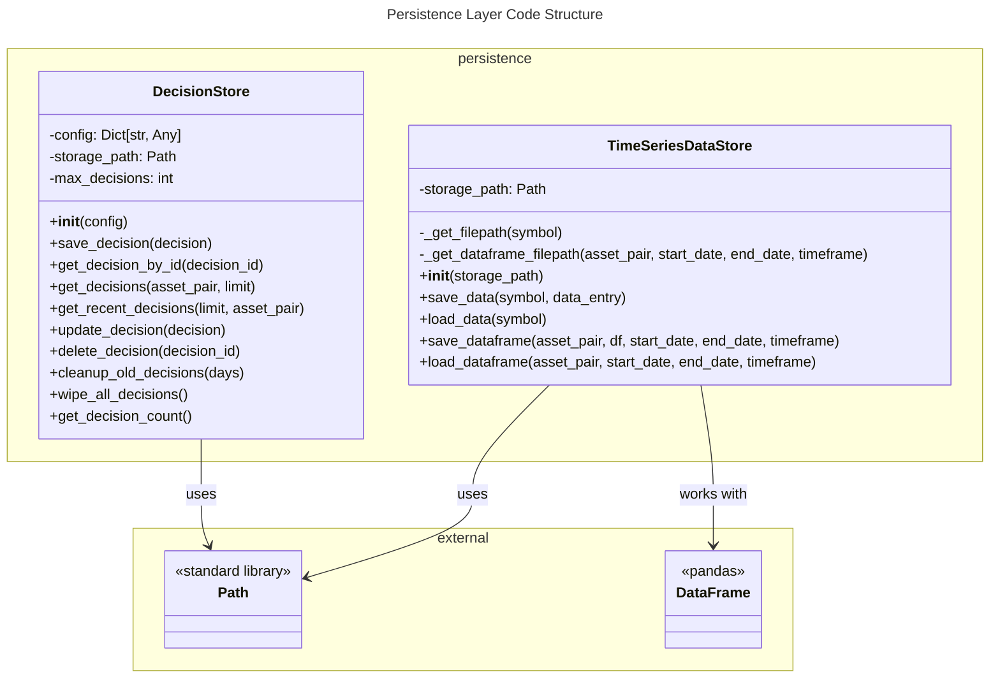

# C4 Code Level: Persistence Layer

## Overview

- **Name**: Persistence Layer
- **Description**: File-based storage system for trading decisions and time-series market data. Provides abstraction over JSON and Parquet file formats with CRUD operations for decision tracking and efficient time-series data management.
- **Location**: `finance_feedback_engine/persistence`
- **Language**: Python 3.8+
- **Purpose**: Manages persistent storage of trading decisions and historical OHLCV market data, enabling decision audit trails, backtesting capabilities, and efficient data retrieval for analysis.

## Code Elements

### Classes

#### DecisionStore
- **Description**: Manages persistent storage and retrieval of trading decisions using JSON files. Provides CRUD operations, filtering, and maintenance capabilities for decision audit trails.
- **Location**: `finance_feedback_engine/persistence/decision_store.py` (lines 12-245)
- **Responsibilities**:
  - Store trading decisions to disk in JSON format
  - Retrieve decisions by ID or filter by asset pair
  - Update existing decisions or delete them
  - Maintain decision history and implement cleanup policies
  - Log all operations

**Methods**:

1. `__init__(config: Dict[str, Any]) -> None`
   - Location: lines 19-35
   - Description: Initialize decision store with configuration
   - Parameters:
     - `config`: Configuration dictionary containing `storage_path` and `max_decisions`
   - Creates storage directory if it doesn't exist
   - Dependencies: pathlib.Path, logging

2. `save_decision(decision: Dict[str, Any]) -> None`
   - Location: lines 37-61
   - Description: Save a single trading decision to persistent storage as a JSON file
   - Parameters:
     - `decision`: Decision dictionary with required 'id' field
   - File naming: `{date}_{decision_id}.json`
   - Error handling: Logs errors if decision lacks ID or write fails
   - Dependencies: json, datetime, logging

3. `get_decision_by_id(decision_id: str) -> Optional[Dict[str, Any]]`
   - Location: lines 63-82
   - Description: Retrieve a specific decision by its ID
   - Parameters:
     - `decision_id`: Unique identifier for the decision
   - Returns: Decision dictionary or None if not found
   - Searches file system using glob pattern
   - Dependencies: json, logging

4. `get_decisions(asset_pair: Optional[str] = None, limit: int = 10) -> List[Dict[str, Any]]`
   - Location: lines 84-123
   - Description: Retrieve recent trading decisions with optional filtering
   - Parameters:
     - `asset_pair`: Filter decisions by asset pair (optional)
     - `limit`: Maximum number of decisions to return (default: 10)
   - Returns: List of decisions sorted by modification time (newest first)
   - Implementation: Scans storage directory, sorts by mtime, applies limit
   - Dependencies: json, logging, pathlib

5. `get_recent_decisions(limit: int = 10, asset_pair: Optional[str] = None) -> List[Dict[str, Any]]`
   - Location: lines 125-139
   - Description: Convenience method for retrieving most recent decisions
   - Parameters:
     - `limit`: Maximum number to return (default: 10)
     - `asset_pair`: Optional asset pair filter
   - Returns: List of recent decisions
   - Implementation: Wrapper around get_decisions()

6. `update_decision(decision: Dict[str, Any]) -> None`
   - Location: lines 141-165
   - Description: Update an existing decision or save as new if not found
   - Parameters:
     - `decision`: Updated decision dictionary with 'id' field
   - Error handling: Logs if ID missing; saves as new if not found
   - Dependencies: json, logging

7. `delete_decision(decision_id: str) -> bool`
   - Location: lines 167-187
   - Description: Delete a decision by ID
   - Parameters:
     - `decision_id`: ID of decision to delete
   - Returns: True if deleted, False if not found or error occurred
   - Filesystem operation: Unlinks (deletes) matching JSON file
   - Dependencies: logging

8. `cleanup_old_decisions(days: int = 30) -> int`
   - Location: lines 189-216
   - Description: Remove decisions older than specified number of days
   - Parameters:
     - `days`: Number of days to retain (default: 30)
   - Returns: Count of deleted decisions
   - Implementation: Checks file modification time against cutoff date
   - Dependencies: datetime.timedelta, logging

9. `wipe_all_decisions() -> int`
   - Location: lines 218-235
   - Description: Delete all stored decisions
   - Returns: Count of deleted decisions
   - Use case: Full reset of decision history
   - Dependencies: logging

10. `get_decision_count() -> int`
    - Location: lines 237-244
    - Description: Get total count of stored decisions
    - Returns: Integer count of JSON files in storage
    - Implementation: Uses pathlib glob

---

#### TimeSeriesDataStore
- **Description**: Manages persistence of time-series market data in two formats: JSONL for individual entries and Parquet for DataFrame storage. Provides efficient append-only writes and atomic DataFrame operations.
- **Location**: `finance_feedback_engine/persistence/timeseries_data_store.py` (lines 13-174)
- **Responsibilities**:
  - Store individual time-series data points in JSONL format (append-only)
  - Load complete time-series datasets for symbols
  - Store historical OHLCV DataFrames in Parquet format
  - Load DataFrames with proper datetime indexing
  - Handle concurrent writes through append-only semantics

**Methods**:

1. `__init__(storage_path: str = "data/time_series_data") -> None`
   - Location: lines 22-24
   - Description: Initialize time-series data store
   - Parameters:
     - `storage_path`: Base directory for storing data (default: "data/time_series_data")
   - Creates storage directory if it doesn't exist
   - Dependencies: pathlib.Path

2. `_get_filepath(symbol: str) -> str`
   - Location: lines 26-28
   - Description: Generate file path for JSONL time-series data
   - Parameters:
     - `symbol`: Trading symbol (e.g., "BTCUSD", "IBM")
   - Returns: File path string for JSONL file
   - Implementation: Converts symbol to lowercase, appends "_timeseries.jsonl"
   - Dependencies: os.path.join

3. `_get_dataframe_filepath(asset_pair: str, start_date: datetime, end_date: datetime, timeframe: str) -> Path`
   - Location: lines 30-48
   - Description: Generate file path for Parquet DataFrame storage
   - Parameters:
     - `asset_pair`: Asset pair symbol
     - `start_date`: Start date for data range
     - `end_date`: End date for data range
     - `timeframe`: Candlestick timeframe (e.g., "1h", "1d")
   - Returns: Path object for Parquet file
   - File naming: `{asset_pair}_{timeframe}_{start_date}_{end_date}.parquet`
   - Dependencies: pathlib.Path

4. `save_data(symbol: str, data_entry: Dict[str, Any]) -> None`
   - Location: lines 50-72
   - Description: Append a single time-series data entry in JSONL format
   - Parameters:
     - `symbol`: Trading symbol
     - `data_entry`: Dictionary with time-series data (must contain 'timestamp')
   - Implementation: Opens file in append mode, writes JSON-serialized entry + newline
   - Handles datetime serialization: Converts datetime objects to ISO format strings
   - Concurrency: JSONL format eliminates race conditions in multi-process writes
   - Dependencies: json, datetime, logging

5. `load_data(symbol: str) -> List[Dict[str, Any]]`
   - Location: lines 74-100
   - Description: Load all time-series data entries for a symbol
   - Parameters:
     - `symbol`: Trading symbol
   - Returns: List of data dictionaries; empty list if file doesn't exist
   - Implementation: Reads JSONL file line-by-line, deserializes JSON
   - Error handling: Skips malformed lines, continues processing
   - Dependencies: json, os.path, logging

6. `save_dataframe(asset_pair: str, df: pd.DataFrame, start_date: datetime, end_date: datetime, timeframe: str) -> None`
   - Location: lines 102-134
   - Description: Save historical OHLCV DataFrame to Parquet format
   - Parameters:
     - `asset_pair`: Asset pair symbol
     - `df`: pandas DataFrame with OHLCV data
     - `start_date`: Start date of the data
     - `end_date`: End date of the data
     - `timeframe`: Candlestick timeframe
   - Returns: None
   - Error handling: Warns if DataFrame is empty; logs success/failure messages
   - Dependencies: pandas.to_parquet, logging

7. `load_dataframe(asset_pair: str, start_date: datetime, end_date: datetime, timeframe: str) -> Optional[pd.DataFrame]`
   - Location: lines 136-173
   - Description: Load historical OHLCV DataFrame from Parquet format
   - Parameters:
     - `asset_pair`: Asset pair symbol
     - `start_date`: Start date of the data
     - `end_date`: End date of the data
     - `timeframe`: Candlestick timeframe
   - Returns: pandas DataFrame or None if not found
   - Data processing:
     - Ensures datetime index with UTC timezone
     - Renames index to "timestamp"
   - Error handling: Returns None on load failure; logs warnings
   - Dependencies: pandas.read_parquet, pandas.to_datetime, logging

---

### Module Initialization

**Location**: `finance_feedback_engine/persistence/__init__.py` (lines 1-5)

- **Public Exports**: `DecisionStore`
- **Purpose**: Simplifies imports from the persistence module
- **Usage Pattern**: `from finance_feedback_engine.persistence import DecisionStore`

## Dependencies

### Internal Dependencies

The persistence layer is consumed by:

1. **Decision Engine** (`finance_feedback_engine/decision_engine/`)
   - Used by: Core application for storing trading decisions
   - Location: `finance_feedback_engine/core.py:17`

2. **Data Providers** (`finance_feedback_engine/data_providers/`)
   - Historical Data Provider: Uses `TimeSeriesDataStore` for caching OHLCV data
   - Real-time Data Provider: Uses `TimeSeriesDataStore` for storing tick data
   - Location: `historical_data_provider.py`, `realtime_data_provider.py`

3. **CLI Commands** (`finance_feedback_engine/cli/commands/`)
   - Analysis Command: Queries `DecisionStore` for decision analysis
   - Trading Command: Accesses `DecisionStore` for trade history
   - Location: `analysis.py`, `trading.py`, `main.py`

4. **Monitoring** (`finance_feedback_engine/monitoring/`)
   - Model Performance Monitor: References decision records for outcome tracking
   - Location: `model_performance_monitor.py` (conceptual dependency)

### External Dependencies

| Dependency | Version | Purpose | Used In |
|------------|---------|---------|---------|
| `json` | stdlib | Serialization/deserialization of decision and time-series data | Both classes |
| `logging` | stdlib | Event logging for all operations | Both classes |
| `pathlib` | stdlib | Path manipulation and directory creation | Both classes |
| `datetime` | stdlib | Timestamp handling and date filtering | Both classes |
| `typing` | stdlib | Type hints (Dict, List, Optional, Any) | Both classes |
| `os` | stdlib | File system operations | `TimeSeriesDataStore` |
| `pandas` | External | DataFrame operations, Parquet I/O | `TimeSeriesDataStore` |

## Data Flow

### Decision Persistence Flow

```
Trading Decision Object (Dict)
    ↓
DecisionStore.save_decision()
    ↓
JSON Serialization
    ↓
File Storage: {storage_path}/{date}_{decision_id}.json
    ↓
Retrieval via:
  - get_decision_by_id(decision_id)
  - get_decisions(asset_pair, limit)
  - get_recent_decisions(limit, asset_pair)
    ↓
Decision Dictionary returned to caller
```

### Time-Series Data Persistence Flow

**Single Entry Path (JSONL)**:
```
Data Entry Dictionary
    ↓
TimeSeriesDataStore.save_data()
    ↓
Timestamp ISO Serialization
    ↓
JSONL Append: {storage_path}/{symbol}_timeseries.jsonl
    ↓
Concurrent-safe writes (append-only format)
```

**DataFrame Path (Parquet)**:
```
OHLCV DataFrame (pd.DataFrame)
    ↓
TimeSeriesDataStore.save_dataframe()
    ↓
Parquet Serialization
    ↓
Atomic Write: {storage_path}/{asset_pair}_{timeframe}_{dates}.parquet
    ↓
Load via: load_dataframe()
    ↓
Datetime Index Ensured & Renamed
```

## Configuration

### DecisionStore Configuration

The `DecisionStore` class accepts a configuration dictionary during initialization:

```python
config = {
    "storage_path": "data/decisions",      # Path to store decision JSON files
    "max_decisions": 1000                  # Maximum decisions to keep in memory
}
store = DecisionStore(config)
```

### TimeSeriesDataStore Configuration

The `TimeSeriesDataStore` class accepts a single parameter:

```python
store = TimeSeriesDataStore(storage_path="data/time_series_data")
```

## File Formats

### JSON Decision Format

Decision files are stored as individual JSON documents with structure:

```json
{
  "id": "decision_uuid",
  "timestamp": "2024-12-29T10:30:00.000000",
  "asset_pair": "BTCUSD",
  "action": "BUY|SELL|HOLD",
  "confidence": 0.85,
  ...additional decision metadata...
}
```

**File naming**: `{YYYY-MM-DD}_{decision_id}.json`

### JSONL Time-Series Format

Individual time-series entries appended as JSON Lines (one JSON object per line):

```jsonl
{"symbol": "BTCUSD", "timestamp": "2024-12-29T10:00:00", "price": 42500.50}
{"symbol": "BTCUSD", "timestamp": "2024-12-29T11:00:00", "price": 42510.75}
```

**File naming**: `{symbol}_timeseries.jsonl`

**Advantages**:
- Append-only semantics prevent race conditions in concurrent writes
- No locking mechanism needed
- Each line is independently parseable
- Efficient streaming reads

### Parquet DataFrame Format

Historical OHLCV data stored in Apache Parquet columnar format:

```
File: {asset_pair}_{timeframe}_{start_date}_{end_date}.parquet

Contents: pandas DataFrame with:
  - Index: DatetimeIndex (UTC timezone), named "timestamp"
  - Columns: OHLCV data (Open, High, Low, Close, Volume)
```

**Advantages**:
- Efficient compression and storage
- Fast columnar access patterns
- Supports type information
- Integrates directly with pandas

## Error Handling Patterns

### DecisionStore Error Handling

- Missing decision ID: Logs error, returns without action
- File I/O errors: Caught and logged; operation aborted
- JSON parse errors: Caught and logged; continues processing other files
- Deletion failures: Returns False; logs error

### TimeSeriesDataStore Error Handling

- Empty DataFrames: Warns but returns gracefully (no save)
- JSON parse errors: Skips malformed lines; continues loading
- File not found: Returns empty list or None gracefully
- Load failures: Logs warning; returns None
- Write failures: Logs error and re-raises exception

## Design Patterns

### Append-Only Logs (JSONL)
The `TimeSeriesDataStore` uses JSONL format for individual entries, implementing an append-only log pattern that:
- Eliminates race conditions in concurrent writes
- Provides durability without explicit locking
- Supports efficient incremental loading
- Each line is an independent transaction

### File-Based Storage
Both classes use file-based storage (JSON, JSONL, Parquet) to provide:
- Data portability and inspection
- No database dependency
- Simple backup and transfer
- Language-agnostic access (standard formats)

### CRUD Operations
`DecisionStore` implements complete CRUD semantics:
- **Create**: `save_decision()`
- **Read**: `get_decision_by_id()`, `get_decisions()`, `get_recent_decisions()`
- **Update**: `update_decision()`
- **Delete**: `delete_decision()`, `cleanup_old_decisions()`, `wipe_all_decisions()`

### Glob-based Queries
Both classes use `pathlib.Path.glob()` for flexible file discovery:
- `DecisionStore`: Queries by decision ID pattern
- `TimeSeriesDataStore`: Generates deterministic file paths
- Enables efficient directory-based filtering without database

## Concurrency Considerations

### Thread Safety

**DecisionStore**: NOT thread-safe
- Multiple threads writing to same file path could cause corruption
- Recommendation: Use file-level locking or queue writes through single thread

**TimeSeriesDataStore**:
- JSONL format is append-only safe for concurrent writes
- Parquet writes are atomic at file level
- Recommendation: Coordinate writes to same symbol/asset pair

### Multi-process Safety

**JSONL Format Advantage**:
The JSONL format eliminates typical race conditions:
- Each `write()` call appends atomically to file
- No read-modify-write cycle that could lose data
- Multiple processes can safely write simultaneously

**Parquet Format**:
- Entire file is rewritten on save (not atomic across all processes)
- Only one process should write specific asset_pair/timeframe combination

## Performance Characteristics

### DecisionStore Performance

| Operation | Complexity | Notes |
|-----------|-----------|-------|
| `save_decision()` | O(1) | Single file write |
| `get_decision_by_id()` | O(n) | Must scan directory with glob |
| `get_decisions()` | O(n log n) | Sorts all files by mtime |
| `delete_decision()` | O(n) | Glob search then unlink |
| `cleanup_old_decisions()` | O(n) | Scans all files, checks mtime |
| `wipe_all_decisions()` | O(n) | Deletes all files |

**Scaling Limitations**:
- For >10,000 decisions: glob operations become slow
- File system inode limits may be reached
- Consider archiving old decisions or database migration

### TimeSeriesDataStore Performance

| Operation | Complexity | Notes |
|-----------|-----------|-------|
| `save_data()` | O(1) | Append-only write |
| `load_data()` | O(n) | Read entire JSONL file |
| `save_dataframe()` | O(n) | Parquet compression |
| `load_dataframe()` | O(n) | Parquet decompression |

**Scaling Characteristics**:
- JSONL files grow unbounded (append-only)
- Parquet provides efficient date-range partitioning
- Consider rotation/archival for JSONL files >1GB

## Testing Considerations

### Unit Test Scenarios

**DecisionStore**:
- Save and retrieve decisions
- Filter by asset pair
- Update existing decisions
- Delete decisions
- Cleanup by age
- Wipe all decisions
- Handle missing IDs
- Handle file system errors

**TimeSeriesDataStore**:
- Save and load JSONL entries
- Handle empty DataFrames
- Save and load Parquet DataFrames
- Verify datetime index handling
- Handle malformed JSON lines
- Verify append-only semantics
- Test concurrent writes (JSONL only)

## Code Element Relationships



## Notes

- **No ORM/Database**: Both classes implement file-based storage, requiring careful consideration for large-scale deployments
- **Timestamp Handling**: All timestamps are stored in ISO 8601 format for portability
- **Logging**: Comprehensive logging at INFO and ERROR levels for audit trails and debugging
- **Type Hints**: Full type hint coverage enables IDE support and static analysis
- **Error Resilience**: Both classes handle missing files and malformed data gracefully
- **Filesystem Permissions**: Storage paths should have appropriate read/write permissions
- **Concurrency Model**: JSONL format in TimeSeriesDataStore is designed for append-only concurrent writes; DecisionStore and Parquet writes need coordination
