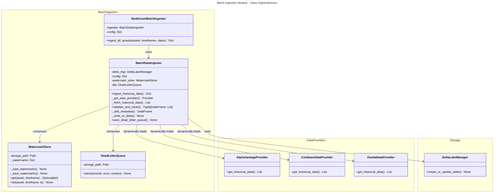
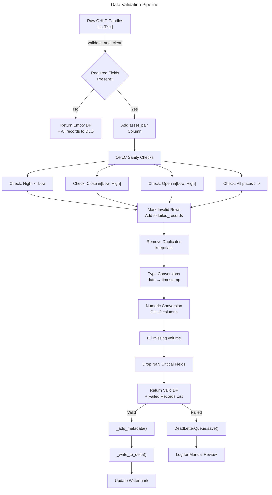

# C4 Code Level: Batch Data Ingestion Pipeline

## Overview

- **Name**: Batch Data Ingestion Pipeline
- **Description**: Historical data backfilling system with incremental loading, schema validation, and dead letter queue handling for financial market data (OHLC candles) from multiple providers (Alpha Vantage, Coinbase, Oanda)
- **Location**: `/finance_feedback_engine/pipelines/batch`
- **Language**: Python 3.9+
- **Purpose**: Provides comprehensive batch ingestion capabilities for backfilling historical OHLCV (Open, High, Low, Close, Volume) data with watermark-based incremental loading, ensuring data integrity through validation and schema checks, while maintaining auditability through metadata enrichment and dead letter queue tracking

## Code Elements

### Module Structure

#### `__init__.py`
- **Location**: `finance_feedback_engine/pipelines/batch/__init__.py` (lines 1-15)
- **Description**: Module initialization file that exports the public API of the batch ingestion system
- **Exports**:
  - `BatchDataIngester`
  - `MultiAssetBatchIngester`
  - `WatermarkStore`
  - `DeadLetterQueue`

### Classes

#### WatermarkStore
- **Location**: `finance_feedback_engine/pipelines/batch/batch_ingestion.py` (lines 23-60)
- **Description**: Persistent state management for tracking last successful ingestion timestamp per (asset_pair, timeframe) pair. Enables incremental loading by resuming from the last known watermark
- **Attributes**:
  - `storage_path: Path` - Directory path for watermark persistence (default: `data/watermarks`)
  - `_watermarks: Dict[str, str]` - In-memory cache of watermarks loaded from disk

**Methods**:

- `__init__(storage_path: str = "data/watermarks") -> None`
  - **Location**: Lines 26-30
  - **Description**: Initialize watermark store with disk persistence
  - **Parameters**:
    - `storage_path`: Root directory for storing watermark JSON files
  - **Dependencies**: `Path`, `json` (standard library)

- `_load_watermarks() -> None`
  - **Location**: Lines 32-40
  - **Description**: Load watermarks from disk (watermarks.json) into memory on initialization
  - **Dependencies**: `json` (standard library)

- `_save_watermarks() -> None`
  - **Location**: Lines 42-48
  - **Description**: Persist current watermarks dictionary to disk as JSON file
  - **Dependencies**: `json` (standard library)

- `get(asset_pair: str, timeframe: str) -> Optional[str]`
  - **Location**: Lines 50-53
  - **Description**: Retrieve last successful watermark timestamp for given asset/timeframe combination
  - **Parameters**:
    - `asset_pair`: Trading pair identifier (e.g., 'BTCUSD', 'EURUSD')
    - `timeframe`: Aggregation period (e.g., '1m', '5m', '1h', '4h', '1d')
  - **Returns**: ISO format timestamp string or None if no watermark exists

- `set(asset_pair: str, timeframe: str, timestamp: str) -> None`
  - **Location**: Lines 55-60
  - **Description**: Update and persist watermark after successful ingestion
  - **Parameters**:
    - `asset_pair`: Trading pair identifier
    - `timeframe`: Aggregation period
    - `timestamp`: ISO format timestamp to set as new watermark
  - **Side Effects**: Writes watermark to disk and logs update event

---

#### DeadLetterQueue
- **Location**: `finance_feedback_engine/pipelines/batch/batch_ingestion.py` (lines 63-88)
- **Description**: Failed record storage and audit trail system. Captures validation failures and schema violations for manual review and recovery
- **Attributes**:
  - `storage_path: Path` - Directory for storing DLQ JSON files (default: `data/dlq`)

**Methods**:

- `__init__(storage_path: str = "data/dlq") -> None`
  - **Location**: Lines 66-68
  - **Description**: Initialize dead letter queue with filesystem storage location
  - **Parameters**:
    - `storage_path`: Root directory for DLQ file storage
  - **Dependencies**: `Path`

- `save(records: List[Dict[str, Any]], error: str, context: Dict[str, Any]) -> None`
  - **Location**: Lines 70-88
  - **Description**: Write failed records with error context and metadata to timestamped JSON file
  - **Parameters**:
    - `records`: List of record dictionaries that failed validation
    - `error`: Error classification string (e.g., 'schema_validation_failed')
    - `context`: Contextual metadata (asset_pair, timeframe, provider, etc.)
  - **Returns**: None
  - **Side Effects**: Creates JSON file with UUID and ISO timestamp in filename
  - **File Format**:
    ```json
    {
      "timestamp": "ISO format",
      "error": "error classification",
      "context": {"contextual": "metadata"},
      "records": [{"failed": "records"}]
    }
    ```
  - **Dependencies**: `datetime`, `timezone`, `uuid`, `json`

---

#### BatchDataIngester
- **Location**: `finance_feedback_engine/pipelines/batch/batch_ingestion.py` (lines 91-423)
- **Description**: Core batch ingestion system supporting historical data backfill with incremental watermark tracking, OHLC validation, and metadata enrichment. Handles multiple data providers (Alpha Vantage, Coinbase, Oanda) with retry logic
- **Attributes**:
  - `delta_mgr: DeltaLakeManager` - Data lake storage manager
  - `config: Dict[str, Any]` - Configuration with API keys and provider settings
  - `watermark_store: WatermarkStore` - Watermark state management
  - `dlq: DeadLetterQueue` - Failed record storage

**Methods**:

- `__init__(delta_mgr: DeltaLakeManager, config: Dict[str, Any]) -> None`
  - **Location**: Lines 103-114
  - **Description**: Initialize batch ingester with storage manager and configuration
  - **Parameters**:
    - `delta_mgr`: DeltaLakeManager instance for Bronze layer data storage
    - `config`: Configuration dictionary with provider API keys
  - **Dependencies**: `WatermarkStore`, `DeadLetterQueue`

- `async ingest_historical_data(asset_pair: str, timeframe: str, start_date: str, end_date: str, provider: str = "alpha_vantage") -> Dict[str, Any]`
  - **Location**: Lines 116-219
  - **Description**: Main entry point for batch ingestion. Orchestrates complete pipeline: watermark retrieval, data fetching, validation, enrichment, and storage
  - **Parameters**:
    - `asset_pair`: Trading pair (e.g., 'BTCUSD', 'EURUSD')
    - `timeframe`: Aggregation period ('1m', '5m', '15m', '1h', '4h', '1d')
    - `start_date`: Start date in YYYY-MM-DD format
    - `end_date`: End date in YYYY-MM-DD format
    - `provider`: Data source ('alpha_vantage', 'coinbase', 'oanda')
  - **Returns**: Dict with keys:
    - `status`: Ingestion result ('success', 'no_data', 'validation_failed', 'error')
    - `records`: Count of successfully ingested records
    - `failed_records`: Count of validation failures
    - `watermark`: Timestamp of last successful record
    - `provider`: Source provider name
  - **Error Handling**: Logs errors and raises exceptions; failed records sent to DLQ
  - **Watermark Behavior**: Resumes from previous watermark if exists, updates on success
  - **Dependencies**: Data providers, `validate_and_clean`, `_add_metadata`, `_write_to_delta`

- `async _get_data_provider(provider: str) -> Any`
  - **Location**: Lines 221-244
  - **Description**: Factory method to initialize appropriate data provider based on string identifier
  - **Parameters**:
    - `provider`: Provider name ('alpha_vantage', 'coinbase', 'oanda')
  - **Returns**: Initialized provider instance
  - **Raises**: `ValueError` if provider not recognized
  - **Dynamic Imports**:
    - `AlphaVantageProvider` from `finance_feedback_engine.data_providers.alpha_vantage_provider`
    - `CoinbaseDataProvider` from `finance_feedback_engine.data_providers.coinbase_data`
    - `OandaDataProvider` from `finance_feedback_engine.data_providers.oanda_data`
  - **Configuration**: Uses config dict for provider credentials

- `async _fetch_historical_data(data_provider, asset_pair: str, timeframe: str, start_date: str, end_date: str) -> List[Dict[str, Any]]`
  - **Location**: Lines 246-279
  - **Description**: Fetch historical OHLCV candles with exponential backoff retry logic
  - **Parameters**:
    - `data_provider`: Initialized provider instance
    - `asset_pair`: Trading pair identifier
    - `timeframe`: Time aggregation period
    - `start_date`: ISO date string
    - `end_date`: ISO date string
  - **Returns**: List of candle dictionaries with keys: date, open, high, low, close, [volume]
  - **Retry Strategy**:
    - Max 3 attempts
    - Base delay: 5 seconds
    - Exponential backoff: 5s, 10s, 20s
  - **Error Handling**: Logs warnings per attempt, raises exception after max retries exceeded
  - **Dependencies**: `asyncio`, data provider async context manager

- `validate_and_clean(candles: List[Dict[str, Any]], timeframe: str, asset_pair: str) -> tuple[pd.DataFrame, List[Dict[str, Any]]]`
  - **Location**: Lines 281-367
  - **Description**: Comprehensive OHLC data validation and cleaning with comprehensive sanity checks
  - **Parameters**:
    - `candles`: Raw candle dictionaries from data provider
    - `timeframe`: Time aggregation period (for context)
    - `asset_pair`: Trading pair (for context)
  - **Returns**: Tuple of (validated DataFrame, list of failed records)
  - **Validation Checks**:
    1. Required fields present: date, open, high, low, close
    2. High >= Low (no inverted ranges)
    3. Close in [Low, High] range
    4. Open in [Low, High] range
    5. All prices > 0 (positive values only)
    6. Duplicate removal (keep latest by date)
    7. Type conversions and NaN removal
  - **Data Transformations**:
    - Rename 'date' column to 'timestamp'
    - Convert to datetime type
    - Convert OHLC to numeric types
    - Set volume to 0.0 if missing
  - **Dependencies**: `pandas`, `logging`

- `_add_metadata(df: pd.DataFrame, provider: str) -> pd.DataFrame`
  - **Location**: Lines 369-383
  - **Description**: Enrich dataframe with lineage and audit columns
  - **Parameters**:
    - `df`: Validated OHLC dataframe
    - `provider`: Source provider name
  - **Returns**: DataFrame with added columns:
    - `source_provider`: Name of data provider
    - `_extracted_at`: UTC datetime of extraction
    - `_ingestion_id`: Unique UUID for this ingestion batch
    - `is_mock`: Boolean flag indicating mock data
  - **Dependencies**: `datetime`, `timezone`, `uuid`, `pandas`

- `async _write_to_delta(df: pd.DataFrame, table_name: str, asset_pair: str, timeframe: str) -> None`
  - **Location**: Lines 385-410
  - **Description**: Write validated and enriched data to Delta Lake Bronze layer with partitioning
  - **Parameters**:
    - `df`: Enhanced dataframe ready for storage
    - `table_name`: Delta Lake table name (e.g., 'raw_market_data_1h')
    - `asset_pair`: Trading pair for partition column
    - `timeframe`: Time period for partition column (not used in partition but for context)
  - **Returns**: None
  - **Storage Behavior**:
    - Append-only mode (Bronze layer pattern)
    - Partitions by date and asset_pair
    - Adds partition columns: partition_date, partition_asset_pair
  - **Error Handling**: Catches exceptions, logs errors, re-raises
  - **Dependencies**: `asyncio`, `delta_mgr.create_or_update_table`

- `save_dead_letter_queue(records: List[Dict[str, Any]], error: str = "unknown") -> None`
  - **Location**: Lines 412-423
  - **Description**: Public method to save failed records to DLQ
  - **Parameters**:
    - `records`: List of failed record dictionaries
    - `error`: Error classification string
  - **Returns**: None (early return if records list empty)
  - **Dependencies**: `DeadLetterQueue.save`, `datetime`, `timezone`

---

#### MultiAssetBatchIngester
- **Location**: `finance_feedback_engine/pipelines/batch/batch_ingestion.py` (lines 426-501)
- **Description**: Orchestrator for batch ingestion across multiple assets and timeframes in sequence. Aggregates results and error handling for mass backfill operations
- **Attributes**:
  - `ingester: BatchDataIngester` - Single ingester instance reused across assets
  - `config: Dict[str, Any]` - Configuration passed to ingester

**Methods**:

- `__init__(delta_mgr: DeltaLakeManager, config: Dict[str, Any]) -> None`
  - **Location**: Lines 429-431
  - **Description**: Initialize multi-asset ingester with shared BatchDataIngester instance
  - **Parameters**:
    - `delta_mgr`: DeltaLakeManager for storage
    - `config`: Configuration dictionary
  - **Dependencies**: `BatchDataIngester`

- `async ingest_all_assets(asset_pairs: List[str], timeframes: List[str], start_date: str, end_date: str, provider: str = "alpha_vantage") -> Dict[str, Any]`
  - **Location**: Lines 433-501
  - **Description**: Batch ingestion for multiple asset/timeframe combinations with aggregated reporting
  - **Parameters**:
    - `asset_pairs`: List of trading pairs (e.g., ['BTCUSD', 'EURUSD'])
    - `timeframes`: List of time aggregations (e.g., ['1h', '4h', '1d'])
    - `start_date`: Start date in YYYY-MM-DD format
    - `end_date`: End date in YYYY-MM-DD format
    - `provider`: Data provider ('alpha_vantage', 'coinbase', 'oanda')
  - **Returns**: Dict with aggregate statistics:
    - `total_records`: Total successfully ingested across all pairs/timeframes
    - `total_failed`: Total validation failures across all ingestions
    - `results`: List of result dicts for each asset_pair/timeframe combination
      - Each includes: asset_pair, timeframe, status, records, failed_records (or error)
  - **Execution Model**: Sequential loop (asset_pair x timeframe), catches exceptions per pair
  - **Error Handling**: Individual failures don't stop other ingestions; errors included in results
  - **Dependencies**: `BatchDataIngester.ingest_historical_data`, `logging`

---

## Dependencies

### Internal Dependencies

**Within `finance_feedback_engine`**:

- `finance_feedback_engine.data_providers.alpha_vantage_provider`
  - Class: `AlphaVantageProvider`
  - Usage: Provides historical OHLCV data for forex/stocks via Alpha Vantage API
  - Async context manager with `get_historical_data()` method

- `finance_feedback_engine.data_providers.coinbase_data`
  - Class: `CoinbaseDataProvider`
  - Usage: Provides historical OHLCV data for cryptocurrencies via Coinbase API
  - Async context manager with `get_historical_data()` method

- `finance_feedback_engine.data_providers.oanda_data`
  - Class: `OandaDataProvider`
  - Usage: Provides historical OHLCV data for forex via Oanda API
  - Async context manager with `get_historical_data()` method

- `finance_feedback_engine.pipelines.storage.delta_lake_manager`
  - Class: `DeltaLakeManager`
  - Methods Used: `create_or_update_table(df, table_name, partition_columns, mode)`
  - Usage: Persist data to Delta Lake Bronze layer with partitioning

### External Dependencies

- **pandas** (core data manipulation)
  - Classes: `pd.DataFrame`
  - Functions: `pd.to_datetime()`, `pd.to_numeric()`, DataFrame methods (to_dict, dropna, drop_duplicates, etc.)
  - Usage: Data validation, cleaning, transformation, and type conversion

- **Python Standard Library**:
  - `asyncio`: Async/await patterns, `asyncio.sleep()`, `asyncio.to_thread()`
  - `logging`: Logger instance for structured logging
  - `uuid`: Generate unique ingestion IDs
  - `datetime`, `timezone`: Timestamp tracking and UTC conversions
  - `pathlib.Path`: Filesystem path operations
  - `typing`: Type hints (Dict, List, Optional, Any, tuple)
  - `json`: Watermark and DLQ file serialization

### Configuration Dependencies

The system requires a `config` dictionary with provider-specific credentials:

```python
config = {
    "alpha_vantage": {
        "api_key": "YOUR_API_KEY"
    },
    "coinbase": {
        # Coinbase-specific credentials
    },
    "oanda": {
        # Oanda-specific credentials
    }
}
```

---

## Relationships

### Data Flow Pipeline

```
Historical Data Request
    ↓
WatermarkStore (resume point lookup)
    ↓
DataProvider (Alpha Vantage / Coinbase / Oanda)
    ├─→ [Retry with exponential backoff]
    ↓
Raw OHLC Candles
    ↓
validate_and_clean()
    ├─→ Invalid records → DeadLetterQueue
    ↓
_add_metadata() (enrichment)
    ↓
_write_to_delta() (Bronze layer)
    ↓
WatermarkStore (update watermark)
    ↓
Return Result Dict
```

### Code Structure Diagram



### Validation and Data Quality Workflow



---

## Testing Integration Points

The batch ingestion module is tested via integration tests in `tests/integration/test_pipeline_integration.py`:

- **End-to-end backfill test**: Mocks data provider → validates → writes to Delta Lake
- **Watermark persistence test**: Verifies watermark survives process restart
- **Multi-timeframe ingestion test**: Tests ingestion of multiple timeframes for single asset
- **Delta Lake time travel test**: Tests write operations and partition structure

Mock data provider returns realistic OHLCV candles with valid OHLC relationships.

---

## Notes

### Design Patterns

1. **Watermark Pattern**: Enables resumable, incremental loading from last successful timestamp
2. **Dead Letter Queue Pattern**: Captures validation failures for audit and manual recovery
3. **Metadata Enrichment**: Adds lineage columns (_extracted_at, _ingestion_id) for data provenance
4. **Provider Factory Pattern**: Dynamic provider initialization based on string identifier
5. **Async/Await Pattern**: Non-blocking I/O for data fetching and storage operations
6. **Append-Only Bronze Layer**: Immutable log structure for raw data retention

### Error Handling Strategy

- **Validation Failures**: Individual records marked invalid and sent to DLQ
- **Fetch Failures**: Exponential backoff retry up to 3 attempts, then exception
- **Storage Failures**: Exception raised after logging error details
- **Multi-Asset**: Individual asset/timeframe failures don't prevent other ingestions

### Performance Considerations

- **Watermark Resume**: Avoids re-downloading historical data after restarts
- **Incremental Loading**: Only fetches data after last watermark
- **Partition Pruning**: Delta Lake partitions by date and asset_pair enable efficient queries
- **Sequential Processing**: Assets/timeframes processed one at a time (room for parallelization)
- **Async Retry**: Non-blocking sleep during retry backoff periods

### Data Quality Rules

**OHLC Sanity Checks**:
- high >= low (mandatory range constraint)
- open in [low, high]
- close in [low, high]
- All prices > 0 (positive values only)
- Timestamp must be non-null and valid

**Duplicate Handling**: Keep latest record by date per asset_pair

### Configuration Requirements

All data providers require API credentials in the config dictionary:
- **Alpha Vantage**: Requires `config["alpha_vantage"]["api_key"]`
- **Coinbase**: Credentials from `config.get("coinbase", {})`
- **Oanda**: Credentials from `config.get("oanda", {})`

### Supported Timeframes

Common timeframes supported: '1m', '5m', '15m', '1h', '4h', '1d' (varies by provider)

### Storage Layer

- **Bronze Layer**: Raw historical data stored in Delta Lake with append-only semantics
- **Partitioning**: By `partition_date` and `partition_asset_pair` for efficient querying
- **Table Naming**: `raw_market_data_{timeframe}` (e.g., raw_market_data_1h, raw_market_data_1d)
