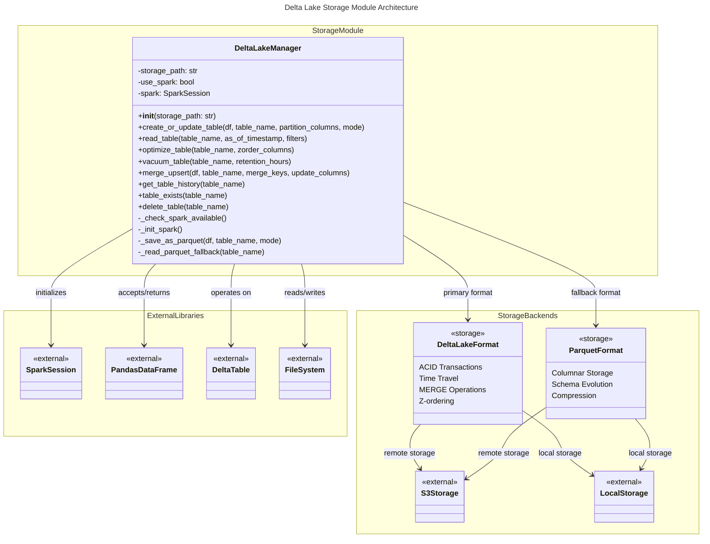

# C4 Code Level: Storage Management Module

## Overview

- **Name**: Delta Lake Storage Management
- **Description**: Storage abstraction layer providing ACID-guaranteed data persistence with Delta Lake format, featuring table management, optimization, time travel queries, and MERGE operations
- **Location**: `finance_feedback_engine/pipelines/storage`
- **Language**: Python 3.8+
- **Purpose**: Provide a scalable, ACID-compliant storage backend for financial data pipelines with support for both cloud (S3, MinIO) and local file systems, enabling reliable data versioning and historical data queries

## Code Elements

### Modules

#### `__init__.py`
- **Location**: `finance_feedback_engine/pipelines/storage/__init__.py`
- **Description**: Public API exports for the storage module
- **Exports**: `DeltaLakeManager` (main class for Delta Lake operations)
- **Purpose**: Module initialization and public interface definition

#### `delta_lake_manager.py`
- **Location**: `finance_feedback_engine/pipelines/storage/delta_lake_manager.py`
- **Description**: Core Delta Lake manager implementation with ACID transaction support
- **Purpose**: Provides comprehensive Delta Lake management capabilities for creating, updating, optimizing, and querying financial data tables

### Classes

#### `DeltaLakeManager`
- **Location**: `finance_feedback_engine/pipelines/storage/delta_lake_manager.py:26-513`
- **Description**: Manager for Delta Lake tables with ACID guarantees. Handles table creation, updates, optimization, and time travel queries with graceful fallback to Parquet format when Spark is unavailable.
- **Responsibility**: Provide unified interface for Delta Lake operations with automatic fallback mechanisms
- **Dependencies**: 
  - Internal: None
  - External: pandas, pyspark, delta-spark, logging, datetime, pathlib

### Methods

#### `__init__(self, storage_path: str = "s3://finance-lake") -> None`
- **Location**: `delta_lake_manager.py:35-52`
- **Description**: Initialize Delta Lake manager with storage path and Spark session setup
- **Parameters**:
  - `storage_path` (str, default="s3://finance-lake"): Base path for Delta tables (S3, MinIO, or local path)
- **Returns**: None
- **Behavior**: 
  - Checks if PySpark is available
  - Initializes Spark session with Delta Lake extensions if available
  - Falls back to file-based storage if Spark unavailable
  - Configures S3 credentials if using S3 paths
- **Raises**: None (errors logged and handled gracefully)

#### `_check_spark_available(self) -> bool`
- **Location**: `delta_lake_manager.py:54-58`
- **Description**: Check if PySpark is installed and available
- **Parameters**: None
- **Returns**: `bool` - True if pyspark module is importable, False otherwise
- **Behavior**: Attempts dynamic import of pyspark module
- **Raises**: None (captures ImportError internally)

#### `_init_spark(self) -> None`
- **Location**: `delta_lake_manager.py:60-87`
- **Description**: Initialize Spark session with Delta Lake support and AWS S3 configuration
- **Parameters**: None
- **Returns**: None
- **Behavior**: 
  - Creates SparkSession with Delta Lake SQL extensions
  - Configures DeltaCatalog for catalog operations
  - Disables retention duration check to allow aggressive vacuuming
  - Adds S3 filesystem configuration if storage_path starts with "s3://"
  - Sets Spark log level to WARN
  - Stores session in `self.spark` attribute
- **Raises**: Exception (caught and logged, sets `self.use_spark = False`)

#### `create_or_update_table(self, df: pd.DataFrame, table_name: str, partition_columns: Optional[List[str]] = None, mode: str = "append") -> None`
- **Location**: `delta_lake_manager.py:89-124`
- **Description**: Create or update a Delta table with optional partitioning
- **Parameters**:
  - `df` (pd.DataFrame): Pandas DataFrame to write to table
  - `table_name` (str): Delta table name (e.g., 'raw_market_data_1h')
  - `partition_columns` (Optional[List[str]], default=None): Columns to partition by
  - `mode` (str, default="append"): Write mode ('append', 'overwrite', 'merge')
- **Returns**: None
- **Behavior**: 
  - Falls back to Parquet if Spark unavailable
  - Converts Pandas DataFrame to Spark DataFrame
  - Writes data in Delta format with specified mode and partitioning
  - Logs operation details including row count and partition info
- **Raises**: ValueError (if mode unsupported), Exception (on write failure)

#### `_save_as_parquet(self, df: pd.DataFrame, table_name: str, mode: str) -> None`
- **Location**: `delta_lake_manager.py:126-138`
- **Description**: Fallback method to save data as Parquet files when Spark unavailable
- **Parameters**:
  - `df` (pd.DataFrame): Data to save
  - `table_name` (str): Table name (used as directory)
  - `mode` (str): Write mode (currently ignored in fallback)
- **Returns**: None
- **Behavior**: 
  - Creates table directory if not exists
  - Generates timestamped filename
  - Writes Parquet file using pyarrow engine
  - Logs operation in fallback mode
- **Raises**: None (propagates from df.to_parquet())

#### `read_table(self, table_name: str, as_of_timestamp: Optional[str] = None, filters: Optional[List[str]] = None) -> pd.DataFrame`
- **Location**: `delta_lake_manager.py:140-179`
- **Description**: Read Delta table with optional time travel and filtering
- **Parameters**:
  - `table_name` (str): Delta table name to read
  - `as_of_timestamp` (Optional[str], default=None): ISO timestamp for time travel (e.g., '2025-01-01T00:00:00')
  - `filters` (Optional[List[str]], default=None): SQL-like filter expressions (e.g., ['asset_pair = "BTCUSD"'])
- **Returns**: `pd.DataFrame` - Data from table as Pandas DataFrame
- **Behavior**: 
  - Falls back to Parquet files if Spark unavailable
  - Uses Delta time travel feature when as_of_timestamp provided
  - Applies filter expressions sequentially
  - Converts Spark DataFrame to Pandas
  - Logs row count read
- **Raises**: Exception (on read failure)

#### `_read_parquet_fallback(self, table_name: str) -> pd.DataFrame`
- **Location**: `delta_lake_manager.py:181-198`
- **Description**: Fallback method to read Parquet files when Spark unavailable
- **Parameters**:
  - `table_name` (str): Table name (directory to read from)
- **Returns**: `pd.DataFrame` - Empty DataFrame if no files found, otherwise concatenated data from all Parquet files
- **Behavior**: 
  - Scans table directory for .parquet files
  - Returns empty DataFrame if directory doesn't exist
  - Reads all Parquet files and concatenates them
  - Logs operation in fallback mode
- **Raises**: None (propagates from pd.read_parquet())

#### `optimize_table(self, table_name: str, zorder_columns: Optional[List[str]] = None) -> None`
- **Location**: `delta_lake_manager.py:200-231`
- **Description**: Optimize Delta table by compacting small files and optionally Z-ordering for query performance
- **Parameters**:
  - `table_name` (str): Delta table name to optimize
  - `zorder_columns` (Optional[List[str]], default=None): Columns to Z-order by (improves query performance for filtered queries)
- **Returns**: None
- **Behavior**: 
  - Returns early with warning if Spark unavailable
  - Compacts small files into larger ones
  - Applies Z-ordering if columns specified
  - Logs optimization progress
- **Raises**: Exception (on optimization failure)

#### `vacuum_table(self, table_name: str, retention_hours: int = 168) -> None`
- **Location**: `delta_lake_manager.py:233-259`
- **Description**: Vacuum old versions from Delta table to free up storage space
- **Parameters**:
  - `table_name` (str): Delta table name to vacuum
  - `retention_hours` (int, default=168): Keep versions from last N hours (default 7 days)
- **Returns**: None
- **Behavior**: 
  - Returns early with warning if Spark unavailable
  - Removes file versions older than retention period
  - Logs retention settings
- **Raises**: Exception (on vacuum failure)

#### `merge_upsert(self, df: pd.DataFrame, table_name: str, merge_keys: List[str], update_columns: Optional[List[str]] = None) -> None`
- **Location**: `delta_lake_manager.py:261-314`
- **Description**: Perform MERGE (upsert) operation on Delta table, updating matching records and inserting new ones
- **Parameters**:
  - `df` (pd.DataFrame): DataFrame with new/updated records
  - `table_name` (str): Target Delta table name
  - `merge_keys` (List[str]): Columns to match on (e.g., ['asset_pair', 'timestamp'])
  - `update_columns` (Optional[List[str]], default=None): Columns to update (None = update all columns)
- **Returns**: None
- **Behavior**: 
  - Raises error if Spark unavailable (MERGE requires Spark)
  - Converts Pandas DataFrame to Spark DataFrame
  - Creates temporary view for updates
  - Builds dynamic merge condition from merge_keys
  - Executes MERGE with whenMatched and whenNotMatched clauses
  - Logs records processed count
- **Raises**: ValueError (if Spark unavailable), Exception (on merge failure)

#### `get_table_history(self, table_name: str) -> pd.DataFrame`
- **Location**: `delta_lake_manager.py:316-339`
- **Description**: Get Delta table version history for time travel and audit purposes
- **Parameters**:
  - `table_name` (str): Delta table name
- **Returns**: `pd.DataFrame` - DataFrame with columns: version, timestamp, operation, user, etc. Empty DataFrame if Spark unavailable
- **Behavior**: 
  - Returns empty DataFrame with warning if Spark unavailable
  - Retrieves transaction log history
  - Converts to Pandas DataFrame
  - Logs version count
- **Raises**: Exception (on history retrieval failure, caught and logged)

#### `table_exists(self, table_name: str) -> bool`
- **Location**: `delta_lake_manager.py:341-353`
- **Description**: Check if Delta table exists
- **Parameters**:
  - `table_name` (str): Delta table name to check
- **Returns**: `bool` - True if table exists, False otherwise
- **Behavior**: 
  - Uses Spark to check if readable as Delta format (if available)
  - Falls back to filesystem check for path existence
- **Raises**: None (catches exceptions and returns False)

#### `delete_table(self, table_name: str) -> None`
- **Location**: `delta_lake_manager.py:355-368`
- **Description**: Delete Delta table (use with caution)
- **Parameters**:
  - `table_name` (str): Delta table name to delete
- **Returns**: None
- **Behavior**: 
  - Removes entire table directory recursively
  - Logs warning when table deleted
  - Logs warning if table not found
- **Raises**: None (propagates from shutil.rmtree())

## Dependencies

### Internal Dependencies
- **Module exports**: Used by `finance_feedback_engine/core.py` and `finance_feedback_engine/pipelines/batch/batch_ingestion.py`
- **Integration**: Core engine conditionally initializes DeltaLakeManager when delta_lake config enabled
- **Batch processing**: BatchDataIngester accepts DeltaLakeManager instance for data persistence

### External Dependencies

#### Primary Dependencies
- **pandas** (>=1.0.0): DataFrame manipulation and I/O
  - Used for: DataFrame parameter handling, Parquet file I/O, time-indexed operations
- **pyspark** (>=3.0.0): Distributed data processing framework (optional)
  - Used for: Spark session creation, DataFrame operations, Delta Lake access
  - Graceful degradation: System falls back to Parquet if unavailable
- **delta-spark** (>=2.0.0): Delta Lake library for Spark (optional with PySpark)
  - Used for: Delta format support, ACID transactions, time travel, MERGE operations
- **pyarrow**: Parquet file format support
  - Used for: DataFrame.to_parquet() and pd.read_parquet() operations

#### Standard Library Dependencies
- **logging**: Python standard logging
  - Used for: Operation logging and error tracking
- **datetime**: Date/time utilities
  - Used for: Timestamp generation, ISO format parsing
- **pathlib.Path**: Object-oriented filesystem paths
  - Used for: Cross-platform path handling
- **typing**: Type hints
  - Used for: Method signature type annotations
- **shutil**: High-level file operations
  - Used for: delete_table() directory removal

## Architecture & Design Patterns

### Graceful Degradation Pattern
- **Primary implementation**: Delta Lake with Spark (full ACID, time travel, MERGE)
- **Fallback implementation**: Parquet files (basic persistence, no advanced features)
- **Decision point**: Spark availability check at initialization
- **User impact**: All public methods work with both implementations; some features (optimize, vacuum, merge, history) degraded without Spark

### Storage Abstraction
- **S3 support**: Configured via storage_path starting with "s3://"
- **MinIO support**: Compatible with S3-compatible endpoints
- **Local filesystem**: Default or custom paths supported
- **Configuration**: AWS credentials auto-discovered via DefaultAWSCredentialsProviderChain

### Data Flow
1. **Write operations**: Pandas DataFrame → (Spark DataFrame) → Delta/Parquet format → Storage
2. **Read operations**: Storage → (Spark DataFrame) → Pandas DataFrame → Application
3. **Optimization**: Delta table → Optimize (compact files) → Z-order → Storage
4. **MERGE operations**: Source Parquet/Delta → Temporary Spark View → MERGE statement → Target table

### Error Handling Strategy
- **Spark initialization failures**: Logged and system falls back to Parquet
- **Write failures**: Exception raised and logged with table name
- **Read failures**: Exception raised and logged with table name
- **Operation failures (optimize, vacuum, merge)**: Exception raised and logged
- **Graceful degradation**: Most errors are logged but don't crash the system

## Relationships & Call Graph

### Public API Dependencies
- **Called by**: `finance_feedback_engine/core.py` (Delta Lake initialization)
- **Called by**: `finance_feedback_engine/pipelines/batch/batch_ingestion.py` (Data persistence)
- **Called by**: Test suite (`tests/test_core_engine.py`, `tests/integration/test_pipeline_integration.py`)

### Internal Method Dependencies
```
__init__
├── _check_spark_available()
└── _init_spark()

create_or_update_table()
└── _save_as_parquet() [fallback]

read_table()
└── _read_parquet_fallback() [fallback]

optimize_table() [requires Spark]

vacuum_table() [requires Spark]

merge_upsert() [requires Spark]

get_table_history() [requires Spark]

table_exists()

delete_table()
```

## Code Diagram



## Feature Matrix

| Feature | Implementation | Requires Spark | Use Case |
|---------|----------------|----------------|----------|
| Create/Update Table | Delta or Parquet | No (Yes for Delta) | Persist trading data |
| Read Table | Delta or Parquet | No (Yes for Delta) | Load historical data |
| Time Travel | Delta | Yes | Query data at specific point in time |
| Partitioning | Delta or Parquet | No (Yes for Delta) | Organize data by asset/date |
| Z-ordering | Delta | Yes | Optimize query performance |
| Optimize (Compact) | Delta | Yes | Reduce small file overhead |
| Vacuum (Cleanup) | Delta | Yes | Free storage space |
| MERGE (Upsert) | Delta | Yes | Update/insert records atomically |
| History Tracking | Delta | Yes | Audit table versions |
| Fallback Storage | Parquet | No | Graceful degradation |

## Configuration Examples

### Using Delta Lake Storage in Core Engine
```python
config = {
    "delta_lake": {
        "enabled": True,
        "storage_path": "s3://my-bucket/finance-lake"
    }
}
engine = FinanceFeedbackEngine(config)
# DeltaLakeManager auto-initialized if enabled
```

### Batch Ingestion with Delta Lake
```python
from finance_feedback_engine.pipelines.storage import DeltaLakeManager
from finance_feedback_engine.pipelines.batch import BatchDataIngester

delta_mgr = DeltaLakeManager("s3://finance-lake")
ingester = BatchDataIngester(delta_mgr, config)

# Ingest and persist data
await ingester.ingest_historical_data(
    asset_pair="BTCUSD",
    timeframe="1h",
    provider="alpha_vantage"
)
```

## Notes

- **Spark Availability**: System gracefully degrades when Spark/Delta Lake unavailable. Fallback provides basic Parquet persistence without advanced features.
- **AWS Credentials**: S3 paths automatically configure AWS credentials via DefaultAWSCredentialsProviderChain (checks environment variables, IAM roles, credentials file).
- **Retention Configuration**: Default 7-day retention before vacuum; configurable per operation.
- **ACID Guarantees**: Only available with Delta Lake; Parquet fallback provides no transactional guarantees.
- **Time Travel Capability**: ISO format timestamps required (e.g., '2025-01-01T00:00:00Z').
- **Performance**: Z-ordering recommended for frequently filtered columns (e.g., asset_pair, timestamp).
- **Storage Cost**: Vacuum operations critical for managing storage costs in cloud deployments.
