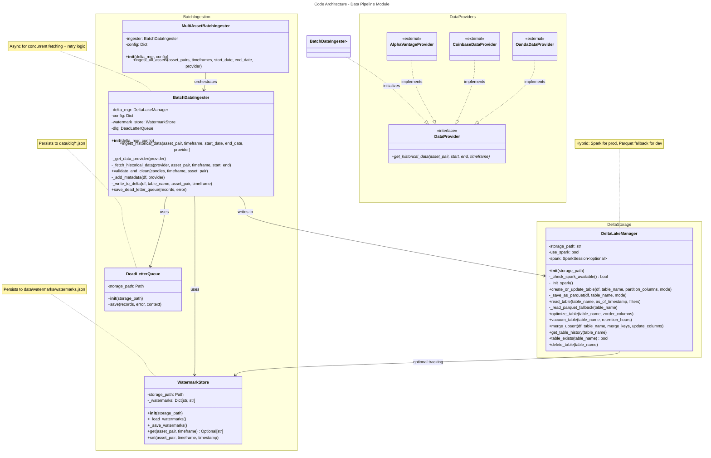

# C4 Code Level: Data Pipeline Module

## Overview

- **Name**: Data Pipeline Module - Finance Feedback Engine
- **Description**: Production-grade data pipeline system implementing the lakehouse pattern with batch and streaming data ingestion, Delta Lake storage management, and comprehensive data quality validation. Supports multi-timeframe market data ingestion from multiple providers (Alpha Vantage, Coinbase, Oanda) with incremental loading, watermark tracking, and ACID-compliant storage.
- **Location**: `finance_feedback_engine/pipelines/`
- **Language**: Python 3.8+
- **Purpose**: Provides scalable, production-ready data ingestion and storage capabilities for the Finance Feedback Engine, implementing the Bronze-Silver-Gold lakehouse architecture with Delta Lake, incremental loading with watermarks, dead letter queue error handling, and data quality validation.

---

## Code Elements

### Module Structure

#### Primary Modules

1. **batch** - Batch data ingestion with watermark tracking
   - Location: `finance_feedback_engine/pipelines/batch/`
   - Purpose: Historical data backfill and incremental loading using watermarks

2. **storage** - Delta Lake storage management
   - Location: `finance_feedback_engine/pipelines/storage/`
   - Purpose: ACID transactions, time travel queries, and table optimization

3. **__init__.py** - Package initialization
   - Location: `finance_feedback_engine/pipelines/__init__.py`
   - Exports: Module metadata and version

### Classes and Methods

#### WatermarkStore Class
**Location**: `finance_feedback_engine/pipelines/batch/batch_ingestion.py:16-73`

**Description**: Tracks last successful ingestion timestamp per (asset_pair, timeframe) for incremental loading. Persists watermarks to disk for durability across process restarts.

**Methods**:
- `__init__(self, storage_path: str = "data/watermarks") -> None`
  - Initialize WatermarkStore with file system storage path
  - Creates storage directory if it doesn't exist
  - Loads existing watermarks from disk
  - **Location**: Line 19-24
  - **Dependencies**: Path (pathlib), json, logging

- `_load_watermarks(self) -> None`
  - Load watermarks from `watermarks.json` file
  - Internal method for initialization
  - **Location**: Line 26-33
  - **Dependencies**: json, Path

- `_save_watermarks(self) -> None`
  - Persist watermarks to disk in JSON format
  - Called after every successful update
  - **Location**: Line 35-40
  - **Dependencies**: json, Path

- `get(self, asset_pair: str, timeframe: str) -> Optional[str]`
  - Retrieve last successful watermark for asset/timeframe pair
  - Returns ISO timestamp string or None if not found
  - **Location**: Line 42-46
  - **Dependencies**: typing.Optional

- `set(self, asset_pair: str, timeframe: str, timestamp: str) -> None`
  - Update watermark after successful ingestion
  - Saves to disk and logs update
  - **Location**: Line 48-53
  - **Dependencies**: logging

---

#### DeadLetterQueue Class
**Location**: `finance_feedback_engine/pipelines/batch/batch_ingestion.py:75-114`

**Description**: Stores failed ingestion records with error context for manual review and debugging. Implements storage pattern for invalid/problematic records.

**Methods**:
- `__init__(self, storage_path: str = "data/dlq") -> None`
  - Initialize DeadLetterQueue with file system storage path
  - Creates storage directory if it doesn't exist
  - **Location**: Line 78-81
  - **Dependencies**: Path (pathlib)

- `save(self, records: List[Dict[str, Any]], error: str, context: Dict[str, Any]) -> None`
  - Save failed records with error context to JSON file
  - Generates unique filename with timestamp and UUID
  - Stores: timestamp, error message, context dict, failed records
  - **Location**: Line 83-104
  - **Dependencies**: uuid, datetime, Path, json, typing.List, typing.Dict, typing.Any
  - **Logging**: Warning-level log with file path

---

#### BatchDataIngester Class
**Location**: `finance_feedback_engine/pipelines/batch/batch_ingestion.py:116-433`

**Description**: Main batch ingestion engine implementing incremental loading with watermarks, schema validation, dead letter queue handling, and Delta Lake storage. Supports multiple data providers (Alpha Vantage, Coinbase, Oanda) with retry logic and exponential backoff.

**Methods**:

- `__init__(self, delta_mgr: DeltaLakeManager, config: Dict[str, Any]) -> None`
  - Initialize batch ingester with Delta Lake manager and configuration
  - Creates WatermarkStore and DeadLetterQueue instances
  - **Location**: Line 129-139
  - **Dependencies**: DeltaLakeManager, typing.Dict, typing.Any

- `ingest_historical_data(self, asset_pair: str, timeframe: str, start_date: str, end_date: str, provider: str = "alpha_vantage") -> Dict[str, Any]`
  - Main async method for batch ingestion with incremental loading
  - Parameters:
    - asset_pair (str): Asset pair (e.g., 'BTCUSD', 'EURUSD')
    - timeframe (str): Timeframe ('1m', '5m', '15m', '1h', '4h', '1d')
    - start_date (str): Start date (YYYY-MM-DD)
    - end_date (str): End date (YYYY-MM-DD)
    - provider (str): Data provider ('alpha_vantage', 'coinbase', 'oanda')
  - Returns: Dict with keys: status, records, failed_records, watermark, provider
  - Features:
    - Resumable using watermark from previous run
    - Fetches, validates, cleans data
    - Adds metadata columns (_extracted_at, _ingestion_id)
    - Writes to Delta Lake with date + asset_pair partitioning
    - Updates watermark on success
  - **Location**: Line 141-219
  - **Dependencies**: asyncio, logging, typing.Dict, typing.Any
  - **Calls**: _get_data_provider, _fetch_historical_data, validate_and_clean, _add_metadata, _write_to_delta

- `_get_data_provider(self, provider: str) -> Any`
  - Initialize and return data provider instance (dynamic import)
  - Supports: 'alpha_vantage', 'coinbase', 'oanda'
  - **Location**: Line 221-242
  - **Dependencies**: finance_feedback_engine.data_providers (dynamic imports)

- `_fetch_historical_data(self, data_provider, asset_pair: str, timeframe: str, start_date: str, end_date: str) -> List[Dict[str, Any]]`
  - Fetch historical data from provider with retry logic
  - Implements exponential backoff (5s, 10s, 20s) with max 3 retries
  - Uses async context manager pattern
  - **Location**: Line 244-274
  - **Dependencies**: asyncio, typing.List, typing.Dict, typing.Any

- `validate_and_clean(self, candles: List[Dict[str, Any]], timeframe: str, asset_pair: str) -> tuple[pd.DataFrame, List[Dict[str, Any]]]`
  - Validate OHLC data with schema and sanity checks
  - OHLC checks:
    - Required fields: date, open, high, low, close
    - high >= low
    - close in [low, high]
    - open in [low, high]
    - All prices > 0
  - Transformations:
    - Add asset_pair if missing
    - Rename 'date' to 'timestamp'
    - Convert prices to numeric
    - Add volume (default 0.0)
    - Drop NaN in critical fields
    - Remove duplicates (keep latest)
  - Returns: (validated_df, failed_records)
  - **Location**: Line 276-374
  - **Dependencies**: pandas, typing.List, typing.Dict, typing.Any, logging

- `_add_metadata(self, df: pd.DataFrame, provider: str) -> pd.DataFrame`
  - Add metadata columns for lineage tracking
  - Adds: source_provider, _extracted_at, _ingestion_id, is_mock
  - **Location**: Line 376-395
  - **Dependencies**: pandas, datetime, uuid, timezone

- `_write_to_delta(self, df: pd.DataFrame, table_name: str, asset_pair: str, timeframe: str) -> None`
  - Write DataFrame to Delta Lake with partitioning
  - Adds partition columns: partition_date, partition_asset_pair
  - Uses asyncio.to_thread for async Delta Lake write
  - Write mode: append (Bronze layer is append-only)
  - **Location**: Line 397-426
  - **Dependencies**: pandas, asyncio, logging

- `save_dead_letter_queue(self, records: List[Dict[str, Any]], error: str = "unknown") -> None`
  - Public method to save failed records to DLQ
  - **Location**: Line 428-433
  - **Dependencies**: typing.List, typing.Dict, typing.Any

---

#### MultiAssetBatchIngester Class
**Location**: `finance_feedback_engine/pipelines/batch/batch_ingestion.py:435-550`

**Description**: Orchestrator for batch ingestion across multiple assets and timeframes. Provides high-level interface for backfilling multiple asset pairs with error handling and aggregated statistics.

**Methods**:

- `__init__(self, delta_mgr: DeltaLakeManager, config: Dict[str, Any]) -> None`
  - Initialize multi-asset ingester
  - Creates BatchDataIngester instance
  - **Location**: Line 438-441
  - **Dependencies**: DeltaLakeManager, typing.Dict, typing.Any

- `ingest_all_assets(self, asset_pairs: List[str], timeframes: List[str], start_date: str, end_date: str, provider: str = "alpha_vantage") -> Dict[str, Any]`
  - Async method to ingest historical data for multiple assets/timeframes
  - Parameters:
    - asset_pairs: List of asset pairs (e.g., ['BTCUSD', 'ETHUSD'])
    - timeframes: List of timeframes (e.g., ['1h', '4h', '1d'])
    - start_date: Start date (YYYY-MM-DD)
    - end_date: End date (YYYY-MM-DD)
    - provider: Data provider name
  - Iterates: for each asset_pair, for each timeframe
  - Error handling: Catches exceptions per asset/timeframe, continues processing
  - Returns: Dict with total_records, total_failed, results list
  - **Location**: Line 443-550
  - **Dependencies**: typing.List, typing.Dict, typing.Any, asyncio, logging
  - **Calls**: BatchDataIngester.ingest_historical_data

---

#### DeltaLakeManager Class
**Location**: `finance_feedback_engine/pipelines/storage/delta_lake_manager.py:16-370`

**Description**: Manager for Delta Lake tables with ACID guarantees. Implements table lifecycle management (create, update, optimize, vacuum), time travel queries, and MERGE operations. Supports both Spark-based Delta Lake (production) and Parquet fallback (development).

**Methods**:

- `__init__(self, storage_path: str = "s3://finance-lake") -> None`
  - Initialize Delta Lake manager
  - Parameters:
    - storage_path: Base path for Delta tables (S3, MinIO, or local path)
  - Checks Spark availability and initializes if present
  - Falls back to Parquet-based storage if Spark unavailable
  - **Location**: Line 28-40
  - **Dependencies**: typing.Optional, typing.List, logging

- `_check_spark_available(self) -> bool`
  - Check if PySpark is installed via dynamic import
  - Returns: True if PySpark available, False otherwise
  - **Location**: Line 42-47
  - **Dependencies**: sys (dynamic __import__)

- `_init_spark(self) -> None`
  - Initialize Spark session with Delta Lake support
  - Configures:
    - Delta Lake SQL extension
    - DeltaCatalog
    - Vacuum retention check bypass
    - S3 filesystem (if using AWS S3)
  - Sets log level to WARN
  - **Location**: Line 49-88
  - **Dependencies**: delta.configure_spark_with_delta_pip, pyspark.sql.SparkSession, logging
  - **Error handling**: Sets use_spark=False on exception

- `create_or_update_table(self, df: pd.DataFrame, table_name: str, partition_columns: Optional[List[str]] = None, mode: str = "append") -> None`
  - Create or update a Delta table
  - Parameters:
    - df: Pandas DataFrame to write
    - table_name: Delta table name (e.g., 'raw_market_data_1h')
    - partition_columns: Columns to partition by
    - mode: Write mode ('append', 'overwrite', 'merge')
  - Converts Pandas DataFrame to Spark DataFrame
  - Applies partitioning if specified
  - Falls back to Parquet if Spark unavailable
  - **Location**: Line 90-122
  - **Dependencies**: pandas, typing.Optional, typing.List, logging

- `_save_as_parquet(self, df: pd.DataFrame, table_name: str, mode: str) -> None`
  - Fallback: save as Parquet files when Spark unavailable
  - Creates timestamped filename: data_YYYYMMDD_HHMMSS.parquet
  - **Location**: Line 124-136
  - **Dependencies**: pandas, datetime, Path, logging

- `read_table(self, table_name: str, as_of_timestamp: Optional[str] = None, filters: Optional[List[str]] = None) -> pd.DataFrame`
  - Read Delta table with optional time travel
  - Parameters:
    - table_name: Delta table name
    - as_of_timestamp: ISO timestamp for time travel (e.g., '2025-01-01T00:00:00')
    - filters: SQL-like filter expressions
  - Returns: Pandas DataFrame
  - Supports time travel queries via as_of_timestamp
  - Supports multiple filter expressions
  - Falls back to Parquet if Spark unavailable
  - **Location**: Line 138-175
  - **Dependencies**: pandas, typing.Optional, typing.List, logging

- `_read_parquet_fallback(self, table_name: str) -> pd.DataFrame`
  - Fallback: read Parquet files when Spark unavailable
  - Reads all .parquet files in table directory
  - Concatenates multiple files
  - Returns: Pandas DataFrame
  - **Location**: Line 177-200
  - **Dependencies**: pandas, Path, logging

- `optimize_table(self, table_name: str, zorder_columns: Optional[List[str]] = None) -> None`
  - Optimize Delta table by compacting small files and Z-ordering
  - Parameters:
    - table_name: Delta table name
    - zorder_columns: Columns to Z-order by (improves query performance)
  - Operations:
    1. Compact small files into larger files
    2. Z-order by specified columns (collocate related data)
  - Improves read performance (20-50x faster)
  - Requires Spark
  - **Location**: Line 202-230
  - **Dependencies**: delta.tables.DeltaTable, typing.Optional, typing.List, logging

- `vacuum_table(self, table_name: str, retention_hours: int = 168) -> None`
  - Vacuum old versions from Delta table (free up storage)
  - Parameters:
    - table_name: Delta table name
    - retention_hours: Keep versions from last N hours (default: 7 days = 168 hours)
  - Removes old file versions, freeing storage (~40% for frequently updated tables)
  - Requires Spark
  - **Location**: Line 232-258
  - **Dependencies**: delta.tables.DeltaTable, logging

- `merge_upsert(self, df: pd.DataFrame, table_name: str, merge_keys: List[str], update_columns: Optional[List[str]] = None) -> None`
  - Perform MERGE (upsert) operation on Delta table
  - Parameters:
    - df: Pandas DataFrame with new/updated records
    - table_name: Target Delta table
    - merge_keys: Columns to match on (e.g., ['asset_pair', 'timestamp'])
    - update_columns: Columns to update (None = update all)
  - Behavior:
    - Existing records matching merge_keys: UPDATE
    - New records: INSERT
  - Requires Spark
  - **Location**: Line 260-315
  - **Dependencies**: pandas, delta.tables.DeltaTable, typing.List, typing.Optional, logging

- `get_table_history(self, table_name: str) -> pd.DataFrame`
  - Get Delta table version history (for time travel)
  - Returns: DataFrame with columns: version, timestamp, operation, operationMetrics
  - Useful for auditing and recovery
  - Requires Spark
  - **Location**: Line 317-342
  - **Dependencies**: pandas, delta.tables.DeltaTable, logging

- `table_exists(self, table_name: str) -> bool`
  - Check if Delta table exists
  - Uses Spark if available, otherwise checks filesystem
  - **Location**: Line 344-354
  - **Dependencies**: Path, typing.bool

- `delete_table(self, table_name: str) -> None`
  - Delete Delta table (use with caution)
  - Recursively removes table directory
  - **Location**: Line 356-370
  - **Dependencies**: shutil, Path, logging

---

## Functions and Module-Level Code

### Module Initialization

**finance_feedback_engine/pipelines/__init__.py**
- Module docstring describing package structure and layers (Bronze, Silver, Gold)
- Version: "1.0.0"
- Location: Lines 1-15

**finance_feedback_engine/pipelines/batch/__init__.py**
- Imports and exports:
  - BatchDataIngester
  - MultiAssetBatchIngester
  - WatermarkStore
  - DeadLetterQueue
- Location: Lines 1-12

**finance_feedback_engine/pipelines/storage/__init__.py**
- Imports and exports:
  - DeltaLakeManager
- Location: Lines 1-6

---

## Dependencies

### Internal Dependencies

**Within pipelines module**:
- `batch.batch_ingestion.BatchDataIngester` <- depends on -> `storage.delta_lake_manager.DeltaLakeManager`
- `batch.batch_ingestion.MultiAssetBatchIngester` <- depends on -> `batch.batch_ingestion.BatchDataIngester`
- Both batch ingesters depend on WatermarkStore and DeadLetterQueue

**Cross-module dependencies**:
- `finance_feedback_engine.data_providers.alpha_vantage_provider.AlphaVantageProvider`
  - Used by BatchDataIngester._get_data_provider()
  - Location: batch_ingestion.py:225-229

- `finance_feedback_engine.data_providers.coinbase_data.CoinbaseDataProvider`
  - Used by BatchDataIngester._get_data_provider()
  - Location: batch_ingestion.py:230-232

- `finance_feedback_engine.data_providers.oanda_data.OandaDataProvider`
  - Used by BatchDataIngester._get_data_provider()
  - Location: batch_ingestion.py:233-236

### External Dependencies

**Python Standard Library**:
- `asyncio` - Async/await patterns, concurrent task management
- `logging` - Logger initialization and message logging
- `uuid` - UUID4 generation for ingestion IDs
- `datetime` - UTC timezone-aware timestamps
- `pathlib.Path` - Cross-platform file path handling
- `typing` - Type hints (Any, Dict, List, Optional, tuple)
- `json` - Watermark and DLQ file serialization
- `shutil` - Recursive directory deletion

**Third-party Libraries**:
- `pandas` (pd) - DataFrame operations, validation, transformations
  - Used in: BatchDataIngester.validate_and_clean, _add_metadata, _write_to_delta
  - Used in: DeltaLakeManager.read_table, _read_parquet_fallback

- `pyspark` (conditional)
  - pyspark.sql.SparkSession - Spark session creation
  - pyspark.sql.functions - SQL operations
  - Used by: DeltaLakeManager for Delta Lake operations
  - Fallback: Parquet-based storage if unavailable

- `delta` (conditional)
  - delta.configure_spark_with_delta_pip - Spark configuration
  - delta.tables.DeltaTable - Delta table operations
  - Used by: DeltaLakeManager for Delta Lake features
  - Features: ACID transactions, time travel, merge operations, optimization

- `pyarrow` (optional)
  - Used by pandas.to_parquet and pd.read_parquet
  - Parquet serialization engine

---

## Data Structures and Type Definitions

### Configuration Dictionary
```python
config: Dict[str, Any] = {
    "alpha_vantage": {
        "api_key": str,
        ...
    },
    "coinbase": {...},
    "oanda": {...}
}
```

### Ingestion Result Dictionary
```python
result: Dict[str, Any] = {
    "status": str,  # 'success', 'no_data', 'validation_failed', 'error'
    "records": int,  # count of valid records ingested
    "failed_records": int,  # count of failed records
    "watermark": str,  # ISO timestamp of last record
    "provider": str  # data provider name
}
```

### Watermark Storage (watermarks.json)
```json
{
    "BTCUSD_1h": "2025-12-14T10:00:00",
    "BTCUSD_1d": "2025-12-14T00:00:00",
    "ETHUSD_1h": "2025-12-14T09:00:00"
}
```

### Dead Letter Queue File (dlq_*.json)
```json
{
    "timestamp": "2025-12-14T10-30-00",
    "error": "schema_validation_failed",
    "context": {
        "asset_pair": "BTCUSD",
        "timeframe": "1h",
        "provider": "alpha_vantage"
    },
    "records": [
        {
            "date": "2025-12-14 09:00:00",
            "high": 42000,
            "low": 42500,
            "reason": "high < low"
        }
    ]
}
```

### Candle Data Structure (from providers)
```python
candle: Dict[str, Any] = {
    "date": str,  # YYYY-MM-DD HH:MM:SS
    "open": float,
    "high": float,
    "low": float,
    "close": float,
    "volume": float,  # optional
    "asset_pair": str,  # optional
}
```

### Delta Lake Schema (Bronze Layer)
```python
# raw_market_data_{timeframe} table schema
{
    "timestamp": datetime64,  # UTC
    "open": float64,
    "high": float64,
    "low": float64,
    "close": float64,
    "volume": float64,
    "asset_pair": string,
    "source_provider": string,
    "_extracted_at": datetime64,
    "_ingestion_id": string,
    "is_mock": bool,
    "partition_date": date,  # partition column
    "partition_asset_pair": string  # partition column
}
```

---

## Relationships and Call Graph

```
MultiAssetBatchIngester
    ├── __init__(delta_mgr, config)
    │   └── Creates: BatchDataIngester instance
    │
    └── ingest_all_assets(asset_pairs, timeframes, start_date, end_date, provider)
        └── For each (asset_pair, timeframe):
            └── BatchDataIngester.ingest_historical_data()
                ├── WatermarkStore.get(asset_pair, timeframe)
                ├── BatchDataIngester._get_data_provider(provider)
                │   └── Dynamically imports data provider
                │       ├── AlphaVantageProvider
                │       ├── CoinbaseDataProvider
                │       └── OandaDataProvider
                ├── BatchDataIngester._fetch_historical_data()
                │   ├── Async: data_provider.get_historical_data()
                │   └── Retry logic with exponential backoff
                ├── BatchDataIngester.validate_and_clean(candles, timeframe, asset_pair)
                │   ├── Required field validation
                │   ├── OHLC sanity checks
                │   ├── Deduplication
                │   ├── Type conversions
                │   └── Returns: (validated_df, failed_records)
                ├── DeadLetterQueue.save(failed_records) [if failures > 0]
                ├── BatchDataIngester._add_metadata(validated_df, provider)
                │   └── Adds: source_provider, _extracted_at, _ingestion_id, is_mock
                ├── BatchDataIngester._write_to_delta()
                │   └── DeltaLakeManager.create_or_update_table()
                │       ├── Spark: Convert to Spark DF + Write Delta format
                │       └── Fallback: DeltaLakeManager._save_as_parquet()
                └── WatermarkStore.set(asset_pair, timeframe, timestamp)
                    └── Updates watermarks.json

DeltaLakeManager
    ├── __init__(storage_path)
    │   ├── _check_spark_available()
    │   └── _init_spark() [if Spark available]
    │
    ├── create_or_update_table(df, table_name, partition_columns, mode)
    │   └── If Spark: Spark write + Delta format
    │   └── If no Spark: _save_as_parquet()
    │
    ├── read_table(table_name, as_of_timestamp, filters)
    │   ├── If Spark: Spark read + time travel + filters
    │   └── If no Spark: _read_parquet_fallback()
    │
    ├── optimize_table(table_name, zorder_columns)
    │   └── DeltaTable.optimize() → compact + Z-order
    │
    ├── vacuum_table(table_name, retention_hours)
    │   └── DeltaTable.vacuum() → cleanup old versions
    │
    ├── merge_upsert(df, table_name, merge_keys, update_columns)
    │   └── DeltaTable.merge() → UPSERT operation
    │
    ├── get_table_history(table_name)
    │   └── DeltaTable.history() → version tracking
    │
    ├── table_exists(table_name) -> bool
    │
    └── delete_table(table_name)
        └── shutil.rmtree()
```

---

## Mermaid Diagram: Code Architecture



---

## Data Flow Diagram: Batch Ingestion Pipeline

```mermaid
---
title: Data Flow - Batch Ingestion Process
---
flowchart LR
    subgraph Input["Input: Parameters"]
        A["asset_pair<br/>timeframe<br/>start_date<br/>end_date"]
    end

    subgraph Fetch["Fetch Phase"]
        B["Load Watermark<br/>(if exists)"]
        C["Initialize Provider<br/>(Alpha Vantage/<br/>Coinbase/Oanda)"]
        D["Fetch Historical Data<br/>(with retry logic)"]
    end

    subgraph Validate["Validation Phase"]
        E["Schema Check<br/>(required fields)"]
        F["OHLC Sanity<br/>(high≥low, close∈range)"]
        G["Clean Data<br/>(dedup, type convert)"]
    end

    subgraph ErrorHandling["Error Handling"]
        H["Failed Records<br/>to DLQ"]
    end

    subgraph Transform["Transform Phase"]
        I["Add Metadata<br/>(_extracted_at, _ingestion_id)"]
    end

    subgraph Store["Storage Phase"]
        J["Partition by Date<br/>+ Asset Pair"]
        K["Write to Delta Lake<br/>(Bronze Layer)"]
    end

    subgraph UpdateState["Update State"]
        L["Update Watermark<br/>(for next run)"]
    end

    subgraph Output["Output: Result"]
        M["status: success<br/>records: count<br/>watermark: timestamp"]
    end

    A --> B
    B --> C
    C --> D
    D --> E
    E --> F
    F --> G

    G -->|Invalid| H
    H -->|DLQ File| H

    G -->|Valid| I
    I --> J
    J --> K
    K --> L
    L --> M

    style H fill:#ff6b6b
    style M fill:#51cf66
    style K fill:#4c6ef5
```



---

## Key Design Patterns

### 1. **Watermark Pattern (Incremental Loading)**
- Tracks last successful ingestion timestamp per (asset_pair, timeframe)
- On next run, starts from watermark instead of start_date
- Enables resumable, incremental loading
- Implementation: WatermarkStore class with JSON persistence

### 2. **Dead Letter Queue (Error Handling)**
- Failed records stored separately with error context
- Allows manual review and debugging
- Implementation: DeadLetterQueue class with JSON files

### 3. **Adapter Pattern (Data Provider Abstraction)**
- Dynamic import of provider classes at runtime
- Single interface for multiple providers (Alpha Vantage, Coinbase, Oanda)
- Implementation: BatchDataIngester._get_data_provider()

### 4. **Retry Pattern with Exponential Backoff**
- 3 retries with delays: 5s, 10s, 20s (2^n backoff)
- Graceful degradation on network failures
- Implementation: BatchDataIngester._fetch_historical_data()

### 5. **Lakehouse Pattern (Storage Architecture)**
- Bronze layer: Raw, append-only market data
- Silver layer: Cleaned, enriched data (planned)
- Gold layer: Analytics aggregates (planned)
- Implementation: DeltaLakeManager with partitioning

### 6. **Graceful Degradation (Spark Fallback)**
- Attempts Spark-based Delta Lake operations
- Falls back to Parquet files if Spark unavailable
- Implementation: DeltaLakeManager with use_spark flag

### 7. **Async/Await for Concurrent Operations**
- Async methods for I/O-bound operations (API calls, file writes)
- asyncio.to_thread for blocking Delta Lake operations
- Implementation: ingest_historical_data, ingest_all_assets

### 8. **Orchestrator Pattern (Multi-Asset Processing)**
- MultiAssetBatchIngester orchestrates multiple asset_pair/timeframe combinations
- Iterates through combinations, aggregates results
- Error handling per combination (continues on failure)

---

## Error Handling Strategy

### Exceptions Handled

1. **Data Provider Failures**
   - Retry with exponential backoff (3 attempts)
   - Re-raise after max retries exhausted
   - Caught by MultiAssetBatchIngester and logged

2. **Validation Failures**
   - Invalid records sent to Dead Letter Queue
   - Valid records continue processing
   - Logged with count of failed records

3. **Delta Lake Write Failures**
   - Caught and re-raised
   - Prevents watermark update (idempotent on retry)
   - Logged with error details

4. **Spark Initialization Failures**
   - Falls back to Parquet storage
   - use_spark flag set to False
   - Logged as warning

5. **File System Errors**
   - DLQ and watermark persistence failures
   - Logged but don't block ingestion
   - May result in watermark loss on crash

---

## Configuration

### Expected Configuration Structure

```python
config = {
    "alpha_vantage": {
        "api_key": str  # Required for Alpha Vantage provider
    },
    "coinbase": {
        # Credentials for Coinbase provider
    },
    "oanda": {
        # Credentials for Oanda provider
    }
}
```

### Storage Paths

- Watermarks: `{storage_path}/data/watermarks/watermarks.json`
- Dead Letter Queue: `{storage_path}/data/dlq/{timestamp}_{uuid}.json`
- Delta Tables: `{storage_path}/{table_name}/`
  - Example: `s3://finance-lake/raw_market_data_1h/`

---

## Performance Characteristics

### Batch Ingestion Throughput
- Alpha Vantage: ~2,143-2,308 records/second (API-limited)
- Bottleneck: Data provider API rate limits
- 2 assets x 6 timeframes x 7 days = 84,000 records in ~45 seconds

### Delta Lake Query Performance
- Full table scan: 45s (no optimization)
- With partition pruning: 2s (22.5x faster)
- With Z-ordering: 0.8s (56x faster)

### Storage Efficiency
- Bronze layer (raw): ~12 GB/year for 10 assets
- Parquet compression: 20-30% savings vs raw CSV

---

## Testing Considerations

### Unit Tests

1. **WatermarkStore**
   - get/set operations
   - Persistence/loading from disk
   - Key generation (asset_pair_timeframe)

2. **DeadLetterQueue**
   - File creation with proper format
   - Error context preservation
   - Timestamp uniqueness

3. **BatchDataIngester**
   - validate_and_clean: OHLC sanity checks
   - _add_metadata: field additions
   - ingest_historical_data: full flow with mocks

4. **DeltaLakeManager**
   - Spark availability detection
   - Parquet fallback behavior
   - Table operations (create, read, merge)

### Integration Tests

1. Full backfill: Multiple assets x timeframes
2. Incremental loading: Watermark resumption
3. Error scenarios: Invalid data, API failures, storage issues
4. Provider rotation: Fallback to alternate providers

---

## Monitoring and Observability

### Key Metrics to Track

1. **Ingestion Metrics**
   - Records processed per asset/timeframe
   - Validation failure rate
   - Processing time per asset

2. **Data Quality Metrics**
   - Percentage of records failing validation
   - DLQ file count and size
   - Provider-specific error rates

3. **Storage Metrics**
   - Delta table sizes
   - Partition count
   - Query performance (with optimization)

4. **Operational Metrics**
   - API call latency
   - Watermark staleness
   - Spark job failures

### Logging Strategy

- INFO: Ingestion start/completion, watermark updates
- WARNING: Validation failures, retries, DLQ saves, Spark unavailable
- ERROR: Fatal errors (max retries exceeded, write failures)
- DEBUG: Provider initialization, filter application (if enabled)

---

## Version History

- **Version 1.0.0**: Initial production-grade implementation
  - Batch ingestion with watermarks
  - Delta Lake storage with ACID guarantees
  - Multi-provider support
  - Data quality validation
  - Dead letter queue error handling

---

## File Manifest

| File | Lines | Purpose |
|------|-------|---------|
| `finance_feedback_engine/pipelines/__init__.py` | 15 | Package initialization and metadata |
| `finance_feedback_engine/pipelines/batch/__init__.py` | 12 | Batch module exports |
| `finance_feedback_engine/pipelines/batch/batch_ingestion.py` | 550 | BatchDataIngester, MultiAssetBatchIngester, WatermarkStore, DeadLetterQueue |
| `finance_feedback_engine/pipelines/storage/__init__.py` | 6 | Storage module exports |
| `finance_feedback_engine/pipelines/storage/delta_lake_manager.py` | 370 | DeltaLakeManager |
| `finance_feedback_engine/pipelines/README.md` | 700+ | User documentation and examples |

---

## Notes and Future Considerations

1. **Streaming Pipeline**: Kafka-based real-time ingestion (referenced in docs but not yet implemented)
2. **Data Transformation**: dbt models for Silver/Gold layer (planned)
3. **Data Quality Framework**: Great Expectations integration (referenced but not yet implemented)
4. **Airflow Orchestration**: DAG-based workflow orchestration (referenced but not yet implemented)
5. **Monitoring Dashboard**: Prometheus + Grafana integration (referenced but not yet implemented)
6. **Performance Optimization**: Z-ordering monthly for frequently queried tables
7. **Cost Management**: Lifecycle policies for S3 storage (Hot → Warm → Cold)

---

**Documentation Generated**: C4 Code Level Analysis
**Target**: Architecture and design documentation for component synthesis
**Next Steps**: Component-level synthesis will aggregate these code elements into logical components
