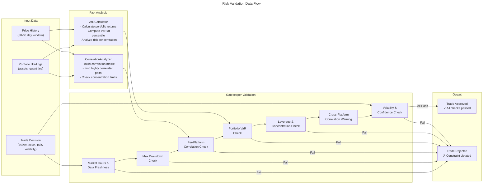

# C4 Code Level: finance_feedback_engine/risk

## Overview

- **Name**: Risk Management Module
- **Description**: Comprehensive risk analysis and validation system for trading decisions, featuring correlation analysis, Value at Risk (VaR) calculations, and trade gatekeeper enforcement
- **Location**: `/finance_feedback_engine/risk`
- **Language**: Python 3.8+
- **Purpose**: Provides risk constraints enforcement, portfolio analysis, and trade validation to prevent excessive losses and concentration in dual-platform trading (Coinbase crypto + Oanda forex)

## Module Architecture

The risk module consists of three interconnected classes that work together to provide comprehensive risk management:

1. **CorrelationAnalyzer** - Pearson correlation analysis for asset correlation detection
2. **VaRCalculator** - Historical Value at Risk calculation for portfolio loss estimation
3. **RiskGatekeeper** - Trade decision validator that enforces all risk constraints

### Data Flow

```
Trading Decision Input
    ↓
RiskGatekeeper.validate_trade()
    ├→ check_market_hours() [Temporal constraints]
    ├→ MarketSchedule.get_market_status() [Market hours]
    ├→ validate_data_freshness() [Data age check]
    ├→ _validate_correlation() [Per-platform correlation limits]
    │  └→ CorrelationAnalyzer results
    ├→ _validate_var() [Combined portfolio VaR limits]
    │  └→ VaRCalculator results
    ├→ _check_cross_platform_correlation() [Systemic risk warning]
    ├→ _validate_leverage_and_concentration() [Position sizing limits]
    └→ Volatility/confidence thresholds
    ↓
Trade Approved/Rejected
```

## Code Elements

### Class: CorrelationAnalyzer

**Location**: `finance_feedback_engine/risk/correlation_analyzer.py`

Calculates Pearson correlation matrices for portfolio holdings to detect concentration risk from correlated assets.

#### Constructor
```python
def __init__(self, lookback_days: int = 30)
```
- **Parameters**:
  - `lookback_days` (int): Historical window for correlation calculation (default: 30)
- **Instance Variables**:
  - `self.lookback_days`: Historical lookback period
  - `self.correlation_threshold`: Per-platform correlation limit (0.7)
  - `self.cross_platform_warning_threshold`: Cross-platform warning threshold (0.5)
- **Description**: Initializes correlation analyzer with 30-day rolling window for statistical significance
- **Line**: 32-44

#### Methods

##### `calculate_pearson_correlation(returns_a, returns_b) → Optional[float]`
- **Location**: Line 46-87
- **Parameters**:
  - `returns_a` (List[float]): First return series (as decimal fractions)
  - `returns_b` (List[float]): Second return series (as decimal fractions)
- **Returns**: Correlation coefficient (-1 to 1) or None if insufficient data
- **Description**: Calculates Pearson correlation between two return series with validation (min 10 data points, non-zero standard deviation)
- **Dependencies**: `statistics.mean`, `statistics.stdev`

##### `build_correlation_matrix(price_history) → Dict[Tuple[str, str], float]`
- **Location**: Line 89-145
- **Parameters**:
  - `price_history` (Dict[str, List[Dict[str, float]]]): Asset prices organized as {asset_id: [{'date', 'price'}, ...]}
- **Returns**: Correlation matrix {(asset_a, asset_b): correlation_coefficient}
- **Description**: Builds complete correlation matrix from price history by calculating daily returns and correlations between all asset pairs
- **Process**:
  1. Converts prices to daily returns for each asset
  2. Aligns return series (uses minimum common length)
  3. Calculates pairwise correlations
  4. Returns symmetric correlation matrix (includes both (a,b) and (b,a))
- **Dependencies**: `calculate_pearson_correlation()`

##### `find_highly_correlated_pairs(correlation_matrix, threshold) → List[Tuple[str, str, float]]`
- **Location**: Line 147-175
- **Parameters**:
  - `correlation_matrix` (Dict[Tuple[str, str], float]): From build_correlation_matrix()
  - `threshold` (float): Minimum correlation for inclusion (default: 0.7)
- **Returns**: List of (asset_a, asset_b, correlation) tuples, sorted by absolute correlation
- **Description**: Identifies and deduplicates highly correlated asset pairs, preventing duplicate (a,b) and (b,a) entries
- **Dependencies**: None

##### `analyze_platform_correlations(holdings, price_history, platform_name) → Dict[str, Any]`
- **Location**: Line 177-255
- **Parameters**:
  - `holdings` (Dict[str, Dict[str, Any]]): Platform holdings {asset_id: {'quantity': X, ...}}
  - `price_history` (Dict[str, List[Dict[str, float]]]): Historical prices
  - `platform_name` (str): Platform identifier ('coinbase', 'oanda', etc.)
- **Returns**: Dictionary containing:
  - `correlation_matrix`: Full correlation matrix
  - `highly_correlated`: Pairs exceeding threshold
  - `max_correlation`: Highest correlation found
  - `concentration_warning`: Warning if >2 assets with >0.7 correlation
  - `platform`: Platform identifier
  - `num_holdings`: Count of holdings
- **Description**: Analyzes single-platform correlations and generates concentration warnings when >2 assets are highly correlated
- **Risk Rule**: Max 2 assets per platform with >0.7 correlation
- **Dependencies**: `build_correlation_matrix()`, `find_highly_correlated_pairs()`, `logging`

##### `analyze_cross_platform_correlation(coinbase_price_history, oanda_price_history) → Dict[str, Any]`
- **Location**: Line 257-354
- **Parameters**:
  - `coinbase_price_history` (Dict[str, List[Dict[str, float]]]): Coinbase price history
  - `oanda_price_history` (Dict[str, List[Dict[str, float]]]): Oanda price history
- **Returns**: Dictionary containing:
  - `cross_correlations`: List of {coinbase_asset, oanda_asset, correlation}
  - `max_correlation`: Maximum correlation found
  - `warning`: Alert if correlation >0.5 (systemic risk indicator)
- **Description**: Analyzes correlation between Coinbase (crypto) and Oanda (forex) holdings. Warning-only (non-blocking) since platforms are financially isolated.
- **Use Case**: Detects systemic USD volatility events affecting both crypto and forex
- **Dependencies**: `calculate_pearson_correlation()`, internal helper `get_returns()`

##### `analyze_dual_platform_correlations(coinbase_holdings, coinbase_price_history, oanda_holdings, oanda_price_history) → Dict[str, Any]`
- **Location**: Line 356-414
- **Parameters**: All holdings and price history for both platforms
- **Returns**: Comprehensive analysis combining:
  - `coinbase`: Platform analysis result
  - `oanda`: Platform analysis result
  - `cross_platform`: Cross-platform analysis result
  - `overall_warnings`: Aggregated warning list
- **Description**: Orchestrates complete dual-platform correlation analysis by calling platform-specific and cross-platform methods
- **Dependencies**: `analyze_platform_correlations()`, `analyze_cross_platform_correlation()`

##### `format_correlation_summary(analysis) → str`
- **Location**: Line 416-457
- **Parameters**:
  - `analysis` (Dict[str, Any]): Result from analyze_dual_platform_correlations()
- **Returns**: Human-readable text summary with platform breakdowns and warnings
- **Description**: Formats correlation analysis for reporting, displaying max correlations, highly correlated pairs, and consolidated warnings
- **Dependencies**: None

---

### Class: VaRCalculator

**Location**: `finance_feedback_engine/risk/var_calculator.py`

Calculates historical Value at Risk (VaR) for dual isolated portfolios (Coinbase + Oanda) using 60-day historical window.

#### Constructor
```python
def __init__(self, lookback_days: int = 60)
```
- **Parameters**:
  - `lookback_days` (int): Historical window for VaR calculation (default: 60)
- **Instance Variables**:
  - `self.lookback_days`: Historical lookback period
- **Description**: Initializes VaR calculator with 60-day window balancing institutional rigor (90+ days) with retail agility (30 days)
- **Line**: 30-38

#### Methods

##### `calculate_historical_var(returns, confidence_level) → float`
- **Location**: Line 40-71
- **Parameters**:
  - `returns` (List[float]): Historical returns as decimal fractions (e.g., 0.02 = 2%)
  - `confidence_level` (float): Confidence level (0.95 or 0.99)
- **Returns**: VaR as decimal fraction (e.g., 0.05 = 5% loss)
- **Description**: Calculates historical VaR from return series by finding the percentile corresponding to the confidence level. Returns are sorted worst-to-best and the loss amount at the percentile is extracted.
- **Validation**: Requires minimum 30 returns; returns 0.0 otherwise
- **Formula**: VaR = abs(sorted_returns[round(len(returns) * (1 - confidence_level))])
- **Dependencies**: None

##### `calculate_portfolio_var(holdings, price_history, confidence_level) → Dict[str, Any]`
- **Location**: Line 73-235
- **Parameters**:
  - `holdings` (Dict[str, Dict[str, Any]]): Holdings {asset_id: {'quantity': X, 'current_price': Y}}
  - `price_history` (Dict[str, List[Dict[str, float]]]): Historical prices {asset_id: [{'date', 'price'}, ...]}
  - `confidence_level` (float): Confidence level (0.95 or 0.99)
- **Returns**: Dictionary containing:
  - `var`: VaR as decimal (e.g., 0.05 = 5%)
  - `var_usd`: VaR in USD
  - `portfolio_value`: Total current portfolio value
  - `subset_portfolio_value`: Value of assets with price history
  - `confidence_level`: Confidence level used
  - `data_quality`: Quality assessment ('good', 'incomplete', 'no_holdings', 'zero_value', 'no_price_history', 'insufficient_common_history', 'missing_price_history')
  - `sample_size`: Number of portfolio returns calculated
  - `missing_assets`: List of assets without price history (if any)
- **Description**: Calculates VaR for a portfolio of holdings using weighted daily returns across the common historical period
- **Important Note**: Assumes constant portfolio composition over the historical period. If portfolio weights changed, VaR estimate may be inaccurate.
- **Process**:
  1. Validates holdings and portfolio value
  2. Calculates daily returns for each asset
  3. Aligns return series to common date range
  4. Computes weighted portfolio returns using current weights
  5. Calculates VaR from portfolio return distribution
- **Dependencies**: `calculate_historical_var()`, `logging`

##### `calculate_dual_portfolio_var(coinbase_holdings, coinbase_price_history, oanda_holdings, oanda_price_history, confidence_level) → Dict[str, Any]`
- **Location**: Line 237-312
- **Parameters**: All holdings and price history for both platforms, confidence level
- **Returns**: Dictionary containing:
  - `coinbase_var`: VaR metrics for Coinbase portfolio
  - `oanda_var`: VaR metrics for Oanda portfolio
  - `combined_var`: VaR metrics for combined portfolio (simple sum)
  - `total_portfolio_value`: Sum of both portfolios
  - `risk_concentration`: Risk concentration analysis
  - `timestamp`: ISO format timestamp of calculation
- **Description**: Calculates VaR separately for isolated platforms and combines them assuming platforms are uncorrelated (conservative approach)
- **Approach**: Since platforms are financially isolated (funds cannot transfer), combined VaR = simple sum of individual VaRs
- **Dependencies**: `calculate_portfolio_var()`, `_analyze_risk_concentration()`, `datetime`

##### `_analyze_risk_concentration(coinbase_var, oanda_var) → Dict[str, Any]`
- **Location**: Line 314-351
- **Parameters**:
  - `coinbase_var` (Dict[str, Any]): Coinbase VaR result
  - `oanda_var` (Dict[str, Any]): Oanda VaR result
- **Returns**: Dictionary containing:
  - `coinbase_pct`: Coinbase portfolio percentage
  - `oanda_pct`: Oanda portfolio percentage
  - `concentration_warning`: Alert if either platform >80% of portfolio
- **Description**: Analyzes risk concentration across platforms, generating warning if one platform dominates portfolio
- **Risk Rule**: Warning if either platform accounts for >80% of portfolio
- **Dependencies**: None

##### `format_var_summary(var_result) → str`
- **Location**: Line 353-384
- **Parameters**:
  - `var_result` (Dict[str, Any]): Result from calculate_dual_portfolio_var()
- **Returns**: Human-readable VaR summary with platform breakdown
- **Description**: Formats VaR analysis for reporting, displaying confidence level, portfolio values, and concentration warnings
- **Dependencies**: None

---

### Class: RiskGatekeeper

**Location**: `finance_feedback_engine/risk/gatekeeper.py`

Validates trade decisions against hybrid risk constraints including market hours, data freshness, correlation limits, VaR limits, leverage, and concentration.

#### Constructor
```python
def __init__(
    max_drawdown_pct: float = 0.05,
    correlation_threshold: float = 0.7,
    max_correlated_assets: int = 2,
    max_var_pct: float = 0.05,
    var_confidence: float = 0.95,
    is_backtest: bool = False
)
```
- **Parameters**:
  - `max_drawdown_pct` (float): Maximum portfolio drawdown (default: 0.05 = 5%)
  - `correlation_threshold` (float): Correlation threshold for per-platform check (default: 0.7)
  - `max_correlated_assets` (int): Max assets with high correlation per platform (default: 2)
  - `max_var_pct` (float): Maximum portfolio VaR as percentage (default: 0.05 = 5%)
  - `var_confidence` (float): VaR confidence level (default: 0.95)
  - `is_backtest` (bool): If True, raise errors on timestamp failures instead of falling back
- **Instance Variables**:
  - Risk constraint thresholds
  - Prometheus metrics for risk blocks
  - Meter instance for observability
- **Description**: Initializes risk gatekeeper with configurable thresholds and Prometheus metrics
- **Line**: 27-62

#### Methods

##### Static Method: `_count_holdings_by_category(holdings) → Dict[str, int]`
- **Location**: Line 64-80
- **Parameters**:
  - `holdings` (Dict[str, str]): Mapping from asset_id to category
- **Returns**: Dictionary mapping category to count of holdings
- **Description**: Helper for legacy category-based correlation checking
- **Dependencies**: None

##### `check_market_hours(decision) → Tuple[bool, Dict]`
- **Location**: Line 82-158
- **Parameters**:
  - `decision` (Dict): Trade decision with market_data containing market_status and data_freshness
- **Returns**: Tuple (needs_override, modified_decision)
- **Description**: Enforces market hours and data freshness rules at gatekeeper level, overriding AI decisions when needed
- **Rules Enforced**:
  1. Block non-crypto trades when market is closed
  2. Block trades when market data is stale (skip in backtest mode)
- **Process**:
  1. Checks market_status.is_open
  2. Skips crypto (24/7 markets)
  3. Checks data_freshness.is_fresh
  4. Modifies decision to HOLD if rules violated
  5. Returns whether decision was modified
- **Dependencies**: `logging`

##### `validate_trade(decision, context) → Tuple[bool, str]`
- **Location**: Line 160-351
- **Parameters**:
  - `decision` (Dict): Trade decision with keys: action, asset_category, volatility, confidence, asset_pair, platform (optional)
  - `context` (Dict): Portfolio context with keys:
    - `recent_performance` (with total_pnl)
    - `holdings` (asset_id → category mapping)
    - `var_analysis` (optional, from VaRCalculator)
    - `correlation_analysis` (optional, from CorrelationAnalyzer)
    - `asset_type` (crypto/forex/stocks)
    - `timestamp` (Unix or ISO format)
    - `market_data_timestamp` (for freshness check)
    - `risk_metrics` (with leverage_estimate)
    - `position_concentration` (with largest_position_pct)
- **Returns**: Tuple (is_allowed, message)
- **Description**: Comprehensive trade validation combining 7 checks executed in sequence:
  1. **Gatekeeper Override** - Market hours and data freshness override (lines 190-201)
  2. **Market Schedule** - Legacy market status check from context (lines 203-261)
  3. **Data Freshness** - Prevents trading on stale data (lines 266-288)
  4. **Max Drawdown** - Portfolio max loss limit (lines 290-306)
  5. **Per-Platform Correlation** - Limits correlated assets per platform (lines 308-311)
  6. **Combined Portfolio VaR** - Portfolio loss at confidence level (lines 313-316)
  7. **Cross-Platform Correlation** - Warning-only systemic risk alert (line 319)
  8. **Leverage/Concentration** - Position sizing limits (lines 321-326)
  9. **Volatility/Confidence** - Market condition thresholds (lines 328-347)
- **Dependencies**: `check_market_hours()`, `_validate_correlation()`, `_validate_var()`, `_check_cross_platform_correlation()`, `_validate_leverage_and_concentration()`, `MarketSchedule.get_market_status()`, `MarketSchedule.get_market_status_at_timestamp()`, `validate_data_freshness()`, `logging`

##### `_validate_correlation(decision, context) → Tuple[bool, str]`
- **Location**: Line 353-417
- **Parameters**:
  - `decision` (Dict): Trade decision
  - `context` (Dict): Portfolio context
- **Returns**: Tuple (is_allowed, message)
- **Description**: Validates per-platform correlation constraints using either enhanced correlation analysis or legacy category-based approach
- **Logic**:
  1. If correlation_analysis available: Check platform-specific concentration_warning
  2. Else: Legacy check - count assets in same category, block if >=max_correlated_assets
  3. Records metrics for correlation blocks
- **Dependencies**: `_count_holdings_by_category()`, `logging`, Prometheus metrics

##### `_validate_var(decision, context) → Tuple[bool, str]`
- **Location**: Line 419-461
- **Parameters**:
  - `decision` (Dict): Trade decision
  - `context` (Dict): Portfolio context with var_analysis
- **Returns**: Tuple (is_allowed, message)
- **Description**: Validates combined portfolio VaR constraint against max_var_pct threshold
- **Process**:
  1. Extracts combined_var from var_analysis
  2. Compares var_pct to max_var_pct
  3. Blocks if exceeded, logs metric
- **Dependencies**: `logging`, Prometheus metrics

##### `_check_cross_platform_correlation(context) → None`
- **Location**: Line 463-480
- **Parameters**:
  - `context` (Dict): Portfolio context
- **Description**: Logs warning for cross-platform correlation (non-blocking). Useful for systemic risk monitoring.
- **Dependencies**: `logging`

##### `_validate_leverage_and_concentration(decision, context) → Tuple[bool, str]`
- **Location**: Line 482-543
- **Parameters**:
  - `decision` (Dict): Trade decision
  - `context` (Dict): Portfolio context with risk_metrics and position_concentration
- **Returns**: Tuple (is_allowed, message)
- **Description**: Validates leverage and position concentration constraints consolidated from pre-execution checks
- **Thresholds**:
  - Max leverage: 5.0 (configurable via context)
  - Max concentration: 25.0% (configurable via context)
- **Process**:
  1. Extracts leverage_estimate from risk_metrics
  2. Extracts largest_position_pct from position_concentration
  3. Compares against thresholds
  4. Blocks and logs metric if exceeded
- **Dependencies**: `logging`, Prometheus metrics

---

## Dependencies

### Internal Dependencies (Finance Feedback Engine)

**Imported by RiskGatekeeper**:
- `finance_feedback_engine.observability.metrics.create_counters` - Prometheus counter creation
- `finance_feedback_engine.observability.metrics.get_meter` - Prometheus meter instance
- `finance_feedback_engine.utils.market_schedule.MarketSchedule` - Market hours checking
- `finance_feedback_engine.utils.validation.validate_data_freshness` - Data age validation

**Used by other modules**:
- `finance_feedback_engine.decision_engine.market_analysis` - Uses CorrelationAnalyzer and VaRCalculator
- `finance_feedback_engine.backtesting.backtester` - Uses RiskGatekeeper
- `finance_feedback_engine.backtesting.portfolio_backtester` - Uses RiskGatekeeper
- `finance_feedback_engine.agent.trading_loop_agent` - Uses RiskGatekeeper

### External Dependencies

- `logging` - Python standard logging module
- `statistics` - Standard library for mean/stdev calculations
- `datetime` - Standard library for timestamp handling
- `typing` - Type hints (Any, Dict, List, Optional, Tuple)

---

## Data Structures

### CorrelationAnalyzer Output

**Return type**: `Dict[str, Any]` from `analyze_dual_platform_correlations()`

```python
{
    "coinbase": {
        "correlation_matrix": {("BTC", "ETH"): 0.823, ...},
        "highly_correlated": [("BTC", "ETH", 0.823), ...],
        "max_correlation": 0.823,
        "concentration_warning": "3 assets with correlation >0.7 on coinbase (limit: 2)" | None,
        "platform": "coinbase",
        "num_holdings": 5
    },
    "oanda": { ... },
    "cross_platform": {
        "cross_correlations": [
            {"coinbase_asset": "BTC", "oanda_asset": "USD_JPY", "correlation": 0.234},
            ...
        ],
        "max_correlation": 0.456,
        "warning": "Cross-platform correlation detected: BTC ↔ USD_JPY (0.456). Systemic risk possible." | None
    },
    "overall_warnings": [
        "3 assets with correlation >0.7 on coinbase (limit: 2)",
        "Cross-platform correlation detected: BTC ↔ USD_JPY (0.456). Systemic risk possible."
    ]
}
```

### VaRCalculator Output

**Return type**: `Dict[str, Any]` from `calculate_dual_portfolio_var()`

```python
{
    "coinbase_var": {
        "var": 0.0523,                           # 5.23% loss at 95% confidence
        "var_usd": 5230.45,                      # Dollar amount
        "portfolio_value": 100000.00,
        "subset_portfolio_value": 100000.00,
        "confidence_level": 0.95,
        "data_quality": "good",                  # or "incomplete"
        "sample_size": 60
    },
    "oanda_var": { ... },
    "combined_var": {
        "var": 0.0745,                           # Combined VaR
        "var_usd": 7450.00,
        "portfolio_value": 100000.00,
        "confidence_level": 0.95
    },
    "total_portfolio_value": 200000.00,
    "risk_concentration": {
        "coinbase_pct": 50.0,
        "oanda_pct": 50.0,
        "concentration_warning": None            # or "Coinbase accounts for >80% of portfolio"
    },
    "timestamp": "2025-01-01T12:00:00.000000"
}
```

### RiskGatekeeper Decision Input

**Trade Decision Dict**:
```python
{
    "action": "BUY",                    # BUY, SELL, HOLD
    "asset_pair": "BTC/USD",
    "asset_category": "crypto",
    "platform": "coinbase",
    "volatility": 0.025,                # 2.5%
    "confidence": 75,                   # 0-100
    "suggested_amount": 1500,
    "recommended_position_size": 0.1,
    "reasoning": "Technical breakout detected...",
    "market_data": {
        "market_status": {
            "is_open": True,
            "session": "Regular",
            "warning": None
        },
        "data_freshness": {
            "is_fresh": True,
            "age_minutes": 2,
            "message": ""
        },
        "asset_type": "crypto"
    }
}
```

**Portfolio Context Dict**:
```python
{
    "holdings": {
        "BTC": "crypto",
        "ETH": "crypto",
        "USD_JPY": "forex"
    },
    "asset_type": "crypto",
    "timestamp": 1735689600,            # Unix timestamp or ISO string
    "market_data_timestamp": 1735689598,
    "recent_performance": {
        "total_pnl": -0.0234              # -2.34%
    },
    "var_analysis": {
        "combined_var": {
            "var": 0.0523,
            "var_usd": 5230.45,
            "portfolio_value": 100000.00,
            "confidence_level": 0.95
        }
    },
    "correlation_analysis": {
        "coinbase": {
            "concentration_warning": None
        },
        "oanda": {
            "concentration_warning": None
        },
        "cross_platform": {
            "warning": None
        }
    },
    "risk_metrics": {
        "leverage_estimate": 1.5
    },
    "position_concentration": {
        "largest_position_pct": 15.5
    },
    "max_leverage": 5.0,                # Configurable threshold
    "max_concentration": 25.0           # Configurable threshold
}
```

---

## Relationships

### Module Interaction Diagram

```mermaid
---
title: Risk Module Component Relationships
---
classDiagram
    namespace RiskModule {
        class CorrelationAnalyzer {
            -lookback_days: int
            -correlation_threshold: float = 0.7
            -cross_platform_warning_threshold: float = 0.5
            +calculate_pearson_correlation(returns_a, returns_b) Optional[float]
            +build_correlation_matrix(price_history) Dict
            +find_highly_correlated_pairs(correlation_matrix, threshold) List
            +analyze_platform_correlations(holdings, price_history, platform) Dict
            +analyze_cross_platform_correlation(cb_prices, oa_prices) Dict
            +analyze_dual_platform_correlations(cb_h, cb_p, oa_h, oa_p) Dict
            +format_correlation_summary(analysis) str
        }
        class VaRCalculator {
            -lookback_days: int
            +calculate_historical_var(returns, confidence) float
            +calculate_portfolio_var(holdings, price_history, confidence) Dict
            +calculate_dual_portfolio_var(cb_h, cb_p, oa_h, oa_p, conf) Dict
            -_analyze_risk_concentration(cb_var, oa_var) Dict
            +format_var_summary(var_result) str
        }
        class RiskGatekeeper {
            -max_drawdown_pct: float = 0.05
            -correlation_threshold: float = 0.7
            -max_correlated_assets: int = 2
            -max_var_pct: float = 0.05
            -var_confidence: float = 0.95
            -is_backtest: bool
            -_meter: Meter
            -_metrics: Dict
            +check_market_hours(decision) Tuple[bool, Dict]
            +validate_trade(decision, context) Tuple[bool, str]
            -_count_holdings_by_category(holdings) Dict
            -_validate_correlation(decision, context) Tuple[bool, str]
            -_validate_var(decision, context) Tuple[bool, str]
            -_check_cross_platform_correlation(context) None
            -_validate_leverage_and_concentration(decision, context) Tuple[bool, str]
        }
    }

    namespace ExternalDependencies {
        class MarketSchedule {
            +get_market_status(asset_pair, asset_type) Dict
            +get_market_status_at_timestamp(asset_pair, asset_type, timestamp) Dict
        }
        class ValidationUtils {
            +validate_data_freshness(timestamp, asset_type, timeframe) Tuple
        }
        class ObservabilityMetrics {
            +get_meter(name) Meter
            +create_counters(meter) Dict
        }
    }

    namespace UsedBy {
        class MarketAnalysis
        class PortfolioBacktester
        class TradingLoopAgent
    }

    CorrelationAnalyzer --|> "uses" : statistics
    VaRCalculator --|> "uses" : datetime
    RiskGatekeeper --|> "uses" : MarketSchedule
    RiskGatekeeper --|> "uses" : ValidationUtils
    RiskGatekeeper --|> "uses" : ObservabilityMetrics
    RiskGatekeeper --|> "validates" : "CorrelationAnalyzer results"
    RiskGatekeeper --|> "validates" : "VaRCalculator results"
    MarketAnalysis --|> "uses" : CorrelationAnalyzer
    MarketAnalysis --|> "uses" : VaRCalculator
    PortfolioBacktester --|> "uses" : RiskGatekeeper
    TradingLoopAgent --|> "uses" : RiskGatekeeper
```

### Data Flow Diagram



### Validation Constraint Hierarchy

```
RiskGatekeeper.validate_trade()
├─ 1. Gatekeeper Override (Temporal: Market Hours & Data Freshness)
│  ├─ if market_closed AND not crypto → HOLD (blocking)
│  └─ if data_stale AND not backtest → HOLD (blocking)
│
├─ 0B. Legacy Market Schedule Check
│  ├─ if market_closed AND not forex → return False
│  └─ Warning if reduce-liquidity periods
│
├─ 1. Data Freshness Validation
│  └─ if stale AND not backtest → return False
│
├─ 2. Max Drawdown Check
│  └─ if total_pnl < -max_drawdown_pct → return False
│
├─ 3. Per-Platform Correlation Check
│  ├─ if correlation_analysis available: check concentration_warning
│  └─ else: legacy category-based count check
│
├─ 4. Combined Portfolio VaR Check
│  └─ if combined_var > max_var_pct → return False
│
├─ 5. Cross-Platform Correlation Warning (Non-blocking)
│  └─ if cross_platform warning → log warning only
│
├─ 6. Leverage & Concentration Check
│  ├─ if leverage > max_leverage → return False
│  └─ if largest_position_pct > max_concentration → return False
│
└─ 7. Volatility/Confidence Threshold
   └─ if volatility > 0.05 AND confidence < 0.80 → return False
```

---

## Risk Management Rules

### Correlation Rules

| Rule | Threshold | Platform | Action | Status |
|------|-----------|----------|--------|--------|
| Per-platform correlation | >0.7 | Coinbase, Oanda | Block if >2 assets | Enforced |
| Cross-platform correlation | >0.5 | Cross-asset | Warning only | Log warning |

### VaR Rules

| Rule | Threshold | Confidence | Action | Status |
|------|-----------|-----------|--------|--------|
| Combined Portfolio VaR | 5% | 95% | Block | Enforced |
| Alternative VaR | 1% | 99% | Block | Configurable |

### Leverage & Concentration Rules

| Rule | Threshold | Action | Status |
|------|-----------|--------|--------|
| Leverage estimate | 5.0 | Block | Enforced |
| Position concentration | 25% | Block | Enforced |
| Platform concentration | 80% | Warning | Enforced |

### Market & Data Rules

| Rule | Condition | Action | Status |
|------|-----------|--------|--------|
| Market hours (Non-crypto) | Market closed | Block trade | Enforced |
| Market hours (Crypto) | N/A (24/7) | Always open | N/A |
| Market hours (Forex) | Friday close/Sunday reopen | Warning, don't block | Enforced |
| Data freshness | Stale data | Block trade | Enforced (skip backtest) |

### Legacy Rules

| Rule | Threshold | Action | Status |
|------|-----------|--------|--------|
| Max drawdown | -5% | Block | Enforced |
| Volatility + Confidence | vol > 5% AND conf < 80% | Block | Enforced |

---

## Usage Examples

### Analyzing Dual-Platform Correlations

```python
from finance_feedback_engine.risk.correlation_analyzer import CorrelationAnalyzer

analyzer = CorrelationAnalyzer(lookback_days=30)

# Analyze both platforms
analysis = analyzer.analyze_dual_platform_correlations(
    coinbase_holdings={"BTC": {"quantity": 1, "current_price": 50000}},
    coinbase_price_history={"BTC": [{"date": "2024-12-01", "price": 49000}, ...]},
    oanda_holdings={"USD_JPY": {"quantity": 1000, "current_price": 145}},
    oanda_price_history={"USD_JPY": [{"date": "2024-12-01", "price": 144}, ...]}
)

print(analyzer.format_correlation_summary(analysis))
```

### Calculating Portfolio VaR

```python
from finance_feedback_engine.risk.var_calculator import VaRCalculator

calculator = VaRCalculator(lookback_days=60)

# Calculate dual-portfolio VaR
var_result = calculator.calculate_dual_portfolio_var(
    coinbase_holdings={...},
    coinbase_price_history={...},
    oanda_holdings={...},
    oanda_price_history={...},
    confidence_level=0.95
)

print(calculator.format_var_summary(var_result))
```

### Validating a Trade Decision

```python
from finance_feedback_engine.risk.gatekeeper import RiskGatekeeper

gatekeeper = RiskGatekeeper(
    max_drawdown_pct=0.05,
    max_var_pct=0.05,
    is_backtest=False
)

decision = {
    "action": "BUY",
    "asset_pair": "BTC/USD",
    "volatility": 0.02,
    "confidence": 85,
    ...
}

context = {
    "holdings": {...},
    "var_analysis": var_result,
    "correlation_analysis": analysis,
    ...
}

is_allowed, message = gatekeeper.validate_trade(decision, context)
if is_allowed:
    print(f"Trade approved: {message}")
else:
    print(f"Trade rejected: {message}")
```

---

## Notes

### Key Design Decisions

1. **Dual Platform Architecture**: Coinbase and Oanda are treated as financially isolated portfolios since funds cannot transfer between them. Combined risk metrics use simple sum (conservative approach).

2. **Lookback Windows**:
   - Correlation: 30-day rolling window for responsiveness
   - VaR: 60-day window for statistical significance

3. **Correlation Thresholds**:
   - Per-platform limit: Max 2 assets with >0.7 correlation
   - Cross-platform: Warning-only at >0.5 (systemic risk, not blocking)

4. **VaR Approach**:
   - Uses historical percentile method (non-parametric)
   - Conservative: assumes constant portfolio composition
   - Supports 95% and 99% confidence levels

5. **Gatekeeper Override**:
   - Market hours and data freshness checked at decision level
   - Overrides AI decisions when temporal constraints violated
   - Prevents trading on stale data in live mode (disabled in backtest)

6. **Metrics Integration**:
   - Prometheus counters track risk blocks by reason (drawdown, correlation, VaR, leverage, concentration)
   - Enables monitoring of risk constraint effectiveness

### Testing Considerations

- Backtest mode (`is_backtest=True`) skips data freshness validation
- Timestamp parsing failures raise exceptions in backtest mode (data corruption prevention)
- Falls back to live market status if timestamp parsing fails in live mode
- Legacy category-based correlation check available as fallback
- Cross-platform correlation is warning-only, never blocks trades
