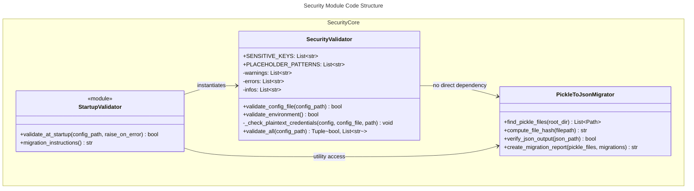
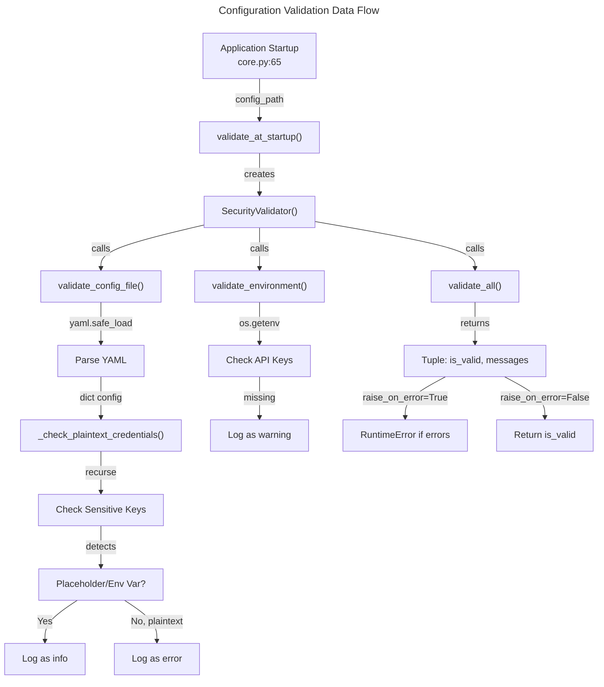

# C4 Code Level: Security Module

## Overview

- **Name**: Finance Feedback Engine Security Module
- **Description**: Security validation and hardening utilities for Finance Feedback Engine, including configuration security validation, environment variable checks, and pickle-to-JSON migration for vulnerability remediation
- **Location**: `finance_feedback_engine/security/`
- **Language**: Python 3.8+
- **Purpose**: Provides security validation at startup to detect plaintext credentials, enforce secure configuration practices, and migrate legacy pickle data storage to JSON format to prevent RCE vulnerabilities

## Code Elements

### Classes

#### `SecurityValidator`
- **Location**: `finance_feedback_engine/security/validator.py:19-199`
- **Description**: Validates security posture of configuration files and environment variables at application startup. Detects plaintext credentials, missing required environment variables, and insecure configuration patterns.
- **Attributes**:
  - `SENSITIVE_KEYS: List[str]` (class attribute) - List of key names that indicate sensitive data (api_key, password, secret, token, passphrase)
  - `PLACEHOLDER_PATTERNS: List[str]` (class attribute) - List of placeholder text patterns that indicate unfilled template values
  - `warnings: List[str]` (instance) - List of warning messages found during validation
  - `errors: List[str]` (instance) - List of critical error messages found during validation
  - `infos: List[str]` (instance) - List of informational messages found during validation

- **Methods**:

  - `__init__(self) -> None`
    - Location: `validator.py:36-40`
    - Description: Initialize security validator with empty message lists
    - Parameters: None
    - Returns: None
    - Dependencies: None

  - `validate_config_file(self, config_path: Path) -> bool`
    - Location: `validator.py:42-59`
    - Description: Validate a configuration file for plaintext credentials and insecure settings
    - Parameters:
      - `config_path: Path` - Path to YAML configuration file
    - Returns: `bool` - True if valid (no critical errors), False if errors found
    - Dependencies: `yaml.safe_load()`, `pathlib.Path`, `_check_plaintext_credentials()`
    - Logic: Opens YAML file, parses content, checks for plaintext credentials

  - `validate_environment(self) -> bool`
    - Location: `validator.py:61-85`
    - Description: Validate environment variables for required secrets based on deployment mode
    - Parameters: None
    - Returns: `bool` - True if all required variables set (warnings don't fail validation)
    - Dependencies: `os.getenv()`, logging
    - Logic: Checks for ALPHA_VANTAGE_API_KEY (always required), conditionally checks for trading platform credentials based on TRADING_PLATFORM env var

  - `_check_plaintext_credentials(self, config: Dict, config_file: str, path: str = "") -> None`
    - Location: `validator.py:87-136`
    - Description: Recursively check configuration dictionaries for plaintext credentials (private method)
    - Parameters:
      - `config: Dict` - Configuration dictionary to check
      - `config_file: str` - Name of config file being validated (for error messages)
      - `path: str` - Current path in nested dict (for error messages, defaults to empty)
    - Returns: `None` (modifies instance state via self.errors/infos)
    - Dependencies: None
    - Logic: Recursively traverses dict/list structures, identifies sensitive keys, checks if values are placeholders or environment variables, reports plaintext credentials as errors

  - `validate_all(self, config_path: Path) -> Tuple[bool, List[str]]`
    - Location: `validator.py:138-168`
    - Description: Run all security validations and return combined results with all messages
    - Parameters:
      - `config_path: Path` - Path to main configuration file
    - Returns: `Tuple[bool, List[str]]` - (is_valid: bool, messages_list: all messages)
    - Dependencies: `validate_config_file()`, `validate_environment()`, logging
    - Logic: Runs config and environment validations, logs all messages, returns validity status and message list

#### `PickleToJsonMigrator`
- **Location**: `finance_feedback_engine/security/pickle_migration.py:18-139`
- **Description**: Utility class for migrating pickle vector store files to JSON format to remediate CRT-2 RCE vulnerability (CVSS 9.8). All methods are static utilities.
- **Attributes**: None (all methods are static)

- **Methods**:

  - `find_pickle_files(root_dir: Path = None) -> list[Path]` (static)
    - Location: `pickle_migration.py:20-41`
    - Description: Find all pickle files in project that store sensitive data (vector stores, caches, memory)
    - Parameters:
      - `root_dir: Path | None` - Root directory to search (defaults to project root by finding pyproject.toml or setup.py)
    - Returns: `list[Path]` - List of pickle file paths found
    - Dependencies: `pathlib.Path`, `rglob()`, `exists()`
    - Logic: Searches for .pkl and .pickle files, filters to data-related files (data/, memory/, vectors), excludes __pycache__ and site-packages

  - `compute_file_hash(filepath: Path) -> str` (static)
    - Location: `pickle_migration.py:43-54`
    - Description: Compute SHA256 hash of file for integrity verification
    - Parameters:
      - `filepath: Path` - Path to file to hash
    - Returns: `str` - Hex digest of SHA256 hash
    - Dependencies: `hashlib.sha256()`, file I/O
    - Logic: Reads file in 4KB blocks, computes incremental SHA256 hash

  - `verify_json_output(json_path: Path) -> bool` (static)
    - Location: `pickle_migration.py:56-68`
    - Description: Verify that JSON file is valid, readable, and has expected structure
    - Parameters:
      - `json_path: Path` - Path to JSON file to verify
    - Returns: `bool` - True if valid JSON with dict root, False otherwise
    - Dependencies: `json.load()`, logging
    - Logic: Loads JSON file, verifies root is a dictionary (not array), catches parsing/IO errors

  - `create_migration_report(pickle_files: list[Path], migrations: Dict[str, Dict[str, Any]]) -> str` (static)
    - Location: `pickle_migration.py:70-106`
    - Description: Create human-readable migration report showing status of all pickle files
    - Parameters:
      - `pickle_files: list[Path]` - List of pickle files found
      - `migrations: Dict[str, Dict[str, Any]]` - Migration results with status for each file
    - Returns: `str` - Formatted report string
    - Dependencies: String formatting
    - Logic: Creates formatted report with file list, status counts, migration instructions

### Module Functions

#### `validate_at_startup(config_path: Path, raise_on_error: bool = False) -> bool`
- **Location**: `finance_feedback_engine/security/validator.py:201-228`
- **Description**: Run security validation at application startup with optional exception raising
- **Parameters**:
  - `config_path: Path` - Path to configuration file
  - `raise_on_error: bool` - If True, raises RuntimeError on critical errors (default: False)
- **Returns**: `bool` - True if validation passed, False if critical errors found
- **Raises**: `RuntimeError` - If raise_on_error=True and critical errors found
- **Dependencies**: `SecurityValidator()`, `validate_all()`, logging
- **Location in codebase**: Called in `finance_feedback_engine/core.py:65`
- **Usage example**: `validate_at_startup(Path('config/config.yaml'), raise_on_error=False)`

#### `migration_instructions() -> str`
- **Location**: `finance_feedback_engine/security/pickle_migration.py:142-188`
- **Description**: Return detailed migration instructions for pickle to JSON conversion
- **Parameters**: None
- **Returns**: `str` - Formatted instructions and migration plan
- **Dependencies**: None
- **Usage example**: Called as `__main__` block in pickle_migration.py for CLI usage

## Dependencies

### Internal Dependencies

#### Direct Usage in Codebase
- **finance_feedback_engine/core.py**
  - Imports: `from .security.validator import validate_at_startup`
  - Usage: Called at startup in application initialization (line 65)
  - Validates config file before main application logic

- **finance_feedback_engine/api/dependencies.py**
  - Indirect dependency through core module
  - Uses security validation results

- **tests/security/test_validator.py**
  - Test module for SecurityValidator class
  - Unit tests for all validation methods

#### Module Exports
- **finance_feedback_engine/security/__init__.py**
  - Exports: `SecurityValidator`, `validate_at_startup`
  - Makes security module accessible as: `from finance_feedback_engine.security import SecurityValidator, validate_at_startup`

### External Dependencies

#### Standard Library
- `logging` - Standard logging module for application logging
- `os` - Environment variable access via `os.getenv()`
- `pathlib.Path` - File path handling and directory traversal
- `typing` - Type hints (Dict, List, Tuple, Any)
- `hashlib` - SHA256 hash computation for file integrity verification
- `json` - JSON file parsing and validation

#### Third-Party Libraries
- `yaml` - YAML parsing for configuration file validation (PyYAML)
  - Used in `SecurityValidator.validate_config_file()` via `yaml.safe_load()`
  - Ensures safe parsing without code execution risk

#### Configuration Files
- `.env` - Environment variables for API keys and credentials
- `.env.example` - Template for environment variables
- `config/config.yaml` - Main configuration file being validated

## Relationships

### Security Validation Flow

The security module follows a hierarchical validation pattern with multiple checkpoints:

### Data Flow: Configuration Validation

### Security Patterns

1. **Configuration Security Checking**
   - Validates all config files for plaintext credentials
   - Enforces environment variable usage via `${ENV_VAR_NAME}` syntax
   - Detects placeholder values that haven't been replaced

2. **Environment Validation**
   - Checks for required API keys (conditional based on deployment mode)
   - Alerts on missing credentials without blocking startup
   - Differentiates between required and optional credentials

3. **Pickle to JSON Migration (Vulnerability Remediation)**
   - Addresses CRT-2 RCE vulnerability (CVSS 9.8)
   - Provides utilities to find, hash, and migrate pickle files
   - Validates JSON output integrity
   - Supports deprecation timeline (v2.0.1: warn, v2.1.0: remove)

## Security Considerations

### Plaintext Credential Detection
- **Purpose**: Prevent accidental commit of API keys and secrets
- **Detection Method**:
  - Checks key names against SENSITIVE_KEYS list (api_key, password, secret, token, passphrase)
  - Checks values against PLACEHOLDER_PATTERNS (YOUR_, REPLACE_, CHANGE_, example)
  - Verifies non-placeholder values are either env vars (`${...}`) or empty
- **Error Level**: Critical - prevents startup if raise_on_error=True
- **Recovery**: Move credentials to .env file, use env var references in config

### Pickle RCE Vulnerability Remediation
- **CVE/Issue**: CRT-2, CVSS 9.8
- **Risk**: pickle.load() can execute arbitrary code on malicious pickle data
- **Mitigation**:
  - Find all pickle files using find_pickle_files()
  - Migrate to JSON format using PickleToJsonMigrator
  - Verify integrity using SHA256 hashes
  - Deprecate pickle format over release cycle

### Environment Variable Security
- **Required for All Modes**: ALPHA_VANTAGE_API_KEY
- **Required for Trading Platforms**: COINBASE_API_KEY, COINBASE_API_SECRET (unless using mock platform)
- **Mock Mode**: Allows development/testing without real credentials
- **Error Level**: Warning - doesn't block startup but alerts on missing credentials

## Notes

### Integration Points
- **Called at**: Application startup in `finance_feedback_engine/core.py:65`
- **Configuration**: Uses config file path from application initialization
- **Logging**: Uses standard Python logging with module logger

### Deprecation Timeline for Pickle Format
- **v2.0.1+**: Warn on pickle load, save as JSON
- **v2.1.0**: Remove pickle support entirely
- **Migration CLI**: Planned command `python main.py migrate-pickle-to-json`

### Testing
- Unit tests in `tests/security/test_validator.py`
- Tests cover:
  - Plaintext credential detection
  - Environment variable validation
  - Placeholder pattern recognition
  - YAML parsing and error handling
  - Nested configuration checking

### Future Enhancements
- Automated pickle-to-JSON migration CLI command
- Integration with CI/CD for pre-commit credential detection
- Support for additional secret detection patterns
- Encryption of sensitive configuration files
