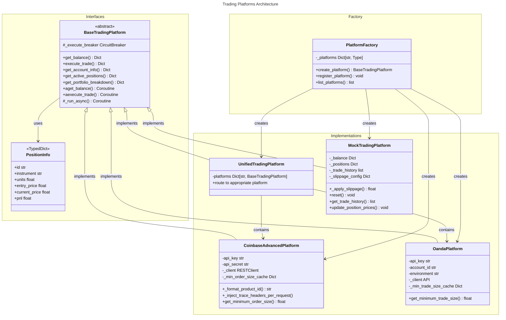

# C4 Code Level: Trading Platforms

## Overview

- **Name**: Trading Platforms Module
- **Description**: Multi-platform trading integration layer providing a unified interface for executing trades and managing positions across multiple trading platforms (Coinbase Advanced for crypto futures, Oanda for forex, and a mock platform for testing).
- **Location**: `/finance_feedback_engine/trading_platforms/`
- **Language**: Python 3.8+
- **Purpose**: Abstracts platform-specific API details and provides a consistent interface for trading execution, position tracking, and portfolio management across heterogeneous trading platforms.

## Code Elements

### Classes

#### `BaseTradingPlatform` (Abstract Base Class)
- **File**: `finance_feedback_engine/trading_platforms/base_platform.py`
- **Lines**: 1-244
- **Description**: Abstract base class that defines the standard interface all trading platform implementations must follow. Establishes contract for balance retrieval, trade execution, account information, and position management. Includes async adapters for all synchronous methods.
- **Key Methods**:
  - `__init__(credentials: Dict[str, Any]) -> None`: Initialize with platform credentials and circuit breaker support
  - `get_balance() -> Dict[str, float]`: Get account balances (abstract)
  - `aget_balance() -> Dict[str, float]`: Async adapter for get_balance
  - `execute_trade(decision: Dict[str, Any]) -> Dict[str, Any]`: Execute a trade based on decision (abstract)
  - `aexecute_trade(decision: Dict[str, Any]) -> Dict[str, Any]`: Async adapter with circuit breaker protection
  - `get_account_info() -> Dict[str, Any]`: Get account information (abstract)
  - `aget_account_info() -> Dict[str, Any]`: Async adapter for get_account_info
  - `get_active_positions() -> PositionsResponse`: Get currently open positions (abstract)
  - `aget_active_positions() -> PositionsResponse`: Async adapter for get_active_positions
  - `get_portfolio_breakdown() -> Dict[str, Any]`: Get detailed portfolio metrics (optional, default implementation available)
  - `aget_portfolio_breakdown() -> Dict[str, Any]`: Async adapter for get_portfolio_breakdown
  - `get_execute_breaker() -> Optional[CircuitBreaker]`: Retrieve attached circuit breaker
  - `set_execute_breaker(breaker: Optional[object]) -> None`: Attach circuit breaker instance
  - `_run_async(func, *args, **kwargs)`: Helper to run sync/async code without blocking event loop
- **Type Definitions**:
  - `PositionInfoRequired` (TypedDict): Required fields for position (id, instrument, units, entry_price, current_price, pnl, opened_at)
  - `PositionInfo` (TypedDict): Position data with optional metadata (platform, leverage, position_type, contracts, product_id, side, unrealized_pnl, daily_pnl)
  - `PositionsResponse` (type alias): Dict[str, List[PositionInfo]] response structure
- **Dependencies**:
  - `asyncio`: Event loop management and thread pooling
  - `inspect`: Runtime inspection of coroutines and callables
  - `abc.ABC`, `abc.abstractmethod`: Abstract base class definition
  - `typing`: Type hints and TypedDict

#### `PlatformFactory`
- **File**: `finance_feedback_engine/trading_platforms/platform_factory.py`
- **Lines**: 1-185
- **Description**: Factory class for creating trading platform instances with support for platform registration, extensibility, and automatic circuit breaker attachment. Provides both platform-specific constructors and a unified factory method.
- **Key Methods**:
  - `create_platform(platform_name: str, credentials: Dict[str, Any], config: Dict[str, Any] = None) -> BaseTradingPlatform`: Main factory method that creates and configures platform instances with circuit breaker protection. Supports dynamic constructor detection (new-style with config parameter vs legacy credentials-only).
  - `register_platform(platform_name: str, platform_class: type) -> None`: Register a new custom platform class for factory instantiation
  - `list_platforms() -> list`: Get list of all available platform names
  - `_platforms` (class variable dict): Registry mapping platform names to class constructors
- **Nested Class**:
  - `MockPlatform`: Lightweight inline mock for legacy compatibility (provides get_balance, execute_trade, get_account_info, get_portfolio_breakdown)
- **Supported Platforms**:
  - `"coinbase"`, `"coinbase_advanced"` -> CoinbaseAdvancedPlatform
  - `"oanda"` -> OandaPlatform
  - `"unified"` -> UnifiedTradingPlatform
  - `"mock"` -> MockTradingPlatform (comprehensive stateful mock)
  - `"mock_simple"` -> PlatformFactory.MockPlatform (lightweight inline mock)
- **Dependencies**:
  - `logging`: Platform creation and lifecycle logging
  - `inspect`: Signature detection for constructor compatibility
  - `finance_feedback_engine.utils.circuit_breaker.CircuitBreaker`: Automatic circuit breaker injection
  - Submodules: base_platform, coinbase_platform, oanda_platform, unified_platform, mock_platform

#### `UnifiedTradingPlatform`
- **File**: `finance_feedback_engine/trading_platforms/unified_platform.py`
- **Lines**: 1-378
- **Description**: Aggregates data from multiple trading platforms (Coinbase and Oanda) into a single unified interface. Routes trades to appropriate platforms based on asset classification (crypto to Coinbase, forex to Oanda). Merges account data across platforms.
- **Key Methods**:
  - `__init__(credentials: Dict[str, Any]) -> None`: Initialize with credentials for sub-platforms (coinbase/coinbase_advanced and/or oanda). Instantiates child platform objects.
  - `get_balance() -> Dict[str, float]`: Combine balances from all configured platforms with platform-prefixed keys (e.g., "coinbase_FUTURES_USD")
  - `execute_trade(decision: Dict[str, Any]) -> Dict[str, Any]`: Route trade to appropriate platform based on asset pair classification. Uses asset_classifier to determine target.
  - `get_account_info() -> Dict[str, Any]`: Merge account info from all sub-platforms
  - `get_active_positions() -> PositionsResponse`: Combine open positions from all platforms, adding platform label to each position
  - `get_portfolio_breakdown() -> Dict[str, Any]`: Aggregate portfolio data including total value, per-platform cash, unrealized P&L, and detailed holdings with recalculated allocations
- **Instance Variables**:
  - `platforms: Dict[str, BaseTradingPlatform]`: Child platform instances
- **Dependencies**:
  - `finance_feedback_engine.utils.asset_classifier.classify_asset_pair`: Asset class detection (crypto vs forex)
  - `finance_feedback_engine.utils.validation.standardize_asset_pair`: Asset pair normalization
  - `finance_feedback_engine.utils.circuit_breaker.CircuitBreaker`: Trade execution protection
  - `finance_feedback_engine.monitoring.prometheus.update_circuit_breaker_state`: Metrics emission (optional, exception-safe)
  - base_platform, coinbase_platform, oanda_platform: Sub-platform implementations

#### `CoinbaseAdvancedPlatform`
- **File**: `finance_feedback_engine/trading_platforms/coinbase_platform.py`
- **Lines**: 1-1176
- **Description**: Integration with Coinbase Advanced Trade API for perpetual futures trading. Supports long/short positions, margin trading with leveraged positions, and order execution with slippage/pricing information. Includes defensive header injection for distributed tracing.
- **Key Methods**:
  - `__init__(credentials: Dict[str, Any], config: Optional[Dict[str, Any]] = None) -> None`: Initialize with API key/secret and optional timeout configuration
  - `_get_client() -> RESTClient`: Lazy initialization of Coinbase REST client with trace header injection
  - `_format_product_id(asset_pair: str) -> str`: Normalize asset pair formats (BTCUSD, BTC/USD, BTC-USD all become BTC-USD)
  - `_inject_trace_headers_per_request() -> None`: Inject fresh trace headers before each request for distributed tracing
  - `get_minimum_order_size(asset_pair: str) -> float`: Query and cache minimum order size for an asset pair (24-hour TTL)
  - `invalidate_minimum_order_size_cache(asset_pair: str = None) -> None`: Clear cache entries after failed orders
  - `get_balance() -> Dict[str, float]`: Fetch futures account balance plus spot USD/USDC balances
  - `get_portfolio_breakdown() -> Dict[str, Any]`: Comprehensive portfolio including futures positions, summary, spot holdings, and leverage info
  - `execute_trade(decision: Dict[str, Any]) -> Dict[str, Any]`: Market order execution with retry logic (3 attempts, 2-second backoff)
  - `get_active_positions() -> Dict[str, Any]`: Fetch open long/short futures positions
  - `get_account_info() -> Dict[str, Any]`: Account details including platform type, balances, portfolio, and max leverage
- **Class Variables**:
  - `_min_order_size_cache: Dict[str, tuple]`: In-memory cache mapping asset pairs to (min_size, timestamp) tuples
  - `_cache_ttl_seconds: int = 86400`: Cache time-to-live in seconds (24 hours)
- **Dependencies**:
  - `coinbase.rest.RESTClient`: Coinbase Advanced Trade API client (lazy import)
  - `requests.exceptions.RequestException`: Network error handling
  - `tenacity`: Retry decorator with exponential backoff
  - `finance_feedback_engine.observability.context.get_trace_headers`: Distributed trace context
  - `time`, `uuid`: Latency tracking and unique ID generation
  - base_platform: Abstract base class and type definitions

#### `OandaPlatform`
- **File**: `finance_feedback_engine/trading_platforms/oanda_platform.py`
- **Lines**: 1-843
- **Description**: Integration with Oanda for forex trading. Manages forex positions, provides multi-currency portfolio breakdown with live pricing, margin and leverage calculations, and trade execution for currency pairs.
- **Key Methods**:
  - `__init__(credentials: Dict[str, Any], config: Optional[Dict[str, Any]] = None) -> None`: Initialize with access token, account ID, environment (practice/live), and optional timeout configuration
  - `_get_client() -> API`: Lazy initialization of oandapyV20 API context with trace header injection
  - `get_minimum_trade_size(asset_pair: str) -> float`: Query and cache minimum trade size for currency pair (24-hour TTL)
  - `invalidate_minimum_trade_size_cache(asset_pair: str = None) -> None`: Clear cache entries after failed orders
  - `get_balance() -> Dict[str, float]`: Get account balance in base currency
  - `get_portfolio_breakdown() -> Dict[str, Any]`: Detailed forex portfolio with live pricing for all positions, currency conversion, margin analysis, and exposure metrics
  - `execute_trade(decision: Dict[str, Any]) -> Dict[str, Any]`: Execute forex market order with stop loss support, handles HOLD action
  - `get_active_positions() -> PositionsResponse`: Fetch open forex positions with bid/ask pricing
  - `get_account_info() -> Dict[str, Any]`: Account details including balance, NAV, margin usage, and effective leverage
- **Class Variables**:
  - `_min_trade_size_cache: Dict[str, tuple]`: In-memory cache for minimum trade sizes
  - `_cache_ttl_seconds: int = 86400`: Cache time-to-live (24 hours)
- **Dependencies**:
  - `oandapyV20.API`: Oanda API client (lazy import)
  - `oandapyV20.endpoints.{accounts, positions, pricing, orders}`: Endpoint classes (lazy imports)
  - `finance_feedback_engine.observability.context.get_trace_headers`: Distributed tracing
  - `logging`: API activity logging
  - base_platform: Abstract interface and type definitions

#### `MockTradingPlatform`
- **File**: `finance_feedback_engine/trading_platforms/mock_platform.py`
- **Lines**: 1-557
- **Description**: Stateful simulation of a trading platform for backtesting and development without external API calls. Maintains internal balances and positions, applies realistic slippage, and provides complete trading history for analysis.
- **Key Methods**:
  - `__init__(credentials: Optional[Dict[str, Any]] = None, initial_balance: Optional[Dict[str, float]] = None, slippage_config: Optional[Dict[str, Any]] = None) -> None`: Initialize with optional starting balance and slippage configuration
  - `_apply_slippage(price: float, action: str) -> float`: Apply market impact and bid-ask spread to execution price (supports percentage and fixed slippage types)
  - `get_balance() -> Dict[str, float]`: Get current account balances (FUTURES_USD, SPOT_USD, SPOT_USDC, USD)
  - `execute_trade(decision: Dict[str, Any]) -> Dict[str, Any]`: Execute simulated trade with full Coinbase response format (slippage, fees, position updates)
  - `get_account_info() -> Dict[str, Any]`: Return account metadata matching Coinbase format
  - `get_active_positions() -> Dict[str, Any]`: Get current open positions with P&L calculations
  - `get_portfolio_breakdown() -> Dict[str, Any]`: Detailed portfolio including futures positions, spot holdings, allocations, and summary metrics
  - `reset(initial_balance: Optional[Dict[str, float]] = None) -> None`: Reset platform state for new backtesting runs
  - `get_trade_history() -> list`: Retrieve all executed trades for analytics
  - `get_positions() -> Dict[str, Any]`: Get raw position dictionary
  - `update_position_prices(price_updates: Dict[str, float]) -> None`: Update current prices for positions (useful for live price feeds during backtesting)
- **Instance Variables**:
  - `_balance: Dict[str, float]`: Current account balances
  - `_positions: Dict[str, dict]`: Open positions by asset pair with entry price, contracts, side, PnL
  - `_trade_history: list`: Complete record of all executed trades
  - `_slippage_config: Dict[str, Any]`: Slippage configuration (type, rate, spread)
  - `_error_rate: float`: Simulated error rate for testing failure scenarios
  - `_account_id: str`: Mock account identifier
  - `_contract_multiplier: float = 0.1`: Coinbase futures contract size multiplier
- **Dependencies**:
  - `logging`, `time`, `uuid`, `datetime`: Logging, latency tracking, unique IDs, timestamps
  - base_platform: Abstract base class

### Type Definitions

#### `PositionInfoRequired` (TypedDict)
- **Location**: `base_platform.py`, lines 13-19
- **Fields**:
  - `id: str`: Unique position identifier
  - `instrument: str`: Trading instrument (e.g., "BTC-USD", "EUR_USD")
  - `units: float`: Position size in contracts or units (signed for direction)
  - `entry_price: float`: Entry price for the position
  - `current_price: float`: Current market price
  - `pnl: float`: Realized or unrealized profit/loss
  - `opened_at: Optional[str]`: ISO 8601 timestamp when position was opened

#### `PositionInfo` (TypedDict)
- **Location**: `base_platform.py`, lines 21-35
- **Extends**: PositionInfoRequired
- **Additional Optional Fields**:
  - `platform: str`: Source platform name
  - `leverage: float`: Leverage applied to position
  - `position_type: str`: Position type (LONG, SHORT)
  - `contracts: float`: Number of contracts (unsigned)
  - `product_id: Optional[str]`: Coinbase product ID
  - `side: str`: Position side (LONG or SHORT)
  - `unrealized_pnl: float`: Unrealized profit/loss
  - `daily_pnl: float`: Daily realized profit/loss

## Module Organization

### File Structure
```
finance_feedback_engine/trading_platforms/
├── __init__.py                 # Module exports
├── base_platform.py            # Abstract base class and interfaces
├── platform_factory.py         # Factory pattern implementation
├── unified_platform.py         # Multi-platform aggregation
├── coinbase_platform.py        # Coinbase Advanced integration
├── oanda_platform.py           # Oanda forex integration
└── mock_platform.py            # Mock implementation for testing
```

### Module Exports (`__init__.py`)
- `BaseTradingPlatform`: Abstract base class
- `CoinbaseAdvancedPlatform`: Coinbase implementation
- `OandaPlatform`: Oanda implementation
- `UnifiedTradingPlatform`: Multi-platform aggregator
- `MockTradingPlatform`: Mock implementation
- `PlatformFactory`: Factory class

## Dependencies

### Internal Dependencies (Same Repository)

#### Utility Modules
- `finance_feedback_engine.utils.circuit_breaker`:
  - `CircuitBreaker`: Failure rate tracking and flow control for trade execution
  - `CircuitState`: Circuit state enumeration (CLOSED, OPEN, HALF_OPEN)
  - `update_circuit_breaker_state()`: Metrics emission for circuit state changes

- `finance_feedback_engine.utils.asset_classifier`:
  - `classify_asset_pair(asset_pair: str) -> str`: Determines asset class (crypto, forex, commodities, etc.)

- `finance_feedback_engine.utils.validation`:
  - `standardize_asset_pair(raw_pair: str) -> str`: Normalizes asset pair format

#### Observability Modules
- `finance_feedback_engine.observability.context`:
  - `get_trace_headers() -> Dict[str, str]`: Retrieves distributed trace context (correlation ID, traceparent)

- `finance_feedback_engine.monitoring.prometheus`:
  - `update_circuit_breaker_state()`: Prometheus metrics for circuit breaker state (optional, exception-safe)

### External Dependencies

#### Third-Party Libraries

**Coinbase Integration**:
- `coinbase-advanced-py` (optional, lazy import)
  - Module: `coinbase.rest.RESTClient`
  - Purpose: Perpetual futures API client
  - Used by: `CoinbaseAdvancedPlatform`

**Oanda Integration**:
- `oandapyV20` (optional, lazy import)
  - Modules:
    - `oandapyV20.API`: Main API context
    - `oandapyV20.endpoints.accounts`: Account operations
    - `oandapyV20.endpoints.positions`: Position management
    - `oandapyV20.endpoints.pricing`: Live pricing data
    - `oandapyV20.endpoints.orders`: Order management
  - Purpose: Forex trading API client
  - Used by: `OandaPlatform`

**Resilience**:
- `tenacity`
  - Classes: `retry`, `retry_if_exception_type`, `stop_after_attempt`, `wait_fixed`
  - Purpose: Automatic retry with exponential backoff for API calls
  - Used by: `CoinbaseAdvancedPlatform.execute_trade()`

**Standard Library**:
- `asyncio`: Async/await support and thread pooling
- `inspect`: Runtime function inspection (coroutine detection)
- `abc`: Abstract base class definitions
- `logging`: Structured logging throughout
- `time`: Latency tracking and sleep operations
- `uuid`: Unique identifier generation
- `datetime`: Timestamp operations
- `typing`: Type hints and annotations
- `requests.exceptions`: HTTP error handling (RequestException)

## Relationships

### Class Hierarchy
```
BaseTradingPlatform (ABC)
├── CoinbaseAdvancedPlatform
├── OandaPlatform
├── UnifiedTradingPlatform
└── MockTradingPlatform
```

### Composition and Aggregation

**UnifiedTradingPlatform** aggregates:
- 1..N `CoinbaseAdvancedPlatform` instances (for crypto futures)
- 0..1 `OandaPlatform` instances (for forex)

**PlatformFactory**:
- Creates instances of all platform types
- Maintains registry of platform classes
- Attaches `CircuitBreaker` instances to platforms
- Detects constructor signatures for compatibility

### Data Flow



### API Contracts

#### Trade Decision Input
```python
{
    "id": "decision-id-string",
    "asset_pair": "BTC-USD" | "EUR_USD" | "BTCUSD",
    "action": "BUY" | "SELL" | "HOLD",
    "suggested_amount": 1000.0,  # USD notional for crypto, units for forex
    "entry_price": 50000.0,       # Market price at decision time
    "timestamp": "2024-01-01T00:00:00Z",  # ISO 8601
    "stop_loss_percentage": 0.02,  # Optional, for forex
}
```

#### Trade Execution Response
```python
{
    "success": true | false,
    "platform": "coinbase_advanced" | "oanda" | "unified" | "mock",
    "decision_id": "decision-id",
    "order_id": "order-id",
    "order_status": "FILLED" | "PENDING" | "REJECTED",
    "filled_size": 0.5,            # Contracts/units filled
    "execution_price": 50100.0,     # Actual execution price
    "total_value": 1000.0,          # Notional value
    "fee_amount": 0.6,              # Trading fee
    "slippage_applied": 0.2,        # Slippage percentage
    "latency_seconds": 0.456,       # API call latency
    "timestamp": "2024-01-01T00:00:00Z",
    "error": null | "error message",
    "response": {}                  # Platform-specific response
}
```

#### Portfolio Breakdown Response
```python
{
    "total_value_usd": 50000.0,
    "futures_value_usd": 30000.0,
    "spot_value_usd": 20000.0,
    "num_assets": 5,
    "unrealized_pnl": 1500.0,
    "futures_positions": [
        {
            "product_id": "BTC-USD",
            "side": "LONG",
            "contracts": 1.0,
            "entry_price": 50000.0,
            "current_price": 51000.0,
            "unrealized_pnl": 100.0,
            "leverage": 10.0
        }
    ],
    "futures_summary": {
        "total_balance_usd": 30000.0,
        "unrealized_pnl": 1500.0,
        "daily_realized_pnl": 250.0,
        "buying_power": 60000.0,
        "initial_margin": 5000.0
    },
    "holdings": [
        {
            "asset": "USD",
            "amount": 20000.0,
            "value_usd": 20000.0,
            "allocation_pct": 40.0
        }
    ],
    "platform_breakdowns": {}  # Unified platform only
}
```

## Key Design Patterns

### 1. Abstract Factory with Registry
- `PlatformFactory` implements the factory pattern with a dynamic registry
- New platforms can be registered at runtime with `register_platform()`
- Supports both legacy (credentials-only) and new-style (credentials + config) constructors

### 2. Adapter/Wrapper for Async
- All platforms provide both sync and async methods (e.g., `get_balance()` and `aget_balance()`)
- `_run_async()` helper handles both async and sync implementations transparently
- Async methods never block the event loop, even for synchronous platform APIs

### 3. Circuit Breaker Pattern
- Trade execution (`aexecute_trade()`) is protected by an optional circuit breaker
- Breaker is automatically attached by `PlatformFactory` on platform creation
- Tracks failure rates and gracefully degrades on platform unavailability

### 4. Multi-Platform Aggregation
- `UnifiedTradingPlatform` abstracts away platform selection logic
- Asset classification determines which platform handles each trade
- Portfolio data is merged across platforms with consistent naming conventions

### 5. Lazy Initialization
- API clients (`_client`) are initialized only on first use
- Reduces startup time and handles missing dependencies gracefully
- Supports both Coinbase and Oanda SDK versions with defensive initialization

### 6. Distributed Tracing Integration
- Trace context (correlation ID, traceparent) is injected into platform API clients
- Headers are updated defensively with fallback strategies if client structure varies
- Per-request trace injection for comprehensive request-level tracing

## Error Handling Strategies

### Coinbase Platform
- **Retry Logic**: 3 attempts with 2-second fixed backoff for transient errors (RequestException, ConnectionError, TimeoutError)
- **Idempotency**: Uses `client_order_id` to detect and reuse existing orders, preventing duplicates
- **Fallback Values**: Defaults to $10 minimum order size if API query fails, with cache invalidation on order failure

### Oanda Platform
- **HOLD Handling**: HOLD action is a no-op success response (no trade executed)
- **Error Detection**: Checks for `errorMessage` and `orderRejectTransaction` in response
- **Default Leverage**: Uses 1/margin_rate for effective leverage, defaults to 50x if not available
- **Pricing Fallback**: Handles missing pricing data gracefully, logs observable gaps

### Mock Platform
- **Error Simulation**: Configurable error rate for chaos testing
- **Validation**: Input validation with detailed error messages
- **State Consistency**: Transaction-like semantics (balance/position updates succeed or fail atomically)

### Unified Platform
- **Platform Errors**: Per-platform errors logged and wrapped in combined response
- **Asset Classification**: Unknown asset pairs return "No platform available" error
- **Metrics Emission**: Circuit breaker state changes emit Prometheus metrics (exception-safe)

## Testing Hooks

### MockTradingPlatform Features for Testing
- **Configurable Initial Balance**: Set starting balance via constructor parameter
- **Slippage Configuration**: Test realistic market impact with adjustable slippage rates
- **Error Simulation**: Inject failures via credentials `"error_rate"` parameter
- **Price Updates**: `update_position_prices()` for simulating live price movements
- **Trade History**: Complete audit trail of all executed trades for analysis
- **Reset Capability**: `reset()` method for multi-scenario backtesting
- **Position Tracking**: Internal `_positions` and `_trade_history` for detailed analysis

## Performance Considerations

### Caching
- **Coinbase**: 24-hour cache for minimum order sizes, invalidated on failed orders
- **Oanda**: 24-hour cache for minimum trade sizes, invalidated on failed orders
- Reduces API calls for repeated queries on same instruments

### Lazy Loading
- API clients not instantiated until first use
- Reduces memory footprint and startup time
- Graceful handling of missing SDK dependencies

### Async Support
- All platform operations available in async form
- Non-blocking execution in event loops
- Synchronous platforms run in worker threads without blocking event loop

### Circuit Breaker
- Prevents cascading failures when platforms are unavailable
- Configurable failure threshold and recovery timeout
- Metrics emission for observability

## Notes

- **Platform Dependencies**: Coinbase and Oanda SDKs are optional; platform raises ValueError if SDK not installed when platform is used
- **Asset Pair Normalization**: Multiple formats supported (BTCUSD, BTC/USD, BTC-USD) with automatic conversion
- **Trace Headers**: Defensive injection handles variations in client session structure across SDK versions
- **Futures Leverage**: Coinbase uses 0.1 contract multiplier; leverage applied per position
- **Forex Margins**: Oanda effective leverage calculated from margin_rate; defaults to 50x
- **Multi-Currency Portfolios**: Oanda converts all currencies to account base (usually USD) for consistent reporting
- **Circuit Breaker Naming**: Format is `execute_trade:{platform_name}` for Prometheus metric cardinality control
