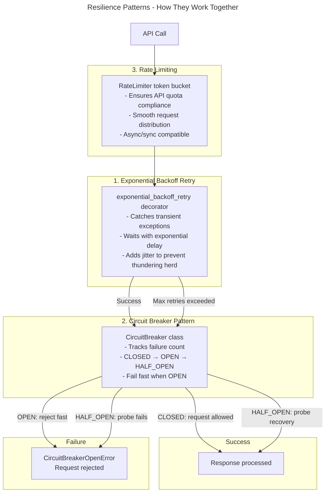

# C4 Code Level: Finance Feedback Engine Utilities

## Overview

- **Name**: Utility Modules for Finance Feedback Engine
- **Description**: Comprehensive utility library providing resilience patterns, configuration management, financial data validation, and operational utilities for the Finance Feedback Engine trading system
- **Location**: `finance_feedback_engine/utils/`
- **Language**: Python 3.8+
- **Purpose**: Provides cross-cutting concerns including retry logic, circuit breaking, rate limiting, configuration loading, data validation, cost tracking, and market-aware scheduling

---

## Code Elements

### Core Resilience Patterns

#### **CircuitBreaker** Class
- **Location**: `circuit_breaker.py` (lines 37-315)
- **Description**: Implements the circuit breaker pattern for fault tolerance with three states: CLOSED (normal), OPEN (failing fast), HALF_OPEN (recovery testing). Thread-safe and async-safe with locks for concurrent access.
- **Key Methods**:
  - `__init__(failure_threshold: int = 5, recovery_timeout: float = 60.0, expected_exception: type = Exception, name: Optional[str] = None): None`
    - Initializes circuit breaker with configurable failure thresholds and recovery timeout
  - `call(func: Callable, *args, **kwargs) -> Any`
    - Execute function with async-aware circuit breaker protection
  - `call_sync(func: Callable, *args, **kwargs) -> Any`
    - Execute function with synchronous circuit breaker protection
  - `_execute_with_circuit(runner: Callable) -> Any`
    - Core synchronous circuit breaker logic with state management
  - `_execute_with_circuit_async(runner: Callable, is_async: bool) -> Any`
    - Core async circuit breaker logic with state management
  - `get_stats() -> dict`
    - Returns statistics: state, failure counts, success counts, failure rates, timestamps
  - `reset_manually() -> None`
    - Manually reset circuit breaker (for admin/testing)
- **Dependencies**: `asyncio`, `logging`, `threading`, `time`, `enum`, `functools`, `typing`
- **State Variables**:
  - `state: CircuitState` (CLOSED|OPEN|HALF_OPEN)
  - `failure_count: int` (current failures)
  - `success_count: int` (consecutive successes)
  - `total_calls: int`, `total_failures: int`, `total_successes: int` (metrics)
  - `_sync_lock: threading.Lock` (thread safety)
  - `_async_lock: asyncio.Lock` (async safety)

#### **CircuitState** Enum
- **Location**: `circuit_breaker.py` (lines 18-22)
- **Values**: `CLOSED`, `OPEN`, `HALF_OPEN`
- **Description**: Enum representing the three states of the circuit breaker

#### **CircuitBreakerOpenError** Exception
- **Location**: `circuit_breaker.py` (lines 376-391)
- **Description**: Exception raised when circuit breaker is open; includes diagnostic info
- **Attributes**: `last_error`, `failure_count`, `last_failure_time`

#### **circuit_breaker()** Decorator Function
- **Location**: `circuit_breaker.py` (lines 394-431)
- **Signature**: `circuit_breaker(failure_threshold: int = 5, recovery_timeout: float = 60.0, expected_exception: type = Exception, name: Optional[str] = None) -> Callable`
- **Description**: Decorator to apply circuit breaker pattern to async/sync functions
- **Dependencies**: Wraps `CircuitBreaker` class

#### **exponential_backoff_retry()** Decorator Function
- **Location**: `retry.py` (lines 7-69)
- **Signature**: `exponential_backoff_retry(max_retries: int = 3, base_delay: float = 1.0, max_delay: float = 60.0, exponential_base: float = 2.0, jitter: bool = True, exceptions: Tuple[Type[Exception], ...] = (Exception,)) -> Callable`
- **Description**: Retry decorator with exponential backoff and jitter to prevent thundering herd
- **Implementation**: Uses configurable exponential delay formula with optional random jitter
- **Dependencies**: `logging`, `random`, `time`, `functools`, `typing`

#### **RetryConfig** Class
- **Location**: `retry.py` (lines 72-92)
- **Description**: Configuration container for retry behavior across different operation types
- **Class Methods**:
  - `get_config(operation_type: str) -> dict`
    - Returns retry configuration dict for operation type (API_CALL|AI_PROVIDER|DATABASE_OPERATION)
- **Predefined Configs**: `API_CALL`, `AI_PROVIDER`, `DATABASE_OPERATION`

#### **RateLimiter** Class
- **Location**: `rate_limiter.py` (lines 5-66)
- **Description**: Token bucket algorithm implementation for rate limiting API requests
- **Key Methods**:
  - `__init__(tokens_per_second: float, max_tokens: int): None`
    - Initializes with token rate and maximum burst capacity
  - `wait_for_token() -> None`
    - Blocking synchronous method: waits for token availability then consumes one
  - `wait_for_token_async() -> None` (async)
    - Non-blocking async method: awaits token availability then consumes one
  - `_refill_tokens() -> None` (internal)
    - Refills tokens based on elapsed time since last refill
  - `_wait_for_token_sync() -> None` (internal)
    - Internal synchronous token waiting logic
- **State Variables**: `tokens`, `last_refill_time`, `tokens_per_second`, `max_tokens`
- **Thread Safety**: Single `threading.Lock` protects shared state between sync/async paths

---

### Configuration Management

#### **load_config()** Function
- **Location**: `config_loader.py` (lines 56-155)
- **Signature**: `load_config(config_path: str) -> Dict[str, Any]`
- **Description**: Loads YAML configuration file and resolves environment variables securely using `${ENV_VAR}` pattern syntax
- **Key Features**:
  - Loads `.env` file from project root with `load_dotenv(override=False)`
  - Uses `yaml.safe_load()` to prevent code injection
  - Resolves environment variables with optional defaults: `${ENV_VAR:default_value}`
  - Traverses nested dict/list structures recursively
  - Logs environment variable usage for debugging
- **Raises**: `FileNotFoundError` (config file missing), `ValueError` (required env var not set), `yaml.YAMLError` (invalid YAML)
- **Dependencies**: `logging`, `os`, `re`, `pathlib`, `yaml`, `dotenv`

#### **normalize_decision_config()** Function
- **Location**: `config_loader.py` (lines 8-35)
- **Signature**: `normalize_decision_config(config: Dict[str, Any]) -> Dict[str, Any]`
- **Description**: Normalizes decision_engine config to handle both nested and flat structures for backward compatibility
- **Handles Formats**:
  - Nested: `config['decision_engine']['ai_provider']`
  - Flat: `config['ai_provider']` (legacy)

#### **ConfigValidator** Class
- **Location**: `config_validator.py` (lines 44-521)
- **Description**: Comprehensive configuration validator with security checks, schema validation, and environment-specific rules
- **Key Methods**:
  - `__init__(environment: str = "development"): None`
    - Initializes validator with environment-specific rules
  - `validate_file(config_path: str) -> ValidationResult`
    - Validates YAML configuration file against all checks
  - `_check_secrets(config_path: str, content: str, result: ValidationResult) -> None`
    - Detects exposed secrets (API keys, tokens, passwords) using regex patterns
  - `_check_schema(config: Dict, config_path: str, result: ValidationResult) -> None`
    - Validates required keys and configuration structure
  - `_check_environment_rules(config: Dict, config_path: str, result: ValidationResult) -> None`
    - Enforces environment-specific rules (prod: no debug, no sandbox, etc.)
  - `_check_best_practices(config: Dict, config_path: str, result: ValidationResult) -> None`
    - Validates best practices (no hardcoded credentials, relative paths, etc.)
  - `_check_logging_configuration(config: Dict, config_path: str, result: ValidationResult) -> None`
    - Validates logging config for production environments
  - `_check_env_var_naming(config_path: str, content: str, result: ValidationResult) -> None`
    - Validates hierarchical environment variable naming conventions
  - `_validate_ensemble_config(ensemble: Dict, config_path: str, result: ValidationResult) -> None`
    - Ensemble-specific validation (provider weights, agreement thresholds)
- **Security Patterns**: Detects Telegram tokens, AWS keys, private keys, bearer tokens, API keys, passwords
- **Environment Levels**: production|staging|development|test (each has different rules)
- **Dependencies**: `logging`, `re`, `dataclasses`, `enum`, `pathlib`, `yaml`

#### **ValidationResult** Dataclass
- **Location**: `config_validator.py` (lines 22-59)
- **Fields**:
  - `valid: bool` - Overall validation status
  - `issues: List[ValidationIssue]` - List of validation issues found
- **Methods**:
  - `add_issue(...) -> None` - Add a validation issue and update valid status
  - `get_critical_issues() -> List[ValidationIssue]`
  - `get_high_issues() -> List[ValidationIssue]`
  - `has_errors() -> bool` - Check if critical or high severity issues exist

#### **ValidationIssue** Dataclass
- **Location**: `config_validator.py` (lines 11-19)
- **Fields**: `severity`, `rule`, `message`, `file_path`, `line_number`, `suggestion`

#### **Severity** Enum
- **Location**: `config_validator.py` (lines 7-10)
- **Values**: `CRITICAL`, `HIGH`, `MEDIUM`, `LOW`, `INFO`

#### **validate_config_file()** Function
- **Location**: `config_validator.py` (lines 552-560)
- **Signature**: `validate_config_file(config_path: str, environment: str = "development") -> ValidationResult`
- **Description**: Convenience function wrapping ConfigValidator instance

---

### Financial Data Validation

#### **FinancialDataValidator** Class
- **Location**: `financial_data_validator.py` (lines 94-392)
- **Description**: Utility class for validating financial market data quality
- **Key Methods**:
  - `__init__(rules: Dict = None): None`
    - Initializes with validation rules (default or custom)
  - `_validate_value(value: Any, rule_name: str) -> List[str]`
    - Validates single value against rule, returns error list
  - `is_valid_price(price: Union[int, float]) -> bool`
  - `is_valid_volume(volume: Union[int, float]) -> bool`
  - `is_valid_timestamp(timestamp: Any) -> bool`
  - `is_valid_currency_pair(currency_pair: str) -> bool`
  - `is_valid_stop_loss(stop_loss: Union[int, float]) -> bool`
  - `is_valid_take_profit(take_profit: Union[int, float]) -> bool`
  - `is_valid_order_type(order_type: str) -> bool`
  - `is_valid_account_balance(account_balance: Union[int, float]) -> bool`
  - `is_valid_confidence(confidence: Union[int, float]) -> bool`
  - `is_valid_position_size(position_size: Union[int, float]) -> bool`
  - `is_valid_leverage(leverage: Union[int, float]) -> bool`
  - `validate_single_entry(data: Dict[str, Any]) -> List[str]`
    - Validates single dictionary entry against all applicable rules
  - `validate_dataframe(df: pd.DataFrame) -> Dict[str, List[str]]`
    - Batch validates DataFrame rows against rules, returns errors per column
  - `validate_schema(df: pd.DataFrame, required_columns: List[str] = None, optional_columns: List[str] = None, column_types: Dict[str, type] = None) -> List[str]`
    - Validates DataFrame schema structure
  - `validate_time_series_gaps(df: pd.DataFrame, timestamp_column: str = "timestamp", expected_frequency: str = None) -> List[str]`
    - Detects gaps, duplicates, irregular ordering in time series
  - `validate_cross_field_constraints(df: pd.DataFrame, constraints: List[Dict[str, str]] = None) -> List[str]`
    - Validates relationships between fields (e.g., open <= high)
  - `add_validation_rule(rule_name: str, rule: Dict[str, Any]) -> None`
    - Add custom validation rule at runtime
- **Built-in Rules**: VALIDATION_RULES dict with price, volume, timestamp, currency_pair, stop_loss, take_profit, order_type, account_balance, confidence, position_size, leverage
- **Dependencies**: `typing`, `pandas`

---

### Market Intelligence

#### **MarketRegimeDetector** Class
- **Location**: `market_regime_detector.py` (lines 22-207)
- **Description**: Analyzes market data using ADX and ATR technical indicators to classify market regime
- **Key Methods**:
  - `__init__(adx_period: int = 14, atr_period: int = 14): None`
  - `_calculate_true_range(df: pd.DataFrame) -> pd.Series`
    - Calculates True Range for ATR: max(high-low, abs(high-prev_close), abs(low-prev_close))
  - `_calculate_atr(df: pd.DataFrame) -> pd.Series`
    - Calculates Average True Range (ATR)
  - `_calculate_directional_indicators(df: pd.DataFrame) -> tuple`
    - Returns (+DI, -DI) Series for ADX calculation
  - `_calculate_adx(df: pd.DataFrame) -> pd.Series`
    - Calculates Average Directional Index (ADX)
  - `detect_regime(market_data: Union[Dict[str, Any], pd.DataFrame]) -> str`
    - Classifies market regime based on ADX and ATR thresholds
- **Regime Classification**: Based on ADX > 25 (trending) and ATR/price ratio > 0.02 (high volatility)
  - Returns: TRENDING_BULL | TRENDING_BEAR | HIGH_VOLATILITY_CHOP | LOW_VOLATILITY_RANGING
- **Dependencies**: `enum`, `typing`, `numpy`, `pandas`

#### **Regime** Enum
- **Location**: `market_regime_detector.py` (lines 8-15)
- **Values**: `TRENDING_BULL`, `TRENDING_BEAR`, `HIGH_VOLATILITY_CHOP`, `LOW_VOLATILITY_RANGING`

#### **MarketSchedule** Class
- **Location**: `market_schedule.py` (lines 8-195)
- **Description**: Provides market open/close checks and session labels with UTC-based calculations converting to market zones
- **Key Methods**:
  - `get_market_status(asset_pair: str, asset_type: str, now_utc: datetime | None = None) -> Dict[str, object]`
    - Returns: `is_open`, `session`, `time_to_close`, `time_to_open`, `warning`
  - `_crypto_status(now_utc: datetime) -> Dict[str, object]`
    - Crypto 24/7 with weekend liquidity warning
  - `_forex_status(now_utc: datetime) -> Dict[str, object]`
    - Forex with session detection (Asian|London|New York|Overlap|Weekend|Closed)
  - `_stock_status(now_utc: datetime) -> Dict[str, object]`
    - NYSE/US stocks: 9:30 AM - 4:00 PM ET, weekdays only
  - `get_market_status_at_timestamp(asset_pair: str, asset_type: str, timestamp: int) -> Dict[str, object]`
    - Historical market status for backtesting
- **Timezone Support**: UTC, America/New_York (NYSE), Europe/London
- **Dependencies**: `datetime`, `pytz`

---

### Asset Classification & Validation

#### **AssetClassifier** Class
- **Location**: `asset_classifier.py` (lines 13-125)
- **Description**: Classifies asset pairs into forex, crypto, or unknown categories for platform routing
- **Key Methods**:
  - `__init__(forex_currencies: Set[str] = None, crypto_symbols: Set[str] = None): None`
  - `classify(asset_pair: str) -> AssetClass`
    - Classifies asset pair: supports EURUSD, EUR_USD, EUR-USD formats
  - `_is_forex(asset_pair: str) -> bool`
    - Detects forex format: EUR_USD or EURUSD (6 chars)
  - `_is_crypto(asset_pair: str) -> bool`
    - Detects crypto format: BTCUSD, BTC-USD, BTC_USD; handles common stablecoins
- **Type Definition**: `AssetClass = Literal["forex", "crypto", "unknown"]`
- **Singleton Pattern**: Global `_default_classifier` for convenience function
- **Dependencies**: `logging`, `typing`

#### **classify_asset_pair()** Function
- **Location**: `asset_classifier.py` (lines 128-145)
- **Signature**: `classify_asset_pair(asset_pair: str) -> AssetClass`
- **Description**: Convenience function using default classifier singleton

#### Input Validation Functions
- **Location**: `validation.py`
- **Functions**:
  - `standardize_asset_pair(asset_pair: str) -> str`
    - Converts any format to uppercase alphanumeric (e.g., 'eur_usd' -> 'EURUSD')
  - `validate_asset_pair_format(asset_pair: str, min_length: int = 6) -> bool`
    - Checks format: uppercase alphanumeric, minimum length
  - `validate_asset_pair_composition(asset_pair: str) -> Tuple[bool, str]`
    - Validates base/quote split with known currency lists
  - `validate_data_freshness(data_timestamp: str, asset_type: str = "crypto", timeframe: str = "intraday", market_status: Optional[Dict[str, Any]] = None) -> Tuple[bool, str, str]`
    - Validates data freshness with asset-type-aware thresholds:
      - Crypto: 15 min intraday, 24h daily (24/7 markets)
      - Forex: 15 min intraday market hours, 24h weekend, 24h daily
      - Stocks: 1h intraday market hours, 24h daily, 24h outside hours
    - Returns: (is_fresh, age_str, warning_message)
- **Dependencies**: `logging`, `re`, `datetime`, `typing`

---

### Operational Utilities

#### **CostTracker** Class
- **Location**: `cost_tracker.py` (lines 7-167)
- **Description**: Tracks premium API calls and enforces daily budget limits
- **Key Methods**:
  - `__init__(data_dir: str = "data"): None`
  - `log_premium_call(asset: str, asset_type: str, phase: str, primary_provider: Optional[str] = None, codex_called: bool = False, escalation_reason: Optional[str] = None, cost_estimate: Optional[float] = None) -> None`
    - Logs premium API call to NDJSON file (append mode)
  - `get_calls_today() -> List[Dict[str, Any]]`
    - Retrieves all calls logged today
  - `get_call_count_today() -> int`
  - `get_calls_by_provider_today() -> Dict[str, int]`
  - `check_daily_budget(max_calls: int) -> bool`
    - Returns True if budget allows more calls
  - `get_daily_summary() -> Dict[str, Any]`
    - Returns usage stats: total_calls, by_provider, by_asset_type, escalation_reasons, estimated_cost
- **Storage**: Daily JSON file in `data/api_costs/YYYY-MM-DD.json` (NDJSON format)
- **Global Singleton**: `get_cost_tracker(data_dir: str = "data") -> CostTracker`
- **Dependencies**: `json`, `logging`, `os`, `datetime`, `pathlib`, `typing`

#### **FailureLogger** Class
- **Location**: `failure_logger.py` (lines 12-119)
- **Description**: Logs Phase 1 quorum failures and sends Telegram notifications
- **Key Methods**:
  - `__init__(data_dir: str = "data"): None`
  - `log_failure(asset: str, asset_type: str, providers_attempted: List[str], providers_succeeded: List[str], quorum_required: int = 3, error_message: Optional[str] = None) -> str`
    - Logs failure entry to today's JSON file, returns log path
  - `get_failures_today() -> List[Dict[str, Any]]`
  - `get_failure_count_today() -> int`
- **Storage**: Daily JSON file in `data/failures/YYYY-MM-DD.json`
- **Notifications**: `send_telegram_notification(message: str, config: Dict[str, Any]) -> bool`
- **Global Singleton**: Thread-safe with `_lock` for initialization
- **Dependencies**: `json`, `logging`, `threading`, `datetime`, `pathlib`, `typing`, `requests`

#### **CacheMetrics** Class
- **Location**: `cache_metrics.py` (lines 6-169)
- **Description**: Tracks cache performance metrics for monitoring and optimization
- **Key Methods**:
  - `__init__(): None`
  - `record_hit(cache_name: str) -> None`
  - `record_miss(cache_name: str) -> None`
  - `update_cache_size(cache_name: str, size: int) -> None`
  - `get_hit_rate() -> float` (overall percentage 0-100)
  - `get_cache_hit_rate(cache_name: str) -> float` (per-cache percentage)
  - `get_summary() -> Dict[str, Any]`
    - Returns comprehensive cache metrics including uptime, requests/second
  - `log_summary() -> None`
    - Logs human-readable performance summary
  - `reset() -> None`
    - Resets all metrics
  - `get_efficiency_score() -> float` (0-100)
    - Combined score: 70% hit rate + 30% usage factor
- **Metrics Tracked**: hits, misses, total_requests, per-cache stats, cache sizes
- **Dependencies**: `logging`, `datetime`, `typing`

#### **ModelInstaller** Class
- **Location**: `model_installer.py` (lines 18-246)
- **Description**: Automatic Ollama model installer with parallel downloads and progress tracking
- **Key Methods**:
  - `__init__(data_dir: str = "data"): None`
  - `ensure_models_installed(force_reinstall: bool = False) -> bool`
    - Main entry point: checks disk space, verifies Ollama, downloads missing models
  - `_check_ollama_installed() -> bool`
  - `_check_disk_space(required_gb: float) -> bool`
  - `_get_installed_models() -> List[str]`
    - Parses output of `ollama list`
  - `_download_model(model: str, use_progress: bool = True) -> bool`
    - Downloads single model with optional progress bar
  - `_verify_model(model: str) -> bool`
    - Verifies model installation using `ollama show` and `ollama list`
  - `_download_models_parallel(models_to_install: List[str], max_workers: int = 2) -> Dict[str, bool]`
    - Parallel downloads with ThreadPoolExecutor
  - `_load_state() -> Dict[str, Dict[str, Any]]`
    - Loads installation state from `.models_installed` JSON
  - `_save_state(state: Dict) -> None`
- **Global Singleton**: `get_installer(data_dir: str = "data") -> ModelInstaller`
- **Dependencies**: `json`, `logging`, `shutil`, `subprocess`, `concurrent.futures`, `pathlib`, `typing`, `tqdm` (optional)

#### **Environment Detection**
- **Location**: `environment.py`
- **Functions**:
  - `get_environment() -> Environment`
    - Detects runtime environment from FFE_ENVIRONMENT, CI, PRODUCTION, STAGING env vars
  - `is_production() -> bool`, `is_test() -> bool`, `is_development() -> bool`
  - `get_environment_name() -> str`
    - Returns environment string
  - `require_production() -> None`
    - Raises RuntimeError if not in production
  - `require_non_production() -> None`
    - Raises RuntimeError if in production
- **Enum**: `Environment` with values PRODUCTION, STAGING, DEVELOPMENT, TEST
- **Dependencies**: `os`, `enum`

#### **SafetyGuardrails** Class
- **Location**: `safety_checks.py` (lines 7-49)
- **Description**: Pre-flight safety checks before trading operations
- **Static Methods**:
  - `validate_decision_safety(decision: Dict[str, Any]) -> Tuple[bool, List[str]]`
    - Checks: data freshness, confidence threshold (>70%), position sizing, risk parameters
  - `validate_market_conditions() -> Tuple[bool, str]`
    - Placeholder for market hours, volatility, news checks
- **Dependencies**: `logging`, `typing`

#### **APIClientBase** Abstract Class
- **Location**: `api_client_base.py` (lines 18-202)
- **Description**: Abstract base class for API clients with retry, rate limiting, and error handling
- **Key Methods**:
  - `__init__(base_url: str, api_key: Optional[str] = None, api_secret: Optional[str] = None, tokens_per_second: float = 5, max_tokens: int = 5): None`
  - `@abstractmethod _get_auth_headers() -> Dict[str, str]`
    - Subclasses implement auth header generation
  - `@abstractmethod _send_request_async(...) -> Dict[str, Any]`
    - Async HTTP request with retry logic
  - `_send_request(method: str, endpoint: str, params: Optional[Dict] = None, data: Optional[Dict] = None, json_data: Optional[Dict] = None, headers: Optional[Dict] = None, retries: int = 3, backoff_factor: float = 0.5, timeout: int = 10) -> Dict[str, Any]`
    - Synchronous HTTP request with:
      - Exponential backoff retry on RequestException, HTTPError, Timeout
      - Rate limiting via `RateLimiter`
      - Structured error handling distinguishing 4xx (client) vs 5xx (server) errors
      - JSON parsing with error handling
- **Default Values**: DEFAULT_RETRIES=3, DEFAULT_BACKOFF_FACTOR=0.5, DEFAULT_TIMEOUT=10s, DEFAULT_TOKENS_PER_SECOND=5
- **Dependencies**: `json`, `logging`, `abc`, `typing`, `requests`, `tenacity`, `RateLimiter`

---

## Dependencies

### Internal Dependencies

| Module | Dependencies | Purpose |
|--------|------------|---------|
| `circuit_breaker.py` | `retry.py` (via exponential_backoff_retry pattern) | Retry-aware circuit breaking |
| `api_client_base.py` | `rate_limiter.py`, `retry.py` utilities | HTTP client resilience |
| `model_installer.py` | `decision_engine.provider_tiers` | Model configuration |
| `validation.py` | `market_schedule.py` (via validate_data_freshness) | Market-aware validation |
| `config_validator.py` | All config loaders | Configuration validation |
| `__init__.py` | `circuit_breaker`, `retry`, `validation` | Public API exports |

### External Dependencies

| Package | Version | Purpose |
|---------|---------|---------|
| `requests` | Latest | HTTP requests with timeout/retry support |
| `tenacity` | Latest | Advanced retry decorator (used in APIClientBase) |
| `pandas` | Latest | DataFrame validation and time series operations |
| `numpy` | Latest | Numerical operations for market regime detection |
| `pytz` | Latest | Timezone-aware market scheduling |
| `pyyaml` | Latest | YAML configuration parsing (safe_load) |
| `python-dotenv` | Latest | Environment variable loading from .env files |
| `tqdm` | Latest (optional) | Progress bars for model installation |

---

## Module Exports

The `__init__.py` file exports the following public API:

```python
from .circuit_breaker import (
    CircuitBreaker,
    CircuitBreakerOpenError,
    CircuitState,
    circuit_breaker,
)
from .retry import RetryConfig, exponential_backoff_retry
from .validation import (
    standardize_asset_pair,
    validate_asset_pair_composition,
    validate_asset_pair_format,
    validate_data_freshness,
)
```

**__all__** exports: `exponential_backoff_retry`, `RetryConfig`, `CircuitBreaker`, `CircuitBreakerOpenError`, `CircuitState`, `circuit_breaker`, `standardize_asset_pair`, `validate_asset_pair_format`, `validate_asset_pair_composition`, `validate_data_freshness`

---

## Relationships

### Module Dependency Graph

```mermaid
---
title: Finance Feedback Engine Utils Module Dependencies
---
flowchart TB
    subgraph Resilience["Resilience Patterns"]
        CB["CircuitBreaker<br/>(circuit_breaker.py)"]
        RT["exponential_backoff_retry<br/>(retry.py)"]
        RL["RateLimiter<br/>(rate_limiter.py)"]
    end

    subgraph Configuration["Configuration Management"]
        CL["load_config<br/>(config_loader.py)"]
        CV["ConfigValidator<br/>(config_validator.py)"]
        ENV["Environment Detection<br/>(environment.py)"]
    end

    subgraph Validation["Data Validation"]
        FDV["FinancialDataValidator<br/>(financial_data_validator.py)"]
        VAL["validate_* functions<br/>(validation.py)"]
        AC["AssetClassifier<br/>(asset_classifier.py)"]
    end

    subgraph Market["Market Intelligence"]
        MRD["MarketRegimeDetector<br/>(market_regime_detector.py)"]
        MS["MarketSchedule<br/>(market_schedule.py)"]
    end

    subgraph Operational["Operational Utilities"]
        CT["CostTracker<br/>(cost_tracker.py)"]
        FL["FailureLogger<br/>(failure_logger.py)"]
        CM["CacheMetrics<br/>(cache_metrics.py)"]
        MI["ModelInstaller<br/>(model_installer.py)"]
        SG["SafetyGuardrails<br/>(safety_checks.py)"]
    end

    subgraph External["External APIs"]
        ACB["APIClientBase<br/>(api_client_base.py)"]
        REQUESTS["requests library"]
        TENACITY["tenacity library"]
    end

    ACB --> RL
    ACB --> RT
    ACB --> REQUESTS
    ACB --> TENACITY

    VAL --> MS
    VAL --> AC

    CV --> CL
    CV --> ENV

    FDV --> REQUESTS

    FL --> REQUESTS

    CB --> RT

    MI --> External["decision_engine.provider_tiers"]

    CL --> REQUESTS["dotenv, yaml"]
    CV --> REQUESTS
```



### Data Flow Diagram (Functional Pipeline)

```mermaid
---
title: Utility Functions Data Pipeline
---
flowchart LR
    Input["Input<br/>config/asset/data"]

    subgraph Normalization["1. Normalization & Loading"]
        NORM["standardize_asset_pair<br/>load_config"]
    end

    subgraph Classification["2. Classification"]
        CLASS["classify_asset_pair<br/>get_environment"]
    end

    subgraph Validation["3. Validation"]
        VALIDATE["validate_asset_pair_*<br/>validate_data_freshness<br/>ConfigValidator"]
    end

    subgraph Analysis["4. Market Analysis"]
        MARKET["MarketSchedule<br/>MarketRegimeDetector"]
    end

    subgraph Safety["5. Safety Checks"]
        SAFETY["SafetyGuardrails<br/>validate_decision_safety"]
    end

    subgraph Tracking["6. Operational Tracking"]
        TRACK["CostTracker.log_premium_call<br/>FailureLogger.log_failure<br/>CacheMetrics.record_hit"]
    end

    Output["Trading Decision<br/>with Metadata"]

    Input --> NORM
    NORM --> CLASS
    CLASS --> VALIDATE
    VALIDATE --> MARKET
    MARKET --> SAFETY
    SAFETY --> TRACK
    TRACK --> Output
```



### Resilience Pattern Integration



---

## Key Design Patterns

### 1. **Singleton Pattern**
- `_default_classifier` in `asset_classifier.py`
- `_logger` in `failure_logger.py` (thread-safe)
- `_installer` in `model_installer.py`
- `get_*` convenience functions provide global instances

### 2. **Decorator Pattern**
- `@exponential_backoff_retry()` for retry logic
- `@circuit_breaker()` for fault tolerance
- Wrapping with `functools.wraps` to preserve function metadata

### 3. **Abstract Base Class Pattern**
- `APIClientBase` defines interface for concrete API client implementations
- Abstract methods: `_get_auth_headers()`, `_send_request_async()`

### 4. **State Machine Pattern**
- `CircuitBreaker` implements explicit state transitions: CLOSED → OPEN → HALF_OPEN → CLOSED
- `CircuitState` enum represents allowed states

### 5. **Token Bucket Algorithm**
- `RateLimiter` implements standard rate limiting with configurable token refill rate
- Supports both sync and async token consumption

### 6. **Builder/Configuration Pattern**
- `load_config()` + `ConfigValidator` separate concerns: loading vs. validating
- Environment-aware validation rules in ConfigValidator

### 7. **Template Method Pattern**
- `APIClientBase._send_request()` provides structure; subclasses implement `_get_auth_headers()`

---

## Security Considerations

### Configuration Security
- **Environment Variables**: All secrets use `${ENV_VAR}` pattern, never hardcoded
- **YAML Parsing**: Uses `yaml.safe_load()` to prevent code injection
- **Validation**: ConfigValidator detects exposed secrets using regex patterns
  - Detects: API keys, passwords, Telegram tokens, AWS keys, private keys, bearer tokens
  - Safe placeholders: "YOUR_*", "demo", "default"

### API Security
- **Rate Limiting**: RateLimiter prevents API abuse
- **Retry Strategy**: Exponential backoff with jitter prevents thundering herd
- **Circuit Breaker**: Fail-fast prevents cascading failures to external services
- **Error Handling**: Distinguishes 4xx (don't retry) vs 5xx (retry) HTTP errors

### Data Security
- **Type Hints**: Complete type annotations for runtime introspection
- **Validation**: FinancialDataValidator ensures data quality before processing
- **Logging**: Structured logging for auditing; sensitive fields excluded

---

## Testing Patterns

The utilities are designed for comprehensive testing:

### Testability Features
1. **Dependency Injection**: Functions accept parameters rather than global state
2. **Configurability**: Thresholds, timeouts, retry counts all configurable
3. **Isolation**: Each utility can be tested independently
4. **Mockability**:
   - RateLimiter can be mocked to bypass delays
   - CircuitBreaker provides `reset_manually()` for test reset
   - MarketSchedule accepts `now_utc` parameter for time travel testing

### Example Test Scenarios
- Circuit breaker state transitions with controlled failure injection
- Rate limiter token bucket behavior with time advancement
- Configuration loading with different env var scenarios
- Market regime detection with historical OHLC data
- Data validation with invalid/boundary input values

---

## Performance Considerations

### Optimization Notes

1. **Circuit Breaker**: Uses minimal locking; lock held only for state checks
2. **Rate Limiter**: O(1) token consumption; monotonic time for accurate measurement
3. **FinancialDataValidator**:
   - Vectorized pandas operations for large DataFrames
   - Sampling strategy for type checking on very large datasets
4. **MarketSchedule**: Pure computation; no external calls; O(1) for status lookup
5. **CacheMetrics**: Low-overhead tracking; efficient dict lookups for per-cache stats

### Scaling Notes
- RateLimiter: Single-threaded token bucket; scale across processes with independent instances
- CircuitBreaker: Instance per downstream service recommended; metrics accumulate over instance lifetime
- CostTracker/FailureLogger: Single shared instance per data_dir; NDJSON append allows concurrent writes

---

## Configuration Examples

### Rate Limiting Configuration
```python
limiter = RateLimiter(tokens_per_second=5, max_tokens=5)
# Allows bursts of 5 requests with refill at 5/sec rate
```

### Retry Configuration
```python
@exponential_backoff_retry(
    max_retries=3,
    base_delay=1.0,
    max_delay=60.0,
    jitter=True,
    exceptions=(RequestException, HTTPError, Timeout)
)
def fetch_data(url):
    return requests.get(url, timeout=10)
```

### Circuit Breaker Configuration
```python
breaker = CircuitBreaker(
    failure_threshold=5,
    recovery_timeout=60.0,
    expected_exception=RequestException,
    name="external_api"
)
```

### Configuration Validation
```python
validator = ConfigValidator(environment="production")
result = validator.validate_file("config.yaml")
# Checks: secrets, schema, environment rules, best practices
```

---

## Known Limitations & TODOs

### From Code Comments

1. **APIClientBase**:
   - TODO: Implement specific authentication schemes (OAuth, HMAC, JWT)
   - TODO: Advanced rate limiting (token bucket, leaky bucket across multiple clients)
   - TODO: Circuit breaker integration (already available as separate module)
   - TODO: Structured logging for debugging and auditing

2. **FinancialDataValidator**:
   - TODO: Customizable error handling strategies
   - TODO: External schema validation configuration
   - TODO: Enhanced time series gap/duplicate detection
   - TODO: Complex cross-field validation rules

3. **ModelInstaller**:
   - Currently supports Ollama models only
   - Max 2 parallel downloads (configurable but limited for stability)
   - Timeout: 10 minutes per model

---

## Files Summary

| File | Lines | Purpose |
|------|-------|---------|
| `__init__.py` | 29 | Public API exports |
| `api_client_base.py` | 202 | Abstract HTTP client with resilience |
| `asset_classifier.py` | 145 | Asset type classification |
| `cache_metrics.py` | 169 | Cache performance tracking |
| `circuit_breaker.py` | 431 | Fault tolerance pattern |
| `config_loader.py` | 155 | YAML config + env var resolution |
| `config_validator.py` | 651 | Comprehensive config validation |
| `cost_tracker.py` | 170 | Premium API call tracking |
| `environment.py` | 97 | Runtime environment detection |
| `failure_logger.py` | 177 | Quorum failure logging |
| `financial_data_validator.py` | 392 | Financial data quality checks |
| `market_regime_detector.py` | 207 | Technical analysis regime detection |
| `market_schedule.py` | 195 | Market hours and session info |
| `model_installer.py` | 299 | Ollama model auto-installation |
| `rate_limiter.py` | 66 | Token bucket rate limiting |
| `retry.py` | 92 | Exponential backoff retry decorator |
| `safety_checks.py` | 49 | Pre-flight trading safety checks |
| `validation.py` | 378 | Input validation utilities |
| **TOTAL** | **3,774** | Complete utility suite |

---

## Notes

- All modules use Python 3.8+ type hints throughout
- Thread-safe: CircuitBreaker, RateLimiter, FailureLogger use threading.Lock/asyncio.Lock
- Async-safe: CircuitBreaker supports both sync and async execution
- Comprehensive logging via Python's logging module in all modules
- No global state except convenience singletons (with getter functions)
- Designed for dependency injection and testability
- Production-ready error handling and edge cases
