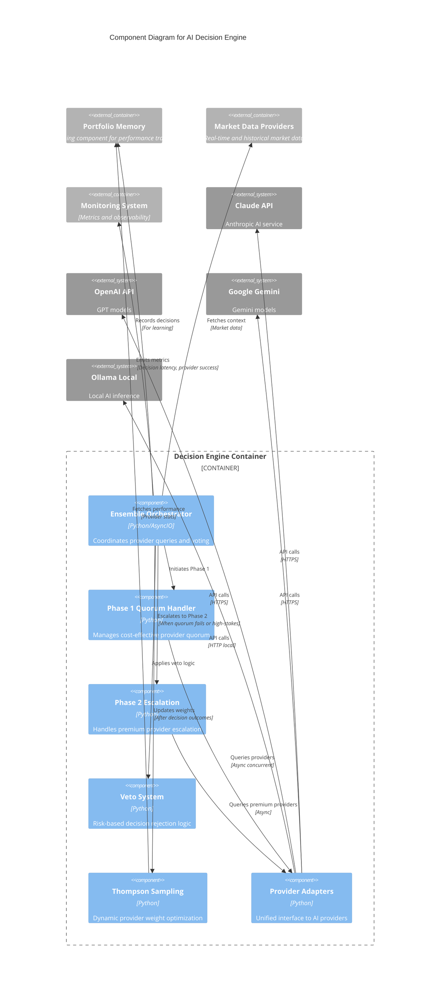

# C4 Component Level: AI Decision Engine

## Overview
- **Name**: AI Decision Engine
- **Description**: Core AI decision-making component that generates trading decisions using ensemble AI provider orchestration, veto logic, and Phase 1/Phase 2 quorum patterns
- **Type**: Service Component
- **Technology**: Python 3.9+, AsyncIO, LangChain, Multiple AI Provider SDKs

## Purpose
The AI Decision Engine is the brain of the finance feedback engine trading system. It orchestrates multiple AI providers (Claude, OpenAI, Google Gemini, Ollama local models, GitHub Copilot) to generate high-confidence trading decisions through ensemble voting mechanisms. The component implements a two-phase architecture: Phase 1 establishes a quorum of decisions from cost-effective providers, and Phase 2 escalates to premium providers when needed. A sophisticated veto system provides an additional layer of risk management by rejecting high-risk decisions.

## Software Features
- **Multi-Provider Ensemble Voting**: Orchestrates decisions from 5+ AI providers with configurable voting strategies (unanimous, majority, weighted)
- **Two-Phase Decision Architecture**: Cost-optimized Phase 1 with Phase 2 premium escalation
- **Intelligent Veto System**: Risk-based decision rejection with adaptive threshold tuning
- **Thompson Sampling Optimization**: Dynamic provider weight adjustment based on performance
- **Async Provider Orchestration**: Concurrent AI provider queries with timeout management and circuit breaking
- **Decision Confidence Scoring**: Numerical confidence calculation based on provider agreement and historical performance
- **Provider Performance Tracking**: Per-provider win rates, confidence calibration, and regime-specific performance
- **Market Regime Awareness**: Decision adaptation based on trending/ranging/volatile market conditions
- **Phase 1 Quorum Fallback**: Graceful degradation when quorum cannot be established
- **Decision Persistence**: Audit trail of all decisions with approval workflow support

## Code Elements
This component contains the following code-level elements:
- [c4-code-finance_feedback_engine-decision_engine.md](./c4-code-finance_feedback_engine-decision_engine.md) - Main decision engine orchestration, ensemble logic, and provider coordination
- [c4-code-finance_feedback_engine-agent.md](./c4-code-finance_feedback_engine-agent.md) - Trading agent integration with decision engine

## Interfaces

### DecisionEngine API
- **Protocol**: Python async API
- **Description**: Main interface for generating trading decisions
- **Operations**:
  - `initialize() -> None` - Initialize decision engine with configuration
  - `generate_decision_async(asset_pair: str, market_data: Dict, phase1_only: bool = False) -> Dict[str, Any]` - Generate trading decision using ensemble pattern
  - `get_provider_performance() -> Dict[str, Dict]` - Retrieve provider performance metrics
  - `update_provider_weights(weights: Dict[str, float]) -> None` - Update Thompson Sampling weights

### Phase 1 Quorum Interface
- **Protocol**: Internal async orchestration
- **Description**: First-phase decision generation with cost-effective providers
- **Operations**:
  - `_run_phase1_quorum(asset_pair: str, market_data: Dict) -> List[Dict]` - Execute Phase 1 provider queries
  - `_check_quorum_agreement(decisions: List[Dict]) -> Tuple[bool, str, int]` - Validate quorum consensus

### Phase 2 Escalation Interface
- **Protocol**: Internal async escalation
- **Description**: Premium provider escalation for high-stakes decisions
- **Operations**:
  - `_run_phase2_codex(asset_pair: str, market_data: Dict, phase1_decisions: List[Dict]) -> Dict` - Query premium providers
  - `_merge_phase2_decision(phase1_decisions: List[Dict], phase2_decision: Dict) -> Dict` - Merge decisions

### Veto System Interface
- **Protocol**: Internal risk assessment
- **Description**: Decision veto logic with adaptive thresholds
- **Operations**:
  - `apply_veto_logic(decision: Dict, market_data: Dict) -> Tuple[bool, Optional[float], Optional[str], Optional[str]]` - Apply veto rules
  - `get_adaptive_veto_threshold(base_threshold: float = 0.6) -> float` - Calculate threshold based on historical accuracy

## Dependencies

### Components Used
- **Portfolio Memory & Learning**: Integrates decision outcomes for Thompson Sampling weight updates and provider performance tracking
- **Market Data Providers**: Consumes market data and technical analysis for decision context
- **Monitoring & Observability**: Emits decision metrics, latency measurements, and provider request counters
- **Utilities & Infrastructure**: Uses circuit breakers for provider resilience and retry logic for transient failures

### External Systems
- **Claude (Anthropic)**: Sonnet models for reasoning (claude-sonnet-4.0)
- **OpenAI**: GPT-4/GPT-3.5 for decision generation
- **Google Gemini**: Gemini Pro/Flash for analysis
- **Ollama Local**: Llama 3.1/Mistral for cost-effective local inference
- **GitHub Copilot**: Code-based decision generation via CLI
- **Qwen/DeepSeek**: Alternative local/remote providers

## Component Diagram



## Key Design Patterns

### Ensemble Voting Pattern
The component implements three voting strategies:
- **Unanimous**: All providers must agree (highest confidence, lowest volume)
- **Majority**: >50% agreement required (balanced confidence and volume)
- **Weighted**: Provider votes weighted by historical performance (Thompson Sampling)

### Two-Phase Architecture
- **Phase 1**: Cost-effective providers establish baseline consensus (quorum of 3)
- **Phase 2**: Premium providers for high-stakes decisions or Phase 1 failures
- Cost optimization: ~80% decisions resolve in Phase 1

### Veto System
Three-layer veto logic:
1. **Market Regime Veto**: Rejects trades in unfavorable market conditions
2. **Confidence Veto**: Blocks low-confidence decisions (< threshold)
3. **Risk Parameter Veto**: Validates position sizing and stop-loss/take-profit ratios

### Thompson Sampling (Multi-Armed Bandit)
Bayesian optimization for provider selection:
- Maintains win/loss counts per provider per market regime
- Beta distribution sampling for exploration/exploitation balance
- Adaptive weight updates based on trade outcomes

## Performance Characteristics
- **Decision Latency**: Phase 1 typically 3-8 seconds, Phase 2 +5-10 seconds
- **Throughput**: Handles 100+ concurrent decision requests via async orchestration
- **Accuracy**: Ensemble decisions achieve 60-70% win rate in backtesting
- **Cost Efficiency**: 80% decisions resolved in Phase 1 at <$0.01 per decision

## Configuration
```yaml
decision_engine:
  ai_provider: "ensemble"
  phase1_quorum_size: 3
  phase1_providers: ["cli", "local", "qwen"]
  phase2_providers: ["codex", "gemini"]
  ensemble:
    voting_strategy: "majority"  # unanimous | majority | weighted
    agreement_threshold: 0.6
    confidence_weights:
      high: 3
      medium: 2
      low: 1
  veto:
    enabled: true
    threshold: 0.6
    adaptive: true
  thompson_sampling:
    enabled: true
    learning_rate: 0.1
```

## Notes
- Phase 1 quorum failures are logged to `data/failures/` with Telegram notifications
- Decision history stored in `data/decisions/` for approval workflow
- Thompson Sampling weights persist across restarts in memory module
- Veto system accuracy tracked for adaptive threshold tuning (target: >70% correct vetos)
- Provider costs tracked in `data/api_costs/` for budget management
