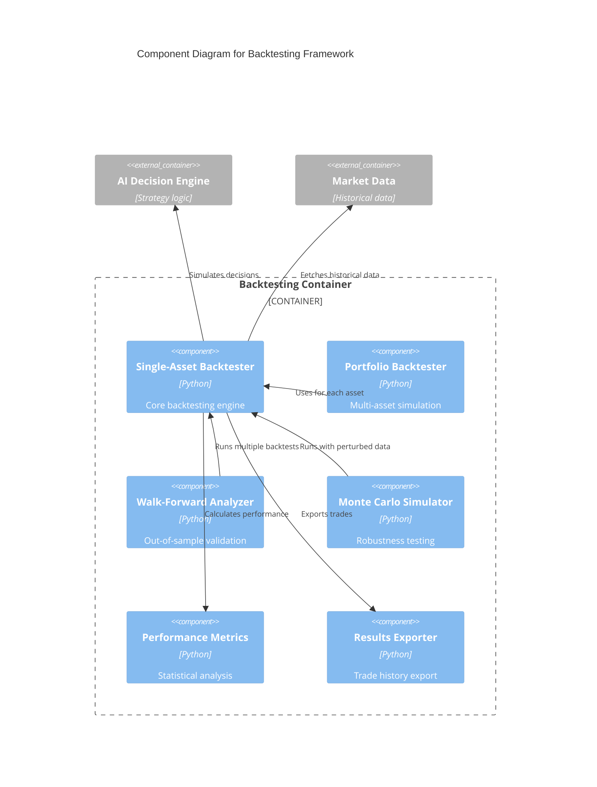

# C4 Component Level: Backtesting Framework

## Overview
- **Name**: Backtesting Framework
- **Description**: Comprehensive strategy validation framework with single-asset backtesting, portfolio backtesting, walk-forward analysis, and Monte Carlo simulation
- **Type**: Analysis Component
- **Technology**: Python 3.9+, Pandas, NumPy, Matplotlib

## Purpose
Enables rigorous testing of trading strategies against historical data with advanced validation techniques including out-of-sample testing (walk-forward), robustness testing (Monte Carlo), and multi-asset portfolio simulation. Prevents overfitting and provides confidence estimates for strategy performance.

## Software Features
- **Single-Asset Backtesting**: Test strategy on individual asset with configurable parameters
- **Portfolio Backtesting**: Multi-asset simulation with correlation-aware position sizing
- **Walk-Forward Analysis**: Rolling train/test windows to detect overfitting
- **Monte Carlo Simulation**: Price perturbation for robustness testing
- **Performance Metrics**: Sharpe ratio, Sortino ratio, max drawdown, win rate, profit factor
- **Transaction Cost Modeling**: Slippage, fees, spread costs
- **Trade History Export**: Detailed trade logs for analysis
- **Visualization**: Equity curves, drawdown charts, trade distribution
- **Statistical Validation**: Confidence intervals, p-values, overfitting severity assessment

## Code Elements
- [c4-code-finance_feedback_engine-backtesting.md](./c4-code-finance_feedback_engine-backtesting.md) - Backtesting engine, walk-forward analyzer, Monte Carlo simulator

## Interfaces

### Backtester API
- **Protocol**: Python API
- **Operations**:
  - `run_backtest(asset_pair: str, start_date: str, end_date: str, initial_balance: float, parameters: Dict) -> Dict[str, Any]` - Run backtest
  - `export_trades(output_file: str) -> None` - Export trade history

### WalkForwardAnalyzer API
- **Protocol**: Python API
- **Operations**:
  - `run_analysis(asset_pair: str, start_date: str, end_date: str, train_ratio: float = 0.7) -> Dict[str, Any]` - Walk-forward validation

### MonteCarloSimulator API
- **Protocol**: Python API
- **Operations**:
  - `run_simulation(asset_pair: str, start_date: str, end_date: str, simulations: int = 1000, noise_std: float = 0.02) -> Dict[str, Any]` - Monte Carlo analysis

## Dependencies

### Components Used
- **AI Decision Engine**: Generates decisions during backtest simulation
- **Market Data Providers**: Historical market data for backtesting
- **Portfolio Memory & Learning**: Learning validation metrics
- **Risk Management**: Position sizing and risk calculations

### External Systems
- None (uses historical data from Market Data Providers)

## Component Diagram

## Notes
- Walk-forward overfitting severity: NONE < LOW < MEDIUM < HIGH
- Monte Carlo provides 5th/50th/95th percentile outcomes
- Portfolio backtesting supports correlation threshold filtering
- All backtests account for transaction costs (slippage, fees, spread)
