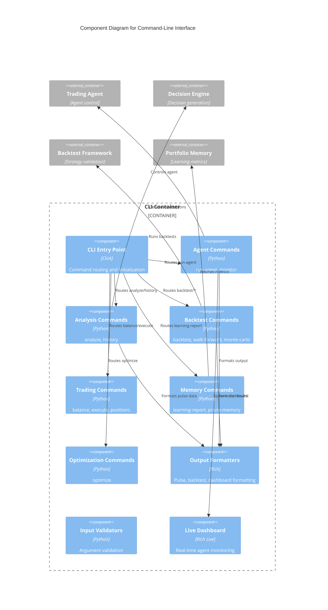

# C4 Component Level: Command-Line Interface

## Overview
- **Name**: Command-Line Interface
- **Description**: Comprehensive CLI for autonomous trading agent control, decision analysis, backtesting, portfolio management, and learning validation
- **Type**: User Interface Component
- **Technology**: Python 3.8+, Click framework, Rich terminal library, AsyncIO

## Purpose
Provides interactive and programmatic access to all core engine capabilities through a modular command system. Supports autonomous agent control, manual trading decision generation and approval, comprehensive backtesting workflows, hyperparameter optimization, and production observability through live dashboards and structured output.

## Software Features
- **Autonomous Agent Control**: Start/stop agent with kill-switch, portfolio limits, and notification integration
- **Interactive Shell Mode**: REPL-style command shell with command discovery and help
- **Decision Analysis**: Generate and analyze trading decisions with multi-timeframe pulse display
- **Decision Approval Workflow**: Human-in-the-loop approval with modification support
- **Backtesting Suite**: Single-asset, portfolio, walk-forward, and Monte Carlo analysis
- **Hyperparameter Optimization**: Optuna-based optimization with MLflow tracking
- **Portfolio Dashboard**: Unified multi-platform portfolio aggregation with live updates
- **Learning Reports**: RL validation metrics (sample efficiency, regret, drift detection)
- **Configuration Management**: Interactive config editor with API key wizard
- **Dependency Management**: Auto-install missing Python packages and Ollama models
- **Live Dashboard**: Real-time agent status with tiered refresh rates (10s/30s/60s/120s)

## Code Elements
- [c4-code-finance_feedback_engine-cli.md](./c4-code-finance_feedback_engine-cli.md) - Main CLI entry point, config loading, logging
- [c4-code-finance_feedback_engine-cli-commands.md](./c4-code-finance_feedback_engine-cli-commands.md) - Modular command implementations (agent, analysis, backtest, trading, memory, optimize)
- [c4-code-finance_feedback_engine-cli-formatters.md](./c4-code-finance_feedback_engine-cli-formatters.md) - Output formatting (pulse formatter, backtest formatter)
- [c4-code-finance_feedback_engine-cli-validators.md](./c4-code-finance_feedback_engine-cli-validators.md) - Input validation utilities

## Interfaces

### CLI Command API
- **Protocol**: Command-line arguments
- **Commands**:
  - `run-agent` - Start autonomous trading agent
  - `analyze <asset>` - Generate trading decision
  - `approve <decision_id>` - Approve/modify pending decision
  - `backtest <asset>` - Run single-asset backtest
  - `portfolio-backtest <assets>` - Multi-asset backtest
  - `walk-forward <asset>` - Walk-forward validation
  - `monte-carlo <asset>` - Monte Carlo robustness test
  - `optimize <asset>` - Hyperparameter optimization
  - `learning-report` - RL validation metrics
  - `dashboard` - Unified portfolio dashboard
  - `balance` - Show account balances
  - `positions` - List open positions
  - `history` - Show decision history
  - `config-editor` - Interactive configuration wizard
  - `install-deps` - Check and install dependencies
  - `update-ai` - Update AI provider packages

### Interactive Shell API
- **Protocol**: REPL interaction
- **Operations**:
  - Command discovery and autocomplete
  - Multi-line command support
  - Help system integration

### Live Dashboard API
- **Protocol**: Rich Live display with async updates
- **Data Sources**:
  - Agent status (state, cycles, uptime, kill-switch)
  - Portfolio snapshot (balance, P&L, exposure, leverage)
  - Active trades (real-time P&L)
  - Market pulse (watchlist assets with technical indicators)
  - Recent decisions (decision log)
  - Performance stats (win rate, P&L, streaks)

## Dependencies

### Components Used
- **Trading Agent**: Agent lifecycle control, status monitoring
- **AI Decision Engine**: Decision generation and history retrieval
- **Backtesting Framework**: All backtesting and validation commands
- **Portfolio Memory & Learning**: Learning reports and memory management
- **Trading Platform Integration**: Balance, positions, trade execution
- **Monitoring & Observability**: Live dashboard data aggregation
- **Utilities & Infrastructure**: Configuration loading, validation, dependency checks

### External Systems
- **Terminal/Console**: Rich terminal output
- **File System**: Configuration files, decision storage, log files

## Component Diagram

## Notes
- Configuration precedence: `config.local.yaml` > `config.yaml` > environment variables
- Structured JSON logging to `data/logs/` with log rotation
- Interactive mode: `ffe --interactive` for REPL shell
- Live dashboard uses tiered refresh: fast (10s), medium (30s), slow (60s), lazy (120s)
- Approval workflow stores responses in `data/approvals/` with path traversal protection
- Dependencies checked on `install-deps`: Python packages, Ollama models, Node.js tools
