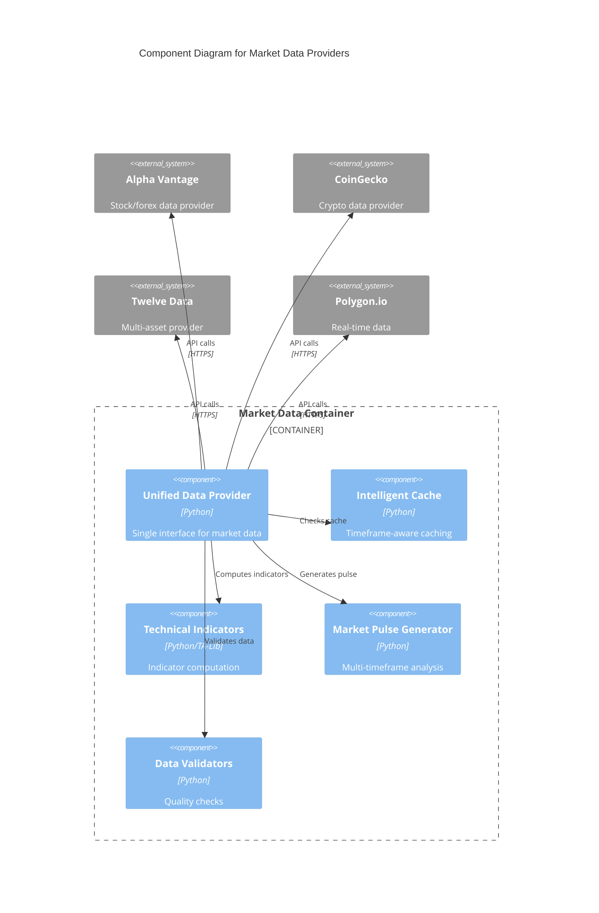

# C4 Component Level: Market Data Providers

## Overview
- **Name**: Market Data Providers
- **Description**: Multi-source financial market data acquisition with intelligent caching, multi-timeframe aggregation, and technical indicator computation
- **Type**: Data Integration Component
- **Technology**: Python 3.9+, Pandas, TA-Lib, REST APIs

## Purpose
Aggregates financial market data from multiple sources (Alpha Vantage, CoinGecko, Twelve Data, Polygon) providing unified access to OHLCV data, technical indicators, and multi-timeframe analysis. Implements intelligent caching to minimize API costs and ensure data freshness for trading decisions.

## Software Features
- **Multi-Source Data Aggregation**: Fallback chain across providers for reliability
- **Multi-Timeframe Analysis**: Concurrent data fetching for 1m, 5m, 15m, 30m, 1h, 4h, 1d timeframes
- **Technical Indicator Computation**: RSI, MACD, Bollinger Bands, ADX, ATR, EMA/SMA
- **Intelligent Caching**: Timeframe-aware cache with TTL (1m data: 30s cache, 1d data: 1h cache)
- **Market Pulse Generation**: Cross-timeframe technical analysis snapshots
- **Data Validation**: Freshness checks, gap detection, schema validation
- **Cost Optimization**: Free-tier prioritization with premium fallback
- **Asset Classification**: Automatic forex vs crypto routing

## Code Elements
- [c4-code-finance_feedback_engine-data_providers.md](./c4-code-finance_feedback_engine-data_providers.md) - Data provider implementations and caching

## Interfaces

### UnifiedDataProvider API
- **Protocol**: Python API
- **Operations**:
  - `get_market_data(asset_pair: str, timeframe: str = "1h", limit: int = 100) -> pd.DataFrame` - Retrieve OHLCV data
  - `get_technical_indicators(asset_pair: str, timeframe: str = "1h") -> Dict[str, Any]` - Compute indicators
  - `get_multi_timeframe_pulse(asset_pair: str, timeframes: List[str]) -> Dict[str, Any]` - Cross-timeframe analysis

## Dependencies

### Components Used
- **Utilities & Infrastructure**: Circuit breakers, retry logic, cache metrics, data validation

### External Systems
- **Alpha Vantage API**: Stock and forex data (free tier: 25 requests/day)
- **CoinGecko API**: Crypto market data (free tier: 50 requests/minute)
- **Twelve Data API**: Multi-asset market data
- **Polygon.io API**: Real-time and historical data

## Component Diagram

## Notes
- Cache stored in `data/cache/market_data/`
- Provider fallback order: Free tier → Premium tier
- Data validation ensures quality before use in decisions
- Multi-timeframe pulse cached for 5 minutes
