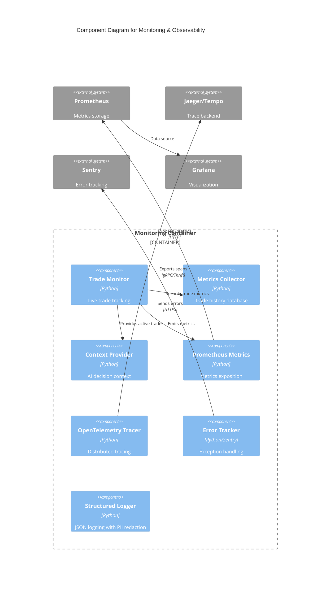

# C4 Component Level: Monitoring & Observability

## Overview
- **Name**: Monitoring & Observability
- **Description**: Production-grade monitoring infrastructure with real-time trade tracking, Prometheus metrics, distributed tracing, structured logging, and error tracking
- **Type**: Infrastructure Component
- **Technology**: Python 3.9+, OpenTelemetry, Prometheus, Jaeger/Tempo, Sentry

## Purpose
Provides comprehensive observability for the trading system including live trade monitoring from decision to execution to closure, performance metrics collection, distributed request tracing, and centralized error tracking. Enables operators to monitor system health, diagnose issues, and track trading performance in real-time.

## Software Features
- **Live Trade Monitoring**: Track individual trades from entry to exit with real-time P&L updates
- **Prometheus Metrics**: Counters, gauges, histograms for decisions, trades, provider performance
- **Distributed Tracing**: OpenTelemetry instrumentation with Jaeger/Tempo backends
- **Structured JSON Logging**: Correlation IDs, PII redaction, log rotation with retention
- **Error Tracking**: Sentry integration with context sanitization
- **Model Performance Monitoring**: Drift detection (data drift via KS test, concept drift)
- **Trade Metrics Collection**: Historical trade database for ML feedback loop
- **Monitoring Context Provider**: Live portfolio context for AI decision-making
- **Portfolio Limit Enforcement**: Real-time stop-loss/take-profit monitoring
- **Multi-Timeframe Market Pulse**: Cached technical analysis across timeframes

## Code Elements
- [c4-code-finance_feedback_engine-monitoring.md](./c4-code-finance_feedback_engine-monitoring.md) - Trade monitoring, metrics collection, context provider
- [c4-code-finance_feedback_engine-observability.md](./c4-code-finance_feedback_engine-observability.md) - OpenTelemetry tracing, correlation IDs
- [c4-code-finance_feedback_engine-metrics.md](./c4-code-finance_feedback_engine-metrics.md) - Prometheus metrics scaffolding

## Interfaces

### TradeMonitor API
- **Protocol**: Python API
- **Operations**:
  - `start() -> None` - Start trade monitoring system
  - `stop() -> None` - Gracefully stop monitoring
  - `associate_decision_to_trade(decision_id: str, asset_pair: str) -> None` - Link decision to trade
  - `get_active_trades() -> List[Dict]` - Retrieve live trade status
  - `get_latest_market_context(asset_pair: str) -> Optional[Dict]` - Get cached pulse data

### Prometheus Metrics API
- **Protocol**: HTTP (/metrics endpoint)
- **Metrics Exposed**:
  - Counters: `ffe_decisions_created_total`, `ffe_trades_executed_total`, `ffe_provider_requests_total`
  - Gauges: `ffe_portfolio_value_dollars`, `ffe_active_trades_total`, `ffe_agent_state`
  - Histograms: `ffe_provider_query_latency_seconds`, `ffe_execution_latency_seconds`
  - Summary: `trade_pnl_dollars_summary`

### OpenTelemetry Tracing API
- **Protocol**: Python API
- **Operations**:
  - `init_tracer(config: Dict) -> None` - Initialize tracing with backend
  - `get_tracer(name: str) -> Tracer` - Get tracer for module
  - `with_span(tracer: Tracer, span_name: str, attributes: Dict)` - Create span context manager
  - `get_trace_headers() -> Dict[str, str]` - W3C trace context headers for propagation

### Error Tracking API
- **Protocol**: Python API
- **Operations**:
  - `capture_exception(error: Exception, context: Dict, level: str) -> None` - Capture error with context
  - `capture_message(message: str, context: Dict, level: str) -> None` - Capture event

## Dependencies

### Components Used
- **Trading Agent**: Integrates TradeMonitor for live tracking
- **AI Decision Engine**: Records decision latency and provider metrics
- **Trading Platform Integration**: Monitors trade execution and portfolio state
- **Portfolio Memory & Learning**: Feeds trade metrics for learning

### External Systems
- **Prometheus Server**: Scrapes /metrics endpoint
- **Jaeger/Tempo**: Distributed tracing backend
- **Sentry**: Error tracking and alerting service
- **Grafana**: Metrics visualization dashboards

## Component Diagram

## Notes
- Trade monitoring limited to 2 concurrent trades to prevent resource exhaustion
- Prometheus metrics use low-cardinality design (Summary instead of per-trade Gauges)
- PII redaction filters API keys, passwords, tokens from logs and errors
- Correlation IDs propagate through async contexts via ContextVar
- Model drift detection: KS test for data drift, performance comparison for concept drift
- Metrics stored in `data/trade_metrics/` as JSON for ML training
