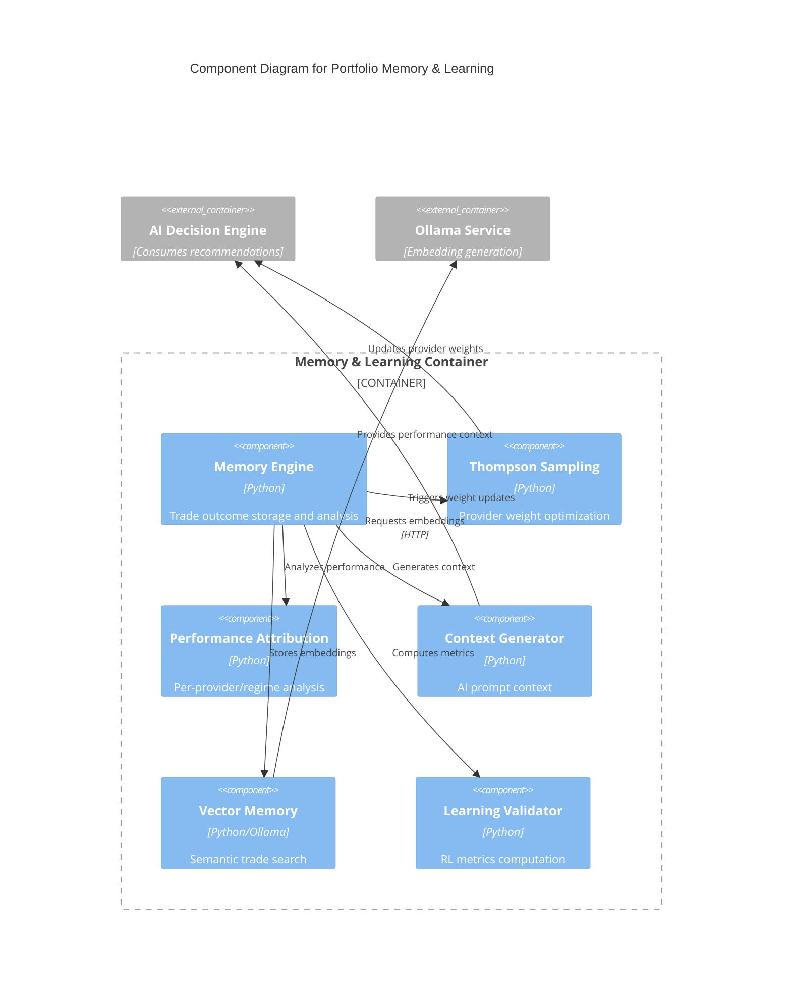

# C4 Component Level: Portfolio Memory & Learning

## Overview
- **Name**: Portfolio Memory & Learning
- **Description**: Reinforcement learning-based memory system tracking trade outcomes, performance attribution, and adaptive learning with Thompson Sampling for provider weight optimization
- **Type**: Learning Component
- **Technology**: Python 3.9+, NumPy, Ollama Embeddings, Thompson Sampling (Bayesian Optimization)

## Purpose
Implements an intelligent memory system that learns from trade outcomes to improve future trading decisions. Tracks detailed trade metrics, analyzes performance attribution by provider and market regime, generates performance context for AI prompts, and optimizes provider weights through Thompson Sampling multi-armed bandit algorithm.

## Software Features
- **Trade Outcome Recording**: Comprehensive P&L tracking with entry/exit prices, holding periods, transaction costs
- **Performance Attribution**: Per-provider, per-strategy, per-regime performance analysis
- **Thompson Sampling Integration**: Dynamic provider weight optimization based on outcomes
- **Context Generation for AI**: Performance summaries formatted for AI system prompts
- **Veto Decision Tracking**: Tracks veto accuracy for adaptive threshold tuning
- **Kelly Criterion Activation**: Monitors profit factor stability for optimal sizing
- **Transaction Cost Analysis**: Rolling averages of slippage, fees, spread costs
- **Learning Validation Metrics**: Sample efficiency, cumulative regret, concept drift detection
- **Vector Memory Search**: Semantic search using Ollama embeddings for similar trade patterns
- **Walk-Forward Testing Support**: Snapshot/restore for preventing lookahead bias

## Code Elements
- [c4-code-finance_feedback_engine-memory.md](./c4-code-finance_feedback_engine-memory.md) - Memory engine, performance tracking, learning algorithms
- [c4-code-finance_feedback_engine-learning.md](./c4-code-finance_feedback_engine-learning.md) - Thompson Sampling, learning validation

## Interfaces

### PortfolioMemoryEngine API
- **Protocol**: Python API
- **Operations**:
  - `record_trade_outcome(decision: Dict, exit_price: float, exit_timestamp: str, hit_stop_loss: bool, hit_take_profit: bool) -> TradeOutcome` - Record completed trade
  - `analyze_performance(window_days: int = None) -> PerformanceSnapshot` - Calculate performance metrics
  - `generate_context(asset_pair: str = None, max_recent: int = 20) -> Dict` - Generate AI decision context
  - `get_provider_recommendations() -> Dict` - Recommend provider weight adjustments
  - `get_veto_threshold_recommendation(base_threshold: float = 0.6) -> float` - Adaptive veto threshold
  - `check_kelly_activation_criteria(window: int = 50) -> Dict` - Check Kelly Criterion readiness

### Thompson Sampling API
- **Protocol**: Callback-based
- **Operations**:
  - `register_thompson_sampling_callback(callback: Callable) -> None` - Register weight update callback
  - `_trigger_thompson_sampling_update(outcome: TradeOutcome, decision: Dict) -> None` - Update weights

### Vector Memory API
- **Protocol**: Python API
- **Operations**:
  - `add_record(id: str, text: str, metadata: Dict) -> bool` - Add trade memory with embedding
  - `find_similar(text: str, top_k: int = 5) -> List[Tuple[str, float, Dict]]` - Find similar trades

## Dependencies

### Components Used
- **AI Decision Engine**: Receives provider recommendations and performance context
- **Backtesting Framework**: Provides learning validation metrics
- **Monitoring & Observability**: Performance metrics export

### External Systems
- **Ollama**: Embedding generation for vector memory (nomic-embed-text model)

## Component Diagram

## Notes
- Memory stored in `data/memory/portfolio_memory.json` with atomic writes
- Thompson Sampling uses Beta distribution sampling for exploration/exploitation
- Learning validation metrics: sample efficiency, cumulative regret, concept drift
- Vector memory gracefully degrades if Ollama unavailable (cold start mode)
- Snapshot/restore enables walk-forward testing without lookahead bias
