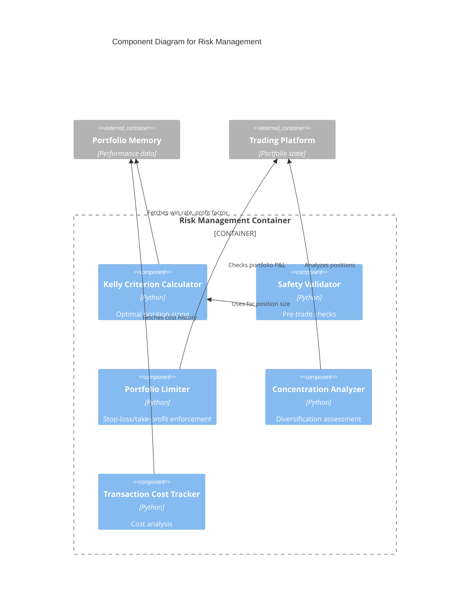

# C4 Component Level: Risk Management

## Overview
- **Name**: Risk Management
- **Description**: Portfolio risk assessment, position sizing, Kelly Criterion implementation, and pre-trade safety validation
- **Type**: Risk Control Component
- **Technology**: Python 3.9+, NumPy, Statistical Analysis

## Purpose
Provides comprehensive risk management capabilities to prevent excessive losses and optimize position sizing. Implements Kelly Criterion for optimal bet sizing, portfolio-level risk limits, position concentration analysis, and pre-flight safety checks before trade execution.

## Software Features
- **Kelly Criterion Position Sizing**: Optimal position size calculation based on win rate and profit factor
- **Portfolio Risk Limits**: Stop-loss and take-profit enforcement at portfolio level
- **Position Concentration Analysis**: Prevents over-concentration in single assets
- **Pre-Trade Safety Validation**: Validates decisions before execution
- **Transaction Cost Analysis**: Rolling cost averages for break-even calculations
- **Kelly Activation Criteria**: Auto-enables Kelly sizing when profit factor stable (PF >= 1.2, std < 0.15)
- **Diversification Scoring**: Measures portfolio diversification quality
- **Leverage Estimation**: Calculates effective portfolio leverage

## Code Elements
- [c4-code-finance_feedback_engine-risk.md](./c4-code-finance_feedback_engine-risk.md) - Risk management calculations and validation

## Interfaces

### RiskManager API
- **Protocol**: Python API
- **Operations**:
  - `calculate_position_size(decision: Dict, account_balance: float, risk_per_trade: float) -> float` - Kelly Criterion sizing
  - `validate_decision_safety(decision: Dict) -> Tuple[bool, List[str]]` - Pre-trade validation
  - `check_portfolio_limits(current_pnl_pct: float, stop_loss_pct: float, take_profit_pct: float) -> Tuple[bool, str]` - Portfolio limit checks
  - `analyze_concentration(portfolio: Dict) -> Dict[str, Any]` - Concentration analysis

## Dependencies

### Components Used
- **Portfolio Memory & Learning**: Historical performance for Kelly Criterion
- **Trading Platform Integration**: Portfolio breakdown for concentration analysis

### External Systems
- None

## Component Diagram

## Notes
- Kelly Criterion only activated when profit factor >= 1.2 with low variance
- Default risk per trade: 1-2% of account balance
- Portfolio stop-loss triggers agent pause
- Safety validator checks data freshness, confidence, position sizing, risk parameters
