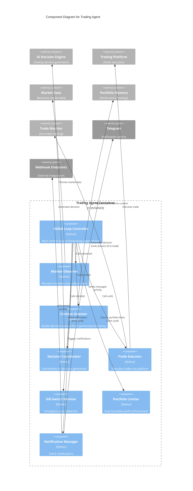

# C4 Component Level: Trading Agent

## Overview
- **Name**: Trading Agent
- **Description**: Autonomous trading agent implementing the OODA (Observe-Orient-Decide-Act) loop pattern for continuous market analysis and trade execution
- **Type**: Application Component
- **Technology**: Python 3.9+, AsyncIO, Multi-threading

## Purpose
The Trading Agent is the autonomous operation engine that continuously monitors markets, generates trading decisions, and executes trades without human intervention. It implements a military-inspired OODA loop (Observe-Orient-Decide-Act) for rapid market response combined with kill-switch safety mechanisms, portfolio limit monitoring, and notification integration. The agent coordinates all system components to create a complete autonomous trading solution.

## Software Features
- **OODA Loop Implementation**: Continuous observe-orient-decide-act cycle with configurable iteration timing
- **Autonomous Operation**: Hands-free trading with optional human-in-the-loop approval mode
- **Multi-Asset Monitoring**: Simultaneous monitoring of configurable asset watchlist
- **Portfolio Limit Enforcement**: Automatic pause on stop-loss or take-profit thresholds
- **Kill-Switch Integration**: Emergency stop mechanism with file-based and signal-based triggers
- **Trade Lifecycle Management**: End-to-end trade tracking from decision to execution to closure
- **Notification Integration**: Real-time alerts via Telegram and webhooks for key events
- **Graceful Shutdown**: Clean state persistence and resource cleanup on termination
- **Performance Metrics**: Cycle timing, daily trade counts, uptime tracking
- **Configuration Hot-Reload**: Dynamic configuration updates without restart

## Code Elements
This component contains the following code-level elements:
- [c4-code-finance_feedback_engine-agent.md](./c4-code-finance_feedback_engine-agent.md) - Trading agent implementation with OODA loop, configuration, and lifecycle management

## Interfaces

### TradingAgentAPI
- **Protocol**: Python API (sync/async hybrid)
- **Description**: Main interface for agent lifecycle and control
- **Operations**:
  - `initialize(config: TradingAgentConfig) -> None` - Initialize agent with configuration
  - `start() -> None` - Start autonomous trading loop
  - `stop() -> None` - Gracefully stop agent
  - `pause() -> None` - Pause trading (stop new decisions, monitor existing)
  - `resume() -> None` - Resume trading after pause
  - `get_status() -> Dict[str, Any]` - Retrieve current agent state and metrics

### OODA Loop Callbacks
- **Protocol**: Internal callback chain
- **Description**: Callbacks for each OODA loop phase
- **Operations**:
  - `observe() -> Dict[str, Any]` - Market data collection and watchlist monitoring
  - `orient() -> Dict[str, Any]` - Context building and performance analysis
  - `decide() -> Optional[Dict]` - Decision generation via AI Decision Engine
  - `act(decision: Dict) -> bool` - Trade execution via Trading Platform Integration

### Notification Interface
- **Protocol**: HTTP webhooks and Telegram Bot API
- **Description**: Event notification system for agent events
- **Operations**:
  - `send_trade_notification(trade: Dict) -> bool` - Notify on trade execution
  - `send_limit_alert(limit_type: str, value: float) -> bool` - Alert on portfolio limits
  - `send_error_notification(error: Exception, context: Dict) -> bool` - Error alerts
  - `send_kill_switch_alert() -> bool` - Emergency stop notification

## Dependencies

### Components Used
- **AI Decision Engine**: Generates trading decisions in the Decide phase
- **Trading Platform Integration**: Executes trades in the Act phase
- **Market Data Providers**: Provides market data in the Observe phase
- **Portfolio Memory & Learning**: Provides performance context in the Orient phase
- **Monitoring & Observability**: Trade lifecycle tracking and performance metrics
- **Risk Management**: Validates decisions before execution

### External Systems
- **Telegram Bot API**: Real-time notifications for trade events and alerts
- **Webhook Endpoints**: HTTP callbacks for integration with external systems
- **File System**: Kill-switch file (`data/kill_switch.txt`) for emergency stops

## Component Diagram



## Key Design Patterns

### OODA Loop Pattern
Military decision-making cycle adapted for trading:
1. **Observe**: Scan markets, collect data, detect opportunities
2. **Orient**: Analyze performance, build context, assess risk
3. **Decide**: Generate trading decision via AI ensemble
4. **Act**: Execute approved trades, monitor positions

Cycle timing: 60-300 seconds configurable

### State Machine
Agent states:
- **IDLE**: Waiting for next cycle
- **OBSERVING**: Collecting market data
- **ORIENTING**: Building decision context
- **DECIDING**: Generating AI decision
- **ACTING**: Executing trade
- **PAUSED**: Temporarily suspended (limits hit or manual pause)
- **STOPPED**: Gracefully shut down

### Event-Driven Notification
Three notification channels:
1. **Telegram**: Real-time mobile alerts for traders
2. **Webhooks**: Integration with external systems (Slack, PagerDuty)
3. **Logs**: Structured logging for audit trail

### Circuit Breaker Integration
Protects against cascade failures:
- AI provider circuit breakers (fail fast on repeated errors)
- Platform API circuit breakers (pause trading on exchange issues)
- Recovery: Half-open testing before resuming normal operation

## Performance Characteristics
- **Cycle Latency**: 60-120 seconds typical (configurable)
- **Decision Throughput**: 10-20 decisions per hour per agent instance
- **Resource Usage**: ~100MB RAM, <5% CPU on modern hardware
- **Uptime**: Designed for 24/7 operation with graceful degradation
- **Concurrent Assets**: Handles 10+ assets simultaneously

## Configuration
```yaml
agent:
  mode: "autonomous"  # autonomous | signal_only
  iteration_delay_seconds: 60
  portfolio:
    initial_balance: 10000.0
    stop_loss_percentage: 0.10    # 10% portfolio drawdown
    take_profit_percentage: 0.20  # 20% portfolio profit
  watchlist:
    - "BTCUSD"
    - "ETHUSD"
    - "EURUSD"
  kill_switch:
    enabled: true
    file_path: "data/kill_switch.txt"
  notifications:
    telegram:
      enabled: true
      bot_token: "${TELEGRAM_BOT_TOKEN}"
      chat_id: "${TELEGRAM_CHAT_ID}"
    webhook:
      enabled: false
      url: "${WEBHOOK_URL}"
```

## Operational Modes

### Autonomous Mode
- Generates and executes trades automatically
- No human approval required
- Maximum throughput for algorithmic trading
- Recommended for: Production algorithmic trading

### Signal-Only Mode
- Generates trading signals for human review
- Saves decisions to `data/decisions/` for approval
- Human approves via CLI `approve` command
- Recommended for: Learning, testing, semi-automated trading

## Safety Mechanisms

### Kill-Switch
Three activation methods:
1. **File-based**: Create `data/kill_switch.txt` file
2. **Signal-based**: Send SIGTERM or SIGINT to process
3. **API-based**: Call `agent.stop()` method

### Portfolio Limits
Automatic pause conditions:
- **Stop-Loss**: Portfolio value drops below threshold (default: -10%)
- **Take-Profit**: Portfolio value exceeds target (default: +20%)
- **Max Drawdown**: Peak-to-trough drawdown limit

### Notification Alerts
Real-time alerts for:
- Trade executions
- Portfolio limit hits
- Kill-switch activation
- Critical errors
- Decision rejections (veto or risk)

## Notes
- Agent persists state to allow resume after crash/restart
- Daily trade count resets at UTC midnight
- Performance metrics exported to Prometheus for monitoring
- Kill-switch bypasses all decision logic for immediate stop
- Portfolio limits checked before and after each trade
- Supports multiple concurrent agent instances for different strategies (unique instance IDs)
