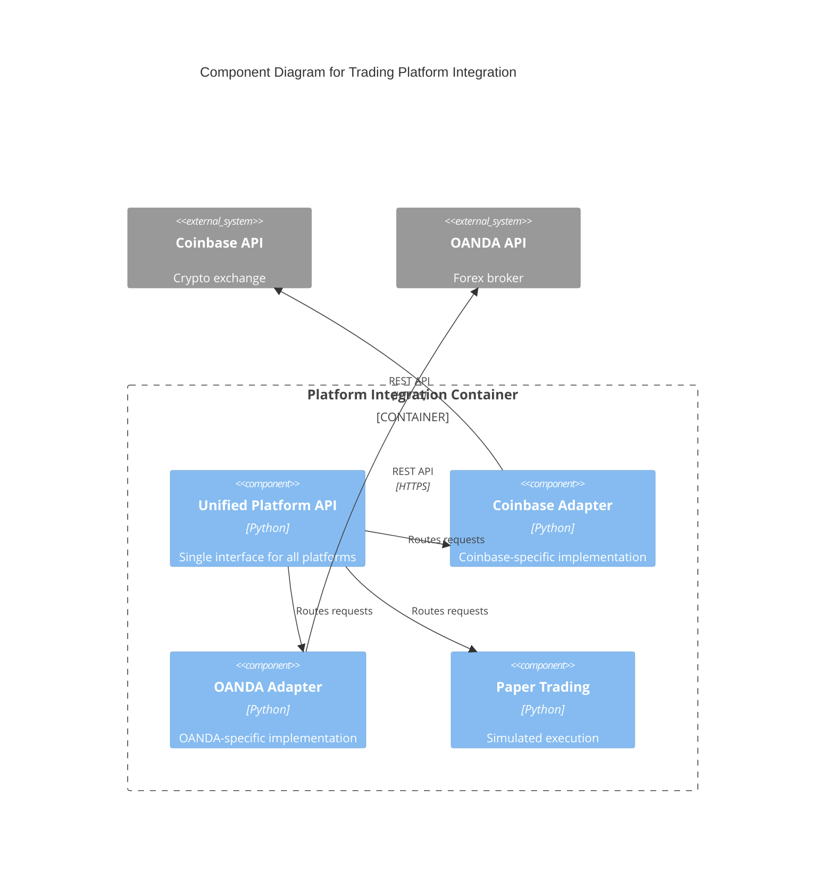

# C4 Component Level: Trading Platform Integration

## Overview
- **Name**: Trading Platform Integration
- **Description**: Unified abstraction layer for trading platform connectivity, order execution, and position management across multiple exchanges
- **Type**: Integration Component
- **Technology**: Python 3.9+, REST/WebSocket APIs, Unified Platform Interface

## Purpose
Provides a consistent API for trade execution across different trading platforms (Coinbase, OANDA, Paper Trading) while handling platform-specific authentication, order format conversion, and error handling. Enables the system to switch platforms without code changes in higher-level components.

## Software Features
- **Unified Platform Interface**: Single API for all platforms (get_balance, execute_trade, get_positions, close_position)
- **Platform Abstraction**: Hides platform-specific implementation details
- **Order Type Support**: Market, limit, stop-loss, take-profit orders
- **Position Management**: Open, monitor, and close positions with consistent interface
- **Paper Trading Mode**: Risk-free testing with simulated execution
- **Error Normalization**: Consistent error handling across platforms
- **Rate Limiting**: Platform-specific request throttling
- **Authentication Management**: Secure API key handling per platform

## Code Elements
- [c4-code-finance_feedback_engine-trading_platforms.md](./c4-code-finance_feedback_engine-trading_platforms.md) - Platform implementations and unified interface

## Interfaces

### UnifiedPlatformInterface
- **Protocol**: Python API
- **Operations**:
  - `get_balance() -> Dict[str, float]` - Retrieve account balances
  - `execute_trade(asset_pair: str, action: str, position_size: float, stop_loss: float, take_profit: float) -> Dict` - Execute trade
  - `get_positions() -> List[Dict]` - List open positions
  - `close_position(position_id: str) -> bool` - Close specific position
  - `get_portfolio_breakdown() -> Dict` - Detailed portfolio information

## Dependencies

### Components Used
- **Utilities & Infrastructure**: Circuit breakers, retry logic, rate limiting
- **Monitoring & Observability**: Execution metrics, API latency tracking

### External Systems
- **Coinbase Advanced Trade API**: Crypto trading platform
- **OANDA v20 API**: Forex trading platform
- **Paper Trading Simulator**: In-memory simulated execution

## Component Diagram

## Notes
- Platform selection via configuration: `platform: "coinbase" | "oanda" | "paper"`
- Paper trading simulates realistic slippage and fees
- All platforms support async/await for concurrent operations
