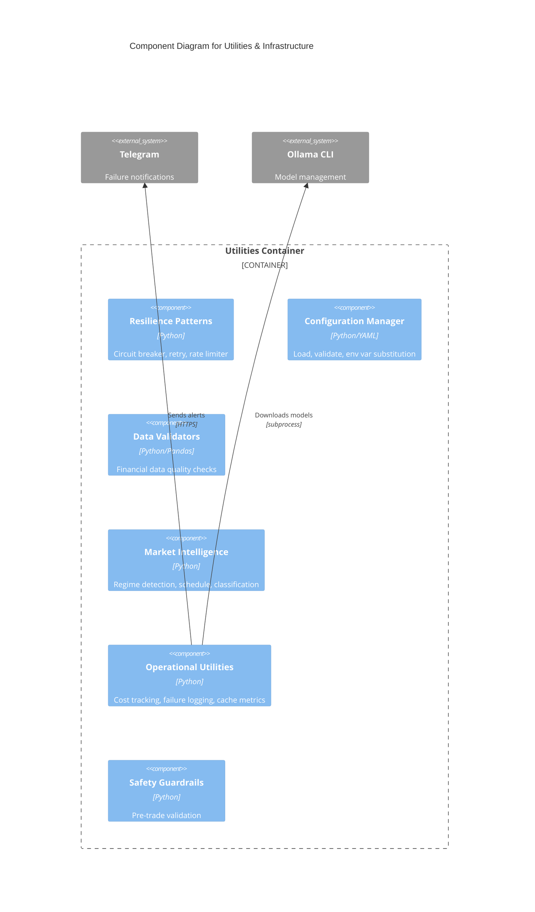

# C4 Component Level: Utilities & Infrastructure

## Overview
- **Name**: Utilities & Infrastructure
- **Description**: Cross-cutting utility library providing resilience patterns, configuration management, financial data validation, and operational utilities
- **Type**: Infrastructure Library
- **Technology**: Python 3.8+, YAML, Pandas, Requests

## Purpose
Provides foundational infrastructure services used across all components including circuit breaker fault tolerance, exponential backoff retry logic, rate limiting, configuration loading with environment variable substitution, comprehensive configuration validation, financial data quality checks, market regime detection, and operational tracking utilities.

## Software Features
- **Circuit Breaker Pattern**: Fault tolerance with CLOSED/OPEN/HALF_OPEN states for external service calls
- **Exponential Backoff Retry**: Configurable retry with jitter to prevent thundering herd
- **Token Bucket Rate Limiting**: Async/sync compatible API quota management
- **Configuration Management**: YAML loading with environment variable substitution and tiered precedence
- **Configuration Validation**: Security checks, schema validation, environment-specific rules
- **Financial Data Validation**: Price, volume, timestamp, currency pair validation with DataFrame support
- **Market Regime Detection**: ADX/ATR-based regime classification (trending/ranging/volatile)
- **Market Schedule**: Timezone-aware market open/close detection for stocks, forex, crypto
- **Asset Classification**: Automatic forex vs crypto routing based on pair format
- **Cost Tracking**: Premium API call logging with daily budget enforcement
- **Failure Logging**: Phase 1 quorum failure tracking with Telegram notifications
- **Cache Metrics**: Hit rate, efficiency scoring for performance optimization
- **Model Installation**: Automatic Ollama model downloads with progress tracking
- **Safety Guardrails**: Pre-flight validation before trade execution

## Code Elements
- [c4-code-finance_feedback_engine-utils.md](./c4-code-finance_feedback_engine-utils.md) - Resilience patterns, config management, validation, market intelligence

## Interfaces

### Resilience Patterns API
- **Circuit Breaker**: `@circuit_breaker(failure_threshold=5, recovery_timeout=60.0)` decorator
- **Retry**: `@exponential_backoff_retry(max_retries=3, base_delay=1.0, jitter=True)` decorator
- **Rate Limiter**: `RateLimiter(tokens_per_second=5, max_tokens=5)` - `wait_for_token()` and `wait_for_token_async()`

### Configuration API
- **Loading**: `load_config(config_path: str) -> Dict` - YAML with env var substitution
- **Validation**: `validate_config_file(config_path: str, environment: str = "development") -> ValidationResult` - Security and schema checks

### Data Validation API
- **Financial Data**: `FinancialDataValidator.validate_dataframe(df: pd.DataFrame) -> Dict[str, List[str]]` - Batch validation
- **Input Validation**: `standardize_asset_pair(asset_pair: str) -> str`, `validate_data_freshness(timestamp: str, asset_type: str) -> Tuple[bool, str, str]`

### Market Intelligence API
- **Regime Detection**: `MarketRegimeDetector.detect_regime(market_data: pd.DataFrame) -> str` - TRENDING_BULL|TRENDING_BEAR|HIGH_VOLATILITY_CHOP|LOW_VOLATILITY_RANGING
- **Market Schedule**: `MarketSchedule.get_market_status(asset_pair: str, asset_type: str) -> Dict` - `is_open`, `session`, `time_to_close`

### Operational Utilities API
- **Cost Tracking**: `CostTracker.log_premium_call(asset: str, provider: str, cost_estimate: float)` - `get_daily_summary() -> Dict`
- **Failure Logging**: `FailureLogger.log_failure(asset: str, providers_attempted: List[str], quorum_required: int) -> str`
- **Cache Metrics**: `CacheMetrics.record_hit(cache_name: str)`, `get_hit_rate() -> float`

## Dependencies

### Components Used
- None (foundational layer, no dependencies on other components)

### External Systems
- **Ollama**: Model download and verification (via subprocess)
- **Telegram Bot API**: Failure notifications (optional)

## Component Diagram

## Key Patterns

### Circuit Breaker States
- **CLOSED**: Normal operation, requests pass through
- **OPEN**: Too many failures, reject immediately (fail fast)
- **HALF_OPEN**: Testing recovery, allow limited probes

### Configuration Precedence
1. `config/config.local.yaml` (highest - environment-specific)
2. `config/config.yaml` (base defaults)
3. Environment variables (via .env file)

### Validation Severity Levels
- **CRITICAL**: Must fix (exposed secrets, missing required config)
- **HIGH**: Should fix (production without proper logging, sandbox in prod)
- **MEDIUM**: Recommended fix (hardcoded credentials placeholders)
- **LOW**: Nice to have (logging config enhancements)
- **INFO**: Informational (suggestions)

## Performance Characteristics
- **Circuit Breaker**: O(1) state checks with minimal locking
- **Rate Limiter**: O(1) token consumption, monotonic time
- **Config Loading**: O(n) where n = config keys (cached on load)
- **Market Regime Detection**: O(n) where n = OHLC data points (pandas vectorized)

## Notes
- All utilities are stateless except circuit breakers (per-instance state)
- Rate limiters are single-threaded token buckets (scale across processes)
- Configuration validation prevents startup with critical issues
- Cost tracker and failure logger use NDJSON append for concurrent writes
- Market schedule supports UTC, America/New_York, Europe/London timezones
- Ollama model installer downloads max 2 models concurrently for stability
