# C4 Component Level: Finance Feedback Engine System Overview

## System Components

### AI Decision Engine
- **Name**: AI Decision Engine
- **Description**: Core AI decision-making with ensemble provider orchestration, veto logic, and Phase 1/Phase 2 quorum patterns
- **Documentation**: [c4-component-ai-decision-engine.md](./c4-component-ai-decision-engine.md)
- **Key Capabilities**: Multi-provider ensemble voting, Thompson Sampling optimization, two-phase architecture, intelligent veto system
- **Technologies**: Python, AsyncIO, LangChain, Claude/OpenAI/Gemini/Ollama APIs

### Trading Agent
- **Name**: Trading Agent
- **Description**: Autonomous trading agent implementing OODA loop pattern for continuous market analysis and trade execution
- **Documentation**: [c4-component-trading-agent.md](./c4-component-trading-agent.md)
- **Key Capabilities**: OODA loop (Observe-Orient-Decide-Act), autonomous operation, portfolio limit enforcement, kill-switch integration
- **Technologies**: Python, AsyncIO, Multi-threading, Event-driven architecture

### Trading Platform Integration
- **Name**: Trading Platform Integration
- **Description**: Unified abstraction layer for trading platform connectivity and order execution
- **Documentation**: [c4-component-trading-platform-integration.md](./c4-component-trading-platform-integration.md)
- **Key Capabilities**: Multi-platform support (Coinbase, OANDA, Paper Trading), unified interface, error normalization
- **Technologies**: Python, REST/WebSocket APIs, Platform-specific SDKs

### Market Data Providers
- **Name**: Market Data Providers
- **Description**: Multi-source financial market data acquisition with intelligent caching and technical analysis
- **Documentation**: [c4-component-market-data-providers.md](./c4-component-market-data-providers.md)
- **Key Capabilities**: Multi-source aggregation, multi-timeframe analysis, technical indicators, intelligent caching
- **Technologies**: Python, Pandas, TA-Lib, Alpha Vantage/CoinGecko/Twelve Data/Polygon APIs

### Backtesting Framework
- **Name**: Backtesting Framework
- **Description**: Comprehensive strategy validation with walk-forward analysis and Monte Carlo simulation
- **Documentation**: [c4-component-backtesting-framework.md](./c4-component-backtesting-framework.md)
- **Key Capabilities**: Single-asset/portfolio backtesting, walk-forward validation, Monte Carlo robustness testing, statistical validation
- **Technologies**: Python, Pandas, NumPy, Matplotlib

### Risk Management
- **Name**: Risk Management
- **Description**: Portfolio risk assessment, position sizing, and pre-trade safety validation
- **Documentation**: [c4-component-risk-management.md](./c4-component-risk-management.md)
- **Key Capabilities**: Kelly Criterion position sizing, portfolio limits, concentration analysis, safety guardrails
- **Technologies**: Python, NumPy, Statistical analysis

### Portfolio Memory & Learning
- **Name**: Portfolio Memory & Learning
- **Description**: Reinforcement learning memory system with performance tracking and adaptive optimization
- **Documentation**: [c4-component-portfolio-memory-learning.md](./c4-component-portfolio-memory-learning.md)
- **Key Capabilities**: Trade outcome recording, Thompson Sampling, performance attribution, learning validation, vector memory search
- **Technologies**: Python, NumPy, Ollama embeddings, Bayesian optimization

### Monitoring & Observability
- **Name**: Monitoring & Observability
- **Description**: Production-grade monitoring with trade tracking, metrics, tracing, and error tracking
- **Documentation**: [c4-component-monitoring-observability.md](./c4-component-monitoring-observability.md)
- **Key Capabilities**: Live trade monitoring, Prometheus metrics, distributed tracing, structured logging, error tracking
- **Technologies**: Python, OpenTelemetry, Prometheus, Jaeger/Tempo, Sentry

### Command-Line Interface
- **Name**: Command-Line Interface
- **Description**: Comprehensive CLI for agent control, analysis, backtesting, and management
- **Documentation**: [c4-component-command-line-interface.md](./c4-component-command-line-interface.md)
- **Key Capabilities**: Autonomous agent control, interactive shell, decision workflow, backtesting suite, live dashboard
- **Technologies**: Python, Click framework, Rich terminal library

### Utilities & Infrastructure
- **Name**: Utilities & Infrastructure
- **Description**: Cross-cutting utilities providing resilience patterns, configuration, and validation
- **Documentation**: [c4-component-utilities-infrastructure.md](./c4-component-utilities-infrastructure.md)
- **Key Capabilities**: Circuit breaker, retry logic, rate limiting, config management, data validation, market intelligence
- **Technologies**: Python, YAML, Pandas

## System-Level Component Relationships

```mermaid
C4Component
    title Finance Feedback Engine - System Component Diagram

    Container_Boundary(core_trading, "Core Trading System") {
        Component(agent, "Trading Agent", "Python/AsyncIO", "OODA loop autonomous trading")
        Component(decision_engine, "AI Decision Engine", "Python/LangChain", "Ensemble AI decision generation")
        Component(risk_mgmt, "Risk Management", "Python/NumPy", "Position sizing and safety validation")
        Component(platform_integration, "Platform Integration", "Python", "Unified trading platform API")
    }

    Container_Boundary(data_acquisition, "Data & Analysis") {
        Component(market_data, "Market Data Providers", "Python/Pandas", "Multi-source market data")
        Component(backtest, "Backtesting Framework", "Python/NumPy", "Strategy validation")
    }

    Container_Boundary(learning_memory, "Learning & Memory") {
        Component(memory, "Portfolio Memory", "Python", "Trade outcome tracking")
        Component(learning, "Learning System", "Python", "Thompson Sampling optimization")
    }

    Container_Boundary(operations, "Operations & Observability") {
        Component(monitoring, "Monitoring System", "OpenTelemetry", "Live monitoring and metrics")
        Component(cli, "Command-Line Interface", "Click/Rich", "User interface and control")
        Component(observability, "Observability", "Prometheus/Jaeger", "Metrics and tracing")
    }

    Container_Boundary(infrastructure, "Infrastructure") {
        Component(utilities, "Utilities", "Python", "Resilience patterns and validation")
    }

    System_Ext(ai_providers, "AI Providers", "Claude, OpenAI, Gemini, Ollama, Copilot")
    System_Ext(exchanges, "Trading Exchanges", "Coinbase, OANDA")
    System_Ext(data_sources, "Market Data APIs", "Alpha Vantage, CoinGecko, Twelve Data, Polygon")
    System_Ext(observability_stack, "Observability Stack", "Prometheus, Grafana, Jaeger, Sentry")

    %% Core Trading Flow
    Rel(agent, decision_engine, "Requests decision", "OODA Decide phase")
    Rel(agent, platform_integration, "Executes trade", "OODA Act phase")
    Rel(agent, market_data, "Observes markets", "OODA Observe phase")
    Rel(agent, memory, "Retrieves context", "OODA Orient phase")
    Rel(decision_engine, ai_providers, "Ensemble queries", "HTTPS/gRPC")
    Rel(platform_integration, exchanges, "Order execution", "REST API")

    %% Data Flow
    Rel(market_data, data_sources, "Fetches data", "HTTPS")
    Rel(decision_engine, market_data, "Requests market data")
    Rel(backtest, market_data, "Historical data")
    Rel(backtest, decision_engine, "Simulates decisions")

    %% Risk & Validation
    Rel(agent, risk_mgmt, "Validates decision")
    Rel(risk_mgmt, memory, "Fetches performance", "Kelly Criterion")
    Rel(decision_engine, risk_mgmt, "Applies veto logic")

    %% Learning Loop
    Rel(monitoring, memory, "Records trade outcomes")
    Rel(memory, learning, "Triggers optimization")
    Rel(learning, decision_engine, "Updates provider weights", "Thompson Sampling")

    %% Observability
    Rel(agent, monitoring, "Trade lifecycle events")
    Rel(decision_engine, observability, "Decision metrics")
    Rel(platform_integration, observability, "Execution latency")
    Rel(observability, observability_stack, "Metrics and traces")

    %% User Interface
    Rel(cli, agent, "Controls agent")
    Rel(cli, decision_engine, "Generates decisions")
    Rel(cli, backtest, "Runs backtests")
    Rel(cli, memory, "Fetches learning reports")
    Rel(cli, monitoring, "Displays dashboard")

    %% Infrastructure
    Rel(agent, utilities, "Uses circuit breakers")
    Rel(decision_engine, utilities, "Uses retry logic")
    Rel(platform_integration, utilities, "Uses rate limiting")
    Rel(market_data, utilities, "Uses caching")
```

## Component Interaction Patterns

### Trading Decision Flow
1. **Trading Agent** observes markets via **Market Data Providers**
2. **Trading Agent** retrieves performance context from **Portfolio Memory**
3. **Trading Agent** requests decision from **AI Decision Engine**
4. **AI Decision Engine** queries multiple AI providers (Claude, OpenAI, Gemini, Ollama)
5. **AI Decision Engine** applies **Risk Management** veto logic
6. **Trading Agent** validates decision through **Risk Management** (position sizing, safety checks)
7. **Trading Agent** executes trade via **Platform Integration**
8. **Monitoring** tracks trade lifecycle from entry to exit
9. **Portfolio Memory** records outcome and triggers **Learning System** optimization

### Backtesting Flow
1. **CLI** initiates backtest command
2. **Backtesting Framework** fetches historical data from **Market Data Providers**
3. **Backtesting Framework** simulates decisions via **AI Decision Engine**
4. **Risk Management** validates each simulated decision
5. **Backtesting Framework** calculates performance metrics
6. **CLI** displays formatted results with statistical validation

### Monitoring & Observability Flow
1. All components emit **Observability** traces and metrics
2. **Monitoring** tracks live trades with real-time P&L updates
3. **Observability** aggregates metrics for Prometheus/Grafana
4. **CLI** displays live dashboard with tiered refresh rates
5. **Portfolio Memory** provides performance context for decision-making

## Technology Stack Summary

### Languages & Frameworks
- **Python 3.9+**: Primary language for all components
- **AsyncIO**: Asynchronous I/O for concurrent operations
- **Click**: CLI framework for command-line interface
- **Rich**: Terminal formatting and live displays
- **LangChain**: AI provider orchestration framework

### AI & Machine Learning
- **Claude (Anthropic)**: Sonnet models for reasoning
- **OpenAI**: GPT-4/GPT-3.5 for decision generation
- **Google Gemini**: Gemini Pro/Flash for analysis
- **Ollama**: Local AI inference (Llama 3.1, Mistral)
- **GitHub Copilot**: Code-based decision generation
- **Thompson Sampling**: Bayesian multi-armed bandit optimization

### Data & Analytics
- **Pandas**: DataFrame operations for time series analysis
- **NumPy**: Numerical computing for statistics and indicators
- **TA-Lib**: Technical analysis indicators
- **Matplotlib**: Visualization for backtesting results

### Trading Infrastructure
- **Coinbase Advanced Trade API**: Crypto exchange integration
- **OANDA v20 API**: Forex broker integration
- **Alpha Vantage**: Stock and forex market data
- **CoinGecko**: Crypto market data
- **Twelve Data**: Multi-asset market data
- **Polygon.io**: Real-time and historical data

### Observability & Monitoring
- **OpenTelemetry**: Distributed tracing standard
- **Prometheus**: Metrics collection and storage
- **Jaeger/Tempo**: Trace backend and visualization
- **Grafana**: Metrics dashboard and alerting
- **Sentry**: Error tracking and alerting

### Configuration & Infrastructure
- **YAML**: Configuration file format
- **python-dotenv**: Environment variable management
- **Requests**: HTTP client library
- **Tenacity**: Advanced retry decorator

## Deployment Architecture Notes

### Process Model
- **Single Process**: Trading Agent runs as main process
- **Multi-Threading**: Concurrent trade monitoring (max 2 trades)
- **AsyncIO**: Concurrent AI provider queries and data fetching

### Data Persistence
- **JSON Files**: Trade outcomes, decisions, memory state
- **NDJSON**: API cost logs, failure logs (append-only)
- **File-based Cache**: Market data cache with TTL

### External Dependencies
- **AI Provider APIs**: Claude, OpenAI, Gemini (internet connectivity required)
- **Trading Platform APIs**: Coinbase or OANDA (authenticated HTTPS)
- **Market Data APIs**: Alpha Vantage, CoinGecko (public HTTPS)
- **Ollama Service**: Local inference server (optional, HTTP localhost)
- **Observability Stack**: Prometheus, Jaeger, Sentry (optional)

### Configuration Management
- **Tiered Configuration**: `config.local.yaml` > `config.yaml` > environment variables
- **Secret Management**: Environment variables for API keys (never committed)
- **Validation**: Startup validation prevents misconfiguration

## Component Statistics

| Component | LOC (approx) | Key Classes | External Dependencies |
|-----------|--------------|-------------|----------------------|
| AI Decision Engine | 3000+ | DecisionEngine, EnsembleOrchestrator, VetoSystem | Claude, OpenAI, Gemini, Ollama APIs |
| Trading Agent | 1500+ | TradingLoopAgent, OODAController | Telegram, Webhooks |
| Platform Integration | 2000+ | UnifiedPlatform, CoinbaseAdapter, OandaAdapter | Coinbase API, OANDA API |
| Market Data Providers | 2500+ | UnifiedDataProvider, TimeframeAggregator | Alpha Vantage, CoinGecko, Twelve Data |
| Backtesting Framework | 2000+ | Backtester, WalkForwardAnalyzer, MonteCarloSimulator | Pandas, NumPy |
| Risk Management | 800+ | RiskManager, KellyCriterion, SafetyGuardrails | NumPy |
| Portfolio Memory | 1800+ | PortfolioMemoryEngine, ThompsonSampling, VectorMemory | Ollama (optional) |
| Monitoring & Observability | 3000+ | TradeMonitor, MetricsCollector, OTelTracer | Prometheus, Jaeger, Sentry |
| CLI | 2000+ | CLIMain, AgentCommands, BacktestCommands | Click, Rich |
| Utilities | 3800+ | CircuitBreaker, ConfigValidator, MarketRegimeDetector | YAML, Pandas |

**Total**: ~22,400 lines of Python code across 10 major components

## Notes

- This system implements a complete autonomous trading solution from data acquisition through decision generation to execution and learning
- Component boundaries align with domain responsibilities (trading, data, risk, learning) and technical concerns (observability, infrastructure)
- All components follow consistent patterns: circuit breakers for resilience, structured logging, configuration-driven behavior
- The learning loop creates a feedback cycle: trades → outcomes → performance analysis → provider optimization → improved decisions
- Extensive testing infrastructure supports backtesting, walk-forward validation, and Monte Carlo robustness testing
- Production-grade observability enables real-time monitoring, debugging, and performance optimization
- CLI provides both interactive exploration and scriptable automation for all system capabilities
