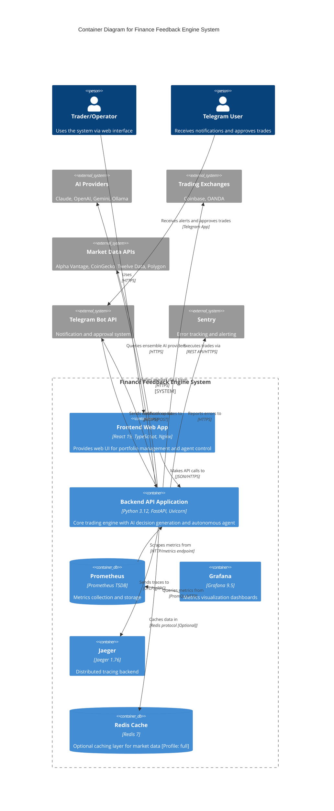

# C4 Container Level: Finance Feedback Engine System Deployment

## Overview

This document describes the container-level architecture of the Finance Feedback Engine system. According to the [C4 model](https://c4model.com/diagrams/container), containers represent deployable units that execute code - applications, databases, services, or any process that needs to be running for the system to work. This document maps logical components to physical deployment units and documents their APIs, communication protocols, and infrastructure requirements.

## System Context

The Finance Feedback Engine is an AI-powered autonomous trading system deployed as a microservices architecture using Docker containers. The system consists of:
- **Backend API** (Python/FastAPI) for trading logic and AI decision generation
- **Frontend Web Application** (React/Nginx) for user interface
- **Monitoring Stack** (Prometheus/Grafana/Jaeger) for observability
- **Optional Caching Layer** (Redis) for performance optimization

---

## Containers

### 1. Backend API Application

- **Name**: Backend API Application
- **Description**: FastAPI application providing REST API for trading decisions, agent control, and portfolio management
- **Type**: Web Application (API Server)
- **Technology**: Python 3.12, FastAPI, Uvicorn, AsyncIO
- **Deployment**: Docker container with multi-stage build

#### Purpose

The Backend API Application is the core engine of the Finance Feedback Engine system. It orchestrates all trading logic, AI decision generation, market data acquisition, and autonomous trading agent operation. The container runs a FastAPI application served by Uvicorn with a single worker process (required for SQLite-based storage). It exposes REST API endpoints for frontend communication, Telegram webhooks, and Prometheus metrics.

This container implements:
- **Trading decision generation** using ensemble AI providers (Claude, OpenAI, Gemini, Ollama)
- **Autonomous trading agent** with OODA loop pattern
- **Portfolio management** and risk analysis
- **Market data aggregation** from multiple sources
- **Real-time monitoring** and observability integration

#### Components Deployed

This container deploys the following components:

- **AI Decision Engine**: Core AI decision-making with ensemble provider orchestration
  - Documentation: [c4-component-ai-decision-engine.md](./c4-component-ai-decision-engine.md)

- **Trading Agent**: Autonomous trading agent with OODA loop pattern
  - Documentation: [c4-component-trading-agent.md](./c4-component-trading-agent.md)

- **Trading Platform Integration**: Unified abstraction for trading platforms
  - Documentation: [c4-component-trading-platform-integration.md](./c4-component-trading-platform-integration.md)

- **Market Data Providers**: Multi-source market data acquisition
  - Documentation: [c4-component-market-data-providers.md](./c4-component-market-data-providers.md)

- **Backtesting Framework**: Strategy validation and walk-forward analysis
  - Documentation: [c4-component-backtesting-framework.md](./c4-component-backtesting-framework.md)

- **Risk Management**: Portfolio risk assessment and position sizing
  - Documentation: [c4-component-risk-management.md](./c4-component-risk-management.md)

- **Portfolio Memory & Learning**: Reinforcement learning and performance tracking
  - Documentation: [c4-component-portfolio-memory-learning.md](./c4-component-portfolio-memory-learning.md)

- **Monitoring & Observability**: Production-grade monitoring and tracing
  - Documentation: [c4-component-monitoring-observability.md](./c4-component-monitoring-observability.md)

- **Command-Line Interface**: CLI for agent control and analysis
  - Documentation: [c4-component-command-line-interface.md](./c4-component-command-line-interface.md)

- **Utilities & Infrastructure**: Cross-cutting utilities and resilience patterns
  - Documentation: [c4-component-utilities-infrastructure.md](./c4-component-utilities-infrastructure.md)

#### Interfaces

##### REST API (Primary Interface)

- **Protocol**: REST over HTTPS
- **Description**: Main API for trading decisions, agent control, and system status
- **Specification**: [backend-api.yaml](./apis/backend-api.yaml)
- **Authentication**: API key validation (optional), JWT tokens (planned)
- **Rate Limiting**: Configurable per-endpoint rate limits

**Key Endpoints**:
- `GET /health` - Health check with circuit breaker status
- `GET /ready` - Kubernetes readiness probe
- `GET /live` - Kubernetes liveness probe
- `POST /api/v1/decisions` - Create trading decision
- `GET /api/v1/decisions` - List recent decisions
- `GET /api/v1/status` - Get portfolio status
- `POST /api/bot/start` - Start trading agent
- `POST /api/bot/stop` - Stop trading agent
- `GET /api/bot/status` - Get agent status
- `POST /webhook/telegram` - Telegram webhook for approvals
- `GET /metrics` - Prometheus metrics exposition

##### Prometheus Metrics Interface

- **Protocol**: HTTP (text/plain)
- **Description**: Exposes Prometheus metrics in text exposition format
- **Endpoint**: `GET /metrics` on port 8000
- **Format**: Prometheus text format v0.0.4

**Metrics Exposed**:
- `ffe_decisions_total` - Total decisions by action (BUY/SELL/HOLD)
- `ffe_decision_latency_seconds` - Decision generation latency
- `ffe_trades_total` - Total trades executed
- `ffe_agent_uptime_seconds` - Agent uptime
- `ffe_circuit_breaker_state` - Circuit breaker states
- `ffe_api_requests_total` - API request counter
- `ffe_api_latency_seconds` - API request latency

##### Telegram Webhook Interface

- **Protocol**: HTTPS webhook (POST)
- **Description**: Receives updates from Telegram Bot API for approval workflow
- **Endpoint**: `POST /webhook/telegram`
- **Authentication**: Telegram token validation

#### Dependencies

##### Containers Used

- **Prometheus**: Scrapes metrics from `/metrics` endpoint (HTTP)
- **Grafana**: Visualizes metrics via Prometheus data source (HTTP)
- **Jaeger/Tempo**: Receives distributed traces via OpenTelemetry (gRPC/HTTP)
- **Redis** (optional): Caching layer for market data (Redis protocol)
- **Frontend**: Serves API responses to frontend (HTTP/JSON)

##### External Systems

- **Claude API** (Anthropic): AI decision provider (HTTPS)
- **OpenAI API**: GPT-4/3.5 decision provider (HTTPS)
- **Google Gemini API**: Gemini Pro/Flash provider (HTTPS)
- **Ollama**: Local AI inference server (HTTP, http://host.docker.internal:11434)
- **Coinbase Advanced Trade API**: Crypto exchange integration (HTTPS)
- **OANDA v20 API**: Forex broker integration (HTTPS)
- **Alpha Vantage API**: Market data provider (HTTPS)
- **CoinGecko API**: Crypto market data (HTTPS)
- **Twelve Data API**: Multi-asset market data (HTTPS)
- **Polygon.io API**: Real-time market data (HTTPS)
- **Telegram Bot API**: Notification and approval system (HTTPS)
- **Sentry**: Error tracking and alerting (HTTPS)

#### Infrastructure

- **Deployment Config**: [Dockerfile](../Dockerfile)
- **Docker Compose**: [docker-compose.yml](../docker-compose.yml) (production), [docker-compose.dev.yml](../docker-compose.dev.yml) (development)
- **Base Image**: python:3.12-slim (multi-stage build)
- **User**: Non-root user `appuser` for security
- **Ports Exposed**:
  - 8000: FastAPI application
  - 9090: Prometheus metrics (served by FastAPI)
- **Health Check**: `curl -f http://localhost:8000/health` every 30s

##### Scaling Strategy

- **Horizontal Scaling**: Limited to single instance due to SQLite storage (future: PostgreSQL for multi-instance)
- **Vertical Scaling**: CPU/memory resources can be increased via Docker resource limits
- **Recommendation**: 2 CPU cores, 4GB RAM minimum for production

##### Resource Requirements

- **CPU**: 1-2 cores (2+ recommended for concurrent AI provider queries)
- **Memory**: 2-4GB (depends on AI model usage and market data caching)
- **Storage**: 10GB for data persistence (decisions, logs, cache)
- **Network**: High-bandwidth internet for AI provider APIs and market data
- **GPU**: Optional NVIDIA GPU for local Ollama models (via `nvidia-docker`)

##### Volumes

- `ffe-data:/app/data` - Persistent data (decisions, memory, benchmarks)
- `ffe-logs:/app/logs` - Application logs
- `./config/config.yaml:/app/config/config.yaml:ro` - Configuration (read-only)
- `./config/config.local.yaml:/app/config/config.local.yaml:ro` - Local config overrides

##### Environment Variables

- `PYTHONUNBUFFERED=1` - Unbuffered Python output for logging
- `LOGGING_LEVEL` - Logging level (DEBUG/INFO/WARNING/ERROR)
- `MONITORING_ENABLED` - Enable observability features (true/false)
- `OLLAMA_HOST` - Ollama service URL (default: http://host.docker.internal:11434)
- `FINANCE_FEEDBACK_API_KEY` - API key for authentication
- `ENVIRONMENT` - Deployment environment (development/production)

---

### 2. Frontend Web Application

- **Name**: Frontend Web Application
- **Description**: React Single Page Application (SPA) providing web interface for portfolio management and agent control
- **Type**: Web Application (Static Frontend)
- **Technology**: React 19, TypeScript, Vite, Nginx 1.25
- **Deployment**: Docker container with multi-stage build (Node.js build, Nginx runtime)

#### Purpose

The Frontend Web Application provides the user interface for the Finance Feedback Engine system. It's a modern React-based SPA built with TypeScript and Vite, served by Nginx in production. The frontend communicates with the Backend API via REST calls and provides real-time dashboard visualization, agent control, and portfolio monitoring capabilities.

Key features:
- **Real-time dashboard** with portfolio overview and active positions
- **Agent control panel** for starting/stopping the autonomous trading agent
- **Decision history** with filtering and analytics
- **Circuit breaker status** visualization
- **Responsive design** for desktop and mobile
- **Hot reload** in development mode via Vite

#### Components Deployed

This container serves the following React components and pages:

- **Dashboard Page** (`/`): Portfolio overview, positions table, recent decisions
- **Agent Control Page** (`/agent-control`): Trading agent control and status
- **Analytics Page** (`/analytics`): Performance analytics and visualization
- **Optimization Page** (`/optimization`): Portfolio optimization and backtesting

**Component Architecture**:
- `src/components/dashboard/` - Dashboard widgets
- `src/components/agent/` - Agent control components
- `src/components/common/` - Reusable UI components
- `src/components/layout/` - Layout components (Header, Sidebar)
- `src/api/` - API client and hooks
- `src/stores/` - Zustand state management

#### Interfaces

##### HTTP Static Content

- **Protocol**: HTTP/HTTPS
- **Description**: Serves static assets (HTML, CSS, JS) via Nginx
- **Port**: 80 (HTTP), 443 (HTTPS with SSL certificates)

##### Backend API Client

- **Protocol**: REST over HTTP/HTTPS
- **Description**: Frontend consumes Backend API endpoints
- **Base URL**: Configurable via `VITE_API_URL` environment variable
- **Specification**: Uses [backend-api.yaml](./apis/backend-api.yaml) endpoints

**API Hooks** (React Query patterns):
- `useHealth()` - Health check polling
- `useAgentStatus()` - Agent status polling
- `useDecisions()` - Decision list fetching
- `usePortfolio()` - Portfolio status polling
- `usePositions()` - Active positions polling

#### Dependencies

##### Containers Used

- **Backend API Application**: Primary dependency for all API calls (HTTP/JSON)

##### External Systems

- **Backend API**: All data fetched from Backend API (no direct external API calls from frontend)

#### Infrastructure

- **Deployment Config**: [frontend/Dockerfile](../frontend/Dockerfile)
- **Docker Compose**: [docker-compose.yml](../docker-compose.yml) (production), [docker-compose.dev.yml](../docker-compose.dev.yml) (development)
- **Build Stage Image**: node:20-alpine
- **Runtime Stage Image**: nginx:1.25-alpine
- **User**: Non-root user `nginx` for security
- **Ports Exposed**:
  - 80: HTTP (Nginx)
  - 443: HTTPS (optional, requires SSL certificates)
- **Health Check**: `wget --quiet --tries=1 --spider http://localhost:80/` every 30s

##### Scaling Strategy

- **Horizontal Scaling**: Fully stateless, can scale to multiple instances behind load balancer
- **CDN Integration**: Static assets can be served via CDN for global distribution
- **Caching**: Browser caching enabled for static assets (JS/CSS/images)

##### Resource Requirements

- **CPU**: 0.1-0.5 cores (minimal CPU usage for static content)
- **Memory**: 50-100MB (Nginx is lightweight)
- **Storage**: 100MB for static assets
- **Network**: Low bandwidth (primarily serves cached static files)

##### Volumes

- `./docker/nginx.conf:/etc/nginx/conf.d/default.conf:ro` - Nginx configuration

##### Environment Variables

- `VITE_API_URL` - Backend API base URL (set at build time)
- `NODE_ENV` - Node environment (development/production)

##### Nginx Configuration

```nginx
server {
    listen 80;
    root /usr/share/nginx/html;
    index index.html;

    # SPA routing fallback
    location / {
        try_files $uri $uri/ /index.html;
    }
}
```

---

### 3. Prometheus Metrics Collector

- **Name**: Prometheus Metrics Collector
- **Description**: Time-series database for metrics collection and querying
- **Type**: Metrics Database
- **Technology**: Prometheus 2.45+
- **Deployment**: Docker container (official Prometheus image)

#### Purpose

Prometheus scrapes metrics from the Backend API application and stores them in a time-series database. It provides a query interface (PromQL) for Grafana dashboards and supports alerting rules for operational monitoring. Prometheus is the foundation of the observability stack, enabling real-time monitoring of trading decisions, agent performance, API latency, and system health.

#### Components Deployed

- **Prometheus TSDB** - Time-series metrics storage engine
- **Scraper** - Metrics collection from targets
- **Query Engine** - PromQL query processing
- **Web UI** - Basic metrics visualization at :9090

#### Interfaces

##### Metrics Scraping Interface

- **Protocol**: HTTP (pull-based)
- **Description**: Scrapes metrics from configured targets
- **Scrape Interval**: 5s for Backend API, 15s for system metrics
- **Format**: Prometheus text format v0.0.4

**Scrape Targets**:
- `backend:8000/metrics` - Backend API metrics
- `localhost:9090` - Prometheus self-monitoring
- `grafana:3000` - Grafana metrics (optional)

##### Query Interface (PromQL)

- **Protocol**: HTTP
- **Description**: PromQL query API for Grafana and dashboards
- **Port**: 9090
- **Endpoints**:
  - `GET /api/v1/query` - Instant query
  - `GET /api/v1/query_range` - Range query
  - `GET /api/v1/series` - Series metadata

#### Dependencies

##### Containers Used

- **Backend API Application**: Scrapes metrics from `/metrics` endpoint
- **Grafana**: Provides Prometheus as data source

##### External Systems

- None (Prometheus operates independently)

#### Infrastructure

- **Deployment Config**: [monitoring/docker-compose.yml](../monitoring/docker-compose.yml)
- **Docker Compose**: [docker-compose.yml](../docker-compose.yml)
- **Configuration**: [observability/prometheus/prometheus.yml](../observability/prometheus/prometheus.yml)
- **Base Image**: prom/prometheus:latest
- **Ports Exposed**:
  - 9090: Prometheus web UI and API
- **Health Check**: `wget --quiet --tries=1 --spider http://localhost:9090/-/healthy`

##### Scaling Strategy

- **Vertical Scaling**: Increase memory for larger retention periods
- **Federation**: Prometheus federation for multi-cluster monitoring (future)

##### Resource Requirements

- **CPU**: 0.5-1 core
- **Memory**: 2-4GB (depends on retention period)
- **Storage**: 20GB for 30-day retention (configurable)

##### Volumes

- `prometheus-data:/prometheus` - Persistent metrics storage
- `./observability/prometheus/prometheus.yml:/etc/prometheus/prometheus.yml:ro` - Configuration

##### Configuration

- **Retention**: 30 days (`--storage.tsdb.retention.time=30d`)
- **Scrape Interval**: 15s global, 5s for Backend API
- **Evaluation Interval**: 15s
- **External Labels**: `monitor=finance-feedback-engine`, `environment=production`

---

### 4. Grafana Dashboard Visualization

- **Name**: Grafana Dashboard Visualization
- **Description**: Metrics visualization and alerting platform
- **Type**: Web Application (Dashboards)
- **Technology**: Grafana 9.5+
- **Deployment**: Docker container (official Grafana image)

#### Purpose

Grafana provides real-time dashboards for visualizing metrics collected by Prometheus. It offers advanced querying, alerting, and visualization capabilities for monitoring trading performance, agent health, API latency, and system metrics. Grafana dashboards enable operators to quickly identify issues, track performance trends, and make data-driven decisions.

#### Components Deployed

- **Grafana Server** - Dashboard rendering and query engine
- **Dashboard Provisioning** - Pre-configured dashboards
- **Data Source Configuration** - Prometheus connection
- **Alerting Engine** - Alert rules and notification channels

#### Interfaces

##### Web UI

- **Protocol**: HTTP/HTTPS
- **Description**: Web-based dashboard interface
- **Port**: 3000 (HTTP), exposed as 3001 externally
- **Authentication**: Username/password (admin/admin default, change in production)

##### Prometheus Data Source

- **Protocol**: HTTP
- **Description**: Queries Prometheus for metrics data
- **Connection**: `http://prometheus:9090` (Docker network)

#### Dependencies

##### Containers Used

- **Prometheus**: Primary data source for metrics

##### External Systems

- None (operates within container network)

#### Infrastructure

- **Deployment Config**: [monitoring/docker-compose.yml](../monitoring/docker-compose.yml)
- **Docker Compose**: [docker-compose.yml](../docker-compose.yml)
- **Base Image**: grafana/grafana:latest
- **Ports Exposed**:
  - 3000: Grafana web UI (mapped to 3001 externally)
- **Health Check**: `wget --quiet --tries=1 --spider http://localhost:3000/api/health`

##### Scaling Strategy

- **Horizontal Scaling**: Can run multiple Grafana instances with shared database (requires external DB)
- **High Availability**: Use external PostgreSQL/MySQL for dashboard storage

##### Resource Requirements

- **CPU**: 0.5-1 core
- **Memory**: 512MB-1GB
- **Storage**: 1GB for dashboard storage

##### Volumes

- `grafana-data:/var/lib/grafana` - Persistent dashboard storage
- `./observability/grafana/provisioning:/etc/grafana/provisioning:ro` - Dashboard provisioning
- `./observability/grafana/dashboards:/var/lib/grafana/dashboards:ro` - Pre-built dashboards

##### Environment Variables

- `GF_SECURITY_ADMIN_USER` - Admin username (default: admin)
- `GF_SECURITY_ADMIN_PASSWORD` - Admin password (change in production!)
- `GF_SERVER_ROOT_URL` - Public URL for Grafana
- `GF_AUTH_ANONYMOUS_ENABLED` - Enable anonymous access (true for read-only)

---

### 5. Jaeger Distributed Tracing

- **Name**: Jaeger Distributed Tracing
- **Description**: Distributed tracing backend for request tracking
- **Type**: Tracing Backend
- **Technology**: Jaeger 1.76+ (all-in-one)
- **Deployment**: Docker container (official Jaeger image)

#### Purpose

Jaeger provides distributed tracing capabilities for tracking requests across the Backend API and its internal components. It collects OpenTelemetry traces, stores them, and provides a web UI for trace visualization and analysis. Jaeger is essential for debugging complex trading workflows, identifying performance bottlenecks, and understanding system behavior in production.

#### Components Deployed

- **Jaeger Agent** - Trace collection agent
- **Jaeger Collector** - Trace aggregation and storage
- **Jaeger Query** - Trace query service
- **Jaeger UI** - Web-based trace visualization
- **Storage Backend** - Badger embedded database

#### Interfaces

##### OpenTelemetry Trace Collection

- **Protocol**: gRPC/HTTP (OTLP)
- **Description**: Receives OpenTelemetry traces from Backend API
- **Ports**:
  - 6831/udp: Jaeger agent Thrift compact
  - 14268: Jaeger collector HTTP
  - 4317: OTLP gRPC (if enabled)

##### Web UI

- **Protocol**: HTTP
- **Description**: Trace visualization and search interface
- **Port**: 16686
- **Features**: Trace search, dependency graph, service performance

#### Dependencies

##### Containers Used

- **Backend API Application**: Sends traces via OpenTelemetry SDK

##### External Systems

- None (operates independently)

#### Infrastructure

- **Deployment Config**: [monitoring/docker-compose.yml](../monitoring/docker-compose.yml)
- **Base Image**: jaegertracing/all-in-one:1.76.0
- **Ports Exposed**:
  - 16686: Jaeger UI
  - 6831/udp: Jaeger agent
  - 14268: Jaeger collector HTTP
- **Storage**: Badger embedded database (ephemeral=false)

##### Scaling Strategy

- **All-in-One**: Suitable for development and small production (current deployment)
- **Production**: Use separate agent/collector/query with Cassandra/Elasticsearch backend (future)

##### Resource Requirements

- **CPU**: 0.5-1 core
- **Memory**: 1-2GB
- **Storage**: 10GB for trace storage

##### Volumes

- `jaeger-data:/badger` - Persistent trace storage

##### Environment Variables

- `MEMORY_MAX_TRACES=10000` - Maximum traces in memory
- `COLLECTOR_OTLP_ENABLED=true` - Enable OTLP collector
- `SPAN_STORAGE_TYPE=badger` - Use Badger storage
- `BADGER_EPHEMERAL=false` - Persistent storage

---

### 6. Redis Cache (Optional)

- **Name**: Redis Cache
- **Description**: In-memory caching layer for market data and API responses
- **Type**: Cache Database
- **Technology**: Redis 7
- **Deployment**: Docker container (optional, enabled with `--profile full`)

#### Purpose

Redis provides optional caching for market data, API responses, and frequently accessed data. It reduces load on external market data APIs, improves response times, and supports rate limiting. Redis is deployed only when the `full` profile is enabled (`docker-compose --profile full up`).

#### Components Deployed

- **Redis Server** - In-memory key-value store
- **Persistence Engine** - AOF (Append-Only File) for durability

#### Interfaces

##### Redis Protocol

- **Protocol**: Redis wire protocol (RESP)
- **Description**: Standard Redis commands
- **Port**: 6379
- **Authentication**: None (internal container network only)

##### Cache API (Python client)

- **Protocol**: Redis protocol via `redis-py` client
- **Description**: Backend API uses Redis for caching
- **Operations**:
  - `GET/SET` - Cache market data
  - `EXPIRE` - TTL-based cache invalidation
  - `INCR` - Rate limiting counters

#### Dependencies

##### Containers Used

- **Backend API Application**: Optional client for caching

##### External Systems

- None

#### Infrastructure

- **Deployment Config**: [docker-compose.yml](../docker-compose.yml) (profile: full)
- **Base Image**: redis:7-alpine
- **Ports Exposed**:
  - 6379: Redis protocol
- **Health Check**: `redis-cli ping` every 10s

##### Scaling Strategy

- **Redis Cluster**: Multi-node clustering for high availability (future)
- **Redis Sentinel**: Automatic failover (future)

##### Resource Requirements

- **CPU**: 0.1-0.5 core
- **Memory**: 256MB (maxmemory limit configured)
- **Storage**: Minimal (AOF persistence)

##### Volumes

- `redis-data:/data` - Persistent AOF log

##### Configuration

- `--appendonly yes` - Enable AOF persistence
- `--maxmemory 256mb` - Memory limit
- `--maxmemory-policy allkeys-lru` - Eviction policy (LRU)

---

## Container Diagram



---

## Deployment Architecture

### Production Deployment (docker-compose.yml)

**Container Stack**:
1. **Backend API** - Core application (port 8000)
2. **Frontend** - Web interface (ports 80, 443)
3. **Prometheus** - Metrics collection (port 9090)
4. **Grafana** - Dashboards (port 3001)
5. **Redis** - Optional cache (port 6379, profile: full)

**Network**: Bridge network `ffe-network` (subnet: 172.28.0.0/16)

**Volumes**:
- `ffe-data` - Backend application data
- `ffe-logs` - Backend application logs
- `prometheus-data` - Metrics storage (30-day retention)
- `grafana-data` - Dashboard storage
- `redis-data` - Cache persistence (optional)

**Startup Order**:
1. Prometheus (health check required)
2. Backend API (depends on Prometheus)
3. Frontend (depends on Backend)
4. Grafana (depends on Prometheus)
5. Redis (optional, profile: full)

### Development Deployment (docker-compose.dev.yml)

**Container Stack**:
1. **Backend API** - Hot reload mode with mounted source code
2. **Frontend** - Vite dev server with hot reload (port 5173)
3. **Prometheus** - Optional (profile: monitoring)
4. **Grafana** - Optional (profile: monitoring)

**Differences from Production**:
- Source code mounted as volumes for hot reload
- Debug logging enabled
- Development-specific environment variables
- No SSL/HTTPS requirements
- Relaxed security policies

### Monitoring Stack (monitoring/docker-compose.yml)

**Standalone monitoring stack** for development:
1. **Prometheus** (port 9090)
2. **Grafana** (port 3000)
3. **Jaeger** (port 16686)

Can be run independently or alongside main stack.

---

## Communication Protocols

### Inter-Container Communication

| Source | Destination | Protocol | Port | Purpose |
|--------|-------------|----------|------|---------|
| Frontend | Backend | HTTP/JSON | 8000 | API calls |
| Prometheus | Backend | HTTP | 8000/metrics | Metrics scraping |
| Grafana | Prometheus | HTTP/PromQL | 9090 | Dashboard queries |
| Backend | Jaeger | OTLP/gRPC | 14268 | Trace submission |
| Backend | Redis | Redis protocol | 6379 | Caching (optional) |
| Telegram | Backend | HTTPS/POST | 8000/webhook | Webhook callbacks |

### External Communication

| Source | Destination | Protocol | Purpose |
|--------|-------------|----------|---------|
| Backend | Claude API | HTTPS | AI decisions |
| Backend | OpenAI API | HTTPS | AI decisions |
| Backend | Gemini API | HTTPS | AI decisions |
| Backend | Ollama | HTTP | Local AI inference |
| Backend | Coinbase | HTTPS | Trade execution |
| Backend | OANDA | HTTPS | Trade execution |
| Backend | Market Data APIs | HTTPS | Market data fetch |
| Backend | Telegram API | HTTPS | Notifications |
| Backend | Sentry | HTTPS | Error tracking |
| User | Frontend | HTTPS | Web UI access |

---

## Security Considerations

### Network Security

- **Container Network Isolation**: All containers run on isolated bridge network `ffe-network`
- **Port Exposure**: Only essential ports exposed to host (frontend: 80/443, backend: 8000)
- **No Direct Database Access**: Redis only accessible within container network
- **HTTPS/TLS**: Production deployment should use SSL certificates for frontend (443)

### Application Security

- **Non-Root Containers**: All containers run as non-root users (`appuser`, `nginx`)
- **API Authentication**: Backend API supports API key authentication
- **Webhook Validation**: Telegram webhooks validated with token
- **CORS Policy**: Strict CORS configuration for frontend-backend communication
- **Secret Management**: API keys and secrets via environment variables (never committed)

### Data Security

- **Persistent Volumes**: Sensitive data stored in Docker volumes with appropriate permissions
- **Secrets Rotation**: Environment variables support key rotation without redeployment
- **Logging**: Structured logging with PII/secret redaction
- **Audit Trail**: All trading decisions logged with timestamps and reasoning

---

## Configuration Management

### Tiered Configuration

Backend API uses tiered configuration:
1. **config.local.yaml** - Highest priority (local overrides, gitignored)
2. **config.yaml** - Base configuration (version controlled)
3. **Environment Variables** - Override config files (production secrets)

### Environment-Specific Configuration

**Development** (`.env.dev`):
- `LOGGING_LEVEL=DEBUG`
- `MONITORING_ENABLED=false`
- `ENVIRONMENT=development`

**Production** (`.env.production`):
- `LOGGING_LEVEL=INFO`
- `MONITORING_ENABLED=true`
- `ENVIRONMENT=production`
- `ALLOWED_ORIGINS` - Strict CORS whitelist

### Configuration Validation

- **Startup Validation**: Backend validates configuration on startup
- **Schema Validation**: Zod schemas for frontend config
- **Fail-Fast**: Invalid configuration prevents container startup

---

## Operational Procedures

### Starting the System

**Production**:
```bash
docker-compose up -d
```

**Development**:
```bash
docker-compose -f docker-compose.dev.yml up
```

**Full Stack** (with Redis):
```bash
docker-compose --profile full up -d
```

### Monitoring the System

**Check Container Status**:
```bash
docker-compose ps
```

**View Logs**:
```bash
docker-compose logs -f backend
docker-compose logs -f frontend
```

**Access Dashboards**:
- Frontend: http://localhost:80
- Grafana: http://localhost:3001
- Prometheus: http://localhost:9090
- Jaeger: http://localhost:16686

### Health Checks

**Backend Health**:
```bash
curl http://localhost:8000/health
```

**Frontend Health**:
```bash
curl http://localhost:80/
```

**Prometheus Health**:
```bash
curl http://localhost:9090/-/healthy
```

### Stopping the System

**Graceful Shutdown**:
```bash
docker-compose down
```

**With Volume Cleanup** (⚠️ destroys data):
```bash
docker-compose down -v
```

---

## Performance Tuning

### Backend API

- **Workers**: Single worker (Uvicorn) due to SQLite
- **Connection Pooling**: AI provider connection reuse
- **Circuit Breakers**: Prevent cascade failures
- **Caching**: Redis caching for market data (optional)
- **Async I/O**: AsyncIO for concurrent AI provider queries

### Frontend

- **Code Splitting**: Vite automatically splits bundles
- **Lazy Loading**: React lazy loading for routes
- **Browser Caching**: Static assets cached (1 year)
- **Compression**: Nginx gzip compression enabled

### Prometheus

- **Scrape Interval**: 5s for critical metrics, 15s for general
- **Retention**: 30 days (configurable)
- **Memory**: 2-4GB for 30-day retention
- **Compaction**: Automatic TSDB compaction

### Redis

- **Eviction Policy**: allkeys-lru (evict least recently used)
- **Max Memory**: 256MB (configurable)
- **Persistence**: AOF for durability
- **TTL**: Market data cached for 5-60s

---

## Disaster Recovery

### Backup Strategy

**Data Volumes** (daily backups recommended):
- `ffe-data` - Trading decisions, portfolio memory
- `prometheus-data` - Metrics history (optional)
- `grafana-data` - Dashboard definitions

**Backup Command**:
```bash
docker run --rm -v ffe-data:/data -v $(pwd)/backup:/backup alpine tar czf /backup/ffe-data-$(date +%Y%m%d).tar.gz /data
```

### Restore Procedure

1. Stop containers: `docker-compose down`
2. Restore volume: `docker run --rm -v ffe-data:/data -v $(pwd)/backup:/backup alpine tar xzf /backup/ffe-data-YYYYMMDD.tar.gz -C /`
3. Restart: `docker-compose up -d`

### High Availability

**Current Limitations**:
- Single backend instance (SQLite storage)
- No automatic failover

**Future Improvements**:
- PostgreSQL backend for multi-instance deployment
- Redis Sentinel for cache failover
- Kubernetes deployment with pod autoscaling

---

## Troubleshooting

### Common Issues

**Backend fails to start**:
- Check logs: `docker-compose logs backend`
- Verify configuration: `config.yaml` syntax
- Check API keys: Environment variables set
- Verify Ollama connectivity: `curl http://host.docker.internal:11434`

**Frontend can't reach backend**:
- Check network: `docker network inspect ffe-network`
- Verify backend health: `curl http://backend:8000/health` (from within network)
- Check CORS settings: `ALLOWED_ORIGINS` environment variable

**Prometheus not scraping metrics**:
- Verify backend `/metrics` endpoint: `curl http://backend:8000/metrics`
- Check Prometheus config: `observability/prometheus/prometheus.yml`
- View Prometheus targets: http://localhost:9090/targets

**High memory usage**:
- Check Redis memory: `docker exec -it ffe-redis redis-cli INFO memory`
- Check Prometheus retention: Reduce from 30d if needed
- Review backend logs for memory leaks

### Debug Mode

**Enable Debug Logging**:
```yaml
# docker-compose.dev.yml
environment:
  - LOGGING_LEVEL=DEBUG
```

**Access Container Shell**:
```bash
docker exec -it ffe-backend /bin/bash
docker exec -it ffe-frontend /bin/sh
```

---

## Container Statistics

| Container | Base Image | Image Size | Runtime Memory | CPU Usage | Startup Time |
|-----------|------------|------------|----------------|-----------|--------------|
| Backend API | python:3.12-slim | ~500MB | 2-4GB | 1-2 cores | 10-15s |
| Frontend | nginx:1.25-alpine | ~50MB | 50-100MB | 0.1-0.5 core | 5s |
| Prometheus | prom/prometheus | ~200MB | 2-4GB | 0.5-1 core | 10s |
| Grafana | grafana/grafana | ~300MB | 512MB-1GB | 0.5-1 core | 15-20s |
| Jaeger | jaegertracing/all-in-one | ~100MB | 1-2GB | 0.5-1 core | 10s |
| Redis | redis:7-alpine | ~30MB | 256MB | 0.1-0.5 core | 2s |

**Total System Requirements**:
- **Development**: 4GB RAM, 2 cores
- **Production** (without Redis): 8GB RAM, 4 cores
- **Production** (full stack): 10GB RAM, 5 cores

---

## Future Architecture Improvements

### Planned Enhancements

1. **Database Migration**:
   - Replace SQLite with PostgreSQL for multi-instance backend
   - Enable horizontal scaling of Backend API

2. **Kubernetes Deployment**:
   - Helm charts for Kubernetes deployment
   - Pod autoscaling based on metrics
   - StatefulSets for stateful components

3. **Service Mesh**:
   - Istio/Linkerd for advanced traffic management
   - mTLS for inter-container communication
   - Circuit breaking at infrastructure level

4. **API Gateway**:
   - Kong/Envoy gateway for API management
   - Rate limiting and authentication at gateway
   - API versioning support

5. **Message Queue**:
   - RabbitMQ/Kafka for async event processing
   - Decouple trading decisions from execution
   - Event sourcing for audit trail

6. **Caching Improvements**:
   - Redis Cluster for high availability
   - Multi-tier caching (Redis + CDN)
   - Cache warming strategies

---

## References

- **C4 Model**: https://c4model.com/diagrams/container
- **Docker Compose**: https://docs.docker.com/compose/
- **FastAPI**: https://fastapi.tiangolo.com/
- **React**: https://react.dev/
- **Prometheus**: https://prometheus.io/
- **Grafana**: https://grafana.com/
- **Jaeger**: https://www.jaegertracing.io/
- **OpenTelemetry**: https://opentelemetry.io/

---

## Document Metadata

- **Version**: 1.0.0
- **Last Updated**: 2025-12-29
- **Author**: Finance Feedback Engine Team
- **Review Cycle**: Quarterly
- **Related Documents**:
  - [C4 Component Documentation](./c4-component.md)
  - [Backend API Specification](./apis/backend-api.yaml)
  - [Frontend API Specification](./apis/frontend-api.yaml)
  - [Deployment Guide](../README.md)
