# C4 Context Level: Finance Feedback Engine System Context

## System Overview

### Short Description
An AI-powered autonomous trading system that analyzes financial markets across multiple timeframes, generates trading decisions using ensemble AI providers, and executes trades automatically with comprehensive risk management and learning capabilities.

### Long Description
The Finance Feedback Engine is a sophisticated autonomous trading platform that solves the complex challenge of making real-time, data-driven trading decisions across cryptocurrency and forex markets. The system combines multi-timeframe technical analysis, ensemble AI decision-making, and adaptive learning to execute trades with minimal human intervention while maintaining strict risk controls.

**Key Problems Solved:**
- **Decision Quality**: Eliminates emotional trading by using ensemble AI providers (Claude, OpenAI, Gemini, Ollama) with weighted voting to generate high-confidence trading signals
- **Market Analysis Complexity**: Automatically analyzes 6 timeframes simultaneously (1-min to daily) with 5 technical indicators per timeframe to identify cross-timeframe patterns and confluence
- **Risk Management**: Enforces portfolio-level risk controls including kill-switch protection, VaR calculation, correlation analysis, and position sizing using Kelly Criterion
- **Multi-Platform Trading**: Provides unified abstraction for trading across Coinbase (crypto) and OANDA (forex) platforms with consistent API
- **Continuous Learning**: Implements reinforcement learning feedback loop that records trade outcomes and optimizes AI provider weights using Thompson Sampling
- **Operational Efficiency**: Operates 24/7 as an autonomous agent with OODA loop (Observe-Orient-Decide-Act) pattern, reducing need for constant human monitoring

**Business Value:**
- Democratizes algorithmic trading for individual traders without requiring deep technical expertise
- Reduces time spent on market analysis from hours to seconds
- Provides production-grade observability with Prometheus metrics, Grafana dashboards, and distributed tracing
- Supports backtesting and walk-forward analysis to validate strategies before live deployment
- Enables safe experimentation with paper trading mode and comprehensive testing framework

---

## Personas

### Retail Trader (Primary Human User)
- **Type**: Human User
- **Description**: Individual traders who want to automate their trading strategies using AI-powered decision-making. They have basic understanding of trading concepts but may not have programming expertise. They monitor the system via web dashboard and approve high-risk trades via Telegram notifications.
- **Goals**:
  - Generate profitable trading decisions with minimal time investment
  - Maintain control over risk exposure and trade execution
  - Learn from AI analysis to improve their own trading knowledge
  - Receive timely notifications for important market events
  - Review portfolio performance and trade history
- **Key Features Used**:
  - Web Dashboard (portfolio overview, active positions, decision history)
  - Autonomous Trading Agent (24/7 automated trading with kill-switch protection)
  - Telegram Approval Workflow (approve/reject high-risk trades from mobile)
  - CLI Analysis Commands (manual market analysis and backtesting)
  - Portfolio Dashboard (unified view across all platforms)
  - Live Trade Monitoring (real-time P&L tracking)

### Quantitative Analyst/Strategy Developer (Secondary Human User)
- **Type**: Human User
- **Description**: Professional traders, quants, or researchers who use the system to develop, backtest, and deploy custom trading strategies. They interact primarily via CLI and configuration files, leveraging the backtesting framework and performance analytics.
- **Goals**:
  - Backtest trading strategies on historical data with realistic slippage and fees
  - Perform walk-forward analysis to detect overfitting
  - Optimize strategy parameters using Monte Carlo simulations
  - Analyze AI provider performance and adjust ensemble weights
  - Deploy strategies to production with confidence metrics
- **Key Features Used**:
  - CLI Backtesting Commands (backtest, walk-forward, monte-carlo)
  - Configuration System (config.yaml, config.local.yaml customization)
  - Ensemble AI System (multi-provider voting with dynamic weights)
  - Risk Management System (RiskGatekeeper configuration and tuning)
  - Portfolio Memory & Learning (performance attribution and optimization)
  - Monitoring & Observability (Prometheus metrics, Grafana dashboards)

### System Administrator/DevOps Engineer (Secondary Human User)
- **Type**: Human User
- **Description**: Technical operators responsible for deploying, monitoring, and maintaining the Finance Feedback Engine in production environments. They manage Docker containers, configure monitoring infrastructure, and troubleshoot system issues.
- **Goals**:
  - Deploy and scale the system reliably in production
  - Monitor system health and trading performance
  - Troubleshoot issues using logs, metrics, and traces
  - Manage API keys and secrets securely
  - Ensure high availability and disaster recovery
- **Key Features Used**:
  - Docker Deployment (docker-compose production stack)
  - Monitoring Stack (Prometheus, Grafana, Jaeger)
  - Health Check Endpoints (/health, /ready, /live)
  - Circuit Breaker System (failure protection and recovery)
  - Structured Logging (JSON logs with OpenTelemetry tracing)
  - API Gateway (FastAPI REST endpoints)

### AI Decision Provider (Programmatic User)
- **Type**: Programmatic User / External System
- **Description**: External AI services (Claude, OpenAI, Gemini) and local AI inference engines (Ollama) that receive market analysis prompts and return trading recommendations. These "users" interact with the system via API calls, receiving structured market data and returning JSON-formatted decisions.
- **Goals**:
  - Receive well-structured market analysis prompts with multi-timeframe data
  - Return trading recommendations (BUY/SELL/HOLD) with confidence scores
  - Maintain uptime and response times within SLA requirements
  - Handle rate limiting and API quotas gracefully
- **Key Features Used**:
  - AI Decision Engine (prompt generation and response parsing)
  - Ensemble Manager (weighted voting and fallback orchestration)
  - Circuit Breaker System (handles provider failures gracefully)
  - Retry Logic (exponential backoff for transient failures)
  - Cost Tracking (monitors API usage and expenses)

### Trading Platform API (Programmatic User)
- **Type**: Programmatic User / External System
- **Description**: Trading platform APIs (Coinbase Advanced Trade, OANDA v20) that execute trade orders, provide portfolio data, and stream real-time market prices. These platforms are the execution layer for all trading decisions.
- **Goals**:
  - Execute trade orders accurately with minimal slippage
  - Provide real-time portfolio and position data
  - Stream live market data for price updates
  - Maintain order book liquidity and fair pricing
  - Report trade executions and settlements
- **Key Features Used**:
  - Trading Platform Integration (UnifiedPlatform abstraction)
  - Platform Factory (multi-platform routing)
  - Circuit Breaker System (execution failure protection)
  - Trade Monitor (position tracking and P&L updates)
  - Portfolio Breakdown (balance and holdings queries)

### Market Data Provider (Programmatic User)
- **Type**: Programmatic User / External System
- **Description**: Market data APIs (Alpha Vantage, CoinGecko, Twelve Data, Polygon.io) that supply historical and real-time OHLCV data, technical indicators, and market sentiment. These providers are the data foundation for all trading analysis.
- **Goals**:
  - Deliver accurate, timely market data with minimal latency
  - Provide historical data for backtesting
  - Supply technical indicators (RSI, MACD, Bollinger Bands)
  - Maintain high availability during market hours
  - Enforce rate limits fairly
- **Key Features Used**:
  - Market Data Providers (UnifiedDataProvider multi-source aggregation)
  - Multi-Timeframe Pulse System (6-timeframe technical analysis)
  - Data Freshness Validation (staleness detection)
  - Caching Layer (Redis cache for reduced API calls)
  - Timeframe Aggregator (technical indicator calculation)

### Telegram Bot API (Programmatic User)
- **Type**: Programmatic User / External System
- **Description**: Telegram Bot API that receives webhook notifications for trade approval requests and delivers interactive messages to users' Telegram accounts. This system enables mobile-first human-in-the-loop approval workflows.
- **Goals**:
  - Deliver approval requests to users instantly
  - Process approval/rejection callbacks reliably
  - Maintain message delivery guarantees
  - Support rich message formatting (buttons, inline keyboards)
- **Key Features Used**:
  - Telegram Approval Workflow (webhook handler and bot integration)
  - FastAPI Web Service (webhook endpoint receiver)
  - Redis Queue (persistent approval request storage)
  - Authentication System (webhook token validation)

### Observability Stack (Programmatic User)
- **Type**: Programmatic User / External System
- **Description**: Monitoring and observability systems (Prometheus, Grafana, Jaeger, Sentry) that collect metrics, traces, and errors from the trading system. These platforms enable real-time monitoring, alerting, and debugging.
- **Goals**:
  - Collect and store time-series metrics with high resolution
  - Visualize trading performance and system health
  - Trace distributed requests across components
  - Aggregate and alert on errors and anomalies
- **Key Features Used**:
  - Monitoring & Observability Component (metrics, tracing, logging)
  - Prometheus Metrics (custom trading metrics exposition)
  - OpenTelemetry Tracing (distributed trace context propagation)
  - Structured Logging (JSON logs with trace correlation)

---

## System Features

### 1. AI-Powered Trading Decisions
- **Description**: Generates trading recommendations by querying ensemble of AI providers (Claude, OpenAI, Gemini, Ollama) with multi-timeframe market analysis and portfolio context. Uses weighted voting, majority consensus, or stacking strategies to combine provider outputs.
- **Users**: Retail Trader, Quantitative Analyst, AI Decision Provider (programmatic)
- **User Journey**: [AI Decision Generation Journey](#ai-decision-generation---retail-trader-journey)

### 2. Autonomous Trading Agent
- **Description**: Continuous OODA loop (Observe-Orient-Decide-Act) state machine that operates 24/7, analyzing markets, generating decisions, validating risk, and executing trades autonomously with kill-switch protection and daily trade limits.
- **Users**: Retail Trader, Quantitative Analyst
- **User Journey**: [Autonomous Agent Operation Journey](#autonomous-agent-operation---retail-trader-journey)

### 3. Multi-Timeframe Technical Analysis
- **Description**: Analyzes 6 timeframes simultaneously (1-min, 5-min, 15-min, 1-hour, 4-hour, daily) with 5 technical indicators per timeframe (RSI, MACD, Bollinger Bands, ADX, ATR). Detects cross-timeframe confluence and generates natural language summaries for AI consumption.
- **Users**: Quantitative Analyst, AI Decision Provider (receives enriched context)
- **User Journey**: [Market Analysis Journey](#market-analysis---quantitative-analyst-journey)

### 4. Risk Management & Position Sizing
- **Description**: Enforces portfolio-level risk controls including VaR calculation, correlation analysis, drawdown limits, and Kelly Criterion position sizing. RiskGatekeeper validates all trades before execution with configurable thresholds.
- **Users**: Retail Trader, Quantitative Analyst
- **User Journey**: [Risk Validation Journey](#risk-validation---retail-trader-journey)

### 5. Multi-Platform Trading
- **Description**: Unified abstraction layer supporting Coinbase Advanced Trade (crypto futures), OANDA v20 (forex), and paper trading platforms. Single API for order execution, portfolio queries, and position tracking across platforms.
- **Users**: Retail Trader, Trading Platform API (programmatic)
- **User Journey**: [Trade Execution Journey](#trade-execution---trading-platform-api-journey)

### 6. Backtesting & Validation
- **Description**: Comprehensive backtesting framework with walk-forward analysis, Monte Carlo simulation, and statistical validation. Tests strategies on historical data with realistic slippage, fees, and market conditions.
- **Users**: Quantitative Analyst
- **User Journey**: [Strategy Backtesting Journey](#strategy-backtesting---quantitative-analyst-journey)

### 7. Live Trade Monitoring
- **Description**: Automatic detection and tracking of open positions with real-time P&L updates, exit classification (take-profit, stop-loss, manual), and metrics persistence. Integrates with PortfolioMemoryEngine for ML feedback loop.
- **Users**: Retail Trader, System Administrator
- **User Journey**: [Trade Monitoring Journey](#trade-monitoring---retail-trader-journey)

### 8. Portfolio Memory & Learning
- **Description**: Reinforcement learning system that records trade outcomes, calculates performance metrics (Sharpe ratio, win rate, drawdown), and optimizes AI provider weights using Thompson Sampling. Provides learning context to decision engine.
- **Users**: AI Decision Provider (receives feedback), Quantitative Analyst (analyzes performance)
- **User Journey**: [Learning Feedback Journey](#learning-feedback---ai-decision-provider-journey)

### 9. Telegram Approval Workflow (Optional)
- **Description**: Mobile-first human-in-the-loop approval system. Trading decisions pushed to Telegram for user review, with approve/reject buttons. Redis-backed queue ensures durability across server restarts.
- **Users**: Retail Trader, Telegram Bot API (programmatic)
- **User Journey**: [Mobile Approval Journey](#mobile-approval---retail-trader-journey)

### 10. Monitoring & Observability
- **Description**: Production-grade observability with Prometheus metrics, Grafana dashboards, Jaeger distributed tracing, and Sentry error tracking. Exposes custom trading metrics (decision latency, trade counts, circuit breaker states).
- **Users**: System Administrator, Observability Stack (programmatic)
- **User Journey**: [System Monitoring Journey](#system-monitoring---system-administrator-journey)

---

## User Journeys

### AI Decision Generation - Retail Trader Journey
1. **Initiate Analysis**: User runs `python main.py analyze BTCUSD` via CLI or triggers autonomous agent
2. **Market Data Collection**: System queries Alpha Vantage for multi-timeframe OHLCV data (6 timeframes)
3. **Technical Analysis**: TimeframeAggregator calculates RSI, MACD, Bollinger Bands, ADX, ATR for each timeframe
4. **Regime Detection**: MarketRegimeDetector classifies market as trending/ranging/volatile based on ADX/ATR
5. **Prompt Generation**: DecisionEngine builds structured prompt with market context, portfolio state, and historical performance
6. **Ensemble Query**: EnsembleManager queries 4 AI providers in parallel (Claude, OpenAI, Gemini, Ollama)
7. **Response Aggregation**: Weighted voting combines provider recommendations with dynamic weight adjustment for failures
8. **Decision Output**: System presents recommendation (BUY/SELL/HOLD) with confidence score, reasoning, and position sizing
9. **Storage**: DecisionStore persists decision as JSON with timestamp and unique ID
10. **User Review**: Retail trader reviews decision via CLI output or web dashboard

### Autonomous Agent Operation - Retail Trader Journey
1. **Agent Startup**: User runs `python main.py run-agent --autonomous` to start continuous trading loop
2. **Position Recovery**: Agent queries trading platform for existing open positions and rebuilds state
3. **IDLE State**: Agent waits for configured analysis interval (e.g., 5 minutes)
4. **LEARNING State**: Agent processes closed trades from TradeMonitor and records outcomes in PortfolioMemoryEngine
5. **PERCEPTION State**: Agent fetches portfolio breakdown and checks kill-switch (portfolio P&L threshold)
6. **REASONING State**: Agent analyzes each configured asset pair (e.g., BTCUSD, ETHUSD) using AI Decision Engine
7. **Decision Validation**: If actionable signal (BUY/SELL) generated, proceed to RISK_CHECK state
8. **RISK_CHECK State**: RiskGatekeeper validates decision against VaR, correlation, and drawdown limits
9. **EXECUTION State**: If approved, agent calls PlatformFactory to route order to appropriate exchange (Coinbase/OANDA)
10. **Trade Tracking**: TradeMonitor spawns dedicated thread to track position P&L and detect exit conditions
11. **Loop Continuation**: Agent returns to IDLE state and repeats cycle continuously until stopped

### Market Analysis - Quantitative Analyst Journey
1. **Configure Analysis**: Quant edits `config/config.local.yaml` to set technical indicator parameters (RSI period, MACD settings)
2. **Run Analysis**: Execute `python main.py analyze EURUSD --provider ensemble` for multi-provider analysis
3. **Data Fetching**: UnifiedDataProvider aggregates data from Alpha Vantage (primary) with fallback to CoinGecko/Twelve Data
4. **Multi-Timeframe Processing**: System calculates indicators across 6 timeframes in parallel (1-min to daily)
5. **Confluence Detection**: System identifies when multiple timeframes agree on trend direction (e.g., 4/6 timeframes bullish)
6. **Regime Classification**: ADX > 25 indicates strong trend; ADX < 20 indicates ranging market
7. **Natural Language Summary**: System generates human-readable summary: "Strong uptrend across 5/6 timeframes with high volatility (ATR: 120 pips)"
8. **AI Context Injection**: Summary injected into AI provider prompts for better decision quality
9. **Results Display**: CLI outputs comprehensive analysis with color-coded trend indicators and confidence metrics
10. **Performance Review**: Quant reviews decision quality and adjusts indicator parameters if needed

### Risk Validation - Retail Trader Journey
1. **Decision Generated**: AI recommends BUY BTCUSD at $50,000 with 1.0 BTC position size
2. **Portfolio Query**: RiskGatekeeper fetches current portfolio breakdown from trading platform
3. **VaR Calculation**: Calculate Value-at-Risk (95% confidence) based on historical volatility and position size
4. **VaR Check**: If portfolio VaR exceeds configured threshold (e.g., 5% of equity), reject trade
5. **Correlation Analysis**: Calculate correlation between BTCUSD and existing positions (e.g., ETHUSD)
6. **Correlation Check**: If correlation > 0.7 and max_correlated_assets reached, reject trade to avoid concentration
7. **Drawdown Check**: Calculate portfolio unrealized P&L; if exceeds kill-switch threshold, halt all trading
8. **Position Sizing Adjustment**: If all checks pass, RiskGatekeeper may adjust position size downward based on Kelly Criterion
9. **Approval Notification**: System logs risk validation passed with final position size
10. **Proceed to Execution**: Decision forwarded to EXECUTION state for order placement

### Trade Execution - Trading Platform API Journey
1. **Order Preparation**: UnifiedPlatform receives decision with action (BUY), asset (BTCUSD), quantity (0.5 BTC)
2. **Platform Routing**: PlatformFactory routes order to CoinbaseAdvancedPlatform based on asset type (crypto)
3. **Circuit Breaker Check**: Before execution, check if circuit breaker is OPEN (3 consecutive failures)
4. **Order Submission**: CoinbaseAdvancedPlatform calls Coinbase Advanced Trade API POST `/api/v3/brokerage/orders`
5. **API Response**: Coinbase returns order ID, fill status, and executed price (e.g., $50,025 with $5 slippage)
6. **Circuit Breaker Update**: On success, reset failure counter to 0 (circuit remains CLOSED)
7. **Trade Association**: TradeMonitor associates decision ID with executed trade for outcome tracking
8. **Position Detection**: TradeMonitor spawns TradeTrackerThread to poll position updates every 10 seconds
9. **P&L Tracking**: Thread calculates real-time unrealized P&L and peak profit for exit signal detection
10. **Execution Confirmation**: System logs trade execution success with order ID and returns to LEARNING state

### Strategy Backtesting - Quantitative Analyst Journey
1. **Setup Backtest**: Quant runs `python main.py backtest BTCUSD --start 2024-01-01 --end 2024-02-01 --initial-balance 10000`
2. **Historical Data Fetch**: Backtester queries Alpha Vantage for historical OHLCV data (daily candles)
3. **Data Validation**: System validates data completeness (no gaps) and freshness (within expected date range)
4. **Decision Simulation**: For each historical candle, DecisionEngine generates trading decision using AI provider
5. **Slippage Modeling**: Apply realistic slippage (0.01% for liquid pairs, 0.05% for illiquid) to entry/exit prices
6. **Fee Calculation**: Deduct trading fees (0.1% maker/taker) from each trade
7. **Position Tracking**: Maintain simulated portfolio state (open positions, cash balance, equity curve)
8. **Exit Logic**: Apply stop-loss (2%) and take-profit (5%) rules to close positions
9. **Performance Metrics**: Calculate Sharpe ratio, max drawdown, win rate, total return, trade count
10. **Results Output**: CLI displays formatted table with metrics and equity curve visualization
11. **Statistical Validation**: System warns if insufficient trades (<30) or overfitting detected (training ROI >> test ROI)

### Trade Monitoring - Retail Trader Journey
1. **Position Detection**: TradeMonitor polls trading platform every 30 seconds via `get_portfolio_breakdown()`
2. **New Position Found**: Detect open BTCUSD long position (entry: $50,000, quantity: 0.5 BTC)
3. **Thread Spawning**: Spawn TradeTrackerThread (max 2 concurrent threads; queue if full)
4. **Initial State Capture**: Record entry price, quantity, timestamp, associated decision ID
5. **Real-Time Polling**: Thread polls current price every 10 seconds and calculates unrealized P&L
6. **P&L Updates**: Current price $50,500 → Unrealized P&L = $250 (0.5 BTC * $500 gain)
7. **Peak Tracking**: Update peak profit ($250) and max drawdown (0% from peak)
8. **Exit Detection**: Thread detects position closed (quantity = 0) at exit price $51,000
9. **Outcome Classification**: Determine exit reason: TAKE_PROFIT (5% gain threshold reached)
10. **Metrics Persistence**: Save TradeMetrics to `data/trade_metrics/` with realized P&L ($500), duration (2 hours), exit reason
11. **Feedback Loop**: PortfolioMemoryEngine records trade outcome and updates AI provider performance scores

### Learning Feedback - AI Decision Provider Journey
1. **Trade Completion**: TradeMonitor detects closed trade with realized P&L (+$500) and associated decision ID
2. **Outcome Recording**: PortfolioMemoryEngine receives trade outcome (decision ID, P&L, duration, exit reason)
3. **Provider Attribution**: System identifies which AI provider generated the winning decision (e.g., Claude)
4. **Performance Update**: Increment Claude's success counter and update running Sharpe ratio
5. **Thompson Sampling**: Update Bayesian prior for Claude's performance distribution (alpha/beta parameters)
6. **Weight Recalculation**: EnsembleManager recalculates provider weights based on updated Thompson Sampling scores
7. **Weight Application**: Claude's weight increases from 0.25 to 0.30; other providers decrease proportionally
8. **Context Injection**: Next decision prompt includes historical performance summary: "Claude: 65% win rate, 1.8 Sharpe ratio"
9. **Adaptive Learning**: Over time, system converges to optimal provider weighting for current market regime
10. **Performance Dashboard**: Quantitative analyst reviews provider performance in Grafana dashboard

### Mobile Approval - Retail Trader Journey
1. **High-Risk Decision**: AI generates decision to SELL BTCUSD with 80% confidence (threshold: 70%)
2. **Approval Required**: System detects approval_policy="on_new_asset" and triggers approval workflow
3. **Queue Push**: Decision serialized and pushed to Redis approval queue with 30-minute TTL
4. **Telegram Notification**: FastAPI webhook handler calls Telegram Bot API to send message with inline buttons (Approve/Reject)
5. **User Notification**: Trader receives Telegram notification on mobile device with decision summary
6. **Decision Review**: Trader reads reasoning: "Strong bearish divergence, ADX=35, 5/6 timeframes downtrend"
7. **Approval Action**: Trader taps "Approve" button in Telegram
8. **Webhook Callback**: Telegram sends callback to FastAPI `/webhook/telegram` endpoint with approval data
9. **Queue Update**: FastAPI updates Redis queue with approval status
10. **Execution Trigger**: Autonomous agent polls queue, detects approval, and proceeds to EXECUTION state
11. **Confirmation**: Trader receives Telegram message confirming trade executed with order ID

### System Monitoring - System Administrator Journey
1. **Dashboard Access**: Admin navigates to Grafana dashboard at http://localhost:3001
2. **Health Check**: Admin checks `/health` endpoint for circuit breaker status (all CLOSED = healthy)
3. **Metrics Review**: Grafana displays custom metrics:
   - `ffe_decisions_total{action="BUY"}`: 45 BUY decisions in last hour
   - `ffe_decision_latency_seconds`: P95 latency = 2.3 seconds
   - `ffe_trades_total`: 12 trades executed successfully
   - `ffe_circuit_breaker_state{platform="coinbase"}`: 0 (CLOSED = operational)
4. **Trace Analysis**: Admin opens Jaeger UI at http://localhost:16686 to investigate slow decision (4.5s latency)
5. **Trace Inspection**: Jaeger shows spans: data fetch (0.5s), AI query (3.8s), risk check (0.2s) → AI provider timeout
6. **Error Tracking**: Admin checks Sentry dashboard for error rate spike (5 errors in last 10 minutes)
7. **Log Review**: Admin tails structured logs: `docker-compose logs -f backend | grep ERROR`
8. **Issue Diagnosis**: Logs reveal "OpenAI API rate limit exceeded" → circuit breaker opened for OpenAI provider
9. **Recovery Validation**: After 60-second timeout, circuit breaker transitions to HALF_OPEN and test call succeeds
10. **Alert Configuration**: Admin sets up Grafana alert to notify Slack when circuit breaker opens

---

## External Systems and Dependencies

### Claude API (Anthropic)
- **Type**: Cloud AI Service (HTTPS REST API)
- **Description**: Anthropic's Claude AI models (Claude Sonnet, Claude Opus) provide reasoning-focused trading recommendations with structured JSON output
- **Integration Type**: HTTPS REST API (synchronous request/response)
- **Purpose**: Primary AI provider for high-quality trading analysis with focus on risk assessment and reasoning transparency. Used in ensemble voting with configurable weight (default: 0.25).
- **Authentication**: API key via `ANTHROPIC_API_KEY` environment variable
- **Rate Limits**: Tier-dependent (typically 50-100 requests/minute)
- **Fallback**: If unavailable, ensemble system continues with remaining providers

### OpenAI API (GPT-4 / GPT-3.5)
- **Type**: Cloud AI Service (HTTPS REST API)
- **Description**: OpenAI's GPT models provide trading recommendations with strong pattern recognition and market analysis capabilities
- **Integration Type**: HTTPS REST API (synchronous request/response)
- **Purpose**: Secondary AI provider in ensemble system. GPT-4 used for complex analysis; GPT-3.5 for faster, cost-effective decisions. Ensemble weight: 0.25 (default).
- **Authentication**: API key via `OPENAI_API_KEY` environment variable
- **Rate Limits**: Tier-dependent (typically 500-3500 requests/minute for GPT-3.5)
- **Fallback**: Circuit breaker opens after 3 consecutive failures; ensemble continues without OpenAI

### Google Gemini API
- **Type**: Cloud AI Service (HTTPS REST API)
- **Description**: Google's Gemini Pro/Flash models provide fast, cost-effective trading analysis with strong multimodal capabilities
- **Integration Type**: HTTPS REST API (synchronous request/response)
- **Purpose**: Tertiary AI provider focused on rapid analysis and low-latency responses. Ensemble weight: 0.20 (default).
- **Authentication**: API key via `GOOGLE_GEMINI_API_KEY` environment variable
- **Rate Limits**: Free tier: 60 requests/minute, 1000 requests/day
- **Fallback**: Optional provider; can be disabled in config

### Ollama (Local AI Inference)
- **Type**: Local AI Service (HTTP API on localhost:11434)
- **Description**: Self-hosted AI inference server running Llama 3.1, Mistral, or other open-source models for privacy-focused trading analysis
- **Integration Type**: HTTP API (synchronous, no external dependencies)
- **Purpose**: Local AI provider for cost-free decisions and data privacy. No external API calls or rate limits. Ensemble weight: 0.30 (default, higher due to reliability).
- **Authentication**: None (localhost-only)
- **Rate Limits**: Hardware-dependent (GPU/CPU inference speed)
- **Fallback**: If Ollama unavailable, ensemble uses cloud providers only

### Coinbase Advanced Trade API
- **Type**: Cryptocurrency Exchange (HTTPS REST API)
- **Description**: Coinbase's institutional trading API for crypto futures and spot trading with real-time portfolio management
- **Integration Type**: REST API with WebSocket streaming for real-time data
- **Purpose**: Primary crypto trading platform for order execution (BUY/SELL), portfolio queries, position tracking, and real-time market data. Supports BTC, ETH, and 100+ crypto pairs.
- **Authentication**: API key + secret + passphrase via environment variables
- **Rate Limits**: 10 requests/second per endpoint (tiered by account type)
- **Fallback**: Circuit breaker protection with 60-second recovery timeout; mock platform for testing

### OANDA v20 API
- **Type**: Forex Broker (HTTPS REST API)
- **Description**: OANDA's forex trading platform for real-time forex pair trading with margin management
- **Integration Type**: REST API with streaming endpoints for real-time pricing
- **Purpose**: Primary forex trading platform for EUR/USD, GBP/USD, USD/JPY and 50+ currency pairs. Supports margin trading with leverage.
- **Authentication**: API key + account ID via environment variables
- **Rate Limits**: 120 requests/minute (practice account), higher for live
- **Fallback**: Circuit breaker protection; mock platform for development/testing

### Alpha Vantage API
- **Type**: Market Data Provider (HTTPS REST API)
- **Description**: Financial data API providing historical and real-time OHLCV data, technical indicators, and news sentiment for stocks, forex, and crypto
- **Integration Type**: HTTPS REST API (synchronous request/response)
- **Purpose**: Primary market data source for multi-timeframe analysis. Supplies 6 timeframes (1-min to daily) with pre-calculated indicators (RSI, MACD, Bollinger Bands).
- **Authentication**: API key via `ALPHA_VANTAGE_API_KEY` environment variable
- **Rate Limits**: Free tier: 5 requests/minute, 500 requests/day; Premium: 75 requests/minute
- **Fallback**: CoinGecko (crypto), Twelve Data (forex/stocks)

### CoinGecko API
- **Type**: Crypto Market Data Provider (HTTPS REST API)
- **Description**: Public crypto market data API with pricing, volume, and market cap data for 10,000+ cryptocurrencies
- **Integration Type**: HTTPS REST API (synchronous, no authentication required for public endpoints)
- **Purpose**: Fallback market data source for crypto assets when Alpha Vantage unavailable or rate-limited. Provides real-time prices and 24h volume data.
- **Authentication**: None (public API); Pro tier available for higher limits
- **Rate Limits**: Free tier: 50 requests/minute
- **Fallback**: Twelve Data or direct exchange APIs

### Twelve Data API
- **Type**: Multi-Asset Market Data Provider (HTTPS REST API)
- **Description**: Comprehensive market data API supporting stocks, forex, crypto, and ETFs with technical analysis and real-time pricing
- **Integration Type**: HTTPS REST API (synchronous request/response)
- **Purpose**: Secondary market data source for forex and stock data. Used when Alpha Vantage unavailable or for complementary data validation.
- **Authentication**: API key via `TWELVE_DATA_API_KEY` environment variable
- **Rate Limits**: Free tier: 8 requests/minute, 800 requests/day; Paid: up to 3000 requests/minute
- **Fallback**: Alpha Vantage or Polygon.io

### Polygon.io API
- **Type**: Real-Time Market Data Provider (HTTPS REST API + WebSocket)
- **Description**: Professional-grade market data API with tick-level granularity for stocks, options, forex, and crypto
- **Integration Type**: REST API + WebSocket streaming for real-time data
- **Purpose**: Premium market data source for high-frequency trading strategies requiring tick-level precision. Provides Level 2 order book data.
- **Authentication**: API key via `POLYGON_API_KEY` environment variable
- **Rate Limits**: Subscription-dependent (Starter: 5 requests/minute, Professional: unlimited)
- **Fallback**: Alpha Vantage for lower-frequency strategies

### Telegram Bot API
- **Type**: Messaging Platform (HTTPS REST API + Webhooks)
- **Description**: Telegram's Bot API for sending notifications, receiving user interactions, and implementing approval workflows
- **Integration Type**: Webhook-based (Telegram sends HTTPS POST to FastAPI endpoint)
- **Purpose**: Mobile-first approval workflow for high-risk trades. Sends decision notifications with inline approve/reject buttons; receives user callbacks.
- **Authentication**: Bot token via `TELEGRAM_BOT_TOKEN` environment variable
- **Rate Limits**: 30 messages/second per bot; 20 messages/minute per user
- **Fallback**: System falls back to CLI-only mode if Telegram unavailable

### Redis Cache
- **Type**: In-Memory Database (Redis Protocol on localhost:6379)
- **Description**: In-memory key-value store for persistent approval queue, market data caching, and session storage
- **Integration Type**: Redis protocol via redis-py client
- **Purpose**: Stores approval requests with 30-minute TTL, caches market data (5-60 second TTL), and provides rate limiting counters. Ensures durability across server restarts.
- **Authentication**: None (localhost-only) or password-based for remote Redis
- **Rate Limits**: No inherent limits (hardware-dependent)
- **Fallback**: System operates without cache if Redis unavailable (increased API costs)

### Prometheus
- **Type**: Metrics Database (HTTP API on localhost:9090)
- **Description**: Time-series database for collecting, storing, and querying application metrics
- **Integration Type**: Pull-based scraping from `/metrics` endpoint every 5-15 seconds
- **Purpose**: Collects custom trading metrics (decision counts, trade execution latency, circuit breaker states) and system metrics (CPU, memory). Provides PromQL query interface for Grafana.
- **Authentication**: None (internal Docker network only)
- **Rate Limits**: Configurable scrape interval (default: 5s for critical metrics)
- **Fallback**: System operates without observability if Prometheus unavailable

### Grafana
- **Type**: Metrics Visualization Platform (HTTP on localhost:3001)
- **Description**: Web-based dashboarding platform for visualizing Prometheus metrics with pre-built trading performance dashboards
- **Integration Type**: HTTP queries to Prometheus data source
- **Purpose**: Provides real-time dashboards for system health, trading performance, AI provider metrics, and circuit breaker status. Supports alerting via Slack/PagerDuty.
- **Authentication**: Username/password (admin/admin default)
- **Rate Limits**: No inherent limits (query performance depends on Prometheus)
- **Fallback**: System operates without dashboards; raw metrics available via Prometheus UI

### Jaeger (OpenTelemetry)
- **Type**: Distributed Tracing Backend (HTTP on localhost:16686)
- **Description**: Distributed tracing system for tracking request flows across components with span visualization
- **Integration Type**: gRPC/HTTP (OTLP) for trace ingestion from OpenTelemetry SDK
- **Purpose**: Traces complete trading workflows (data fetch → AI query → risk check → execution) to identify latency bottlenecks and debug failures.
- **Authentication**: None (internal Docker network only)
- **Rate Limits**: Storage-dependent (Badger embedded database)
- **Fallback**: System operates without tracing if Jaeger unavailable

### Sentry
- **Type**: Error Tracking and Monitoring (HTTPS SaaS)
- **Description**: Cloud-based error tracking platform for aggregating, alerting, and debugging production errors
- **Integration Type**: HTTPS API via Sentry Python SDK (asynchronous error submission)
- **Purpose**: Captures unhandled exceptions, API errors, and performance issues. Provides error aggregation, release tracking, and alerting via email/Slack.
- **Authentication**: DSN (Data Source Name) via `SENTRY_DSN` environment variable
- **Rate Limits**: Plan-dependent (typically 5,000-50,000 events/month)
- **Fallback**: System logs errors locally if Sentry unavailable

---

## System Context Diagram

```mermaid
C4Context
    title System Context Diagram - Finance Feedback Engine

    Person(trader, "Retail Trader", "Individual trader using web dashboard and Telegram for trade monitoring and approvals")
    Person(quant, "Quantitative Analyst", "Strategy developer using CLI for backtesting and analysis")
    Person(admin, "System Administrator", "DevOps engineer managing deployment and monitoring")

    System(ffe, "Finance Feedback Engine", "AI-powered autonomous trading system with multi-timeframe analysis, ensemble AI decisions, risk management, and continuous learning")

    System_Ext(claude, "Claude API", "Anthropic AI service providing reasoning-focused trading recommendations")
    System_Ext(openai, "OpenAI API", "GPT-4/3.5 models for pattern recognition and market analysis")
    System_Ext(gemini, "Google Gemini API", "Fast, cost-effective AI analysis with Gemini Pro/Flash")
    System_Ext(ollama, "Ollama", "Local AI inference server for privacy-focused decisions (Llama 3.1, Mistral)")

    System_Ext(coinbase, "Coinbase Advanced Trade API", "Crypto futures and spot trading platform")
    System_Ext(oanda, "OANDA v20 API", "Forex trading platform with margin management")

    System_Ext(alphavantage, "Alpha Vantage API", "Primary market data provider for multi-timeframe OHLCV and indicators")
    System_Ext(coingecko, "CoinGecko API", "Fallback crypto market data provider")
    System_Ext(twelvedata, "Twelve Data API", "Fallback forex/stock data provider")
    System_Ext(polygon, "Polygon.io API", "Premium real-time market data with tick-level precision")

    System_Ext(telegram, "Telegram Bot API", "Messaging platform for mobile trade approval workflow")

    System_Ext(redis, "Redis Cache", "In-memory database for approval queue and market data caching")

    SystemDb_Ext(prometheus, "Prometheus", "Time-series metrics database for system monitoring")
    System_Ext(grafana, "Grafana", "Metrics visualization dashboards")
    System_Ext(jaeger, "Jaeger", "Distributed tracing backend for request flow analysis")
    System_Ext(sentry, "Sentry", "Error tracking and monitoring platform")

    Rel(trader, ffe, "Uses web dashboard, receives Telegram notifications", "HTTPS/Telegram")
    Rel(quant, ffe, "Runs CLI commands for analysis and backtesting", "CLI")
    Rel(admin, ffe, "Deploys, monitors, and troubleshoots system", "Docker/HTTPS")

    Rel(ffe, claude, "Queries for trading decisions", "HTTPS/JSON")
    Rel(ffe, openai, "Queries for trading decisions", "HTTPS/JSON")
    Rel(ffe, gemini, "Queries for trading decisions", "HTTPS/JSON")
    Rel(ffe, ollama, "Queries for local AI inference", "HTTP/JSON")

    Rel(ffe, coinbase, "Executes crypto trades, queries portfolio", "REST API/HTTPS")
    Rel(ffe, oanda, "Executes forex trades, queries positions", "REST API/HTTPS")

    Rel(ffe, alphavantage, "Fetches multi-timeframe market data", "HTTPS")
    Rel(ffe, coingecko, "Fallback crypto market data", "HTTPS")
    Rel(ffe, twelvedata, "Fallback forex/stock data", "HTTPS")
    Rel(ffe, polygon, "Premium real-time tick data", "HTTPS/WebSocket")

    Rel(ffe, telegram, "Sends approval requests, receives callbacks", "HTTPS webhook")
    Rel(telegram, trader, "Delivers notifications and approval buttons", "Telegram App")

    Rel(ffe, redis, "Stores approval queue and caches market data", "Redis protocol")

    Rel(prometheus, ffe, "Scrapes metrics from /metrics endpoint", "HTTP")
    Rel(grafana, prometheus, "Queries time-series data", "PromQL/HTTP")
    Rel(ffe, jaeger, "Sends distributed traces", "OTLP/gRPC")
    Rel(ffe, sentry, "Reports errors and exceptions", "HTTPS")

    Rel(admin, grafana, "Views dashboards", "HTTPS")
    Rel(admin, jaeger, "Analyzes traces", "HTTPS")
    Rel(admin, sentry, "Reviews errors", "HTTPS")

    UpdateLayoutConfig($c4ShapeInRow="3", $c4BoundaryInRow="1")
```

---

## Related Documentation

### Architecture Documentation
- [Container Documentation](./c4-container.md) - Deployment architecture with Docker containers, networking, and infrastructure
- [Component Documentation](./c4-component.md) - Logical component structure with class hierarchies and technical design

### System Documentation
- [README.md](../README.md) - Quick start guide and feature overview
- [Architecture Overview](../docs/architecture/README.md) - High-level architectural patterns
- [Features Documentation](../docs/features/README.md) - Detailed feature descriptions and usage

### API Documentation
- [Backend API Specification](./apis/backend-api.yaml) - OpenAPI spec for REST endpoints
- [Frontend API Specification](./apis/frontend-api.yaml) - Frontend component API documentation

### Operational Documentation
- [Deployment Guide](../docs/DEPLOYMENT.md) - Production deployment best practices
- [Monitoring Guide](../docs/monitoring/PROMETHEUS_METRICS_MIGRATION.md) - Prometheus metrics configuration
- [Agent Control Guide](../docs/AGENT_CONTROL_GUIDE.md) - Autonomous agent operation

---

## Document Metadata

- **Version**: 1.0.0
- **Last Updated**: 2025-12-29
- **Author**: Finance Feedback Engine Team
- **Review Cycle**: Quarterly
- **C4 Model Level**: Context (Level 1 - Highest abstraction)
- **Stakeholder Audience**: Business owners, product managers, traders, system architects, non-technical stakeholders
- **Related Standards**: C4 Model (https://c4model.com), OpenAPI 3.0, OpenTelemetry, Prometheus metrics
