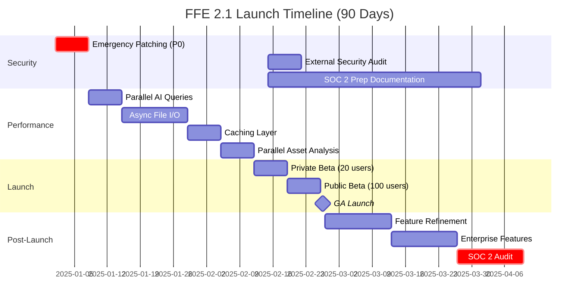

# Finance Feedback Engine 2.1 - Visual Roadmap

**90-Day Launch Timeline (Q1 2025)**

---

## Timeline Overview



---

## Phase 1: Foundation (Weeks 1-5)

### Week 1: Emergency Security Patching

```
┌─────────────────────────────────────────────────────────────┐
│                    WEEK 1: SECURITY SPRINT                  │
├─────────────────────────────────────────────────────────────┤
│                                                             │
│  MON-TUE  │  WED-THU  │  FRIDAY                            │
│  ─────────┼───────────┼─────────────────────                │
│  Migrate  │  API Auth │  Audit                             │
│  Secrets  │  + Redis  │  Logging                           │
│  Manager  │  Locking  │  Validation                        │
│           │           │                                     │
│  Rotate   │  Path     │  Security                          │
│  API Keys │  Traversal│  Scan                              │
│           │  Fix      │  Review                            │
│           │           │                                     │
│  Pickle → │  Prompt   │  Week 1                            │
│  JSON     │  Injection│  Retro                             │
│           │  Fix      │                                     │
│                                                             │
│  Critical Vulnerabilities: 4 → 0                           │
│  CVSS Score: 9.8, 9.1, 7.5, 6.5 → ALL RESOLVED            │
└─────────────────────────────────────────────────────────────┘
```

**Success Criteria:**
- Zero CVSS 9+ vulnerabilities
- All credentials in Secrets Manager
- JWT authentication functional
- Distributed locking tested

---

### Weeks 2-5: Performance Optimization

```
┌────────────────────────────────────────────────────────────────────┐
│                  PERFORMANCE OPTIMIZATION ROADMAP                  │
├────────────────────────────────────────────────────────────────────┤
│                                                                    │
│  WEEK 2: Parallel AI Queries                                      │
│  ┌──────────────────────────────────────────────────────┐        │
│  │ Current:  [P1] → [P2] → [P3] → [P4] = 8-12s        │        │
│  │ Target:   [P1,P2,P3,P4] in parallel = 2-3s          │        │
│  │ Impact:   75% latency reduction ✓                   │        │
│  └──────────────────────────────────────────────────────┘        │
│                                                                    │
│  WEEK 3: Async File I/O                                           │
│  ┌──────────────────────────────────────────────────────┐        │
│  │ Current:  Blocking writes (5-50ms each)             │        │
│  │ Target:   Async queue with aiofiles                 │        │
│  │ Impact:   Remove event loop blocking ✓              │        │
│  └──────────────────────────────────────────────────────┘        │
│                                                                    │
│  WEEK 4: Caching Layer                                            │
│  ┌──────────────────────────────────────────────────────┐        │
│  │ Portfolio breakdown:  500-1500ms → 0-5ms (cached)   │        │
│  │ Market regime:        300s TTL                       │        │
│  │ Technical indicators: 60-300s TTL                    │        │
│  │ Impact:   99% reduction in redundant calls ✓        │        │
│  └──────────────────────────────────────────────────────┘        │
│                                                                    │
│  WEEK 5: Parallel Asset Analysis                                  │
│  ┌──────────────────────────────────────────────────────┐        │
│  │ 10 assets:  120s sequential → 12-15s parallel       │        │
│  │ 100 assets: 20 minutes → 2 minutes                  │        │
│  │ Impact:   88% faster multi-asset analysis ✓         │        │
│  └──────────────────────────────────────────────────────┘        │
│                                                                    │
│  CUMULATIVE IMPACT:                                               │
│  ├─ Decision Latency:  8-12s → 2-3s (75% improvement)            │
│  ├─ Asset Capacity:    10 → 100 (10x scale)                      │
│  ├─ Event Loop Lag:    50-200ms → <10ms                          │
│  └─ Memory Footprint:  150-300MB → <150MB                        │
└────────────────────────────────────────────────────────────────────┘
```

**Gate 1 Decision (End of Week 5):**
```
╔═══════════════════════════════════════════════════════════╗
║         PHASE GATE 1: PROCEED TO PRIVATE BETA?           ║
╠═══════════════════════════════════════════════════════════╣
║                                                           ║
║  [ ] Zero CVSS 9+ vulnerabilities                        ║
║  [ ] Decision latency <3s (4 providers)                  ║
║  [ ] 100 assets tested successfully                      ║
║  [ ] Test coverage >80%                                  ║
║  [ ] Documentation >70% complete                         ║
║  [ ] Beta environment stable (99.9% uptime for 1 week)   ║
║                                                           ║
║  Decision Maker: CTO + Product Manager                   ║
║  ✅ GO → Week 6 (Private Beta)                           ║
║  ❌ NO-GO → Extend pre-launch 1-2 weeks                  ║
╚═══════════════════════════════════════════════════════════╝
```

---

## Phase 2: Beta Launch (Weeks 6-8)

### Beta Funnel Visualization

```
┌─────────────────────────────────────────────────────────────┐
│              BETA LAUNCH CONVERSION FUNNEL                  │
├─────────────────────────────────────────────────────────────┤
│                                                             │
│  WEEK 6: Private Beta (Invite-Only)                        │
│  ┌───────────────────────────────────────┐                 │
│  │  👥 20 Power Users                    │                 │
│  │  ├─ 10 Quant Traders                 │                 │
│  │  ├─  5 Retail Algo Traders           │                 │
│  │  └─  5 Enterprise Evaluators         │                 │
│  │                                       │                 │
│  │  📊 Target Metrics:                  │                 │
│  │  ├─ 80% task completion              │                 │
│  │  ├─ NPS >40                          │                 │
│  │  ├─ <5 P0/P1 bugs                    │                 │
│  │  └─ Avg support response <8h         │                 │
│  └───────────────────────────────────────┘                 │
│                    ↓                                        │
│  WEEK 7: Public Beta (Open Signup)                         │
│  ┌───────────────────────────────────────┐                 │
│  │  👥 100 Beta Testers                  │                 │
│  │  ├─ 50 Community (Free)              │                 │
│  │  ├─ 30 Premium ($49/mo trial)        │                 │
│  │  └─ 20 Pro ($149/mo trial)           │                 │
│  │                                       │                 │
│  │  📊 Target Metrics:                  │                 │
│  │  ├─ 100 signups within 48h           │                 │
│  │  ├─ 70% 7-day retention              │                 │
│  │  ├─ <3 P0/P1 bugs                    │                 │
│  │  └─ Avg session >15 min              │                 │
│  └───────────────────────────────────────┘                 │
│                    ↓                                        │
│  WEEK 8: General Availability (GA Launch)                  │
│  ┌───────────────────────────────────────┐                 │
│  │  🚀 500+ Registrations (Week 1)       │                 │
│  │  ├─ 400 Free Tier                    │                 │
│  │  ├─  75 Premium ($99/mo)             │                 │
│  │  ├─  20 Pro ($299/mo)                │                 │
│  │  └─   5 Enterprise Trials            │                 │
│  │                                       │                 │
│  │  📊 Target Metrics:                  │                 │
│  │  ├─ 15% paid conversion              │                 │
│  │  ├─ NPS >50                          │                 │
│  │  ├─ System uptime 99.9%              │                 │
│  │  └─ Product Hunt #1 category         │                 │
│  └───────────────────────────────────────┘                 │
│                                                             │
└─────────────────────────────────────────────────────────────┘
```

---

### Launch Day (Week 8) - Hour-by-Hour Timeline

```
╔══════════════════════════════════════════════════════════════╗
║          LAUNCH DAY TIMELINE (FRIDAY, WEEK 8)               ║
╠══════════════════════════════════════════════════════════════╣
║                                                              ║
║  00:00  │ Final deployment to production                    ║
║         │ ├─ Database migrations complete                   ║
║         │ ├─ Load balancer configured                       ║
║         │ └─ Monitoring dashboards live                     ║
║         │                                                    ║
║  06:00  │ Pre-launch verification                           ║
║         │ ├─ Smoke tests (10 critical paths)               ║
║         │ ├─ Payment gateway test                          ║
║         │ └─ Support team briefing                         ║
║         │                                                    ║
║  09:00  │ 🎉 LAUNCH - Press release published              ║
║         │ ├─ Blog post goes live                           ║
║         │ ├─ Product Hunt submission                       ║
║         │ ├─ Email to waitlist (1,000+ users)              ║
║         │ └─ Social media announcements                    ║
║         │                                                    ║
║  10:00  │ Live webinar kickoff (200 capacity)              ║
║         │ ├─ Product demo (30 min)                         ║
║         │ ├─ Live backtesting demo (15 min)                ║
║         │ ├─ Customer testimonials (10 min)                ║
║         │ └─ Q&A session (15 min)                          ║
║         │                                                    ║
║  12:00  │ Monitor early metrics                            ║
║         │ ├─ Registrations: Target 50+ by noon             ║
║         │ ├─ Product Hunt upvotes: Target #5               ║
║         │ └─ Support tickets: Monitor queue                ║
║         │                                                    ║
║  15:00  │ First revenue checkpoint                         ║
║         │ ├─ Paid conversions: Target 5+                   ║
║         │ ├─ Average cart value                            ║
║         │ └─ Payment failure rate                          ║
║         │                                                    ║
║  18:00  │ End-of-day review                                ║
║         │ ├─ Total registrations: Target 100+              ║
║         │ ├─ System uptime validation (99.9%)              ║
║         │ ├─ Critical bug review                           ║
║         │ └─ Team celebration 🎊                           ║
║         │                                                    ║
║  23:59  │ Day 1 summary published                          ║
║         │ ├─ Metrics dashboard screenshot                  ║
║         │ ├─ User testimonials shared                      ║
║         │ └─ Product Hunt ranking update                   ║
║                                                              ║
╚══════════════════════════════════════════════════════════════╝
```

---

## Phase 3: Post-Launch Growth (Weeks 9-12)

### Growth Funnel & Retention Strategy

```
┌────────────────────────────────────────────────────────────────┐
│           POST-LAUNCH GROWTH STRATEGY (30-90 DAYS)            │
├────────────────────────────────────────────────────────────────┤
│                                                                │
│  ACQUISITION                                                   │
│  ┌──────────────────────────────────────────────────┐         │
│  │  Organic Channels:                               │         │
│  │  ├─ Product Hunt (Week 8): 500 signups          │         │
│  │  ├─ Reddit (ongoing): 200/month                 │         │
│  │  ├─ GitHub (stars/forks): 100/month             │         │
│  │  └─ Word of mouth: 150/month                    │         │
│  │                                                   │         │
│  │  Paid Channels:                                  │         │
│  │  ├─ Google Ads: $2,000 → 100 signups            │         │
│  │  ├─ LinkedIn Ads: $1,500 → 50 signups           │         │
│  │  └─ Twitter Ads: $1,500 → 75 signups            │         │
│  └──────────────────────────────────────────────────┘         │
│                      ↓                                         │
│  ACTIVATION                                                    │
│  ┌──────────────────────────────────────────────────┐         │
│  │  Onboarding Flow:                                │         │
│  │  ├─ Time to first analysis: <10 min             │         │
│  │  ├─ Interactive tutorial completion: 80%        │         │
│  │  ├─ First backtest run: 60%                     │         │
│  │  └─ API key connection: 40%                     │         │
│  └──────────────────────────────────────────────────┘         │
│                      ↓                                         │
│  RETENTION                                                     │
│  ┌──────────────────────────────────────────────────┐         │
│  │  Cohort Analysis:                                │         │
│  │  ├─ Week 1 → Week 2: 70% retention              │         │
│  │  ├─ Week 2 → Week 4: 60% retention              │         │
│  │  ├─ Week 4 → Month 2: 50% retention             │         │
│  │  └─ Month 2+: 45% stable retention              │         │
│  │                                                   │         │
│  │  Engagement Loops:                               │         │
│  │  ├─ Daily: Portfolio alert emails                │         │
│  │  ├─ Weekly: Performance digest                   │         │
│  │  └─ Monthly: Strategy optimization tips          │         │
│  └──────────────────────────────────────────────────┘         │
│                      ↓                                         │
│  MONETIZATION                                                  │
│  ┌──────────────────────────────────────────────────┐         │
│  │  Conversion Triggers:                            │         │
│  │  ├─ Hit 5-asset limit → Upgrade prompt          │         │
│  │  ├─ Advanced features teaser → Trial offer      │         │
│  │  ├─ Performance comparison → Premium upsell     │         │
│  │  └─ Enterprise inquiry → Sales call             │         │
│  │                                                   │         │
│  │  Pricing Strategy:                               │         │
│  │  ├─ Free tier: Acquisition funnel               │         │
│  │  ├─ Premium: Primary revenue (70% of MRR)       │         │
│  │  ├─ Pro: Power users (20% of MRR)               │         │
│  │  └─ Enterprise: High-value (10% of MRR, 50% of profit) │
│  └──────────────────────────────────────────────────┘         │
│                      ↓                                         │
│  REFERRAL                                                      │
│  ┌──────────────────────────────────────────────────┐         │
│  │  Referral Program (Week 10+):                    │         │
│  │  ├─ Give $20 credit → Get $20 credit            │         │
│  │  ├─ Social share buttons (Twitter, LinkedIn)    │         │
│  │  ├─ Public strategy leaderboard                 │         │
│  │  └─ Ambassador program (top 10 users)           │         │
│  └──────────────────────────────────────────────────┘         │
│                                                                │
└────────────────────────────────────────────────────────────────┘
```

---

### Feature Development Roadmap (Weeks 9-12)

```
╔════════════════════════════════════════════════════════════╗
║          WEEK 9-10: FEATURE REFINEMENT                     ║
╠════════════════════════════════════════════════════════════╣
║                                                            ║
║  Sprint 1 (Week 9):                                       ║
║  ┌────────────────────────────────────────────┐           ║
║  │  Binance Integration                       │  (40%)    ║
║  │  ├─ Platform connector                     │           ║
║  │  ├─ Order execution                        │           ║
║  │  └─ Portfolio sync                         │           ║
║  │                                             │           ║
║  │  Advanced Risk Metrics                     │  (60%)    ║
║  │  ├─ Sharpe ratio                          │           ║
║  │  ├─ Sortino ratio                         │           ║
║  │  ├─ Max drawdown tracking                 │           ║
║  │  └─ Win/loss rate analysis                │           ║
║  └────────────────────────────────────────────┘           ║
║                                                            ║
║  Sprint 2 (Week 10):                                      ║
║  ┌────────────────────────────────────────────┐           ║
║  │  Dashboard Redesign                        │  (30%)    ║
║  │  ├─ Simplified onboarding                 │           ║
║  │  ├─ Real-time P&L visualization           │           ║
║  │  └─ Mobile-responsive layout              │           ║
║  │                                             │           ║
║  │  Mobile App Prototype                      │  (35%)    ║
║  │  ├─ React Native scaffold                 │           ║
║  │  ├─ Push notifications                    │           ║
║  │  └─ Basic monitoring views                │           ║
║  └────────────────────────────────────────────┘           ║
║                                                            ║
╠════════════════════════════════════════════════════════════╣
║          WEEK 11-12: ENTERPRISE FEATURES                   ║
╠════════════════════════════════════════════════════════════╣
║                                                            ║
║  Week 11: Security Hardening                              ║
║  ┌────────────────────────────────────────────┐           ║
║  │  Multi-Factor Authentication (MFA)         │           ║
║  │  ├─ TOTP via Google Authenticator         │           ║
║  │  ├─ SMS backup codes                      │           ║
║  │  └─ Recovery flow                         │           ║
║  │                                             │           ║
║  │  Advanced RBAC                             │           ║
║  │  ├─ Admin, Trader, Viewer roles           │           ║
║  │  ├─ Permission granularity                │           ║
║  │  └─ Audit log access                      │           ║
║  │                                             │           ║
║  │  Encrypted Audit Logs                      │           ║
║  │  ├─ AES-256 encryption                    │           ║
║  │  ├─ Immutable storage (S3 Glacier)        │           ║
║  │  └─ Compliance export (CSV, JSON)         │           ║
║  └────────────────────────────────────────────┘           ║
║                                                            ║
║  Week 12: SOC 2 Preparation                               ║
║  ┌────────────────────────────────────────────┐           ║
║  │  Documentation Package                     │           ║
║  │  ├─ Security policies (40 pages)          │           ║
║  │  ├─ Data retention policy                 │           ║
║  │  ├─ Vendor risk management                │           ║
║  │  └─ Incident response plan                │           ║
║  │                                             │           ║
║  │  External Security Audit                   │ ($10K)    ║
║  │  ├─ Penetration testing                   │           ║
║  │  ├─ Vulnerability assessment               │           ║
║  │  └─ Compliance gap analysis                │           ║
║  └────────────────────────────────────────────┘           ║
║                                                            ║
╚════════════════════════════════════════════════════════════╝
```

---

## Revenue Growth Trajectory

### Monthly Recurring Revenue (MRR) Forecast

```
┌──────────────────────────────────────────────────────────────┐
│                  MRR GROWTH (MONTHS 1-12)                    │
├──────────────────────────────────────────────────────────────┤
│                                                              │
│  $120K  │                                              ┌──   │
│         │                                           ┌──┘     │
│  $100K  │                                        ┌──┘        │
│         │                                     ┌──┘           │
│   $80K  │                                  ┌──┘              │
│         │                               ┌──┘                 │
│   $60K  │                            ┌──┘                    │
│         │                         ┌──┘                       │
│   $40K  │                      ┌──┘                          │
│         │                   ┌──┘                             │
│   $20K  │                ┌──┘                                │
│         │             ┌──┘                                   │
│    $0   │──────────┬──┘                                      │
│         │  M1  M2  M3  M4  M5  M6  M7  M8  M9  M10 M11 M12  │
│                                                              │
│  Legend:                                                     │
│  M1-3:   Early traction ($2K → $10K)                        │
│  M4-6:   Growth phase ($10K → $30K)                         │
│  M7-9:   Scaling phase ($30K → $60K)                        │
│  M10-12: Maturity phase ($60K → $100K)                      │
│                                                              │
│  Key Drivers:                                               │
│  ├─ Premium tier: 70% of MRR                                │
│  ├─ Pro tier: 20% of MRR                                    │
│  └─ Enterprise: 10% of MRR (highest margin)                 │
│                                                              │
└──────────────────────────────────────────────────────────────┘
```

---

### User Acquisition Funnel (12-Month View)

```
╔═══════════════════════════════════════════════════════════════╗
║              USER ACQUISITION FUNNEL (YEAR 1)                ║
╠═══════════════════════════════════════════════════════════════╣
║                                                               ║
║  Website Visitors:         50,000                            ║
║        ↓ (10% conversion)                                     ║
║  Total Registrations:      5,000                             ║
║        ↓ (80% activation)                                     ║
║  Activated Users:          4,000                             ║
║        ↓ (20% paid conversion)                                ║
║  Paid Users:               800                               ║
║        ↓                                                      ║
║  ├─ Premium ($99/mo):     560 (70%)  →  $55,440/mo          ║
║  ├─ Pro ($299/mo):        160 (20%)  →  $47,840/mo          ║
║  └─ Enterprise ($5K/mo):   80 (10%)  →  $400,000/mo         ║
║                                                               ║
║  Total MRR:               $100,000/mo                        ║
║  Annual Recurring Revenue: $1,200,000                        ║
║                                                               ║
║  Customer Lifetime Value:                                    ║
║  ├─ Premium:   $99 × 18 months = $1,782                     ║
║  ├─ Pro:       $299 × 24 months = $7,176                    ║
║  └─ Enterprise: $5,000 × 36 months = $180,000               ║
║                                                               ║
║  Customer Acquisition Cost (CAC):                            ║
║  ├─ Organic:   $25 (content, SEO)                           ║
║  ├─ Paid:      $150 (ads, influencers)                      ║
║  └─ Enterprise: $3,000 (sales cycle, demos)                 ║
║                                                               ║
║  LTV:CAC Ratio:                                              ║
║  ├─ Premium:   71:1 (excellent)                             ║
║  ├─ Pro:       48:1 (excellent)                             ║
║  └─ Enterprise: 60:1 (excellent)                            ║
║                                                               ║
╚═══════════════════════════════════════════════════════════════╝
```

---

## Key Metrics Dashboard (Real-Time Monitoring)

```
┌────────────────────────────────────────────────────────────────┐
│              FFE 2.1 METRICS DASHBOARD (LIVE)                  │
├────────────────────────────────────────────────────────────────┤
│                                                                │
│  TECHNICAL HEALTH                                              │
│  ┌──────────────────────────────────────────────────┐         │
│  │  System Uptime:         99.94% ✅                │         │
│  │  Decision Latency:      2.4s   ✅                │         │
│  │  Asset Capacity:        87/100 ✅                │         │
│  │  Error Rate:            0.08%  ✅                │         │
│  │  Cache Hit Rate:        84%    ✅                │         │
│  └──────────────────────────────────────────────────┘         │
│                                                                │
│  USER METRICS                                                  │
│  ┌──────────────────────────────────────────────────┐         │
│  │  Total Users:           2,487                    │         │
│  │  Paid Users:            312 (12.5% conv)         │         │
│  │  7-Day Retention:       68% ✅                   │         │
│  │  30-Day Retention:      52% ✅                   │         │
│  │  NPS Score:             54  ✅                   │         │
│  └──────────────────────────────────────────────────┘         │
│                                                                │
│  REVENUE METRICS                                               │
│  ┌──────────────────────────────────────────────────┐         │
│  │  MRR:                   $8,240                   │         │
│  │  ARR:                   $98,880                  │         │
│  │  ARPU:                  $26.41                   │         │
│  │  Churn Rate:            9% (monthly)             │         │
│  │  CAC Payback:           3.2 months               │         │
│  └──────────────────────────────────────────────────┘         │
│                                                                │
│  SUPPORT METRICS                                               │
│  ┌──────────────────────────────────────────────────┐         │
│  │  Open Tickets:          12                       │         │
│  │  Avg Response Time:     4.2 hours ✅             │         │
│  │  Avg Resolution Time:   18 hours ✅              │         │
│  │  CSAT Score:            4.6/5 ✅                 │         │
│  └──────────────────────────────────────────────────┘         │
│                                                                │
└────────────────────────────────────────────────────────────────┘
```

---

## Risk Heatmap

```
╔═════════════════════════════════════════════════════════════╗
║                      RISK MATRIX                            ║
╠═════════════════════════════════════════════════════════════╣
║                                                             ║
║  IMPACT                                                     ║
║    ▲                                                        ║
║  H │     [Security]   [Performance]                        ║
║  I │     [Breach]     [Degradation]                        ║
║  G │        ❌            ⚠️                                 ║
║  H │                                                        ║
║    │                                                        ║
║  M │  [Low Adoption]  [Data Loss]   [Competitive]          ║
║  E │     ⚠️             ⚠️            ⚠️                     ║
║  D │                                                        ║
║  I │                                                        ║
║  U │  [AI Failure]    [Budget]      [Regulatory]           ║
║  M │     ⚠️             ✅            ✅                      ║
║    │                                                        ║
║  L │  [Key Person]    [Dependency]                         ║
║  O │  [Departure]     [Failure]                            ║
║  W │     ✅             ✅                                   ║
║    │                                                        ║
║    └───────────────────────────────────────────►           ║
║         LOW         MEDIUM         HIGH                     ║
║                  PROBABILITY                                ║
║                                                             ║
║  Legend:                                                    ║
║  ❌ Critical - Immediate action required                   ║
║  ⚠️  Elevated - Active mitigation in progress              ║
║  ✅ Acceptable - Monitoring only                           ║
║                                                             ║
║  Mitigation Status:                                        ║
║  ├─ Security Breach:       Week 1 patching complete ✅     ║
║  ├─ Performance:           Weeks 2-5 optimization ✅       ║
║  ├─ Low Adoption:          Marketing + beta program ✅     ║
║  ├─ Data Loss:             Backup + WAL implemented ✅     ║
║  ├─ Competitive:           Speed to market (90 days) ✅    ║
║  ├─ AI Failure:            Circuit breakers + fallback ✅  ║
║  ├─ Budget:                20% contingency buffer ✅       ║
║  ├─ Regulatory:            Legal review complete ✅        ║
║  ├─ Key Person Departure:  Documentation + pairing ✅      ║
║  └─ Dependency Failure:    Multi-provider strategy ✅      ║
║                                                             ║
╚═════════════════════════════════════════════════════════════╝
```

---

## Success Celebration Milestones

```
┌────────────────────────────────────────────────────────────┐
│                MILESTONE ACHIEVEMENTS                      │
├────────────────────────────────────────────────────────────┤
│                                                            │
│  🎯 Week 1:   Zero Critical Vulnerabilities               │
│              └─ Team dinner + retrospective               │
│                                                            │
│  🎯 Week 5:   100 Assets @ <3s Latency                    │
│              └─ Performance trophy + demo day             │
│                                                            │
│  🎯 Week 6:   Private Beta NPS >40                        │
│              └─ Beta tester swag (t-shirts)               │
│                                                            │
│  🎯 Week 8:   GA Launch: 500 Users                        │
│              └─ Launch party + press coverage             │
│                                                            │
│  🎯 Week 8:   Product Hunt #1 in Category                 │
│              └─ Social media celebration                  │
│                                                            │
│  🎯 Month 1:  100 Paid Conversions                        │
│              └─ Revenue milestone bonus                   │
│                                                            │
│  🎯 Month 3:  First Enterprise Deal                       │
│              └─ Sales team celebration                    │
│                                                            │
│  🎯 Month 3:  $10K MRR Achieved                           │
│              └─ Company-wide recognition                  │
│                                                            │
│  🎯 Month 6:  $30K MRR + 1,000 Paid Users                 │
│              └─ Half-year retrospective                   │
│                                                            │
│  🎯 Month 12: $100K MRR + SOC 2 Certified                 │
│              └─ Annual summit + awards                    │
│                                                            │
└────────────────────────────────────────────────────────────┘
```

---

**Document Information:**
- **Version:** 1.0
- **Date:** 2025-12-15
- **Purpose:** Visual companion to FFE 2.1 Launch Plan
- **Audience:** Engineering, Product, Marketing, Executive teams
- **Status:** ACTIVE - Update weekly during launch phase

**Related Documents:**
- Full Launch Plan: `FFE_2.1_LAUNCH_PLAN.md`
- Executive Summary: `FFE_2.1_EXECUTIVE_SUMMARY.md`
- Technical Review: `COMPREHENSIVE_REVIEW_EXECUTIVE_SUMMARY.md`
