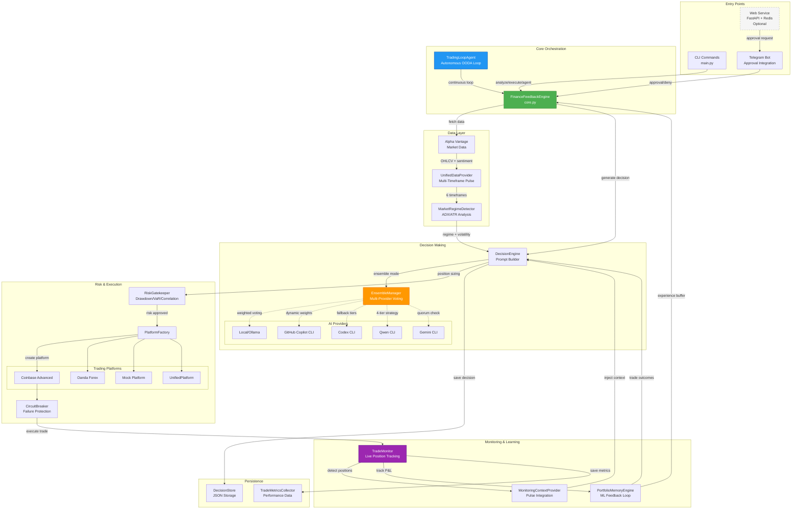

# Finance Feedback Engine

The Finance Feedback Engine is a Python-based tool designed to provide validation and feedback for financial data processing, particularly for applications interacting with market data APIs like Alpha Vantage.

This project currently offers a set of utility functions for standardizing inputs and validating data quality.

## Features

The Finance Feedback Engine 2.0 is a comprehensive AI-powered trading decision tool that uses real-time market data to generate trading signals. It offers a wide array of features including multi-timeframe technical analysis, autonomous trading capabilities, robust ensemble AI integration, and real-time portfolio tracking across multiple platforms.

For a detailed overview of all features, their functionality, architecture, and usage, please refer to the [Features Documentation](docs/features/README.md).

## 🏗️ Architecture

The Finance Feedback Engine 2.0 is built with a modular, scalable architecture designed for real-time trading decisions, backtesting, and performance analysis. The system is composed of several key components, each with a specific responsibility.

For a comprehensive overview of the project's architecture, including detailed component breakdowns, class hierarchies, and technical designs, please refer to the [Architecture Documentation](docs/architecture/README.md).

**Data Flow Summary:**
1. **Analysis Request** → CLI/Agent invokes `FinanceFeedbackEngine.analyze_asset()`
2. **Data Gathering** → Alpha Vantage provides multi-timeframe market data + sentiment
3. **Regime Detection** → ADX/ATR classifies market conditions (trending/ranging/volatile)
4. **Decision Generation** → AI providers analyze context, ensemble aggregates recommendations
5. **Risk Validation** → RiskGatekeeper checks drawdown, VaR, position concentration
6. **Execution** → Platform factory routes to Coinbase/Oanda/Mock with circuit breaker protection
7. **Monitoring** → TradeMonitor detects positions, tracks real-time P&L
8. **Learning** → Completed trades feed PortfolioMemoryEngine for continuous improvement

**New in 2.0:** Optional web service layer enables mobile approvals via Telegram bot. This is **completely optional** - all core features work in CLI-only mode. For more details, see the [Guides and Quick Starts](docs/guides/README.md).
