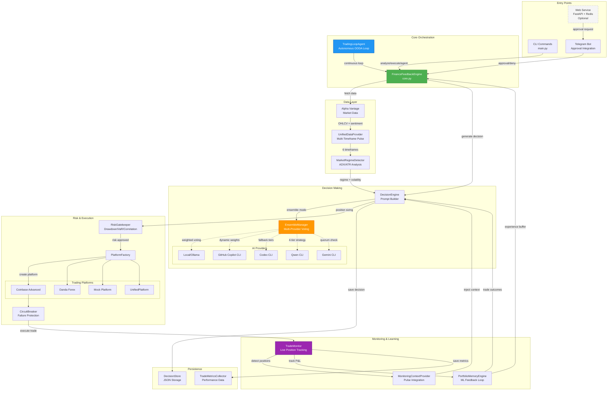
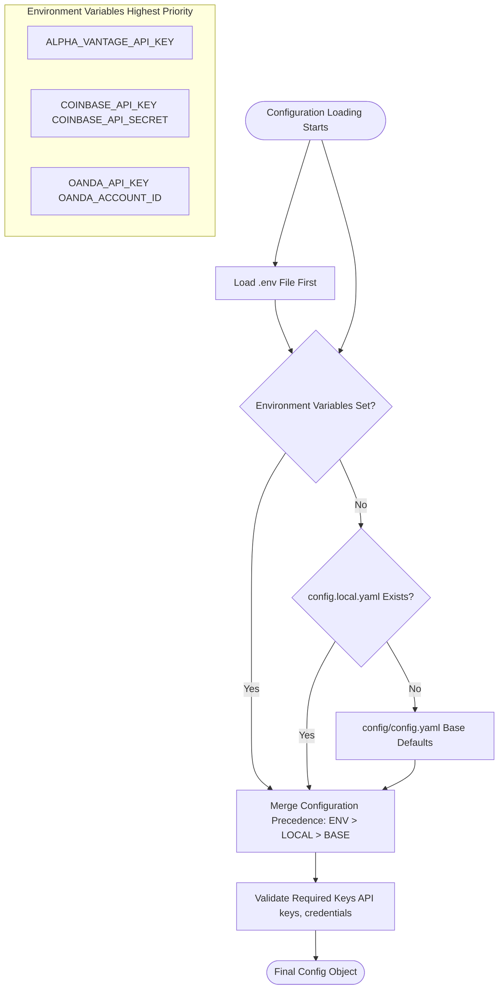
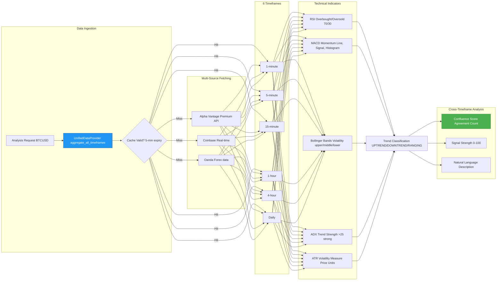
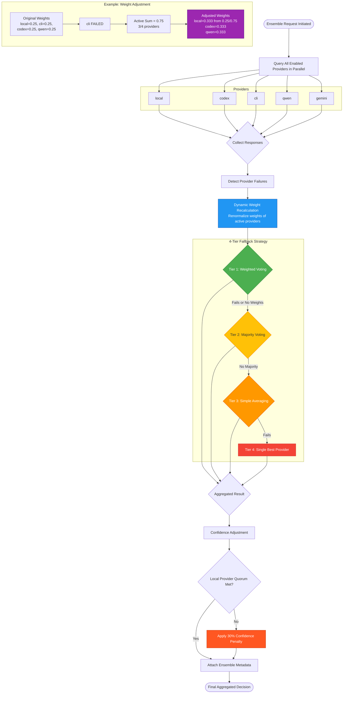
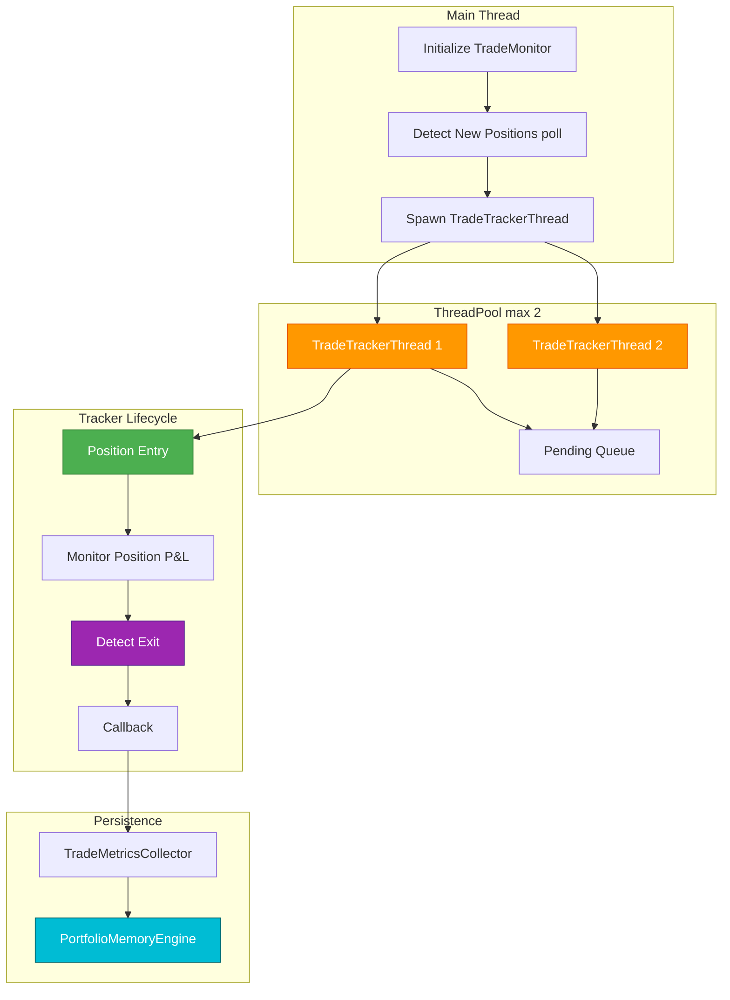
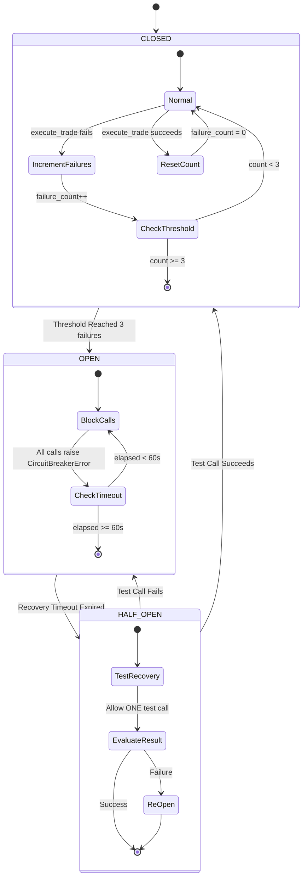

# Finance Feedback Engine

[](https://github.com/Three-Rivers-Tech/finance_feedback_engine-2.0)
[](https://github.com/Three-Rivers-Tech/finance_feedback_engine-2.0)
[](https://github.com/Three-Rivers-Tech/finance_feedback_engine/actions/workflows/ci.yml)
[](https://github.com/Three-Rivers-Tech/finance_feedback_engine/actions/workflows/staging.yml)
[](https://www.python.org/downloads/)

The Finance Feedback Engine is a Python-based tool designed to provide validation and feedback for financial data processing, particularly for applications interacting with market data APIs like Alpha Vantage.

This project currently offers a set of utility functions for standardizing inputs and validating data quality.

## Features

The Finance Feedback Engine 2.0 is a comprehensive AI-powered trading decision tool that uses real-time market data to generate trading signals. It offers a wide array of features including multi-timeframe technical analysis, autonomous trading capabilities, robust ensemble AI integration, and real-time portfolio tracking across multiple platforms.

For a detailed overview of all features, their functionality, architecture, and usage, please refer to the [Features Documentation](docs/features/README.md).

## 🏗️ Architecture

The Finance Feedback Engine 2.0 is built with a modular, scalable architecture designed for real-time trading decisions, backtesting, and performance analysis. The system is composed of several key components, each with a specific responsibility.

For a comprehensive overview of the project's architecture, including detailed component breakdowns, class hierarchies, and technical designs, please refer to the [Architecture Documentation](docs/architecture/README.md).



**Data Flow Summary:**
1. **Analysis Request** → CLI/Agent invokes `FinanceFeedbackEngine.analyze_asset()`
2. **Data Gathering** → Alpha Vantage provides multi-timeframe market data + sentiment
3. **Regime Detection** → ADX/ATR classifies market conditions (trending/ranging/volatile)
4. **Decision Generation** → AI providers analyze context, ensemble aggregates recommendations
5. **Risk Validation** → RiskGatekeeper checks drawdown, VaR, position concentration
6. **Execution** → Platform factory routes to Coinbase/Oanda/Mock with circuit breaker protection
7. **Monitoring** → TradeMonitor detects positions, tracks real-time P&L
8. **Learning** → Completed trades feed PortfolioMemoryEngine for continuous improvement

**New in 2.0:** Optional web service layer enables mobile approvals via Telegram bot. This is **completely optional** - all core features work in CLI-only mode. For more details, see the [Guides and Quick Starts](docs/guides/README.md).

## 📋 Requirements

### Core Requirements
- Python 3.10+
- Alpha Vantage API key (premium recommended)
- Trading platform credentials (Coinbase, Oanda, etc.)

**Sentiment Source:** News sentiment uses Alpha Vantage `NEWS_SENTIMENT`; no Twitter or on-chain dependencies are required.

### Optional Web Service (Telegram Approvals) 🆕
- Redis 5.x+ (auto-setup available)
- Telegram bot token (from @BotFather)
- HTTPS domain (production) or ngrok (development)

**Note:** Web service is **optional** - CLI mode works independently. See [Web Service Migration Guide](docs/WEB_SERVICE_MIGRATION.md) for details.

## 🔧 Installation

### 1. Clone the repository

```bash
git clone https://github.com/Three-Rivers-Tech/finance_feedback_engine-2.0.git
cd finance_feedback_engine-2.0
```

### 2. Install dependencies (pyproject is the source of truth)

- Runtime: `pip install .`
- Dev/Test: `pip install ".[dev]"`
- Data pipeline (optional): `pip install ".[pipeline]"`

**Note on Technical Indicators (pandas-ta):**
The multi-timeframe pulse system uses **pandas-ta** for technical analysis:
- ✅ **Pure Python** - No compilation required (unlike TA-Lib)
- ✅ **Python 3.13 Compatible** - Works with latest Python versions
- ✅ **No System Dependencies** - No need for C libraries or build tools
- ✅ **Easy Deployment** - Simpler installation on cloud/Docker

`pip install .` will pull the correct pandas-ta variant for your Python version automatically.

Or install in development mode:

```bash
pip install -e .
```

### 3. Set up Git hooks (for contributors)

**Quick Setup:**
```bash
./scripts/setup-hooks.sh
```

This installs pre-commit hooks that automatically check code quality, prevent secrets from being committed, and enforce test coverage before each commit.

**What's included:**
- Code formatting (black, isort)
- Linting (flake8, mypy)
- Security scanning (bandit, secret detection)
- Test coverage enforcement (≥70%)

**Manual setup:**
```bash
pip install pre-commit
pre-commit install
```

For more details, see [Pre-commit Configuration Guide](docs/PRE_COMMIT_GUIDE.md).

**Note:** This step is optional for users who only want to run the engine, but **required for contributors**.

### 4. Configure the engine

**Quick Setup (Recommended):**
```bash
# Copy .env template and fill in your API keys
cp .env.example .env
nano .env  # or vim, code, etc.
```

The `.env` file is now the **single source of truth** for all configuration. Edit it with your:

**Alternative:** For advanced users, you can create `config/config.local.yaml` with environment variable references:
```bash
cp config/config.yaml config/config.local.yaml
```

### Configuration Loading Hierarchy

**Precedence:** Environment Variables (`.env`) > `config.local.yaml` > `config/config.yaml` (defaults)



### Multi-Timeframe Technical Analysis 🆕

The engine analyzes **6 timeframes simultaneously** to detect cross-timeframe patterns and confluence:

**Timeframes:** 1-min, 5-min, 15-min, 1-hour, 4-hour, daily



**Indicators:** RSI, MACD, Bollinger Bands, ADX, ATR (per timeframe)

**Features:**
- **Confluence Detection**: Identifies when multiple timeframes agree on direction
- **Regime-Aware**: Different strategies for trending vs. ranging markets
- **Volatility Context**: ATR provides risk-adjusted position sizing inputs
- **Reduced False Signals**: Cross-timeframe validation filters noise
- **LLM-Optimized**: Natural language summaries for better AI comprehension

**Pulse System Benefits:**
- **Confluence Detection**: Identifies when multiple timeframes agree on direction
- **Regime-Aware**: Different strategies for trending vs. ranging markets
- **Volatility Context**: ATR provides risk-adjusted position sizing inputs
- **Reduced False Signals**: Cross-timeframe validation filters noise
- **LLM-Optimized**: Natural language summaries for better AI comprehension

See [MULTI_TIMEFRAME_PULSE_COMPLETE.md](MULTI_TIMEFRAME_PULSE_COMPLETE.md) for implementation details.
### Ensemble Mode: Multi-Provider AI Aggregation 🆕

Combine multiple AI providers for more robust decisions with intelligent fallback strategies:

```bash
# Analyze with ensemble mode (combines all providers)
python main.py analyze BTCUSD --provider ensemble
```

#### Ensemble Decision Aggregation Flow



**Features:**
- **Intelligent Voting**: Combines decisions from multiple AI providers using weighted voting (Tier 1)
- **Dynamic Weight Adjustment**: Automatically renormalizes weights when providers fail
- **4-Tier Fallback**: Progressive degradation (weighted → majority → averaging → single provider)
- **Resilient**: Continues working even when most providers are unavailable
- **Transparent**: Full metadata shows which providers succeeded/failed and how weights were adjusted
- **Quorum Protection**: Requires minimum 3 local providers; applies 30% confidence penalty if not met

**Example metadata when one provider fails:**
```json
{
  "ensemble_metadata": {
    "providers_used": ["local", "codex", "qwen"],
    "providers_failed": ["gemini"],
    "adjusted_weights": {"local": 0.333, "codex": 0.333, "qwen": 0.333},
    "fallback_tier": 1,
    "quorum_penalty_applied": false
  }
}
```

See [docs/DYNAMIC_WEIGHT_ADJUSTMENT.md](docs/DYNAMIC_WEIGHT_ADJUSTMENT.md) and [docs/ENSEMBLE_FALLBACK_SYSTEM.md](docs/ENSEMBLE_FALLBACK_SYSTEM.md) for complete details.

### AI Provider Options

The engine supports five AI providers:

1. **Ensemble** (`--provider ensemble`): Combines multiple providers with weighted voting 🆕
   - Automatically handles provider failures
   - Configurable weights and voting strategies
   - Best for production use with high reliability

2. **Codex CLI** (`--provider codex`): Uses the local Codex CLI tool (no API charges)
  - Install: `npm install -g @openai/codex` or from https://github.com/openai/codex
   - Runs locally without token costs

3. **GitHub Copilot CLI** (`--provider cli`): Uses GitHub Copilot CLI
  - Install: Follow [Copilot CLI setup](https://docs.github.com/en/copilot/how-tos/set-up/install-copilot-cli)
   - Requires GitHub Copilot subscription

4. **Qwen CLI** (`--provider qwen`): Uses free Qwen CLI tool
   - Install: Requires Node.js v20+ and OAuth authentication
   - Command: `qwen`
   - Free to use

5. **Gemini CLI** (`--provider gemini`): Uses free Google Gemini CLI
   - Install: `npm install -g @google/gemini-cli` (requires Node.js v20+)
   - Authentication: OAuth (60 req/min, 1000 req/day) or API key (100 req/day)
   - Free tier with Gemini 2.5 Pro access

6. **Local** (`--provider local`): Simple rule-based decisions
   - No setup required
   - Good for testing and fallback

### Autonomous Trading Agent 🆕

Run the autonomous agent with continuous OODA (Observe-Orient-Decide-Act) loop:

```bash
python main.py run-agent --take-profit 0.05 --stop-loss 0.02 --max-daily-trades 5
```

#### Agent State Machine with Position Recovery

```mermaid
stateDiagram-v2
    [*] --> STARTUP

    STARTUP --> POSITION_RECOVERY: Initialize Agent

    state POSITION_RECOVERY {
        [*] --> QueryPlatform
        QueryPlatform --> ExtractPositions: get_portfolio_breakdown
        ExtractPositions --> GenerateSyntheticDecisions: Found N positions
        GenerateSyntheticDecisions --> RebuildMemory: Create decision records
        RebuildMemory --> AssociateMonitor: Populate PortfolioMemoryEngine
        AssociateMonitor --> [*]: Mark startup_complete

        QueryPlatform --> RetryBackoff: Failure
        RetryBackoff --> QueryPlatform: Exponential delay
        QueryPlatform --> ForceComplete: Max retries
        ForceComplete --> [*]: Continue with empty state
    }

    POSITION_RECOVERY --> IDLE: Recovery Complete

    state IDLE {
        [*] --> WaitInterval
        WaitInterval --> [*]: After analysis_frequency_seconds
    }

    IDLE --> LEARNING: Timer Expires

    state LEARNING {
        [*] --> FetchClosedTrades
        FetchClosedTrades --> ProcessOutcomes: get_closed_trades
        ProcessOutcomes --> RecordMemory: PortfolioMemoryEngine
        RecordMemory --> [*]: Update experience
    }

    LEARNING --> PERCEPTION

    state PERCEPTION {
        [*] --> FetchPortfolio
        FetchPortfolio --> KillSwitchCheck: get_portfolio_breakdown
        KillSwitchCheck --> DailyReset: P&L within limits
        DailyReset --> [*]: Reset trade count

        KillSwitchCheck --> HALT: P&L breached
    }

    PERCEPTION --> REASONING

    state REASONING {
        [*] --> LoopAssets
        LoopAssets --> AnalyzeAsset: For each asset
        AnalyzeAsset --> RetryLogic: generate_decision
        RetryLogic --> CheckAction: Success
        CheckAction --> NextAsset: HOLD
        CheckAction --> [*]: BUY/SELL

        RetryLogic --> ExponentialBackoff: Failure
        ExponentialBackoff --> AnalyzeAsset: Retry
        ExponentialBackoff --> MarkFailure: Max retries
        MarkFailure --> NextAsset: Skip

        NextAsset --> LoopAssets: More assets
        NextAsset --> [*]: All processed
    }

    REASONING --> RISK_CHECK: Actionable
    REASONING --> IDLE: No Action

    state RISK_CHECK {
        [*] --> GetMonitoringContext
        GetMonitoringContext --> ValidateTrade: RiskGatekeeper
        ValidateTrade --> [*]: Approved
        ValidateTrade --> [*]: Denied
    }

    RISK_CHECK --> EXECUTION: Approved
    RISK_CHECK --> PERCEPTION: Rejected

    state EXECUTION {
        [*] --> SendOrder
        SendOrder --> AssociateDecision: execute_trade
        AssociateDecision --> IncrementCounter: TradeMonitor
        IncrementCounter --> [*]: daily_trade_count++

        SendOrder --> LogFailure: Error
        LogFailure --> EXECUTION_FAILED
    }

    EXECUTION --> LEARNING: Executed
    EXECUTION_FAILED --> PERCEPTION: Retry

    state HALT {
        [*] --> StopAgent
        StopAgent --> [*]: is_running = False
    }

    HALT --> [*]: Agent Stopped

    style STARTUP fill:#00BCD4,stroke:#006064,color:#fff
    style POSITION_RECOVERY fill:#00BCD4,stroke:#006064,color:#fff
    style IDLE fill:#9E9E9E,stroke:#424242,color:#fff
    style LEARNING fill:#4CAF50,stroke:#2E7D32,color:#fff
    style PERCEPTION fill:#2196F3,stroke:#0D47A1,color:#fff
    style REASONING fill:#FF9800,stroke:#E65100,color:#fff
    style RISK_CHECK fill:#FFC107,stroke:#F57C00,color:#333
    style EXECUTION fill:#9C27B0,stroke:#4A148C,color:#fff
    style HALT fill:#F44336,stroke:#C62828,color:#fff
    style EXECUTION_FAILED fill:#F44336,stroke:#C62828,color:#fff
```



**Agent Features:**
- **Position Recovery on Startup**: Automatically discovers open positions from platform and rebuilds state
- **OODA Loop**: Continuous Observe → Orient (Learning) → Decide (Reasoning) → Act (Execution) cycle
- **Kill-Switch Protection**: Halts trading if portfolio P&L breaches loss threshold
- **Retry Logic**: Exponential backoff for transient failures (3 attempts per asset)
- **Failure Tracking**: Per-asset failure counters with time-based decay
- **Daily Limits**: Configurable max trades per day with automatic midnight reset
- **Risk Gatekeeper**: Final validation before execution (drawdown, VaR, correlation)
- **Memory Integration**: Learns from closed trades via PortfolioMemoryEngine

See [AGENTIC_LOOP_WORKFLOW.md](AGENTIC_LOOP_WORKFLOW.md) and [agent/trading_loop_agent.py](finance_feedback_engine/agent/trading_loop_agent.py) for details.

### Live Trade Monitoring 🆕

#### Monitoring Architecture & Thread Management



---

## 🏗️ Architecture

The Finance Feedback Engine is built with a modular architecture:

```
finance_feedback_engine/
├── core.py                    # Main engine orchestrator
├── data_providers/            # Market data providers
│   └── alpha_vantage_provider.py
├── trading_platforms/         # Trading platform integrations
│   ├── base_platform.py       # Abstract base class
│   ├── coinbase_platform.py   # Coinbase implementation
│   ├── oanda_platform.py      # Oanda implementation
│   └── platform_factory.py    # Platform factory
├── decision_engine/           # AI-powered decision making
│   └── engine.py
├── persistence/               # Decision storage
│   └── decision_store.py
└── cli/                       # Command-line interface
    └── main.py
```

### Platform Factory & Circuit Breaker Pattern

The Finance Feedback Engine uses a factory pattern for platform creation and circuit breaker pattern for resilient API execution.

#### Platform Class Hierarchy

**[View platform class hierarchy diagram →](docs/diagrams/platform_hierarchy.mmd)**

**Core classes:**
- `BaseTradingPlatform` (abstract) - Base interface for all platforms
- `CoinbaseAdvancedPlatform` - Coinbase futures trading
- `OandaPlatform` - Oanda forex trading
- `UnifiedTradingPlatform` - Multi-platform aggregation
- `MockPlatform` - Mock trading for testing

#### Circuit Breaker State Machine



**Circuit Breaker Configuration:**
- `failure_threshold`: Number of failures before opening circuit (default: 3)
- `recovery_timeout`: Seconds to wait before testing recovery (default: 60)
- `expected_exception`: Exception type to catch (default: `aiohttp.ClientError`)

**Usage Pattern:**
- **[Asset Pair Validation](docs/ASSET_PAIR_VALIDATION.md)** - Flexible asset pair formats
- **[Oanda Integration](docs/OANDA_INTEGRATION.md)** - Forex trading setup
- **[Ensemble System](docs/ENSEMBLE_SYSTEM.md)** - Multi-provider AI aggregation
- **[Multi-Timeframe Pulse](MULTI_TIMEFRAME_PULSE_COMPLETE.md)** - Technical analysis system
- **[Autonomous Agent](AGENTIC_LOOP_WORKFLOW.md)** - OODA loop implementation

## Circuit Breaker Protection for `execute_trade()`

`execute_trade()` is protected by a circuit breaker to prevent cascading failures and ensure resilient API execution.

**Lifecycle:**
- **CLOSED:** Normal operation, tracks failures
- **OPEN:** After 3 failures, blocks all calls for 60 seconds
- **HALF_OPEN:** After timeout, allows one test call
- **Transition:** Success returns to CLOSED; failure returns to OPEN

See [finance_feedback_engine/trading_platforms/](finance_feedback_engine/trading_platforms/) and [utils/circuit_breaker.py](finance_feedback_engine/utils/circuit_breaker.py) for implementation details.

### Directory Structure

```
finance_feedback_engine/
├── core.py                    # Main engine orchestrator
├── data_providers/            # Market data providers
│   ├── alpha_vantage_provider.py
│   ├── unified_data_provider.py      # Multi-timeframe aggregation
│   └── timeframe_aggregator.py       # Technical indicators
├── trading_platforms/         # Trading platform integrations
│   ├── base_platform.py       # Abstract base class
│   ├── coinbase_platform.py   # Coinbase implementation
│   ├── oanda_platform.py      # Oanda implementation
│   ├── unified_platform.py    # Multi-platform aggregation
│   └── platform_factory.py    # Platform factory
├── decision_engine/           # AI-powered decision making
│   ├── engine.py              # Prompt builder, position sizing
│   └── ensemble_manager.py    # Multi-provider voting
├── agent/                     # Autonomous trading
│   ├── trading_loop_agent.py  # OODA state machine
│   └── config.py              # Agent configuration
├── monitoring/                # Live trade tracking
│   ├── trade_monitor.py       # Main monitoring orchestrator
│   ├── trade_tracker.py       # Per-trade thread
│   ├── metrics_collector.py   # Performance data
│   └── monitoring_context_provider.py  # Pulse integration
├── memory/                    # ML feedback loop
│   └── portfolio_memory.py    # Experience buffer
├── risk/                      # Risk management
│   └── gatekeeper.py          # Validation rules
├── persistence/               # Decision storage
│   └── decision_store.py
├── utils/                     # Shared utilities
│   ├── circuit_breaker.py     # Resilience pattern
│   ├── validation.py          # Asset pair standardization
│   └── market_regime_detector.py  # ADX/ATR classification
└── cli/                       # Command-line interface
    └── main.py
```


**Monitoring Features:**
- **Automatic Detection**: Scans platform for new positions every 30s
- **Thread-Safe Tracking**: Max 2 concurrent positions with dedicated threads
- **Real-Time Updates**: Live P&L, peak profit, max drawdown tracking
- **Exit Classification**: Detects take-profit, stop-loss, or manual exits
- **ML Feedback**: Completed trades → PortfolioMemoryEngine → DecisionEngine context
- **Overflow Handling**: Pending queue for positions when slots are full
- **Metrics Storage**: Persistent JSON records in `data/trade_metrics/`
- **Position Awareness**: MonitoringContextProvider injects active positions into AI prompts

See [docs/LIVE_MONITORING_QUICKREF.md](docs/LIVE_MONITORING_QUICKREF.md) for full details.

**Agent Features:**
- **Position Recovery on Startup**: Automatically discovers open positions from platform and rebuilds state
- **OODA Loop**: Continuous Observe → Orient (Learning) → Decide (Reasoning) → Act (Execution) cycle
- **Kill-Switch Protection**: Halts trading if portfolio P&L breaches loss threshold
- **Retry Logic**: Exponential backoff for transient failures (3 attempts per asset)
- **Failure Tracking**: Per-asset failure counters with time-based decay
- **Daily Limits**: Configurable max trades per day with automatic midnight reset
- **Risk Gatekeeper**: Final validation before execution (drawdown, VaR, correlation)
- **Memory Integration**: Learns from closed trades via PortfolioMemoryEngine

See [AGENTIC_LOOP_WORKFLOW.md](AGENTIC_LOOP_WORKFLOW.md) and [agent/trading_loop_agent.py](finance_feedback_engine/agent/trading_loop_agent.py) for details.

**Features:**
- **Intelligent Voting**: Combines decisions from multiple AI providers using weighted voting (Tier 1)
- **Dynamic Weight Adjustment**: Automatically renormalizes weights when providers fail
- **4-Tier Fallback**: Progressive degradation (weighted → majority → averaging → single provider)
- **Resilient**: Continues working even when most providers are unavailable
- **Transparent**: Full metadata shows which providers succeeded/failed and how weights were adjusted
- **Quorum Protection**: Requires minimum 3 local providers; applies 30% confidence penalty if not met

**Example metadata when one provider fails:**
```json
{
  "ensemble_metadata": {
    "providers_used": ["local", "codex", "qwen"],
    "providers_failed": ["cli"],
    "weight_adjustment_applied": true,
    "adjusted_weights": {"local": 0.333, "codex": 0.333, "qwen": 0.333},
    "fallback_tier": "weighted_voting",
    "quorum_penalty_applied": false
  }
}
```

See [docs/DYNAMIC_WEIGHT_ADJUSTMENT.md](docs/DYNAMIC_WEIGHT_ADJUSTMENT.md) and [docs/ENSEMBLE_FALLBACK_SYSTEM.md](docs/ENSEMBLE_FALLBACK_SYSTEM.md) for complete details.
Edit `config/config.local.yaml` and add your:
- Alpha Vantage API key
- Trading platform credentials
- AI provider settings

## 🎯 Quick Start

### Analyze an Asset

**Flexible Input Formats** - Enter asset pairs in any format you prefer! 🆕

```bash
# Using default AI provider (from config)
python main.py analyze BTCUSD        # Standard format
python main.py analyze btc-usd       # Lowercase with dash
python main.py analyze BTC_USD       # Underscore separator
python main.py analyze "BTC/USD"     # Slash separator (quotes needed)

# Using specific AI provider
python main.py analyze BTCUSD --provider codex    # Codex CLI (local, no API charges)
python main.py analyze btc-usd --provider cli     # GitHub Copilot CLI (any format works!)
python main.py analyze eur_usd --provider qwen    # Qwen CLI (free, requires Node.js v20+)
# python main.py analyze BTCUSD --provider gemini   # Gemini CLI (disabled by default - see AI_PROVIDERS.md for activation)
python main.py analyze ETHUSD --provider local    # Local rule-based
python main.py analyze gbp-jpy --provider ensemble # Multi-provider voting 🆕
```

All asset pair formats are automatically standardized to uppercase without separators for API compatibility. See [docs/ASSET_PAIR_VALIDATION.md](docs/ASSET_PAIR_VALIDATION.md) for details.

### Check Account Balance

```bash
python main.py balance
```

### View Portfolio Dashboard 🆕

```bash
# Show unified dashboard aggregating all platforms
python main.py dashboard
```

The dashboard displays:
- Total portfolio value across all platforms
- Asset count and holdings breakdown
- Per-platform allocation percentages
- Real-time data from Coinbase, Oanda, etc.

For detailed dashboard documentation, see [docs/LIVE_MONITORING_QUICKREF.md](docs/LIVE_MONITORING_QUICKREF.md).

### View Decision History

```bash
python main.py history --limit 20
```

### Filter by Asset

```bash
python main.py history --asset EURUSD
```

### Execute a Decision

```bash
python main.py execute <decision_id>
```

### Check Engine Status

```bash
python main.py status
```

### Backtesting & Simulations

Run historical and robustness analyses directly from the CLI.

```bash
# AI-driven backtest with defaults from config.advanced_backtesting
python main.py backtest BTCUSD --start 2024-01-01 --end 2024-02-01 \
  --initial-balance 10000 --fee-percentage 0.001 --slippage-percentage 0.0001

# Walk-forward analysis (rolling train/test windows with overfitting check)
python main.py walk-forward BTCUSD --start-date 2024-01-01 --end-date 2024-03-01 --train-ratio 0.7

# Monte Carlo simulation with price perturbations
python main.py monte-carlo BTCUSD --start-date 2024-01-01 --end-date 2024-03-01 \
  --simulations 500 --noise-std 0.001
```

Notes:
- Backtest accepts overrides for fees, slippage, commission, stop-loss, take-profit, and starting balance; set `trading_platform: mock` for dry runs.
- Walk-forward windows auto-derive from the date range; ensure the span is long enough for both train and test windows (≥7-day train recommended).
- Monte Carlo perturbs prices; inspect VaR/percentiles to understand tail risk.


### Live Trade Monitoring 🆕

**Note**: Monitor commands are gated for safety. To use manual CLI commands, set `monitoring.manual_cli: true` in your config (not recommended for production).

```bash
python main.py monitor start
```

Monitor detects and tracks trades automatically:
- Polls for new positions every 30s
- Updates prices and P&L in real-time
- Records metrics when trades close
- Feeds outcomes back to AI for learning

Check monitoring status:

```bash
python main.py monitor status
```

View performance metrics:

```bash
python main.py monitor metrics
```

See [docs/LIVE_TRADE_MONITORING.md](docs/LIVE_TRADE_MONITORING.md) for full details.

## 📖 Configuration

### Configuration File Structure

```yaml
# Alpha Vantage API
alpha_vantage_api_key: "YOUR_API_KEY"

# Trading Platform
trading_platform: "coinbase"  # or "oanda"

# Platform Credentials
platform_credentials:
  api_key: "YOUR_PLATFORM_API_KEY"
  api_secret: "YOUR_PLATFORM_SECRET"

# Decision Engine
decision_engine:
  ai_provider: "local"  # Options: "local", "cli" (GitHub Copilot), "codex" (Codex CLI)
  model_name: "default"
  decision_threshold: 0.7

# Persistence
persistence:
  storage_path: "data/decisions"
  max_decisions: 1000
```

### Supported Trading Platforms

#### Coinbase Advanced
```yaml
trading_platform: "coinbase"
platform_credentials:
  api_key: "YOUR_COINBASE_API_KEY"
  api_secret: "YOUR_COINBASE_API_SECRET"
  passphrase: "YOUR_PASSPHRASE"
```

#### Oanda (Forex)
```yaml
trading_platform: "oanda"
platform_credentials:
  api_key: "YOUR_OANDA_API_KEY"
  account_id: "YOUR_ACCOUNT_ID"
  environment: "practice"  # or "live"
```

## 🤖 AI Integration

### Local AI Models

Configure to use local AI models (e.g., Ollama, LLaMA):

```yaml
decision_engine:
  ai_provider: "local"
  model_name: "llama2"
```

### CLI-Based AI

Use external AI tools via command-line:

```yaml
decision_engine:
  ai_provider: "cli"
  model_name: "trading_advisor"
```

### Extending AI Providers

The decision engine is designed to be extended. You can add your own AI providers by:

1. Implementing the `_query_ai()` method in `decision_engine/engine.py`
2. Adding provider-specific logic for inference
3. Supporting OpenAI, Anthropic, or any other AI service

## 🔐 Security Best Practices

- **Never commit API keys**: Use environment variables or local config files
- **Use `.gitignore`**: Config files with credentials should be gitignored
- **Practice accounts**: Start with sandbox/practice accounts
- **API key permissions**: Use read-only keys when possible
- **Secure storage**: Store credentials securely (use `.env` files)

## 📊 Supported Assets

### Cryptocurrencies
- BTCUSD (Bitcoin)
- ETHUSD (Ethereum)
- Any crypto pair supported by Alpha Vantage

### Forex Pairs
- EURUSD
- GBPUSD
- USDJPY
- Any forex pair supported by Alpha Vantage

## 🛠️ Development

### Adding a New Trading Platform

1. Create a new class inheriting from `BaseTradingPlatform`
2. Implement required methods: `get_balance()`, `execute_trade()`, `get_account_info()`
3. Register the platform in `platform_factory.py`

**Usage Example:**

```python
from finance_feedback_engine.utils.validation import standardize_asset_pair

standardize_asset_pair('eur/usd')  # Returns 'EURUSD'
standardize_asset_pair('BTC-USD')  # Returns 'BTCUSD'
standardize_asset_pair('eth_usd')  # Returns 'ETHUSD'
```

    ### 2. Data Freshness Validation

**Function:** `validate_data_freshness(data_timestamp: str, asset_type: str = "crypto", timeframe: str = "intraday") -> Tuple[bool, str, str]`

This function protects against using stale market data by comparing a data point's timestamp against the current time. It uses configurable thresholds based on the asset type and timeframe to determine if the data is fresh enough for trading decisions.

**Inputs:**
- `data_timestamp`: An ISO 8601 formatted UTC timestamp string (e.g., `'2024-12-08T14:30:00Z'`).
- `asset_type`: The type of asset (`"crypto"`, `"forex"`, `"stocks"`). Case-insensitive.
- `timeframe`: For stocks only, specifies `"daily"` or `"intraday"` data.

**Returns:**

A tuple `(is_fresh, age_str, warning_message)`:
- `is_fresh` (bool): `False` if data is critically stale, `True` otherwise.
- `age_str` (str): A human-readable string describing the data's age (e.g., `"5.2 minutes"`).
- `warning_message` (str): A descriptive warning or critical error message if the data is old.

**Freshness Thresholds:**

| Asset Type      | Timeframe | Warning Threshold | Critical Threshold (is_fresh=False) |
|-----------------|-----------|-------------------|-------------------------------------|
| Crypto / Forex  | N/A       | > 5 minutes       | >= 15 minutes                       |
| Stocks          | Intraday  | > 5 minutes       | >= 15 minutes                       |
| Stocks          | Daily     | > 24 hours        | (No critical threshold)             |

**Usage Example:**

```python
from finance_feedback_engine.utils.validation import validate_data_freshness

# Example with fresh crypto data
fresh_ts = "2024-10-26T12:00:00Z" # Assume current time is 12:02 UTC
is_fresh, age, msg = validate_data_freshness(fresh_ts, asset_type="crypto")
# is_fresh -> True
# age -> "2.0 minutes"
# msg -> ""

# Example with stale stock data
stale_ts = "2024-10-26T11:40:00Z" # Assume current time is 12:02 UTC
is_fresh, age, msg = validate_data_freshness(stale_ts, asset_type="stocks", timeframe="intraday")
# is_fresh -> False
# age -> "22.0 minutes"
# msg -> "CRITICAL: Stock intraday data is 22.0 minutes old..."
```

## Getting Started

To use these utilities in your project, ensure the `finance_feedback_engine` package is in your Python path.

```python
import logging
from finance_feedback_engine.utils import validation

# Configure logging to see warnings and errors
logging.basicConfig(level=logging.INFO)

# Use the functions
pair = validation.standardize_asset_pair(" my-asset_pair/123 ")
print(f"Standardized Pair: {pair}")
```

## 🧪 Testing

The Finance Feedback Engine maintains comprehensive test coverage across all subsystems.

### Running Tests

```bash
# Run all tests
pytest

# Run with coverage report
pytest --cov=finance_feedback_engine --cov-report=html

# Run specific test modules
pytest tests/test_e2e_workflow.py
pytest tests/test_ensemble_fallback.py
pytest tests/test_backtester.py

# Run with verbose output
pytest -v

# Run tests matching a pattern
pytest -k "ensemble"
```

### Test Coverage Status

**Current Coverage:** 70%+ (598 tests passing)

**Tested Subsystems:**
- ✅ **Core Engine**: Decision generation, analysis workflow, platform integration
- ✅ **Ensemble Manager**: Multi-provider voting, fallback tiers, dynamic weight adjustment
- ✅ **Data Providers**: Alpha Vantage, unified multi-timeframe pulse
- ✅ **Trading Platforms**: Mock, Coinbase, Oanda, circuit breaker protection
- ✅ **Risk Management**: VaR calculation, correlation analysis, position validation
- ✅ **Memory & Learning**: Portfolio memory, feedback analyzer, performance tracking
- ✅ **Backtesting**: Standard backtester, walk-forward analysis, Monte Carlo simulation
- ✅ **Monitoring**: Trade detection, P&L tracking, position monitoring
- ✅ **CLI**: All commands (analyze, execute, backtest, agent, dashboard)
- ✅ **End-to-End Workflows**: Complete user flows from analysis to execution

**Test Categories:**
- **Unit Tests**: Individual component testing with mocked dependencies
- **Integration Tests**: Multi-component workflows (e.g., `test_phase1_integration.py`)
- **End-to-End Tests**: Full user scenarios with in-memory storage (`test_e2e_workflow.py`)
- **Backtesting Tests**: Historical analysis validation with cache management

### Continuous Integration

Tests run automatically on every commit via GitHub Actions. See [`.github/workflows/`](.github/workflows/) for CI configuration.

---

## 🚀 Deployment

The Finance Feedback Engine 2.0 is production-ready with full Docker support, automated CI/CD, and comprehensive monitoring.

### Quick Start (Production Deployment)

**Prerequisites:**
- Docker 20.10+
- Docker Compose 2.0+
- 4GB RAM minimum, 8GB recommended
- 20GB disk space

**1. Initial Setup**

```bash
# Clone the repository
git clone https://github.com/Three-Rivers-Tech/finance_feedback_engine-2.0.git
cd finance_feedback_engine-2.0

# Create production environment file
cp .env.production.example .env.production
nano .env.production
```

**2. Build Docker Images**

```bash
docker compose --env-file .env.production build
```

**3. Deploy Services**

```bash
docker compose --env-file .env.production up -d
```

**4. Access Services**

- **Frontend (Web UI)**: http://localhost:80
- **Backend API**: http://localhost:8000
- **API Documentation**: http://localhost:8000/docs
- **Prometheus Metrics**: http://localhost:9090
- **Grafana Dashboards**: http://localhost:3001 (admin/admin)

### Environment Management

The system supports three deployment environments:

| Environment | Purpose | Trading Platform | Logging | Monitoring |
|-------------|---------|------------------|---------|------------|
| **Development** | Local dev with hot reload | Mock (simulated) | DEBUG | Disabled |
| **Staging** | Testing with sandbox APIs | Sandbox/Practice | DEBUG | Enabled |
| **Production** | Live trading | Live APIs | INFO | Enabled |

**Switch environments:**

```bash
# Development (hot reload)
docker-compose -f docker-compose.dev.yml up

# Staging/Production (both use docker-compose.yml; swap env file)
docker compose --env-file .env.staging up -d
docker compose --env-file .env.production up -d
```

### Deployment Commands

```bash
# Start/stop/restart
docker compose --env-file .env.production up -d
docker compose --env-file .env.production down
docker compose --env-file .env.production restart

# View logs
docker compose --env-file .env.production logs -f

# Check status
docker compose --env-file .env.production ps
```

### Architecture Overview

```
┌─────────────────────────────────────────────────────────────────┐
│                     DOCKER DEPLOYMENT                            │
├─────────────────────────────────────────────────────────────────┤
│                                                                  │
│  ┌──────────────┐   ┌──────────────┐   ┌──────────────┐       │
│  │   Frontend   │   │   Backend    │   │  Monitoring  │       │
│  │   (Nginx)    │───│  (FastAPI)   │───│    Stack     │       │
│  │              │   │              │   │              │       │
│  │   Port: 80   │   │  Port: 8000  │   │ Prometheus   │       │
│  │              │   │              │   │ Grafana      │       │
│  └──────────────┘   │  - Uvicorn   │   └──────────────┘       │
│                     │  - SQLite    │                           │
│                     │  - JSON data │                           │
│                     └──────────────┘                           │
│                                                                  │
│  ┌──────────────────────────────────────────────────────────┐  │
│  │            PERSISTENT VOLUMES                            │  │
│  │  - ffe-data: SQLite DB, JSON decisions, cache           │  │
│  │  - ffe-logs: Application logs                           │  │
│  │  - prometheus-data: Metrics time-series                 │  │
│  │  - grafana-data: Dashboard configs                      │  │
│  └──────────────────────────────────────────────────────────┘  │
└─────────────────────────────────────────────────────────────────┘
```

### CI/CD Automation

**Automated Workflows:**

- **CI/CD Pipeline**: Comprehensive testing on every push ([`ci.yml`](.github/workflows/ci.yml))
  - Pre-commit checks (linting, formatting, type checking)
  - Unit tests with 70% coverage requirement
  - Security scanning (Bandit, secret detection)
  
- **Staging Environment**: Full-stack integration testing ([`staging.yml`](.github/workflows/staging.yml))
  - Docker Compose-based testing with all services
  - Health checks for all components (Backend, Frontend, Ollama, Redis, Prometheus)
  - Integration tests in production-like environment
  - API endpoint validation
  - See [Staging Workflow Guide](docs/STAGING_WORKFLOW_QUICKREF.md) for details

- **Build & Test**: Automatically builds Docker images on every push to `main` or `develop`
- **Security Scanning**: Trivy scans for vulnerabilities in all images
- **Multi-Architecture**: Builds for `linux/amd64` (add `linux/arm64` if needed)
- **Container Registry**: Images pushed to GitHub Container Registry (ghcr.io)

**Deployment Pipeline:**

- **Staging**: Auto-deploys on every push to `main` (after all checks pass)
- **Production**: Manual approval required via GitHub Actions

**Documentation:**
- Complete CI/CD documentation: [docs/CI_CD_PIPELINE.md](docs/CI_CD_PIPELINE.md)
- Staging workflow guide: [docs/STAGING_WORKFLOW_QUICKREF.md](docs/STAGING_WORKFLOW_QUICKREF.md)

### Monitoring & Observability

**Built-in Monitoring:**

- **Prometheus**: Metrics collection at `/metrics` endpoint
- **Grafana**: Pre-configured dashboards for trading metrics
- **Health Checks**: All services have health endpoints
- **OpenTelemetry**: Distributed tracing support
- **Structured Logging**: JSON logs for production

**Key Metrics Tracked:**

- API request rates and response times
- Trading decision latency
- Error rates and circuit breaker status
- Portfolio performance metrics
- System resource utilization

### Security Best Practices

**Container Security:**
- All containers run as non-root users
- Multi-stage builds minimize attack surface
- Regular security scanning with Trivy
- No secrets in images

**API Security:**
- Rate limiting (100 requests/60s by default)
- JWT authentication for API endpoints
- CORS configuration for production
- Environment-based secret management

**Data Security:**
- `.env` files excluded from git (600 permissions)
- SQLite database with proper file permissions
- Backups encrypted and rotated (7-day retention)

### Troubleshooting

**Services won't start:**
```bash
# Check logs
docker compose --env-file .env.production logs -f

# Verify environment file
cat .env.production

# Rebuild images
docker compose --env-file .env.production build --no-cache
```

**Database issues:**
```bash
# Reset database
rm data/auth.db
touch data/auth.db
docker compose --env-file .env.production restart
```

**Performance issues:**
```bash
# Check resource usage
docker stats

# View Grafana dashboards
open http://localhost:3001
```

### Advanced Configuration

**Custom Ports:**

Edit `.env.production`:
```bash
BACKEND_PORT=8000
FRONTEND_PORT=80
PROMETHEUS_PORT=9090
GRAFANA_PORT=3001
```

**Enable Redis (Optional):**

```bash
# Start with Redis profile
docker-compose --profile full up -d
```

**SSL/TLS Setup:**

1. Place certificates in `certs/` directory
2. Update `docker/nginx.conf` with SSL configuration
3. Restart frontend service

---

For comprehensive deployment documentation, troubleshooting guides, and production best practices, see [docs/DEPLOYMENT.md](docs/DEPLOYMENT.md).
