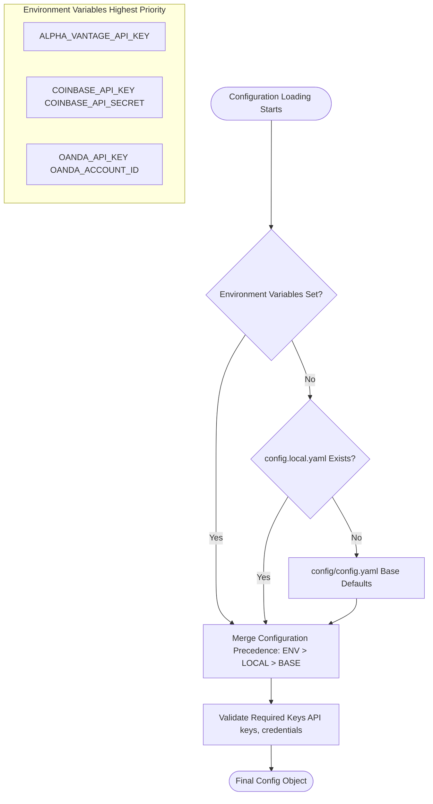
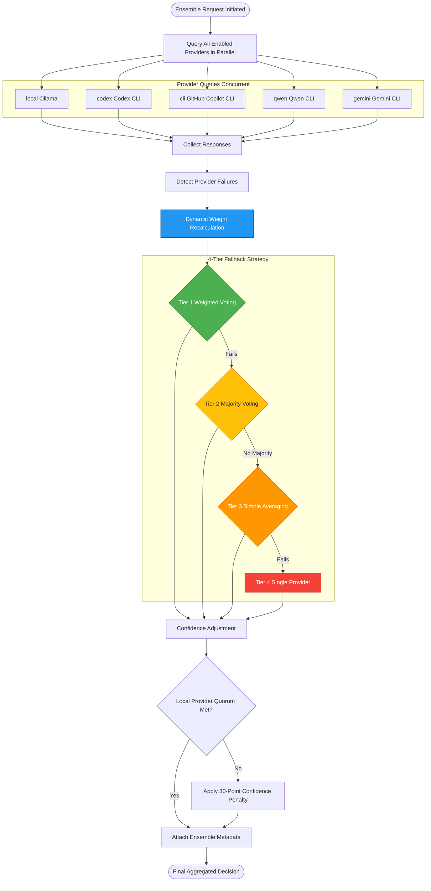

# Finance Feedback Engine 2.0
# Ensemble Decision Aggregation

## Aggregation Flow and Metadata (Comprehensive)


> **AI-Powered Trading Decision Tool** - A modular, plug-and-play finance tool for automated portfolio simulation and trading decisions using AI models and real-time market data.

## 🚀 Features

- **🔌 Plug-and-Play Architecture**: Easy to set up and configure
- **📊 Real-Time Market Data**: Integration with Alpha Vantage Premium API
- **🤖 AI-Powered Decisions**: Support for local AI models and CLI-based AI tools
- **🎭 Ensemble Mode**: Combine multiple AI providers with intelligent voting 🆕
  - **Dynamic Weight Adjustment**: Automatically handles provider failures
  - **Resilient Operation**: Continues working even when some providers are down
  - **Transparent Metadata**: Full visibility into provider health and decisions
  - **Debate Mode**: Structured debate between bullish/bearish advocates with impartial judge 🆕
- **💱 Multi-Asset Support**: Trade cryptocurrencies (BTC, ETH) and forex pairs (EUR/USD, etc.)
- **🏦 Multi-Platform Integration**: 
  - Coinbase Advanced with **Real Portfolio Tracking** 🆕
  - Oanda (Forex) with **Position & Margin Tracking** 🆕
  - Easily extensible for new platforms
- **💼 Portfolio Awareness**: AI sees your actual holdings for context-aware recommendations 🆕
- **📊 Long-Term Performance Tracking**: AI analyzes 90-day portfolio performance for better decisions 🆕
  - **Realized P&L**: Total profit/loss over extended period
  - **Win Rate & Profit Factor**: Historical success metrics
  - **Performance Momentum**: Detects improving/declining trends
  - **Risk-Adjusted Returns**: Sharpe ratio for professional-grade analysis
- **🔍 Live Trade Monitoring**: Automatic detection and tracking of open positions 🆕
  - **Real-time P&L Tracking**: Monitor unrealized profits/losses as they happen
  - **Thread-Safe**: Max 2 concurrent trades with dedicated monitoring threads
  - **ML Feedback Loop**: Completed trades feed back into AI for continuous learning
  - **Comprehensive Metrics**: Exit reasons, holding time, peak P&L, max drawdown
- **📊 Position Sizing**: Automatic position sizing with 1% risk / 2% stop loss defaults 🆕

*Diagram: Comprehensive ensemble decision aggregation flow, including provider input, aggregation, fallback, dynamic weight adjustment, and detailed metadata. See [ENSEMBLE_FALLBACK_QUICKREF.md](ENSEMBLE_FALLBACK_QUICKREF.md) for further details.*
  - **Smart Signal-Only Mode**: Provides trading signals without position sizing when portfolio data unavailable 🆕
  - **Risk Management**: Calculates appropriate position sizes based on account balance
- **💾 Persistent Decision Storage**: Track all trading decisions with timestamps
- **⚙️ Modular Design**: Each component can be customized or replaced
- **📈 Balance Management**: Real-time account balance and allocation tracking
- **🎯 CLI Interface**: Rich command-line interface for easy interaction
- **📱 Telegram Approvals** (Optional): Mobile approval workflow for human-in-the-loop trading 🆕
  - **REST API**: FastAPI-based web service for webhooks and monitoring
  - **Redis Queue**: Persistent approval queue with auto-recovery
  - **Auto-Setup**: One-command Redis installation and configuration
  - **CLI Independence**: Web service is fully optional - CLI works standalone

## 🏗️ System Architecture Overview

### Complete Data Flow & Component Interaction


**Data Flow Summary:**
1. **Analysis Request** → CLI/Agent invokes `FinanceFeedbackEngine.analyze_asset()`
2. **Data Gathering** → Alpha Vantage provides multi-timeframe market data + sentiment
3. **Regime Detection** → ADX/ATR classifies market conditions (trending/ranging/volatile)
4. **Decision Generation** → AI providers analyze context, ensemble aggregates recommendations
5. **Risk Validation** → RiskGatekeeper checks drawdown, VaR, position concentration
6. **Execution** → Platform factory routes to Coinbase/Oanda/Mock with circuit breaker protection
7. **Monitoring** → TradeMonitor detects positions, tracks real-time P&L
8. **Learning** → Completed trades feed PortfolioMemoryEngine for continuous improvement

**New in 2.0:** Optional web service layer enables mobile approvals via Telegram bot. This is **completely optional** - all core features work in CLI-only mode. [Learn more →](docs/WEB_SERVICE_MIGRATION.md)

## 📋 Requirements

### Core Requirements
- Python 3.8+
- Alpha Vantage API key (premium recommended)
- Trading platform credentials (Coinbase, Oanda, etc.)

**Sentiment Source:** News sentiment uses Alpha Vantage `NEWS_SENTIMENT`; no Twitter or on-chain dependencies are required.

### Optional Web Service (Telegram Approvals) 🆕
- Redis 5.x+ (auto-setup available)
- Telegram bot token (from @BotFather)
- HTTPS domain (production) or ngrok (development)

**Note:** Web service is **optional** - CLI mode works independently. See [Web Service Migration Guide](docs/WEB_SERVICE_MIGRATION.md) for details.

## 🔧 Installation

### 1. Clone the repository

```bash
git clone https://github.com/Three-Rivers-Tech/finance_feedback_engine-2.0.git
cd finance_feedback_engine-2.0
```

### 2. Install dependencies

```bash
pip install -r requirements.txt
```

**Note on Technical Indicators (pandas-ta):**
The multi-timeframe pulse system uses **pandas-ta** for technical analysis:
- ✅ **Pure Python** - No compilation required (unlike TA-Lib)
- ✅ **Python 3.13 Compatible** - Works with latest Python versions
- ✅ **No System Dependencies** - No need for C libraries or build tools
- ✅ **Easy Deployment** - Simpler installation on cloud/Docker

This is automatically installed via `requirements.txt` but can be installed separately:
```bash
pip install pandas-ta>=0.4.71b0
```

Or install in development mode:

```bash
pip install -e .
```

### 3. Configure the engine

Copy the example configuration and edit with your credentials:

```bash
cp config/config.yaml config/config.local.yaml
```

### Configuration Loading Hierarchy

**Precedence:** Environment Variables > `config.local.yaml` > `config/config.yaml` (defaults)



### Multi-Timeframe Technical Analysis 🆕

The engine analyzes **6 timeframes simultaneously** to detect cross-timeframe patterns and confluence:

**Timeframes:** 1-min, 5-min, 15-min, 1-hour, 4-hour, daily


**Indicators:** RSI, MACD, Bollinger Bands, ADX, ATR (per timeframe)

**Features:**
- **Confluence Detection**: Identifies when multiple timeframes agree on direction
- **Regime-Aware**: Different strategies for trending vs. ranging markets  
- **Volatility Context**: ATR provides risk-adjusted position sizing inputs
- **Reduced False Signals**: Cross-timeframe validation filters noise
- **LLM-Optimized**: Natural language summaries for better AI comprehension

**Pulse System Benefits:**
- **Confluence Detection**: Identifies when multiple timeframes agree on direction
- **Regime-Aware**: Different strategies for trending vs. ranging markets  
- **Volatility Context**: ATR provides risk-adjusted position sizing inputs
- **Reduced False Signals**: Cross-timeframe validation filters noise
- **LLM-Optimized**: Natural language summaries for better AI comprehension

See [MULTI_TIMEFRAME_PULSE_COMPLETE.md](MULTI_TIMEFRAME_PULSE_COMPLETE.md) for implementation details.
### Ensemble Mode: Multi-Provider AI Aggregation 🆕

Combine multiple AI providers for more robust decisions with intelligent fallback strategies:

```bash
# Analyze with ensemble mode (combines all providers)
python main.py analyze BTCUSD --provider ensemble
```

#### Ensemble Decision Aggregation Flow



**Features:**
- **Intelligent Voting**: Combines decisions from multiple AI providers using weighted voting (Tier 1)
- **Dynamic Weight Adjustment**: Automatically renormalizes weights when providers fail
- **4-Tier Fallback**: Progressive degradation (weighted → majority → averaging → single provider)
- **Resilient**: Continues working even when most providers are unavailable
- **Transparent**: Full metadata shows which providers succeeded/failed and how weights were adjusted
- **Quorum Protection**: Requires minimum 3 local providers; applies 30% confidence penalty if not met

**Example metadata when one provider fails:**
```json
{
  "ensemble_metadata": {
    "providers_used": ["local", "codex", "qwen"],
    "providers_failed": ["gemini"],
    "adjusted_weights": {"local": 0.333, "codex": 0.333, "qwen": 0.333},
    "fallback_tier": 1,
    "quorum_penalty_applied": false
  }
}
```

See [docs/DYNAMIC_WEIGHT_ADJUSTMENT.md](docs/DYNAMIC_WEIGHT_ADJUSTMENT.md) and [docs/ENSEMBLE_FALLBACK_SYSTEM.md](docs/ENSEMBLE_FALLBACK_SYSTEM.md) for complete details.

### AI Provider Options

The engine supports five AI providers:

1. **Ensemble** (`--provider ensemble`): Combines multiple providers with weighted voting 🆕
   - Automatically handles provider failures
   - Configurable weights and voting strategies
   - Best for production use with high reliability

2. **Codex CLI** (`--provider codex`): Uses the local Codex CLI tool (no API charges)
  - Install: `npm install -g @openai/codex` or from https://github.com/openai/codex
   - Runs locally without token costs

3. **GitHub Copilot CLI** (`--provider cli`): Uses GitHub Copilot CLI
  - Install: Follow [Copilot CLI setup](https://docs.github.com/en/copilot/how-tos/set-up/install-copilot-cli)
   - Requires GitHub Copilot subscription

4. **Qwen CLI** (`--provider qwen`): Uses free Qwen CLI tool
   - Install: Requires Node.js v20+ and OAuth authentication
   - Command: `qwen`
   - Free to use

5. **Gemini CLI** (`--provider gemini`): Uses free Google Gemini CLI
   - Install: `npm install -g @google/gemini-cli` (requires Node.js v20+)
   - Authentication: OAuth (60 req/min, 1000 req/day) or API key (100 req/day)
   - Free tier with Gemini 2.5 Pro access

6. **Local** (`--provider local`): Simple rule-based decisions
   - No setup required
   - Good for testing and fallback

### Autonomous Trading Agent 🆕

Run the autonomous agent with continuous OODA (Observe-Orient-Decide-Act) loop:

```bash
python main.py run-agent --take-profit 0.05 --stop-loss 0.02 --max-daily-trades 5
```

#### Agent State Machine with Position Recovery


**Agent Features:**
- **Position Recovery on Startup**: Automatically discovers open positions from platform and rebuilds state
- **OODA Loop**: Continuous Observe → Orient (Learning) → Decide (Reasoning) → Act (Execution) cycle
- **Kill-Switch Protection**: Halts trading if portfolio P&L breaches loss threshold
- **Retry Logic**: Exponential backoff for transient failures (3 attempts per asset)
- **Failure Tracking**: Per-asset failure counters with time-based decay
- **Daily Limits**: Configurable max trades per day with automatic midnight reset
- **Risk Gatekeeper**: Final validation before execution (drawdown, VaR, correlation)
- **Memory Integration**: Learns from closed trades via PortfolioMemoryEngine

See [AGENTIC_LOOP_WORKFLOW.md](AGENTIC_LOOP_WORKFLOW.md) and [agent/trading_loop_agent.py](finance_feedback_engine/agent/trading_loop_agent.py) for details.

### Live Trade Monitoring 🆕

#### Monitoring Architecture & Thread Management


---

## 🏗️ Architecture

The Finance Feedback Engine is built with a modular architecture:

```
finance_feedback_engine/
├── core.py                    # Main engine orchestrator
├── data_providers/            # Market data providers
│   └── alpha_vantage_provider.py
├── trading_platforms/         # Trading platform integrations
│   ├── base_platform.py       # Abstract base class
│   ├── coinbase_platform.py   # Coinbase implementation
│   ├── oanda_platform.py      # Oanda implementation
│   └── platform_factory.py    # Platform factory
├── decision_engine/           # AI-powered decision making
│   └── engine.py
├── persistence/               # Decision storage
│   └── decision_store.py
└── cli/                       # Command-line interface
    └── main.py
```

### Platform Factory & Circuit Breaker Pattern

The Finance Feedback Engine uses a factory pattern for platform creation and circuit breaker pattern for resilient API execution.

#### Platform Class Hierarchy

**[View platform class hierarchy diagram →](docs/diagrams/platform_hierarchy.mmd)**

**Core classes:**
- `BaseTradingPlatform` (abstract) - Base interface for all platforms
- `CoinbaseAdvancedPlatform` - Coinbase futures trading
- `OandaPlatform` - Oanda forex trading
- `UnifiedTradingPlatform` - Multi-platform aggregation
- `MockPlatform` - Mock trading for testing

#### Circuit Breaker State Machine


**Circuit Breaker Configuration:**
- `failure_threshold`: Number of failures before opening circuit (default: 3)
- `recovery_timeout`: Seconds to wait before testing recovery (default: 60)
- `expected_exception`: Exception type to catch (default: `aiohttp.ClientError`)

**Usage Pattern:**
- **[Asset Pair Validation](docs/ASSET_PAIR_VALIDATION.md)** - Flexible asset pair formats
- **[Oanda Integration](docs/OANDA_INTEGRATION.md)** - Forex trading setup
- **[Ensemble System](docs/ENSEMBLE_SYSTEM.md)** - Multi-provider AI aggregation
- **[Multi-Timeframe Pulse](MULTI_TIMEFRAME_PULSE_COMPLETE.md)** - Technical analysis system
- **[Autonomous Agent](AGENTIC_LOOP_WORKFLOW.md)** - OODA loop implementation

## Circuit Breaker Protection for `execute_trade()`

`execute_trade()` is protected by a circuit breaker to prevent cascading failures and ensure resilient API execution.

**Lifecycle:**
- **CLOSED:** Normal operation, tracks failures
- **OPEN:** After 3 failures, blocks all calls for 60 seconds
- **HALF_OPEN:** After timeout, allows one test call
- **Transition:** Success returns to CLOSED; failure returns to OPEN

See [finance_feedback_engine/trading_platforms/](finance_feedback_engine/trading_platforms/) and [utils/circuit_breaker.py](finance_feedback_engine/utils/circuit_breaker.py) for implementation details.
```

See [finance_feedback_engine/trading_platforms/](finance_feedback_engine/trading_platforms/) for implementation details.

### Directory Structure

```
finance_feedback_engine/
├── core.py                    # Main engine orchestrator
├── data_providers/            # Market data providers
│   ├── alpha_vantage_provider.py
│   ├── unified_data_provider.py      # Multi-timeframe aggregation
│   └── timeframe_aggregator.py       # Technical indicators
├── trading_platforms/         # Trading platform integrations
│   ├── base_platform.py       # Abstract base class
│   ├── coinbase_platform.py   # Coinbase implementation
│   ├── oanda_platform.py      # Oanda implementation
│   ├── unified_platform.py    # Multi-platform aggregation
│   └── platform_factory.py    # Platform factory
├── decision_engine/           # AI-powered decision making
│   ├── engine.py              # Prompt builder, position sizing
│   └── ensemble_manager.py    # Multi-provider voting
├── agent/                     # Autonomous trading
│   ├── trading_loop_agent.py  # OODA state machine
│   └── config.py              # Agent configuration
├── monitoring/                # Live trade tracking
│   ├── trade_monitor.py       # Main monitoring orchestrator
│   ├── trade_tracker.py       # Per-trade thread
│   ├── metrics_collector.py   # Performance data
│   └── monitoring_context_provider.py  # Pulse integration
├── memory/                    # ML feedback loop
│   └── portfolio_memory.py    # Experience buffer
├── risk/                      # Risk management
│   └── gatekeeper.py          # Validation rules
├── persistence/               # Decision storage
│   └── decision_store.py
├── utils/                     # Shared utilities
│   ├── circuit_breaker.py     # Resilience pattern
│   ├── validation.py          # Asset pair standardization
│   └── market_regime_detector.py  # ADX/ATR classification
└── cli/                       # Command-line interface
    └── main.py
```


**Monitoring Features:**
- **Automatic Detection**: Scans platform for new positions every 30s
- **Thread-Safe Tracking**: Max 2 concurrent positions with dedicated threads
- **Real-Time Updates**: Live P&L, peak profit, max drawdown tracking
- **Exit Classification**: Detects take-profit, stop-loss, or manual exits
- **ML Feedback**: Completed trades → PortfolioMemoryEngine → DecisionEngine context
- **Overflow Handling**: Pending queue for positions when slots are full
- **Metrics Storage**: Persistent JSON records in `data/trade_metrics/`
- **Position Awareness**: MonitoringContextProvider injects active positions into AI prompts

See [docs/LIVE_MONITORING_QUICKREF.md](docs/LIVE_MONITORING_QUICKREF.md) for full details.
        
        SendOrder --> LogFailure: Execution Error
        LogFailure --> EXECUTION_FAILED
        
        note right of SendOrder: Circuit breaker<br/>protects against<br/>API failures
    }
    
    EXECUTION --> LEARNING: Trade Executed
    EXECUTION_FAILED --> PERCEPTION: Retry Next Cycle
    
    state HALT {
        [*] --> StopAgent
        StopAgent --> [*]: is_running = False
    }
    
    HALT --> [*]: Agent Stopped
    
    note left of STARTUP: On agent start -<br/>1. Query platform for open positions<br/>2. Recover position metadata<br/>3. Generate synthetic decisions<br/>4. Rebuild memory from platform truth<br/>5. Associate with trade monitor
    
    note right of IDLE: Default 300s<br/>5 minutes between cycles
    
    note right of LEARNING: Closed trades queued by<br/>TradeMonitor when positions exit
    
    note right of PERCEPTION: Kill-switch protects against<br/>runaway losses
    
    note right of REASONING: Analyzes multiple assets<br/>per cycle with retry logic
    
    note right of RISK_CHECK: Final safety gate before<br/>execution
    
    note right of EXECUTION: Monitored by TradeMonitor<br/>for live P&L tracking
    
    style STARTUP fill:#00BCD4,stroke:#006064,color:#fff
    style POSITION_RECOVERY fill:#00BCD4,stroke:#006064,color:#fff
    style IDLE fill:#9E9E9E,stroke:#424242,color:#fff
    style LEARNING fill:#4CAF50,stroke:#2E7D32,color:#fff
    style PERCEPTION fill:#2196F3,stroke:#0D47A1,color:#fff
    style REASONING fill:#FF9800,stroke:#E65100,color:#fff
    style RISK_CHECK fill:#FFC107,stroke:#F57C00,color:#333
    style EXECUTION fill:#9C27B0,stroke:#4A148C,color:#fff
    style HALT fill:#F44336,stroke:#C62828,color:#fff
    style EXECUTION_FAILED fill:#F44336,stroke:#C62828,color:#fff
```

**Agent Features:**
- **Position Recovery on Startup**: Automatically discovers open positions from platform and rebuilds state
- **OODA Loop**: Continuous Observe → Orient (Learning) → Decide (Reasoning) → Act (Execution) cycle
- **Kill-Switch Protection**: Halts trading if portfolio P&L breaches loss threshold
- **Retry Logic**: Exponential backoff for transient failures (3 attempts per asset)
- **Failure Tracking**: Per-asset failure counters with time-based decay
- **Daily Limits**: Configurable max trades per day with automatic midnight reset
- **Risk Gatekeeper**: Final validation before execution (drawdown, VaR, correlation)
- **Memory Integration**: Learns from closed trades via PortfolioMemoryEngine

See [AGENTIC_LOOP_WORKFLOW.md](AGENTIC_LOOP_WORKFLOW.md) and [agent/trading_loop_agent.py](finance_feedback_engine/agent/trading_loop_agent.py) for details.
        P5[gemini<br/>Gemini CLI]
    end
    
    COLLECT{Collect<br/>Responses}
    DETECT[Detect Provider Failures]
    
    CALC_WEIGHTS[Dynamic Weight Recalculation<br/>Renormalize Active Provider Weights]
    
    subgraph "4-Tier Fallback Strategy"
        direction TB
        T1{Tier 1:<br/>Weighted Voting}
        T2{Tier 2:<br/>Majority Voting}
        T3{Tier 3:<br/>Simple Averaging}
        T4[Tier 4:<br/>Single Provider<br/>Highest Confidence]
        
        T1 -->|Fails or<br/>No Weights| T2
        T2 -->|No Majority| T3
        T3 -->|Fails| T4
    end
    
    CONFIDENCE[Confidence Adjustment<br/>Factor = 0.7 + 0.3 * active ratio]
    QUORUM{Local Provider<br/>Quorum Met?<br/>min 3}
    PENALTY[Apply 30% Confidence Penalty<br/>Add WARNING to reasoning]
    
    META[Attach Ensemble Metadata<br/>providers_used, providers_failed,<br/>adjusted_weights, fallback_tier]
    
    DECISION([Final Aggregated Decision])
    
    START --> QUERY
    QUERY --> P1 & P2 & P3 & P4 & P5
    P1 & P2 & P3 & P4 & P5 --> COLLECT
    COLLECT --> DETECT
    
    DETECT -->|Failures Detected| CALC_WEIGHTS
    DETECT -->|All Success| CALC_WEIGHTS
    
    CALC_WEIGHTS --> T1
    T1 -->|Success| CONFIDENCE
    T2 -->|Success| CONFIDENCE
    T3 -->|Success| CONFIDENCE
    T4 --> CONFIDENCE
    
    CONFIDENCE --> QUORUM
    QUORUM -->|Yes| META
    QUORUM -->|No| PENALTY
    PENALTY --> META
    META --> DECISION
    
    subgraph "Example: Weight Adjustment"
        direction LR
        ORIG[Original Weights<br/>local: 0.25, cli: 0.25,<br/>codex: 0.25, qwen: 0.25]
        FAIL[cli FAILED]
        ACTIVE[Active Sum = 0.75<br/>3/4 providers]
        ADJ[Adjusted Weights<br/>local: 0.333 at 0.25/0.75<br/>codex: 0.333<br/>qwen: 0.333]
        
        ORIG --> FAIL --> ACTIVE --> ADJ
    end
    
    style T1 fill:#4CAF50,stroke:#2E7D32,color:#fff
    style T2 fill:#FFC107,stroke:#F57C00,color:#333
    style T3 fill:#FF9800,stroke:#E65100,color:#fff
    style T4 fill:#F44336,stroke:#C62828,color:#fff
    style CALC_WEIGHTS fill:#2196F3,stroke:#0D47A1,color:#fff
    style PENALTY fill:#FF5722,stroke:#BF360C,color:#fff
    style ADJ fill:#9C27B0,stroke:#4A148C,color:#fff
    
    click CALC_WEIGHTS "https://github.com/Three-Rivers-Tech/finance_feedback_engine-2.0/blob/main/finance_feedback_engine/decision_engine/ensemble_manager.py#L350" "View weight calculation"
    click T1 "https://github.com/Three-Rivers-Tech/finance_feedback_engine-2.0/blob/main/docs/ENSEMBLE_FALLBACK_SYSTEM.md" "Fallback documentation"
```

**Features:**
- **Intelligent Voting**: Combines decisions from multiple AI providers using weighted voting (Tier 1)
- **Dynamic Weight Adjustment**: Automatically renormalizes weights when providers fail
- **4-Tier Fallback**: Progressive degradation (weighted → majority → averaging → single provider)
- **Resilient**: Continues working even when most providers are unavailable
- **Transparent**: Full metadata shows which providers succeeded/failed and how weights were adjusted
- **Quorum Protection**: Requires minimum 3 local providers; applies 30% confidence penalty if not met

**Example metadata when one provider fails:**
```json
{
  "ensemble_metadata": {
    "providers_used": ["local", "codex", "qwen"],
    "providers_failed": ["cli"],
    "weight_adjustment_applied": true,
    "adjusted_weights": {"local": 0.333, "codex": 0.333, "qwen": 0.333},
    "fallback_tier": "weighted_voting",
    "quorum_penalty_applied": false
  }
}
```

See [docs/DYNAMIC_WEIGHT_ADJUSTMENT.md](docs/DYNAMIC_WEIGHT_ADJUSTMENT.md) and [docs/ENSEMBLE_FALLBACK_SYSTEM.md](docs/ENSEMBLE_FALLBACK_SYSTEM.md) for complete details.
Edit `config/config.local.yaml` and add your:
- Alpha Vantage API key
- Trading platform credentials
- AI provider settings

## 🎯 Quick Start

### Analyze an Asset

**Flexible Input Formats** - Enter asset pairs in any format you prefer! 🆕

```bash
# Using default AI provider (from config)
python main.py analyze BTCUSD        # Standard format
python main.py analyze btc-usd       # Lowercase with dash
python main.py analyze BTC_USD       # Underscore separator
python main.py analyze "BTC/USD"     # Slash separator (quotes needed)

# Using specific AI provider
python main.py analyze BTCUSD --provider codex    # Codex CLI (local, no API charges)
python main.py analyze btc-usd --provider cli     # GitHub Copilot CLI (any format works!)
python main.py analyze eur_usd --provider qwen    # Qwen CLI (free, requires Node.js v20+)
# python main.py analyze BTCUSD --provider gemini   # Gemini CLI (disabled by default - see AI_PROVIDERS.md for activation)
python main.py analyze ETHUSD --provider local    # Local rule-based
python main.py analyze gbp-jpy --provider ensemble # Multi-provider voting 🆕
```

All asset pair formats are automatically standardized to uppercase without separators for API compatibility. See [docs/ASSET_PAIR_VALIDATION.md](docs/ASSET_PAIR_VALIDATION.md) for details.

### Check Account Balance

```bash
python main.py balance
```

### View Portfolio Dashboard 🆕

```bash
# Show unified dashboard aggregating all platforms
python main.py dashboard
```

The dashboard displays:
- Total portfolio value across all platforms
- Asset count and holdings breakdown
- Per-platform allocation percentages
- Real-time data from Coinbase, Oanda, etc.

For detailed dashboard documentation, see [docs/LIVE_MONITORING_QUICKREF.md](docs/LIVE_MONITORING_QUICKREF.md).

### View Decision History

```bash
python main.py history --limit 20
```

### Filter by Asset

```bash
python main.py history --asset EURUSD
```

### Execute a Decision

```bash
python main.py execute <decision_id>
```

### Check Engine Status

```bash
python main.py status
```

### Backtesting & Simulations

Run historical and robustness analyses directly from the CLI.

```bash
# AI-driven backtest with defaults from config.advanced_backtesting
python main.py backtest BTCUSD --start 2024-01-01 --end 2024-02-01 \
  --initial-balance 10000 --fee-percentage 0.001 --slippage-percentage 0.0001

# Walk-forward analysis (rolling train/test windows with overfitting check)
python main.py walk-forward BTCUSD --start-date 2024-01-01 --end-date 2024-03-01 --train-ratio 0.7

# Monte Carlo simulation with price perturbations
python main.py monte-carlo BTCUSD --start-date 2024-01-01 --end-date 2024-03-01 \
  --simulations 500 --noise-std 0.001
```

Notes:
- Backtest accepts overrides for fees, slippage, commission, stop-loss, take-profit, and starting balance; set `trading_platform: mock` for dry runs.
- Walk-forward windows auto-derive from the date range; ensure the span is long enough for both train and test windows (≥7-day train recommended).
- Monte Carlo perturbs prices; inspect VaR/percentiles to understand tail risk.

### Signal-Only Mode & Position Sizing

- Default sizing targets ~1% portfolio risk with a ~2% stop loss; overrides available via config.
- If balance is unavailable or `signal_only_default: true`, decisions return signals without position sizes (`signal_only: true`).
- View suggested amounts, stop loss, and take profit in `analyze` output; size is skipped in signal-only scenarios.

### Live Trade Monitoring 🆕

**Note**: Monitor commands are gated for safety. To use manual CLI commands, set `monitoring.manual_cli: true` in your config (not recommended for production).

**Recommended Approach**: Use the integrated monitoring context that auto-starts via `config.monitoring.enabled: true` and provides real-time position awareness to the AI decision engine. Alternatively, use the multi-platform dashboard for portfolio aggregation.

**Legacy Manual Commands** (requires `monitoring.manual_cli: true`):

```bash
python main.py monitor start
```

Monitor detects and tracks trades automatically:
- Polls for new positions every 30s
- Updates prices and P&L in real-time
- Records metrics when trades close
- Feeds outcomes back to AI for learning

Check monitoring status:

```bash
python main.py monitor status
```

View performance metrics:

```bash
python main.py monitor metrics
```

See [docs/LIVE_TRADE_MONITORING.md](docs/LIVE_TRADE_MONITORING.md) for full details.

## 📖 Configuration

### Configuration File Structure

```yaml
# Alpha Vantage API
alpha_vantage_api_key: "YOUR_API_KEY"

# Trading Platform
trading_platform: "coinbase"  # or "oanda"

# Platform Credentials
platform_credentials:
  api_key: "YOUR_PLATFORM_API_KEY"
  api_secret: "YOUR_PLATFORM_SECRET"

# Decision Engine
decision_engine:
  ai_provider: "local"  # Options: "local", "cli" (GitHub Copilot), "codex" (Codex CLI)
  model_name: "default"
  decision_threshold: 0.7

# Persistence
persistence:
  storage_path: "data/decisions"
  max_decisions: 1000
```

### Supported Trading Platforms

#### Coinbase Advanced
```yaml
trading_platform: "coinbase"
platform_credentials:
  api_key: "YOUR_COINBASE_API_KEY"
  api_secret: "YOUR_COINBASE_API_SECRET"
  passphrase: "YOUR_PASSPHRASE"
```

#### Oanda (Forex)
```yaml
trading_platform: "oanda"
platform_credentials:
  api_key: "YOUR_OANDA_API_KEY"
  account_id: "YOUR_ACCOUNT_ID"
  environment: "practice"  # or "live"
```

## 🤖 AI Integration

### Local AI Models

Configure to use local AI models (e.g., Ollama, LLaMA):

```yaml
decision_engine:
  ai_provider: "local"
  model_name: "llama2"
```

### CLI-Based AI

Use external AI tools via command-line:

```yaml
decision_engine:
  ai_provider: "cli"
  model_name: "trading_advisor"
```

### Extending AI Providers

The decision engine is designed to be extended. You can add your own AI providers by:

1. Implementing the `_query_ai()` method in `decision_engine/engine.py`
2. Adding provider-specific logic for inference
3. Supporting OpenAI, Anthropic, or any other AI service

## 🔐 Security Best Practices

- **Never commit API keys**: Use environment variables or local config files
- **Use `.gitignore`**: Config files with credentials should be gitignored
- **Practice accounts**: Start with sandbox/practice accounts
- **API key permissions**: Use read-only keys when possible
- **Secure storage**: Store credentials securely (use `.env` files)

## 📊 Supported Assets

### Cryptocurrencies
- BTCUSD (Bitcoin)
- ETHUSD (Ethereum)
- Any crypto pair supported by Alpha Vantage

### Forex Pairs
- EURUSD
- GBPUSD
- USDJPY
- Any forex pair supported by Alpha Vantage

## 🛠️ Development

### Adding a New Trading Platform

1. Create a new class inheriting from `BaseTradingPlatform`
2. Implement required methods: `get_balance()`, `execute_trade()`, `get_account_info()`
3. Register the platform in `platform_factory.py`

Example:

```python
from finance_feedback_engine.trading_platforms import BaseTradingPlatform, PlatformFactory

class MyPlatform(BaseTradingPlatform):
    def get_balance(self):
        # Implementation
        pass
    
    def execute_trade(self, decision):
        # Implementation
        pass
    
    def get_account_info(self):
        # Implementation
        pass

# Register the platform
PlatformFactory.register_platform('my_platform', MyPlatform)
```

### Customizing the Decision Engine

Modify `finance_feedback_engine/decision_engine/engine.py` to:
- Add custom trading strategies
- Integrate different AI models
- Implement advanced technical analysis
- Add risk management rules

## 📝 Decision Storage

All trading decisions are stored as JSON files in the configured storage path (default: `data/decisions/`). Each decision includes:

- Decision ID
- Asset pair
- Action (BUY/SELL/HOLD)
- Confidence level
- AI reasoning
- Market data snapshot
- Balance snapshot
- Timestamp
- Execution status

## 🔍 Example Decision Output

```json
{
  "id": "550e8400-e29b-41d4-a716-446655440000",
  "asset_pair": "BTCUSD",
  "timestamp": "2024-01-15T14:30:00.000Z",
  "action": "BUY",
  "confidence": 75,
  "reasoning": "Price dropped, good buying opportunity.",
  "suggested_amount": 0.1,
  "market_data": {
    "close": 45000.0,
    "high": 46000.0,
    "low": 44500.0
  },
  "executed": false
}
```

## 🚦 Roadmap

- [ ] Add more trading platforms (Binance, Kraken, etc.)
- [x] **Long-term portfolio performance tracking** (see `docs/LONG_TERM_PERFORMANCE.md`) ✅
- [x] Implement backtesting functionality (AI-driven + simulations)
- [x] Create web dashboard (portfolio aggregation)
- [ ] Add portfolio management features
- [ ] Add real-time WebSocket support
- [ ] Implement advanced AI models integration
- [ ] Add risk management strategies
- [ ] Create mobile app
 - [ ] Two-phase ensemble escalation (free→premium) with budget limits 🆕
 - [ ] Telegram notifications for Phase 1 failures and trade executions 🆕
 - [ ] Adaptive Phase 1 threshold tuning based on premium provider value-add 🆕
- [ ] Exit codes & troubleshooting guide for CLI commands

## 📚 Documentation

- **[Long-Term Performance Tracking](docs/LONG_TERM_PERFORMANCE.md)** - 90-day portfolio metrics for AI decision-making 🆕
- **[AI Providers](docs/AI_PROVIDERS.md)** - Guide to available AI providers
- **[Live Trade Monitoring](docs/LIVE_MONITORING_QUICKREF.md)** - Real-time position tracking with thread-safe monitoring
- **[Portfolio Memory Engine](docs/PORTFOLIO_MEMORY_ENGINE.md)** - ML feedback loop system
- **[Signal-Only Mode](docs/SIGNAL_ONLY_MODE.md)** - Trading signals without execution
- **Backtesting & Simulation (README)** - See "Backtesting & Simulations" and Monte Carlo/WFA quick-start examples
- **[Asset Pair Validation](docs/ASSET_PAIR_VALIDATION.md)** - Flexible asset pair formats
- **[Oanda Integration](docs/OANDA_INTEGRATION.md)** - Forex trading setup
- **[Ensemble System](docs/ENSEMBLE_FALLBACK_SYSTEM.md)** - Multi-provider AI aggregation with 4-tier fallback
- **[Multi-Timeframe Pulse](docs/MULTI_TIMEFRAME_PULSE_COMPLETE.md)** - Technical analysis system (6 timeframes, 5 indicators)
- **[Autonomous Agent](docs/AGENTIC_LOOP_WORKFLOW.md)** - OODA loop with position recovery and state machine

## 🤝 Contributing

Contributions are welcome! Please feel free to submit a Pull Request.

## 📄 License

This project is licensed under the Apache License 2.0 - see the [LICENSE](LICENSE) file for details.

## ⚠️ Disclaimer

This software is for educational and research purposes only. **Do not use it for actual trading without proper testing and risk assessment.** Trading cryptocurrencies and forex involves substantial risk of loss. Always consult with a financial advisor before making investment decisions.

## 📧 Support

For issues, questions, or contributions, please open an issue on GitHub.

---

**Made with ❤️ by Three Rivers Tech**
